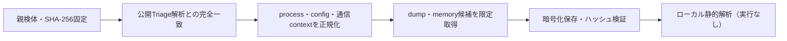

# Triage公開解析・後段取得証跡

## 完全ハッシュ一致

- [260807-wrjqyahc59](https://tria.ge/260807-wrjqyahc59): ファミリー候補 `未確定`、評価score `None`
- [260807-tdkd7s1ygz](https://tria.ge/260807-tdkd7s1ygz): ファミリー候補 `未確定`、評価score `None`
- [260807-s6g9wagm3y](https://tria.ge/260807-s6g9wagm3y): ファミリー候補 `未確定`、評価score `None`

## プロセス・通信

- 観測process: `取得できず`
- raw commandは保存せず、command SHA-256と処理patternだけをJSONへ保持します。
- sandbox background trafficは`context_only`であり、C2へ自動昇格しません。

- 取得できませんでした。

## 後段取得物

- `e09fc551db47629e28ee1f1140c502a661346d11d2511cc88e62c837f7215793` / `memory_image` / 167936 bytes / 親と同一: `false` / 静的解析: `未実施`
- `a2914da6d05a05d8e0b8cf5c3e94f0ed8e34f32d5375785cab27b6de84c65373` / `memory_image` / 167936 bytes / 親と同一: `false` / 静的解析: `未実施`
- `06eacd112c1ec02f51a7b230c34b12cd3bd87e2ab3beed69f876eddf81ecc4e3` / `memory_image` / 167936 bytes / 親と同一: `false` / 静的解析: `未実施`

## 判定境界

Triage由来のfamily、process、config、通信は外部sandbox証跡です。Config extractorが返したendpointはC2候補として扱いますが、静的設定復元またはprocess帰属とprotocol応答が揃うまでは確認済みC2とはしません。取得成果物と検体は実行していません。
