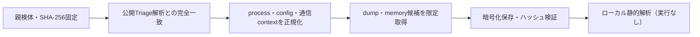

# Triage公開解析・後段取得証跡

## 完全ハッシュ一致

- [260924-ghe9tssy2l](https://tria.ge/260924-ghe9tssy2l): ファミリー候補 `未確定`、評価score `7`
- [260924-bylhwsbc72](https://tria.ge/260924-bylhwsbc72): ファミリー候補 `未確定`、評価score `10`
- [260923-rgvm8s1vgx](https://tria.ge/260923-rgvm8s1vgx): ファミリー候補 `未確定`、評価score `10`

## プロセス・通信

- 観測process: `2026-09-23_c87cdff96cf2f30bd7665a151e6ee3a5_cryptbot_icedid_luca-stealer_njrat_stealc.exe, F7Oa84.exe, NobmzY.exe, TVubMx.exe, V29zXzm.exe, ak1Cv4.exe, b14b737c48708235edb9035cc09b35a9e0e888b25c8ee6959919fb6123810c81.exe, cmd.exe, dcjm5T.exe, icacls.exe, instapp.a.1.08.exe, instapp.a.1.08.sfx.exe, net.exe, net1.exe, plF6sQ1.exe, powershell.exe, reg.exe, schtasks.exe, svchost.exe, vs2441.exe`
- raw commandは保存せず、command SHA-256と処理patternだけをJSONへ保持します。
- sandbox background trafficは`context_only`であり、C2へ自動昇格しません。

- 取得できませんでした。

## 後段取得物

- `80b24e1a59e11c3111ccbb1c2bba10c872590e0ea28e9b01a1910b9ccba73236` / `memory_image` / 57344 bytes / 親と同一: `false` / 静的解析: `partial`

## 判定境界

Triage由来のfamily、process、config、通信は外部sandbox証跡です。Config extractorが返したendpointはC2候補として扱いますが、静的設定復元またはprocess帰属とprotocol応答が揃うまでは確認済みC2とはしません。取得成果物と検体は実行していません。
