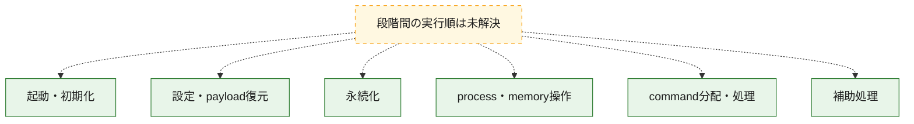
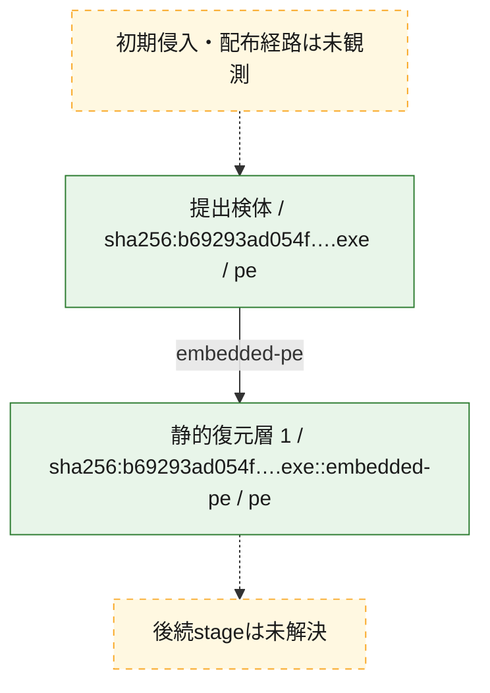
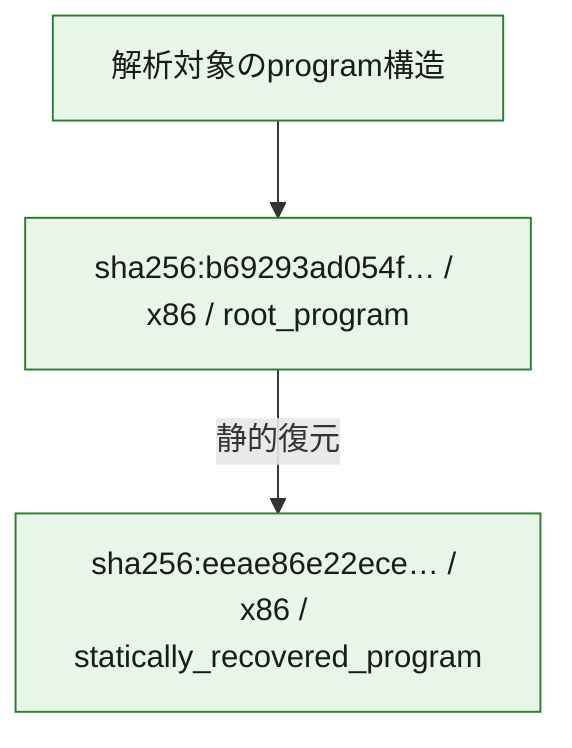

# 全体ロジック：b69293ad054fdb809db9c4303987434ef3a927bae957c48a0e095fd94d2e67ca

代表関数の静的証跡から、起動・初期化、設定・payload復元、永続化、process・memory操作、command分配・処理の処理群を確認しました。

## 読み方

- phaseの掲載順は解析上の整理順です。observed_call_edgesがない段階間の実行順を断定しません。
- 図の実線は静的に観測した関係、点線と黄色のノードは未観測・未解決の関係を示します。
- 図は静的な要約であり、動的実行を再現するものではありません。
- 詳細な関数解説とfingerprintは[STATIC-LOGIC.md](STATIC-LOGIC.md)を参照してください。

## 静的可視化

### 実行フロー

### 感染チェーン

### モジュール関係

## 処理段階

### 1. 起動・初期化

entry pointから初期化と後続処理への移行を確認します。
確度: `confirmed_static_function_evidence`

- `eeae86e22ecedc8e28548d2a1144907081dd26a13dd067183590a164749e1eab:ghidra:1005c170` — 初期化と主要処理への分岐を行う入口関数です。 状態: `succeeded`、選定理由: `entry_point`, `meaningful_symbol_name`, `reviewed_call_centrality:2`, `role:entrypoint`

### 2. 設定・payload復元

設定、resource、payload、暗号化データの復元・変換を確認します。
確度: `confirmed_static_function_evidence_with_limits`

- `eeae86e22ecedc8e28548d2a1144907081dd26a13dd067183590a164749e1eab:ghidra:1005d720` — 暗号、hash、encoding、または復号処理に関係する関数です。 状態: `limited_bad_instruction_or_flow`、選定理由: `meaningful_symbol_name`, `reviewed_call_centrality:1`, `role:cryptographic_transform`
- `eeae86e22ecedc8e28548d2a1144907081dd26a13dd067183590a164749e1eab:ghidra:1005d8c3` — 暗号、hash、encoding、または復号処理に関係する関数です。 状態: `limited_bad_instruction_or_flow`、選定理由: `meaningful_symbol_name`, `reviewed_call_centrality:1`, `role:cryptographic_transform`
- `eeae86e22ecedc8e28548d2a1144907081dd26a13dd067183590a164749e1eab:ghidra:1005db7f` — 設定、resource、payloadなどの解析・変換を行う関数です。 状態: `limited_bad_instruction_or_flow`、選定理由: `meaningful_symbol_name`, `reviewed_call_centrality:1`, `role:config_or_data_transform`
- `eeae86e22ecedc8e28548d2a1144907081dd26a13dd067183590a164749e1eab:ghidra:1005dbea` — 設定、resource、payloadなどの解析・変換を行う関数です。 状態: `limited_bad_instruction_or_flow`、選定理由: `meaningful_symbol_name`, `reviewed_call_centrality:1`, `role:config_or_data_transform`

### 3. 永続化

自動起動や永続化に関係する設定変更を確認します。
確度: `confirmed_static_function_evidence_with_limits`

- `eeae86e22ecedc8e28548d2a1144907081dd26a13dd067183590a164749e1eab:ghidra:1005d996` — 自動起動または永続化に関係する処理を含む関数です。 状態: `limited_bad_instruction_or_flow`、選定理由: `meaningful_symbol_name`, `reviewed_call_centrality:1`, `role:persistence`
- `eeae86e22ecedc8e28548d2a1144907081dd26a13dd067183590a164749e1eab:ghidra:1005d9c7` — 自動起動または永続化に関係する処理を含む関数です。 状態: `limited_bad_instruction_or_flow`、選定理由: `meaningful_symbol_name`, `reviewed_call_centrality:1`, `role:persistence`
- `eeae86e22ecedc8e28548d2a1144907081dd26a13dd067183590a164749e1eab:ghidra:1005d9d7` — 自動起動または永続化に関係する処理を含む関数です。 状態: `limited_bad_instruction_or_flow`、選定理由: `meaningful_symbol_name`, `reviewed_call_centrality:1`, `role:persistence`
- `eeae86e22ecedc8e28548d2a1144907081dd26a13dd067183590a164749e1eab:ghidra:1005db4e` — 自動起動または永続化に関係する処理を含む関数です。 状態: `limited_bad_instruction_or_flow`、選定理由: `meaningful_symbol_name`, `reviewed_call_centrality:1`, `role:persistence`
- `eeae86e22ecedc8e28548d2a1144907081dd26a13dd067183590a164749e1eab:ghidra:1005db6f` — 自動起動または永続化に関係する処理を含む関数です。 状態: `limited_bad_instruction_or_flow`、選定理由: `meaningful_symbol_name`, `reviewed_call_centrality:1`, `role:persistence`

### 4. process・memory操作

process、thread、module、memory操作と実行移行を確認します。
確度: `confirmed_static_function_evidence_with_limits`

- `eeae86e22ecedc8e28548d2a1144907081dd26a13dd067183590a164749e1eab:ghidra:1005dce0` — process、thread、module、またはmemory操作に関係する関数です。 状態: `limited_bad_instruction_or_flow`、選定理由: `meaningful_symbol_name`, `reviewed_call_centrality:1`, `role:process_or_memory_operation`
- `eeae86e22ecedc8e28548d2a1144907081dd26a13dd067183590a164749e1eab:ghidra:1005dd01` — process、thread、module、またはmemory操作に関係する関数です。 状態: `limited_bad_instruction_or_flow`、選定理由: `meaningful_symbol_name`, `reviewed_call_centrality:1`, `role:process_or_memory_operation`
- `eeae86e22ecedc8e28548d2a1144907081dd26a13dd067183590a164749e1eab:ghidra:1005dd31` — process、thread、module、またはmemory操作に関係する関数です。 状態: `limited_bad_instruction_or_flow`、選定理由: `meaningful_symbol_name`, `reviewed_call_centrality:1`, `role:process_or_memory_operation`
- `eeae86e22ecedc8e28548d2a1144907081dd26a13dd067183590a164749e1eab:ghidra:1005dd52` — process、thread、module、またはmemory操作に関係する関数です。 状態: `limited_bad_instruction_or_flow`、選定理由: `meaningful_symbol_name`, `reviewed_call_centrality:1`, `role:process_or_memory_operation`

### 5. command分配・処理

受信commandやtaskの解釈、分配、個別handlerへの移行を確認します。
確度: `confirmed_static_function_evidence_with_limits`

- `eeae86e22ecedc8e28548d2a1144907081dd26a13dd067183590a164749e1eab:ghidra:1003f560` — commandの解釈、分配、または個別処理を担当する関数です。 状態: `succeeded`、選定理由: `entry_point`, `meaningful_symbol_name`, `reviewed_call_centrality:10`, `role:command_dispatch_or_handler`
- `eeae86e22ecedc8e28548d2a1144907081dd26a13dd067183590a164749e1eab:ghidra:1005d692` — commandの解釈、分配、または個別処理を担当する関数です。 状態: `limited_bad_instruction_or_flow`、選定理由: `meaningful_symbol_name`, `reviewed_call_centrality:1`, `role:command_dispatch_or_handler`
- `eeae86e22ecedc8e28548d2a1144907081dd26a13dd067183590a164749e1eab:ghidra:1005d781` — commandの解釈、分配、または個別処理を担当する関数です。 状態: `limited_bad_instruction_or_flow`、選定理由: `meaningful_symbol_name`, `reviewed_call_centrality:1`, `role:command_dispatch_or_handler`
- `eeae86e22ecedc8e28548d2a1144907081dd26a13dd067183590a164749e1eab:ghidra:1005d7c2` — commandの解釈、分配、または個別処理を担当する関数です。 状態: `limited_bad_instruction_or_flow`、選定理由: `meaningful_symbol_name`, `reviewed_call_centrality:1`, `role:command_dispatch_or_handler`
- `eeae86e22ecedc8e28548d2a1144907081dd26a13dd067183590a164749e1eab:ghidra:1005db1d` — commandの解釈、分配、または個別処理を担当する関数です。 状態: `limited_bad_instruction_or_flow`、選定理由: `meaningful_symbol_name`, `reviewed_call_centrality:1`, `role:command_dispatch_or_handler`
- `eeae86e22ecedc8e28548d2a1144907081dd26a13dd067183590a164749e1eab:ghidra:1005db3e` — commandの解釈、分配、または個別処理を担当する関数です。 状態: `limited_bad_instruction_or_flow`、選定理由: `meaningful_symbol_name`, `reviewed_call_centrality:1`, `role:command_dispatch_or_handler`

### 6. 補助処理

主要処理を支える一般内部関数またはlibrary処理を確認します。
確度: `confirmed_static_function_evidence_with_limits`

- `eeae86e22ecedc8e28548d2a1144907081dd26a13dd067183590a164749e1eab:ghidra:10031bf0` — 検体内部の一般処理を実装する関数です。 状態: `succeeded`、選定理由: `entry_point`, `meaningful_symbol_name`, `reviewed_call_centrality:17`
- `eeae86e22ecedc8e28548d2a1144907081dd26a13dd067183590a164749e1eab:ghidra:10032140` — 検体内部の一般処理を実装する関数です。 状態: `succeeded`、選定理由: `entry_point`, `reviewed_call_centrality:1`
- `eeae86e22ecedc8e28548d2a1144907081dd26a13dd067183590a164749e1eab:ghidra:10036c90` — 検体内部の一般処理を実装する関数です。 状態: `succeeded`、選定理由: `entry_point`, `meaningful_symbol_name`, `reviewed_call_centrality:8`
- `eeae86e22ecedc8e28548d2a1144907081dd26a13dd067183590a164749e1eab:ghidra:100384e0` — 検体内部の一般処理を実装する関数です。 状態: `succeeded`、選定理由: `meaningful_symbol_name`, `reviewed_call_centrality:3`
- `eeae86e22ecedc8e28548d2a1144907081dd26a13dd067183590a164749e1eab:ghidra:1005bd24` — 検体内部の一般処理を実装する関数です。 状態: `limited_bad_instruction_or_flow`、選定理由: `meaningful_symbol_name`, `reviewed_call_centrality:1`
- `eeae86e22ecedc8e28548d2a1144907081dd26a13dd067183590a164749e1eab:ghidra:1005bd45` — 検体内部の一般処理を実装する関数です。 状態: `limited_bad_instruction_or_flow`、選定理由: `meaningful_symbol_name`, `reviewed_call_centrality:1`
- `eeae86e22ecedc8e28548d2a1144907081dd26a13dd067183590a164749e1eab:ghidra:1005bd55` — 検体内部の一般処理を実装する関数です。 状態: `limited_bad_instruction_or_flow`、選定理由: `meaningful_symbol_name`, `reviewed_call_centrality:1`
- `eeae86e22ecedc8e28548d2a1144907081dd26a13dd067183590a164749e1eab:ghidra:1005bd65` — 検体内部の一般処理を実装する関数です。 状態: `limited_bad_instruction_or_flow`、選定理由: `meaningful_symbol_name`, `reviewed_call_centrality:1`
- `eeae86e22ecedc8e28548d2a1144907081dd26a13dd067183590a164749e1eab:ghidra:1005bd75` — 検体内部の一般処理を実装する関数です。 状態: `limited_bad_instruction_or_flow`、選定理由: `meaningful_symbol_name`, `reviewed_call_centrality:1`
- `eeae86e22ecedc8e28548d2a1144907081dd26a13dd067183590a164749e1eab:ghidra:1005bd85` — 検体内部の一般処理を実装する関数です。 状態: `limited_bad_instruction_or_flow`、選定理由: `meaningful_symbol_name`, `reviewed_call_centrality:1`
- `eeae86e22ecedc8e28548d2a1144907081dd26a13dd067183590a164749e1eab:ghidra:1005d52c` — 検体内部の一般処理を実装する関数です。 状態: `limited_bad_instruction_or_flow`、選定理由: `meaningful_symbol_name`, `reviewed_call_centrality:1`
- `eeae86e22ecedc8e28548d2a1144907081dd26a13dd067183590a164749e1eab:ghidra:1005d55d` — 検体内部の一般処理を実装する関数です。 状態: `limited_bad_instruction_or_flow`、選定理由: `meaningful_symbol_name`, `reviewed_call_centrality:1`
- `b69293ad054fdb809db9c4303987434ef3a927bae957c48a0e095fd94d2e67ca:ghidra:14000d800` — 検体内部の一般処理を実装する関数です。 状態: `succeeded`、選定理由: `context_representative`, `reviewed_call_centrality:2`
- `b69293ad054fdb809db9c4303987434ef3a927bae957c48a0e095fd94d2e67ca:ghidra:14000d880` — 検体内部の一般処理を実装する関数です。 状態: `succeeded`、選定理由: `context_representative`, `reviewed_call_centrality:8`
- `b69293ad054fdb809db9c4303987434ef3a927bae957c48a0e095fd94d2e67ca:ghidra:14000db70` — 検体内部の一般処理を実装する関数です。 状態: `succeeded`、選定理由: `context_representative`, `reviewed_call_centrality:4`
- `b69293ad054fdb809db9c4303987434ef3a927bae957c48a0e095fd94d2e67ca:ghidra:14000dc60` — 検体内部の一般処理を実装する関数です。 状態: `succeeded`、選定理由: `context_representative`, `reviewed_call_centrality:10`
- `b69293ad054fdb809db9c4303987434ef3a927bae957c48a0e095fd94d2e67ca:ghidra:14000e060` — 検体内部の一般処理を実装する関数です。 状態: `succeeded`、選定理由: `context_representative`, `reviewed_call_centrality:14`
- `b69293ad054fdb809db9c4303987434ef3a927bae957c48a0e095fd94d2e67ca:ghidra:140010da0` — 検体内部の一般処理を実装する関数です。 状態: `succeeded`、選定理由: `context_representative`, `reviewed_call_centrality:1`
- `b69293ad054fdb809db9c4303987434ef3a927bae957c48a0e095fd94d2e67ca:ghidra:140010de0` — 検体内部の一般処理を実装する関数です。 状態: `succeeded`、選定理由: `context_representative`, `reviewed_call_centrality:10`
- `b69293ad054fdb809db9c4303987434ef3a927bae957c48a0e095fd94d2e67ca:ghidra:140010e70` — 検体内部の一般処理を実装する関数です。 状態: `succeeded`、選定理由: `context_representative`, `reviewed_call_centrality:10`
- `b69293ad054fdb809db9c4303987434ef3a927bae957c48a0e095fd94d2e67ca:ghidra:140010f00` — 検体内部の一般処理を実装する関数です。 状態: `succeeded`、選定理由: `context_representative`, `reviewed_call_centrality:10`
- `b69293ad054fdb809db9c4303987434ef3a927bae957c48a0e095fd94d2e67ca:ghidra:140010f90` — 検体内部の一般処理を実装する関数です。 状態: `succeeded`、選定理由: `context_representative`, `reviewed_call_centrality:10`
- `b69293ad054fdb809db9c4303987434ef3a927bae957c48a0e095fd94d2e67ca:ghidra:140011020` — 検体内部の一般処理を実装する関数です。 状態: `succeeded`、選定理由: `context_representative`, `reviewed_call_centrality:10`
- `b69293ad054fdb809db9c4303987434ef3a927bae957c48a0e095fd94d2e67ca:ghidra:1400110b0` — 検体内部の一般処理を実装する関数です。 状態: `succeeded`、選定理由: `context_representative`, `reviewed_call_centrality:10`
- `b69293ad054fdb809db9c4303987434ef3a927bae957c48a0e095fd94d2e67ca:ghidra:140011140` — 検体内部の一般処理を実装する関数です。 状態: `succeeded`、選定理由: `context_representative`, `reviewed_call_centrality:10`
- `b69293ad054fdb809db9c4303987434ef3a927bae957c48a0e095fd94d2e67ca:ghidra:1400111d0` — 検体内部の一般処理を実装する関数です。 状態: `succeeded`、選定理由: `context_representative`, `reviewed_call_centrality:10`
- `b69293ad054fdb809db9c4303987434ef3a927bae957c48a0e095fd94d2e67ca:ghidra:140011260` — 検体内部の一般処理を実装する関数です。 状態: `succeeded`、選定理由: `context_representative`, `reviewed_call_centrality:10`
- `b69293ad054fdb809db9c4303987434ef3a927bae957c48a0e095fd94d2e67ca:ghidra:1400112f0` — 検体内部の一般処理を実装する関数です。 状態: `succeeded`、選定理由: `context_representative`, `reviewed_call_centrality:10`
- `b69293ad054fdb809db9c4303987434ef3a927bae957c48a0e095fd94d2e67ca:ghidra:140011380` — 検体内部の一般処理を実装する関数です。 状態: `succeeded`、選定理由: `context_representative`, `reviewed_call_centrality:1`
- `b69293ad054fdb809db9c4303987434ef3a927bae957c48a0e095fd94d2e67ca:ghidra:1400113a0` — 検体内部の一般処理を実装する関数です。 状態: `succeeded`、選定理由: `context_representative`, `reviewed_call_centrality:1`
- `b69293ad054fdb809db9c4303987434ef3a927bae957c48a0e095fd94d2e67ca:ghidra:1400113c0` — 検体内部の一般処理を実装する関数です。 状態: `succeeded`、選定理由: `context_representative`, `reviewed_call_centrality:2`
- `b69293ad054fdb809db9c4303987434ef3a927bae957c48a0e095fd94d2e67ca:ghidra:1400113f0` — 検体内部の一般処理を実装する関数です。 状態: `succeeded`、選定理由: `context_representative`, `reviewed_call_centrality:10`
- `b69293ad054fdb809db9c4303987434ef3a927bae957c48a0e095fd94d2e67ca:ghidra:140011480` — 検体内部の一般処理を実装する関数です。 状態: `succeeded`、選定理由: `context_representative`, `reviewed_call_centrality:6`
- `b69293ad054fdb809db9c4303987434ef3a927bae957c48a0e095fd94d2e67ca:ghidra:140011520` — 検体内部の一般処理を実装する関数です。 状態: `succeeded`、選定理由: `context_representative`, `reviewed_call_centrality:2`
- `b69293ad054fdb809db9c4303987434ef3a927bae957c48a0e095fd94d2e67ca:ghidra:1400115c0` — 検体内部の一般処理を実装する関数です。 状態: `succeeded`、選定理由: `context_representative`, `reviewed_call_centrality:6`
- `b69293ad054fdb809db9c4303987434ef3a927bae957c48a0e095fd94d2e67ca:ghidra:140011660` — 検体内部の一般処理を実装する関数です。 状態: `succeeded`、選定理由: `context_representative`, `reviewed_call_centrality:5`
- `b69293ad054fdb809db9c4303987434ef3a927bae957c48a0e095fd94d2e67ca:ghidra:140011700` — 検体内部の一般処理を実装する関数です。 状態: `succeeded`、選定理由: `context_representative`, `reviewed_call_centrality:6`
- `b69293ad054fdb809db9c4303987434ef3a927bae957c48a0e095fd94d2e67ca:ghidra:1400117a0` — 検体内部の一般処理を実装する関数です。 状態: `succeeded`、選定理由: `context_representative`, `reviewed_call_centrality:5`
- `b69293ad054fdb809db9c4303987434ef3a927bae957c48a0e095fd94d2e67ca:ghidra:140011840` — 検体内部の一般処理を実装する関数です。 状態: `succeeded`、選定理由: `context_representative`, `reviewed_call_centrality:6`
- `b69293ad054fdb809db9c4303987434ef3a927bae957c48a0e095fd94d2e67ca:ghidra:1400118e0` — 検体内部の一般処理を実装する関数です。 状態: `succeeded`、選定理由: `context_representative`, `reviewed_call_centrality:5`
- `b69293ad054fdb809db9c4303987434ef3a927bae957c48a0e095fd94d2e67ca:ghidra:140011980` — 検体内部の一般処理を実装する関数です。 状態: `succeeded`、選定理由: `context_representative`, `reviewed_call_centrality:6`
- `b69293ad054fdb809db9c4303987434ef3a927bae957c48a0e095fd94d2e67ca:ghidra:140011a20` — 検体内部の一般処理を実装する関数です。 状態: `succeeded`、選定理由: `context_representative`, `reviewed_call_centrality:5`
- `b69293ad054fdb809db9c4303987434ef3a927bae957c48a0e095fd94d2e67ca:ghidra:140011ac0` — 検体内部の一般処理を実装する関数です。 状態: `succeeded`、選定理由: `context_representative`, `reviewed_call_centrality:5`
- `b69293ad054fdb809db9c4303987434ef3a927bae957c48a0e095fd94d2e67ca:ghidra:140011b60` — 検体内部の一般処理を実装する関数です。 状態: `succeeded`、選定理由: `context_representative`, `reviewed_call_centrality:2`

## 観測したcall関係

- 代表関数間で直接解決できた呼出関係はありません。

## 解析範囲と制約

- 選定外関数は全体inventoryへ残しますが、関数本体の個別解説対象にはしていません。
- indirect call、難読化、packer、VM、壊れたcontrol flowによりcall関係が欠落する場合があります。
- 文書は静的解析に基づき、検体実行や外部通信による動的確認は行っていません。
