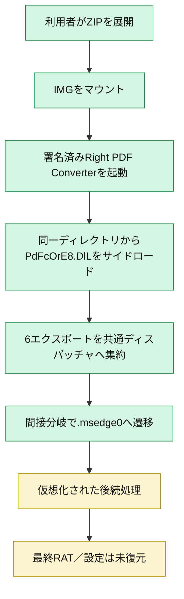
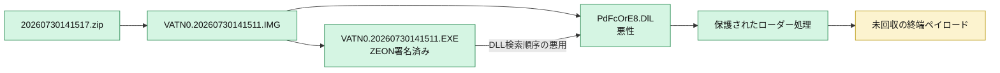
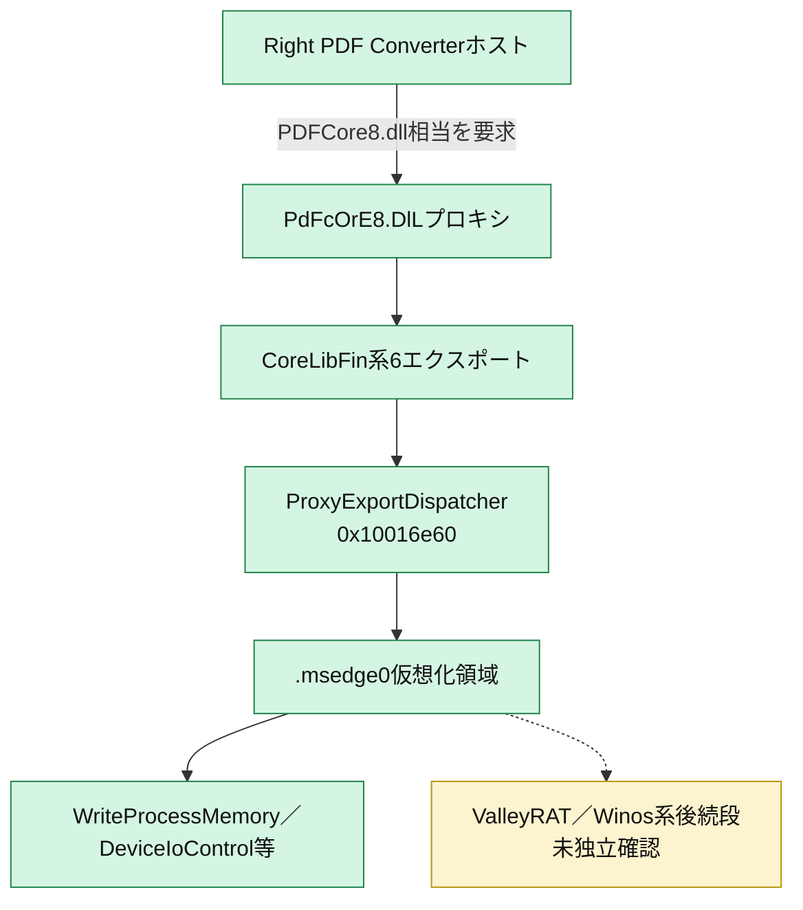

# 全体ロジック

緑は静的証拠で確認済み、黄は帰属または後続処理が推定段階である。

## 静的可視化

### 実行フロー

### 感染チェーン

### モジュール関係

## 比較

### 比較プロファイル

- 共通phase ID: `loader_execution`、`payload_decoding`、`defense_evasion`
- 復元層: ZIP → ISO 9660 IMG → 署名済みPE＋悪性PE DLL
- module: 正規host、プロキシDLL、仮想化保護領域
- 機能: DLLサイドロード、間接分岐、opaque predicate
- code fingerprint: 代表6関数を正規化済み。類似候補はfingerprint単独で帰属しない。

### 他ケースとの比較

| 比較対象 | 共通点 | 差分 | 判断 |
|---|---|---|---|
| `ee0ef34...`（2026-07-27） | 同じ署名済みホスト、ZIP→IMG→EXE+DLL、同じDLL名、同系エクスポート | 悪性DLLハッシュ、保護セクション・最終復元状況 | 同一配布キャンペーン系統の別ビルド |
| Triage `260730-lbfn8sgj6v` | PDF変換ホストを悪用するDLLサイドロード | 外層・DLL・dumped payloadが不一致 | 関連事例。動的IOCの転用不可 |
