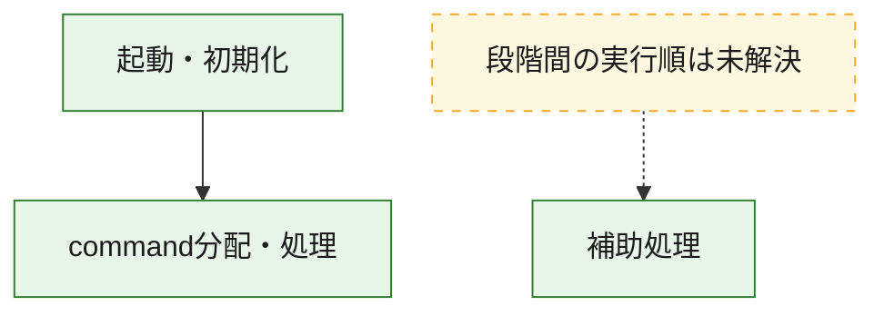
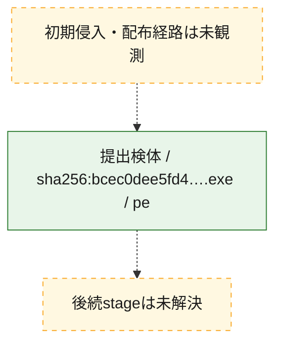
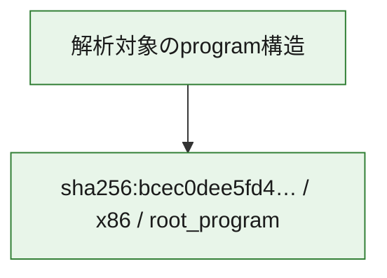

# 全体ロジック：bcec0dee5fd43ed238a5c3b781ad3bb3e2104b41904070e0823c9ddf79b08794

代表関数の静的証跡から、起動・初期化、command分配・処理の処理群を確認しました。

## 読み方

- phaseの掲載順は解析上の整理順です。observed_call_edgesがない段階間の実行順を断定しません。
- 図の実線は静的に観測した関係、点線と黄色のノードは未観測・未解決の関係を示します。
- 図は静的な要約であり、動的実行を再現するものではありません。
- 詳細な関数解説とfingerprintは[STATIC-LOGIC.md](STATIC-LOGIC.md)を参照してください。

## 静的可視化

### 実行フロー

### 感染チェーン

### モジュール関係

## 処理段階

### 1. 起動・初期化

entry pointから初期化と後続処理への移行を確認します。
確度: `confirmed_static_function_evidence`

- `bcec0dee5fd43ed238a5c3b781ad3bb3e2104b41904070e0823c9ddf79b08794:ghidra:14003dba0` — 初期化と主要処理への分岐を行う入口関数です。 状態: `succeeded`、選定理由: `entry_point`, `meaningful_symbol_name`, `reviewed_call_centrality:22`, `role:entrypoint`

### 2. command分配・処理

受信commandやtaskの解釈、分配、個別handlerへの移行を確認します。
確度: `confirmed_static_function_evidence_with_limits`

- `bcec0dee5fd43ed238a5c3b781ad3bb3e2104b41904070e0823c9ddf79b08794:ghidra:14005eeb0` — commandの解釈、分配、または個別処理を担当する関数です。 状態: `limited_bad_instruction_or_flow`、選定理由: `meaningful_symbol_name`, `reviewed_call_centrality:1`, `role:command_dispatch_or_handler`

### 3. 補助処理

主要処理を支える一般内部関数またはlibrary処理を確認します。
確度: `confirmed_static_function_evidence_with_limits`

- `bcec0dee5fd43ed238a5c3b781ad3bb3e2104b41904070e0823c9ddf79b08794:ghidra:140001000` — 検体内部の一般処理を実装する関数です。 状態: `succeeded`、選定理由: `context_representative`, `reviewed_call_centrality:2`
- `bcec0dee5fd43ed238a5c3b781ad3bb3e2104b41904070e0823c9ddf79b08794:ghidra:140001028` — 検体内部の一般処理を実装する関数です。 状態: `succeeded`、選定理由: `context_representative`, `reviewed_call_centrality:2`
- `bcec0dee5fd43ed238a5c3b781ad3bb3e2104b41904070e0823c9ddf79b08794:ghidra:140001060` — 検体内部の一般処理を実装する関数です。 状態: `succeeded`、選定理由: `context_representative`, `reviewed_call_centrality:2`
- `bcec0dee5fd43ed238a5c3b781ad3bb3e2104b41904070e0823c9ddf79b08794:ghidra:140001098` — 検体内部の一般処理を実装する関数です。 状態: `succeeded`、選定理由: `context_representative`, `reviewed_call_centrality:1`
- `bcec0dee5fd43ed238a5c3b781ad3bb3e2104b41904070e0823c9ddf79b08794:ghidra:1400010e0` — 検体内部の一般処理を実装する関数です。 状態: `succeeded`、選定理由: `context_representative`, `reviewed_call_centrality:2`
- `bcec0dee5fd43ed238a5c3b781ad3bb3e2104b41904070e0823c9ddf79b08794:ghidra:140001158` — 検体内部の一般処理を実装する関数です。 状態: `succeeded`、選定理由: `context_representative`, `reviewed_call_centrality:3`
- `bcec0dee5fd43ed238a5c3b781ad3bb3e2104b41904070e0823c9ddf79b08794:ghidra:140001178` — 検体内部の一般処理を実装する関数です。 状態: `succeeded`、選定理由: `context_representative`, `reviewed_call_centrality:1`
- `bcec0dee5fd43ed238a5c3b781ad3bb3e2104b41904070e0823c9ddf79b08794:ghidra:1400011b4` — 検体内部の一般処理を実装する関数です。 状態: `succeeded`、選定理由: `context_representative`, `reviewed_call_centrality:1`
- `bcec0dee5fd43ed238a5c3b781ad3bb3e2104b41904070e0823c9ddf79b08794:ghidra:1400011f0` — 検体内部の一般処理を実装する関数です。 状態: `succeeded`、選定理由: `context_representative`, `reviewed_call_centrality:2`
- `bcec0dee5fd43ed238a5c3b781ad3bb3e2104b41904070e0823c9ddf79b08794:ghidra:140001204` — 検体内部の一般処理を実装する関数です。 状態: `succeeded`、選定理由: `context_representative`, `reviewed_call_centrality:1`
- `bcec0dee5fd43ed238a5c3b781ad3bb3e2104b41904070e0823c9ddf79b08794:ghidra:14000124c` — 検体内部の一般処理を実装する関数です。 状態: `succeeded`、選定理由: `context_representative`
- `bcec0dee5fd43ed238a5c3b781ad3bb3e2104b41904070e0823c9ddf79b08794:ghidra:1400012bc` — 検体内部の一般処理を実装する関数です。 状態: `succeeded`、選定理由: `context_representative`, `reviewed_call_centrality:5`
- `bcec0dee5fd43ed238a5c3b781ad3bb3e2104b41904070e0823c9ddf79b08794:ghidra:1400013b4` — 検体内部の一般処理を実装する関数です。 状態: `succeeded`、選定理由: `context_representative`, `reviewed_call_centrality:7`
- `bcec0dee5fd43ed238a5c3b781ad3bb3e2104b41904070e0823c9ddf79b08794:ghidra:14000149c` — 検体内部の一般処理を実装する関数です。 状態: `succeeded`、選定理由: `context_representative`, `reviewed_call_centrality:2`
- `bcec0dee5fd43ed238a5c3b781ad3bb3e2104b41904070e0823c9ddf79b08794:ghidra:1400014e0` — 検体内部の一般処理を実装する関数です。 状態: `succeeded`、選定理由: `context_representative`, `reviewed_call_centrality:1`
- `bcec0dee5fd43ed238a5c3b781ad3bb3e2104b41904070e0823c9ddf79b08794:ghidra:140001538` — 検体内部の一般処理を実装する関数です。 状態: `succeeded`、選定理由: `context_representative`, `reviewed_call_centrality:1`
- `bcec0dee5fd43ed238a5c3b781ad3bb3e2104b41904070e0823c9ddf79b08794:ghidra:140001590` — 検体内部の一般処理を実装する関数です。 状態: `succeeded`、選定理由: `context_representative`, `reviewed_call_centrality:3`
- `bcec0dee5fd43ed238a5c3b781ad3bb3e2104b41904070e0823c9ddf79b08794:ghidra:1400015fc` — 検体内部の一般処理を実装する関数です。 状態: `succeeded`、選定理由: `context_representative`, `reviewed_call_centrality:1`
- `bcec0dee5fd43ed238a5c3b781ad3bb3e2104b41904070e0823c9ddf79b08794:ghidra:140001640` — 検体内部の一般処理を実装する関数です。 状態: `succeeded`、選定理由: `context_representative`, `reviewed_call_centrality:3`
- `bcec0dee5fd43ed238a5c3b781ad3bb3e2104b41904070e0823c9ddf79b08794:ghidra:140001660` — 検体内部の一般処理を実装する関数です。 状態: `succeeded`、選定理由: `context_representative`, `reviewed_call_centrality:1`
- `bcec0dee5fd43ed238a5c3b781ad3bb3e2104b41904070e0823c9ddf79b08794:ghidra:14000169c` — 検体内部の一般処理を実装する関数です。 状態: `succeeded`、選定理由: `context_representative`, `reviewed_call_centrality:1`
- `bcec0dee5fd43ed238a5c3b781ad3bb3e2104b41904070e0823c9ddf79b08794:ghidra:1400016c8` — 検体内部の一般処理を実装する関数です。 状態: `succeeded`、選定理由: `context_representative`, `reviewed_call_centrality:5`
- `bcec0dee5fd43ed238a5c3b781ad3bb3e2104b41904070e0823c9ddf79b08794:ghidra:140001740` — 検体内部の一般処理を実装する関数です。 状態: `limited_bad_instruction_or_flow`、選定理由: `context_representative`, `reviewed_call_centrality:6`
- `bcec0dee5fd43ed238a5c3b781ad3bb3e2104b41904070e0823c9ddf79b08794:ghidra:1400017e8` — 検体内部の一般処理を実装する関数です。 状態: `succeeded`、選定理由: `context_representative`
- `bcec0dee5fd43ed238a5c3b781ad3bb3e2104b41904070e0823c9ddf79b08794:ghidra:14000181c` — 検体内部の一般処理を実装する関数です。 状態: `succeeded`、選定理由: `context_representative`, `reviewed_call_centrality:4`
- `bcec0dee5fd43ed238a5c3b781ad3bb3e2104b41904070e0823c9ddf79b08794:ghidra:1400018dc` — 検体内部の一般処理を実装する関数です。 状態: `succeeded`、選定理由: `context_representative`, `reviewed_call_centrality:1`
- `bcec0dee5fd43ed238a5c3b781ad3bb3e2104b41904070e0823c9ddf79b08794:ghidra:140001934` — 検体内部の一般処理を実装する関数です。 状態: `succeeded`、選定理由: `context_representative`, `reviewed_call_centrality:1`
- `bcec0dee5fd43ed238a5c3b781ad3bb3e2104b41904070e0823c9ddf79b08794:ghidra:140001980` — 検体内部の一般処理を実装する関数です。 状態: `succeeded`、選定理由: `context_representative`, `reviewed_call_centrality:1`
- `bcec0dee5fd43ed238a5c3b781ad3bb3e2104b41904070e0823c9ddf79b08794:ghidra:1400019a0` — 検体内部の一般処理を実装する関数です。 状態: `succeeded`、選定理由: `context_representative`, `reviewed_call_centrality:1`
- `bcec0dee5fd43ed238a5c3b781ad3bb3e2104b41904070e0823c9ddf79b08794:ghidra:140004cb0` — 検体内部の一般処理を実装する関数です。 状態: `succeeded`、選定理由: `meaningful_symbol_name`

## 観測したcall関係

- `bcec0dee5fd43ed238a5c3b781ad3bb3e2104b41904070e0823c9ddf79b08794:ghidra:1400013b4` → `bcec0dee5fd43ed238a5c3b781ad3bb3e2104b41904070e0823c9ddf79b08794:ghidra:1400012bc` （`support` → `support`）
- `bcec0dee5fd43ed238a5c3b781ad3bb3e2104b41904070e0823c9ddf79b08794:ghidra:14000181c` → `bcec0dee5fd43ed238a5c3b781ad3bb3e2104b41904070e0823c9ddf79b08794:ghidra:1400016c8` （`support` → `support`）
- `bcec0dee5fd43ed238a5c3b781ad3bb3e2104b41904070e0823c9ddf79b08794:ghidra:14000181c` → `bcec0dee5fd43ed238a5c3b781ad3bb3e2104b41904070e0823c9ddf79b08794:ghidra:140001740` （`support` → `support`）
- `bcec0dee5fd43ed238a5c3b781ad3bb3e2104b41904070e0823c9ddf79b08794:ghidra:14003dba0` → `bcec0dee5fd43ed238a5c3b781ad3bb3e2104b41904070e0823c9ddf79b08794:ghidra:14005eeb0` （`startup` → `dispatch`）
- `ghidra-function:04976474117718fcfea704a3` → `ghidra-function:21a24a4513a50bddce515bc8` （`unclassified` → `unclassified`）
- `ghidra-function:04976474117718fcfea704a3` → `ghidra-function:3ed505b16d6df3b212419125` （`unclassified` → `unclassified`）
- `ghidra-function:04976474117718fcfea704a3` → `ghidra-function:e6b60d85ca5fe3e927d289a2` （`unclassified` → `unclassified`）
- `ghidra-function:04976474117718fcfea704a3` → `ghidra-function:e8428e745e7316a35b92f337` （`unclassified` → `unclassified`）
- `ghidra-function:04dafdbb84e8f034fc71c231` → `ghidra-function:d96b522f46e7d388cd57dbea` （`unclassified` → `unclassified`）
- `ghidra-function:0631d7d9daba75b5b5552bef` → `ghidra-external:010de1c81477974644d76b21` （`unclassified` → `unclassified`）
- `ghidra-function:0631d7d9daba75b5b5552bef` → `ghidra-function:53eaf34f3ef4472c5ce05c32` （`unclassified` → `unclassified`）
- `ghidra-function:097c243b0dd52be3126da5de` → `ghidra-function:d96b522f46e7d388cd57dbea` （`unclassified` → `unclassified`）
- `ghidra-function:16d2bf26c61f6e3ec8dce29c` → `ghidra-external:2da2f69ff3a7c367fb03c43f` （`unclassified` → `unclassified`）
- `ghidra-function:16d2bf26c61f6e3ec8dce29c` → `ghidra-external:6cf3c2a40e4f8904593b2b19` （`unclassified` → `unclassified`）
- `ghidra-function:16d2bf26c61f6e3ec8dce29c` → `ghidra-function:9509b7477ff5b1a0e5ae1458` （`unclassified` → `unclassified`）
- `ghidra-function:1b73d74c08a345a59a2b3fd8` → `ghidra-function:d96b522f46e7d388cd57dbea` （`unclassified` → `unclassified`）
- `ghidra-function:1bd1b773194ed55eaba7a6b3` → `ghidra-external:113c86e78ce081915334989f` （`unclassified` → `unclassified`）
- `ghidra-function:1bd1b773194ed55eaba7a6b3` → `ghidra-external:6cf3c2a40e4f8904593b2b19` （`unclassified` → `unclassified`）
- `ghidra-function:1bd1b773194ed55eaba7a6b3` → `ghidra-function:9509b7477ff5b1a0e5ae1458` （`unclassified` → `unclassified`）
- `ghidra-function:21a24a4513a50bddce515bc8` → `ghidra-external:6cf3c2a40e4f8904593b2b19` （`unclassified` → `unclassified`）
- `ghidra-function:21a24a4513a50bddce515bc8` → `ghidra-function:917324c5ae1b886d70eee53e` （`unclassified` → `unclassified`）
- `ghidra-function:21a24a4513a50bddce515bc8` → `ghidra-function:9903ebd313392d950b210f53` （`unclassified` → `unclassified`）
- `ghidra-function:21a24a4513a50bddce515bc8` → `ghidra-function:fcaac4a6e3821b1a0edf5b9b` （`unclassified` → `unclassified`）
- `ghidra-function:2b6986ee0a44b640b0801f82` → `ghidra-function:d96b522f46e7d388cd57dbea` （`unclassified` → `unclassified`）
- `ghidra-function:3661f0fcd3de3f8cb18a4191` → `ghidra-external:6cf3c2a40e4f8904593b2b19` （`unclassified` → `unclassified`）
- `ghidra-function:3661f0fcd3de3f8cb18a4191` → `ghidra-function:efb67d540a702d9c715f49a7` （`unclassified` → `unclassified`）
- `ghidra-function:3cba778cd5460b0635c9af40` → `ghidra-external:7e1062c8521f06d09c172440` （`unclassified` → `unclassified`）
- `ghidra-function:3cba778cd5460b0635c9af40` → `ghidra-function:a5e8d72e185c73e4a6aad0f8` （`unclassified` → `unclassified`）
- `ghidra-function:3cba778cd5460b0635c9af40` → `ghidra-function:adb0eed50536b72fe86e9c4c` （`unclassified` → `unclassified`）
- `ghidra-function:3d255d411e9293a5aa0b9e61` → `ghidra-function:95b539a88be70322722c8887` （`unclassified` → `unclassified`）
- `ghidra-function:3d255d411e9293a5aa0b9e61` → `ghidra-function:c90e4e1d9b02d67a42faea21` （`unclassified` → `unclassified`）
- `ghidra-function:4c0f3aae6ca328138aa43dca` → `ghidra-function:162d765da1839669fd55d1e4` （`unclassified` → `unclassified`）
- `ghidra-function:4c0f3aae6ca328138aa43dca` → `ghidra-function:95b539a88be70322722c8887` （`unclassified` → `unclassified`）
- `ghidra-function:580168e53d4a55e36d076ddf` → `ghidra-external:010de1c81477974644d76b21` （`unclassified` → `unclassified`）
- `ghidra-function:580168e53d4a55e36d076ddf` → `ghidra-external:6cf3c2a40e4f8904593b2b19` （`unclassified` → `unclassified`）
- `ghidra-function:580168e53d4a55e36d076ddf` → `ghidra-function:3b209e4fb2909af72a0f2173` （`unclassified` → `unclassified`）
- `ghidra-function:580168e53d4a55e36d076ddf` → `ghidra-function:730f350c8395c248b6cb0d33` （`unclassified` → `unclassified`）
- `ghidra-function:65ca9c58aa158db52c3d21b8` → `ghidra-function:59d90b5021da9560068489b8` （`unclassified` → `unclassified`）
- `ghidra-function:6a66c9179b826b4a312baef0` → `ghidra-function:d96b522f46e7d388cd57dbea` （`unclassified` → `unclassified`）
- `ghidra-function:6dd49c8c18990aeecd2ed71f` → `ghidra-external:010de1c81477974644d76b21` （`unclassified` → `unclassified`）
- `ghidra-function:7bc71a38cd146cc475a9a0f3` → `ghidra-external:010de1c81477974644d76b21` （`unclassified` → `unclassified`）
- `ghidra-function:7bc71a38cd146cc475a9a0f3` → `ghidra-function:53eaf34f3ef4472c5ce05c32` （`unclassified` → `unclassified`）
- `ghidra-function:7ff9dfcf68a7ef76c61a17aa` → `ghidra-function:d96b522f46e7d388cd57dbea` （`unclassified` → `unclassified`）
- `ghidra-function:9bcb7e62efaa396c7ff3bd69` → `ghidra-function:d96b522f46e7d388cd57dbea` （`unclassified` → `unclassified`）
- `ghidra-function:b31f8c0709852f0f2b2033ae` → `ghidra-external:00be92b5ef2687b7e0f36254` （`unclassified` → `unclassified`）
- `ghidra-function:b31f8c0709852f0f2b2033ae` → `ghidra-external:3ec25dd75c56e52fb8011b0a` （`unclassified` → `unclassified`）
- `ghidra-function:b31f8c0709852f0f2b2033ae` → `ghidra-external:3ee9eb9ef4e86abd88b024f9` （`unclassified` → `unclassified`）
- `ghidra-function:b31f8c0709852f0f2b2033ae` → `ghidra-external:48dcc3d198b26ce0ea828a0b` （`unclassified` → `unclassified`）
- `ghidra-function:b31f8c0709852f0f2b2033ae` → `ghidra-external:6fcd5f2f74d25e943a9b79f2` （`unclassified` → `unclassified`）
- `ghidra-function:b31f8c0709852f0f2b2033ae` → `ghidra-external:7385aba3b95dcb1be36f5b9c` （`unclassified` → `unclassified`）
- `ghidra-function:b31f8c0709852f0f2b2033ae` → `ghidra-external:7f683d97395dcf2a53b959f7` （`unclassified` → `unclassified`）
- `ghidra-function:b31f8c0709852f0f2b2033ae` → `ghidra-external:ca8f1bd8ece15a20128eb1a2` （`unclassified` → `unclassified`）
- `ghidra-function:b31f8c0709852f0f2b2033ae` → `ghidra-external:ef8c643e4c24b9c82ad1d84e` （`unclassified` → `unclassified`）
- `ghidra-function:b31f8c0709852f0f2b2033ae` → `ghidra-function:14ef0a00983cc6c3f99d20a8` （`unclassified` → `unclassified`）
- `ghidra-function:b31f8c0709852f0f2b2033ae` → `ghidra-function:3aa8548e0574f6d8d80a6ba4` （`unclassified` → `unclassified`）
- `ghidra-function:b31f8c0709852f0f2b2033ae` → `ghidra-function:3d2303b45dfeb8f852a71cf0` （`unclassified` → `unclassified`）
- `ghidra-function:b31f8c0709852f0f2b2033ae` → `ghidra-function:4210b555f2681c0d3db3bcb7` （`unclassified` → `unclassified`）
- `ghidra-function:b31f8c0709852f0f2b2033ae` → `ghidra-function:5e9247c4c7dde15fdf6f400f` （`unclassified` → `unclassified`）
- `ghidra-function:b31f8c0709852f0f2b2033ae` → `ghidra-function:7e0179d995081c7372416575` （`unclassified` → `unclassified`）
- `ghidra-function:b31f8c0709852f0f2b2033ae` → `ghidra-function:97c8f333c398e3da144cbda2` （`unclassified` → `unclassified`）
- `ghidra-function:b31f8c0709852f0f2b2033ae` → `ghidra-function:9eb9db919803571a1855a82a` （`unclassified` → `unclassified`）
- `ghidra-function:b31f8c0709852f0f2b2033ae` → `ghidra-function:ae2d5e1bc6917fb775f235e7` （`unclassified` → `unclassified`）
- `ghidra-function:b31f8c0709852f0f2b2033ae` → `ghidra-function:d14f1c73399b282ec072de97` （`unclassified` → `unclassified`）
- `ghidra-function:b31f8c0709852f0f2b2033ae` → `ghidra-function:e204cda7814faca873f39d5c` （`unclassified` → `unclassified`）
- `ghidra-function:b31f8c0709852f0f2b2033ae` → `ghidra-function:e2a70ea831b41c71b763dd51` （`unclassified` → `unclassified`）
- `ghidra-function:b31f8c0709852f0f2b2033ae` → `ghidra-function:f52bbec17c9d48c82f268569` （`unclassified` → `unclassified`）
- `ghidra-function:bbf9497ae263c3984852ae53` → `ghidra-external:010de1c81477974644d76b21` （`unclassified` → `unclassified`）
- `ghidra-function:cedc6e7b8fc9b7beb0ff95d4` → `ghidra-external:010de1c81477974644d76b21` （`unclassified` → `unclassified`）
- `ghidra-function:cedc6e7b8fc9b7beb0ff95d4` → `ghidra-external:6cf3c2a40e4f8904593b2b19` （`unclassified` → `unclassified`）
- `ghidra-function:cedc6e7b8fc9b7beb0ff95d4` → `ghidra-external:a82d9b86a4a440cdf53ab8ae` （`unclassified` → `unclassified`）
- `ghidra-function:cedc6e7b8fc9b7beb0ff95d4` → `ghidra-function:14dd7d89a0644706ab5cb376` （`unclassified` → `unclassified`）
- `ghidra-function:cedc6e7b8fc9b7beb0ff95d4` → `ghidra-function:3b209e4fb2909af72a0f2173` （`unclassified` → `unclassified`）
- `ghidra-function:cedc6e7b8fc9b7beb0ff95d4` → `ghidra-function:580168e53d4a55e36d076ddf` （`unclassified` → `unclassified`）
- `ghidra-function:cedc6e7b8fc9b7beb0ff95d4` → `ghidra-function:d96b522f46e7d388cd57dbea` （`unclassified` → `unclassified`）
- `ghidra-function:cf765955e005dd44977526ed` → `ghidra-function:d867ff4a2890221259e04b22` （`unclassified` → `unclassified`）
- `ghidra-function:cf7bed77d5dfc5b2afd8325d` → `ghidra-function:e251745cb3507b3b0af69269` （`unclassified` → `unclassified`）
- `ghidra-function:da5a95fbf647c49695287263` → `ghidra-function:59d90b5021da9560068489b8` （`unclassified` → `unclassified`）
- `ghidra-function:e6b60d85ca5fe3e927d289a2` → `ghidra-external:57c1f979476546efed4f0b0a` （`unclassified` → `unclassified`）
- `ghidra-function:e6b60d85ca5fe3e927d289a2` → `ghidra-external:99067094eeb9f86dd669f9b0` （`unclassified` → `unclassified`）
- `ghidra-function:e6b60d85ca5fe3e927d289a2` → `ghidra-function:7bae39c225453a4fd796e33d` （`unclassified` → `unclassified`）
- `ghidra-function:e6b60d85ca5fe3e927d289a2` → `ghidra-function:e78b25d5ab15812bb54f7955` （`unclassified` → `unclassified`）
- `ghidra-function:fccc87315e8cef6fd263c001` → `ghidra-function:162d765da1839669fd55d1e4` （`unclassified` → `unclassified`）
- `ghidra-function:fccc87315e8cef6fd263c001` → `ghidra-function:95b539a88be70322722c8887` （`unclassified` → `unclassified`）

## 解析範囲と制約

- 選定外関数は全体inventoryへ残しますが、関数本体の個別解説対象にはしていません。
- indirect call、難読化、packer、VM、壊れたcontrol flowによりcall関係が欠落する場合があります。
- 文書は静的解析に基づき、検体実行や外部通信による動的確認は行っていません。
