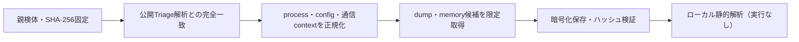

# Triage公開解析・後段取得証跡

## 完全ハッシュ一致

- [260807-rfwtxaztd1](https://tria.ge/260807-rfwtxaztd1): ファミリー候補 `未確定`、評価score `None`
- [260807-nnj9ascq9v](https://tria.ge/260807-nnj9ascq9v): ファミリー候補 `未確定`、評価score `None`
- [260718-erg4nsfz4l](https://tria.ge/260718-erg4nsfz4l): ファミリー候補 `未確定`、評価score `None`

## プロセス・通信

- 観測process: `取得できず`
- raw commandは保存せず、command SHA-256と処理patternだけをJSONへ保持します。
- sandbox background trafficは`context_only`であり、C2へ自動昇格しません。

- 取得できませんでした。

## 後段取得物

- `ee1a7b77402d6b123656c5bc889251483829323d047ee8232b19ba2ed1f3dcd5` / `memory_image` / 286720 bytes / 親と同一: `false` / 静的解析: `未実施`
- `486d7df865f36b521e0b76ddfde86d738429e176ae448f7b1366578b405120c1` / `memory_image` / 286720 bytes / 親と同一: `false` / 静的解析: `未実施`
- `1c39874edd51d7ffc191f0f91fcb43a29254e364e2977e29044bd9ca1437194c` / `memory_image` / 286720 bytes / 親と同一: `false` / 静的解析: `未実施`

## 判定境界

Triage由来のfamily、process、config、通信は外部sandbox証跡です。Config extractorが返したendpointはC2候補として扱いますが、静的設定復元またはprocess帰属とprotocol応答が揃うまでは確認済みC2とはしません。取得成果物と検体は実行していません。
