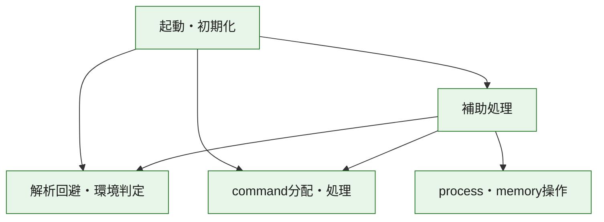
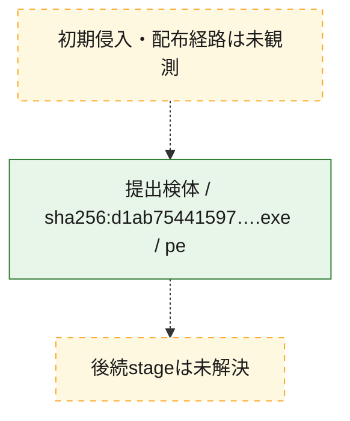
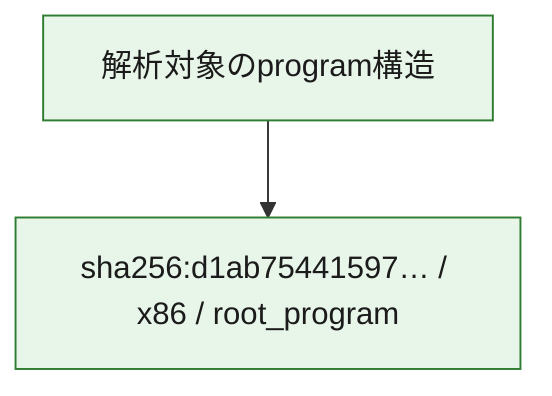

# 全体ロジック：d1ab754415972d89e5b17baca0906c3ccab59ad61eec55988688ee1daf08e122

代表関数の静的証跡から、起動・初期化、解析回避・環境判定、process・memory操作、command分配・処理の処理群を確認しました。

## 読み方

- phaseの掲載順は解析上の整理順です。observed_call_edgesがない段階間の実行順を断定しません。
- 図の実線は静的に観測した関係、点線と黄色のノードは未観測・未解決の関係を示します。
- 図は静的な要約であり、動的実行を再現するものではありません。
- 詳細な関数解説とfingerprintは[STATIC-LOGIC.md](STATIC-LOGIC.md)を参照してください。

## 静的可視化

### 実行フロー

### 感染チェーン

### モジュール関係

## 処理段階

### 1. 起動・初期化

entry pointから初期化と後続処理への移行を確認します。
確度: `confirmed_static_function_evidence`

- `d1ab754415972d89e5b17baca0906c3ccab59ad61eec55988688ee1daf08e122:ghidra:140002c08` — 初期化と主要処理への分岐を行う入口関数です。 状態: `succeeded`、選定理由: `entry_point`, `meaningful_symbol_name`, `reviewed_call_centrality:22`, `role:entrypoint`

### 2. 解析回避・環境判定

debugger、sandbox、仮想環境、時間差などの判定を確認します。
確度: `confirmed_static_function_evidence`

- `d1ab754415972d89e5b17baca0906c3ccab59ad61eec55988688ee1daf08e122:ghidra:140002e5c` — debugger、仮想環境、sandbox、または時間差の確認に関係する関数です。 状態: `succeeded`、選定理由: `context_representative`, `reviewed_call_centrality:10`, `role:anti_analysis`
- `d1ab754415972d89e5b17baca0906c3ccab59ad61eec55988688ee1daf08e122:ghidra:140002f8c` — debugger、仮想環境、sandbox、または時間差の確認に関係する関数です。 状態: `succeeded`、選定理由: `context_representative`, `reviewed_call_centrality:21`, `role:anti_analysis`

### 3. process・memory操作

process、thread、module、memory操作と実行移行を確認します。
確度: `confirmed_static_function_evidence`

- `d1ab754415972d89e5b17baca0906c3ccab59ad61eec55988688ee1daf08e122:ghidra:1400017ac` — process、thread、module、またはmemory操作に関係する関数です。 状態: `succeeded`、選定理由: `context_representative`, `reviewed_call_centrality:33`, `role:process_or_memory_operation`

### 4. command分配・処理

受信commandやtaskの解釈、分配、個別handlerへの移行を確認します。
確度: `confirmed_static_function_evidence_with_limits`

- `d1ab754415972d89e5b17baca0906c3ccab59ad61eec55988688ee1daf08e122:ghidra:14000e8f0` — commandの解釈、分配、または個別処理を担当する関数です。 状態: `limited_bad_instruction_or_flow`、選定理由: `meaningful_symbol_name`, `reviewed_call_centrality:2`, `role:command_dispatch_or_handler`

### 5. 補助処理

主要処理を支える一般内部関数またはlibrary処理を確認します。
確度: `confirmed_static_function_evidence`

- `d1ab754415972d89e5b17baca0906c3ccab59ad61eec55988688ee1daf08e122:ghidra:140001000` — 検体内部の一般処理を実装する関数です。 状態: `succeeded`、選定理由: `context_representative`, `reviewed_call_centrality:2`
- `d1ab754415972d89e5b17baca0906c3ccab59ad61eec55988688ee1daf08e122:ghidra:1400010b4` — 検体内部の一般処理を実装する関数です。 状態: `succeeded`、選定理由: `context_representative`, `reviewed_call_centrality:3`
- `d1ab754415972d89e5b17baca0906c3ccab59ad61eec55988688ee1daf08e122:ghidra:14000169c` — 検体内部の一般処理を実装する関数です。 状態: `succeeded`、選定理由: `context_representative`, `reviewed_call_centrality:1`
- `d1ab754415972d89e5b17baca0906c3ccab59ad61eec55988688ee1daf08e122:ghidra:140001740` — 検体内部の一般処理を実装する関数です。 状態: `succeeded`、選定理由: `context_representative`, `reviewed_call_centrality:1`
- `d1ab754415972d89e5b17baca0906c3ccab59ad61eec55988688ee1daf08e122:ghidra:140001aec` — 検体内部の一般処理を実装する関数です。 状態: `succeeded`、選定理由: `context_representative`, `reviewed_call_centrality:1`
- `d1ab754415972d89e5b17baca0906c3ccab59ad61eec55988688ee1daf08e122:ghidra:140001bf0` — 検体内部の一般処理を実装する関数です。 状態: `succeeded`、選定理由: `context_representative`, `reviewed_call_centrality:3`
- `d1ab754415972d89e5b17baca0906c3ccab59ad61eec55988688ee1daf08e122:ghidra:140001cd4` — 検体内部の一般処理を実装する関数です。 状態: `succeeded`、選定理由: `context_representative`, `reviewed_call_centrality:2`
- `d1ab754415972d89e5b17baca0906c3ccab59ad61eec55988688ee1daf08e122:ghidra:140001e8c` — 検体内部の一般処理を実装する関数です。 状態: `succeeded`、選定理由: `context_representative`, `reviewed_call_centrality:3`
- `d1ab754415972d89e5b17baca0906c3ccab59ad61eec55988688ee1daf08e122:ghidra:14000207c` — 検体内部の一般処理を実装する関数です。 状態: `succeeded`、選定理由: `context_representative`, `reviewed_call_centrality:5`
- `d1ab754415972d89e5b17baca0906c3ccab59ad61eec55988688ee1daf08e122:ghidra:1400020e0` — 検体内部の一般処理を実装する関数です。 状態: `succeeded`、選定理由: `context_representative`, `reviewed_call_centrality:16`
- `d1ab754415972d89e5b17baca0906c3ccab59ad61eec55988688ee1daf08e122:ghidra:1400029b0` — 検体内部の一般処理を実装する関数です。 状態: `succeeded`、選定理由: `context_representative`, `reviewed_call_centrality:20`
- `d1ab754415972d89e5b17baca0906c3ccab59ad61eec55988688ee1daf08e122:ghidra:140002a68` — 検体内部の一般処理を実装する関数です。 状態: `succeeded`、選定理由: `context_representative`, `reviewed_call_centrality:1`
- `d1ab754415972d89e5b17baca0906c3ccab59ad61eec55988688ee1daf08e122:ghidra:140002a78` — 検体内部の一般処理を実装する関数です。 状態: `succeeded`、選定理由: `context_representative`, `reviewed_call_centrality:6`
- `d1ab754415972d89e5b17baca0906c3ccab59ad61eec55988688ee1daf08e122:ghidra:140002a94` — 検体内部の一般処理を実装する関数です。 状態: `succeeded`、選定理由: `context_representative`, `reviewed_call_centrality:21`
- `d1ab754415972d89e5b17baca0906c3ccab59ad61eec55988688ee1daf08e122:ghidra:140002c1c` — 検体内部の一般処理を実装する関数です。 状態: `succeeded`、選定理由: `context_representative`, `reviewed_call_centrality:5`
- `d1ab754415972d89e5b17baca0906c3ccab59ad61eec55988688ee1daf08e122:ghidra:140002c58` — 検体内部の一般処理を実装する関数です。 状態: `succeeded`、選定理由: `context_representative`, `reviewed_call_centrality:6`
- `d1ab754415972d89e5b17baca0906c3ccab59ad61eec55988688ee1daf08e122:ghidra:140002c94` — 検体内部の一般処理を実装する関数です。 状態: `succeeded`、選定理由: `context_representative`, `reviewed_call_centrality:5`
- `d1ab754415972d89e5b17baca0906c3ccab59ad61eec55988688ee1daf08e122:ghidra:140002d20` — 検体内部の一般処理を実装する関数です。 状態: `succeeded`、選定理由: `context_representative`, `reviewed_call_centrality:4`
- `d1ab754415972d89e5b17baca0906c3ccab59ad61eec55988688ee1daf08e122:ghidra:140002db8` — 検体内部の一般処理を実装する関数です。 状態: `succeeded`、選定理由: `context_representative`, `reviewed_call_centrality:5`
- `d1ab754415972d89e5b17baca0906c3ccab59ad61eec55988688ee1daf08e122:ghidra:140002ddc` — 検体内部の一般処理を実装する関数です。 状態: `succeeded`、選定理由: `context_representative`, `reviewed_call_centrality:4`
- `d1ab754415972d89e5b17baca0906c3ccab59ad61eec55988688ee1daf08e122:ghidra:140002e08` — 検体内部の一般処理を実装する関数です。 状態: `succeeded`、選定理由: `context_representative`, `reviewed_call_centrality:3`
- `d1ab754415972d89e5b17baca0906c3ccab59ad61eec55988688ee1daf08e122:ghidra:140002e44` — 検体内部の一般処理を実装する関数です。 状態: `succeeded`、選定理由: `context_representative`, `reviewed_call_centrality:2`
- `d1ab754415972d89e5b17baca0906c3ccab59ad61eec55988688ee1daf08e122:ghidra:140002f34` — 検体内部の一般処理を実装する関数です。 状態: `succeeded`、選定理由: `meaningful_symbol_name`, `reviewed_call_centrality:1`
- `d1ab754415972d89e5b17baca0906c3ccab59ad61eec55988688ee1daf08e122:ghidra:140002f48` — 検体内部の一般処理を実装する関数です。 状態: `succeeded`、選定理由: `context_representative`, `reviewed_call_centrality:3`
- `d1ab754415972d89e5b17baca0906c3ccab59ad61eec55988688ee1daf08e122:ghidra:1400030d8` — 検体内部の一般処理を実装する関数です。 状態: `succeeded`、選定理由: `context_representative`, `reviewed_call_centrality:5`
- `d1ab754415972d89e5b17baca0906c3ccab59ad61eec55988688ee1daf08e122:ghidra:14000311c` — 検体内部の一般処理を実装する関数です。 状態: `succeeded`、選定理由: `context_representative`, `reviewed_call_centrality:4`
- `d1ab754415972d89e5b17baca0906c3ccab59ad61eec55988688ee1daf08e122:ghidra:140003180` — 検体内部の一般処理を実装する関数です。 状態: `succeeded`、選定理由: `context_representative`, `reviewed_call_centrality:4`

## 観測したcall関係

- `d1ab754415972d89e5b17baca0906c3ccab59ad61eec55988688ee1daf08e122:ghidra:1400010b4` → `d1ab754415972d89e5b17baca0906c3ccab59ad61eec55988688ee1daf08e122:ghidra:140001bf0` （`support` → `support`）
- `d1ab754415972d89e5b17baca0906c3ccab59ad61eec55988688ee1daf08e122:ghidra:1400010b4` → `d1ab754415972d89e5b17baca0906c3ccab59ad61eec55988688ee1daf08e122:ghidra:14000207c` （`support` → `support`）
- `d1ab754415972d89e5b17baca0906c3ccab59ad61eec55988688ee1daf08e122:ghidra:140001e8c` → `d1ab754415972d89e5b17baca0906c3ccab59ad61eec55988688ee1daf08e122:ghidra:140001bf0` （`support` → `support`）
- `d1ab754415972d89e5b17baca0906c3ccab59ad61eec55988688ee1daf08e122:ghidra:140001e8c` → `d1ab754415972d89e5b17baca0906c3ccab59ad61eec55988688ee1daf08e122:ghidra:14000207c` （`support` → `support`）
- `d1ab754415972d89e5b17baca0906c3ccab59ad61eec55988688ee1daf08e122:ghidra:14000207c` → `d1ab754415972d89e5b17baca0906c3ccab59ad61eec55988688ee1daf08e122:ghidra:140001cd4` （`support` → `support`）
- `d1ab754415972d89e5b17baca0906c3ccab59ad61eec55988688ee1daf08e122:ghidra:1400020e0` → `d1ab754415972d89e5b17baca0906c3ccab59ad61eec55988688ee1daf08e122:ghidra:140001000` （`support` → `support`）
- `d1ab754415972d89e5b17baca0906c3ccab59ad61eec55988688ee1daf08e122:ghidra:1400020e0` → `d1ab754415972d89e5b17baca0906c3ccab59ad61eec55988688ee1daf08e122:ghidra:1400010b4` （`support` → `support`）
- `d1ab754415972d89e5b17baca0906c3ccab59ad61eec55988688ee1daf08e122:ghidra:1400020e0` → `d1ab754415972d89e5b17baca0906c3ccab59ad61eec55988688ee1daf08e122:ghidra:14000169c` （`support` → `support`）
- `d1ab754415972d89e5b17baca0906c3ccab59ad61eec55988688ee1daf08e122:ghidra:1400020e0` → `d1ab754415972d89e5b17baca0906c3ccab59ad61eec55988688ee1daf08e122:ghidra:140001740` （`support` → `support`）
- `d1ab754415972d89e5b17baca0906c3ccab59ad61eec55988688ee1daf08e122:ghidra:1400020e0` → `d1ab754415972d89e5b17baca0906c3ccab59ad61eec55988688ee1daf08e122:ghidra:1400017ac` （`support` → `execution`）
- `d1ab754415972d89e5b17baca0906c3ccab59ad61eec55988688ee1daf08e122:ghidra:1400020e0` → `d1ab754415972d89e5b17baca0906c3ccab59ad61eec55988688ee1daf08e122:ghidra:140001aec` （`support` → `support`）
- `d1ab754415972d89e5b17baca0906c3ccab59ad61eec55988688ee1daf08e122:ghidra:1400020e0` → `d1ab754415972d89e5b17baca0906c3ccab59ad61eec55988688ee1daf08e122:ghidra:140001bf0` （`support` → `support`）
- `d1ab754415972d89e5b17baca0906c3ccab59ad61eec55988688ee1daf08e122:ghidra:1400020e0` → `d1ab754415972d89e5b17baca0906c3ccab59ad61eec55988688ee1daf08e122:ghidra:140001e8c` （`support` → `support`）
- `d1ab754415972d89e5b17baca0906c3ccab59ad61eec55988688ee1daf08e122:ghidra:1400020e0` → `d1ab754415972d89e5b17baca0906c3ccab59ad61eec55988688ee1daf08e122:ghidra:14000207c` （`support` → `support`）
- `d1ab754415972d89e5b17baca0906c3ccab59ad61eec55988688ee1daf08e122:ghidra:1400029b0` → `d1ab754415972d89e5b17baca0906c3ccab59ad61eec55988688ee1daf08e122:ghidra:140002c94` （`support` → `support`）
- `d1ab754415972d89e5b17baca0906c3ccab59ad61eec55988688ee1daf08e122:ghidra:1400029b0` → `d1ab754415972d89e5b17baca0906c3ccab59ad61eec55988688ee1daf08e122:ghidra:140002e44` （`support` → `support`）
- `d1ab754415972d89e5b17baca0906c3ccab59ad61eec55988688ee1daf08e122:ghidra:1400029b0` → `d1ab754415972d89e5b17baca0906c3ccab59ad61eec55988688ee1daf08e122:ghidra:140002f34` （`support` → `support`）
- `d1ab754415972d89e5b17baca0906c3ccab59ad61eec55988688ee1daf08e122:ghidra:1400029b0` → `d1ab754415972d89e5b17baca0906c3ccab59ad61eec55988688ee1daf08e122:ghidra:140002f8c` （`support` → `evasion`）
- `d1ab754415972d89e5b17baca0906c3ccab59ad61eec55988688ee1daf08e122:ghidra:140002a68` → `d1ab754415972d89e5b17baca0906c3ccab59ad61eec55988688ee1daf08e122:ghidra:140002f48` （`support` → `support`）
- `d1ab754415972d89e5b17baca0906c3ccab59ad61eec55988688ee1daf08e122:ghidra:140002a94` → `d1ab754415972d89e5b17baca0906c3ccab59ad61eec55988688ee1daf08e122:ghidra:1400020e0` （`support` → `support`）
- `d1ab754415972d89e5b17baca0906c3ccab59ad61eec55988688ee1daf08e122:ghidra:140002a94` → `d1ab754415972d89e5b17baca0906c3ccab59ad61eec55988688ee1daf08e122:ghidra:140002c1c` （`support` → `support`）
- `d1ab754415972d89e5b17baca0906c3ccab59ad61eec55988688ee1daf08e122:ghidra:140002a94` → `d1ab754415972d89e5b17baca0906c3ccab59ad61eec55988688ee1daf08e122:ghidra:140002c58` （`support` → `support`）
- `d1ab754415972d89e5b17baca0906c3ccab59ad61eec55988688ee1daf08e122:ghidra:140002a94` → `d1ab754415972d89e5b17baca0906c3ccab59ad61eec55988688ee1daf08e122:ghidra:140002d20` （`support` → `support`）
- `d1ab754415972d89e5b17baca0906c3ccab59ad61eec55988688ee1daf08e122:ghidra:140002a94` → `d1ab754415972d89e5b17baca0906c3ccab59ad61eec55988688ee1daf08e122:ghidra:140002db8` （`support` → `support`）
- `d1ab754415972d89e5b17baca0906c3ccab59ad61eec55988688ee1daf08e122:ghidra:140002a94` → `d1ab754415972d89e5b17baca0906c3ccab59ad61eec55988688ee1daf08e122:ghidra:140002ddc` （`support` → `support`）
- `d1ab754415972d89e5b17baca0906c3ccab59ad61eec55988688ee1daf08e122:ghidra:140002a94` → `d1ab754415972d89e5b17baca0906c3ccab59ad61eec55988688ee1daf08e122:ghidra:140002f8c` （`support` → `evasion`）
- `d1ab754415972d89e5b17baca0906c3ccab59ad61eec55988688ee1daf08e122:ghidra:140002a94` → `d1ab754415972d89e5b17baca0906c3ccab59ad61eec55988688ee1daf08e122:ghidra:1400030d8` （`support` → `support`）
- `d1ab754415972d89e5b17baca0906c3ccab59ad61eec55988688ee1daf08e122:ghidra:140002a94` → `d1ab754415972d89e5b17baca0906c3ccab59ad61eec55988688ee1daf08e122:ghidra:14000311c` （`support` → `support`）
- `d1ab754415972d89e5b17baca0906c3ccab59ad61eec55988688ee1daf08e122:ghidra:140002a94` → `d1ab754415972d89e5b17baca0906c3ccab59ad61eec55988688ee1daf08e122:ghidra:14000e8f0` （`support` → `dispatch`）
- `d1ab754415972d89e5b17baca0906c3ccab59ad61eec55988688ee1daf08e122:ghidra:140002c08` → `d1ab754415972d89e5b17baca0906c3ccab59ad61eec55988688ee1daf08e122:ghidra:1400020e0` （`startup` → `support`）
- `d1ab754415972d89e5b17baca0906c3ccab59ad61eec55988688ee1daf08e122:ghidra:140002c08` → `d1ab754415972d89e5b17baca0906c3ccab59ad61eec55988688ee1daf08e122:ghidra:140002c1c` （`startup` → `support`）
- `d1ab754415972d89e5b17baca0906c3ccab59ad61eec55988688ee1daf08e122:ghidra:140002c08` → `d1ab754415972d89e5b17baca0906c3ccab59ad61eec55988688ee1daf08e122:ghidra:140002c58` （`startup` → `support`）
- `d1ab754415972d89e5b17baca0906c3ccab59ad61eec55988688ee1daf08e122:ghidra:140002c08` → `d1ab754415972d89e5b17baca0906c3ccab59ad61eec55988688ee1daf08e122:ghidra:140002d20` （`startup` → `support`）
- `d1ab754415972d89e5b17baca0906c3ccab59ad61eec55988688ee1daf08e122:ghidra:140002c08` → `d1ab754415972d89e5b17baca0906c3ccab59ad61eec55988688ee1daf08e122:ghidra:140002db8` （`startup` → `support`）
- `d1ab754415972d89e5b17baca0906c3ccab59ad61eec55988688ee1daf08e122:ghidra:140002c08` → `d1ab754415972d89e5b17baca0906c3ccab59ad61eec55988688ee1daf08e122:ghidra:140002ddc` （`startup` → `support`）
- `d1ab754415972d89e5b17baca0906c3ccab59ad61eec55988688ee1daf08e122:ghidra:140002c08` → `d1ab754415972d89e5b17baca0906c3ccab59ad61eec55988688ee1daf08e122:ghidra:140002e5c` （`startup` → `evasion`）
- `d1ab754415972d89e5b17baca0906c3ccab59ad61eec55988688ee1daf08e122:ghidra:140002c08` → `d1ab754415972d89e5b17baca0906c3ccab59ad61eec55988688ee1daf08e122:ghidra:140002f8c` （`startup` → `evasion`）
- `d1ab754415972d89e5b17baca0906c3ccab59ad61eec55988688ee1daf08e122:ghidra:140002c08` → `d1ab754415972d89e5b17baca0906c3ccab59ad61eec55988688ee1daf08e122:ghidra:1400030d8` （`startup` → `support`）
- `d1ab754415972d89e5b17baca0906c3ccab59ad61eec55988688ee1daf08e122:ghidra:140002c08` → `d1ab754415972d89e5b17baca0906c3ccab59ad61eec55988688ee1daf08e122:ghidra:14000311c` （`startup` → `support`）
- `d1ab754415972d89e5b17baca0906c3ccab59ad61eec55988688ee1daf08e122:ghidra:140002c08` → `d1ab754415972d89e5b17baca0906c3ccab59ad61eec55988688ee1daf08e122:ghidra:14000e8f0` （`startup` → `dispatch`）
- `d1ab754415972d89e5b17baca0906c3ccab59ad61eec55988688ee1daf08e122:ghidra:140002c94` → `d1ab754415972d89e5b17baca0906c3ccab59ad61eec55988688ee1daf08e122:ghidra:140002f8c` （`support` → `evasion`）
- `d1ab754415972d89e5b17baca0906c3ccab59ad61eec55988688ee1daf08e122:ghidra:140002e44` → `d1ab754415972d89e5b17baca0906c3ccab59ad61eec55988688ee1daf08e122:ghidra:140002e08` （`support` → `support`）
- `ghidra-function:1352539f5e4b9ccdb3fc2981` → `ghidra-external:0c797e9b5019d37a9c12b8d5` （`unclassified` → `unclassified`）
- `ghidra-function:1352539f5e4b9ccdb3fc2981` → `ghidra-external:9c7f85d732305875835376bd` （`unclassified` → `unclassified`）
- `ghidra-function:1352539f5e4b9ccdb3fc2981` → `ghidra-external:f7a2ac899b5c7dba826fed41` （`unclassified` → `unclassified`）
- `ghidra-function:18338b70db020ed2caafd43c` → `ghidra-function:ae63da70a9360de210c18a0b` （`unclassified` → `unclassified`）
- `ghidra-function:1a2040ef43afc59aeec9d67c` → `ghidra-external:a87d57bd1dbf0fd5b2070346` （`unclassified` → `unclassified`）
- `ghidra-function:1a2040ef43afc59aeec9d67c` → `ghidra-function:2ef524b29396092f284c8dc8` （`unclassified` → `unclassified`）
- `ghidra-function:1a2040ef43afc59aeec9d67c` → `ghidra-function:7223b627b3aafae92a55859e` （`unclassified` → `unclassified`）
- `ghidra-function:1a2040ef43afc59aeec9d67c` → `ghidra-function:76e3263fd349bb76a03b1f9e` （`unclassified` → `unclassified`）
- `ghidra-function:1a2040ef43afc59aeec9d67c` → `ghidra-function:b1b6b13105503e3b0ad5d11b` （`unclassified` → `unclassified`）
- `ghidra-function:31fae9fa7334b1a1e234974e` → `ghidra-external:0557c05a464fe6b96d2c2136` （`unclassified` → `unclassified`）
- `ghidra-function:31fae9fa7334b1a1e234974e` → `ghidra-external:0ce4bffe99523ac3900d835c` （`unclassified` → `unclassified`）
- `ghidra-function:31fae9fa7334b1a1e234974e` → `ghidra-external:1e18443ae3ab4c7e4920c13a` （`unclassified` → `unclassified`）
- `ghidra-function:31fae9fa7334b1a1e234974e` → `ghidra-external:3285fcc577383bf4876bc181` （`unclassified` → `unclassified`）
- `ghidra-function:31fae9fa7334b1a1e234974e` → `ghidra-external:4ffbb9d450b246fd9138ea30` （`unclassified` → `unclassified`）
- `ghidra-function:31fae9fa7334b1a1e234974e` → `ghidra-external:6a9297bcae1d623a2388e614` （`unclassified` → `unclassified`）
- `ghidra-function:31fae9fa7334b1a1e234974e` → `ghidra-external:727dc771ed46d915cf8e14b8` （`unclassified` → `unclassified`）
- `ghidra-function:31fae9fa7334b1a1e234974e` → `ghidra-external:bf415bfde4a15b6e45b2a6c6` （`unclassified` → `unclassified`）
- `ghidra-function:31fae9fa7334b1a1e234974e` → `ghidra-external:d90a824d007562446618894b` （`unclassified` → `unclassified`）
- `ghidra-function:31fae9fa7334b1a1e234974e` → `ghidra-external:ddd7b7e4f7b7c53e6df36fab` （`unclassified` → `unclassified`）
- `ghidra-function:31fae9fa7334b1a1e234974e` → `ghidra-external:e9afa67f9dc37c92e505a5d7` （`unclassified` → `unclassified`）
- `ghidra-function:31fae9fa7334b1a1e234974e` → `ghidra-external:f70d319c7de7c3a7213a301d` （`unclassified` → `unclassified`）
- `ghidra-function:31fae9fa7334b1a1e234974e` → `ghidra-function:34df61f6fd0661bce90bae0c` （`unclassified` → `unclassified`）
- `ghidra-function:31fae9fa7334b1a1e234974e` → `ghidra-function:4bde130fb7e45d76e758336e` （`unclassified` → `unclassified`）
- `ghidra-function:31fae9fa7334b1a1e234974e` → `ghidra-function:4c05c79de421a05e17e49a3e` （`unclassified` → `unclassified`）
- `ghidra-function:31fae9fa7334b1a1e234974e` → `ghidra-function:802456742b85bf8f3220f34f` （`unclassified` → `unclassified`）
- `ghidra-function:31fae9fa7334b1a1e234974e` → `ghidra-function:9a520cb15d733a1f53d428d2` （`unclassified` → `unclassified`）
- `ghidra-function:31fae9fa7334b1a1e234974e` → `ghidra-function:a95f87fb526352dea00626b7` （`unclassified` → `unclassified`）
- `ghidra-function:31fae9fa7334b1a1e234974e` → `ghidra-function:bef9ea5dfd8b20ef43bcf66f` （`unclassified` → `unclassified`）
- `ghidra-function:31fae9fa7334b1a1e234974e` → `ghidra-function:e6627e232751b2f798e4335e` （`unclassified` → `unclassified`）
- `ghidra-function:34df61f6fd0661bce90bae0c` → `ghidra-external:0ce4bffe99523ac3900d835c` （`unclassified` → `unclassified`）
- `ghidra-function:34df61f6fd0661bce90bae0c` → `ghidra-external:13697ef6d73921232634ad34` （`unclassified` → `unclassified`）
- `ghidra-function:34df61f6fd0661bce90bae0c` → `ghidra-external:f7a2ac899b5c7dba826fed41` （`unclassified` → `unclassified`）
- `ghidra-function:34df61f6fd0661bce90bae0c` → `ghidra-function:e6627e232751b2f798e4335e` （`unclassified` → `unclassified`）
- `ghidra-function:395ec7e5af9be24e9b4c7dd3` → `ghidra-function:36972d32f71f5f863ac20ed3` （`unclassified` → `unclassified`）
- `ghidra-function:395ec7e5af9be24e9b4c7dd3` → `ghidra-function:86ca747c12ea649705e4cb66` （`unclassified` → `unclassified`）
- `ghidra-function:3b15615fbc812bbf7f290993` → `ghidra-external:a87d57bd1dbf0fd5b2070346` （`unclassified` → `unclassified`）
- `ghidra-function:3b15615fbc812bbf7f290993` → `ghidra-external:c2354ca3d49ddd42ac303e95` （`unclassified` → `unclassified`）
- `ghidra-function:3b15615fbc812bbf7f290993` → `ghidra-function:0460d04a4df1bef7e9cce1be` （`unclassified` → `unclassified`）
- `ghidra-function:3b15615fbc812bbf7f290993` → `ghidra-function:0f14517d813828410a3de372` （`unclassified` → `unclassified`）
- `ghidra-function:3b15615fbc812bbf7f290993` → `ghidra-function:36972d32f71f5f863ac20ed3` （`unclassified` → `unclassified`）
- `ghidra-function:3b15615fbc812bbf7f290993` → `ghidra-function:395ec7e5af9be24e9b4c7dd3` （`unclassified` → `unclassified`）
- `ghidra-function:3b15615fbc812bbf7f290993` → `ghidra-function:4585a45b23a69b0275f4554e` （`unclassified` → `unclassified`）
- `ghidra-function:3b15615fbc812bbf7f290993` → `ghidra-function:58997c305faf052c15b97bab` （`unclassified` → `unclassified`）
- `ghidra-function:3b15615fbc812bbf7f290993` → `ghidra-function:86ca747c12ea649705e4cb66` （`unclassified` → `unclassified`）
- `ghidra-function:3b15615fbc812bbf7f290993` → `ghidra-function:8f51aa5ba3d456ef38b6bada` （`unclassified` → `unclassified`）
- `ghidra-function:3b15615fbc812bbf7f290993` → `ghidra-function:a017365754f33ab5aa8eb3e1` （`unclassified` → `unclassified`）
- `ghidra-function:3b15615fbc812bbf7f290993` → `ghidra-function:cd256428079fb2557dcec62e` （`unclassified` → `unclassified`）
- `ghidra-function:3b15615fbc812bbf7f290993` → `ghidra-function:dbc40e7d8a4258390aa6da24` （`unclassified` → `unclassified`）
- `ghidra-function:4585a45b23a69b0275f4554e` → `ghidra-function:a017365754f33ab5aa8eb3e1` （`unclassified` → `unclassified`）
- `ghidra-function:4bde130fb7e45d76e758336e` → `ghidra-function:e83984d4bf54c7b55b282651` （`unclassified` → `unclassified`）
- `ghidra-function:58997c305faf052c15b97bab` → `ghidra-function:2fa4f76b3596c28f2d105202` （`unclassified` → `unclassified`）
- `ghidra-function:58997c305faf052c15b97bab` → `ghidra-function:3aecbb53b195d70e4ae63ddd` （`unclassified` → `unclassified`）
- `ghidra-function:58997c305faf052c15b97bab` → `ghidra-function:4344f3c2101cf6abc281a577` （`unclassified` → `unclassified`）
- `ghidra-function:58997c305faf052c15b97bab` → `ghidra-function:4768c0a5d5f8851db2a3a6cb` （`unclassified` → `unclassified`）
- `ghidra-function:58997c305faf052c15b97bab` → `ghidra-function:4b7d9c1e48923689f61b93d9` （`unclassified` → `unclassified`）
- `ghidra-function:58997c305faf052c15b97bab` → `ghidra-function:60f59796883408850d2ee207` （`unclassified` → `unclassified`）
- `ghidra-function:58997c305faf052c15b97bab` → `ghidra-function:6839f34f0dbc20d0771ea57b` （`unclassified` → `unclassified`）
- `ghidra-function:58997c305faf052c15b97bab` → `ghidra-function:69a6283356b2c585cd51d493` （`unclassified` → `unclassified`）
- `ghidra-function:58997c305faf052c15b97bab` → `ghidra-function:90f9acc7d7bfd8f50cc0b27d` （`unclassified` → `unclassified`）
- `ghidra-function:58997c305faf052c15b97bab` → `ghidra-function:9888230ad6522f88e94e2418` （`unclassified` → `unclassified`）
- `ghidra-function:58997c305faf052c15b97bab` → `ghidra-function:9b5373c568e1b87f7a0de938` （`unclassified` → `unclassified`）
- `ghidra-function:58997c305faf052c15b97bab` → `ghidra-function:ad48bbe2b6bd907a16c560dd` （`unclassified` → `unclassified`）
- `ghidra-function:58997c305faf052c15b97bab` → `ghidra-function:da6b6a8320028ff42b1de85c` （`unclassified` → `unclassified`）
- `ghidra-function:58997c305faf052c15b97bab` → `ghidra-function:e6bee2be27169bdc7110c2b7` （`unclassified` → `unclassified`）
- `ghidra-function:58997c305faf052c15b97bab` → `ghidra-function:f47845ffa15d673b6c2b7854` （`unclassified` → `unclassified`）
- `ghidra-function:58997c305faf052c15b97bab` → `ghidra-function:ff6b9f7c6f5b6df10747f355` （`unclassified` → `unclassified`）
- `ghidra-function:6344f70ccfed853b7053cba5` → `ghidra-function:486170a7104a4239e148e4bf` （`unclassified` → `unclassified`）
- `ghidra-function:6344f70ccfed853b7053cba5` → `ghidra-function:a017365754f33ab5aa8eb3e1` （`unclassified` → `unclassified`）
- `ghidra-function:6e6e491e780c3b540c0e46ff` → `ghidra-external:0ce4bffe99523ac3900d835c` （`unclassified` → `unclassified`）
- `ghidra-function:6e6e491e780c3b540c0e46ff` → `ghidra-function:34625b275374165bff19b0c6` （`unclassified` → `unclassified`）
- `ghidra-function:6e6e491e780c3b540c0e46ff` → `ghidra-function:78a95614a7df86746d53aa28` （`unclassified` → `unclassified`）
- `ghidra-function:6e6e491e780c3b540c0e46ff` → `ghidra-function:b3476b3e63bae0734c807837` （`unclassified` → `unclassified`）
- `ghidra-function:7d130ef9844f5996f5f8f179` → `ghidra-function:db01b7f4ff1d59267e8166a9` （`unclassified` → `unclassified`）
- `ghidra-function:86ca747c12ea649705e4cb66` → `ghidra-function:8c92df4f4a3aa199edf5aae5` （`unclassified` → `unclassified`）
- `ghidra-function:86ca747c12ea649705e4cb66` → `ghidra-function:cdcefba23595420ba9b0bd38` （`unclassified` → `unclassified`）
- `ghidra-function:8c92df4f4a3aa199edf5aae5` → `ghidra-function:cdcefba23595420ba9b0bd38` （`unclassified` → `unclassified`）
- `ghidra-function:8f51aa5ba3d456ef38b6bada` → `ghidra-function:36972d32f71f5f863ac20ed3` （`unclassified` → `unclassified`）
- `ghidra-function:8f51aa5ba3d456ef38b6bada` → `ghidra-function:86ca747c12ea649705e4cb66` （`unclassified` → `unclassified`）
- `ghidra-function:ad840f6bffd983be03ca3c14` → `ghidra-external:0ce4bffe99523ac3900d835c` （`unclassified` → `unclassified`）
- `ghidra-function:ad840f6bffd983be03ca3c14` → `ghidra-external:0d8f08db1176081fecf3e76a` （`unclassified` → `unclassified`）
- `ghidra-function:ad840f6bffd983be03ca3c14` → `ghidra-external:7107d5ac825f33f48338d591` （`unclassified` → `unclassified`）
- `ghidra-function:ad840f6bffd983be03ca3c14` → `ghidra-external:8473b668e9d5d39591ffa2c9` （`unclassified` → `unclassified`）
- `ghidra-function:ad840f6bffd983be03ca3c14` → `ghidra-external:c26be15edcc23b7fadded02d` （`unclassified` → `unclassified`）
- `ghidra-function:ad840f6bffd983be03ca3c14` → `ghidra-external:cd18f073309f2ab562dc9a49` （`unclassified` → `unclassified`）
- `ghidra-function:ad840f6bffd983be03ca3c14` → `ghidra-external:ea3e11f296ebccb9b16f94a1` （`unclassified` → `unclassified`）
- `ghidra-function:ad840f6bffd983be03ca3c14` → `ghidra-function:1352539f5e4b9ccdb3fc2981` （`unclassified` → `unclassified`）
- `ghidra-function:ad840f6bffd983be03ca3c14` → `ghidra-function:18338b70db020ed2caafd43c` （`unclassified` → `unclassified`）
- `ghidra-function:ad840f6bffd983be03ca3c14` → `ghidra-function:309b95803ffe0f49dbc0fcdc` （`unclassified` → `unclassified`）
- `ghidra-function:ad840f6bffd983be03ca3c14` → `ghidra-function:3b15615fbc812bbf7f290993` （`unclassified` → `unclassified`）
- `ghidra-function:ad840f6bffd983be03ca3c14` → `ghidra-function:6344f70ccfed853b7053cba5` （`unclassified` → `unclassified`）
- `ghidra-function:ad840f6bffd983be03ca3c14` → `ghidra-function:637aec3f4b910be59296d72d` （`unclassified` → `unclassified`）
- `ghidra-function:ad840f6bffd983be03ca3c14` → `ghidra-function:7be69c56a87a0a73bb51bcc7` （`unclassified` → `unclassified`）
- `ghidra-function:ad840f6bffd983be03ca3c14` → `ghidra-function:a7b943411d81bf19a22ca131` （`unclassified` → `unclassified`）
- `ghidra-function:ad840f6bffd983be03ca3c14` → `ghidra-function:ab79eced0e180aa03e215cd2` （`unclassified` → `unclassified`）
- `ghidra-function:ad840f6bffd983be03ca3c14` → `ghidra-function:bab4c6dc0f2c095416e78767` （`unclassified` → `unclassified`）
- `ghidra-function:ad840f6bffd983be03ca3c14` → `ghidra-function:d22cab61550551784e28f97c` （`unclassified` → `unclassified`）
- `ghidra-function:ad840f6bffd983be03ca3c14` → `ghidra-function:d3d104a56d9d1cb6f599c359` （`unclassified` → `unclassified`）
- `ghidra-function:ad840f6bffd983be03ca3c14` → `ghidra-function:d8a2d64d62d13716dd487f62` （`unclassified` → `unclassified`）
- `ghidra-function:ad840f6bffd983be03ca3c14` → `ghidra-function:e6627e232751b2f798e4335e` （`unclassified` → `unclassified`）
- `ghidra-function:b118e80806523ef1468a4ebd` → `ghidra-external:0ce4bffe99523ac3900d835c` （`unclassified` → `unclassified`）
- `ghidra-function:b118e80806523ef1468a4ebd` → `ghidra-external:0d8f08db1176081fecf3e76a` （`unclassified` → `unclassified`）
- `ghidra-function:b118e80806523ef1468a4ebd` → `ghidra-external:7107d5ac825f33f48338d591` （`unclassified` → `unclassified`）
- `ghidra-function:b118e80806523ef1468a4ebd` → `ghidra-external:8473b668e9d5d39591ffa2c9` （`unclassified` → `unclassified`）
- `ghidra-function:b118e80806523ef1468a4ebd` → `ghidra-external:c26be15edcc23b7fadded02d` （`unclassified` → `unclassified`）
- `ghidra-function:b118e80806523ef1468a4ebd` → `ghidra-external:cd18f073309f2ab562dc9a49` （`unclassified` → `unclassified`）
- `ghidra-function:b118e80806523ef1468a4ebd` → `ghidra-external:ea3e11f296ebccb9b16f94a1` （`unclassified` → `unclassified`）
- `ghidra-function:b118e80806523ef1468a4ebd` → `ghidra-function:1352539f5e4b9ccdb3fc2981` （`unclassified` → `unclassified`）
- `ghidra-function:b118e80806523ef1468a4ebd` → `ghidra-function:18338b70db020ed2caafd43c` （`unclassified` → `unclassified`）
- `ghidra-function:b118e80806523ef1468a4ebd` → `ghidra-function:1a2040ef43afc59aeec9d67c` （`unclassified` → `unclassified`）
- `ghidra-function:b118e80806523ef1468a4ebd` → `ghidra-function:309b95803ffe0f49dbc0fcdc` （`unclassified` → `unclassified`）
- `ghidra-function:b118e80806523ef1468a4ebd` → `ghidra-function:3b15615fbc812bbf7f290993` （`unclassified` → `unclassified`）
- `ghidra-function:b118e80806523ef1468a4ebd` → `ghidra-function:6344f70ccfed853b7053cba5` （`unclassified` → `unclassified`）
- `ghidra-function:b118e80806523ef1468a4ebd` → `ghidra-function:637aec3f4b910be59296d72d` （`unclassified` → `unclassified`）
- `ghidra-function:b118e80806523ef1468a4ebd` → `ghidra-function:7be69c56a87a0a73bb51bcc7` （`unclassified` → `unclassified`）
- `ghidra-function:b118e80806523ef1468a4ebd` → `ghidra-function:a7b943411d81bf19a22ca131` （`unclassified` → `unclassified`）
- `ghidra-function:b118e80806523ef1468a4ebd` → `ghidra-function:ab79eced0e180aa03e215cd2` （`unclassified` → `unclassified`）
- `ghidra-function:b118e80806523ef1468a4ebd` → `ghidra-function:bab4c6dc0f2c095416e78767` （`unclassified` → `unclassified`）
- `ghidra-function:b118e80806523ef1468a4ebd` → `ghidra-function:d22cab61550551784e28f97c` （`unclassified` → `unclassified`）
- `ghidra-function:b118e80806523ef1468a4ebd` → `ghidra-function:d3d104a56d9d1cb6f599c359` （`unclassified` → `unclassified`）
- `ghidra-function:b118e80806523ef1468a4ebd` → `ghidra-function:d8a2d64d62d13716dd487f62` （`unclassified` → `unclassified`）
- `ghidra-function:b118e80806523ef1468a4ebd` → `ghidra-function:e6627e232751b2f798e4335e` （`unclassified` → `unclassified`）
- `ghidra-function:bab4c6dc0f2c095416e78767` → `ghidra-external:9e9ebcb8133a651f12c076b7` （`unclassified` → `unclassified`）
- `ghidra-function:bab4c6dc0f2c095416e78767` → `ghidra-function:25620c604640dc697dbee7f4` （`unclassified` → `unclassified`）
- `ghidra-function:bab4c6dc0f2c095416e78767` → `ghidra-function:9b27530d67d9a91b35935bdf` （`unclassified` → `unclassified`）
- `ghidra-function:bab4c6dc0f2c095416e78767` → `ghidra-function:f64d4ea99117259c5ec4415c` （`unclassified` → `unclassified`）
- `ghidra-function:cb3d1b3ea07f0f501e851938` → `ghidra-external:0c797e9b5019d37a9c12b8d5` （`unclassified` → `unclassified`）
- `ghidra-function:cb3d1b3ea07f0f501e851938` → `ghidra-external:17de060c8c3aede006dd4e94` （`unclassified` → `unclassified`）
- `ghidra-function:cb3d1b3ea07f0f501e851938` → `ghidra-external:9c7f85d732305875835376bd` （`unclassified` → `unclassified`）
- `ghidra-function:cb3d1b3ea07f0f501e851938` → `ghidra-external:d90a824d007562446618894b` （`unclassified` → `unclassified`）
- `ghidra-function:cb3d1b3ea07f0f501e851938` → `ghidra-function:cf8f23dd2891e0f9de07a2da` （`unclassified` → `unclassified`）
- `ghidra-function:cb3d1b3ea07f0f501e851938` → `ghidra-function:e5d8ef23f0d5268cbecded26` （`unclassified` → `unclassified`）
- `ghidra-function:d22cab61550551784e28f97c` → `ghidra-external:16005de6fc18eadfba760bba` （`unclassified` → `unclassified`）
- `ghidra-function:d22cab61550551784e28f97c` → `ghidra-external:cd18f073309f2ab562dc9a49` （`unclassified` → `unclassified`）
- `ghidra-function:d3d104a56d9d1cb6f599c359` → `ghidra-function:25620c604640dc697dbee7f4` （`unclassified` → `unclassified`）
- `ghidra-function:d3d104a56d9d1cb6f599c359` → `ghidra-function:615284f8bfaaac6ebf04d3d4` （`unclassified` → `unclassified`）
- `ghidra-function:d8a2d64d62d13716dd487f62` → `ghidra-external:0c797e9b5019d37a9c12b8d5` （`unclassified` → `unclassified`）
- `ghidra-function:d8a2d64d62d13716dd487f62` → `ghidra-external:9c7f85d732305875835376bd` （`unclassified` → `unclassified`）
- `ghidra-function:d8a2d64d62d13716dd487f62` → `ghidra-external:f7a2ac899b5c7dba826fed41` （`unclassified` → `unclassified`）
- `ghidra-function:db01b7f4ff1d59267e8166a9` → `ghidra-external:26d005d418ef5767190711f3` （`unclassified` → `unclassified`）
- `ghidra-function:db01b7f4ff1d59267e8166a9` → `ghidra-external:e8dfe589370541012647a5a3` （`unclassified` → `unclassified`）
- `ghidra-function:e6627e232751b2f798e4335e` → `ghidra-external:0b9ecb776a70c7fe9b209c7f` （`unclassified` → `unclassified`）
- `ghidra-function:e6627e232751b2f798e4335e` → `ghidra-external:0ce4bffe99523ac3900d835c` （`unclassified` → `unclassified`）
- `ghidra-function:e6627e232751b2f798e4335e` → `ghidra-function:03538067a6036008a426c660` （`unclassified` → `unclassified`）
- `ghidra-function:e6627e232751b2f798e4335e` → `ghidra-function:1a06e1643da8c25e203f553c` （`unclassified` → `unclassified`）
- `ghidra-function:e6627e232751b2f798e4335e` → `ghidra-function:82fa3c3474546e8d0a165df5` （`unclassified` → `unclassified`）
- `ghidra-function:e6627e232751b2f798e4335e` → `ghidra-function:987a4cc64929fe89981ec5c7` （`unclassified` → `unclassified`）
- `ghidra-function:e6627e232751b2f798e4335e` → `ghidra-function:a017365754f33ab5aa8eb3e1` （`unclassified` → `unclassified`）
- `ghidra-function:e6627e232751b2f798e4335e` → `ghidra-function:a1e557bbbce98d6cd9b5c97b` （`unclassified` → `unclassified`）
- `ghidra-function:e6627e232751b2f798e4335e` → `ghidra-function:b6154e5bf8256f547dde1132` （`unclassified` → `unclassified`）
- `ghidra-function:e6627e232751b2f798e4335e` → `ghidra-function:b9956f2b6a973b1f7b525b9b` （`unclassified` → `unclassified`）
- `ghidra-function:e83984d4bf54c7b55b282651` → `ghidra-external:73262d9460eee17cd7350a1a` （`unclassified` → `unclassified`）
- `ghidra-function:e83984d4bf54c7b55b282651` → `ghidra-function:930c7027f96ee76f5c09adbf` （`unclassified` → `unclassified`）

## 解析範囲と制約

- 選定外関数は全体inventoryへ残しますが、関数本体の個別解説対象にはしていません。
- indirect call、難読化、packer、VM、壊れたcontrol flowによりcall関係が欠落する場合があります。
- 文書は静的解析に基づき、検体実行や外部通信による動的確認は行っていません。
