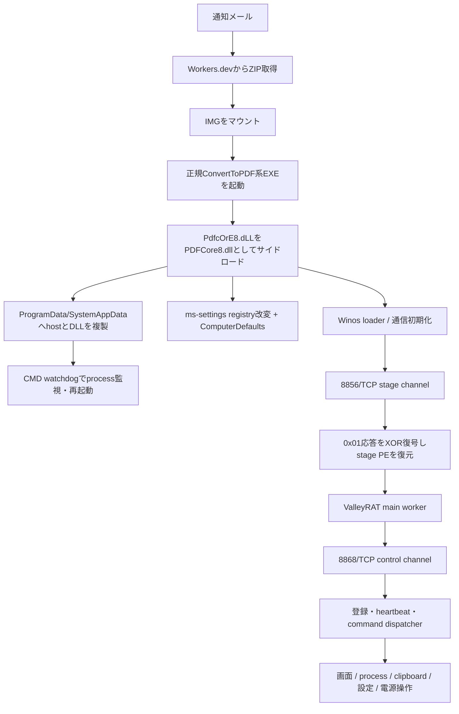

# 全体ロジック

```mermaid
flowchart TD
  A["通知メール"] --> B["Workers.devからZIP取得"]
  B --> C["IMGをマウント"]
  C --> D["正規ConvertToPDF系EXEを起動"]
  D --> E["PdfcOrE8.dLLをPDFCore8.dllとしてサイドロード"]
  E --> F["ProgramData/SystemAppDataへhostとDLLを複製"]
  E --> G["ms-settings registry改変 + ComputerDefaults"]
  F --> H["CMD watchdogでprocess監視・再起動"]
  E --> I["Winos loader / 通信初期化"]
  I --> J["8856/TCP stage channel"]
  J --> K["0x01応答をXOR復号しstage PEを復元"]
  K --> L["ValleyRAT main worker"]
  L --> M["8868/TCP control channel"]
  M --> N["登録・heartbeat・command dispatcher"]
  N --> O["画面 / process / clipboard / 設定 / 電源操作"]
```

外層の保護された制御フローから平文C2を直接抽出したのではなく、同一解析タスクのPCAPをTCP sequenceで再構成し、Winos frameを復号してstageを復元しました。live確認は図のstage要求以降を再現せず、stage portはconnect-only、control portはheartbeatだけです。
