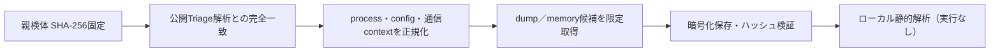

# Triage公開解析・後段取得証跡

## 完全ハッシュ一致

- [260803-p3atvaybnh](https://tria.ge/260803-p3atvaybnh): ファミリー候補 `valleyrat_s2`、評価score `10`
- [260803-pnffsaxfpb](https://tria.ge/260803-pnffsaxfpb): ファミリー候補 `未確定`、評価score `7`

## プロセス・通信

- 観測process: `EvasionGUI_bundle.exe, payload_64.exe`
- raw commandは保存せず、command SHA-256と処理patternだけをJSONへ保持しています。
- sandbox background trafficは`context_only`であり、C2へ自動昇格しません。

- `127.0.0.1:80`（sandbox config候補）
- `192.140.175.92:6666`（sandbox config候補）
- `192.140.175.92:9999`（sandbox config候補）

## 二段目成果物

- `51e1f4efb3ca02469d5bfc56a4cbc5f0df332059b4ace7183fd984ee28cb5221` / `dumped_file` / 198144 bytes / 親と同一: `false` / 静的解析: `partial`

## 判定境界

Triage由来のfamily、process、config、通信は外部sandbox証跡です。config extractorが返したendpointはC2候補として扱えますが、
静的設定復元またはprocess帰属とprotocol応答が揃うまでは確認済みC2とはしません。取得成果物と検体は実行していません。
