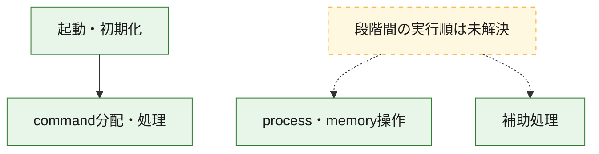
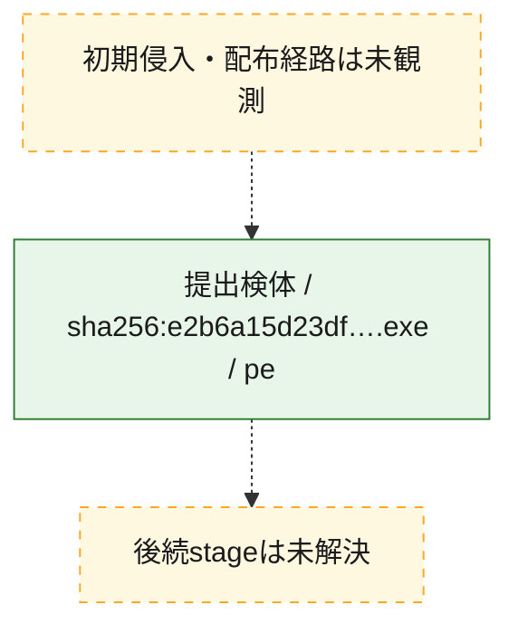
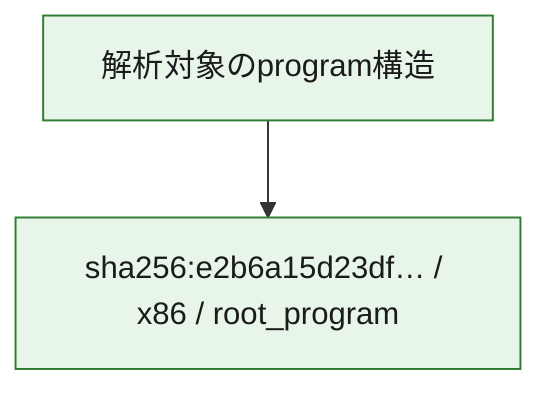

# 全体ロジック：e2b6a15d23df0f4f3836d84f68e3c2dabd0abad9c2c0d69dea64917b6f6c1d84

代表関数の静的証跡から、起動・初期化、process・memory操作、command分配・処理の処理群を確認しました。

## 読み方

- phaseの掲載順は解析上の整理順です。observed_call_edgesがない段階間の実行順を断定しません。
- 図の実線は静的に観測した関係、点線と黄色のノードは未観測・未解決の関係を示します。
- 図は静的な要約であり、動的実行を再現するものではありません。
- 詳細な関数解説とfingerprintは[STATIC-LOGIC.md](STATIC-LOGIC.md)を参照してください。

## 静的可視化

### 実行フロー

### 感染チェーン

### モジュール関係

## 処理段階

### 1. 起動・初期化

entry pointから初期化と後続処理への移行を確認します。
確度: `confirmed_static_function_evidence`

- `e2b6a15d23df0f4f3836d84f68e3c2dabd0abad9c2c0d69dea64917b6f6c1d84:ghidra:1402da0e4` — 初期化と主要処理への分岐を行う入口関数です。 状態: `succeeded`、選定理由: `entry_point`, `meaningful_symbol_name`, `reviewed_call_centrality:22`, `role:entrypoint`

### 2. process・memory操作

process、thread、module、memory操作と実行移行を確認します。
確度: `confirmed_static_function_evidence`

- `e2b6a15d23df0f4f3836d84f68e3c2dabd0abad9c2c0d69dea64917b6f6c1d84:ghidra:14000d2f0` — process、thread、module、またはmemory操作に関係する関数です。 状態: `succeeded`、選定理由: `entry_point`, `meaningful_symbol_name`, `reviewed_call_centrality:42`, `role:process_or_memory_operation`

### 3. command分配・処理

受信commandやtaskの解釈、分配、個別handlerへの移行を確認します。
確度: `confirmed_static_function_evidence_with_limits`

- `e2b6a15d23df0f4f3836d84f68e3c2dabd0abad9c2c0d69dea64917b6f6c1d84:ghidra:14030ecb0` — commandの解釈、分配、または個別処理を担当する関数です。 状態: `limited_bad_instruction_or_flow`、選定理由: `meaningful_symbol_name`, `reviewed_call_centrality:1`, `role:command_dispatch_or_handler`

### 4. 補助処理

主要処理を支える一般内部関数またはlibrary処理を確認します。
確度: `confirmed_static_function_evidence`

- `e2b6a15d23df0f4f3836d84f68e3c2dabd0abad9c2c0d69dea64917b6f6c1d84:ghidra:140001000` — 検体内部の一般処理を実装する関数です。 状態: `succeeded`、選定理由: `context_representative`, `reviewed_call_centrality:2`
- `e2b6a15d23df0f4f3836d84f68e3c2dabd0abad9c2c0d69dea64917b6f6c1d84:ghidra:140001020` — 検体内部の一般処理を実装する関数です。 状態: `succeeded`、選定理由: `context_representative`, `reviewed_call_centrality:2`
- `e2b6a15d23df0f4f3836d84f68e3c2dabd0abad9c2c0d69dea64917b6f6c1d84:ghidra:140001090` — 検体内部の一般処理を実装する関数です。 状態: `succeeded`、選定理由: `context_representative`, `reviewed_call_centrality:2`
- `e2b6a15d23df0f4f3836d84f68e3c2dabd0abad9c2c0d69dea64917b6f6c1d84:ghidra:1400010c0` — 検体内部の一般処理を実装する関数です。 状態: `succeeded`、選定理由: `context_representative`, `reviewed_call_centrality:2`
- `e2b6a15d23df0f4f3836d84f68e3c2dabd0abad9c2c0d69dea64917b6f6c1d84:ghidra:1400010f0` — 検体内部の一般処理を実装する関数です。 状態: `succeeded`、選定理由: `context_representative`, `reviewed_call_centrality:1`
- `e2b6a15d23df0f4f3836d84f68e3c2dabd0abad9c2c0d69dea64917b6f6c1d84:ghidra:140001110` — 検体内部の一般処理を実装する関数です。 状態: `succeeded`、選定理由: `context_representative`, `reviewed_call_centrality:3`
- `e2b6a15d23df0f4f3836d84f68e3c2dabd0abad9c2c0d69dea64917b6f6c1d84:ghidra:140001230` — 検体内部の一般処理を実装する関数です。 状態: `succeeded`、選定理由: `context_representative`, `reviewed_call_centrality:2`
- `e2b6a15d23df0f4f3836d84f68e3c2dabd0abad9c2c0d69dea64917b6f6c1d84:ghidra:140001260` — 検体内部の一般処理を実装する関数です。 状態: `succeeded`、選定理由: `context_representative`, `reviewed_call_centrality:2`
- `e2b6a15d23df0f4f3836d84f68e3c2dabd0abad9c2c0d69dea64917b6f6c1d84:ghidra:140001290` — 検体内部の一般処理を実装する関数です。 状態: `succeeded`、選定理由: `context_representative`, `reviewed_call_centrality:2`
- `e2b6a15d23df0f4f3836d84f68e3c2dabd0abad9c2c0d69dea64917b6f6c1d84:ghidra:1400012c0` — 検体内部の一般処理を実装する関数です。 状態: `succeeded`、選定理由: `context_representative`, `reviewed_call_centrality:2`
- `e2b6a15d23df0f4f3836d84f68e3c2dabd0abad9c2c0d69dea64917b6f6c1d84:ghidra:140001310` — 検体内部の一般処理を実装する関数です。 状態: `succeeded`、選定理由: `context_representative`, `reviewed_call_centrality:2`
- `e2b6a15d23df0f4f3836d84f68e3c2dabd0abad9c2c0d69dea64917b6f6c1d84:ghidra:140001340` — 検体内部の一般処理を実装する関数です。 状態: `succeeded`、選定理由: `context_representative`, `reviewed_call_centrality:2`
- `e2b6a15d23df0f4f3836d84f68e3c2dabd0abad9c2c0d69dea64917b6f6c1d84:ghidra:140001470` — 検体内部の一般処理を実装する関数です。 状態: `succeeded`、選定理由: `context_representative`, `reviewed_call_centrality:2`
- `e2b6a15d23df0f4f3836d84f68e3c2dabd0abad9c2c0d69dea64917b6f6c1d84:ghidra:140001570` — 検体内部の一般処理を実装する関数です。 状態: `succeeded`、選定理由: `context_representative`, `reviewed_call_centrality:2`
- `e2b6a15d23df0f4f3836d84f68e3c2dabd0abad9c2c0d69dea64917b6f6c1d84:ghidra:1400015d0` — 検体内部の一般処理を実装する関数です。 状態: `succeeded`、選定理由: `context_representative`, `reviewed_call_centrality:2`
- `e2b6a15d23df0f4f3836d84f68e3c2dabd0abad9c2c0d69dea64917b6f6c1d84:ghidra:1400015f0` — 検体内部の一般処理を実装する関数です。 状態: `succeeded`、選定理由: `context_representative`, `reviewed_call_centrality:2`
- `e2b6a15d23df0f4f3836d84f68e3c2dabd0abad9c2c0d69dea64917b6f6c1d84:ghidra:140001620` — 検体内部の一般処理を実装する関数です。 状態: `succeeded`、選定理由: `context_representative`, `reviewed_call_centrality:2`
- `e2b6a15d23df0f4f3836d84f68e3c2dabd0abad9c2c0d69dea64917b6f6c1d84:ghidra:140001640` — 検体内部の一般処理を実装する関数です。 状態: `succeeded`、選定理由: `context_representative`, `reviewed_call_centrality:2`
- `e2b6a15d23df0f4f3836d84f68e3c2dabd0abad9c2c0d69dea64917b6f6c1d84:ghidra:140001700` — 検体内部の一般処理を実装する関数です。 状態: `succeeded`、選定理由: `context_representative`, `reviewed_call_centrality:2`
- `e2b6a15d23df0f4f3836d84f68e3c2dabd0abad9c2c0d69dea64917b6f6c1d84:ghidra:140001760` — 検体内部の一般処理を実装する関数です。 状態: `succeeded`、選定理由: `context_representative`, `reviewed_call_centrality:14`
- `e2b6a15d23df0f4f3836d84f68e3c2dabd0abad9c2c0d69dea64917b6f6c1d84:ghidra:140001820` — 検体内部の一般処理を実装する関数です。 状態: `succeeded`、選定理由: `context_representative`, `reviewed_call_centrality:1`
- `e2b6a15d23df0f4f3836d84f68e3c2dabd0abad9c2c0d69dea64917b6f6c1d84:ghidra:140001850` — 検体内部の一般処理を実装する関数です。 状態: `succeeded`、選定理由: `context_representative`, `reviewed_call_centrality:1`
- `e2b6a15d23df0f4f3836d84f68e3c2dabd0abad9c2c0d69dea64917b6f6c1d84:ghidra:140001a20` — 検体内部の一般処理を実装する関数です。 状態: `succeeded`、選定理由: `context_representative`, `reviewed_call_centrality:2`
- `e2b6a15d23df0f4f3836d84f68e3c2dabd0abad9c2c0d69dea64917b6f6c1d84:ghidra:140001a90` — 検体内部の一般処理を実装する関数です。 状態: `succeeded`、選定理由: `context_representative`, `reviewed_call_centrality:1`
- `e2b6a15d23df0f4f3836d84f68e3c2dabd0abad9c2c0d69dea64917b6f6c1d84:ghidra:140001b30` — 検体内部の一般処理を実装する関数です。 状態: `succeeded`、選定理由: `context_representative`, `reviewed_call_centrality:1`
- `e2b6a15d23df0f4f3836d84f68e3c2dabd0abad9c2c0d69dea64917b6f6c1d84:ghidra:140001bc0` — 検体内部の一般処理を実装する関数です。 状態: `succeeded`、選定理由: `context_representative`, `reviewed_call_centrality:2`
- `e2b6a15d23df0f4f3836d84f68e3c2dabd0abad9c2c0d69dea64917b6f6c1d84:ghidra:140001c70` — 検体内部の一般処理を実装する関数です。 状態: `succeeded`、選定理由: `context_representative`, `reviewed_call_centrality:4`
- `e2b6a15d23df0f4f3836d84f68e3c2dabd0abad9c2c0d69dea64917b6f6c1d84:ghidra:140001ce4` — 検体内部の一般処理を実装する関数です。 状態: `succeeded`、選定理由: `context_representative`, `reviewed_call_centrality:2`
- `e2b6a15d23df0f4f3836d84f68e3c2dabd0abad9c2c0d69dea64917b6f6c1d84:ghidra:14000b090` — 検体内部の一般処理を実装する関数です。 状態: `succeeded`、選定理由: `meaningful_symbol_name`

## 観測したcall関係

- `e2b6a15d23df0f4f3836d84f68e3c2dabd0abad9c2c0d69dea64917b6f6c1d84:ghidra:1402da0e4` → `e2b6a15d23df0f4f3836d84f68e3c2dabd0abad9c2c0d69dea64917b6f6c1d84:ghidra:14030ecb0` （`startup` → `dispatch`）
- `ghidra-function:09eaee471a2f4480d9d22514` → `ghidra-external:070ce1c45a069861376cc99e` （`unclassified` → `unclassified`）
- `ghidra-function:09eaee471a2f4480d9d22514` → `ghidra-external:118f4ce5433c1859cbf8f987` （`unclassified` → `unclassified`）
- `ghidra-function:09eaee471a2f4480d9d22514` → `ghidra-external:4694c570bc9e4a7ac725b235` （`unclassified` → `unclassified`）
- `ghidra-function:09eaee471a2f4480d9d22514` → `ghidra-external:6b82be0c0db015943b648156` （`unclassified` → `unclassified`）
- `ghidra-function:09eaee471a2f4480d9d22514` → `ghidra-external:88ad37cce75d3994e9da933c` （`unclassified` → `unclassified`）
- `ghidra-function:09eaee471a2f4480d9d22514` → `ghidra-external:a728b9d37d2ef1f78d64fe1d` （`unclassified` → `unclassified`）
- `ghidra-function:09eaee471a2f4480d9d22514` → `ghidra-external:fdea419861cc7e2f63179d32` （`unclassified` → `unclassified`）
- `ghidra-function:09eaee471a2f4480d9d22514` → `ghidra-function:0f4dd2e012cd488eb34e820a` （`unclassified` → `unclassified`）
- `ghidra-function:09eaee471a2f4480d9d22514` → `ghidra-function:26b7adffbdea76c06928ecbe` （`unclassified` → `unclassified`）
- `ghidra-function:09eaee471a2f4480d9d22514` → `ghidra-function:26d3df1002665abcb10241f9` （`unclassified` → `unclassified`）
- `ghidra-function:09eaee471a2f4480d9d22514` → `ghidra-function:2e3b0675fc2898aff2df2a1b` （`unclassified` → `unclassified`）
- `ghidra-function:09eaee471a2f4480d9d22514` → `ghidra-function:60e8a46d81a8baa35492706c` （`unclassified` → `unclassified`）
- `ghidra-function:09eaee471a2f4480d9d22514` → `ghidra-function:88e633991e981c0808f09186` （`unclassified` → `unclassified`）
- `ghidra-function:09eaee471a2f4480d9d22514` → `ghidra-function:8ddb4ff9cdc4242c76dc722c` （`unclassified` → `unclassified`）
- `ghidra-function:09eaee471a2f4480d9d22514` → `ghidra-function:9bdc35df0aaf3f6abf34f14c` （`unclassified` → `unclassified`）
- `ghidra-function:09eaee471a2f4480d9d22514` → `ghidra-function:a9b2d1ad2a36c2c3fbd6b324` （`unclassified` → `unclassified`）
- `ghidra-function:09eaee471a2f4480d9d22514` → `ghidra-function:bd020a38ef80da4d8561e9f2` （`unclassified` → `unclassified`）
- `ghidra-function:09eaee471a2f4480d9d22514` → `ghidra-function:c62000224f0cf8588882254c` （`unclassified` → `unclassified`）
- `ghidra-function:09eaee471a2f4480d9d22514` → `ghidra-function:c6c7920aa650e2006c9f5eee` （`unclassified` → `unclassified`）
- `ghidra-function:09eaee471a2f4480d9d22514` → `ghidra-function:defd56721279e2bdd101b0f4` （`unclassified` → `unclassified`）
- `ghidra-function:09eaee471a2f4480d9d22514` → `ghidra-function:f84e972becf2ba560d9a346a` （`unclassified` → `unclassified`）
- `ghidra-function:09eaee471a2f4480d9d22514` → `ghidra-function:f9d5cd25cd3c9e3f5fd6aa7c` （`unclassified` → `unclassified`）
- `ghidra-function:150241ed52ce84dd764c4766` → `ghidra-function:6d72651ec1600adf3e0bb788` （`unclassified` → `unclassified`）
- `ghidra-function:150241ed52ce84dd764c4766` → `ghidra-function:ea743ba0b860a9e6ff69b492` （`unclassified` → `unclassified`）
- `ghidra-function:26f4cfe2f7360365dcf4ba8e` → `ghidra-function:d02df8010fff3a37ed055a8a` （`unclassified` → `unclassified`）
- `ghidra-function:26f4cfe2f7360365dcf4ba8e` → `ghidra-function:ea743ba0b860a9e6ff69b492` （`unclassified` → `unclassified`）
- `ghidra-function:3081bc985a9ca9a994e7a4e1` → `ghidra-function:b80bc41ba6cce8b498d0c81b` （`unclassified` → `unclassified`）
- `ghidra-function:3081bc985a9ca9a994e7a4e1` → `ghidra-function:ea743ba0b860a9e6ff69b492` （`unclassified` → `unclassified`）
- `ghidra-function:34494b8a6ca1a550187cfad8` → `ghidra-function:ea743ba0b860a9e6ff69b492` （`unclassified` → `unclassified`）
- `ghidra-function:34494b8a6ca1a550187cfad8` → `ghidra-function:f5981981585598b915f7eb49` （`unclassified` → `unclassified`）
- `ghidra-function:3c314d8e45f75755be7a4d58` → `ghidra-function:ba11ae736330b4d3196bfde4` （`unclassified` → `unclassified`）
- `ghidra-function:3c314d8e45f75755be7a4d58` → `ghidra-function:ea743ba0b860a9e6ff69b492` （`unclassified` → `unclassified`）
- `ghidra-function:3eef65ac9c45a744b940b712` → `ghidra-function:ea743ba0b860a9e6ff69b492` （`unclassified` → `unclassified`）
- `ghidra-function:3eef65ac9c45a744b940b712` → `ghidra-function:f5981981585598b915f7eb49` （`unclassified` → `unclassified`）
- `ghidra-function:44bc2d56590fb11e931f0892` → `ghidra-function:ba11ae736330b4d3196bfde4` （`unclassified` → `unclassified`）
- `ghidra-function:44bc2d56590fb11e931f0892` → `ghidra-function:ea743ba0b860a9e6ff69b492` （`unclassified` → `unclassified`）
- `ghidra-function:47f5081bc1bfb9e55de80e22` → `ghidra-function:ea743ba0b860a9e6ff69b492` （`unclassified` → `unclassified`）
- `ghidra-function:50ddd04ccf47ef6f27d37412` → `ghidra-function:9abb2bbf44b51868f459b2df` （`unclassified` → `unclassified`）
- `ghidra-function:50ddd04ccf47ef6f27d37412` → `ghidra-function:ea743ba0b860a9e6ff69b492` （`unclassified` → `unclassified`）
- `ghidra-function:539da7ca2f3757346840ef2c` → `ghidra-external:007472ef9f7fc1668db59213` （`unclassified` → `unclassified`）
- `ghidra-function:539da7ca2f3757346840ef2c` → `ghidra-function:ea743ba0b860a9e6ff69b492` （`unclassified` → `unclassified`）
- `ghidra-function:555889b28f2261b8fa6d5548` → `ghidra-function:1018e98835090b0e79d1852a` （`unclassified` → `unclassified`）
- `ghidra-function:555889b28f2261b8fa6d5548` → `ghidra-function:61bb22de8f815879cebae818` （`unclassified` → `unclassified`）
- `ghidra-function:555889b28f2261b8fa6d5548` → `ghidra-function:65949ec943a1678c6f18c187` （`unclassified` → `unclassified`）
- `ghidra-function:555889b28f2261b8fa6d5548` → `ghidra-function:9cfd11fc165774eeba207b41` （`unclassified` → `unclassified`）
- `ghidra-function:5b4024aa107e6504b84965b8` → `ghidra-external:be0fc4b4e7cf7b2135e75c2f` （`unclassified` → `unclassified`）
- `ghidra-function:5b4024aa107e6504b84965b8` → `ghidra-function:073d9bfbda3878e368df69e4` （`unclassified` → `unclassified`）
- `ghidra-function:5b4024aa107e6504b84965b8` → `ghidra-function:b74c8d8504397cff502e8e21` （`unclassified` → `unclassified`）
- `ghidra-function:5cf3d2088454225f9bd1b766` → `ghidra-function:b80bc41ba6cce8b498d0c81b` （`unclassified` → `unclassified`）
- `ghidra-function:5cf3d2088454225f9bd1b766` → `ghidra-function:ea743ba0b860a9e6ff69b492` （`unclassified` → `unclassified`）
- `ghidra-function:6acf519bd9bd36e5921c25db` → `ghidra-function:b80bc41ba6cce8b498d0c81b` （`unclassified` → `unclassified`）
- `ghidra-function:6acf519bd9bd36e5921c25db` → `ghidra-function:ea743ba0b860a9e6ff69b492` （`unclassified` → `unclassified`）
- `ghidra-function:7a70960782a9ab8ea1735822` → `ghidra-external:184ecd01324804651fe82936` （`unclassified` → `unclassified`）
- `ghidra-function:7a70960782a9ab8ea1735822` → `ghidra-external:6b82be0c0db015943b648156` （`unclassified` → `unclassified`）
- `ghidra-function:7a70960782a9ab8ea1735822` → `ghidra-external:9e3cfececb544319ebb1416f` （`unclassified` → `unclassified`）
- `ghidra-function:7a70960782a9ab8ea1735822` → `ghidra-external:c15d51e86b2b9e71feebd15a` （`unclassified` → `unclassified`）
- `ghidra-function:7a70960782a9ab8ea1735822` → `ghidra-function:1e3096f369005af937e520cb` （`unclassified` → `unclassified`）
- `ghidra-function:7a70960782a9ab8ea1735822` → `ghidra-function:1e920f38e5888947f675c4c6` （`unclassified` → `unclassified`）
- `ghidra-function:7a70960782a9ab8ea1735822` → `ghidra-function:20c5fc773c9f69fa4d051371` （`unclassified` → `unclassified`）
- `ghidra-function:7a70960782a9ab8ea1735822` → `ghidra-function:253fe7b897d9995b6ac81a63` （`unclassified` → `unclassified`）
- `ghidra-function:7a70960782a9ab8ea1735822` → `ghidra-function:32333f2e968a48ee0871cadb` （`unclassified` → `unclassified`）
- `ghidra-function:7a70960782a9ab8ea1735822` → `ghidra-function:380ed04a2fd6c32f52fe612d` （`unclassified` → `unclassified`）
- `ghidra-function:7a70960782a9ab8ea1735822` → `ghidra-function:521782fbca88a52838258bde` （`unclassified` → `unclassified`）
- `ghidra-function:7a70960782a9ab8ea1735822` → `ghidra-function:5de19cb66f58031a3d2bc1df` （`unclassified` → `unclassified`）
- `ghidra-function:7a70960782a9ab8ea1735822` → `ghidra-function:67494f34cee102440b4277dd` （`unclassified` → `unclassified`）
- `ghidra-function:7a70960782a9ab8ea1735822` → `ghidra-function:6d72651ec1600adf3e0bb788` （`unclassified` → `unclassified`）
- `ghidra-function:7a70960782a9ab8ea1735822` → `ghidra-function:7ffd9af3528ea5632d6c2f63` （`unclassified` → `unclassified`）
- `ghidra-function:7a70960782a9ab8ea1735822` → `ghidra-function:81b5db15900843ff905da528` （`unclassified` → `unclassified`）
- `ghidra-function:7a70960782a9ab8ea1735822` → `ghidra-function:82ecd4909d5e0d0e789d5fc7` （`unclassified` → `unclassified`）
- `ghidra-function:7a70960782a9ab8ea1735822` → `ghidra-function:89e2d3bb1039356c6c7a6dce` （`unclassified` → `unclassified`）
- `ghidra-function:7a70960782a9ab8ea1735822` → `ghidra-function:99e167b366484cfb3c0c3d9e` （`unclassified` → `unclassified`）
- `ghidra-function:7a70960782a9ab8ea1735822` → `ghidra-function:a0bc69d66d3311d702dd69ba` （`unclassified` → `unclassified`）
- `ghidra-function:7a70960782a9ab8ea1735822` → `ghidra-function:a6b2f5e85869aef3aa5bddf7` （`unclassified` → `unclassified`）
- `ghidra-function:7a70960782a9ab8ea1735822` → `ghidra-function:a761c18b65c12b6cacfea6d6` （`unclassified` → `unclassified`）
- `ghidra-function:7a70960782a9ab8ea1735822` → `ghidra-function:aa44a147d114e114644562da` （`unclassified` → `unclassified`）
- `ghidra-function:7a70960782a9ab8ea1735822` → `ghidra-function:af105b236ff6986a9325cbfe` （`unclassified` → `unclassified`）
- `ghidra-function:7a70960782a9ab8ea1735822` → `ghidra-function:ba11ae736330b4d3196bfde4` （`unclassified` → `unclassified`）
- `ghidra-function:7a70960782a9ab8ea1735822` → `ghidra-function:c32edababdcdbf8181d48462` （`unclassified` → `unclassified`）
- `ghidra-function:7a70960782a9ab8ea1735822` → `ghidra-function:cc4662153c6c57a812a9c31e` （`unclassified` → `unclassified`）
- `ghidra-function:7a70960782a9ab8ea1735822` → `ghidra-function:d30beab2f3706e1e3374de98` （`unclassified` → `unclassified`）
- `ghidra-function:7a70960782a9ab8ea1735822` → `ghidra-function:d687eacba71af60ac3b217fe` （`unclassified` → `unclassified`）
- `ghidra-function:7a70960782a9ab8ea1735822` → `ghidra-function:d6f70949f9cbc5092a008637` （`unclassified` → `unclassified`）
- `ghidra-function:7a70960782a9ab8ea1735822` → `ghidra-function:d8ee31a3a5f06e70d2d3a908` （`unclassified` → `unclassified`）
- `ghidra-function:7a70960782a9ab8ea1735822` → `ghidra-function:d9963afbab7ec283fe6d4fd9` （`unclassified` → `unclassified`）
- `ghidra-function:7a70960782a9ab8ea1735822` → `ghidra-function:e49a5ca8d6d89f019604012b` （`unclassified` → `unclassified`）
- `ghidra-function:7a70960782a9ab8ea1735822` → `ghidra-function:e9b7c4ff6535903e9eedac88` （`unclassified` → `unclassified`）
- `ghidra-function:7a70960782a9ab8ea1735822` → `ghidra-function:f38a4afe9364396a32de7a6a` （`unclassified` → `unclassified`）
- `ghidra-function:7a70960782a9ab8ea1735822` → `ghidra-function:fba8ebade665526d57306a2f` （`unclassified` → `unclassified`）
- `ghidra-function:7b471a1f6e1feb159a36b174` → `ghidra-function:ea743ba0b860a9e6ff69b492` （`unclassified` → `unclassified`）
- `ghidra-function:7b471a1f6e1feb159a36b174` → `ghidra-function:f5981981585598b915f7eb49` （`unclassified` → `unclassified`）
- `ghidra-function:7c51169de90f525b83852b06` → `ghidra-function:b80bc41ba6cce8b498d0c81b` （`unclassified` → `unclassified`）
- `ghidra-function:7c51169de90f525b83852b06` → `ghidra-function:ea743ba0b860a9e6ff69b492` （`unclassified` → `unclassified`）
- `ghidra-function:90317a66d42b05fe067539b3` → `ghidra-function:ea743ba0b860a9e6ff69b492` （`unclassified` → `unclassified`）
- `ghidra-function:90317a66d42b05fe067539b3` → `ghidra-function:f5981981585598b915f7eb49` （`unclassified` → `unclassified`）
- `ghidra-function:975abb34d9d54bcac1c46d86` → `ghidra-function:ba11ae736330b4d3196bfde4` （`unclassified` → `unclassified`）
- `ghidra-function:975abb34d9d54bcac1c46d86` → `ghidra-function:ea743ba0b860a9e6ff69b492` （`unclassified` → `unclassified`）
- `ghidra-function:a29a21a95519e961465ed53f` → `ghidra-function:ea743ba0b860a9e6ff69b492` （`unclassified` → `unclassified`）
- `ghidra-function:a4ba29f015bdb61fd4d15da6` → `ghidra-function:099ed190800d57574f984040` （`unclassified` → `unclassified`）
- `ghidra-function:a4ba29f015bdb61fd4d15da6` → `ghidra-function:0cdc76fe9ee931869cd66d13` （`unclassified` → `unclassified`）
- `ghidra-function:a4ba29f015bdb61fd4d15da6` → `ghidra-function:0e67c4fe7716635d9cb603c8` （`unclassified` → `unclassified`）
- `ghidra-function:a4ba29f015bdb61fd4d15da6` → `ghidra-function:5ba7b8ed7310c66acbc184d9` （`unclassified` → `unclassified`）
- `ghidra-function:a4ba29f015bdb61fd4d15da6` → `ghidra-function:6d72651ec1600adf3e0bb788` （`unclassified` → `unclassified`）
- `ghidra-function:a4ba29f015bdb61fd4d15da6` → `ghidra-function:7068753600e792b44ba5e250` （`unclassified` → `unclassified`）
- `ghidra-function:a4ba29f015bdb61fd4d15da6` → `ghidra-function:7da8088afe785fa8e737fbca` （`unclassified` → `unclassified`）
- `ghidra-function:a4ba29f015bdb61fd4d15da6` → `ghidra-function:98198d3d907ce6a0a6c7753a` （`unclassified` → `unclassified`）
- `ghidra-function:a4ba29f015bdb61fd4d15da6` → `ghidra-function:a9b5e0165f0b8140e59a9388` （`unclassified` → `unclassified`）
- `ghidra-function:a4ba29f015bdb61fd4d15da6` → `ghidra-function:c618dbf72c56610c45ad5391` （`unclassified` → `unclassified`）
- `ghidra-function:a4ba29f015bdb61fd4d15da6` → `ghidra-function:ea743ba0b860a9e6ff69b492` （`unclassified` → `unclassified`）
- `ghidra-function:c07bebc7bdeef089eea4c864` → `ghidra-function:9851955d60ece545c7a543a4` （`unclassified` → `unclassified`）
- `ghidra-function:c4a757a6f98c982fbc4e39c3` → `ghidra-function:d02df8010fff3a37ed055a8a` （`unclassified` → `unclassified`）
- `ghidra-function:c4a757a6f98c982fbc4e39c3` → `ghidra-function:ea743ba0b860a9e6ff69b492` （`unclassified` → `unclassified`）
- `ghidra-function:c534db8c62c4de9cbad44d00` → `ghidra-function:d02df8010fff3a37ed055a8a` （`unclassified` → `unclassified`）
- `ghidra-function:c534db8c62c4de9cbad44d00` → `ghidra-function:ea743ba0b860a9e6ff69b492` （`unclassified` → `unclassified`）
- `ghidra-function:d002c22c5629e24655ed3533` → `ghidra-function:6d9c0a0ad4e78b315fb1447e` （`unclassified` → `unclassified`）
- `ghidra-function:e4101e4f6bef39607ee6fb2c` → `ghidra-function:89e2d3bb1039356c6c7a6dce` （`unclassified` → `unclassified`）
- `ghidra-function:e4101e4f6bef39607ee6fb2c` → `ghidra-function:ea743ba0b860a9e6ff69b492` （`unclassified` → `unclassified`）
- `ghidra-function:e6176bbdb64f4231753fa7aa` → `ghidra-function:33766f084bde88c3620a85b3` （`unclassified` → `unclassified`）
- `ghidra-function:e6176bbdb64f4231753fa7aa` → `ghidra-function:ea743ba0b860a9e6ff69b492` （`unclassified` → `unclassified`）
- `ghidra-function:e90a632c5235cd95b248ce43` → `ghidra-function:ea743ba0b860a9e6ff69b492` （`unclassified` → `unclassified`）
- `ghidra-function:e90a632c5235cd95b248ce43` → `ghidra-function:f5981981585598b915f7eb49` （`unclassified` → `unclassified`）
- `ghidra-function:f7197dd7161a94c8021b3fd2` → `ghidra-function:6d9c0a0ad4e78b315fb1447e` （`unclassified` → `unclassified`）

## 解析範囲と制約

- 選定外関数は全体inventoryへ残しますが、関数本体の個別解説対象にはしていません。
- indirect call、難読化、packer、VM、壊れたcontrol flowによりcall関係が欠落する場合があります。
- 文書は静的解析に基づき、検体実行や外部通信による動的確認は行っていません。
