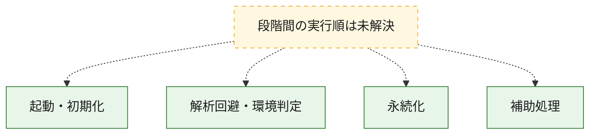
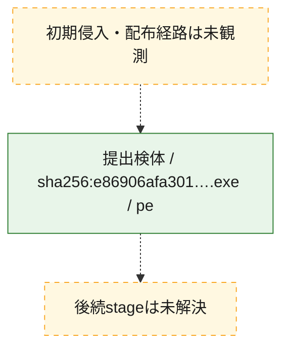
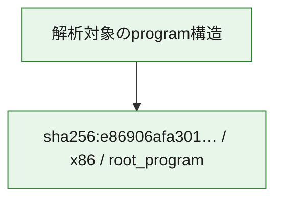

# 全体ロジック：e86906afa3013ef8db6cc941c7196304c3e04c58eb08b2e7be7d6c51c59d70fc

代表関数の静的証跡から、起動・初期化、解析回避・環境判定、永続化の処理群を確認しました。

## 読み方

- phaseの掲載順は解析上の整理順です。observed_call_edgesがない段階間の実行順を断定しません。
- 図の実線は静的に観測した関係、点線と黄色のノードは未観測・未解決の関係を示します。
- 図は静的な要約であり、動的実行を再現するものではありません。
- 詳細な関数解説とfingerprintは[STATIC-LOGIC.md](STATIC-LOGIC.md)を参照してください。

## 静的可視化

### 実行フロー

### 感染チェーン

### モジュール関係

## 処理段階

### 1. 起動・初期化

entry pointから初期化と後続処理への移行を確認します。
確度: `confirmed_static_function_evidence`

- `e86906afa3013ef8db6cc941c7196304c3e04c58eb08b2e7be7d6c51c59d70fc:ghidra:140001520` — 初期化と主要処理への分岐を行う入口関数です。 状態: `succeeded`、選定理由: `entry_point`, `meaningful_symbol_name`, `reviewed_call_centrality:2`, `role:entrypoint`

### 2. 解析回避・環境判定

debugger、sandbox、仮想環境、時間差などの判定を確認します。
確度: `confirmed_static_function_evidence`

- `e86906afa3013ef8db6cc941c7196304c3e04c58eb08b2e7be7d6c51c59d70fc:ghidra:140005f32` — debugger、仮想環境、sandbox、または時間差の確認に関係する関数です。 状態: `succeeded`、選定理由: `context_representative`, `reviewed_call_centrality:5`, `role:anti_analysis`

### 3. 永続化

自動起動や永続化に関係する設定変更を確認します。
確度: `confirmed_static_function_evidence`

- `e86906afa3013ef8db6cc941c7196304c3e04c58eb08b2e7be7d6c51c59d70fc:ghidra:140001000` — 自動起動または永続化に関係する処理を含む関数です。 状態: `succeeded`、選定理由: `context_representative`, `reviewed_call_centrality:25`, `role:persistence`

### 4. 補助処理

主要処理を支える一般内部関数またはlibrary処理を確認します。
確度: `confirmed_static_function_evidence`

- `e86906afa3013ef8db6cc941c7196304c3e04c58eb08b2e7be7d6c51c59d70fc:ghidra:140001330` — 検体内部の一般処理を実装する関数です。 状態: `succeeded`、選定理由: `context_representative`, `reviewed_call_centrality:1`
- `e86906afa3013ef8db6cc941c7196304c3e04c58eb08b2e7be7d6c51c59d70fc:ghidra:140001350` — 検体内部の一般処理を実装する関数です。 状態: `succeeded`、選定理由: `context_representative`, `reviewed_call_centrality:1`
- `e86906afa3013ef8db6cc941c7196304c3e04c58eb08b2e7be7d6c51c59d70fc:ghidra:140001370` — 検体内部の一般処理を実装する関数です。 状態: `succeeded`、選定理由: `context_representative`, `reviewed_call_centrality:1`
- `e86906afa3013ef8db6cc941c7196304c3e04c58eb08b2e7be7d6c51c59d70fc:ghidra:1400013c0` — 検体内部の一般処理を実装する関数です。 状態: `succeeded`、選定理由: `context_representative`, `reviewed_call_centrality:2`
- `e86906afa3013ef8db6cc941c7196304c3e04c58eb08b2e7be7d6c51c59d70fc:ghidra:1400013e0` — 検体内部の一般処理を実装する関数です。 状態: `succeeded`、選定理由: `context_representative`, `reviewed_call_centrality:6`
- `e86906afa3013ef8db6cc941c7196304c3e04c58eb08b2e7be7d6c51c59d70fc:ghidra:140001510` — 検体内部の一般処理を実装する関数です。 状態: `succeeded`、選定理由: `context_representative`
- `e86906afa3013ef8db6cc941c7196304c3e04c58eb08b2e7be7d6c51c59d70fc:ghidra:140001570` — 検体内部の一般処理を実装する関数です。 状態: `succeeded`、選定理由: `context_representative`, `reviewed_call_centrality:1`
- `e86906afa3013ef8db6cc941c7196304c3e04c58eb08b2e7be7d6c51c59d70fc:ghidra:140001580` — 検体内部の一般処理を実装する関数です。 状態: `succeeded`、選定理由: `context_representative`
- `e86906afa3013ef8db6cc941c7196304c3e04c58eb08b2e7be7d6c51c59d70fc:ghidra:140001590` — 検体内部の一般処理を実装する関数です。 状態: `succeeded`、選定理由: `context_representative`, `reviewed_call_centrality:2`
- `e86906afa3013ef8db6cc941c7196304c3e04c58eb08b2e7be7d6c51c59d70fc:ghidra:140001720` — 検体内部の一般処理を実装する関数です。 状態: `succeeded`、選定理由: `context_representative`, `reviewed_call_centrality:4`
- `e86906afa3013ef8db6cc941c7196304c3e04c58eb08b2e7be7d6c51c59d70fc:ghidra:140001a4d` — 検体内部の一般処理を実装する関数です。 状態: `succeeded`、選定理由: `context_representative`, `reviewed_call_centrality:2`
- `e86906afa3013ef8db6cc941c7196304c3e04c58eb08b2e7be7d6c51c59d70fc:ghidra:140001aa8` — 検体内部の一般処理を実装する関数です。 状態: `succeeded`、選定理由: `context_representative`, `reviewed_call_centrality:3`
- `e86906afa3013ef8db6cc941c7196304c3e04c58eb08b2e7be7d6c51c59d70fc:ghidra:140001d18` — 検体内部の一般処理を実装する関数です。 状態: `succeeded`、選定理由: `context_representative`, `reviewed_call_centrality:2`
- `e86906afa3013ef8db6cc941c7196304c3e04c58eb08b2e7be7d6c51c59d70fc:ghidra:1400020b8` — 検体内部の一般処理を実装する関数です。 状態: `succeeded`、選定理由: `context_representative`, `reviewed_call_centrality:2`
- `e86906afa3013ef8db6cc941c7196304c3e04c58eb08b2e7be7d6c51c59d70fc:ghidra:1400022e2` — 検体内部の一般処理を実装する関数です。 状態: `succeeded`、選定理由: `context_representative`, `reviewed_call_centrality:2`
- `e86906afa3013ef8db6cc941c7196304c3e04c58eb08b2e7be7d6c51c59d70fc:ghidra:1400029c8` — 検体内部の一般処理を実装する関数です。 状態: `succeeded`、選定理由: `context_representative`, `reviewed_call_centrality:2`
- `e86906afa3013ef8db6cc941c7196304c3e04c58eb08b2e7be7d6c51c59d70fc:ghidra:140004674` — 検体内部の一般処理を実装する関数です。 状態: `succeeded`、選定理由: `context_representative`, `reviewed_call_centrality:2`
- `e86906afa3013ef8db6cc941c7196304c3e04c58eb08b2e7be7d6c51c59d70fc:ghidra:1400047f3` — 検体内部の一般処理を実装する関数です。 状態: `succeeded`、選定理由: `context_representative`, `reviewed_call_centrality:2`
- `e86906afa3013ef8db6cc941c7196304c3e04c58eb08b2e7be7d6c51c59d70fc:ghidra:140004855` — 検体内部の一般処理を実装する関数です。 状態: `succeeded`、選定理由: `context_representative`, `reviewed_call_centrality:2`
- `e86906afa3013ef8db6cc941c7196304c3e04c58eb08b2e7be7d6c51c59d70fc:ghidra:1400048d2` — 検体内部の一般処理を実装する関数です。 状態: `succeeded`、選定理由: `context_representative`, `reviewed_call_centrality:2`
- `e86906afa3013ef8db6cc941c7196304c3e04c58eb08b2e7be7d6c51c59d70fc:ghidra:1400049c4` — 検体内部の一般処理を実装する関数です。 状態: `succeeded`、選定理由: `context_representative`, `reviewed_call_centrality:2`
- `e86906afa3013ef8db6cc941c7196304c3e04c58eb08b2e7be7d6c51c59d70fc:ghidra:140004a1c` — 検体内部の一般処理を実装する関数です。 状態: `succeeded`、選定理由: `context_representative`, `reviewed_call_centrality:2`
- `e86906afa3013ef8db6cc941c7196304c3e04c58eb08b2e7be7d6c51c59d70fc:ghidra:140004e96` — 検体内部の一般処理を実装する関数です。 状態: `succeeded`、選定理由: `context_representative`, `reviewed_call_centrality:2`
- `e86906afa3013ef8db6cc941c7196304c3e04c58eb08b2e7be7d6c51c59d70fc:ghidra:1400055a8` — 検体内部の一般処理を実装する関数です。 状態: `succeeded`、選定理由: `context_representative`, `reviewed_call_centrality:2`
- `e86906afa3013ef8db6cc941c7196304c3e04c58eb08b2e7be7d6c51c59d70fc:ghidra:1400057a2` — 検体内部の一般処理を実装する関数です。 状態: `succeeded`、選定理由: `context_representative`, `reviewed_call_centrality:2`
- `e86906afa3013ef8db6cc941c7196304c3e04c58eb08b2e7be7d6c51c59d70fc:ghidra:140005ab6` — 検体内部の一般処理を実装する関数です。 状態: `succeeded`、選定理由: `context_representative`, `reviewed_call_centrality:2`
- `e86906afa3013ef8db6cc941c7196304c3e04c58eb08b2e7be7d6c51c59d70fc:ghidra:14003e320` — compiler生成処理または汎用library処理とみられる関数です。 状態: `succeeded`、選定理由: `entry_point`, `meaningful_symbol_name`, `reviewed_call_centrality:16`
- `e86906afa3013ef8db6cc941c7196304c3e04c58eb08b2e7be7d6c51c59d70fc:ghidra:140053b90` — compiler生成処理または汎用library処理とみられる関数です。 状態: `succeeded`、選定理由: `entry_point`, `meaningful_symbol_name`, `reviewed_call_centrality:1`
- `e86906afa3013ef8db6cc941c7196304c3e04c58eb08b2e7be7d6c51c59d70fc:ghidra:140053bc0` — compiler生成処理または汎用library処理とみられる関数です。 状態: `succeeded`、選定理由: `entry_point`, `meaningful_symbol_name`, `reviewed_call_centrality:3`

## 観測したcall関係

- 代表関数間で直接解決できた呼出関係はありません。

## 解析範囲と制約

- 選定外関数は全体inventoryへ残しますが、関数本体の個別解説対象にはしていません。
- indirect call、難読化、packer、VM、壊れたcontrol flowによりcall関係が欠落する場合があります。
- 文書は静的解析に基づき、検体実行や外部通信による動的確認は行っていません。
