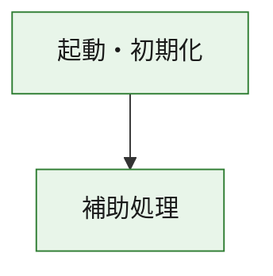
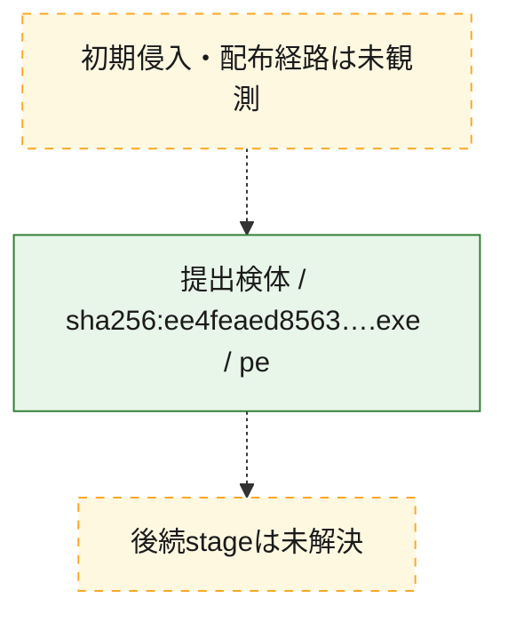
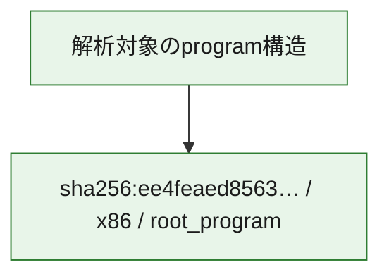

# 全体ロジック：ee4feaed8563112f59a2cdc2519e84937de269725e4abb2789aa39652579f390

代表関数の静的証跡から、起動・初期化の処理群を確認しました。

## 読み方

- phaseの掲載順は解析上の整理順です。observed_call_edgesがない段階間の実行順を断定しません。
- 図の実線は静的に観測した関係、点線と黄色のノードは未観測・未解決の関係を示します。
- 図は静的な要約であり、動的実行を再現するものではありません。
- 詳細な関数解説とfingerprintは[STATIC-LOGIC.md](STATIC-LOGIC.md)を参照してください。

## 静的可視化

### 実行フロー

### 感染チェーン

### モジュール関係

## 処理段階

### 1. 起動・初期化

entry pointから初期化と後続処理への移行を確認します。
確度: `confirmed_static_function_evidence`

- `ee4feaed8563112f59a2cdc2519e84937de269725e4abb2789aa39652579f390:ghidra:140003724` — 初期化と主要処理への分岐を行う入口関数です。 状態: `succeeded`、選定理由: `entry_point`, `meaningful_symbol_name`, `reviewed_call_centrality:22`, `role:entrypoint`

### 2. 補助処理

主要処理を支える一般内部関数またはlibrary処理を確認します。
確度: `confirmed_static_function_evidence`

- `ee4feaed8563112f59a2cdc2519e84937de269725e4abb2789aa39652579f390:ghidra:140001010` — 検体内部の一般処理を実装する関数です。 状態: `succeeded`、選定理由: `context_representative`, `reviewed_call_centrality:2`
- `ee4feaed8563112f59a2cdc2519e84937de269725e4abb2789aa39652579f390:ghidra:140001050` — 検体内部の一般処理を実装する関数です。 状態: `succeeded`、選定理由: `context_representative`, `reviewed_call_centrality:7`
- `ee4feaed8563112f59a2cdc2519e84937de269725e4abb2789aa39652579f390:ghidra:1400010f0` — 検体内部の一般処理を実装する関数です。 状態: `succeeded`、選定理由: `context_representative`, `reviewed_call_centrality:8`
- `ee4feaed8563112f59a2cdc2519e84937de269725e4abb2789aa39652579f390:ghidra:140001150` — 検体内部の一般処理を実装する関数です。 状態: `succeeded`、選定理由: `context_representative`, `reviewed_call_centrality:1`
- `ee4feaed8563112f59a2cdc2519e84937de269725e4abb2789aa39652579f390:ghidra:140001180` — 検体内部の一般処理を実装する関数です。 状態: `succeeded`、選定理由: `context_representative`, `reviewed_call_centrality:5`
- `ee4feaed8563112f59a2cdc2519e84937de269725e4abb2789aa39652579f390:ghidra:140001260` — 検体内部の一般処理を実装する関数です。 状態: `succeeded`、選定理由: `context_representative`, `reviewed_call_centrality:5`
- `ee4feaed8563112f59a2cdc2519e84937de269725e4abb2789aa39652579f390:ghidra:140001340` — 検体内部の一般処理を実装する関数です。 状態: `succeeded`、選定理由: `context_representative`, `reviewed_call_centrality:5`
- `ee4feaed8563112f59a2cdc2519e84937de269725e4abb2789aa39652579f390:ghidra:1400015e0` — 検体内部の一般処理を実装する関数です。 状態: `succeeded`、選定理由: `context_representative`, `reviewed_call_centrality:7`
- `ee4feaed8563112f59a2cdc2519e84937de269725e4abb2789aa39652579f390:ghidra:140001940` — 検体内部の一般処理を実装する関数です。 状態: `succeeded`、選定理由: `context_representative`, `reviewed_call_centrality:2`
- `ee4feaed8563112f59a2cdc2519e84937de269725e4abb2789aa39652579f390:ghidra:140001990` — 検体内部の一般処理を実装する関数です。 状態: `succeeded`、選定理由: `context_representative`, `reviewed_call_centrality:3`
- `ee4feaed8563112f59a2cdc2519e84937de269725e4abb2789aa39652579f390:ghidra:140001ad0` — 検体内部の一般処理を実装する関数です。 状態: `succeeded`、選定理由: `context_representative`, `reviewed_call_centrality:4`
- `ee4feaed8563112f59a2cdc2519e84937de269725e4abb2789aa39652579f390:ghidra:140001b50` — 検体内部の一般処理を実装する関数です。 状態: `succeeded`、選定理由: `context_representative`, `reviewed_call_centrality:3`
- `ee4feaed8563112f59a2cdc2519e84937de269725e4abb2789aa39652579f390:ghidra:140001d90` — 検体内部の一般処理を実装する関数です。 状態: `succeeded`、選定理由: `context_representative`, `reviewed_call_centrality:12`
- `ee4feaed8563112f59a2cdc2519e84937de269725e4abb2789aa39652579f390:ghidra:140002030` — 検体内部の一般処理を実装する関数です。 状態: `succeeded`、選定理由: `context_representative`, `reviewed_call_centrality:2`
- `ee4feaed8563112f59a2cdc2519e84937de269725e4abb2789aa39652579f390:ghidra:140002110` — 検体内部の一般処理を実装する関数です。 状態: `succeeded`、選定理由: `context_representative`, `reviewed_call_centrality:3`
- `ee4feaed8563112f59a2cdc2519e84937de269725e4abb2789aa39652579f390:ghidra:140002160` — 検体内部の一般処理を実装する関数です。 状態: `succeeded`、選定理由: `context_representative`, `reviewed_call_centrality:3`
- `ee4feaed8563112f59a2cdc2519e84937de269725e4abb2789aa39652579f390:ghidra:1400022f0` — 検体内部の一般処理を実装する関数です。 状態: `succeeded`、選定理由: `context_representative`, `reviewed_call_centrality:3`
- `ee4feaed8563112f59a2cdc2519e84937de269725e4abb2789aa39652579f390:ghidra:140002390` — 検体内部の一般処理を実装する関数です。 状態: `succeeded`、選定理由: `context_representative`, `reviewed_call_centrality:15`
- `ee4feaed8563112f59a2cdc2519e84937de269725e4abb2789aa39652579f390:ghidra:1400024e0` — 検体内部の一般処理を実装する関数です。 状態: `succeeded`、選定理由: `context_representative`, `reviewed_call_centrality:5`
- `ee4feaed8563112f59a2cdc2519e84937de269725e4abb2789aa39652579f390:ghidra:14000253c` — 検体内部の一般処理を実装する関数です。 状態: `succeeded`、選定理由: `context_representative`, `reviewed_call_centrality:3`
- `ee4feaed8563112f59a2cdc2519e84937de269725e4abb2789aa39652579f390:ghidra:140002564` — 検体内部の一般処理を実装する関数です。 状態: `succeeded`、選定理由: `context_representative`, `reviewed_call_centrality:2`
- `ee4feaed8563112f59a2cdc2519e84937de269725e4abb2789aa39652579f390:ghidra:140002594` — 検体内部の一般処理を実装する関数です。 状態: `succeeded`、選定理由: `context_representative`, `reviewed_call_centrality:3`
- `ee4feaed8563112f59a2cdc2519e84937de269725e4abb2789aa39652579f390:ghidra:1400025e8` — 検体内部の一般処理を実装する関数です。 状態: `succeeded`、選定理由: `context_representative`, `reviewed_call_centrality:2`
- `ee4feaed8563112f59a2cdc2519e84937de269725e4abb2789aa39652579f390:ghidra:140002624` — 検体内部の一般処理を実装する関数です。 状態: `succeeded`、選定理由: `context_representative`, `reviewed_call_centrality:3`
- `ee4feaed8563112f59a2cdc2519e84937de269725e4abb2789aa39652579f390:ghidra:140002650` — 検体内部の一般処理を実装する関数です。 状態: `succeeded`、選定理由: `context_representative`, `reviewed_call_centrality:2`
- `ee4feaed8563112f59a2cdc2519e84937de269725e4abb2789aa39652579f390:ghidra:14000268c` — 検体内部の一般処理を実装する関数です。 状態: `succeeded`、選定理由: `context_representative`, `reviewed_call_centrality:1`
- `ee4feaed8563112f59a2cdc2519e84937de269725e4abb2789aa39652579f390:ghidra:1400026d0` — 検体内部の一般処理を実装する関数です。 状態: `succeeded`、選定理由: `context_representative`, `reviewed_call_centrality:3`
- `ee4feaed8563112f59a2cdc2519e84937de269725e4abb2789aa39652579f390:ghidra:1400027bc` — 検体内部の一般処理を実装する関数です。 状態: `succeeded`、選定理由: `context_representative`, `reviewed_call_centrality:8`
- `ee4feaed8563112f59a2cdc2519e84937de269725e4abb2789aa39652579f390:ghidra:140002860` — 検体内部の一般処理を実装する関数です。 状態: `succeeded`、選定理由: `context_representative`, `reviewed_call_centrality:6`
- `ee4feaed8563112f59a2cdc2519e84937de269725e4abb2789aa39652579f390:ghidra:1400028f4` — 検体内部の一般処理を実装する関数です。 状態: `succeeded`、選定理由: `context_representative`, `reviewed_call_centrality:8`
- `ee4feaed8563112f59a2cdc2519e84937de269725e4abb2789aa39652579f390:ghidra:140002934` — 検体内部の一般処理を実装する関数です。 状態: `succeeded`、選定理由: `context_representative`, `reviewed_call_centrality:10`

## 観測したcall関係

- `ee4feaed8563112f59a2cdc2519e84937de269725e4abb2789aa39652579f390:ghidra:140001150` → `ee4feaed8563112f59a2cdc2519e84937de269725e4abb2789aa39652579f390:ghidra:140002624` （`support` → `support`）
- `ee4feaed8563112f59a2cdc2519e84937de269725e4abb2789aa39652579f390:ghidra:140001260` → `ee4feaed8563112f59a2cdc2519e84937de269725e4abb2789aa39652579f390:ghidra:140002564` （`support` → `support`）
- `ee4feaed8563112f59a2cdc2519e84937de269725e4abb2789aa39652579f390:ghidra:140001260` → `ee4feaed8563112f59a2cdc2519e84937de269725e4abb2789aa39652579f390:ghidra:1400027bc` （`support` → `support`）
- `ee4feaed8563112f59a2cdc2519e84937de269725e4abb2789aa39652579f390:ghidra:140001260` → `ee4feaed8563112f59a2cdc2519e84937de269725e4abb2789aa39652579f390:ghidra:140002860` （`support` → `support`）
- `ee4feaed8563112f59a2cdc2519e84937de269725e4abb2789aa39652579f390:ghidra:140001990` → `ee4feaed8563112f59a2cdc2519e84937de269725e4abb2789aa39652579f390:ghidra:140001340` （`support` → `support`）
- `ee4feaed8563112f59a2cdc2519e84937de269725e4abb2789aa39652579f390:ghidra:140001ad0` → `ee4feaed8563112f59a2cdc2519e84937de269725e4abb2789aa39652579f390:ghidra:140001940` （`support` → `support`）
- `ee4feaed8563112f59a2cdc2519e84937de269725e4abb2789aa39652579f390:ghidra:140001b50` → `ee4feaed8563112f59a2cdc2519e84937de269725e4abb2789aa39652579f390:ghidra:140001340` （`support` → `support`）
- `ee4feaed8563112f59a2cdc2519e84937de269725e4abb2789aa39652579f390:ghidra:140001b50` → `ee4feaed8563112f59a2cdc2519e84937de269725e4abb2789aa39652579f390:ghidra:140001990` （`support` → `support`）
- `ee4feaed8563112f59a2cdc2519e84937de269725e4abb2789aa39652579f390:ghidra:140001d90` → `ee4feaed8563112f59a2cdc2519e84937de269725e4abb2789aa39652579f390:ghidra:1400026d0` （`support` → `support`）
- `ee4feaed8563112f59a2cdc2519e84937de269725e4abb2789aa39652579f390:ghidra:140001d90` → `ee4feaed8563112f59a2cdc2519e84937de269725e4abb2789aa39652579f390:ghidra:1400028f4` （`support` → `support`）
- `ee4feaed8563112f59a2cdc2519e84937de269725e4abb2789aa39652579f390:ghidra:140001d90` → `ee4feaed8563112f59a2cdc2519e84937de269725e4abb2789aa39652579f390:ghidra:140002934` （`support` → `support`）
- `ee4feaed8563112f59a2cdc2519e84937de269725e4abb2789aa39652579f390:ghidra:140002030` → `ee4feaed8563112f59a2cdc2519e84937de269725e4abb2789aa39652579f390:ghidra:1400015e0` （`support` → `support`）
- `ee4feaed8563112f59a2cdc2519e84937de269725e4abb2789aa39652579f390:ghidra:140002030` → `ee4feaed8563112f59a2cdc2519e84937de269725e4abb2789aa39652579f390:ghidra:140001ad0` （`support` → `support`）
- `ee4feaed8563112f59a2cdc2519e84937de269725e4abb2789aa39652579f390:ghidra:140002110` → `ee4feaed8563112f59a2cdc2519e84937de269725e4abb2789aa39652579f390:ghidra:140001260` （`support` → `support`）
- `ee4feaed8563112f59a2cdc2519e84937de269725e4abb2789aa39652579f390:ghidra:140002160` → `ee4feaed8563112f59a2cdc2519e84937de269725e4abb2789aa39652579f390:ghidra:1400015e0` （`support` → `support`）
- `ee4feaed8563112f59a2cdc2519e84937de269725e4abb2789aa39652579f390:ghidra:140002160` → `ee4feaed8563112f59a2cdc2519e84937de269725e4abb2789aa39652579f390:ghidra:140001ad0` （`support` → `support`）
- `ee4feaed8563112f59a2cdc2519e84937de269725e4abb2789aa39652579f390:ghidra:1400022f0` → `ee4feaed8563112f59a2cdc2519e84937de269725e4abb2789aa39652579f390:ghidra:140001b50` （`support` → `support`）
- `ee4feaed8563112f59a2cdc2519e84937de269725e4abb2789aa39652579f390:ghidra:1400022f0` → `ee4feaed8563112f59a2cdc2519e84937de269725e4abb2789aa39652579f390:ghidra:140002110` （`support` → `support`）
- `ee4feaed8563112f59a2cdc2519e84937de269725e4abb2789aa39652579f390:ghidra:140002390` → `ee4feaed8563112f59a2cdc2519e84937de269725e4abb2789aa39652579f390:ghidra:140001050` （`support` → `support`）
- `ee4feaed8563112f59a2cdc2519e84937de269725e4abb2789aa39652579f390:ghidra:140002390` → `ee4feaed8563112f59a2cdc2519e84937de269725e4abb2789aa39652579f390:ghidra:140001180` （`support` → `support`）
- `ee4feaed8563112f59a2cdc2519e84937de269725e4abb2789aa39652579f390:ghidra:140002390` → `ee4feaed8563112f59a2cdc2519e84937de269725e4abb2789aa39652579f390:ghidra:140002160` （`support` → `support`）
- `ee4feaed8563112f59a2cdc2519e84937de269725e4abb2789aa39652579f390:ghidra:140002390` → `ee4feaed8563112f59a2cdc2519e84937de269725e4abb2789aa39652579f390:ghidra:1400022f0` （`support` → `support`）
- `ee4feaed8563112f59a2cdc2519e84937de269725e4abb2789aa39652579f390:ghidra:1400024e0` → `ee4feaed8563112f59a2cdc2519e84937de269725e4abb2789aa39652579f390:ghidra:140002934` （`support` → `support`）
- `ee4feaed8563112f59a2cdc2519e84937de269725e4abb2789aa39652579f390:ghidra:14000253c` → `ee4feaed8563112f59a2cdc2519e84937de269725e4abb2789aa39652579f390:ghidra:1400028f4` （`support` → `support`）
- `ee4feaed8563112f59a2cdc2519e84937de269725e4abb2789aa39652579f390:ghidra:140002564` → `ee4feaed8563112f59a2cdc2519e84937de269725e4abb2789aa39652579f390:ghidra:1400024e0` （`support` → `support`）
- `ee4feaed8563112f59a2cdc2519e84937de269725e4abb2789aa39652579f390:ghidra:140002594` → `ee4feaed8563112f59a2cdc2519e84937de269725e4abb2789aa39652579f390:ghidra:1400024e0` （`support` → `support`）
- `ee4feaed8563112f59a2cdc2519e84937de269725e4abb2789aa39652579f390:ghidra:140002594` → `ee4feaed8563112f59a2cdc2519e84937de269725e4abb2789aa39652579f390:ghidra:14000253c` （`support` → `support`）
- `ee4feaed8563112f59a2cdc2519e84937de269725e4abb2789aa39652579f390:ghidra:1400025e8` → `ee4feaed8563112f59a2cdc2519e84937de269725e4abb2789aa39652579f390:ghidra:14000253c` （`support` → `support`）
- `ee4feaed8563112f59a2cdc2519e84937de269725e4abb2789aa39652579f390:ghidra:140002624` → `ee4feaed8563112f59a2cdc2519e84937de269725e4abb2789aa39652579f390:ghidra:140002594` （`support` → `support`）
- `ee4feaed8563112f59a2cdc2519e84937de269725e4abb2789aa39652579f390:ghidra:1400027bc` → `ee4feaed8563112f59a2cdc2519e84937de269725e4abb2789aa39652579f390:ghidra:140002624` （`support` → `support`）
- `ee4feaed8563112f59a2cdc2519e84937de269725e4abb2789aa39652579f390:ghidra:1400027bc` → `ee4feaed8563112f59a2cdc2519e84937de269725e4abb2789aa39652579f390:ghidra:140002860` （`support` → `support`）
- `ee4feaed8563112f59a2cdc2519e84937de269725e4abb2789aa39652579f390:ghidra:1400027bc` → `ee4feaed8563112f59a2cdc2519e84937de269725e4abb2789aa39652579f390:ghidra:140002934` （`support` → `support`）
- `ee4feaed8563112f59a2cdc2519e84937de269725e4abb2789aa39652579f390:ghidra:140003724` → `ee4feaed8563112f59a2cdc2519e84937de269725e4abb2789aa39652579f390:ghidra:140002390` （`startup` → `support`）
- `ghidra-function:0beb11ee5b85043fcad2e2cd` → `ghidra-function:b9ee92bbb3fa4b97e31ab139` （`unclassified` → `unclassified`）
- `ghidra-function:0c6fb3e26b2fbf653d074ca0` → `ghidra-external:53ae1184f2d38db92a70285e` （`unclassified` → `unclassified`）
- `ghidra-function:0c6fb3e26b2fbf653d074ca0` → `ghidra-external:fe43a9fd81200fba0fa43921` （`unclassified` → `unclassified`）
- `ghidra-function:0c6fb3e26b2fbf653d074ca0` → `ghidra-function:0beb11ee5b85043fcad2e2cd` （`unclassified` → `unclassified`）
- `ghidra-function:0c6fb3e26b2fbf653d074ca0` → `ghidra-function:145a3e1a5f4a3f6e0cdb94cb` （`unclassified` → `unclassified`）
- `ghidra-function:0c6fb3e26b2fbf653d074ca0` → `ghidra-function:6cc37c6daeab5055433849ad` （`unclassified` → `unclassified`）
- `ghidra-function:0c6fb3e26b2fbf653d074ca0` → `ghidra-function:cb6a53d159e47d01bc1c747f` （`unclassified` → `unclassified`）
- `ghidra-function:0c6fb3e26b2fbf653d074ca0` → `ghidra-function:d6927666af70ed7f6db1a470` （`unclassified` → `unclassified`）
- `ghidra-function:124a9ee1c1482bba06da2564` → `ghidra-external:1bb8f7bda6d39edd522832bd` （`unclassified` → `unclassified`）
- `ghidra-function:124a9ee1c1482bba06da2564` → `ghidra-function:bf0aa2c07583c1748bb39b4a` （`unclassified` → `unclassified`）
- `ghidra-function:17eb2d41eb7a1f9bea231761` → `ghidra-external:6c79329a4054948e68a1b88f` （`unclassified` → `unclassified`）
- `ghidra-function:17eb2d41eb7a1f9bea231761` → `ghidra-function:0510525c9720c4228976c723` （`unclassified` → `unclassified`）
- `ghidra-function:24a71d1c3885646d47f3d0da` → `ghidra-function:b08f247e53411de7b7bc7251` （`unclassified` → `unclassified`）
- `ghidra-function:29c680daa58f655954888f25` → `ghidra-function:1697d625ee6988d7dd57f2c1` （`unclassified` → `unclassified`）
- `ghidra-function:29c680daa58f655954888f25` → `ghidra-function:3f04a434719592dbe95ad0fd` （`unclassified` → `unclassified`）
- `ghidra-function:29c680daa58f655954888f25` → `ghidra-function:423bb0de128cba9ed87957d6` （`unclassified` → `unclassified`）
- `ghidra-function:29c680daa58f655954888f25` → `ghidra-function:60920e877b6398428a7a891c` （`unclassified` → `unclassified`）
- `ghidra-function:29c680daa58f655954888f25` → `ghidra-function:7146f2cf8aa1feaf4ad45e80` （`unclassified` → `unclassified`）
- `ghidra-function:29c680daa58f655954888f25` → `ghidra-function:8dc13711fa47f1dc0e06e224` （`unclassified` → `unclassified`）
- `ghidra-function:29c680daa58f655954888f25` → `ghidra-function:9097d41f2d7cf79d6c09b1b2` （`unclassified` → `unclassified`）
- `ghidra-function:29c680daa58f655954888f25` → `ghidra-function:9bfdc1bb066b1e051efecb3b` （`unclassified` → `unclassified`）
- `ghidra-function:29c680daa58f655954888f25` → `ghidra-function:ecfa7c62d9c640466f64ec05` （`unclassified` → `unclassified`）
- `ghidra-function:302506ee60130796688e443b` → `ghidra-external:10ce18ff23317bd55692e622` （`unclassified` → `unclassified`）
- `ghidra-function:302506ee60130796688e443b` → `ghidra-external:6c79329a4054948e68a1b88f` （`unclassified` → `unclassified`）
- `ghidra-function:440de29ef4c215487496dd2f` → `ghidra-function:0beb11ee5b85043fcad2e2cd` （`unclassified` → `unclassified`）
- `ghidra-function:4f3a9b3d8ff24aadf3c84a1d` → `ghidra-external:2b118e02692d5ff0ec7af58c` （`unclassified` → `unclassified`）
- `ghidra-function:4f3a9b3d8ff24aadf3c84a1d` → `ghidra-function:0bad933c2ca46651ad2016e5` （`unclassified` → `unclassified`）
- `ghidra-function:4f3a9b3d8ff24aadf3c84a1d` → `ghidra-function:87749af5b13c4ee940b4b6f6` （`unclassified` → `unclassified`）
- `ghidra-function:4f3a9b3d8ff24aadf3c84a1d` → `ghidra-function:e120508aabc3dc258847c64e` （`unclassified` → `unclassified`）
- `ghidra-function:5384e8c1f4050e98a9998d49` → `ghidra-external:89b31a50d602746224928f18` （`unclassified` → `unclassified`）
- `ghidra-function:5384e8c1f4050e98a9998d49` → `ghidra-external:a2280b550e992b96ff89a646` （`unclassified` → `unclassified`）
- `ghidra-function:5384e8c1f4050e98a9998d49` → `ghidra-external:bb3e26ecc710cfc18b44c7f8` （`unclassified` → `unclassified`）
- `ghidra-function:5384e8c1f4050e98a9998d49` → `ghidra-external:f96deeaf181205981173fb63` （`unclassified` → `unclassified`）
- `ghidra-function:5384e8c1f4050e98a9998d49` → `ghidra-function:1f0701e855b0253f537566cf` （`unclassified` → `unclassified`）
- `ghidra-function:5384e8c1f4050e98a9998d49` → `ghidra-function:242fdd9f707a989cef1b401c` （`unclassified` → `unclassified`）
- `ghidra-function:5384e8c1f4050e98a9998d49` → `ghidra-function:29c680daa58f655954888f25` （`unclassified` → `unclassified`）
- `ghidra-function:5384e8c1f4050e98a9998d49` → `ghidra-function:31fb2216be2d459044e01dee` （`unclassified` → `unclassified`）
- `ghidra-function:5384e8c1f4050e98a9998d49` → `ghidra-function:349afb0e1b53b416d883fd40` （`unclassified` → `unclassified`）
- `ghidra-function:5384e8c1f4050e98a9998d49` → `ghidra-function:3c87aeeff659fc17bcceb9db` （`unclassified` → `unclassified`）
- `ghidra-function:5384e8c1f4050e98a9998d49` → `ghidra-function:3eff738f92e929ae593d753e` （`unclassified` → `unclassified`）
- `ghidra-function:5384e8c1f4050e98a9998d49` → `ghidra-function:49d0e782922cb2d0de48d119` （`unclassified` → `unclassified`）
- `ghidra-function:5384e8c1f4050e98a9998d49` → `ghidra-function:4e793206dd19332c18fa26e4` （`unclassified` → `unclassified`）
- `ghidra-function:5384e8c1f4050e98a9998d49` → `ghidra-function:52242faae1b5279d20d6647a` （`unclassified` → `unclassified`）
- `ghidra-function:5384e8c1f4050e98a9998d49` → `ghidra-function:774f62affe8adace0bb22172` （`unclassified` → `unclassified`）
- `ghidra-function:5384e8c1f4050e98a9998d49` → `ghidra-function:988859983020a79da2517537` （`unclassified` → `unclassified`）
- `ghidra-function:5384e8c1f4050e98a9998d49` → `ghidra-function:a4ad8e9cb0424140e834c02a` （`unclassified` → `unclassified`）
- `ghidra-function:5384e8c1f4050e98a9998d49` → `ghidra-function:afe2139036c865850db1aa4e` （`unclassified` → `unclassified`）
- `ghidra-function:5384e8c1f4050e98a9998d49` → `ghidra-function:c9760662cbca2fb87f707a7b` （`unclassified` → `unclassified`）
- `ghidra-function:5384e8c1f4050e98a9998d49` → `ghidra-function:f904f42366cd0fff4b6704f2` （`unclassified` → `unclassified`）
- `ghidra-function:60920e877b6398428a7a891c` → `ghidra-function:79cbe2384592170dd727c629` （`unclassified` → `unclassified`）
- `ghidra-function:60920e877b6398428a7a891c` → `ghidra-function:bdc67546093b1d19f9dc7ee3` （`unclassified` → `unclassified`）
- `ghidra-function:6a9eb57079d4129e128647f6` → `ghidra-function:4f3a9b3d8ff24aadf3c84a1d` （`unclassified` → `unclassified`）
- `ghidra-function:6cc37c6daeab5055433849ad` → `ghidra-external:a990df1acf1e96148e539cc0` （`unclassified` → `unclassified`）
- `ghidra-function:6cc37c6daeab5055433849ad` → `ghidra-function:a3a17122a5e29139b327c356` （`unclassified` → `unclassified`）
- `ghidra-function:6cc37c6daeab5055433849ad` → `ghidra-function:b86c80b1c96ee3111b8cad9f` （`unclassified` → `unclassified`）
- `ghidra-function:79cbe2384592170dd727c629` → `ghidra-external:6c79329a4054948e68a1b88f` （`unclassified` → `unclassified`）
- `ghidra-function:79cbe2384592170dd727c629` → `ghidra-function:9cbca9fbbaed0a292aab3fa8` （`unclassified` → `unclassified`）
- `ghidra-function:87622282bc90319a244a291e` → `ghidra-function:a64cb4b863afcb2c3bc9ab9e` （`unclassified` → `unclassified`）
- `ghidra-function:87622282bc90319a244a291e` → `ghidra-function:cca8a0c524748ee9940826af` （`unclassified` → `unclassified`）
- `ghidra-function:9097d41f2d7cf79d6c09b1b2` → `ghidra-function:851b89481c342faa3cfe3a90` （`unclassified` → `unclassified`）
- `ghidra-function:9097d41f2d7cf79d6c09b1b2` → `ghidra-function:98a0318bf06257046345f0b7` （`unclassified` → `unclassified`）
- `ghidra-function:9097d41f2d7cf79d6c09b1b2` → `ghidra-function:f341d6fdb74b6524fc417247` （`unclassified` → `unclassified`）
- `ghidra-function:916aca4226a2d2f201f9091f` → `ghidra-external:be9a1d997eeb81f263d14b0f` （`unclassified` → `unclassified`）
- `ghidra-function:916aca4226a2d2f201f9091f` → `ghidra-external:e9ffeb3857f1fc2f462e61c9` （`unclassified` → `unclassified`）
- `ghidra-function:95185d422697671d8d5699af` → `ghidra-external:6c79329a4054948e68a1b88f` （`unclassified` → `unclassified`）
- `ghidra-function:95185d422697671d8d5699af` → `ghidra-function:6a9eb57079d4129e128647f6` （`unclassified` → `unclassified`）
- `ghidra-function:9bfdc1bb066b1e051efecb3b` → `ghidra-function:124a9ee1c1482bba06da2564` （`unclassified` → `unclassified`）
- `ghidra-function:9bfdc1bb066b1e051efecb3b` → `ghidra-function:87622282bc90319a244a291e` （`unclassified` → `unclassified`）
- `ghidra-function:9cbca9fbbaed0a292aab3fa8` → `ghidra-external:6c79329a4054948e68a1b88f` （`unclassified` → `unclassified`）
- `ghidra-function:a64cb4b863afcb2c3bc9ab9e` → `ghidra-external:6c79329a4054948e68a1b88f` （`unclassified` → `unclassified`）
- `ghidra-function:a64cb4b863afcb2c3bc9ab9e` → `ghidra-function:cca8a0c524748ee9940826af` （`unclassified` → `unclassified`）
- `ghidra-function:b08f247e53411de7b7bc7251` → `ghidra-function:99678ae6ecdc36c706dbcb45` （`unclassified` → `unclassified`）
- `ghidra-function:b08f247e53411de7b7bc7251` → `ghidra-function:d15982b5a99662c619cedc7a` （`unclassified` → `unclassified`）
- `ghidra-function:b08f247e53411de7b7bc7251` → `ghidra-function:d6927666af70ed7f6db1a470` （`unclassified` → `unclassified`）
- `ghidra-function:b9ee92bbb3fa4b97e31ab139` → `ghidra-function:6a9eb57079d4129e128647f6` （`unclassified` → `unclassified`）
- `ghidra-function:b9ee92bbb3fa4b97e31ab139` → `ghidra-function:b08f247e53411de7b7bc7251` （`unclassified` → `unclassified`）
- `ghidra-function:bdc67546093b1d19f9dc7ee3` → `ghidra-external:655dceca6bad8fdea0102f76` （`unclassified` → `unclassified`）
- `ghidra-function:bdc67546093b1d19f9dc7ee3` → `ghidra-external:6c79329a4054948e68a1b88f` （`unclassified` → `unclassified`）
- `ghidra-function:bdc67546093b1d19f9dc7ee3` → `ghidra-external:7cd49d1b0feb1740f0067663` （`unclassified` → `unclassified`）
- `ghidra-function:bdc67546093b1d19f9dc7ee3` → `ghidra-external:fe43a9fd81200fba0fa43921` （`unclassified` → `unclassified`）
- `ghidra-function:bdc67546093b1d19f9dc7ee3` → `ghidra-function:4278ee3ac44e63ddfd0cb54e` （`unclassified` → `unclassified`）
- `ghidra-function:bf0aa2c07583c1748bb39b4a` → `ghidra-external:fe43a9fd81200fba0fa43921` （`unclassified` → `unclassified`）
- `ghidra-function:bf0aa2c07583c1748bb39b4a` → `ghidra-function:0c6fb3e26b2fbf653d074ca0` （`unclassified` → `unclassified`）
- `ghidra-function:bf0aa2c07583c1748bb39b4a` → `ghidra-function:24a71d1c3885646d47f3d0da` （`unclassified` → `unclassified`）
- `ghidra-function:bf0aa2c07583c1748bb39b4a` → `ghidra-function:6cc37c6daeab5055433849ad` （`unclassified` → `unclassified`）
- `ghidra-function:ca6bdbdc8cccb9070a60c550` → `ghidra-function:2880000f8b0adc1f27cbea2d` （`unclassified` → `unclassified`）
- `ghidra-function:ca6bdbdc8cccb9070a60c550` → `ghidra-function:3ba9dcca320246bedbf90a58` （`unclassified` → `unclassified`）
- `ghidra-function:ca6bdbdc8cccb9070a60c550` → `ghidra-function:60db2a659394224391792a96` （`unclassified` → `unclassified`）
- `ghidra-function:ca6bdbdc8cccb9070a60c550` → `ghidra-function:9ddbd6da49b7c523990a5007` （`unclassified` → `unclassified`）
- `ghidra-function:cca8a0c524748ee9940826af` → `ghidra-external:6c79329a4054948e68a1b88f` （`unclassified` → `unclassified`）
- `ghidra-function:cca8a0c524748ee9940826af` → `ghidra-external:fe43a9fd81200fba0fa43921` （`unclassified` → `unclassified`）
- `ghidra-function:cca8a0c524748ee9940826af` → `ghidra-function:56f197993cd468a2ea09a339` （`unclassified` → `unclassified`）
- `ghidra-function:d6927666af70ed7f6db1a470` → `ghidra-function:145a3e1a5f4a3f6e0cdb94cb` （`unclassified` → `unclassified`）
- `ghidra-function:d6927666af70ed7f6db1a470` → `ghidra-function:31fb2216be2d459044e01dee` （`unclassified` → `unclassified`）
- `ghidra-function:d6927666af70ed7f6db1a470` → `ghidra-function:43fb59b03c1b1fd311ac6599` （`unclassified` → `unclassified`）
- `ghidra-function:d6927666af70ed7f6db1a470` → `ghidra-function:a4ad8e9cb0424140e834c02a` （`unclassified` → `unclassified`）
- `ghidra-function:d6927666af70ed7f6db1a470` → `ghidra-function:afe2139036c865850db1aa4e` （`unclassified` → `unclassified`）
- `ghidra-function:d6927666af70ed7f6db1a470` → `ghidra-function:e120508aabc3dc258847c64e` （`unclassified` → `unclassified`）
- `ghidra-function:d927fb649075de857725a73f` → `ghidra-function:cf0c39dd37251818b1f16da7` （`unclassified` → `unclassified`）
- `ghidra-function:dd3745a293ab6af8fbc034a6` → `ghidra-external:bb3e26ecc710cfc18b44c7f8` （`unclassified` → `unclassified`）
- `ghidra-function:dd3745a293ab6af8fbc034a6` → `ghidra-external:fe43a9fd81200fba0fa43921` （`unclassified` → `unclassified`）
- `ghidra-function:dd3745a293ab6af8fbc034a6` → `ghidra-function:4f3a9b3d8ff24aadf3c84a1d` （`unclassified` → `unclassified`）
- `ghidra-function:dd3745a293ab6af8fbc034a6` → `ghidra-function:52003b9c771640ebe681ed13` （`unclassified` → `unclassified`）
- `ghidra-function:dd3745a293ab6af8fbc034a6` → `ghidra-function:55e82928164d9f304583ae7a` （`unclassified` → `unclassified`）
- `ghidra-function:dd3745a293ab6af8fbc034a6` → `ghidra-function:8925873228114456da610b0b` （`unclassified` → `unclassified`）
- `ghidra-function:dd3745a293ab6af8fbc034a6` → `ghidra-function:8baf069c224758ffc76a26c3` （`unclassified` → `unclassified`）
- `ghidra-function:dd3745a293ab6af8fbc034a6` → `ghidra-function:916aca4226a2d2f201f9091f` （`unclassified` → `unclassified`）
- `ghidra-function:dd3745a293ab6af8fbc034a6` → `ghidra-function:9396b6d90c0048f5eb05a12f` （`unclassified` → `unclassified`）
- `ghidra-function:dd3745a293ab6af8fbc034a6` → `ghidra-function:995ed68b84a1ec7cddfd98c0` （`unclassified` → `unclassified`）
- `ghidra-function:dd3745a293ab6af8fbc034a6` → `ghidra-function:a40ab6cf7f50b6272dc8eb45` （`unclassified` → `unclassified`）
- `ghidra-function:dd3745a293ab6af8fbc034a6` → `ghidra-function:d6927666af70ed7f6db1a470` （`unclassified` → `unclassified`）
- `ghidra-function:ebb98fb00979a57e49b07d4e` → `ghidra-function:79cbe2384592170dd727c629` （`unclassified` → `unclassified`）
- `ghidra-function:ebb98fb00979a57e49b07d4e` → `ghidra-function:bdc67546093b1d19f9dc7ee3` （`unclassified` → `unclassified`）
- `ghidra-function:ecfa7c62d9c640466f64ec05` → `ghidra-function:0d35e0b0417b938cdc4c9ffe` （`unclassified` → `unclassified`）
- `ghidra-function:ecfa7c62d9c640466f64ec05` → `ghidra-function:493d7636ce1c9172a5a208d3` （`unclassified` → `unclassified`）

## 解析範囲と制約

- 選定外関数は全体inventoryへ残しますが、関数本体の個別解説対象にはしていません。
- indirect call、難読化、packer、VM、壊れたcontrol flowによりcall関係が欠落する場合があります。
- 文書は静的解析に基づき、検体実行や外部通信による動的確認は行っていません。
