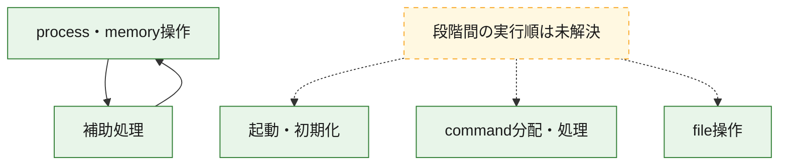
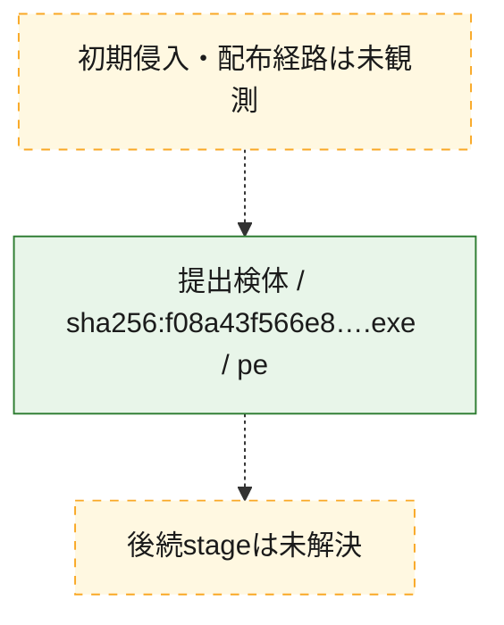
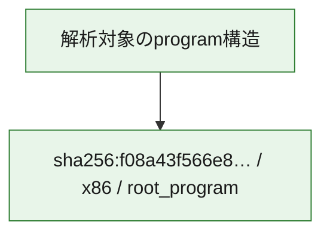

# 全体ロジック：f08a43f566e84eb22984fbc81d2ef8ca94d732362ca6b2324edf9a95ea7e7f58

代表関数の静的証跡から、起動・初期化、process・memory操作、command分配・処理、file操作の処理群を確認しました。

## 読み方

- phaseの掲載順は解析上の整理順です。observed_call_edgesがない段階間の実行順を断定しません。
- 図の実線は静的に観測した関係、点線と黄色のノードは未観測・未解決の関係を示します。
- 図は静的な要約であり、動的実行を再現するものではありません。
- 詳細な関数解説とfingerprintは[STATIC-LOGIC.md](STATIC-LOGIC.md)を参照してください。

## 静的可視化

### 実行フロー

### 感染チェーン

### モジュール関係

## 処理段階

### 1. 起動・初期化

entry pointから初期化と後続処理への移行を確認します。
確度: `confirmed_static_function_evidence`

- `f08a43f566e84eb22984fbc81d2ef8ca94d732362ca6b2324edf9a95ea7e7f58:ghidra:140011adc` — 初期化と主要処理への分岐を行う入口関数です。 状態: `succeeded`、選定理由: `entry_point`, `meaningful_symbol_name`, `reviewed_call_centrality:4`, `role:entrypoint`

### 2. process・memory操作

process、thread、module、memory操作と実行移行を確認します。
確度: `confirmed_static_function_evidence`

- `f08a43f566e84eb22984fbc81d2ef8ca94d732362ca6b2324edf9a95ea7e7f58:ghidra:140004460` — process、thread、module、またはmemory操作に関係する関数です。 状態: `succeeded`、選定理由: `context_representative`, `reviewed_call_centrality:34`, `role:process_or_memory_operation`
- `f08a43f566e84eb22984fbc81d2ef8ca94d732362ca6b2324edf9a95ea7e7f58:ghidra:140004a80` — process、thread、module、またはmemory操作に関係する関数です。 状態: `succeeded`、選定理由: `context_representative`, `reviewed_call_centrality:22`, `role:process_or_memory_operation`
- `f08a43f566e84eb22984fbc81d2ef8ca94d732362ca6b2324edf9a95ea7e7f58:ghidra:140004d80` — process、thread、module、またはmemory操作に関係する関数です。 状態: `succeeded`、選定理由: `context_representative`, `reviewed_call_centrality:34`, `role:process_or_memory_operation`

### 3. command分配・処理

受信commandやtaskの解釈、分配、個別handlerへの移行を確認します。
確度: `confirmed_static_function_evidence_with_limits`

- `f08a43f566e84eb22984fbc81d2ef8ca94d732362ca6b2324edf9a95ea7e7f58:ghidra:14005c6b0` — commandの解釈、分配、または個別処理を担当する関数です。 状態: `limited_bad_instruction_or_flow`、選定理由: `meaningful_symbol_name`, `role:command_dispatch_or_handler`

### 4. file操作

fileやdirectoryの作成、読書き、削除を確認します。
確度: `confirmed_static_function_evidence`

- `f08a43f566e84eb22984fbc81d2ef8ca94d732362ca6b2324edf9a95ea7e7f58:ghidra:140005420` — fileまたはdirectoryの読書き・管理に関係する関数です。 状態: `succeeded`、選定理由: `context_representative`, `reviewed_call_centrality:25`, `role:file_operation`

### 5. 補助処理

主要処理を支える一般内部関数またはlibrary処理を確認します。
確度: `confirmed_static_function_evidence`

- `f08a43f566e84eb22984fbc81d2ef8ca94d732362ca6b2324edf9a95ea7e7f58:ghidra:140004000` — 検体内部の一般処理を実装する関数です。 状態: `succeeded`、選定理由: `context_representative`, `reviewed_call_centrality:2`
- `f08a43f566e84eb22984fbc81d2ef8ca94d732362ca6b2324edf9a95ea7e7f58:ghidra:140004040` — 検体内部の一般処理を実装する関数です。 状態: `succeeded`、選定理由: `context_representative`, `reviewed_call_centrality:2`
- `f08a43f566e84eb22984fbc81d2ef8ca94d732362ca6b2324edf9a95ea7e7f58:ghidra:1400040b0` — 検体内部の一般処理を実装する関数です。 状態: `succeeded`、選定理由: `context_representative`, `reviewed_call_centrality:2`
- `f08a43f566e84eb22984fbc81d2ef8ca94d732362ca6b2324edf9a95ea7e7f58:ghidra:140004120` — 検体内部の一般処理を実装する関数です。 状態: `succeeded`、選定理由: `context_representative`, `reviewed_call_centrality:2`
- `f08a43f566e84eb22984fbc81d2ef8ca94d732362ca6b2324edf9a95ea7e7f58:ghidra:140004180` — 検体内部の一般処理を実装する関数です。 状態: `succeeded`、選定理由: `context_representative`, `reviewed_call_centrality:2`
- `f08a43f566e84eb22984fbc81d2ef8ca94d732362ca6b2324edf9a95ea7e7f58:ghidra:1400041e0` — 検体内部の一般処理を実装する関数です。 状態: `succeeded`、選定理由: `context_representative`, `reviewed_call_centrality:1`
- `f08a43f566e84eb22984fbc81d2ef8ca94d732362ca6b2324edf9a95ea7e7f58:ghidra:140004260` — 検体内部の一般処理を実装する関数です。 状態: `succeeded`、選定理由: `context_representative`, `reviewed_call_centrality:2`
- `f08a43f566e84eb22984fbc81d2ef8ca94d732362ca6b2324edf9a95ea7e7f58:ghidra:1400042a0` — 検体内部の一般処理を実装する関数です。 状態: `succeeded`、選定理由: `context_representative`, `reviewed_call_centrality:13`
- `f08a43f566e84eb22984fbc81d2ef8ca94d732362ca6b2324edf9a95ea7e7f58:ghidra:140004380` — 検体内部の一般処理を実装する関数です。 状態: `succeeded`、選定理由: `context_representative`, `reviewed_call_centrality:12`
- `f08a43f566e84eb22984fbc81d2ef8ca94d732362ca6b2324edf9a95ea7e7f58:ghidra:140004800` — 検体内部の一般処理を実装する関数です。 状態: `succeeded`、選定理由: `context_representative`, `reviewed_call_centrality:10`
- `f08a43f566e84eb22984fbc81d2ef8ca94d732362ca6b2324edf9a95ea7e7f58:ghidra:140004950` — 検体内部の一般処理を実装する関数です。 状態: `succeeded`、選定理由: `context_representative`, `reviewed_call_centrality:3`
- `f08a43f566e84eb22984fbc81d2ef8ca94d732362ca6b2324edf9a95ea7e7f58:ghidra:1400049b0` — 検体内部の一般処理を実装する関数です。 状態: `succeeded`、選定理由: `context_representative`, `reviewed_call_centrality:2`
- `f08a43f566e84eb22984fbc81d2ef8ca94d732362ca6b2324edf9a95ea7e7f58:ghidra:1400049f0` — 検体内部の一般処理を実装する関数です。 状態: `succeeded`、選定理由: `context_representative`, `reviewed_call_centrality:4`
- `f08a43f566e84eb22984fbc81d2ef8ca94d732362ca6b2324edf9a95ea7e7f58:ghidra:140004d40` — 検体内部の一般処理を実装する関数です。 状態: `succeeded`、選定理由: `context_representative`, `reviewed_call_centrality:2`
- `f08a43f566e84eb22984fbc81d2ef8ca94d732362ca6b2324edf9a95ea7e7f58:ghidra:140005740` — 検体内部の一般処理を実装する関数です。 状態: `succeeded`、選定理由: `context_representative`, `reviewed_call_centrality:1`
- `f08a43f566e84eb22984fbc81d2ef8ca94d732362ca6b2324edf9a95ea7e7f58:ghidra:1400059b0` — 検体内部の一般処理を実装する関数です。 状態: `succeeded`、選定理由: `context_representative`, `reviewed_call_centrality:3`
- `f08a43f566e84eb22984fbc81d2ef8ca94d732362ca6b2324edf9a95ea7e7f58:ghidra:140005a70` — 検体内部の一般処理を実装する関数です。 状態: `succeeded`、選定理由: `context_representative`, `reviewed_call_centrality:2`
- `f08a43f566e84eb22984fbc81d2ef8ca94d732362ca6b2324edf9a95ea7e7f58:ghidra:140005b20` — 検体内部の一般処理を実装する関数です。 状態: `succeeded`、選定理由: `context_representative`, `reviewed_call_centrality:3`
- `f08a43f566e84eb22984fbc81d2ef8ca94d732362ca6b2324edf9a95ea7e7f58:ghidra:140005d30` — 検体内部の一般処理を実装する関数です。 状態: `succeeded`、選定理由: `context_representative`, `reviewed_call_centrality:3`
- `f08a43f566e84eb22984fbc81d2ef8ca94d732362ca6b2324edf9a95ea7e7f58:ghidra:140005dc0` — 検体内部の一般処理を実装する関数です。 状態: `succeeded`、選定理由: `context_representative`, `reviewed_call_centrality:3`
- `f08a43f566e84eb22984fbc81d2ef8ca94d732362ca6b2324edf9a95ea7e7f58:ghidra:140005e80` — 検体内部の一般処理を実装する関数です。 状態: `succeeded`、選定理由: `context_representative`, `reviewed_call_centrality:7`
- `f08a43f566e84eb22984fbc81d2ef8ca94d732362ca6b2324edf9a95ea7e7f58:ghidra:140005ff0` — 検体内部の一般処理を実装する関数です。 状態: `succeeded`、選定理由: `context_representative`, `reviewed_call_centrality:1`
- `f08a43f566e84eb22984fbc81d2ef8ca94d732362ca6b2324edf9a95ea7e7f58:ghidra:140006020` — 検体内部の一般処理を実装する関数です。 状態: `succeeded`、選定理由: `context_representative`, `reviewed_call_centrality:2`
- `f08a43f566e84eb22984fbc81d2ef8ca94d732362ca6b2324edf9a95ea7e7f58:ghidra:140006210` — 検体内部の一般処理を実装する関数です。 状態: `succeeded`、選定理由: `context_representative`, `reviewed_call_centrality:8`
- `f08a43f566e84eb22984fbc81d2ef8ca94d732362ca6b2324edf9a95ea7e7f58:ghidra:140006260` — 検体内部の一般処理を実装する関数です。 状態: `succeeded`、選定理由: `context_representative`, `reviewed_call_centrality:2`
- `f08a43f566e84eb22984fbc81d2ef8ca94d732362ca6b2324edf9a95ea7e7f58:ghidra:1400122ec` — 検体内部の一般処理を実装する関数です。 状態: `succeeded`、選定理由: `meaningful_symbol_name`

## 観測したcall関係

- `f08a43f566e84eb22984fbc81d2ef8ca94d732362ca6b2324edf9a95ea7e7f58:ghidra:140004800` → `f08a43f566e84eb22984fbc81d2ef8ca94d732362ca6b2324edf9a95ea7e7f58:ghidra:140004460` （`support` → `execution`）
- `f08a43f566e84eb22984fbc81d2ef8ca94d732362ca6b2324edf9a95ea7e7f58:ghidra:140004800` → `f08a43f566e84eb22984fbc81d2ef8ca94d732362ca6b2324edf9a95ea7e7f58:ghidra:140005e80` （`support` → `support`）
- `f08a43f566e84eb22984fbc81d2ef8ca94d732362ca6b2324edf9a95ea7e7f58:ghidra:140004a80` → `f08a43f566e84eb22984fbc81d2ef8ca94d732362ca6b2324edf9a95ea7e7f58:ghidra:140004800` （`execution` → `support`）
- `f08a43f566e84eb22984fbc81d2ef8ca94d732362ca6b2324edf9a95ea7e7f58:ghidra:140004a80` → `f08a43f566e84eb22984fbc81d2ef8ca94d732362ca6b2324edf9a95ea7e7f58:ghidra:140004d80` （`execution` → `execution`）
- `ghidra-function:1484ac27e0fec99e134a277f` → `ghidra-external:df9228f39826e3a5f5bb2862` （`unclassified` → `unclassified`）
- `ghidra-function:1484ac27e0fec99e134a277f` → `ghidra-function:b05a9dc356ed2fc9ab17168c` （`unclassified` → `unclassified`）
- `ghidra-function:21a2493337424f480ef7786c` → `ghidra-function:4c2dd8ae3a8e254d4f449fd5` （`unclassified` → `unclassified`）
- `ghidra-function:28bd75ef5b3ad285cb51e301` → `ghidra-external:47ef6d63a97b1b38bbb19752` （`unclassified` → `unclassified`）
- `ghidra-function:28bd75ef5b3ad285cb51e301` → `ghidra-function:d17abcece5e227e1eb8267e8` （`unclassified` → `unclassified`）
- `ghidra-function:2f5b1a84911087245c0353f7` → `ghidra-external:11865c6555f0b2fce36b7655` （`unclassified` → `unclassified`）
- `ghidra-function:2f5b1a84911087245c0353f7` → `ghidra-external:74d8c0bfea87f5b58eace523` （`unclassified` → `unclassified`）
- `ghidra-function:2f5b1a84911087245c0353f7` → `ghidra-external:e6b00be544101d5c38ab8c3b` （`unclassified` → `unclassified`）
- `ghidra-function:2f5b1a84911087245c0353f7` → `ghidra-function:78d10b8dd9b7272ebc045ad8` （`unclassified` → `unclassified`）
- `ghidra-function:323d834b4ad927842af4676d` → `ghidra-function:4b4da6d7be9257af650b855b` （`unclassified` → `unclassified`）
- `ghidra-function:323d834b4ad927842af4676d` → `ghidra-function:5611b55e29705fbee440b8a5` （`unclassified` → `unclassified`）
- `ghidra-function:387512d91f9c93db86d2cd0a` → `ghidra-external:06aa1af7aab6142f6820b5ac` （`unclassified` → `unclassified`）
- `ghidra-function:387512d91f9c93db86d2cd0a` → `ghidra-external:df9228f39826e3a5f5bb2862` （`unclassified` → `unclassified`）
- `ghidra-function:387512d91f9c93db86d2cd0a` → `ghidra-function:b05a9dc356ed2fc9ab17168c` （`unclassified` → `unclassified`）
- `ghidra-function:3ad84c4b5c6b7415a38f2497` → `ghidra-external:06aa1af7aab6142f6820b5ac` （`unclassified` → `unclassified`）
- `ghidra-function:3ad84c4b5c6b7415a38f2497` → `ghidra-external:df9228f39826e3a5f5bb2862` （`unclassified` → `unclassified`）
- `ghidra-function:3ad84c4b5c6b7415a38f2497` → `ghidra-function:b05a9dc356ed2fc9ab17168c` （`unclassified` → `unclassified`）
- `ghidra-function:463aa6393674767af63f05e0` → `ghidra-external:0115c98dfcb584d0c7474c3c` （`unclassified` → `unclassified`）
- `ghidra-function:463aa6393674767af63f05e0` → `ghidra-function:437b2efa090ab6cb34aba512` （`unclassified` → `unclassified`）
- `ghidra-function:4a94df015a53ce79c4b8b520` → `ghidra-external:06aa1af7aab6142f6820b5ac` （`unclassified` → `unclassified`）
- `ghidra-function:4a94df015a53ce79c4b8b520` → `ghidra-external:df9228f39826e3a5f5bb2862` （`unclassified` → `unclassified`）
- `ghidra-function:4a94df015a53ce79c4b8b520` → `ghidra-function:3fa24cb98fb8966f4348f6f1` （`unclassified` → `unclassified`）
- `ghidra-function:4a94df015a53ce79c4b8b520` → `ghidra-function:4b4da6d7be9257af650b855b` （`unclassified` → `unclassified`）
- `ghidra-function:4a94df015a53ce79c4b8b520` → `ghidra-function:4c2dd8ae3a8e254d4f449fd5` （`unclassified` → `unclassified`）
- `ghidra-function:4a94df015a53ce79c4b8b520` → `ghidra-function:4d86f8c6327b961066cff5dc` （`unclassified` → `unclassified`）
- `ghidra-function:4a94df015a53ce79c4b8b520` → `ghidra-function:5611b55e29705fbee440b8a5` （`unclassified` → `unclassified`）
- `ghidra-function:4a94df015a53ce79c4b8b520` → `ghidra-function:6424e2d5c0dad94d914d18f4` （`unclassified` → `unclassified`）
- `ghidra-function:4a94df015a53ce79c4b8b520` → `ghidra-function:69c01e253bfde0f607011ebe` （`unclassified` → `unclassified`）
- `ghidra-function:4a94df015a53ce79c4b8b520` → `ghidra-function:6f9822aa61f0679054eff127` （`unclassified` → `unclassified`）
- `ghidra-function:4a94df015a53ce79c4b8b520` → `ghidra-function:8daa738b6e139d41d5a26436` （`unclassified` → `unclassified`）
- `ghidra-function:4a94df015a53ce79c4b8b520` → `ghidra-function:b05a9dc356ed2fc9ab17168c` （`unclassified` → `unclassified`）
- `ghidra-function:4a94df015a53ce79c4b8b520` → `ghidra-function:c31005bab130dba95e750d1d` （`unclassified` → `unclassified`）
- `ghidra-function:4a94df015a53ce79c4b8b520` → `ghidra-function:c7c42c8c64816bb29472ddbb` （`unclassified` → `unclassified`）
- `ghidra-function:4a94df015a53ce79c4b8b520` → `ghidra-function:cedd931d927d2a4f5d162c2b` （`unclassified` → `unclassified`）
- `ghidra-function:4a94df015a53ce79c4b8b520` → `ghidra-function:e0bf0035a7193b6133fd0080` （`unclassified` → `unclassified`）
- `ghidra-function:4a94df015a53ce79c4b8b520` → `ghidra-function:e88400df7d85a03145073b93` （`unclassified` → `unclassified`）
- `ghidra-function:53858e2c0b425c4dd19e6158` → `ghidra-function:5611b55e29705fbee440b8a5` （`unclassified` → `unclassified`）
- `ghidra-function:5f5ab04edd44e3d2f25c2946` → `ghidra-external:47ef6d63a97b1b38bbb19752` （`unclassified` → `unclassified`）
- `ghidra-function:5f5ab04edd44e3d2f25c2946` → `ghidra-function:94fdd4ce3b0379c91e1659cd` （`unclassified` → `unclassified`）
- `ghidra-function:66411d7bb18239f64e427899` → `ghidra-external:5cc388463f5c680e655bec67` （`unclassified` → `unclassified`）
- `ghidra-function:66411d7bb18239f64e427899` → `ghidra-external:f5f08fc6eb7a8c984ce371d8` （`unclassified` → `unclassified`）
- `ghidra-function:66411d7bb18239f64e427899` → `ghidra-function:0728df4362939bbb62bd2d9f` （`unclassified` → `unclassified`）
- `ghidra-function:66411d7bb18239f64e427899` → `ghidra-function:1d0089c6c8f046edca9d0722` （`unclassified` → `unclassified`）
- `ghidra-function:66411d7bb18239f64e427899` → `ghidra-function:1d3e584a3776b29d53976c66` （`unclassified` → `unclassified`）
- `ghidra-function:66411d7bb18239f64e427899` → `ghidra-function:1d6b72852496c8cb8e96d00b` （`unclassified` → `unclassified`）
- `ghidra-function:66411d7bb18239f64e427899` → `ghidra-function:3d5de596b627bdc6a09a120e` （`unclassified` → `unclassified`）
- `ghidra-function:66411d7bb18239f64e427899` → `ghidra-function:3e5bbba64182eb8c41f61897` （`unclassified` → `unclassified`）
- `ghidra-function:66411d7bb18239f64e427899` → `ghidra-function:3fa24cb98fb8966f4348f6f1` （`unclassified` → `unclassified`）
- `ghidra-function:66411d7bb18239f64e427899` → `ghidra-function:4233b24e0507c3dc708ad365` （`unclassified` → `unclassified`）
- `ghidra-function:66411d7bb18239f64e427899` → `ghidra-function:4d86f8c6327b961066cff5dc` （`unclassified` → `unclassified`）
- `ghidra-function:66411d7bb18239f64e427899` → `ghidra-function:8daa738b6e139d41d5a26436` （`unclassified` → `unclassified`）
- `ghidra-function:66411d7bb18239f64e427899` → `ghidra-function:b09f21a8ee724b67ba362d2c` （`unclassified` → `unclassified`）
- `ghidra-function:66411d7bb18239f64e427899` → `ghidra-function:c0ffed5263ea1161dd9931a2` （`unclassified` → `unclassified`）
- `ghidra-function:66411d7bb18239f64e427899` → `ghidra-function:cedd931d927d2a4f5d162c2b` （`unclassified` → `unclassified`）
- `ghidra-function:66411d7bb18239f64e427899` → `ghidra-function:e0bf0035a7193b6133fd0080` （`unclassified` → `unclassified`）
- `ghidra-function:680f99925e425a3f5c10d390` → `ghidra-function:4b4da6d7be9257af650b855b` （`unclassified` → `unclassified`）
- `ghidra-function:680f99925e425a3f5c10d390` → `ghidra-function:5611b55e29705fbee440b8a5` （`unclassified` → `unclassified`）
- `ghidra-function:69c01e253bfde0f607011ebe` → `ghidra-function:6a75dcd6f818fe9721a4d94a` （`unclassified` → `unclassified`）
- `ghidra-function:69c01e253bfde0f607011ebe` → `ghidra-function:6bbe01a2e53f81f61835e0a9` （`unclassified` → `unclassified`）
- `ghidra-function:69c01e253bfde0f607011ebe` → `ghidra-function:ad4d0de1f9f625d6e4dccb2b` （`unclassified` → `unclassified`）
- `ghidra-function:69c01e253bfde0f607011ebe` → `ghidra-function:c0ffed5263ea1161dd9931a2` （`unclassified` → `unclassified`）
- `ghidra-function:69c01e253bfde0f607011ebe` → `ghidra-function:cedd931d927d2a4f5d162c2b` （`unclassified` → `unclassified`）
- `ghidra-function:69c01e253bfde0f607011ebe` → `ghidra-function:e38e2d2bba8d8de357cef12f` （`unclassified` → `unclassified`）
- `ghidra-function:799b21cffb4e2b252dcdae9b` → `ghidra-external:47ef6d63a97b1b38bbb19752` （`unclassified` → `unclassified`）
- `ghidra-function:799b21cffb4e2b252dcdae9b` → `ghidra-function:d17abcece5e227e1eb8267e8` （`unclassified` → `unclassified`）
- `ghidra-function:7d8bc84d43e606b5ceec9ae2` → `ghidra-external:06aa1af7aab6142f6820b5ac` （`unclassified` → `unclassified`）
- `ghidra-function:7d8bc84d43e606b5ceec9ae2` → `ghidra-external:df9228f39826e3a5f5bb2862` （`unclassified` → `unclassified`）
- `ghidra-function:7d8bc84d43e606b5ceec9ae2` → `ghidra-function:b05a9dc356ed2fc9ab17168c` （`unclassified` → `unclassified`）
- `ghidra-function:7d9d69fc2c9bda3bdb7d45a0` → `ghidra-external:06aa1af7aab6142f6820b5ac` （`unclassified` → `unclassified`）
- `ghidra-function:7d9d69fc2c9bda3bdb7d45a0` → `ghidra-function:4c2dd8ae3a8e254d4f449fd5` （`unclassified` → `unclassified`）
- `ghidra-function:890f50b5853f12a56b079164` → `ghidra-function:5611b55e29705fbee440b8a5` （`unclassified` → `unclassified`）
- `ghidra-function:ad4d0de1f9f625d6e4dccb2b` → `ghidra-external:5cc388463f5c680e655bec67` （`unclassified` → `unclassified`）
- `ghidra-function:ad4d0de1f9f625d6e4dccb2b` → `ghidra-function:0e8cf2e3c805195b954f0edd` （`unclassified` → `unclassified`）
- `ghidra-function:ad4d0de1f9f625d6e4dccb2b` → `ghidra-function:10bff559cadd192a1610daa5` （`unclassified` → `unclassified`）
- `ghidra-function:ad4d0de1f9f625d6e4dccb2b` → `ghidra-function:1d0089c6c8f046edca9d0722` （`unclassified` → `unclassified`）
- `ghidra-function:ad4d0de1f9f625d6e4dccb2b` → `ghidra-function:2914b7dc89c9ddbeb77fb4c5` （`unclassified` → `unclassified`）
- `ghidra-function:ad4d0de1f9f625d6e4dccb2b` → `ghidra-function:3d0d831a0b40d1e68af4bc94` （`unclassified` → `unclassified`）
- `ghidra-function:ad4d0de1f9f625d6e4dccb2b` → `ghidra-function:497c8785168b016061e81c2f` （`unclassified` → `unclassified`）
- `ghidra-function:ad4d0de1f9f625d6e4dccb2b` → `ghidra-function:5c3b3e2262f44b2573871f24` （`unclassified` → `unclassified`）
- `ghidra-function:ad4d0de1f9f625d6e4dccb2b` → `ghidra-function:6424e2d5c0dad94d914d18f4` （`unclassified` → `unclassified`）
- `ghidra-function:ad4d0de1f9f625d6e4dccb2b` → `ghidra-function:685705442a84bf7fbc0ea608` （`unclassified` → `unclassified`）
- `ghidra-function:ad4d0de1f9f625d6e4dccb2b` → `ghidra-function:6f4d7b0193164c4fe048baf1` （`unclassified` → `unclassified`）
- `ghidra-function:ad4d0de1f9f625d6e4dccb2b` → `ghidra-function:77bd16415cbf5912787b6400` （`unclassified` → `unclassified`）
- `ghidra-function:ad4d0de1f9f625d6e4dccb2b` → `ghidra-function:bbb974256296d8f6ba8b6934` （`unclassified` → `unclassified`）
- `ghidra-function:ad4d0de1f9f625d6e4dccb2b` → `ghidra-function:bd6a28fd0ed1d453bf7cbd11` （`unclassified` → `unclassified`）
- `ghidra-function:ad4d0de1f9f625d6e4dccb2b` → `ghidra-function:c0ffed5263ea1161dd9931a2` （`unclassified` → `unclassified`）
- `ghidra-function:ad4d0de1f9f625d6e4dccb2b` → `ghidra-function:cedd931d927d2a4f5d162c2b` （`unclassified` → `unclassified`）
- `ghidra-function:ad4d0de1f9f625d6e4dccb2b` → `ghidra-function:fd20487aacba333fc5e76106` （`unclassified` → `unclassified`）
- `ghidra-function:ad4d0de1f9f625d6e4dccb2b` → `ghidra-function:fd8901c8ff7ad08210ad1d00` （`unclassified` → `unclassified`）
- `ghidra-function:b9a71aa4ee475a40eece2aa4` → `ghidra-function:4b4da6d7be9257af650b855b` （`unclassified` → `unclassified`）
- `ghidra-function:b9a71aa4ee475a40eece2aa4` → `ghidra-function:5611b55e29705fbee440b8a5` （`unclassified` → `unclassified`）
- `ghidra-function:be13671e43abd3fa88d3b70e` → `ghidra-external:83268b730713b920cd55af11` （`unclassified` → `unclassified`）
- `ghidra-function:be13671e43abd3fa88d3b70e` → `ghidra-external:df9228f39826e3a5f5bb2862` （`unclassified` → `unclassified`）
- `ghidra-function:be13671e43abd3fa88d3b70e` → `ghidra-function:0dc086342b333e8248cba214` （`unclassified` → `unclassified`）
- `ghidra-function:be13671e43abd3fa88d3b70e` → `ghidra-function:10bff559cadd192a1610daa5` （`unclassified` → `unclassified`）
- `ghidra-function:be13671e43abd3fa88d3b70e` → `ghidra-function:5bc4bd1f8096552b9fc27c90` （`unclassified` → `unclassified`）
- `ghidra-function:be13671e43abd3fa88d3b70e` → `ghidra-function:b05a9dc356ed2fc9ab17168c` （`unclassified` → `unclassified`）
- `ghidra-function:be77d1ede7d6db9d6738638e` → `ghidra-function:0e8cf2e3c805195b954f0edd` （`unclassified` → `unclassified`）
- `ghidra-function:be77d1ede7d6db9d6738638e` → `ghidra-function:10bff559cadd192a1610daa5` （`unclassified` → `unclassified`）
- `ghidra-function:be77d1ede7d6db9d6738638e` → `ghidra-function:1d0089c6c8f046edca9d0722` （`unclassified` → `unclassified`）
- `ghidra-function:be77d1ede7d6db9d6738638e` → `ghidra-function:77bd16415cbf5912787b6400` （`unclassified` → `unclassified`）
- `ghidra-function:be77d1ede7d6db9d6738638e` → `ghidra-function:bd6a28fd0ed1d453bf7cbd11` （`unclassified` → `unclassified`）
- `ghidra-function:be77d1ede7d6db9d6738638e` → `ghidra-function:c0ffed5263ea1161dd9931a2` （`unclassified` → `unclassified`）
- `ghidra-function:be77d1ede7d6db9d6738638e` → `ghidra-function:cedd931d927d2a4f5d162c2b` （`unclassified` → `unclassified`）
- `ghidra-function:bf527c30ee7592552cf626ac` → `ghidra-function:4c2dd8ae3a8e254d4f449fd5` （`unclassified` → `unclassified`）
- `ghidra-function:c02c167a6c5b5983b3e8dba4` → `ghidra-function:2914b7dc89c9ddbeb77fb4c5` （`unclassified` → `unclassified`）
- `ghidra-function:c02c167a6c5b5983b3e8dba4` → `ghidra-function:497c8785168b016061e81c2f` （`unclassified` → `unclassified`）
- `ghidra-function:c02c167a6c5b5983b3e8dba4` → `ghidra-function:5c3b3e2262f44b2573871f24` （`unclassified` → `unclassified`）
- `ghidra-function:c02c167a6c5b5983b3e8dba4` → `ghidra-function:685705442a84bf7fbc0ea608` （`unclassified` → `unclassified`）
- `ghidra-function:c02c167a6c5b5983b3e8dba4` → `ghidra-function:bbb974256296d8f6ba8b6934` （`unclassified` → `unclassified`）
- `ghidra-function:c02c167a6c5b5983b3e8dba4` → `ghidra-function:c0ffed5263ea1161dd9931a2` （`unclassified` → `unclassified`）
- `ghidra-function:c02c167a6c5b5983b3e8dba4` → `ghidra-function:cedd931d927d2a4f5d162c2b` （`unclassified` → `unclassified`）
- `ghidra-function:c0b1cfed66cf65da3186a28c` → `ghidra-external:06aa1af7aab6142f6820b5ac` （`unclassified` → `unclassified`）
- `ghidra-function:c0b1cfed66cf65da3186a28c` → `ghidra-external:df9228f39826e3a5f5bb2862` （`unclassified` → `unclassified`）
- `ghidra-function:c0b1cfed66cf65da3186a28c` → `ghidra-function:b05a9dc356ed2fc9ab17168c` （`unclassified` → `unclassified`）
- `ghidra-function:c429d01e793a2603dbd325b1` → `ghidra-external:47ef6d63a97b1b38bbb19752` （`unclassified` → `unclassified`）
- `ghidra-function:c429d01e793a2603dbd325b1` → `ghidra-function:94fdd4ce3b0379c91e1659cd` （`unclassified` → `unclassified`）
- `ghidra-function:e38e2d2bba8d8de357cef12f` → `ghidra-external:06aa1af7aab6142f6820b5ac` （`unclassified` → `unclassified`）
- `ghidra-function:e38e2d2bba8d8de357cef12f` → `ghidra-external:df9228f39826e3a5f5bb2862` （`unclassified` → `unclassified`）
- `ghidra-function:e38e2d2bba8d8de357cef12f` → `ghidra-function:11bafccf463d6030ab458dbf` （`unclassified` → `unclassified`）
- `ghidra-function:e38e2d2bba8d8de357cef12f` → `ghidra-function:5611b55e29705fbee440b8a5` （`unclassified` → `unclassified`）
- `ghidra-function:e38e2d2bba8d8de357cef12f` → `ghidra-function:7cabce367bcfbc12539d1397` （`unclassified` → `unclassified`）
- `ghidra-function:e38e2d2bba8d8de357cef12f` → `ghidra-function:b05a9dc356ed2fc9ab17168c` （`unclassified` → `unclassified`）
- `ghidra-function:e69dbb5d792abc728a6e432c` → `ghidra-function:5611b55e29705fbee440b8a5` （`unclassified` → `unclassified`）
- `ghidra-function:e88400df7d85a03145073b93` → `ghidra-external:06aa1af7aab6142f6820b5ac` （`unclassified` → `unclassified`）
- `ghidra-function:e88400df7d85a03145073b93` → `ghidra-external:df9228f39826e3a5f5bb2862` （`unclassified` → `unclassified`）
- `ghidra-function:e88400df7d85a03145073b93` → `ghidra-external:f5f08fc6eb7a8c984ce371d8` （`unclassified` → `unclassified`）
- `ghidra-function:e88400df7d85a03145073b93` → `ghidra-function:0728df4362939bbb62bd2d9f` （`unclassified` → `unclassified`）
- `ghidra-function:e88400df7d85a03145073b93` → `ghidra-function:10bff559cadd192a1610daa5` （`unclassified` → `unclassified`）
- `ghidra-function:e88400df7d85a03145073b93` → `ghidra-function:22e0d5b2054805aff944a789` （`unclassified` → `unclassified`）
- `ghidra-function:e88400df7d85a03145073b93` → `ghidra-function:2325ff696bd3f3103e03f832` （`unclassified` → `unclassified`）
- `ghidra-function:e88400df7d85a03145073b93` → `ghidra-function:2914b7dc89c9ddbeb77fb4c5` （`unclassified` → `unclassified`）
- `ghidra-function:e88400df7d85a03145073b93` → `ghidra-function:3fa24cb98fb8966f4348f6f1` （`unclassified` → `unclassified`）
- `ghidra-function:e88400df7d85a03145073b93` → `ghidra-function:498c263139d9b1bad4106c5a` （`unclassified` → `unclassified`）
- `ghidra-function:e88400df7d85a03145073b93` → `ghidra-function:4d86f8c6327b961066cff5dc` （`unclassified` → `unclassified`）
- `ghidra-function:e88400df7d85a03145073b93` → `ghidra-function:5611b55e29705fbee440b8a5` （`unclassified` → `unclassified`）
- `ghidra-function:e88400df7d85a03145073b93` → `ghidra-function:8daa738b6e139d41d5a26436` （`unclassified` → `unclassified`）
- `ghidra-function:e88400df7d85a03145073b93` → `ghidra-function:9b9f2454b90abe945dd23a72` （`unclassified` → `unclassified`）
- `ghidra-function:e88400df7d85a03145073b93` → `ghidra-function:a64bb785287a60707cd0608d` （`unclassified` → `unclassified`）
- `ghidra-function:e88400df7d85a03145073b93` → `ghidra-function:a76fb03506912d7720601b4c` （`unclassified` → `unclassified`）
- `ghidra-function:e88400df7d85a03145073b93` → `ghidra-function:b05a9dc356ed2fc9ab17168c` （`unclassified` → `unclassified`）
- `ghidra-function:e88400df7d85a03145073b93` → `ghidra-function:b09f21a8ee724b67ba362d2c` （`unclassified` → `unclassified`）
- `ghidra-function:e88400df7d85a03145073b93` → `ghidra-function:c95ac8ec6b721073ec439345` （`unclassified` → `unclassified`）
- `ghidra-function:e88400df7d85a03145073b93` → `ghidra-function:cedd931d927d2a4f5d162c2b` （`unclassified` → `unclassified`）
- `ghidra-function:e88400df7d85a03145073b93` → `ghidra-function:de43c6b57a6e48fc8a3265bd` （`unclassified` → `unclassified`）
- `ghidra-function:e88400df7d85a03145073b93` → `ghidra-function:e0bf0035a7193b6133fd0080` （`unclassified` → `unclassified`）
- `ghidra-function:e88400df7d85a03145073b93` → `ghidra-function:f1b6ddaef8081786e7d6db10` （`unclassified` → `unclassified`）
- `ghidra-function:ebfd2d2eb51140639ac1b875` → `ghidra-function:4d86f8c6327b961066cff5dc` （`unclassified` → `unclassified`）
- `ghidra-function:ebfd2d2eb51140639ac1b875` → `ghidra-function:8daa738b6e139d41d5a26436` （`unclassified` → `unclassified`）
- `ghidra-function:ebfd2d2eb51140639ac1b875` → `ghidra-function:e0bf0035a7193b6133fd0080` （`unclassified` → `unclassified`）

## 解析範囲と制約

- 選定外関数は全体inventoryへ残しますが、関数本体の個別解説対象にはしていません。
- indirect call、難読化、packer、VM、壊れたcontrol flowによりcall関係が欠落する場合があります。
- 文書は静的解析に基づき、検体実行や外部通信による動的確認は行っていません。
