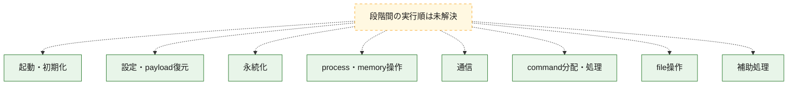
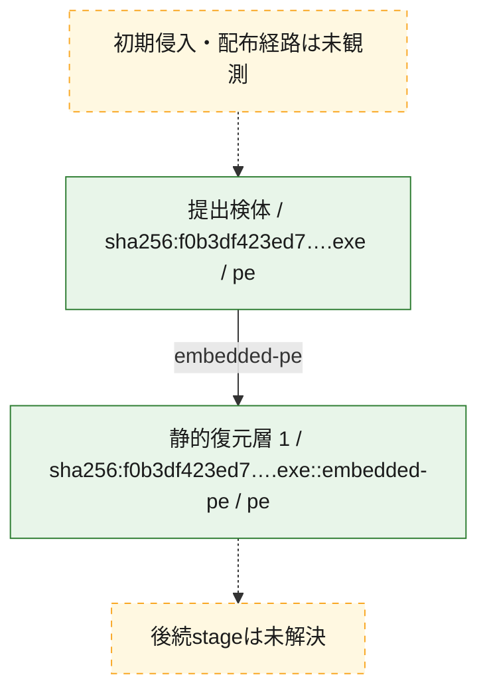
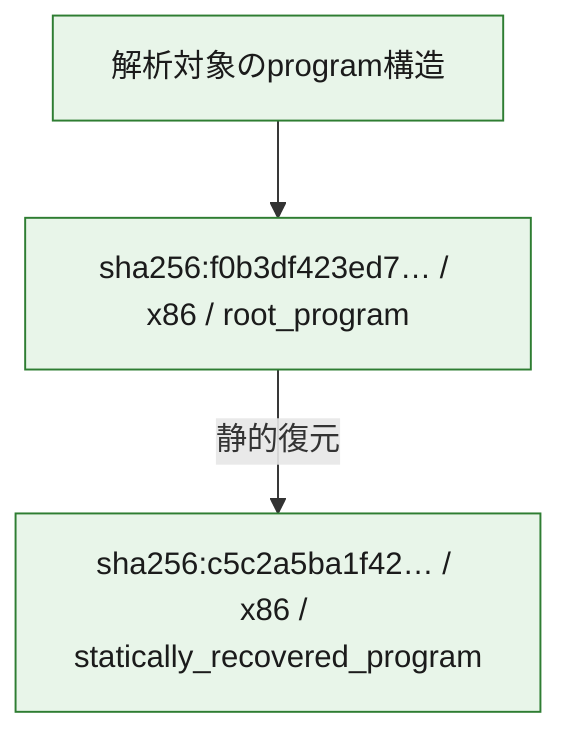

# 全体ロジック：f0b3df423ed7f642bcd0ef9754b97be9a0d359e327c56becb2570f914df1bcb5

代表関数の静的証跡から、起動・初期化、設定・payload復元、永続化、process・memory操作、通信、command分配・処理、file操作の処理群を確認しました。

## 読み方

- phaseの掲載順は解析上の整理順です。observed_call_edgesがない段階間の実行順を断定しません。
- 図の実線は静的に観測した関係、点線と黄色のノードは未観測・未解決の関係を示します。
- 図は静的な要約であり、動的実行を再現するものではありません。
- 詳細な関数解説とfingerprintは[STATIC-LOGIC.md](STATIC-LOGIC.md)を参照してください。

## 静的可視化

### 実行フロー

### 感染チェーン

### モジュール関係

## 処理段階

### 1. 起動・初期化

entry pointから初期化と後続処理への移行を確認します。
確度: `confirmed_static_function_evidence`

- `c5c2a5ba1f42b31495152c38ada2352d3b564dc84ef99968360ea9d50aa73258:ghidra:180005e60` — 初期化と主要処理への分岐を行う入口関数です。 状態: `succeeded`、選定理由: `entry_point`, `meaningful_symbol_name`, `reviewed_call_centrality:3`, `role:entrypoint`
- `f0b3df423ed7f642bcd0ef9754b97be9a0d359e327c56becb2570f914df1bcb5:ghidra:1400090e8` — 初期化と主要処理への分岐を行う入口関数です。 状態: `succeeded`、選定理由: `entry_point`, `meaningful_symbol_name`, `reviewed_call_centrality:4`, `role:entrypoint`

### 2. 設定・payload復元

設定、resource、payload、暗号化データの復元・変換を確認します。
確度: `confirmed_static_function_evidence`

- `f0b3df423ed7f642bcd0ef9754b97be9a0d359e327c56becb2570f914df1bcb5:ghidra:1400044b0` — 設定、resource、payloadなどの解析・変換を行う関数です。 状態: `succeeded`、選定理由: `context_representative`, `reviewed_call_centrality:10`, `role:config_or_data_transform`

### 3. 永続化

自動起動や永続化に関係する設定変更を確認します。
確度: `confirmed_static_function_evidence`

- `c5c2a5ba1f42b31495152c38ada2352d3b564dc84ef99968360ea9d50aa73258:ghidra:180002a04` — 自動起動または永続化に関係する処理を含む関数です。 状態: `succeeded`、選定理由: `context_representative`, `reviewed_call_centrality:46`, `role:persistence`
- `f0b3df423ed7f642bcd0ef9754b97be9a0d359e327c56becb2570f914df1bcb5:ghidra:1400041e0` — 自動起動または永続化に関係する処理を含む関数です。 状態: `succeeded`、選定理由: `context_representative`, `reviewed_call_centrality:13`, `role:persistence`
- `f0b3df423ed7f642bcd0ef9754b97be9a0d359e327c56becb2570f914df1bcb5:ghidra:140005130` — 自動起動または永続化に関係する処理を含む関数です。 状態: `succeeded`、選定理由: `context_representative`, `reviewed_call_centrality:7`, `role:persistence`
- `f0b3df423ed7f642bcd0ef9754b97be9a0d359e327c56becb2570f914df1bcb5:ghidra:140005400` — 自動起動または永続化に関係する処理を含む関数です。 状態: `succeeded`、選定理由: `context_representative`, `reviewed_call_centrality:12`, `role:persistence`

### 4. process・memory操作

process、thread、module、memory操作と実行移行を確認します。
確度: `confirmed_static_function_evidence`

- `c5c2a5ba1f42b31495152c38ada2352d3b564dc84ef99968360ea9d50aa73258:ghidra:1800022b4` — process、thread、module、またはmemory操作に関係する関数です。 状態: `succeeded`、選定理由: `context_representative`, `reviewed_call_centrality:20`, `role:process_or_memory_operation`
- `c5c2a5ba1f42b31495152c38ada2352d3b564dc84ef99968360ea9d50aa73258:ghidra:18000363c` — process、thread、module、またはmemory操作に関係する関数です。 状態: `succeeded`、選定理由: `context_representative`, `reviewed_call_centrality:8`, `role:process_or_memory_operation`
- `c5c2a5ba1f42b31495152c38ada2352d3b564dc84ef99968360ea9d50aa73258:ghidra:180003ea4` — process、thread、module、またはmemory操作に関係する関数です。 状態: `succeeded`、選定理由: `context_representative`, `reviewed_call_centrality:8`, `role:process_or_memory_operation`
- `f0b3df423ed7f642bcd0ef9754b97be9a0d359e327c56becb2570f914df1bcb5:ghidra:140005370` — process、thread、module、またはmemory操作に関係する関数です。 状態: `succeeded`、選定理由: `context_representative`, `reviewed_call_centrality:12`, `role:process_or_memory_operation`

### 5. 通信

通信初期化、endpoint処理、送受信の役割を確認します。
確度: `confirmed_static_function_evidence`

- `f0b3df423ed7f642bcd0ef9754b97be9a0d359e327c56becb2570f914df1bcb5:ghidra:140005cb0` — 通信初期化、送受信、またはendpoint処理に関係する関数です。 状態: `succeeded`、選定理由: `context_representative`, `reviewed_call_centrality:23`, `role:network_communication`
- `f0b3df423ed7f642bcd0ef9754b97be9a0d359e327c56becb2570f914df1bcb5:ghidra:1400062e0` — 通信初期化、送受信、またはendpoint処理に関係する関数です。 状態: `succeeded`、選定理由: `context_representative`, `reviewed_call_centrality:23`, `role:network_communication`
- `f0b3df423ed7f642bcd0ef9754b97be9a0d359e327c56becb2570f914df1bcb5:ghidra:140006880` — 通信初期化、送受信、またはendpoint処理に関係する関数です。 状態: `succeeded`、選定理由: `context_representative`, `reviewed_call_centrality:17`, `role:network_communication`
- `f0b3df423ed7f642bcd0ef9754b97be9a0d359e327c56becb2570f914df1bcb5:ghidra:140006c60` — 通信初期化、送受信、またはendpoint処理に関係する関数です。 状態: `succeeded`、選定理由: `context_representative`, `reviewed_call_centrality:9`, `role:network_communication`

### 6. command分配・処理

受信commandやtaskの解釈、分配、個別handlerへの移行を確認します。
確度: `confirmed_static_function_evidence`

- `f0b3df423ed7f642bcd0ef9754b97be9a0d359e327c56becb2570f914df1bcb5:ghidra:140005b30` — commandの解釈、分配、または個別処理を担当する関数です。 状態: `succeeded`、選定理由: `context_representative`, `reviewed_call_centrality:15`, `role:command_dispatch_or_handler`

### 7. file操作

fileやdirectoryの作成、読書き、削除を確認します。
確度: `confirmed_static_function_evidence_with_limits`

- `c5c2a5ba1f42b31495152c38ada2352d3b564dc84ef99968360ea9d50aa73258:ghidra:1800023f0` — fileまたはdirectoryの読書き・管理に関係する関数です。 状態: `failed`、選定理由: `context_representative`, `reviewed_call_centrality:42`, `role:file_operation`
- `c5c2a5ba1f42b31495152c38ada2352d3b564dc84ef99968360ea9d50aa73258:ghidra:180002834` — fileまたはdirectoryの読書き・管理に関係する関数です。 状態: `succeeded`、選定理由: `context_representative`, `reviewed_call_centrality:10`, `role:file_operation`
- `c5c2a5ba1f42b31495152c38ada2352d3b564dc84ef99968360ea9d50aa73258:ghidra:180002944` — fileまたはdirectoryの読書き・管理に関係する関数です。 状態: `succeeded`、選定理由: `context_representative`, `reviewed_call_centrality:7`, `role:file_operation`
- `c5c2a5ba1f42b31495152c38ada2352d3b564dc84ef99968360ea9d50aa73258:ghidra:180003798` — fileまたはdirectoryの読書き・管理に関係する関数です。 状態: `failed`、選定理由: `context_representative`, `reviewed_call_centrality:37`, `role:file_operation`
- `f0b3df423ed7f642bcd0ef9754b97be9a0d359e327c56becb2570f914df1bcb5:ghidra:140004180` — fileまたはdirectoryの読書き・管理に関係する関数です。 状態: `succeeded`、選定理由: `context_representative`, `reviewed_call_centrality:6`, `role:file_operation`
- `f0b3df423ed7f642bcd0ef9754b97be9a0d359e327c56becb2570f914df1bcb5:ghidra:140004870` — fileまたはdirectoryの読書き・管理に関係する関数です。 状態: `succeeded`、選定理由: `context_representative`, `reviewed_call_centrality:18`, `role:file_operation`
- `f0b3df423ed7f642bcd0ef9754b97be9a0d359e327c56becb2570f914df1bcb5:ghidra:140004eb0` — fileまたはdirectoryの読書き・管理に関係する関数です。 状態: `succeeded`、選定理由: `context_representative`, `reviewed_call_centrality:13`, `role:file_operation`
- `f0b3df423ed7f642bcd0ef9754b97be9a0d359e327c56becb2570f914df1bcb5:ghidra:140004fa0` — fileまたはdirectoryの読書き・管理に関係する関数です。 状態: `succeeded`、選定理由: `context_representative`, `reviewed_call_centrality:5`, `role:file_operation`
- `f0b3df423ed7f642bcd0ef9754b97be9a0d359e327c56becb2570f914df1bcb5:ghidra:140005010` — fileまたはdirectoryの読書き・管理に関係する関数です。 状態: `succeeded`、選定理由: `context_representative`, `reviewed_call_centrality:11`, `role:file_operation`
- `f0b3df423ed7f642bcd0ef9754b97be9a0d359e327c56becb2570f914df1bcb5:ghidra:1400055d0` — fileまたはdirectoryの読書き・管理に関係する関数です。 状態: `succeeded`、選定理由: `context_representative`, `reviewed_call_centrality:14`, `role:file_operation`
- `f0b3df423ed7f642bcd0ef9754b97be9a0d359e327c56becb2570f914df1bcb5:ghidra:1400058c0` — fileまたはdirectoryの読書き・管理に関係する関数です。 状態: `succeeded`、選定理由: `context_representative`, `reviewed_call_centrality:5`, `role:file_operation`

### 8. 補助処理

主要処理を支える一般内部関数またはlibrary処理を確認します。
確度: `confirmed_static_function_evidence_with_limits`

- `c5c2a5ba1f42b31495152c38ada2352d3b564dc84ef99968360ea9d50aa73258:ghidra:180002038` — 検体内部の一般処理を実装する関数です。 状態: `succeeded`、選定理由: `context_representative`, `reviewed_call_centrality:3`
- `c5c2a5ba1f42b31495152c38ada2352d3b564dc84ef99968360ea9d50aa73258:ghidra:1800020a8` — 検体内部の一般処理を実装する関数です。 状態: `succeeded`、選定理由: `context_representative`, `reviewed_call_centrality:13`
- `c5c2a5ba1f42b31495152c38ada2352d3b564dc84ef99968360ea9d50aa73258:ghidra:180003004` — 検体内部の一般処理を実装する関数です。 状態: `succeeded`、選定理由: `context_representative`, `reviewed_call_centrality:10`
- `c5c2a5ba1f42b31495152c38ada2352d3b564dc84ef99968360ea9d50aa73258:ghidra:180003084` — 検体内部の一般処理を実装する関数です。 状態: `succeeded`、選定理由: `context_representative`, `reviewed_call_centrality:6`
- `c5c2a5ba1f42b31495152c38ada2352d3b564dc84ef99968360ea9d50aa73258:ghidra:18000311c` — 検体内部の一般処理を実装する関数です。 状態: `succeeded`、選定理由: `context_representative`, `reviewed_call_centrality:7`
- `c5c2a5ba1f42b31495152c38ada2352d3b564dc84ef99968360ea9d50aa73258:ghidra:180003224` — 検体内部の一般処理を実装する関数です。 状態: `failed`、選定理由: `context_representative`, `reviewed_call_centrality:9`
- `c5c2a5ba1f42b31495152c38ada2352d3b564dc84ef99968360ea9d50aa73258:ghidra:1800032c8` — 検体内部の一般処理を実装する関数です。 状態: `limited_bad_instruction_or_flow`、選定理由: `context_representative`, `reviewed_call_centrality:2`
- `c5c2a5ba1f42b31495152c38ada2352d3b564dc84ef99968360ea9d50aa73258:ghidra:18000330c` — 検体内部の一般処理を実装する関数です。 状態: `succeeded`、選定理由: `context_representative`, `reviewed_call_centrality:4`
- `c5c2a5ba1f42b31495152c38ada2352d3b564dc84ef99968360ea9d50aa73258:ghidra:1800034b4` — 検体内部の一般処理を実装する関数です。 状態: `succeeded`、選定理由: `entry_point`, `meaningful_symbol_name`, `reviewed_call_centrality:16`
- `c5c2a5ba1f42b31495152c38ada2352d3b564dc84ef99968360ea9d50aa73258:ghidra:1800036c0` — 検体内部の一般処理を実装する関数です。 状態: `succeeded`、選定理由: `context_representative`, `reviewed_call_centrality:4`
- `c5c2a5ba1f42b31495152c38ada2352d3b564dc84ef99968360ea9d50aa73258:ghidra:18000371c` — 検体内部の一般処理を実装する関数です。 状態: `succeeded`、選定理由: `context_representative`, `reviewed_call_centrality:11`
- `c5c2a5ba1f42b31495152c38ada2352d3b564dc84ef99968360ea9d50aa73258:ghidra:180003b30` — 検体内部の一般処理を実装する関数です。 状態: `succeeded`、選定理由: `context_representative`, `reviewed_call_centrality:16`
- `c5c2a5ba1f42b31495152c38ada2352d3b564dc84ef99968360ea9d50aa73258:ghidra:180003c50` — 検体内部の一般処理を実装する関数です。 状態: `succeeded`、選定理由: `context_representative`, `reviewed_call_centrality:12`
- `c5c2a5ba1f42b31495152c38ada2352d3b564dc84ef99968360ea9d50aa73258:ghidra:180003cb8` — 検体内部の一般処理を実装する関数です。 状態: `succeeded`、選定理由: `context_representative`, `reviewed_call_centrality:14`
- `c5c2a5ba1f42b31495152c38ada2352d3b564dc84ef99968360ea9d50aa73258:ghidra:180003d24` — 検体内部の一般処理を実装する関数です。 状態: `succeeded`、選定理由: `context_representative`, `reviewed_call_centrality:1`
- `c5c2a5ba1f42b31495152c38ada2352d3b564dc84ef99968360ea9d50aa73258:ghidra:180003dbc` — 検体内部の一般処理を実装する関数です。 状態: `succeeded`、選定理由: `context_representative`, `reviewed_call_centrality:3`
- `c5c2a5ba1f42b31495152c38ada2352d3b564dc84ef99968360ea9d50aa73258:ghidra:180003df4` — 検体内部の一般処理を実装する関数です。 状態: `succeeded`、選定理由: `context_representative`, `reviewed_call_centrality:10`
- `c5c2a5ba1f42b31495152c38ada2352d3b564dc84ef99968360ea9d50aa73258:ghidra:180003e4c` — 検体内部の一般処理を実装する関数です。 状態: `succeeded`、選定理由: `context_representative`, `reviewed_call_centrality:4`
- `c5c2a5ba1f42b31495152c38ada2352d3b564dc84ef99968360ea9d50aa73258:ghidra:180003f50` — 検体内部の一般処理を実装する関数です。 状態: `succeeded`、選定理由: `context_representative`, `reviewed_call_centrality:13`
- `c5c2a5ba1f42b31495152c38ada2352d3b564dc84ef99968360ea9d50aa73258:ghidra:1800040b0` — 検体内部の一般処理を実装する関数です。 状態: `succeeded`、選定理由: `context_representative`, `reviewed_call_centrality:5`
- `c5c2a5ba1f42b31495152c38ada2352d3b564dc84ef99968360ea9d50aa73258:ghidra:180004154` — 検体内部の一般処理を実装する関数です。 状態: `succeeded`、選定理由: `context_representative`, `reviewed_call_centrality:6`
- `c5c2a5ba1f42b31495152c38ada2352d3b564dc84ef99968360ea9d50aa73258:ghidra:180004328` — 検体内部の一般処理を実装する関数です。 状態: `succeeded`、選定理由: `context_representative`, `reviewed_call_centrality:12`
- `c5c2a5ba1f42b31495152c38ada2352d3b564dc84ef99968360ea9d50aa73258:ghidra:1800044d4` — 検体内部の一般処理を実装する関数です。 状態: `succeeded`、選定理由: `context_representative`, `reviewed_call_centrality:6`
- `f0b3df423ed7f642bcd0ef9754b97be9a0d359e327c56becb2570f914df1bcb5:ghidra:140004000` — 検体内部の一般処理を実装する関数です。 状態: `limited_bad_instruction_or_flow`、選定理由: `context_representative`, `reviewed_call_centrality:10`
- `f0b3df423ed7f642bcd0ef9754b97be9a0d359e327c56becb2570f914df1bcb5:ghidra:140004060` — 検体内部の一般処理を実装する関数です。 状態: `succeeded`、選定理由: `context_representative`, `reviewed_call_centrality:11`
- `f0b3df423ed7f642bcd0ef9754b97be9a0d359e327c56becb2570f914df1bcb5:ghidra:140004320` — 検体内部の一般処理を実装する関数です。 状態: `succeeded`、選定理由: `context_representative`, `reviewed_call_centrality:10`
- `f0b3df423ed7f642bcd0ef9754b97be9a0d359e327c56becb2570f914df1bcb5:ghidra:1400045d0` — 検体内部の一般処理を実装する関数です。 状態: `succeeded`、選定理由: `context_representative`, `reviewed_call_centrality:7`
- `f0b3df423ed7f642bcd0ef9754b97be9a0d359e327c56becb2570f914df1bcb5:ghidra:140004690` — 検体内部の一般処理を実装する関数です。 状態: `succeeded`、選定理由: `context_representative`, `reviewed_call_centrality:2`
- `f0b3df423ed7f642bcd0ef9754b97be9a0d359e327c56becb2570f914df1bcb5:ghidra:140004710` — 検体内部の一般処理を実装する関数です。 状態: `succeeded`、選定理由: `context_representative`, `reviewed_call_centrality:12`
- `f0b3df423ed7f642bcd0ef9754b97be9a0d359e327c56becb2570f914df1bcb5:ghidra:140004ab0` — 検体内部の一般処理を実装する関数です。 状態: `succeeded`、選定理由: `context_representative`, `reviewed_call_centrality:14`
- `f0b3df423ed7f642bcd0ef9754b97be9a0d359e327c56becb2570f914df1bcb5:ghidra:140004c30` — 検体内部の一般処理を実装する関数です。 状態: `succeeded`、選定理由: `context_representative`, `reviewed_call_centrality:19`
- `f0b3df423ed7f642bcd0ef9754b97be9a0d359e327c56becb2570f914df1bcb5:ghidra:140004e40` — 検体内部の一般処理を実装する関数です。 状態: `succeeded`、選定理由: `context_representative`, `reviewed_call_centrality:5`
- `f0b3df423ed7f642bcd0ef9754b97be9a0d359e327c56becb2570f914df1bcb5:ghidra:140005180` — 検体内部の一般処理を実装する関数です。 状態: `succeeded`、選定理由: `context_representative`, `reviewed_call_centrality:2`
- `f0b3df423ed7f642bcd0ef9754b97be9a0d359e327c56becb2570f914df1bcb5:ghidra:140005540` — 検体内部の一般処理を実装する関数です。 状態: `limited_bad_instruction_or_flow`、選定理由: `context_representative`, `reviewed_call_centrality:4`
- `f0b3df423ed7f642bcd0ef9754b97be9a0d359e327c56becb2570f914df1bcb5:ghidra:140005960` — 検体内部の一般処理を実装する関数です。 状態: `succeeded`、選定理由: `context_representative`, `reviewed_call_centrality:9`
- `f0b3df423ed7f642bcd0ef9754b97be9a0d359e327c56becb2570f914df1bcb5:ghidra:140005a20` — 検体内部の一般処理を実装する関数です。 状態: `limited_bad_instruction_or_flow`、選定理由: `context_representative`, `reviewed_call_centrality:7`
- `f0b3df423ed7f642bcd0ef9754b97be9a0d359e327c56becb2570f914df1bcb5:ghidra:140005ab0` — 検体内部の一般処理を実装する関数です。 状態: `succeeded`、選定理由: `context_representative`, `reviewed_call_centrality:7`

## 観測したcall関係

- 代表関数間で直接解決できた呼出関係はありません。

## 解析範囲と制約

- 選定外関数は全体inventoryへ残しますが、関数本体の個別解説対象にはしていません。
- indirect call、難読化、packer、VM、壊れたcontrol flowによりcall関係が欠落する場合があります。
- 文書は静的解析に基づき、検体実行や外部通信による動的確認は行っていません。
