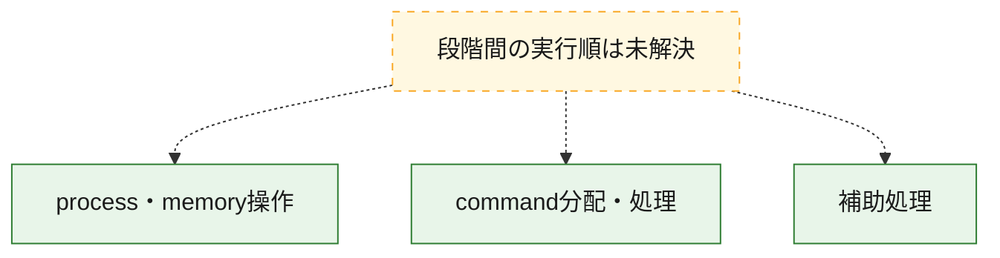
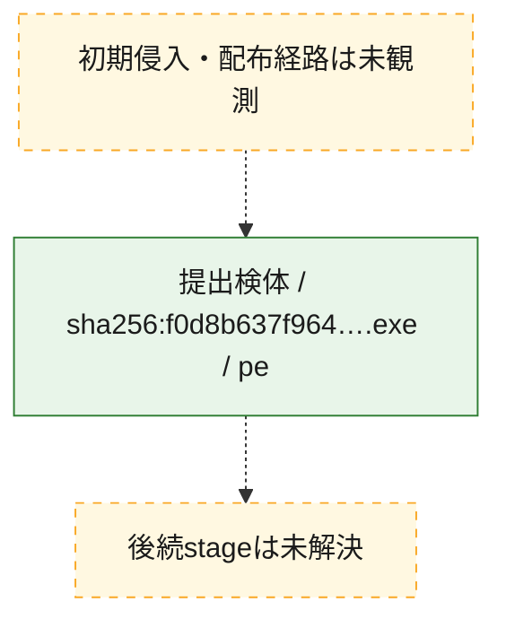
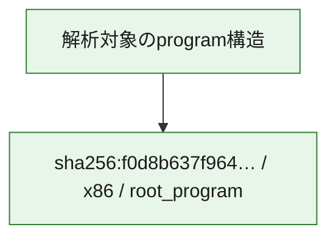

# 全体ロジック：f0d8b637f964d937fb1d843226272938bdd34cda8ba957a01c029bde06505955

代表関数の静的証跡から、process・memory操作、command分配・処理の処理群を確認しました。

## 読み方

- phaseの掲載順は解析上の整理順です。observed_call_edgesがない段階間の実行順を断定しません。
- 図の実線は静的に観測した関係、点線と黄色のノードは未観測・未解決の関係を示します。
- 図は静的な要約であり、動的実行を再現するものではありません。
- 詳細な関数解説とfingerprintは[STATIC-LOGIC.md](STATIC-LOGIC.md)を参照してください。

## 静的可視化

### 実行フロー

### 感染チェーン

### モジュール関係

## 処理段階

### 1. process・memory操作

process、thread、module、memory操作と実行移行を確認します。
確度: `confirmed_static_function_evidence`

- `f0d8b637f964d937fb1d843226272938bdd34cda8ba957a01c029bde06505955:ghidra:140004248` — process、thread、module、またはmemory操作に関係する関数です。 状態: `succeeded`、選定理由: `context_representative`, `reviewed_call_centrality:11`, `role:process_or_memory_operation`

### 2. command分配・処理

受信commandやtaskの解釈、分配、個別handlerへの移行を確認します。
確度: `confirmed_static_function_evidence`

- `f0d8b637f964d937fb1d843226272938bdd34cda8ba957a01c029bde06505955:ghidra:140004f84` — commandの解釈、分配、または個別処理を担当する関数です。 状態: `succeeded`、選定理由: `context_representative`, `reviewed_call_centrality:19`, `role:command_dispatch_or_handler`

### 3. 補助処理

主要処理を支える一般内部関数またはlibrary処理を確認します。
確度: `confirmed_static_function_evidence`

- `f0d8b637f964d937fb1d843226272938bdd34cda8ba957a01c029bde06505955:ghidra:140004004` — 検体内部の一般処理を実装する関数です。 状態: `succeeded`、選定理由: `context_representative`, `reviewed_call_centrality:1`
- `f0d8b637f964d937fb1d843226272938bdd34cda8ba957a01c029bde06505955:ghidra:140004038` — 検体内部の一般処理を実装する関数です。 状態: `succeeded`、選定理由: `context_representative`
- `f0d8b637f964d937fb1d843226272938bdd34cda8ba957a01c029bde06505955:ghidra:14000408c` — 検体内部の一般処理を実装する関数です。 状態: `succeeded`、選定理由: `context_representative`, `reviewed_call_centrality:4`
- `f0d8b637f964d937fb1d843226272938bdd34cda8ba957a01c029bde06505955:ghidra:140004100` — 検体内部の一般処理を実装する関数です。 状態: `succeeded`、選定理由: `context_representative`, `reviewed_call_centrality:3`
- `f0d8b637f964d937fb1d843226272938bdd34cda8ba957a01c029bde06505955:ghidra:14000415c` — 検体内部の一般処理を実装する関数です。 状態: `succeeded`、選定理由: `context_representative`, `reviewed_call_centrality:3`
- `f0d8b637f964d937fb1d843226272938bdd34cda8ba957a01c029bde06505955:ghidra:1400041c8` — 検体内部の一般処理を実装する関数です。 状態: `succeeded`、選定理由: `context_representative`, `reviewed_call_centrality:1`
- `f0d8b637f964d937fb1d843226272938bdd34cda8ba957a01c029bde06505955:ghidra:140004208` — 検体内部の一般処理を実装する関数です。 状態: `succeeded`、選定理由: `context_representative`, `reviewed_call_centrality:2`
- `f0d8b637f964d937fb1d843226272938bdd34cda8ba957a01c029bde06505955:ghidra:140004338` — 検体内部の一般処理を実装する関数です。 状態: `succeeded`、選定理由: `context_representative`, `reviewed_call_centrality:2`
- `f0d8b637f964d937fb1d843226272938bdd34cda8ba957a01c029bde06505955:ghidra:1400043b8` — 検体内部の一般処理を実装する関数です。 状態: `succeeded`、選定理由: `context_representative`, `reviewed_call_centrality:2`
- `f0d8b637f964d937fb1d843226272938bdd34cda8ba957a01c029bde06505955:ghidra:14000443c` — 検体内部の一般処理を実装する関数です。 状態: `succeeded`、選定理由: `context_representative`, `reviewed_call_centrality:2`
- `f0d8b637f964d937fb1d843226272938bdd34cda8ba957a01c029bde06505955:ghidra:14000449c` — 検体内部の一般処理を実装する関数です。 状態: `succeeded`、選定理由: `context_representative`, `reviewed_call_centrality:1`
- `f0d8b637f964d937fb1d843226272938bdd34cda8ba957a01c029bde06505955:ghidra:1400044e4` — 検体内部の一般処理を実装する関数です。 状態: `succeeded`、選定理由: `context_representative`, `reviewed_call_centrality:1`
- `f0d8b637f964d937fb1d843226272938bdd34cda8ba957a01c029bde06505955:ghidra:140004514` — 検体内部の一般処理を実装する関数です。 状態: `succeeded`、選定理由: `context_representative`, `reviewed_call_centrality:8`
- `f0d8b637f964d937fb1d843226272938bdd34cda8ba957a01c029bde06505955:ghidra:140004698` — 検体内部の一般処理を実装する関数です。 状態: `succeeded`、選定理由: `context_representative`, `reviewed_call_centrality:2`
- `f0d8b637f964d937fb1d843226272938bdd34cda8ba957a01c029bde06505955:ghidra:140004700` — 検体内部の一般処理を実装する関数です。 状態: `succeeded`、選定理由: `context_representative`, `reviewed_call_centrality:8`
- `f0d8b637f964d937fb1d843226272938bdd34cda8ba957a01c029bde06505955:ghidra:140004800` — 検体内部の一般処理を実装する関数です。 状態: `succeeded`、選定理由: `context_representative`, `reviewed_call_centrality:7`
- `f0d8b637f964d937fb1d843226272938bdd34cda8ba957a01c029bde06505955:ghidra:14000494c` — 検体内部の一般処理を実装する関数です。 状態: `succeeded`、選定理由: `context_representative`, `reviewed_call_centrality:5`
- `f0d8b637f964d937fb1d843226272938bdd34cda8ba957a01c029bde06505955:ghidra:140004a24` — 検体内部の一般処理を実装する関数です。 状態: `succeeded`、選定理由: `context_representative`, `reviewed_call_centrality:7`
- `f0d8b637f964d937fb1d843226272938bdd34cda8ba957a01c029bde06505955:ghidra:140004b48` — 検体内部の一般処理を実装する関数です。 状態: `succeeded`、選定理由: `context_representative`, `reviewed_call_centrality:7`
- `f0d8b637f964d937fb1d843226272938bdd34cda8ba957a01c029bde06505955:ghidra:140004c60` — 検体内部の一般処理を実装する関数です。 状態: `succeeded`、選定理由: `context_representative`, `reviewed_call_centrality:4`
- `f0d8b637f964d937fb1d843226272938bdd34cda8ba957a01c029bde06505955:ghidra:140004cfc` — 検体内部の一般処理を実装する関数です。 状態: `succeeded`、選定理由: `context_representative`, `reviewed_call_centrality:6`
- `f0d8b637f964d937fb1d843226272938bdd34cda8ba957a01c029bde06505955:ghidra:140004e00` — 検体内部の一般処理を実装する関数です。 状態: `succeeded`、選定理由: `context_representative`, `reviewed_call_centrality:4`
- `f0d8b637f964d937fb1d843226272938bdd34cda8ba957a01c029bde06505955:ghidra:140004e8c` — 検体内部の一般処理を実装する関数です。 状態: `succeeded`、選定理由: `context_representative`, `reviewed_call_centrality:2`
- `f0d8b637f964d937fb1d843226272938bdd34cda8ba957a01c029bde06505955:ghidra:140004ef4` — 検体内部の一般処理を実装する関数です。 状態: `succeeded`、選定理由: `context_representative`, `reviewed_call_centrality:2`
- `f0d8b637f964d937fb1d843226272938bdd34cda8ba957a01c029bde06505955:ghidra:140004f4c` — 検体内部の一般処理を実装する関数です。 状態: `succeeded`、選定理由: `context_representative`, `reviewed_call_centrality:2`
- `f0d8b637f964d937fb1d843226272938bdd34cda8ba957a01c029bde06505955:ghidra:14000542c` — 検体内部の一般処理を実装する関数です。 状態: `succeeded`、選定理由: `context_representative`, `reviewed_call_centrality:1`
- `f0d8b637f964d937fb1d843226272938bdd34cda8ba957a01c029bde06505955:ghidra:140005490` — 検体内部の一般処理を実装する関数です。 状態: `succeeded`、選定理由: `context_representative`, `reviewed_call_centrality:1`
- `f0d8b637f964d937fb1d843226272938bdd34cda8ba957a01c029bde06505955:ghidra:1400054d4` — 検体内部の一般処理を実装する関数です。 状態: `succeeded`、選定理由: `context_representative`, `reviewed_call_centrality:3`
- `f0d8b637f964d937fb1d843226272938bdd34cda8ba957a01c029bde06505955:ghidra:14000551c` — 検体内部の一般処理を実装する関数です。 状態: `succeeded`、選定理由: `context_representative`, `reviewed_call_centrality:21`
- `f0d8b637f964d937fb1d843226272938bdd34cda8ba957a01c029bde06505955:ghidra:14000583c` — 検体内部の一般処理を実装する関数です。 状態: `succeeded`、選定理由: `context_representative`, `reviewed_call_centrality:6`

## 観測したcall関係

- 代表関数間で直接解決できた呼出関係はありません。

## 解析範囲と制約

- 選定外関数は全体inventoryへ残しますが、関数本体の個別解説対象にはしていません。
- indirect call、難読化、packer、VM、壊れたcontrol flowによりcall関係が欠落する場合があります。
- 文書は静的解析に基づき、検体実行や外部通信による動的確認は行っていません。
