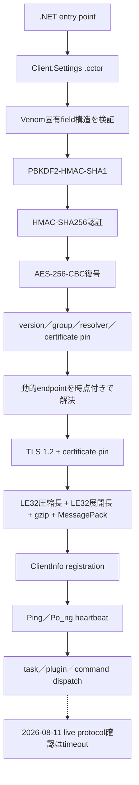
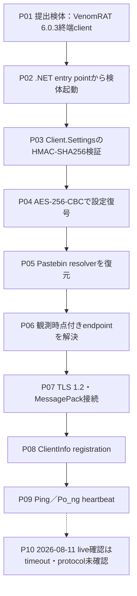
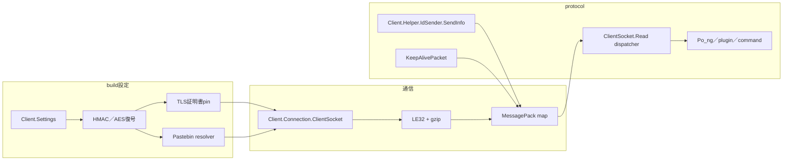
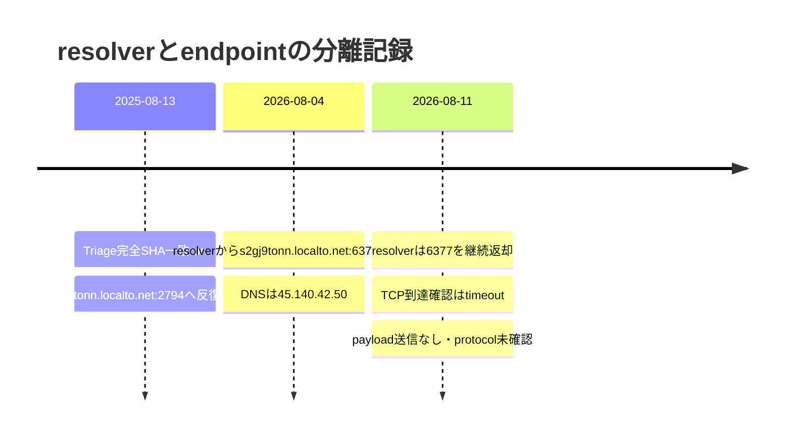

# VenomRAT 6.0.3 全体ロジック

## 解析範囲

提出物は外側loaderではなく、264個のmanaged methodを持つVenomRAT 6.0.3終端clientです。`Client.Settings`の認証済み復号、代表managed methodのCIL意味レビュー、完全SHA-256一致sandbox、時点付きresolver観測を統合しました。検体やpluginは実行していません。

図の実線は静的に確認した関係、点線は未実装または未確認の関係です。

## 実行フロー

## 感染チェーン

## モジュール関係

## C2時系列

## 代表managed method

| method | token | 役割 | CIL意味SHA-256 |
|---|---|---|---|
| `Client.Helper.IdSender.SendInfo` | `0x0600007d` | `Pac_ket=ClientInfo`のregistration構築 | `5f8ad741586361d7375b8f33c0c8e70326218aba804502f7ef626b4e9c643fc9` |
| `Client.Connection.ClientSocket.KeepAlivePacket` | `0x06000056` | `Pac_ket=Ping`、privacy-sensitiveなactive window titleをmessageへ設定 | `8f598b167f1729f89266b9cb53bc218c0a24df4c2d037cf6179eeab985fdc2de` |
| `Client.Connection.ClientSocket.Read` | `0x06000058` | `Po_ng`、plugin、keylog、running app等のmessage dispatch | `55ad75334ced3c569574f2e2d53c5c60b2a487933e2b8ef66beba1159a59f7e0` |

公開用emulatorでは、実端末のHWID、user、window title、process情報を使用せず、すべて固定合成値に置き換える必要があります。

## 設定とendpointのロジック

1. Venom固有CLR field群が完全に揃うことを確認します。
2. PBKDF2で鍵を導出します。
3. 復号前にHMAC-SHA256を検証します。
4. AES-256-CBCとPKCS#7で設定を復号します。
5. 固定host／portが空であること、resolver URLと証明書pinを確認します。
6. resolverの結果は静的設定へ上書きせず、観測時点ごとのendpoint履歴へ記録します。

## protocol比較

Quasar／AsyncRAT系と同様に、TLS、長さframe、圧縮payload、証明書pin、registration／heartbeatという構造を持ちます。この完全一致buildは`MessagePackLib.MessagePack`、`Pac_ket`、`ClientInfo`、`Ping`／`Po_ng`の組合せを持ち、これらをVenomRAT profileへの束縛根拠とします。MessagePack文字列単独ではexact一致としません。

## 防御用emulator計画

1. SHA-256、resolver観測、certificate pinを事前に固定します。
2. TLS 1.2、LE32圧縮長、LE32展開長、gzip上限を検証します。
3. privacy-safeな固定`ClientInfo` registrationを1回だけ送ります。
4. 空`Message`の`Ping`を1回だけ送信し、`Po_ng`または既知messageを最大1 frame分類します。
5. command、plugin、file transfer、config updateへ応答せず切断します。
6. 証明書不一致は`inconclusive`として記録し、非C2確定には使いません。

## 未完了項目

- TLS MessagePack profileと有限emulatorは実装済みです。
- 2026-08-11のendpointはtimeoutで、protocol levelの外部C2確認は未完了です。
- 更新済み統合extractorによるone-shot handler/report再生成が必要です。
- managed CIL意味レビューはありますが、本case用のGhidra MCP全関数inventoryはありません。
