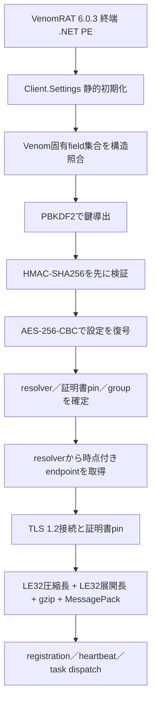
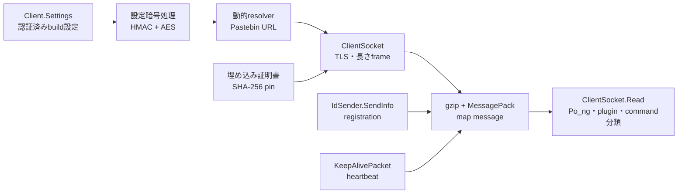
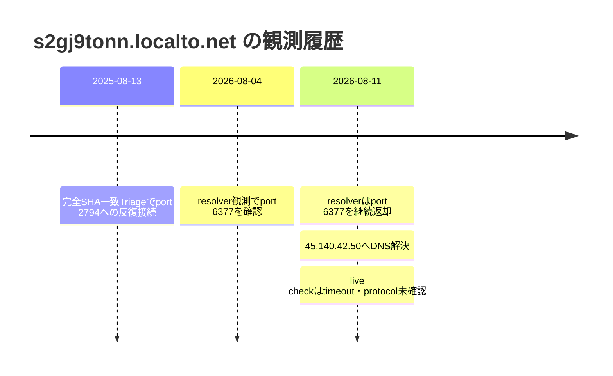

# VenomRAT 6.0.3 ケース解析

## 結論

SHA-256 `6a24ba25482c73d193fcc208d8ae267236b870b9ab30c44cabe2dc8bfb7a1073` は、VenomRAT 6.0.3 の終端 .NET clientです。外側ローダーや未復元payloadではありません。検体を実行せず、`Client.Settings` の値をHMAC-SHA256で認証してからAES-256-CBCで復号し、version、group、動的設定resolver、TLS証明書pinを復元しました。

| 項目 | 結果 |
|---|---|
| ファミリー／版 | VenomRAT `v6.0.3` |
| 検体の役割 | 終端managed client |
| 静的設定 | HMAC検証済みで復元 |
| 固定host／port | 空 |
| 動的設定resolver | `hxxps://pastebin[.]com/raw/bncBB3Da` |
| 証明書 SHA-256 | `4370b606ee51b67ab75611600406eb74762f5c134309358d042d696d789c5e22` |
| protocol | TLS 1.2、LE32圧縮長、LE32展開長、gzip、MessagePack map |
| 現在の制約 | live protocol確認とone-shot再生成が未完了 |
| 安全属性 | ローカル実行なし、この追加解析での外部接続なし |

## 実行チェーン

## モジュール関係

## C2時系列

## 設定復元

- version: `Venom RAT + HVNC + Stealer + Grabber  v6.0.3`
- group: `start`
- install: `true`
- anti-analysis: `false`
- 動的設定resolver: `hxxps://pastebin[.]com/raw/bncBB3Da`
- 固定host／port: 空
- 証明書 SHA-256: `4370b606ee51b67ab75611600406eb74762f5c134309358d042d696d789c5e22`

復号値のHMACが一致しない入力、Venom固有field群が不足する入力、または復元結果のfamily／SHA-256／安全属性が一致しない入力では、endpointと証明書hashを公開しないfail-closed実装です。詳細は[設定復元結果](venomrat-config.json)と[静的追加解析](STATIC-DEEP-DIVE.md)を参照してください。

## C2 endpointの解釈

| 観測時点 | endpoint | 根拠 | 判定 |
|---|---|---|---|
| 2025-08-13 | `s2gj9tonn[.]localto[.]net:2794` | 完全SHA-256一致Triage | 過去のsandbox実通信。現在値へ上書きしない |
| 2026-08-04～2026-08-11 | `s2gj9tonn[.]localto[.]net:6377` | resolverの時点付き観測 | 2026-08-11時点の監視対象 |
| 2026-08-11 | `45.140.42[.]50:6377` | DNSと到達確認 | timeout。恒久停止・非C2とは断定しない |

静的設定はresolver URLだけを持ち、`2794`と`6377`は運用時点の異なる観測です。両portを同一の固定設定として統合していません。

## protocolとemulator

同一SHA-256のmanaged CIL証拠では、`MessagePackLib.MessagePack`、`Pac_ket`、`ClientInfo`、`Ping`から`Po_ng`への応答分類を確認しました。既存VenomRAT profileはTLS 1.2、4 byte little-endianの圧縮長、4 byte little-endianの展開長、gzip圧縮MessagePack mapとして実装され、この証拠へ束縛されています。TCP port openだけをprotocol一致とは扱いません。証明書pinは強い補助証拠ですが、buildや運用による証明書変更を考慮し、不一致だけで非C2とは判定しません。

安全なemulatorは実装済みです。合成`ClientInfo`を1回、実端末情報を含まない`Ping`を1回だけ送信し、`Po_ng`または既知messageを最大1 frame分類します。command、plugin、file transferには応答せず切断します。2026-08-11のlive checkはtimeoutだったため、外部C2とのprotocol一致は未確認です。

## 関連成果物

- [全体ロジック](OVERALL-LOGIC.md)
- [静的ロジック](STATIC-LOGIC.md)
- [静的追加解析](STATIC-DEEP-DIVE.md)
- [設定復元結果](venomrat-config.json)
- [C2解析](c2-analysis.json)
- [IOC一覧](IOC-LIST.md)
- [挙動・検体特徴](FEATURES.md)
- [公開sandbox証跡](TRIAGE.md)

## 制約

- 検体、plugin、command、後段moduleは実行していません。
- この追加解析では外部hostへ接続していません。
- profileとemulatorは実装済みですが、対象endpointのtimeoutによりprotocolレベルのlive C2確認は未完了です。
- 更新済み統合extractorによるone-shot report再生成は、caseの元解析契約と分離した残作業です。
