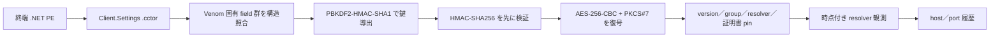

# VenomRAT 6.0.3 静的追加解析

## 結論

SHA-256 `6a24ba25482c73d193fcc208d8ae267236b870b9ab30c44cabe2dc8bfb7a1073` は、外側ローダーではなく VenomRAT 6.0.3 の終端 managed client です。検体を実行せず、`Client.Settings` の静的初期化値を HMAC-SHA256 で認証してから AES-256-CBC で復号し、次を確認しました。

- version: `Venom RAT + HVNC + Stealer + Grabber  v6.0.3`
- group: `start`
- install: `true`
- anti-analysis: `false`
- 動的設定 resolver: `https://pastebin.com/raw/bncBB3Da`
- 埋め込み証明書 SHA-256: `4370b606ee51b67ab75611600406eb74762f5c134309358d042d696d789c5e22`
- 固定 host／port: 空。検体内部の認証済み設定には保存されていません。

復号値の HMAC が一致しない入力、Venom 固有 field 群が不足する入力、または復元結果の SHA-256／family／安全属性が一致しない入力では、endpoint、resolver、証明書 hash を公開しない fail-closed 動作にしました。

## 設定復元と通信の関係

resolver の返す host／port は運用側が差し替えられるため、静的設定値へ上書きしません。復号済み resolver URL、sandbox の実通信、後日の監視対象は、根拠と観測時点を分離して保持します。

## endpoint の時系列

| 観測時点 | endpoint | 根拠 | 解釈 |
|---|---|---|---|
| 2025-08-13 | `s2gj9tonn[.]localto[.]net:2794`、解決先 `45.140.42[.]50` | 完全 SHA-256 一致の公開 Triage run `250813-sdctpaswcs` で反復接続を観測 | historical endpoint。現在値へ上書きしません。 |
| 2026-08-04～2026-08-11 | `s2gj9tonn[.]localto[.]net:6377`、DNS 解決先 `45.140.42[.]50` | 後日の resolver 観測とリポジトリ内 C2 監視 profile | 2026-08-11 時点の監視対象。2026-08-11 の live check は応答なしで、恒久停止や非 C2 を意味しません。 |

この差は port の誤記として統合せず、resolver による時間変化として記録します。静的検体だけから `2794` または `6377` を固定設定として再現することはできません。

## 特徴的な通信関数

完全SHA-256一致のCIL証拠では、clientが`SslStream.AuthenticateAsClient`を先に実行し、`MessagePackLib.MessagePack`で`Pac_ket=ClientInfo`と`Pac_ket=Ping`を構築し、`Po_ng`をdispatchする経路を確認しました。既存VenomRAT profileはTLS 1.2、4 byte little-endian圧縮長、4 byte little-endian展開長、gzip圧縮MessagePack mapとしてこの証拠へ束縛されています。埋め込み証明書との一致を確認するpin処理がありますが、別buildや運用時の証明書変更があり得るため、証明書不一致だけで非C2とは判定しません。

MessagePack mapにはregistration、heartbeat、plugin、keylog、running app等のpacket種別が含まれます。防御目的の最小emulatorではregistrationとheartbeatだけを対象にし、plugin、command、config updateを実行または返信してはいけません。

## 既存 TLS MessagePack emulator の境界

既存の`tls_messagepack_rat_host` profileは、この完全一致検体のCIL証拠へ束縛されています。合成`ClientInfo`、空文字へsanitizeした`Ping`、最大1 inbound frame、未知taskへの無応答、file transfer拒否、live fake result無効という安全境界を持ちます。

能動判定は次の条件に限定します。2026-08-11のlive checkはtimeoutだったため、TCP/TLS到達やprotocol一致は確認できていません。timeoutだけで恒久停止や非C2とは判定しません。

1. TLS 1.2と証明書pinを検証する。
2. 4 byte little-endian圧縮長、4 byte little-endian展開長、gzip上限を厳格に検証する。
3. privacy-safeな固定`ClientInfo` registrationを1回だけ送る。
4. 空`Message`の`Ping`を1回送り、`Po_ng`または既知messageを最大1 frameだけ分類し、command／pluginへ返信せず切断する。
5. TLS未成立、証明書不一致、timeoutはそれぞれ`inconclusive`として記録する。

この追加解析では外部 host へ接続せず、検体、module、plugin を実行していません。
