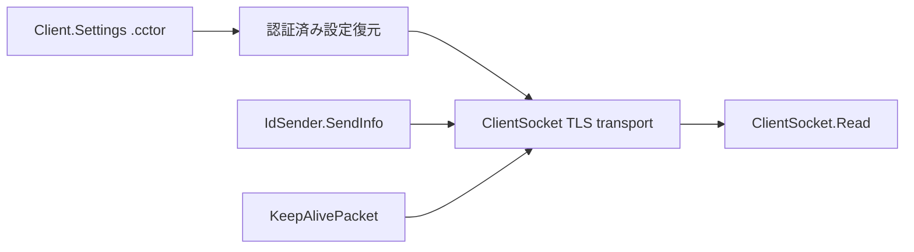

# 静的ロジック解析：VenomRAT 6.0.3

## 解析状態

- 状態: `managed_il_messagepack_profile_reviewed_live_unconfirmed`
- managed method棚卸し件数: 264
- 代表managed method: 3
- 設定復元処理単位: 3
- Ghidra MCP program件数: 0
- 検体実行: なし
- 外部接続: なし

この成果物は既存のmanaged CIL意味レビューとHMAC検証済み設定復元を統合したものです。Ghidra MCP全関数inventoryの完了を意味しません。

## 代表managed method

| method | token | 役割 | CIL意味SHA-256 |
|---|---|---|---|
| `Client.Helper.IdSender.SendInfo` | `0x0600007d` | 固定schemaの`ClientInfo` registrationを構築 | `5f8ad741586361d7375b8f33c0c8e70326218aba804502f7ef626b4e9c643fc9` |
| `Client.Connection.ClientSocket.KeepAlivePacket` | `0x06000056` | `Ping` heartbeatを作成 | `8f598b167f1729f89266b9cb53bc218c0a24df4c2d037cf6179eeab985fdc2de` |
| `Client.Connection.ClientSocket.Read` | `0x06000058` | `Po_ng`、plugin、command等をdispatch | `55ad75334ced3c569574f2e2d53c5c60b2a487933e2b8ef66beba1159a59f7e0` |

## 設定復元の処理単位

1. CLR metadataからVenom固有field集合を構造照合する。
2. PBKDF2で鍵を導出し、HMAC-SHA256を先に検証する。
3. AES-256-CBCで設定を復号し、resolver／certificate pinを型検証する。

## call関係

## 類似性判断の境界

Quasar／AsyncRAT系とTLS、圧縮frame、証明書pin、registration／heartbeatの構成が類似します。このSHA-256では`MessagePackLib.MessagePack`、`Pac_ket`、`ClientInfo`、`Ping`、`Po_ng`を同時に確認し、既存VenomRAT TLS MessagePack profileへの束縛根拠とします。MessagePack文字列だけではexact一致としません。

## 制約

- raw CILや逆コンパイル全文は公開していません。
- 本case専用のGhidra MCP program selector、全件paging、call graph inventoryは未記録です。
- TLS MessagePack emulatorは実装済みですが、live endpointはtimeoutでprotocol未確認です。
