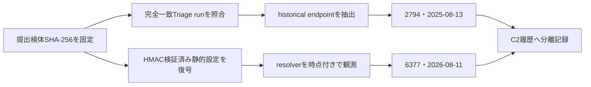

# Triage公開解析・後段取得証跡

## 完全SHA-256一致

- [250813-sqcpfssxaz](https://tria.ge/250813-sqcpfssxaz)
- [250813-sgrr1sswfv](https://tria.ge/250813-sgrr1sswfv)
- [250813-sdctpaswcs](https://tria.ge/250813-sdctpaswcs)

提出物は終端managed clientであり、追加payload取得は必要ありません。公開APIの正規化結果はendpointを返しませんでしたが、完全SHA一致runの詳細レビューでは2025-08-13に`s2gj9tonn[.]localto[.]net:2794`への反復接続が確認されています。

## 静的設定との対応

- 認証済み静的設定は固定host／portを持ちません。
- 静的設定は`hxxps://pastebin[.]com/raw/bncBB3Da`をresolverとして保持します。
- 2025-08-13の`2794`はhistorical sandbox endpointです。
- 2026-08-04～2026-08-11の`6377`は別時点のresolver観測です。
- この時系列差を静的設定の矛盾や誤記として統合していません。

## 判定境界

Triage由来endpointは外部sandbox証跡です。2026-08-11のlive checkはtimeoutで、payload送信もprotocol応答確認もありません。恒久停止または非C2とは判定しません。検体と取得物をローカル実行していません。
