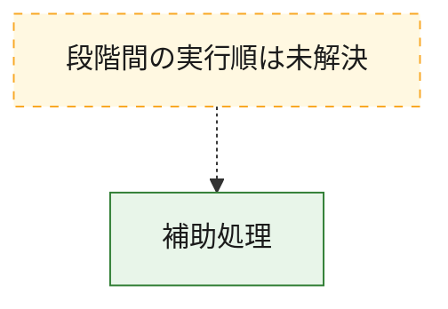
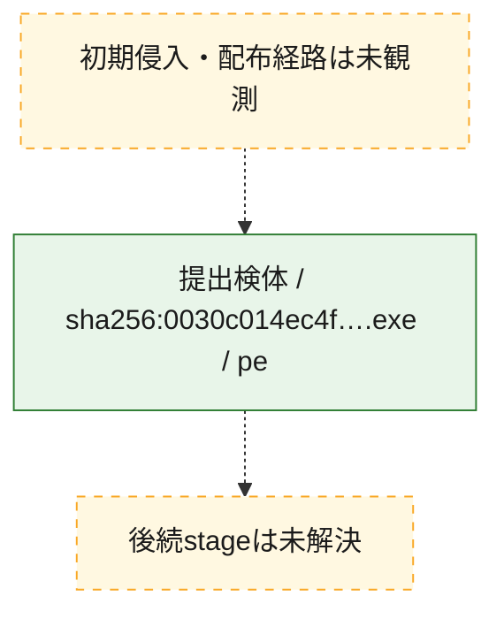
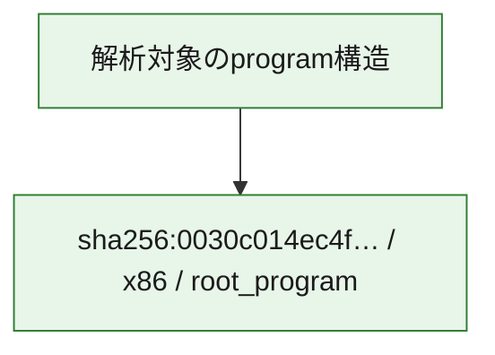

# 全体ロジック：0030c014ec4fae311492a87011f565f9ff3b1881137dda152953c6fe718e33e0

代表関数から主要なmalware処理段階を自動分類できませんでした。

## 読み方

- phaseの掲載順は解析上の整理順です。observed_call_edgesがない段階間の実行順を断定しません。
- 図の実線は静的に観測した関係、点線と黄色のノードは未観測・未解決の関係を示します。
- 図は静的な要約であり、動的実行を再現するものではありません。
- 詳細な関数解説とfingerprintは[STATIC-LOGIC.md](STATIC-LOGIC.md)を参照してください。

## 静的可視化

### 実行フロー

### 感染チェーン

### モジュール関係

## 処理段階

### 1. 補助処理

主要処理を支える一般内部関数またはlibrary処理を確認します。
確度: `confirmed_static_function_evidence`

- `0030c014ec4fae311492a87011f565f9ff3b1881137dda152953c6fe718e33e0:ghidra:740001050` — 検体内部の一般処理を実装する関数です。 状態: `succeeded`、選定理由: `context_representative`, `reviewed_call_centrality:17`
- `0030c014ec4fae311492a87011f565f9ff3b1881137dda152953c6fe718e33e0:ghidra:74000167c` — 検体内部の一般処理を実装する関数です。 状態: `succeeded`、選定理由: `context_representative`, `reviewed_call_centrality:19`
- `0030c014ec4fae311492a87011f565f9ff3b1881137dda152953c6fe718e33e0:ghidra:740001a30` — 検体内部の一般処理を実装する関数です。 状態: `succeeded`、選定理由: `context_representative`, `reviewed_call_centrality:2`
- `0030c014ec4fae311492a87011f565f9ff3b1881137dda152953c6fe718e33e0:ghidra:740001aec` — 検体内部の一般処理を実装する関数です。 状態: `succeeded`、選定理由: `context_representative`, `reviewed_call_centrality:4`
- `0030c014ec4fae311492a87011f565f9ff3b1881137dda152953c6fe718e33e0:ghidra:740001c0c` — 検体内部の一般処理を実装する関数です。 状態: `succeeded`、選定理由: `context_representative`, `reviewed_call_centrality:13`
- `0030c014ec4fae311492a87011f565f9ff3b1881137dda152953c6fe718e33e0:ghidra:740001dc0` — 検体内部の一般処理を実装する関数です。 状態: `succeeded`、選定理由: `context_representative`, `reviewed_call_centrality:16`
- `0030c014ec4fae311492a87011f565f9ff3b1881137dda152953c6fe718e33e0:ghidra:740001fe4` — 検体内部の一般処理を実装する関数です。 状態: `succeeded`、選定理由: `context_representative`, `reviewed_call_centrality:4`
- `0030c014ec4fae311492a87011f565f9ff3b1881137dda152953c6fe718e33e0:ghidra:740002210` — 検体内部の一般処理を実装する関数です。 状態: `succeeded`、選定理由: `context_representative`, `reviewed_call_centrality:2`
- `0030c014ec4fae311492a87011f565f9ff3b1881137dda152953c6fe718e33e0:ghidra:740002294` — 検体内部の一般処理を実装する関数です。 状態: `succeeded`、選定理由: `context_representative`
- `0030c014ec4fae311492a87011f565f9ff3b1881137dda152953c6fe718e33e0:ghidra:74000236c` — 検体内部の一般処理を実装する関数です。 状態: `succeeded`、選定理由: `context_representative`, `reviewed_call_centrality:2`
- `0030c014ec4fae311492a87011f565f9ff3b1881137dda152953c6fe718e33e0:ghidra:740002478` — 検体内部の一般処理を実装する関数です。 状態: `succeeded`、選定理由: `context_representative`, `reviewed_call_centrality:2`
- `0030c014ec4fae311492a87011f565f9ff3b1881137dda152953c6fe718e33e0:ghidra:7400024d8` — 検体内部の一般処理を実装する関数です。 状態: `succeeded`、選定理由: `context_representative`, `reviewed_call_centrality:7`
- `0030c014ec4fae311492a87011f565f9ff3b1881137dda152953c6fe718e33e0:ghidra:740002930` — 検体内部の一般処理を実装する関数です。 状態: `succeeded`、選定理由: `context_representative`, `reviewed_call_centrality:4`
- `0030c014ec4fae311492a87011f565f9ff3b1881137dda152953c6fe718e33e0:ghidra:7400029f4` — 検体内部の一般処理を実装する関数です。 状態: `succeeded`、選定理由: `context_representative`, `reviewed_call_centrality:1`
- `0030c014ec4fae311492a87011f565f9ff3b1881137dda152953c6fe718e33e0:ghidra:740002b10` — 検体内部の一般処理を実装する関数です。 状態: `succeeded`、選定理由: `context_representative`, `reviewed_call_centrality:2`
- `0030c014ec4fae311492a87011f565f9ff3b1881137dda152953c6fe718e33e0:ghidra:740002da4` — 検体内部の一般処理を実装する関数です。 状態: `succeeded`、選定理由: `context_representative`, `reviewed_call_centrality:22`
- `0030c014ec4fae311492a87011f565f9ff3b1881137dda152953c6fe718e33e0:ghidra:74000373c` — 検体内部の一般処理を実装する関数です。 状態: `succeeded`、選定理由: `context_representative`, `reviewed_call_centrality:13`
- `0030c014ec4fae311492a87011f565f9ff3b1881137dda152953c6fe718e33e0:ghidra:740003eb0` — 検体内部の一般処理を実装する関数です。 状態: `succeeded`、選定理由: `context_representative`, `reviewed_call_centrality:5`
- `0030c014ec4fae311492a87011f565f9ff3b1881137dda152953c6fe718e33e0:ghidra:740004330` — 検体内部の一般処理を実装する関数です。 状態: `succeeded`、選定理由: `context_representative`, `reviewed_call_centrality:4`
- `0030c014ec4fae311492a87011f565f9ff3b1881137dda152953c6fe718e33e0:ghidra:74000484c` — 検体内部の一般処理を実装する関数です。 状態: `succeeded`、選定理由: `context_representative`, `reviewed_call_centrality:21`
- `0030c014ec4fae311492a87011f565f9ff3b1881137dda152953c6fe718e33e0:ghidra:740004fc0` — 検体内部の一般処理を実装する関数です。 状態: `succeeded`、選定理由: `context_representative`, `reviewed_call_centrality:13`
- `0030c014ec4fae311492a87011f565f9ff3b1881137dda152953c6fe718e33e0:ghidra:7400054f0` — 検体内部の一般処理を実装する関数です。 状態: `succeeded`、選定理由: `context_representative`, `reviewed_call_centrality:23`
- `0030c014ec4fae311492a87011f565f9ff3b1881137dda152953c6fe718e33e0:ghidra:74000576c` — 検体内部の一般処理を実装する関数です。 状態: `succeeded`、選定理由: `context_representative`, `reviewed_call_centrality:10`
- `0030c014ec4fae311492a87011f565f9ff3b1881137dda152953c6fe718e33e0:ghidra:740005dec` — 検体内部の一般処理を実装する関数です。 状態: `succeeded`、選定理由: `context_representative`, `reviewed_call_centrality:5`
- `0030c014ec4fae311492a87011f565f9ff3b1881137dda152953c6fe718e33e0:ghidra:7400060ac` — 検体内部の一般処理を実装する関数です。 状態: `succeeded`、選定理由: `context_representative`, `reviewed_call_centrality:1`
- `0030c014ec4fae311492a87011f565f9ff3b1881137dda152953c6fe718e33e0:ghidra:7400060dc` — 検体内部の一般処理を実装する関数です。 状態: `succeeded`、選定理由: `context_representative`, `reviewed_call_centrality:3`
- `0030c014ec4fae311492a87011f565f9ff3b1881137dda152953c6fe718e33e0:ghidra:7400062e0` — 検体内部の一般処理を実装する関数です。 状態: `succeeded`、選定理由: `context_representative`, `reviewed_call_centrality:5`
- `0030c014ec4fae311492a87011f565f9ff3b1881137dda152953c6fe718e33e0:ghidra:740006600` — 検体内部の一般処理を実装する関数です。 状態: `succeeded`、選定理由: `context_representative`, `reviewed_call_centrality:5`
- `0030c014ec4fae311492a87011f565f9ff3b1881137dda152953c6fe718e33e0:ghidra:740006718` — 検体内部の一般処理を実装する関数です。 状態: `succeeded`、選定理由: `context_representative`, `reviewed_call_centrality:5`
- `0030c014ec4fae311492a87011f565f9ff3b1881137dda152953c6fe718e33e0:ghidra:74000678c` — 検体内部の一般処理を実装する関数です。 状態: `succeeded`、選定理由: `context_representative`, `reviewed_call_centrality:19`
- `0030c014ec4fae311492a87011f565f9ff3b1881137dda152953c6fe718e33e0:ghidra:740006ad0` — 検体内部の一般処理を実装する関数です。 状態: `succeeded`、選定理由: `context_representative`, `reviewed_call_centrality:15`
- `0030c014ec4fae311492a87011f565f9ff3b1881137dda152953c6fe718e33e0:ghidra:740006dc4` — 検体内部の一般処理を実装する関数です。 状態: `succeeded`、選定理由: `context_representative`, `reviewed_call_centrality:15`

## 観測したcall関係

- 代表関数間で直接解決できた呼出関係はありません。

## 解析範囲と制約

- 選定外関数は全体inventoryへ残しますが、関数本体の個別解説対象にはしていません。
- indirect call、難読化、packer、VM、壊れたcontrol flowによりcall関係が欠落する場合があります。
- 文書は静的解析に基づき、検体実行や外部通信による動的確認は行っていません。
