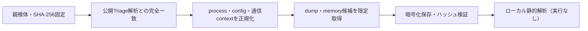

# Triage公開解析・後段取得証跡

## 完全ハッシュ一致

- [260924-k87csaxx2n](https://tria.ge/260924-k87csaxx2n): ファミリー候補 `vidar`、評価score `10`

## プロセス・通信

- 観測process: `046b90a8e9991afb9d04de85812f17d8eb56a6dfad3b34dd371025a5caea21b1.bin.exe`
- raw commandは保存せず、command SHA-256と処理patternだけをJSONへ保持します。
- sandbox background trafficは`context_only`であり、C2へ自動昇格しません。

- `https://65.109.8.10/`（sandbox config候補）
- `https://community.fandom.com/wikia.php`（sandbox config候補）
- `https://steamcommunity.com/profiles/76561198639924729`（sandbox config候補）
- `https://telegram.me/<redacted>`（sandbox config候補）

## 後段取得物

- `ca83be80ad7e0c7512d3a68efaeb6a53070eff12439156f853495ed3ae65c2ea` / `memory_image` / 2695168 bytes / 親と同一: `false` / 静的解析: `partial`
- `deb168a232ef495e54fd95dcae61c0fc43f9a769be3424aaa3162ed6acc38686` / `memory_image` / 2695168 bytes / 親と同一: `false` / 静的解析: `partial`
- `7aa6565354d8b1542130b5862d0095705736da93a4802a4ea292344780f87cf8` / `memory_image` / 2695168 bytes / 親と同一: `false` / 静的解析: `partial`
- `6177d55a0f47e1d5dfe8a05feb1d8e198989109e8002ce6c3db1360601642836` / `memory_image` / 2695168 bytes / 親と同一: `false` / 静的解析: `partial`
- `301b2e3591250a59fb66af7c664692d18703a46c953dca6f185040dd1170d8a6` / `memory_image` / 2695168 bytes / 親と同一: `false` / 静的解析: `partial`
- `927347498e8ba7ee14ff664c3aafdc5efef37344125e87737f778ff4b1c27954` / `memory_image` / 2695168 bytes / 親と同一: `false` / 静的解析: `partial`
- `38a461bbef9f26e90d46026843158e7c1bf4b1f1f2b14dbd535d12d0647341b4` / `memory_image` / 2695168 bytes / 親と同一: `false` / 静的解析: `partial`
- `60651bab09744294690a70ffaf8ea27515f6c0e324933fddf4cada78aa3fae8a` / `memory_image` / 2695168 bytes / 親と同一: `false` / 静的解析: `partial`
- `a4fc8b2905ecf13d7053f9afd948e734992cb6742a04288155092a2f95d498e9` / `memory_image` / 2695168 bytes / 親と同一: `false` / 静的解析: `partial`
- `da5c071953d59c6a822d5d32ed1aa5675583e770de7bd58d0a69a104810ad27e` / `memory_image` / 2695168 bytes / 親と同一: `false` / 静的解析: `partial`

## 判定境界

Triage由来のfamily、process、config、通信は外部sandbox証跡です。Config extractorが返したendpointはC2候補として扱いますが、静的設定復元またはprocess帰属とprotocol応答が揃うまでは確認済みC2とはしません。取得成果物と検体は実行していません。
