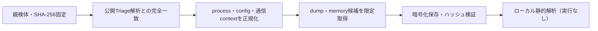

# Triage公開解析・後段取得証跡

## 完全ハッシュ一致

- [260826-zrnxfaweqd](https://tria.ge/260826-zrnxfaweqd): ファミリー候補 `未確定`、評価score `None`

## プロセス・通信

- 観測process: `取得できず`
- raw commandは保存せず、command SHA-256と処理patternだけをJSONへ保持します。
- sandbox background trafficは`context_only`であり、C2へ自動昇格しません。

- 取得できませんでした。

## 後段取得物

- `48ee8ecf4b23161c3154d497253db18b75c147d10f790db1d3ef72dcae8f5123` / `memory_image` / 2453504 bytes / 親と同一: `false` / 静的解析: `partial`
- `174c0c34905b39b0b3956c70ea8de379d833eae653357a89a26626ab2242c1c0` / `memory_image` / 2453504 bytes / 親と同一: `false` / 静的解析: `partial`
- `64f330c5a6cb505657efd8cae93ae73c3d8e567881b2f9826a1969b08cb42e12` / `memory_image` / 2453504 bytes / 親と同一: `false` / 静的解析: `partial`
- `0acaacc7e3c35d31802791e95b83f816740f2af8e21bd40b89e50afeed39c671` / `memory_image` / 4313088 bytes / 親と同一: `false` / 静的解析: `partial`
- `369009fa5bb94386c72b44332a9653ded9af3946dc5c51781d83f51bd7839b96` / `memory_image` / 2453504 bytes / 親と同一: `false` / 静的解析: `partial`
- `efa9bb9f4e004e313527ff53874abeb3492d5b40873706915cfc3e32ade3f912` / `memory_image` / 2453504 bytes / 親と同一: `false` / 静的解析: `partial`
- `be30e6432079c700d9b688e5d7963c9f1e7b98b65a7549b7e591c43fe16775b2` / `memory_image` / 2453504 bytes / 親と同一: `false` / 静的解析: `partial`
- `09c1ddeaea21085e89d9b5387ad7e4787a438ae52b7b1098745a9cdcecac4ff9` / `memory_image` / 2453504 bytes / 親と同一: `false` / 静的解析: `partial`
- `716e8d9133095f47b8abc7bc70794fc447d8dfb104227fc2eec563355ba33309` / `memory_image` / 2453504 bytes / 親と同一: `false` / 静的解析: `partial`
- `4069767c230949a3398fc708f232bacea73af0f4d36e2308c026f903ff3161b4` / `memory_image` / 2453504 bytes / 親と同一: `false` / 静的解析: `partial`
- `10b4f5bd10795c030825c63d1ebcc80f4f39feae77d296d82e477e4d003c43e2` / `memory_image` / 2453504 bytes / 親と同一: `false` / 静的解析: `partial`
- `f6ea1e9902f38b713562a0031699785385ef85a5da264d718f83d936456c0dee` / `memory_image` / 2453504 bytes / 親と同一: `false` / 静的解析: `partial`
- `29fbf771dd62785136d2d4e0124f1248c9a2bf122934e63c2964977289fb7e88` / `memory_image` / 4313088 bytes / 親と同一: `false` / 静的解析: `partial`
- `4f29d6a59325b306b9217808f28de4fdb323bbfaaf7b401a6c74b0ee9a26a42b` / `memory_image` / 2453504 bytes / 親と同一: `false` / 静的解析: `partial`
- `4cb9ec432e2c5d8f90fd4a297014257c9013d11db0e93b11639af3029631b756` / `memory_image` / 2453504 bytes / 親と同一: `false` / 静的解析: `partial`

## 判定境界

Triage由来のfamily、process、config、通信は外部sandbox証跡です。Config extractorが返したendpointはC2候補として扱いますが、静的設定復元またはprocess帰属とprotocol応答が揃うまでは確認済みC2とはしません。取得成果物と検体は実行していません。
