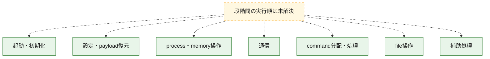
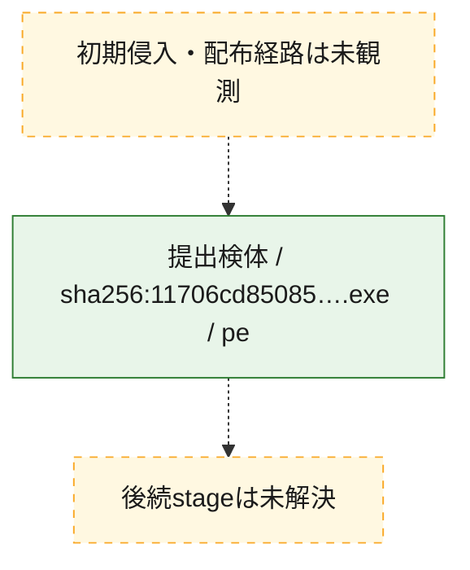
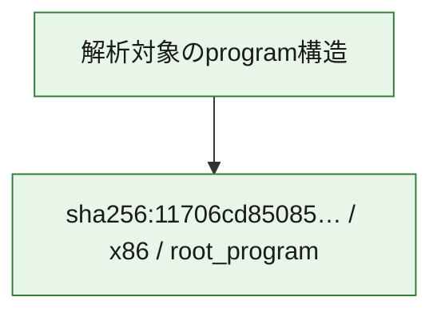

# 全体ロジック：11706cd85085e2c69d5b5067fb20d448ed5c7ec665a16063d5e6348add2a2e70

代表関数の静的証跡から、起動・初期化、設定・payload復元、process・memory操作、通信、command分配・処理、file操作の処理群を確認しました。

## 読み方

- phaseの掲載順は解析上の整理順です。observed_call_edgesがない段階間の実行順を断定しません。
- 図の実線は静的に観測した関係、点線と黄色のノードは未観測・未解決の関係を示します。
- 図は静的な要約であり、動的実行を再現するものではありません。
- 詳細な関数解説とfingerprintは[STATIC-LOGIC.md](STATIC-LOGIC.md)を参照してください。

## 静的可視化

### 実行フロー

### 感染チェーン

### モジュール関係

## 処理段階

### 1. 起動・初期化

entry pointから初期化と後続処理への移行を確認します。
確度: `confirmed_static_function_evidence_with_limits`

- `11706cd85085e2c69d5b5067fb20d448ed5c7ec665a16063d5e6348add2a2e70:ghidra:1400aa520` — 初期化と主要処理への分岐を行う入口関数です。 状態: `succeeded`、選定理由: `entry_point`, `meaningful_symbol_name`, `probable_go_main_user_code`, `reviewed_call_centrality:4`, `role:entrypoint`
- `11706cd85085e2c69d5b5067fb20d448ed5c7ec665a16063d5e6348add2a2e70:ghidra:1400aa8a0` — 初期化と主要処理への分岐を行う入口関数です。 状態: `succeeded`、選定理由: `entry_point`, `meaningful_symbol_name`, `probable_go_main_user_code`, `reviewed_call_centrality:4`, `role:entrypoint`
- `11706cd85085e2c69d5b5067fb20d448ed5c7ec665a16063d5e6348add2a2e70:ghidra:1400aa940` — 初期化と主要処理への分岐を行う入口関数です。 状態: `succeeded`、選定理由: `entry_point`, `meaningful_symbol_name`, `probable_go_main_user_code`, `reviewed_call_centrality:18`, `role:entrypoint`
- `11706cd85085e2c69d5b5067fb20d448ed5c7ec665a16063d5e6348add2a2e70:ghidra:1400ac140` — 初期化と主要処理への分岐を行う入口関数です。 状態: `succeeded`、選定理由: `entry_point`, `meaningful_symbol_name`, `probable_go_main_user_code`, `reviewed_call_centrality:18`, `role:entrypoint`
- `11706cd85085e2c69d5b5067fb20d448ed5c7ec665a16063d5e6348add2a2e70:ghidra:1400ad920` — 初期化と主要処理への分岐を行う入口関数です。 状態: `succeeded`、選定理由: `entry_point`, `meaningful_symbol_name`, `probable_go_main_user_code`, `reviewed_call_centrality:19`, `role:entrypoint`
- `11706cd85085e2c69d5b5067fb20d448ed5c7ec665a16063d5e6348add2a2e70:ghidra:1400b4fc0` — 初期化と主要処理への分岐を行う入口関数です。 状態: `succeeded`、選定理由: `entry_point`, `meaningful_symbol_name`, `probable_go_main_user_code`, `reviewed_call_centrality:19`, `role:entrypoint`
- `11706cd85085e2c69d5b5067fb20d448ed5c7ec665a16063d5e6348add2a2e70:ghidra:1400baf00` — 初期化と主要処理への分岐を行う入口関数です。 状態: `succeeded`、選定理由: `entry_point`, `meaningful_symbol_name`, `probable_go_main_user_code`, `reviewed_call_centrality:20`, `role:entrypoint`
- `11706cd85085e2c69d5b5067fb20d448ed5c7ec665a16063d5e6348add2a2e70:ghidra:1400bfba0` — 初期化と主要処理への分岐を行う入口関数です。 状態: `succeeded`、選定理由: `entry_point`, `meaningful_symbol_name`, `probable_go_main_user_code`, `reviewed_call_centrality:20`, `role:entrypoint`
- `11706cd85085e2c69d5b5067fb20d448ed5c7ec665a16063d5e6348add2a2e70:ghidra:1400c4860` — 初期化と主要処理への分岐を行う入口関数です。 状態: `succeeded`、選定理由: `entry_point`, `meaningful_symbol_name`, `probable_go_main_user_code`, `reviewed_call_centrality:19`, `role:entrypoint`
- `11706cd85085e2c69d5b5067fb20d448ed5c7ec665a16063d5e6348add2a2e70:ghidra:1400cc100` — 初期化と主要処理への分岐を行う入口関数です。 状態: `succeeded`、選定理由: `entry_point`, `meaningful_symbol_name`, `probable_go_main_user_code`, `reviewed_call_centrality:27`, `role:entrypoint`
- `11706cd85085e2c69d5b5067fb20d448ed5c7ec665a16063d5e6348add2a2e70:ghidra:1400d85e0` — 初期化と主要処理への分岐を行う入口関数です。 状態: `succeeded`、選定理由: `entry_point`, `meaningful_symbol_name`, `probable_go_main_user_code`, `reviewed_call_centrality:23`, `role:entrypoint`
- `11706cd85085e2c69d5b5067fb20d448ed5c7ec665a16063d5e6348add2a2e70:ghidra:1400dd0e0` — 初期化と主要処理への分岐を行う入口関数です。 状態: `succeeded`、選定理由: `entry_point`, `meaningful_symbol_name`, `probable_go_main_user_code`, `reviewed_call_centrality:18`, `role:entrypoint`
- `11706cd85085e2c69d5b5067fb20d448ed5c7ec665a16063d5e6348add2a2e70:ghidra:1400e65e0` — 初期化と主要処理への分岐を行う入口関数です。 状態: `succeeded`、選定理由: `entry_point`, `meaningful_symbol_name`, `probable_go_main_user_code`, `reviewed_call_centrality:18`, `role:entrypoint`
- `11706cd85085e2c69d5b5067fb20d448ed5c7ec665a16063d5e6348add2a2e70:ghidra:1400f7080` — 初期化と主要処理への分岐を行う入口関数です。 状態: `succeeded`、選定理由: `entry_point`, `meaningful_symbol_name`, `probable_go_main_user_code`, `reviewed_call_centrality:23`, `role:entrypoint`
- `11706cd85085e2c69d5b5067fb20d448ed5c7ec665a16063d5e6348add2a2e70:ghidra:14010b4c0` — 初期化と主要処理への分岐を行う入口関数です。 状態: `succeeded`、選定理由: `entry_point`, `meaningful_symbol_name`, `probable_go_main_user_code`, `reviewed_call_centrality:18`, `role:entrypoint`
- `11706cd85085e2c69d5b5067fb20d448ed5c7ec665a16063d5e6348add2a2e70:ghidra:1401143c0` — 初期化と主要処理への分岐を行う入口関数です。 状態: `succeeded`、選定理由: `entry_point`, `meaningful_symbol_name`, `probable_go_main_user_code`, `reviewed_call_centrality:20`, `role:entrypoint`
- `11706cd85085e2c69d5b5067fb20d448ed5c7ec665a16063d5e6348add2a2e70:ghidra:140121b40` — 初期化と主要処理への分岐を行う入口関数です。 状態: `succeeded`、選定理由: `entry_point`, `meaningful_symbol_name`, `probable_go_main_user_code`, `reviewed_call_centrality:21`, `role:entrypoint`
- `11706cd85085e2c69d5b5067fb20d448ed5c7ec665a16063d5e6348add2a2e70:ghidra:14012ac80` — 初期化と主要処理への分岐を行う入口関数です。 状態: `succeeded`、選定理由: `entry_point`, `meaningful_symbol_name`, `probable_go_main_user_code`, `reviewed_call_centrality:21`, `role:entrypoint`
- `11706cd85085e2c69d5b5067fb20d448ed5c7ec665a16063d5e6348add2a2e70:ghidra:140133e40` — 初期化と主要処理への分岐を行う入口関数です。 状態: `succeeded`、選定理由: `entry_point`, `meaningful_symbol_name`, `probable_go_main_user_code`, `reviewed_call_centrality:35`, `role:entrypoint`
- `11706cd85085e2c69d5b5067fb20d448ed5c7ec665a16063d5e6348add2a2e70:ghidra:1401597e0` — 初期化と主要処理への分岐を行う入口関数です。 状態: `succeeded`、選定理由: `entry_point`, `meaningful_symbol_name`, `probable_go_main_user_code`, `reviewed_call_centrality:20`, `role:entrypoint`
- `11706cd85085e2c69d5b5067fb20d448ed5c7ec665a16063d5e6348add2a2e70:ghidra:140160f00` — 初期化と主要処理への分岐を行う入口関数です。 状態: `succeeded`、選定理由: `entry_point`, `meaningful_symbol_name`, `probable_go_main_user_code`, `reviewed_call_centrality:22`, `role:entrypoint`
- `11706cd85085e2c69d5b5067fb20d448ed5c7ec665a16063d5e6348add2a2e70:ghidra:14016ede0` — 初期化と主要処理への分岐を行う入口関数です。 状態: `failed`、選定理由: `entry_point`, `meaningful_symbol_name`, `probable_go_main_user_code`, `role:entrypoint`
- `11706cd85085e2c69d5b5067fb20d448ed5c7ec665a16063d5e6348add2a2e70:ghidra:1401d2ae0` — 初期化と主要処理への分岐を行う入口関数です。 状態: `succeeded`、選定理由: `entry_point`, `meaningful_symbol_name`, `probable_go_main_user_code`, `reviewed_call_centrality:3`, `role:entrypoint`
- `11706cd85085e2c69d5b5067fb20d448ed5c7ec665a16063d5e6348add2a2e70:ghidra:1401d2b20` — 初期化と主要処理への分岐を行う入口関数です。 状態: `succeeded`、選定理由: `entry_point`, `meaningful_symbol_name`, `probable_go_main_user_code`, `reviewed_call_centrality:18`, `role:entrypoint`
- `11706cd85085e2c69d5b5067fb20d448ed5c7ec665a16063d5e6348add2a2e70:ghidra:1401dbb00` — 初期化と主要処理への分岐を行う入口関数です。 状態: `succeeded`、選定理由: `entry_point`, `meaningful_symbol_name`, `probable_go_main_user_code`, `reviewed_call_centrality:20`, `role:entrypoint`

### 2. 設定・payload復元

設定、resource、payload、暗号化データの復元・変換を確認します。
確度: `confirmed_static_function_evidence`

- `11706cd85085e2c69d5b5067fb20d448ed5c7ec665a16063d5e6348add2a2e70:ghidra:1400851e0` — 設定、resource、payloadなどの解析・変換を行う関数です。 状態: `succeeded`、選定理由: `meaningful_symbol_name`, `reviewed_call_centrality:4`, `role:config_or_data_transform`

### 3. process・memory操作

process、thread、module、memory操作と実行移行を確認します。
確度: `confirmed_static_function_evidence`

- `11706cd85085e2c69d5b5067fb20d448ed5c7ec665a16063d5e6348add2a2e70:ghidra:1400985c0` — process、thread、module、またはmemory操作に関係する関数です。 状態: `succeeded`、選定理由: `meaningful_symbol_name`, `reviewed_call_centrality:6`, `role:process_or_memory_operation`

### 4. 通信

通信初期化、endpoint処理、送受信の役割を確認します。
確度: `confirmed_static_function_evidence`

- `11706cd85085e2c69d5b5067fb20d448ed5c7ec665a16063d5e6348add2a2e70:ghidra:140098ee0` — 通信初期化、送受信、またはendpoint処理に関係する関数です。 状態: `succeeded`、選定理由: `meaningful_symbol_name`, `reviewed_call_centrality:6`, `role:network_communication`

### 5. command分配・処理

受信commandやtaskの解釈、分配、個別handlerへの移行を確認します。
確度: `confirmed_static_function_evidence`

- `11706cd85085e2c69d5b5067fb20d448ed5c7ec665a16063d5e6348add2a2e70:ghidra:1400980e0` — commandの解釈、分配、または個別処理を担当する関数です。 状態: `succeeded`、選定理由: `meaningful_symbol_name`, `reviewed_call_centrality:5`, `role:command_dispatch_or_handler`

### 6. file操作

fileやdirectoryの作成、読書き、削除を確認します。
確度: `confirmed_static_function_evidence`

- `11706cd85085e2c69d5b5067fb20d448ed5c7ec665a16063d5e6348add2a2e70:ghidra:140098aa0` — fileまたはdirectoryの読書き・管理に関係する関数です。 状態: `succeeded`、選定理由: `meaningful_symbol_name`, `reviewed_call_centrality:6`, `role:file_operation`

### 7. 補助処理

主要処理を支える一般内部関数またはlibrary処理を確認します。
確度: `confirmed_static_function_evidence`

- `11706cd85085e2c69d5b5067fb20d448ed5c7ec665a16063d5e6348add2a2e70:ghidra:140001080` — compiler生成処理または汎用library処理とみられる関数です。 状態: `succeeded`、選定理由: `meaningful_symbol_name`, `reviewed_call_centrality:5`
- `11706cd85085e2c69d5b5067fb20d448ed5c7ec665a16063d5e6348add2a2e70:ghidra:1400746e0` — 検体内部の一般処理を実装する関数です。 状態: `succeeded`、選定理由: `meaningful_symbol_name`, `reviewed_call_centrality:3`

## 観測したcall関係

- `ghidra-function:233c4182e29f3e9acf30ce5e` → `ghidra-external:046d2bd8a8b04a56ac70766a` （`unclassified` → `unclassified`）
- `ghidra-function:233c4182e29f3e9acf30ce5e` → `ghidra-external:0a547f2b4ac52ceb6663e90f` （`unclassified` → `unclassified`）
- `ghidra-function:233c4182e29f3e9acf30ce5e` → `ghidra-external:0bbb91ff0654f397b94cd82e` （`unclassified` → `unclassified`）
- `ghidra-function:233c4182e29f3e9acf30ce5e` → `ghidra-external:1ab33f74f6b44ce71d6b9ba7` （`unclassified` → `unclassified`）
- `ghidra-function:233c4182e29f3e9acf30ce5e` → `ghidra-external:22fe91fc5ed0ba878399eff6` （`unclassified` → `unclassified`）
- `ghidra-function:233c4182e29f3e9acf30ce5e` → `ghidra-external:2f710c38fc96921be119764b` （`unclassified` → `unclassified`）
- `ghidra-function:233c4182e29f3e9acf30ce5e` → `ghidra-external:4ef277ef03f48de0ceba3639` （`unclassified` → `unclassified`）
- `ghidra-function:233c4182e29f3e9acf30ce5e` → `ghidra-external:64f46eff0d4bee159a6955fd` （`unclassified` → `unclassified`）
- `ghidra-function:233c4182e29f3e9acf30ce5e` → `ghidra-external:65134cd3fcf505971bd0fc92` （`unclassified` → `unclassified`）
- `ghidra-function:233c4182e29f3e9acf30ce5e` → `ghidra-external:665c797357d785ac16d0d20c` （`unclassified` → `unclassified`）
- `ghidra-function:233c4182e29f3e9acf30ce5e` → `ghidra-external:732bc37f47ecbad9092cde63` （`unclassified` → `unclassified`）
- `ghidra-function:233c4182e29f3e9acf30ce5e` → `ghidra-external:7558330469afc8275e476c2e` （`unclassified` → `unclassified`）
- `ghidra-function:233c4182e29f3e9acf30ce5e` → `ghidra-external:7677dbb916a63ad668570e89` （`unclassified` → `unclassified`）
- `ghidra-function:233c4182e29f3e9acf30ce5e` → `ghidra-external:9052fc5c552ee943b2861cc1` （`unclassified` → `unclassified`）
- `ghidra-function:233c4182e29f3e9acf30ce5e` → `ghidra-external:9c80d37c7425e0e87a95792c` （`unclassified` → `unclassified`）
- `ghidra-function:233c4182e29f3e9acf30ce5e` → `ghidra-external:b7703b2e3e832528eefde2c5` （`unclassified` → `unclassified`）
- `ghidra-function:233c4182e29f3e9acf30ce5e` → `ghidra-external:beaeccbdd9a113c00d6b1772` （`unclassified` → `unclassified`）
- `ghidra-function:233c4182e29f3e9acf30ce5e` → `ghidra-external:d34c868ec8571c56cb242345` （`unclassified` → `unclassified`）
- `ghidra-function:233c4182e29f3e9acf30ce5e` → `ghidra-external:f1634d465933e1ae254ffe62` （`unclassified` → `unclassified`）
- `ghidra-function:27f7039b43238686a23430a7` → `ghidra-external:046d2bd8a8b04a56ac70766a` （`unclassified` → `unclassified`）
- `ghidra-function:27f7039b43238686a23430a7` → `ghidra-external:0a547f2b4ac52ceb6663e90f` （`unclassified` → `unclassified`）
- `ghidra-function:27f7039b43238686a23430a7` → `ghidra-external:0bbb91ff0654f397b94cd82e` （`unclassified` → `unclassified`）
- `ghidra-function:27f7039b43238686a23430a7` → `ghidra-external:1ab33f74f6b44ce71d6b9ba7` （`unclassified` → `unclassified`）
- `ghidra-function:27f7039b43238686a23430a7` → `ghidra-external:22fe91fc5ed0ba878399eff6` （`unclassified` → `unclassified`）
- `ghidra-function:27f7039b43238686a23430a7` → `ghidra-external:2f710c38fc96921be119764b` （`unclassified` → `unclassified`）
- `ghidra-function:27f7039b43238686a23430a7` → `ghidra-external:64f46eff0d4bee159a6955fd` （`unclassified` → `unclassified`）
- `ghidra-function:27f7039b43238686a23430a7` → `ghidra-external:65134cd3fcf505971bd0fc92` （`unclassified` → `unclassified`）
- `ghidra-function:27f7039b43238686a23430a7` → `ghidra-external:665c797357d785ac16d0d20c` （`unclassified` → `unclassified`）
- `ghidra-function:27f7039b43238686a23430a7` → `ghidra-external:732bc37f47ecbad9092cde63` （`unclassified` → `unclassified`）
- `ghidra-function:27f7039b43238686a23430a7` → `ghidra-external:7677dbb916a63ad668570e89` （`unclassified` → `unclassified`）
- `ghidra-function:27f7039b43238686a23430a7` → `ghidra-external:9052fc5c552ee943b2861cc1` （`unclassified` → `unclassified`）
- `ghidra-function:27f7039b43238686a23430a7` → `ghidra-external:9c80d37c7425e0e87a95792c` （`unclassified` → `unclassified`）
- `ghidra-function:27f7039b43238686a23430a7` → `ghidra-external:af94417a2aeb44f5be558485` （`unclassified` → `unclassified`）
- `ghidra-function:27f7039b43238686a23430a7` → `ghidra-external:b032b67fc20be35e21089306` （`unclassified` → `unclassified`）
- `ghidra-function:27f7039b43238686a23430a7` → `ghidra-external:b6a1734df97ba4bd8faaf35b` （`unclassified` → `unclassified`）
- `ghidra-function:27f7039b43238686a23430a7` → `ghidra-external:b7703b2e3e832528eefde2c5` （`unclassified` → `unclassified`）
- `ghidra-function:27f7039b43238686a23430a7` → `ghidra-external:beaeccbdd9a113c00d6b1772` （`unclassified` → `unclassified`）
- `ghidra-function:27f7039b43238686a23430a7` → `ghidra-external:cba7b564b30ea1655db31250` （`unclassified` → `unclassified`）
- `ghidra-function:27f7039b43238686a23430a7` → `ghidra-external:d34c868ec8571c56cb242345` （`unclassified` → `unclassified`）
- `ghidra-function:27f7039b43238686a23430a7` → `ghidra-external:f1634d465933e1ae254ffe62` （`unclassified` → `unclassified`）
- `ghidra-function:27f7039b43238686a23430a7` → `ghidra-external:f1a9c523ff6e26eb136469ed` （`unclassified` → `unclassified`）
- `ghidra-function:316e6c44ca1a68a4864d2778` → `ghidra-external:046d2bd8a8b04a56ac70766a` （`unclassified` → `unclassified`）
- `ghidra-function:316e6c44ca1a68a4864d2778` → `ghidra-external:0a547f2b4ac52ceb6663e90f` （`unclassified` → `unclassified`）
- `ghidra-function:316e6c44ca1a68a4864d2778` → `ghidra-external:0bbb91ff0654f397b94cd82e` （`unclassified` → `unclassified`）
- `ghidra-function:316e6c44ca1a68a4864d2778` → `ghidra-external:177985a32c39c85e425c1fb7` （`unclassified` → `unclassified`）
- `ghidra-function:316e6c44ca1a68a4864d2778` → `ghidra-external:1ab33f74f6b44ce71d6b9ba7` （`unclassified` → `unclassified`）
- `ghidra-function:316e6c44ca1a68a4864d2778` → `ghidra-external:22fe91fc5ed0ba878399eff6` （`unclassified` → `unclassified`）
- `ghidra-function:316e6c44ca1a68a4864d2778` → `ghidra-external:2f710c38fc96921be119764b` （`unclassified` → `unclassified`）
- `ghidra-function:316e6c44ca1a68a4864d2778` → `ghidra-external:64f46eff0d4bee159a6955fd` （`unclassified` → `unclassified`）
- `ghidra-function:316e6c44ca1a68a4864d2778` → `ghidra-external:65134cd3fcf505971bd0fc92` （`unclassified` → `unclassified`）
- `ghidra-function:316e6c44ca1a68a4864d2778` → `ghidra-external:665c797357d785ac16d0d20c` （`unclassified` → `unclassified`）
- `ghidra-function:316e6c44ca1a68a4864d2778` → `ghidra-external:69d97e6aa24f90e164f6d242` （`unclassified` → `unclassified`）
- `ghidra-function:316e6c44ca1a68a4864d2778` → `ghidra-external:732bc37f47ecbad9092cde63` （`unclassified` → `unclassified`）
- `ghidra-function:316e6c44ca1a68a4864d2778` → `ghidra-external:7677dbb916a63ad668570e89` （`unclassified` → `unclassified`）
- `ghidra-function:316e6c44ca1a68a4864d2778` → `ghidra-external:9052fc5c552ee943b2861cc1` （`unclassified` → `unclassified`）
- `ghidra-function:316e6c44ca1a68a4864d2778` → `ghidra-external:9c80d37c7425e0e87a95792c` （`unclassified` → `unclassified`）
- `ghidra-function:316e6c44ca1a68a4864d2778` → `ghidra-external:b7703b2e3e832528eefde2c5` （`unclassified` → `unclassified`）
- `ghidra-function:316e6c44ca1a68a4864d2778` → `ghidra-external:beaeccbdd9a113c00d6b1772` （`unclassified` → `unclassified`）
- `ghidra-function:316e6c44ca1a68a4864d2778` → `ghidra-external:ce2e7abed0080cc5acc5d016` （`unclassified` → `unclassified`）
- `ghidra-function:316e6c44ca1a68a4864d2778` → `ghidra-external:d34c868ec8571c56cb242345` （`unclassified` → `unclassified`）
- `ghidra-function:316e6c44ca1a68a4864d2778` → `ghidra-external:f1634d465933e1ae254ffe62` （`unclassified` → `unclassified`）
- `ghidra-function:355e59cbfff4f82d2540ba30` → `ghidra-external:046d2bd8a8b04a56ac70766a` （`unclassified` → `unclassified`）
- `ghidra-function:355e59cbfff4f82d2540ba30` → `ghidra-external:0a547f2b4ac52ceb6663e90f` （`unclassified` → `unclassified`）
- `ghidra-function:355e59cbfff4f82d2540ba30` → `ghidra-external:0bbb91ff0654f397b94cd82e` （`unclassified` → `unclassified`）
- `ghidra-function:355e59cbfff4f82d2540ba30` → `ghidra-external:1ab33f74f6b44ce71d6b9ba7` （`unclassified` → `unclassified`）
- `ghidra-function:355e59cbfff4f82d2540ba30` → `ghidra-external:22fe91fc5ed0ba878399eff6` （`unclassified` → `unclassified`）
- `ghidra-function:355e59cbfff4f82d2540ba30` → `ghidra-external:2f710c38fc96921be119764b` （`unclassified` → `unclassified`）
- `ghidra-function:355e59cbfff4f82d2540ba30` → `ghidra-external:64f46eff0d4bee159a6955fd` （`unclassified` → `unclassified`）
- `ghidra-function:355e59cbfff4f82d2540ba30` → `ghidra-external:65134cd3fcf505971bd0fc92` （`unclassified` → `unclassified`）
- `ghidra-function:355e59cbfff4f82d2540ba30` → `ghidra-external:665c797357d785ac16d0d20c` （`unclassified` → `unclassified`）
- `ghidra-function:355e59cbfff4f82d2540ba30` → `ghidra-external:6dd5fa47644ec88612f0f2fc` （`unclassified` → `unclassified`）
- `ghidra-function:355e59cbfff4f82d2540ba30` → `ghidra-external:732bc37f47ecbad9092cde63` （`unclassified` → `unclassified`）
- `ghidra-function:355e59cbfff4f82d2540ba30` → `ghidra-external:7677dbb916a63ad668570e89` （`unclassified` → `unclassified`）
- `ghidra-function:355e59cbfff4f82d2540ba30` → `ghidra-external:9052fc5c552ee943b2861cc1` （`unclassified` → `unclassified`）
- `ghidra-function:355e59cbfff4f82d2540ba30` → `ghidra-external:9c80d37c7425e0e87a95792c` （`unclassified` → `unclassified`）
- `ghidra-function:355e59cbfff4f82d2540ba30` → `ghidra-external:b7703b2e3e832528eefde2c5` （`unclassified` → `unclassified`）
- `ghidra-function:355e59cbfff4f82d2540ba30` → `ghidra-external:beaeccbdd9a113c00d6b1772` （`unclassified` → `unclassified`）
- `ghidra-function:355e59cbfff4f82d2540ba30` → `ghidra-external:d34c868ec8571c56cb242345` （`unclassified` → `unclassified`）
- `ghidra-function:355e59cbfff4f82d2540ba30` → `ghidra-external:f1634d465933e1ae254ffe62` （`unclassified` → `unclassified`）
- `ghidra-function:43fdf2ae08ae4581f4974b1e` → `ghidra-external:3ffade7179d3a2472c95777c` （`unclassified` → `unclassified`）
- `ghidra-function:43fdf2ae08ae4581f4974b1e` → `ghidra-external:65134cd3fcf505971bd0fc92` （`unclassified` → `unclassified`）
- `ghidra-function:43fdf2ae08ae4581f4974b1e` → `ghidra-external:cfac00cbb9f3edf28504bfea` （`unclassified` → `unclassified`）
- `ghidra-function:43fdf2ae08ae4581f4974b1e` → `ghidra-external:fafbfde2878577fa11f5c460` （`unclassified` → `unclassified`）
- `ghidra-function:55e626d8e77f807aa6dda0fb` → `ghidra-external:046d2bd8a8b04a56ac70766a` （`unclassified` → `unclassified`）
- `ghidra-function:55e626d8e77f807aa6dda0fb` → `ghidra-external:0a547f2b4ac52ceb6663e90f` （`unclassified` → `unclassified`）
- `ghidra-function:55e626d8e77f807aa6dda0fb` → `ghidra-external:0bbb91ff0654f397b94cd82e` （`unclassified` → `unclassified`）
- `ghidra-function:55e626d8e77f807aa6dda0fb` → `ghidra-external:1ab33f74f6b44ce71d6b9ba7` （`unclassified` → `unclassified`）
- `ghidra-function:55e626d8e77f807aa6dda0fb` → `ghidra-external:22fe91fc5ed0ba878399eff6` （`unclassified` → `unclassified`）
- `ghidra-function:55e626d8e77f807aa6dda0fb` → `ghidra-external:2f710c38fc96921be119764b` （`unclassified` → `unclassified`）
- `ghidra-function:55e626d8e77f807aa6dda0fb` → `ghidra-external:64f46eff0d4bee159a6955fd` （`unclassified` → `unclassified`）
- `ghidra-function:55e626d8e77f807aa6dda0fb` → `ghidra-external:65134cd3fcf505971bd0fc92` （`unclassified` → `unclassified`）
- `ghidra-function:55e626d8e77f807aa6dda0fb` → `ghidra-external:665c797357d785ac16d0d20c` （`unclassified` → `unclassified`）
- `ghidra-function:55e626d8e77f807aa6dda0fb` → `ghidra-external:732bc37f47ecbad9092cde63` （`unclassified` → `unclassified`）
- `ghidra-function:55e626d8e77f807aa6dda0fb` → `ghidra-external:7677dbb916a63ad668570e89` （`unclassified` → `unclassified`）
- `ghidra-function:55e626d8e77f807aa6dda0fb` → `ghidra-external:9052fc5c552ee943b2861cc1` （`unclassified` → `unclassified`）
- `ghidra-function:55e626d8e77f807aa6dda0fb` → `ghidra-external:9c80d37c7425e0e87a95792c` （`unclassified` → `unclassified`）
- `ghidra-function:55e626d8e77f807aa6dda0fb` → `ghidra-external:b7703b2e3e832528eefde2c5` （`unclassified` → `unclassified`）
- `ghidra-function:55e626d8e77f807aa6dda0fb` → `ghidra-external:beaeccbdd9a113c00d6b1772` （`unclassified` → `unclassified`）
- `ghidra-function:55e626d8e77f807aa6dda0fb` → `ghidra-external:d34c868ec8571c56cb242345` （`unclassified` → `unclassified`）
- `ghidra-function:55e626d8e77f807aa6dda0fb` → `ghidra-external:efa401983706640f1e8aa46c` （`unclassified` → `unclassified`）
- `ghidra-function:55e626d8e77f807aa6dda0fb` → `ghidra-external:f1634d465933e1ae254ffe62` （`unclassified` → `unclassified`）
- `ghidra-function:5bc6b8108415101db3daa4ad` → `ghidra-external:046d2bd8a8b04a56ac70766a` （`unclassified` → `unclassified`）
- `ghidra-function:5bc6b8108415101db3daa4ad` → `ghidra-external:0a547f2b4ac52ceb6663e90f` （`unclassified` → `unclassified`）
- `ghidra-function:5bc6b8108415101db3daa4ad` → `ghidra-external:0bbb91ff0654f397b94cd82e` （`unclassified` → `unclassified`）
- `ghidra-function:5bc6b8108415101db3daa4ad` → `ghidra-external:1a169cdca8d64d1a9a0e7d57` （`unclassified` → `unclassified`）
- `ghidra-function:5bc6b8108415101db3daa4ad` → `ghidra-external:1ab33f74f6b44ce71d6b9ba7` （`unclassified` → `unclassified`）
- `ghidra-function:5bc6b8108415101db3daa4ad` → `ghidra-external:22fe91fc5ed0ba878399eff6` （`unclassified` → `unclassified`）
- `ghidra-function:5bc6b8108415101db3daa4ad` → `ghidra-external:2f710c38fc96921be119764b` （`unclassified` → `unclassified`）
- `ghidra-function:5bc6b8108415101db3daa4ad` → `ghidra-external:4a5eb3653f1f58d6ee157b0c` （`unclassified` → `unclassified`）
- `ghidra-function:5bc6b8108415101db3daa4ad` → `ghidra-external:600c77c592596924eec19a41` （`unclassified` → `unclassified`）
- `ghidra-function:5bc6b8108415101db3daa4ad` → `ghidra-external:64f46eff0d4bee159a6955fd` （`unclassified` → `unclassified`）
- `ghidra-function:5bc6b8108415101db3daa4ad` → `ghidra-external:65134cd3fcf505971bd0fc92` （`unclassified` → `unclassified`）
- `ghidra-function:5bc6b8108415101db3daa4ad` → `ghidra-external:665c797357d785ac16d0d20c` （`unclassified` → `unclassified`）
- `ghidra-function:5bc6b8108415101db3daa4ad` → `ghidra-external:732bc37f47ecbad9092cde63` （`unclassified` → `unclassified`）
- `ghidra-function:5bc6b8108415101db3daa4ad` → `ghidra-external:7677dbb916a63ad668570e89` （`unclassified` → `unclassified`）
- `ghidra-function:5bc6b8108415101db3daa4ad` → `ghidra-external:9052fc5c552ee943b2861cc1` （`unclassified` → `unclassified`）
- `ghidra-function:5bc6b8108415101db3daa4ad` → `ghidra-external:9c80d37c7425e0e87a95792c` （`unclassified` → `unclassified`）
- `ghidra-function:5bc6b8108415101db3daa4ad` → `ghidra-external:b7703b2e3e832528eefde2c5` （`unclassified` → `unclassified`）
- `ghidra-function:5bc6b8108415101db3daa4ad` → `ghidra-external:beaeccbdd9a113c00d6b1772` （`unclassified` → `unclassified`）
- `ghidra-function:5bc6b8108415101db3daa4ad` → `ghidra-external:d34c868ec8571c56cb242345` （`unclassified` → `unclassified`）
- `ghidra-function:5bc6b8108415101db3daa4ad` → `ghidra-external:f1634d465933e1ae254ffe62` （`unclassified` → `unclassified`）
- `ghidra-function:66e89bfc05e778ca5dd9f4a5` → `ghidra-external:046d2bd8a8b04a56ac70766a` （`unclassified` → `unclassified`）
- `ghidra-function:66e89bfc05e778ca5dd9f4a5` → `ghidra-external:053a25f82b0eb3063ed9b397` （`unclassified` → `unclassified`）
- `ghidra-function:66e89bfc05e778ca5dd9f4a5` → `ghidra-external:1088c68434c01a82f01ff0d2` （`unclassified` → `unclassified`）
- `ghidra-function:66e89bfc05e778ca5dd9f4a5` → `ghidra-external:3af01e80f0bdceb9d0f72929` （`unclassified` → `unclassified`）
- `ghidra-function:66e89bfc05e778ca5dd9f4a5` → `ghidra-external:65134cd3fcf505971bd0fc92` （`unclassified` → `unclassified`）
- `ghidra-function:66e89bfc05e778ca5dd9f4a5` → `ghidra-external:66f8a521b427fd3bccbbebfa` （`unclassified` → `unclassified`）
- `ghidra-function:6d517f76528f2b4694780e3a` → `ghidra-external:046d2bd8a8b04a56ac70766a` （`unclassified` → `unclassified`）
- `ghidra-function:6d517f76528f2b4694780e3a` → `ghidra-external:6eaef4ff5314ba53c40878b7` （`unclassified` → `unclassified`）
- `ghidra-function:6d517f76528f2b4694780e3a` → `ghidra-external:848c3b9385feabc1577f9a5d` （`unclassified` → `unclassified`）
- `ghidra-function:6d517f76528f2b4694780e3a` → `ghidra-external:9a53ce1de253442febf58e0f` （`unclassified` → `unclassified`）
- `ghidra-function:6d517f76528f2b4694780e3a` → `ghidra-external:aad63405ae7cdef9d7fe24f9` （`unclassified` → `unclassified`）
- `ghidra-function:6d517f76528f2b4694780e3a` → `ghidra-external:f418c0cacf2bebea94b9fe66` （`unclassified` → `unclassified`）
- `ghidra-function:6dc013c13869cce31f61912f` → `ghidra-external:046d2bd8a8b04a56ac70766a` （`unclassified` → `unclassified`）
- `ghidra-function:6dc013c13869cce31f61912f` → `ghidra-external:0a547f2b4ac52ceb6663e90f` （`unclassified` → `unclassified`）
- `ghidra-function:6dc013c13869cce31f61912f` → `ghidra-external:0bbb91ff0654f397b94cd82e` （`unclassified` → `unclassified`）
- `ghidra-function:6dc013c13869cce31f61912f` → `ghidra-external:1ab33f74f6b44ce71d6b9ba7` （`unclassified` → `unclassified`）
- `ghidra-function:6dc013c13869cce31f61912f` → `ghidra-external:22fe91fc5ed0ba878399eff6` （`unclassified` → `unclassified`）
- `ghidra-function:6dc013c13869cce31f61912f` → `ghidra-external:2f710c38fc96921be119764b` （`unclassified` → `unclassified`）
- `ghidra-function:6dc013c13869cce31f61912f` → `ghidra-external:64f46eff0d4bee159a6955fd` （`unclassified` → `unclassified`）
- `ghidra-function:6dc013c13869cce31f61912f` → `ghidra-external:65134cd3fcf505971bd0fc92` （`unclassified` → `unclassified`）
- `ghidra-function:6dc013c13869cce31f61912f` → `ghidra-external:665c797357d785ac16d0d20c` （`unclassified` → `unclassified`）
- `ghidra-function:6dc013c13869cce31f61912f` → `ghidra-external:732bc37f47ecbad9092cde63` （`unclassified` → `unclassified`）
- `ghidra-function:6dc013c13869cce31f61912f` → `ghidra-external:7677dbb916a63ad668570e89` （`unclassified` → `unclassified`）
- `ghidra-function:6dc013c13869cce31f61912f` → `ghidra-external:9052fc5c552ee943b2861cc1` （`unclassified` → `unclassified`）
- `ghidra-function:6dc013c13869cce31f61912f` → `ghidra-external:9c80d37c7425e0e87a95792c` （`unclassified` → `unclassified`）
- `ghidra-function:6dc013c13869cce31f61912f` → `ghidra-external:b7703b2e3e832528eefde2c5` （`unclassified` → `unclassified`）
- `ghidra-function:6dc013c13869cce31f61912f` → `ghidra-external:beaeccbdd9a113c00d6b1772` （`unclassified` → `unclassified`）
- `ghidra-function:6dc013c13869cce31f61912f` → `ghidra-external:d34c868ec8571c56cb242345` （`unclassified` → `unclassified`）
- `ghidra-function:6dc013c13869cce31f61912f` → `ghidra-external:ec3c24a9a3eee430a83cb20e` （`unclassified` → `unclassified`）
- `ghidra-function:6dc013c13869cce31f61912f` → `ghidra-external:f1634d465933e1ae254ffe62` （`unclassified` → `unclassified`）
- `ghidra-function:7139b79cb07bc8c06247e58f` → `ghidra-external:462008b59a17fa611eda72ba` （`unclassified` → `unclassified`）
- `ghidra-function:7139b79cb07bc8c06247e58f` → `ghidra-external:aad640f21d34edff06f33f27` （`unclassified` → `unclassified`）
- `ghidra-function:7139b79cb07bc8c06247e58f` → `ghidra-external:ce737549b33c88ad40f17fb8` （`unclassified` → `unclassified`）
- `ghidra-function:76eb2abbf1d6cd9cd36efb25` → `ghidra-external:046d2bd8a8b04a56ac70766a` （`unclassified` → `unclassified`）
- `ghidra-function:76eb2abbf1d6cd9cd36efb25` → `ghidra-external:731c1e99679bd4969ba4163d` （`unclassified` → `unclassified`）
- `ghidra-function:76eb2abbf1d6cd9cd36efb25` → `ghidra-external:9052fc5c552ee943b2861cc1` （`unclassified` → `unclassified`）
- `ghidra-function:76eb2abbf1d6cd9cd36efb25` → `ghidra-external:aad63405ae7cdef9d7fe24f9` （`unclassified` → `unclassified`）
- `ghidra-function:76eb2abbf1d6cd9cd36efb25` → `ghidra-external:f1634d465933e1ae254ffe62` （`unclassified` → `unclassified`）
- `ghidra-function:7be761335d095234c8775fa6` → `ghidra-external:046d2bd8a8b04a56ac70766a` （`unclassified` → `unclassified`）
- `ghidra-function:7be761335d095234c8775fa6` → `ghidra-external:0a547f2b4ac52ceb6663e90f` （`unclassified` → `unclassified`）
- `ghidra-function:7be761335d095234c8775fa6` → `ghidra-external:0bbb91ff0654f397b94cd82e` （`unclassified` → `unclassified`）
- `ghidra-function:7be761335d095234c8775fa6` → `ghidra-external:1a169cdca8d64d1a9a0e7d57` （`unclassified` → `unclassified`）
- `ghidra-function:7be761335d095234c8775fa6` → `ghidra-external:1ab33f74f6b44ce71d6b9ba7` （`unclassified` → `unclassified`）
- `ghidra-function:7be761335d095234c8775fa6` → `ghidra-external:22fe91fc5ed0ba878399eff6` （`unclassified` → `unclassified`）
- `ghidra-function:7be761335d095234c8775fa6` → `ghidra-external:2f710c38fc96921be119764b` （`unclassified` → `unclassified`）
- `ghidra-function:7be761335d095234c8775fa6` → `ghidra-external:64f46eff0d4bee159a6955fd` （`unclassified` → `unclassified`）
- `ghidra-function:7be761335d095234c8775fa6` → `ghidra-external:65134cd3fcf505971bd0fc92` （`unclassified` → `unclassified`）
- `ghidra-function:7be761335d095234c8775fa6` → `ghidra-external:665c797357d785ac16d0d20c` （`unclassified` → `unclassified`）
- `ghidra-function:7be761335d095234c8775fa6` → `ghidra-external:732bc37f47ecbad9092cde63` （`unclassified` → `unclassified`）
- `ghidra-function:7be761335d095234c8775fa6` → `ghidra-external:7558330469afc8275e476c2e` （`unclassified` → `unclassified`）
- `ghidra-function:7be761335d095234c8775fa6` → `ghidra-external:7677dbb916a63ad668570e89` （`unclassified` → `unclassified`）
- `ghidra-function:7be761335d095234c8775fa6` → `ghidra-external:8264c5dff965ee5a3cb3dce4` （`unclassified` → `unclassified`）
- `ghidra-function:7be761335d095234c8775fa6` → `ghidra-external:9052fc5c552ee943b2861cc1` （`unclassified` → `unclassified`）
- `ghidra-function:7be761335d095234c8775fa6` → `ghidra-external:9c80d37c7425e0e87a95792c` （`unclassified` → `unclassified`）
- `ghidra-function:7be761335d095234c8775fa6` → `ghidra-external:b7703b2e3e832528eefde2c5` （`unclassified` → `unclassified`）
- `ghidra-function:7be761335d095234c8775fa6` → `ghidra-external:beaeccbdd9a113c00d6b1772` （`unclassified` → `unclassified`）
- `ghidra-function:7be761335d095234c8775fa6` → `ghidra-external:d34c868ec8571c56cb242345` （`unclassified` → `unclassified`）
- `ghidra-function:7be761335d095234c8775fa6` → `ghidra-external:f1634d465933e1ae254ffe62` （`unclassified` → `unclassified`）
- `ghidra-function:7c3213aa5af4d1d4d2ff74ca` → `ghidra-external:046d2bd8a8b04a56ac70766a` （`unclassified` → `unclassified`）
- `ghidra-function:7c3213aa5af4d1d4d2ff74ca` → `ghidra-external:059df06679e9f0d65a494f27` （`unclassified` → `unclassified`）
- `ghidra-function:7c3213aa5af4d1d4d2ff74ca` → `ghidra-external:0a547f2b4ac52ceb6663e90f` （`unclassified` → `unclassified`）
- `ghidra-function:7c3213aa5af4d1d4d2ff74ca` → `ghidra-external:0bbb91ff0654f397b94cd82e` （`unclassified` → `unclassified`）
- `ghidra-function:7c3213aa5af4d1d4d2ff74ca` → `ghidra-external:1ab33f74f6b44ce71d6b9ba7` （`unclassified` → `unclassified`）
- `ghidra-function:7c3213aa5af4d1d4d2ff74ca` → `ghidra-external:22fe91fc5ed0ba878399eff6` （`unclassified` → `unclassified`）
- `ghidra-function:7c3213aa5af4d1d4d2ff74ca` → `ghidra-external:2f710c38fc96921be119764b` （`unclassified` → `unclassified`）
- `ghidra-function:7c3213aa5af4d1d4d2ff74ca` → `ghidra-external:64f46eff0d4bee159a6955fd` （`unclassified` → `unclassified`）
- `ghidra-function:7c3213aa5af4d1d4d2ff74ca` → `ghidra-external:65134cd3fcf505971bd0fc92` （`unclassified` → `unclassified`）
- `ghidra-function:7c3213aa5af4d1d4d2ff74ca` → `ghidra-external:665c797357d785ac16d0d20c` （`unclassified` → `unclassified`）
- `ghidra-function:7c3213aa5af4d1d4d2ff74ca` → `ghidra-external:69d97e6aa24f90e164f6d242` （`unclassified` → `unclassified`）
- `ghidra-function:7c3213aa5af4d1d4d2ff74ca` → `ghidra-external:732bc37f47ecbad9092cde63` （`unclassified` → `unclassified`）
- `ghidra-function:7c3213aa5af4d1d4d2ff74ca` → `ghidra-external:7677dbb916a63ad668570e89` （`unclassified` → `unclassified`）
- `ghidra-function:7c3213aa5af4d1d4d2ff74ca` → `ghidra-external:9052fc5c552ee943b2861cc1` （`unclassified` → `unclassified`）
- `ghidra-function:7c3213aa5af4d1d4d2ff74ca` → `ghidra-external:9c80d37c7425e0e87a95792c` （`unclassified` → `unclassified`）
- `ghidra-function:7c3213aa5af4d1d4d2ff74ca` → `ghidra-external:b7703b2e3e832528eefde2c5` （`unclassified` → `unclassified`）
- `ghidra-function:7c3213aa5af4d1d4d2ff74ca` → `ghidra-external:bc692cc69bace298715491d3` （`unclassified` → `unclassified`）
- `ghidra-function:7c3213aa5af4d1d4d2ff74ca` → `ghidra-external:beaeccbdd9a113c00d6b1772` （`unclassified` → `unclassified`）
- `ghidra-function:7c3213aa5af4d1d4d2ff74ca` → `ghidra-external:c5befffe9f8e64891ea6e039` （`unclassified` → `unclassified`）
- `ghidra-function:7c3213aa5af4d1d4d2ff74ca` → `ghidra-external:ce2703fea4f03ddd813f9bf6` （`unclassified` → `unclassified`）
- `ghidra-function:7c3213aa5af4d1d4d2ff74ca` → `ghidra-external:d3071bf569f826f08251036e` （`unclassified` → `unclassified`）
- 残り283件は`static-logic.json`に記録しています。

## 解析範囲と制約

- 選定外関数は全体inventoryへ残しますが、関数本体の個別解説対象にはしていません。
- indirect call、難読化、packer、VM、壊れたcontrol flowによりcall関係が欠落する場合があります。
- 文書は静的解析に基づき、検体実行や外部通信による動的確認は行っていません。
