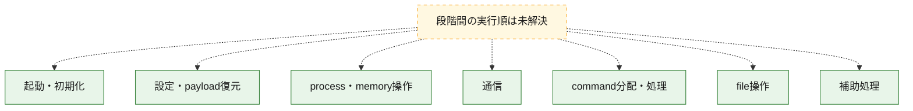
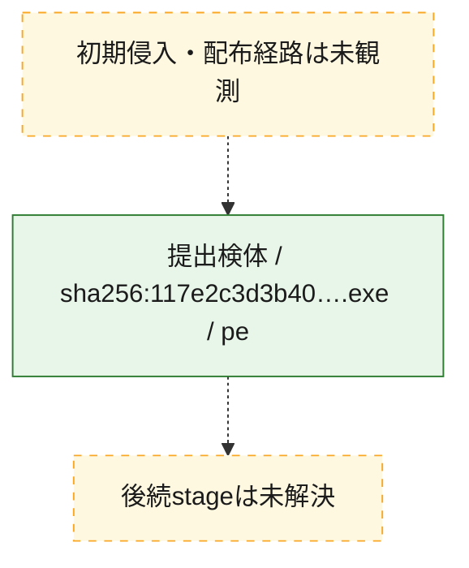
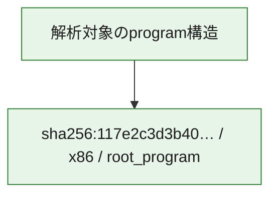

# 全体ロジック：117e2c3d3b40a2b2cbb2001fa0c1109e51cdec777672d5b325e7edecac442fdd

代表関数の静的証跡から、起動・初期化、設定・payload復元、process・memory操作、通信、command分配・処理、file操作の処理群を確認しました。

## 読み方

- phaseの掲載順は解析上の整理順です。observed_call_edgesがない段階間の実行順を断定しません。
- 図の実線は静的に観測した関係、点線と黄色のノードは未観測・未解決の関係を示します。
- 図は静的な要約であり、動的実行を再現するものではありません。
- 詳細な関数解説とfingerprintは[STATIC-LOGIC.md](STATIC-LOGIC.md)を参照してください。

## 静的可視化

### 実行フロー

### 感染チェーン

### モジュール関係

## 処理段階

### 1. 起動・初期化

entry pointから初期化と後続処理への移行を確認します。
確度: `confirmed_static_function_evidence_with_limits`

- `117e2c3d3b40a2b2cbb2001fa0c1109e51cdec777672d5b325e7edecac442fdd:ghidra:004a2a60` — 初期化と主要処理への分岐を行う入口関数です。 状態: `succeeded`、選定理由: `entry_point`, `meaningful_symbol_name`, `probable_go_main_user_code`, `reviewed_call_centrality:4`, `role:entrypoint`
- `117e2c3d3b40a2b2cbb2001fa0c1109e51cdec777672d5b325e7edecac442fdd:ghidra:004a2de0` — 初期化と主要処理への分岐を行う入口関数です。 状態: `succeeded`、選定理由: `entry_point`, `meaningful_symbol_name`, `probable_go_main_user_code`, `reviewed_call_centrality:4`, `role:entrypoint`
- `117e2c3d3b40a2b2cbb2001fa0c1109e51cdec777672d5b325e7edecac442fdd:ghidra:004a2e80` — 初期化と主要処理への分岐を行う入口関数です。 状態: `succeeded`、選定理由: `entry_point`, `meaningful_symbol_name`, `probable_go_main_user_code`, `reviewed_call_centrality:26`, `role:entrypoint`
- `117e2c3d3b40a2b2cbb2001fa0c1109e51cdec777672d5b325e7edecac442fdd:ghidra:004a73a0` — 初期化と主要処理への分岐を行う入口関数です。 状態: `succeeded`、選定理由: `entry_point`, `meaningful_symbol_name`, `probable_go_main_user_code`, `reviewed_call_centrality:24`, `role:entrypoint`
- `117e2c3d3b40a2b2cbb2001fa0c1109e51cdec777672d5b325e7edecac442fdd:ghidra:004a81e0` — 初期化と主要処理への分岐を行う入口関数です。 状態: `succeeded`、選定理由: `entry_point`, `meaningful_symbol_name`, `probable_go_main_user_code`, `reviewed_call_centrality:24`, `role:entrypoint`
- `117e2c3d3b40a2b2cbb2001fa0c1109e51cdec777672d5b325e7edecac442fdd:ghidra:004aab80` — 初期化と主要処理への分岐を行う入口関数です。 状態: `failed`、選定理由: `entry_point`, `meaningful_symbol_name`, `probable_go_main_user_code`, `role:entrypoint`
- `117e2c3d3b40a2b2cbb2001fa0c1109e51cdec777672d5b325e7edecac442fdd:ghidra:004b3580` — 初期化と主要処理への分岐を行う入口関数です。 状態: `succeeded`、選定理由: `entry_point`, `meaningful_symbol_name`, `probable_go_main_user_code`, `reviewed_call_centrality:26`, `role:entrypoint`
- `117e2c3d3b40a2b2cbb2001fa0c1109e51cdec777672d5b325e7edecac442fdd:ghidra:004b43a0` — 初期化と主要処理への分岐を行う入口関数です。 状態: `succeeded`、選定理由: `entry_point`, `meaningful_symbol_name`, `probable_go_main_user_code`, `reviewed_call_centrality:24`, `role:entrypoint`
- `117e2c3d3b40a2b2cbb2001fa0c1109e51cdec777672d5b325e7edecac442fdd:ghidra:004b5160` — 初期化と主要処理への分岐を行う入口関数です。 状態: `succeeded`、選定理由: `entry_point`, `meaningful_symbol_name`, `probable_go_main_user_code`, `reviewed_call_centrality:26`, `role:entrypoint`
- `117e2c3d3b40a2b2cbb2001fa0c1109e51cdec777672d5b325e7edecac442fdd:ghidra:004b6000` — 初期化と主要処理への分岐を行う入口関数です。 状態: `succeeded`、選定理由: `entry_point`, `meaningful_symbol_name`, `probable_go_main_user_code`, `reviewed_call_centrality:24`, `role:entrypoint`
- `117e2c3d3b40a2b2cbb2001fa0c1109e51cdec777672d5b325e7edecac442fdd:ghidra:004b6de0` — 初期化と主要処理への分岐を行う入口関数です。 状態: `failed`、選定理由: `entry_point`, `meaningful_symbol_name`, `probable_go_main_user_code`, `role:entrypoint`
- `117e2c3d3b40a2b2cbb2001fa0c1109e51cdec777672d5b325e7edecac442fdd:ghidra:004beac0` — 初期化と主要処理への分岐を行う入口関数です。 状態: `failed`、選定理由: `entry_point`, `meaningful_symbol_name`, `probable_go_main_user_code`, `role:entrypoint`
- `117e2c3d3b40a2b2cbb2001fa0c1109e51cdec777672d5b325e7edecac442fdd:ghidra:004c73c0` — 初期化と主要処理への分岐を行う入口関数です。 状態: `failed`、選定理由: `entry_point`, `meaningful_symbol_name`, `probable_go_main_user_code`, `role:entrypoint`
- `117e2c3d3b40a2b2cbb2001fa0c1109e51cdec777672d5b325e7edecac442fdd:ghidra:004cef20` — 初期化と主要処理への分岐を行う入口関数です。 状態: `failed`、選定理由: `entry_point`, `meaningful_symbol_name`, `probable_go_main_user_code`, `role:entrypoint`
- `117e2c3d3b40a2b2cbb2001fa0c1109e51cdec777672d5b325e7edecac442fdd:ghidra:004d9600` — 初期化と主要処理への分岐を行う入口関数です。 状態: `failed`、選定理由: `entry_point`, `meaningful_symbol_name`, `probable_go_main_user_code`, `role:entrypoint`
- `117e2c3d3b40a2b2cbb2001fa0c1109e51cdec777672d5b325e7edecac442fdd:ghidra:004e2260` — 初期化と主要処理への分岐を行う入口関数です。 状態: `failed`、選定理由: `entry_point`, `meaningful_symbol_name`, `probable_go_main_user_code`, `role:entrypoint`
- `117e2c3d3b40a2b2cbb2001fa0c1109e51cdec777672d5b325e7edecac442fdd:ghidra:004eb9e0` — 初期化と主要処理への分岐を行う入口関数です。 状態: `succeeded`、選定理由: `entry_point`, `meaningful_symbol_name`, `probable_go_main_user_code`, `reviewed_call_centrality:24`, `role:entrypoint`
- `117e2c3d3b40a2b2cbb2001fa0c1109e51cdec777672d5b325e7edecac442fdd:ghidra:004efe60` — 初期化と主要処理への分岐を行う入口関数です。 状態: `failed`、選定理由: `entry_point`, `meaningful_symbol_name`, `probable_go_main_user_code`, `role:entrypoint`
- `117e2c3d3b40a2b2cbb2001fa0c1109e51cdec777672d5b325e7edecac442fdd:ghidra:004f5fe0` — 初期化と主要処理への分岐を行う入口関数です。 状態: `failed`、選定理由: `entry_point`, `meaningful_symbol_name`, `probable_go_main_user_code`, `role:entrypoint`
- `117e2c3d3b40a2b2cbb2001fa0c1109e51cdec777672d5b325e7edecac442fdd:ghidra:00514d60` — 初期化と主要処理への分岐を行う入口関数です。 状態: `succeeded`、選定理由: `entry_point`, `meaningful_symbol_name`, `probable_go_main_user_code`, `reviewed_call_centrality:25`, `role:entrypoint`
- `117e2c3d3b40a2b2cbb2001fa0c1109e51cdec777672d5b325e7edecac442fdd:ghidra:00518580` — 初期化と主要処理への分岐を行う入口関数です。 状態: `succeeded`、選定理由: `entry_point`, `meaningful_symbol_name`, `probable_go_main_user_code`, `reviewed_call_centrality:25`, `role:entrypoint`
- `117e2c3d3b40a2b2cbb2001fa0c1109e51cdec777672d5b325e7edecac442fdd:ghidra:0051bd60` — 初期化と主要処理への分岐を行う入口関数です。 状態: `failed`、選定理由: `entry_point`, `meaningful_symbol_name`, `probable_go_main_user_code`, `role:entrypoint`
- `117e2c3d3b40a2b2cbb2001fa0c1109e51cdec777672d5b325e7edecac442fdd:ghidra:00526340` — 初期化と主要処理への分岐を行う入口関数です。 状態: `succeeded`、選定理由: `entry_point`, `meaningful_symbol_name`, `probable_go_main_user_code`, `reviewed_call_centrality:26`, `role:entrypoint`
- `117e2c3d3b40a2b2cbb2001fa0c1109e51cdec777672d5b325e7edecac442fdd:ghidra:00529ae0` — 初期化と主要処理への分岐を行う入口関数です。 状態: `failed`、選定理由: `entry_point`, `meaningful_symbol_name`, `probable_go_main_user_code`, `role:entrypoint`

### 2. 設定・payload復元

設定、resource、payload、暗号化データの復元・変換を確認します。
確度: `confirmed_static_function_evidence`

- `117e2c3d3b40a2b2cbb2001fa0c1109e51cdec777672d5b325e7edecac442fdd:ghidra:00474d40` — 設定、resource、payloadなどの解析・変換を行う関数です。 状態: `succeeded`、選定理由: `meaningful_symbol_name`, `reviewed_call_centrality:4`, `role:config_or_data_transform`
- `117e2c3d3b40a2b2cbb2001fa0c1109e51cdec777672d5b325e7edecac442fdd:ghidra:0047be80` — 暗号、hash、encoding、または復号処理に関係する関数です。 状態: `succeeded`、選定理由: `meaningful_symbol_name`, `reviewed_call_centrality:7`, `role:cryptographic_transform`

### 3. process・memory操作

process、thread、module、memory操作と実行移行を確認します。
確度: `confirmed_static_function_evidence`

- `117e2c3d3b40a2b2cbb2001fa0c1109e51cdec777672d5b325e7edecac442fdd:ghidra:00467fe0` — process、thread、module、またはmemory操作に関係する関数です。 状態: `succeeded`、選定理由: `meaningful_symbol_name`, `reviewed_call_centrality:3`, `role:process_or_memory_operation`

### 4. 通信

通信初期化、endpoint処理、送受信の役割を確認します。
確度: `confirmed_static_function_evidence`

- `117e2c3d3b40a2b2cbb2001fa0c1109e51cdec777672d5b325e7edecac442fdd:ghidra:00490a00` — 通信初期化、送受信、またはendpoint処理に関係する関数です。 状態: `succeeded`、選定理由: `meaningful_symbol_name`, `reviewed_call_centrality:6`, `role:network_communication`

### 5. command分配・処理

受信commandやtaskの解釈、分配、個別handlerへの移行を確認します。
確度: `confirmed_static_function_evidence`

- `117e2c3d3b40a2b2cbb2001fa0c1109e51cdec777672d5b325e7edecac442fdd:ghidra:0048fc60` — commandの解釈、分配、または個別処理を担当する関数です。 状態: `succeeded`、選定理由: `meaningful_symbol_name`, `reviewed_call_centrality:5`, `role:command_dispatch_or_handler`

### 6. file操作

fileやdirectoryの作成、読書き、削除を確認します。
確度: `confirmed_static_function_evidence`

- `117e2c3d3b40a2b2cbb2001fa0c1109e51cdec777672d5b325e7edecac442fdd:ghidra:004904c0` — fileまたはdirectoryの読書き・管理に関係する関数です。 状態: `succeeded`、選定理由: `meaningful_symbol_name`, `reviewed_call_centrality:6`, `role:file_operation`

### 7. 補助処理

主要処理を支える一般内部関数またはlibrary処理を確認します。
確度: `confirmed_static_function_evidence`

- `117e2c3d3b40a2b2cbb2001fa0c1109e51cdec777672d5b325e7edecac442fdd:ghidra:00401080` — compiler生成処理または汎用library処理とみられる関数です。 状態: `succeeded`、選定理由: `meaningful_symbol_name`, `reviewed_call_centrality:3`
- `117e2c3d3b40a2b2cbb2001fa0c1109e51cdec777672d5b325e7edecac442fdd:ghidra:004607c0` — 検体内部の一般処理を実装する関数です。 状態: `succeeded`、選定理由: `meaningful_symbol_name`, `reviewed_call_centrality:3`

## 観測したcall関係

- `ghidra-function:01066a2718165bf65f02828a` → `ghidra-external:17861e2e2c34a35ff9849b5f` （`unclassified` → `unclassified`）
- `ghidra-function:01066a2718165bf65f02828a` → `ghidra-external:194d94f6f79aa2b54a468bc9` （`unclassified` → `unclassified`）
- `ghidra-function:01066a2718165bf65f02828a` → `ghidra-external:1fd0af65a5e2a9c0e920766e` （`unclassified` → `unclassified`）
- `ghidra-function:01066a2718165bf65f02828a` → `ghidra-external:33b6f495c1690f194e506501` （`unclassified` → `unclassified`）
- `ghidra-function:01066a2718165bf65f02828a` → `ghidra-external:3c3c571af82b22cfbd5e2c29` （`unclassified` → `unclassified`）
- `ghidra-function:01066a2718165bf65f02828a` → `ghidra-external:3ecf28f0c4490c6afcdf1e49` （`unclassified` → `unclassified`）
- `ghidra-function:01066a2718165bf65f02828a` → `ghidra-external:4ea27307d56c3f71b4814ffb` （`unclassified` → `unclassified`）
- `ghidra-function:01066a2718165bf65f02828a` → `ghidra-external:59fb3dd8ad46641574660ed0` （`unclassified` → `unclassified`）
- `ghidra-function:01066a2718165bf65f02828a` → `ghidra-external:77dc2796e142df79c30ff3b6` （`unclassified` → `unclassified`）
- `ghidra-function:01066a2718165bf65f02828a` → `ghidra-external:7832e352d123e69190627430` （`unclassified` → `unclassified`）
- `ghidra-function:01066a2718165bf65f02828a` → `ghidra-external:8f671242a7f17d9b0865b739` （`unclassified` → `unclassified`）
- `ghidra-function:01066a2718165bf65f02828a` → `ghidra-external:a85c60a05025e2604d11ccd3` （`unclassified` → `unclassified`）
- `ghidra-function:01066a2718165bf65f02828a` → `ghidra-external:aa59b189d10c9a319695ce29` （`unclassified` → `unclassified`）
- `ghidra-function:01066a2718165bf65f02828a` → `ghidra-external:b20c3edce7e6031fbba39d5b` （`unclassified` → `unclassified`）
- `ghidra-function:01066a2718165bf65f02828a` → `ghidra-external:b3601a91f3188efe87d7c44f` （`unclassified` → `unclassified`）
- `ghidra-function:01066a2718165bf65f02828a` → `ghidra-external:c2ef419166341d81f4c20abb` （`unclassified` → `unclassified`）
- `ghidra-function:01066a2718165bf65f02828a` → `ghidra-external:c619258bdbdca74920f6e072` （`unclassified` → `unclassified`）
- `ghidra-function:01066a2718165bf65f02828a` → `ghidra-external:cef826c13dddb661996a9bbd` （`unclassified` → `unclassified`）
- `ghidra-function:01066a2718165bf65f02828a` → `ghidra-external:e5ae48b16ae3ee3087045294` （`unclassified` → `unclassified`）
- `ghidra-function:01066a2718165bf65f02828a` → `ghidra-external:e7a2273b0e0768b3f8749990` （`unclassified` → `unclassified`）
- `ghidra-function:01066a2718165bf65f02828a` → `ghidra-external:e90b84913862a0d17d69b297` （`unclassified` → `unclassified`）
- `ghidra-function:01066a2718165bf65f02828a` → `ghidra-external:ecdc9022c62b0655b42f2544` （`unclassified` → `unclassified`）
- `ghidra-function:01066a2718165bf65f02828a` → `ghidra-external:f042c0993d83d948b0ce3b73` （`unclassified` → `unclassified`）
- `ghidra-function:01066a2718165bf65f02828a` → `ghidra-external:fe829618093ead36c3134c08` （`unclassified` → `unclassified`）
- `ghidra-function:057c7d64668ad6b6e9c22deb` → `ghidra-external:17861e2e2c34a35ff9849b5f` （`unclassified` → `unclassified`）
- `ghidra-function:057c7d64668ad6b6e9c22deb` → `ghidra-external:194d94f6f79aa2b54a468bc9` （`unclassified` → `unclassified`）
- `ghidra-function:057c7d64668ad6b6e9c22deb` → `ghidra-external:1fd0af65a5e2a9c0e920766e` （`unclassified` → `unclassified`）
- `ghidra-function:057c7d64668ad6b6e9c22deb` → `ghidra-external:33b6f495c1690f194e506501` （`unclassified` → `unclassified`）
- `ghidra-function:057c7d64668ad6b6e9c22deb` → `ghidra-external:3c3c571af82b22cfbd5e2c29` （`unclassified` → `unclassified`）
- `ghidra-function:057c7d64668ad6b6e9c22deb` → `ghidra-external:3ecf28f0c4490c6afcdf1e49` （`unclassified` → `unclassified`）
- `ghidra-function:057c7d64668ad6b6e9c22deb` → `ghidra-external:466f61711c57bc25ece9f44b` （`unclassified` → `unclassified`）
- `ghidra-function:057c7d64668ad6b6e9c22deb` → `ghidra-external:4ea27307d56c3f71b4814ffb` （`unclassified` → `unclassified`）
- `ghidra-function:057c7d64668ad6b6e9c22deb` → `ghidra-external:59fb3dd8ad46641574660ed0` （`unclassified` → `unclassified`）
- `ghidra-function:057c7d64668ad6b6e9c22deb` → `ghidra-external:77dc2796e142df79c30ff3b6` （`unclassified` → `unclassified`）
- `ghidra-function:057c7d64668ad6b6e9c22deb` → `ghidra-external:7832e352d123e69190627430` （`unclassified` → `unclassified`）
- `ghidra-function:057c7d64668ad6b6e9c22deb` → `ghidra-external:8f671242a7f17d9b0865b739` （`unclassified` → `unclassified`）
- `ghidra-function:057c7d64668ad6b6e9c22deb` → `ghidra-external:a85c60a05025e2604d11ccd3` （`unclassified` → `unclassified`）
- `ghidra-function:057c7d64668ad6b6e9c22deb` → `ghidra-external:aa59b189d10c9a319695ce29` （`unclassified` → `unclassified`）
- `ghidra-function:057c7d64668ad6b6e9c22deb` → `ghidra-external:b20c3edce7e6031fbba39d5b` （`unclassified` → `unclassified`）
- `ghidra-function:057c7d64668ad6b6e9c22deb` → `ghidra-external:c2ef419166341d81f4c20abb` （`unclassified` → `unclassified`）
- `ghidra-function:057c7d64668ad6b6e9c22deb` → `ghidra-external:c33b3cd8a64b1beda66333db` （`unclassified` → `unclassified`）
- `ghidra-function:057c7d64668ad6b6e9c22deb` → `ghidra-external:c619258bdbdca74920f6e072` （`unclassified` → `unclassified`）
- `ghidra-function:057c7d64668ad6b6e9c22deb` → `ghidra-external:cef826c13dddb661996a9bbd` （`unclassified` → `unclassified`）
- `ghidra-function:057c7d64668ad6b6e9c22deb` → `ghidra-external:dd61ae39267802d11814f063` （`unclassified` → `unclassified`）
- `ghidra-function:057c7d64668ad6b6e9c22deb` → `ghidra-external:e5ae48b16ae3ee3087045294` （`unclassified` → `unclassified`）
- `ghidra-function:057c7d64668ad6b6e9c22deb` → `ghidra-external:e7a2273b0e0768b3f8749990` （`unclassified` → `unclassified`）
- `ghidra-function:057c7d64668ad6b6e9c22deb` → `ghidra-external:e90b84913862a0d17d69b297` （`unclassified` → `unclassified`）
- `ghidra-function:057c7d64668ad6b6e9c22deb` → `ghidra-external:ecdc9022c62b0655b42f2544` （`unclassified` → `unclassified`）
- `ghidra-function:057c7d64668ad6b6e9c22deb` → `ghidra-external:f042c0993d83d948b0ce3b73` （`unclassified` → `unclassified`）
- `ghidra-function:057c7d64668ad6b6e9c22deb` → `ghidra-external:fe829618093ead36c3134c08` （`unclassified` → `unclassified`）
- `ghidra-function:1c03623ec2c903bb65ba3130` → `ghidra-external:17861e2e2c34a35ff9849b5f` （`unclassified` → `unclassified`）
- `ghidra-function:1c03623ec2c903bb65ba3130` → `ghidra-external:194d94f6f79aa2b54a468bc9` （`unclassified` → `unclassified`）
- `ghidra-function:1c03623ec2c903bb65ba3130` → `ghidra-external:1fd0af65a5e2a9c0e920766e` （`unclassified` → `unclassified`）
- `ghidra-function:1c03623ec2c903bb65ba3130` → `ghidra-external:33b6f495c1690f194e506501` （`unclassified` → `unclassified`）
- `ghidra-function:1c03623ec2c903bb65ba3130` → `ghidra-external:3c3c571af82b22cfbd5e2c29` （`unclassified` → `unclassified`）
- `ghidra-function:1c03623ec2c903bb65ba3130` → `ghidra-external:3ecf28f0c4490c6afcdf1e49` （`unclassified` → `unclassified`）
- `ghidra-function:1c03623ec2c903bb65ba3130` → `ghidra-external:4ea27307d56c3f71b4814ffb` （`unclassified` → `unclassified`）
- `ghidra-function:1c03623ec2c903bb65ba3130` → `ghidra-external:59fb3dd8ad46641574660ed0` （`unclassified` → `unclassified`）
- `ghidra-function:1c03623ec2c903bb65ba3130` → `ghidra-external:77dc2796e142df79c30ff3b6` （`unclassified` → `unclassified`）
- `ghidra-function:1c03623ec2c903bb65ba3130` → `ghidra-external:7832e352d123e69190627430` （`unclassified` → `unclassified`）
- `ghidra-function:1c03623ec2c903bb65ba3130` → `ghidra-external:8f671242a7f17d9b0865b739` （`unclassified` → `unclassified`）
- `ghidra-function:1c03623ec2c903bb65ba3130` → `ghidra-external:a85c60a05025e2604d11ccd3` （`unclassified` → `unclassified`）
- `ghidra-function:1c03623ec2c903bb65ba3130` → `ghidra-external:aa59b189d10c9a319695ce29` （`unclassified` → `unclassified`）
- `ghidra-function:1c03623ec2c903bb65ba3130` → `ghidra-external:b20c3edce7e6031fbba39d5b` （`unclassified` → `unclassified`）
- `ghidra-function:1c03623ec2c903bb65ba3130` → `ghidra-external:c2ef419166341d81f4c20abb` （`unclassified` → `unclassified`）
- `ghidra-function:1c03623ec2c903bb65ba3130` → `ghidra-external:c619258bdbdca74920f6e072` （`unclassified` → `unclassified`）
- `ghidra-function:1c03623ec2c903bb65ba3130` → `ghidra-external:cef826c13dddb661996a9bbd` （`unclassified` → `unclassified`）
- `ghidra-function:1c03623ec2c903bb65ba3130` → `ghidra-external:d64f64aeed5defa336c534b1` （`unclassified` → `unclassified`）
- `ghidra-function:1c03623ec2c903bb65ba3130` → `ghidra-external:e5ae48b16ae3ee3087045294` （`unclassified` → `unclassified`）
- `ghidra-function:1c03623ec2c903bb65ba3130` → `ghidra-external:e7a2273b0e0768b3f8749990` （`unclassified` → `unclassified`）
- `ghidra-function:1c03623ec2c903bb65ba3130` → `ghidra-external:e90b84913862a0d17d69b297` （`unclassified` → `unclassified`）
- `ghidra-function:1c03623ec2c903bb65ba3130` → `ghidra-external:ecdc9022c62b0655b42f2544` （`unclassified` → `unclassified`）
- `ghidra-function:1c03623ec2c903bb65ba3130` → `ghidra-external:f042c0993d83d948b0ce3b73` （`unclassified` → `unclassified`）
- `ghidra-function:1c03623ec2c903bb65ba3130` → `ghidra-external:fe829618093ead36c3134c08` （`unclassified` → `unclassified`）
- `ghidra-function:333485abd9f6238a326a1080` → `ghidra-external:17861e2e2c34a35ff9849b5f` （`unclassified` → `unclassified`）
- `ghidra-function:333485abd9f6238a326a1080` → `ghidra-external:194d94f6f79aa2b54a468bc9` （`unclassified` → `unclassified`）
- `ghidra-function:333485abd9f6238a326a1080` → `ghidra-external:1fd0af65a5e2a9c0e920766e` （`unclassified` → `unclassified`）
- `ghidra-function:333485abd9f6238a326a1080` → `ghidra-external:33b6f495c1690f194e506501` （`unclassified` → `unclassified`）
- `ghidra-function:333485abd9f6238a326a1080` → `ghidra-external:3c3c571af82b22cfbd5e2c29` （`unclassified` → `unclassified`）
- `ghidra-function:333485abd9f6238a326a1080` → `ghidra-external:3ecf28f0c4490c6afcdf1e49` （`unclassified` → `unclassified`）
- `ghidra-function:333485abd9f6238a326a1080` → `ghidra-external:4ea27307d56c3f71b4814ffb` （`unclassified` → `unclassified`）
- `ghidra-function:333485abd9f6238a326a1080` → `ghidra-external:59fb3dd8ad46641574660ed0` （`unclassified` → `unclassified`）
- `ghidra-function:333485abd9f6238a326a1080` → `ghidra-external:71310f53795a095e6c9fdab5` （`unclassified` → `unclassified`）
- `ghidra-function:333485abd9f6238a326a1080` → `ghidra-external:77dc2796e142df79c30ff3b6` （`unclassified` → `unclassified`）
- `ghidra-function:333485abd9f6238a326a1080` → `ghidra-external:7832e352d123e69190627430` （`unclassified` → `unclassified`）
- `ghidra-function:333485abd9f6238a326a1080` → `ghidra-external:8f671242a7f17d9b0865b739` （`unclassified` → `unclassified`）
- `ghidra-function:333485abd9f6238a326a1080` → `ghidra-external:a85c60a05025e2604d11ccd3` （`unclassified` → `unclassified`）
- `ghidra-function:333485abd9f6238a326a1080` → `ghidra-external:aa59b189d10c9a319695ce29` （`unclassified` → `unclassified`）
- `ghidra-function:333485abd9f6238a326a1080` → `ghidra-external:b20c3edce7e6031fbba39d5b` （`unclassified` → `unclassified`）
- `ghidra-function:333485abd9f6238a326a1080` → `ghidra-external:c2ef419166341d81f4c20abb` （`unclassified` → `unclassified`）
- `ghidra-function:333485abd9f6238a326a1080` → `ghidra-external:c619258bdbdca74920f6e072` （`unclassified` → `unclassified`）
- `ghidra-function:333485abd9f6238a326a1080` → `ghidra-external:cef826c13dddb661996a9bbd` （`unclassified` → `unclassified`）
- `ghidra-function:333485abd9f6238a326a1080` → `ghidra-external:d64f64aeed5defa336c534b1` （`unclassified` → `unclassified`）
- `ghidra-function:333485abd9f6238a326a1080` → `ghidra-external:e5ae48b16ae3ee3087045294` （`unclassified` → `unclassified`）
- `ghidra-function:333485abd9f6238a326a1080` → `ghidra-external:e7a2273b0e0768b3f8749990` （`unclassified` → `unclassified`）
- `ghidra-function:333485abd9f6238a326a1080` → `ghidra-external:e90b84913862a0d17d69b297` （`unclassified` → `unclassified`）
- `ghidra-function:333485abd9f6238a326a1080` → `ghidra-external:ecdc9022c62b0655b42f2544` （`unclassified` → `unclassified`）
- `ghidra-function:333485abd9f6238a326a1080` → `ghidra-external:f042c0993d83d948b0ce3b73` （`unclassified` → `unclassified`）
- `ghidra-function:333485abd9f6238a326a1080` → `ghidra-external:fe829618093ead36c3134c08` （`unclassified` → `unclassified`）
- `ghidra-function:3bf5871061ef0a7cb8b3b8ce` → `ghidra-external:17861e2e2c34a35ff9849b5f` （`unclassified` → `unclassified`）
- `ghidra-function:3bf5871061ef0a7cb8b3b8ce` → `ghidra-external:194d94f6f79aa2b54a468bc9` （`unclassified` → `unclassified`）
- `ghidra-function:3bf5871061ef0a7cb8b3b8ce` → `ghidra-external:1fd0af65a5e2a9c0e920766e` （`unclassified` → `unclassified`）
- `ghidra-function:3bf5871061ef0a7cb8b3b8ce` → `ghidra-external:25952668e1e40719c62f5fa7` （`unclassified` → `unclassified`）
- `ghidra-function:3bf5871061ef0a7cb8b3b8ce` → `ghidra-external:29c1c5ccbd17a801a728fdc7` （`unclassified` → `unclassified`）
- `ghidra-function:3bf5871061ef0a7cb8b3b8ce` → `ghidra-external:33b6f495c1690f194e506501` （`unclassified` → `unclassified`）
- `ghidra-function:3bf5871061ef0a7cb8b3b8ce` → `ghidra-external:3c3c571af82b22cfbd5e2c29` （`unclassified` → `unclassified`）
- `ghidra-function:3bf5871061ef0a7cb8b3b8ce` → `ghidra-external:3ecf28f0c4490c6afcdf1e49` （`unclassified` → `unclassified`）
- `ghidra-function:3bf5871061ef0a7cb8b3b8ce` → `ghidra-external:4ea27307d56c3f71b4814ffb` （`unclassified` → `unclassified`）
- `ghidra-function:3bf5871061ef0a7cb8b3b8ce` → `ghidra-external:59fb3dd8ad46641574660ed0` （`unclassified` → `unclassified`）
- `ghidra-function:3bf5871061ef0a7cb8b3b8ce` → `ghidra-external:63c9d77796d43fa90055f30a` （`unclassified` → `unclassified`）
- `ghidra-function:3bf5871061ef0a7cb8b3b8ce` → `ghidra-external:77dc2796e142df79c30ff3b6` （`unclassified` → `unclassified`）
- `ghidra-function:3bf5871061ef0a7cb8b3b8ce` → `ghidra-external:7832e352d123e69190627430` （`unclassified` → `unclassified`）
- `ghidra-function:3bf5871061ef0a7cb8b3b8ce` → `ghidra-external:8f671242a7f17d9b0865b739` （`unclassified` → `unclassified`）
- `ghidra-function:3bf5871061ef0a7cb8b3b8ce` → `ghidra-external:a85c60a05025e2604d11ccd3` （`unclassified` → `unclassified`）
- `ghidra-function:3bf5871061ef0a7cb8b3b8ce` → `ghidra-external:aa59b189d10c9a319695ce29` （`unclassified` → `unclassified`）
- `ghidra-function:3bf5871061ef0a7cb8b3b8ce` → `ghidra-external:b20c3edce7e6031fbba39d5b` （`unclassified` → `unclassified`）
- `ghidra-function:3bf5871061ef0a7cb8b3b8ce` → `ghidra-external:c2ef419166341d81f4c20abb` （`unclassified` → `unclassified`）
- `ghidra-function:3bf5871061ef0a7cb8b3b8ce` → `ghidra-external:c619258bdbdca74920f6e072` （`unclassified` → `unclassified`）
- `ghidra-function:3bf5871061ef0a7cb8b3b8ce` → `ghidra-external:cef826c13dddb661996a9bbd` （`unclassified` → `unclassified`）
- `ghidra-function:3bf5871061ef0a7cb8b3b8ce` → `ghidra-external:e5ae48b16ae3ee3087045294` （`unclassified` → `unclassified`）
- `ghidra-function:3bf5871061ef0a7cb8b3b8ce` → `ghidra-external:e7a2273b0e0768b3f8749990` （`unclassified` → `unclassified`）
- `ghidra-function:3bf5871061ef0a7cb8b3b8ce` → `ghidra-external:e90b84913862a0d17d69b297` （`unclassified` → `unclassified`）
- `ghidra-function:3bf5871061ef0a7cb8b3b8ce` → `ghidra-external:ecdc9022c62b0655b42f2544` （`unclassified` → `unclassified`）
- `ghidra-function:3bf5871061ef0a7cb8b3b8ce` → `ghidra-external:f042c0993d83d948b0ce3b73` （`unclassified` → `unclassified`）
- `ghidra-function:3bf5871061ef0a7cb8b3b8ce` → `ghidra-external:fe829618093ead36c3134c08` （`unclassified` → `unclassified`）
- `ghidra-function:525c8e2f6b3c2f3eb0fff553` → `ghidra-external:36019f27500c24f27cd1b99c` （`unclassified` → `unclassified`）
- `ghidra-function:525c8e2f6b3c2f3eb0fff553` → `ghidra-external:3a814f351c53ccf5e252409a` （`unclassified` → `unclassified`）
- `ghidra-function:525c8e2f6b3c2f3eb0fff553` → `ghidra-external:98d996006e65d41a7622b204` （`unclassified` → `unclassified`）
- `ghidra-function:525c8e2f6b3c2f3eb0fff553` → `ghidra-external:a4e73c8b91c1afd10c391db2` （`unclassified` → `unclassified`）
- `ghidra-function:525c8e2f6b3c2f3eb0fff553` → `ghidra-external:d852824c5d6add392611b056` （`unclassified` → `unclassified`）
- `ghidra-function:525c8e2f6b3c2f3eb0fff553` → `ghidra-external:e7a2273b0e0768b3f8749990` （`unclassified` → `unclassified`）
- `ghidra-function:525c8e2f6b3c2f3eb0fff553` → `ghidra-external:ee694d91b640f37cd5693568` （`unclassified` → `unclassified`）
- `ghidra-function:53d0b0b17e1f33a1b6120314` → `ghidra-external:93800d5760d1b3136bdf260f` （`unclassified` → `unclassified`）
- `ghidra-function:53d0b0b17e1f33a1b6120314` → `ghidra-external:b20c3edce7e6031fbba39d5b` （`unclassified` → `unclassified`）
- `ghidra-function:53d0b0b17e1f33a1b6120314` → `ghidra-external:e19d07edac792b0c2b07286b` （`unclassified` → `unclassified`）
- `ghidra-function:543440cb3b48894b8122df97` → `ghidra-external:194d94f6f79aa2b54a468bc9` （`unclassified` → `unclassified`）
- `ghidra-function:543440cb3b48894b8122df97` → `ghidra-external:243d3f9ac8b49a6a2040f3a2` （`unclassified` → `unclassified`）
- `ghidra-function:543440cb3b48894b8122df97` → `ghidra-external:90b754c2cc2ed8d2dd563cf5` （`unclassified` → `unclassified`）
- `ghidra-function:543440cb3b48894b8122df97` → `ghidra-external:e7a2273b0e0768b3f8749990` （`unclassified` → `unclassified`）
- `ghidra-function:649c00ea66671fca471c7e63` → `ghidra-external:224214f57ef03e90918baaf0` （`unclassified` → `unclassified`）
- `ghidra-function:649c00ea66671fca471c7e63` → `ghidra-external:bbf60d0f31b0edb793f9ac06` （`unclassified` → `unclassified`）
- `ghidra-function:649c00ea66671fca471c7e63` → `ghidra-external:e7a2273b0e0768b3f8749990` （`unclassified` → `unclassified`）
- `ghidra-function:723bf6a63bc4b93a033eb56d` → `ghidra-external:69b121c60894555ce1a5a71d` （`unclassified` → `unclassified`）
- `ghidra-function:723bf6a63bc4b93a033eb56d` → `ghidra-external:a2f23abe2ef865d3d0eb829f` （`unclassified` → `unclassified`）
- `ghidra-function:723bf6a63bc4b93a033eb56d` → `ghidra-external:ad37e3de3361c159e28c827d` （`unclassified` → `unclassified`）
- `ghidra-function:77a9f575396773997ee9e15d` → `ghidra-external:296bafd0fc8eb579f2c7f22b` （`unclassified` → `unclassified`）
- `ghidra-function:77a9f575396773997ee9e15d` → `ghidra-external:66483f5a3e9105337e17bd12` （`unclassified` → `unclassified`）
- `ghidra-function:77a9f575396773997ee9e15d` → `ghidra-external:c4bd35fd1ec79f02da9bddbe` （`unclassified` → `unclassified`）
- `ghidra-function:77a9f575396773997ee9e15d` → `ghidra-external:c82bfb7de2f4923fba99f410` （`unclassified` → `unclassified`）
- `ghidra-function:77a9f575396773997ee9e15d` → `ghidra-external:e7a2273b0e0768b3f8749990` （`unclassified` → `unclassified`）
- `ghidra-function:7dc499c83e3cc44cee7eb86c` → `ghidra-external:17861e2e2c34a35ff9849b5f` （`unclassified` → `unclassified`）
- `ghidra-function:7dc499c83e3cc44cee7eb86c` → `ghidra-external:194d94f6f79aa2b54a468bc9` （`unclassified` → `unclassified`）
- `ghidra-function:7dc499c83e3cc44cee7eb86c` → `ghidra-external:1fd0af65a5e2a9c0e920766e` （`unclassified` → `unclassified`）
- `ghidra-function:7dc499c83e3cc44cee7eb86c` → `ghidra-external:241c343888f5e12bcb2e20f9` （`unclassified` → `unclassified`）
- `ghidra-function:7dc499c83e3cc44cee7eb86c` → `ghidra-external:2967bf0492425a8da1337706` （`unclassified` → `unclassified`）
- `ghidra-function:7dc499c83e3cc44cee7eb86c` → `ghidra-external:33b6f495c1690f194e506501` （`unclassified` → `unclassified`）
- `ghidra-function:7dc499c83e3cc44cee7eb86c` → `ghidra-external:3c3c571af82b22cfbd5e2c29` （`unclassified` → `unclassified`）
- `ghidra-function:7dc499c83e3cc44cee7eb86c` → `ghidra-external:3ecf28f0c4490c6afcdf1e49` （`unclassified` → `unclassified`）
- `ghidra-function:7dc499c83e3cc44cee7eb86c` → `ghidra-external:4ea27307d56c3f71b4814ffb` （`unclassified` → `unclassified`）
- `ghidra-function:7dc499c83e3cc44cee7eb86c` → `ghidra-external:59fb3dd8ad46641574660ed0` （`unclassified` → `unclassified`）
- `ghidra-function:7dc499c83e3cc44cee7eb86c` → `ghidra-external:77dc2796e142df79c30ff3b6` （`unclassified` → `unclassified`）
- `ghidra-function:7dc499c83e3cc44cee7eb86c` → `ghidra-external:7832e352d123e69190627430` （`unclassified` → `unclassified`）
- `ghidra-function:7dc499c83e3cc44cee7eb86c` → `ghidra-external:8f671242a7f17d9b0865b739` （`unclassified` → `unclassified`）
- `ghidra-function:7dc499c83e3cc44cee7eb86c` → `ghidra-external:a85c60a05025e2604d11ccd3` （`unclassified` → `unclassified`）
- `ghidra-function:7dc499c83e3cc44cee7eb86c` → `ghidra-external:aa59b189d10c9a319695ce29` （`unclassified` → `unclassified`）
- `ghidra-function:7dc499c83e3cc44cee7eb86c` → `ghidra-external:b20c3edce7e6031fbba39d5b` （`unclassified` → `unclassified`）
- `ghidra-function:7dc499c83e3cc44cee7eb86c` → `ghidra-external:c2ef419166341d81f4c20abb` （`unclassified` → `unclassified`）
- `ghidra-function:7dc499c83e3cc44cee7eb86c` → `ghidra-external:c619258bdbdca74920f6e072` （`unclassified` → `unclassified`）
- `ghidra-function:7dc499c83e3cc44cee7eb86c` → `ghidra-external:cef826c13dddb661996a9bbd` （`unclassified` → `unclassified`）
- `ghidra-function:7dc499c83e3cc44cee7eb86c` → `ghidra-external:e5ae48b16ae3ee3087045294` （`unclassified` → `unclassified`）
- `ghidra-function:7dc499c83e3cc44cee7eb86c` → `ghidra-external:e7a2273b0e0768b3f8749990` （`unclassified` → `unclassified`）
- `ghidra-function:7dc499c83e3cc44cee7eb86c` → `ghidra-external:e90b84913862a0d17d69b297` （`unclassified` → `unclassified`）
- `ghidra-function:7dc499c83e3cc44cee7eb86c` → `ghidra-external:ecdc9022c62b0655b42f2544` （`unclassified` → `unclassified`）
- `ghidra-function:7dc499c83e3cc44cee7eb86c` → `ghidra-external:f042c0993d83d948b0ce3b73` （`unclassified` → `unclassified`）
- `ghidra-function:7dc499c83e3cc44cee7eb86c` → `ghidra-external:fe829618093ead36c3134c08` （`unclassified` → `unclassified`）
- `ghidra-function:7dc499c83e3cc44cee7eb86c` → `ghidra-external:ffbd189899372aeb605bfd28` （`unclassified` → `unclassified`）
- `ghidra-function:8343860a3c6ff679a27875be` → `ghidra-external:296bafd0fc8eb579f2c7f22b` （`unclassified` → `unclassified`）
- `ghidra-function:8343860a3c6ff679a27875be` → `ghidra-external:66483f5a3e9105337e17bd12` （`unclassified` → `unclassified`）
- `ghidra-function:8343860a3c6ff679a27875be` → `ghidra-external:a9066bf2ceb0417cca016686` （`unclassified` → `unclassified`）
- `ghidra-function:8343860a3c6ff679a27875be` → `ghidra-external:c4bd35fd1ec79f02da9bddbe` （`unclassified` → `unclassified`）
- `ghidra-function:8343860a3c6ff679a27875be` → `ghidra-external:dd61ae39267802d11814f063` （`unclassified` → `unclassified`）
- `ghidra-function:8343860a3c6ff679a27875be` → `ghidra-external:e7a2273b0e0768b3f8749990` （`unclassified` → `unclassified`）
- `ghidra-function:8bbff92b24e026caffea352d` → `ghidra-external:05296f917bc62537b5e39784` （`unclassified` → `unclassified`）
- `ghidra-function:8bbff92b24e026caffea352d` → `ghidra-external:296bafd0fc8eb579f2c7f22b` （`unclassified` → `unclassified`）
- `ghidra-function:8bbff92b24e026caffea352d` → `ghidra-external:2f2319ca8fadf64f7c1a3af5` （`unclassified` → `unclassified`）
- `ghidra-function:8bbff92b24e026caffea352d` → `ghidra-external:c4bd35fd1ec79f02da9bddbe` （`unclassified` → `unclassified`）
- `ghidra-function:8bbff92b24e026caffea352d` → `ghidra-external:dd61ae39267802d11814f063` （`unclassified` → `unclassified`）
- `ghidra-function:8bbff92b24e026caffea352d` → `ghidra-external:e7a2273b0e0768b3f8749990` （`unclassified` → `unclassified`）
- `ghidra-function:8d30c53bdedf181850cd3b62` → `ghidra-external:17861e2e2c34a35ff9849b5f` （`unclassified` → `unclassified`）
- `ghidra-function:8d30c53bdedf181850cd3b62` → `ghidra-external:194d94f6f79aa2b54a468bc9` （`unclassified` → `unclassified`）
- `ghidra-function:8d30c53bdedf181850cd3b62` → `ghidra-external:1fd0af65a5e2a9c0e920766e` （`unclassified` → `unclassified`）
- `ghidra-function:8d30c53bdedf181850cd3b62` → `ghidra-external:33b6f495c1690f194e506501` （`unclassified` → `unclassified`）
- `ghidra-function:8d30c53bdedf181850cd3b62` → `ghidra-external:3c3c571af82b22cfbd5e2c29` （`unclassified` → `unclassified`）
- `ghidra-function:8d30c53bdedf181850cd3b62` → `ghidra-external:3ecf28f0c4490c6afcdf1e49` （`unclassified` → `unclassified`）
- `ghidra-function:8d30c53bdedf181850cd3b62` → `ghidra-external:4ea27307d56c3f71b4814ffb` （`unclassified` → `unclassified`）
- `ghidra-function:8d30c53bdedf181850cd3b62` → `ghidra-external:59fb3dd8ad46641574660ed0` （`unclassified` → `unclassified`）
- `ghidra-function:8d30c53bdedf181850cd3b62` → `ghidra-external:77dc2796e142df79c30ff3b6` （`unclassified` → `unclassified`）
- `ghidra-function:8d30c53bdedf181850cd3b62` → `ghidra-external:7832e352d123e69190627430` （`unclassified` → `unclassified`）
- `ghidra-function:8d30c53bdedf181850cd3b62` → `ghidra-external:8f671242a7f17d9b0865b739` （`unclassified` → `unclassified`）
- `ghidra-function:8d30c53bdedf181850cd3b62` → `ghidra-external:a85c60a05025e2604d11ccd3` （`unclassified` → `unclassified`）
- 残り119件は`static-logic.json`に記録しています。

## 解析範囲と制約

- 選定外関数は全体inventoryへ残しますが、関数本体の個別解説対象にはしていません。
- indirect call、難読化、packer、VM、壊れたcontrol flowによりcall関係が欠落する場合があります。
- 文書は静的解析に基づき、検体実行や外部通信による動的確認は行っていません。
