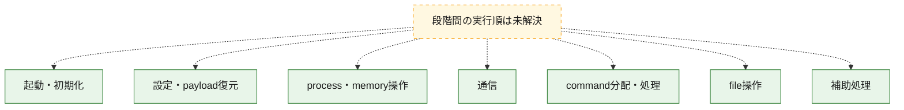
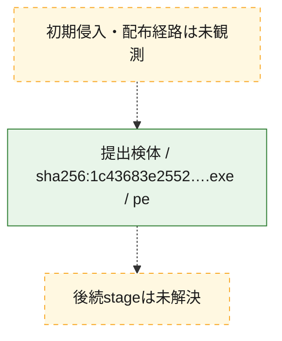
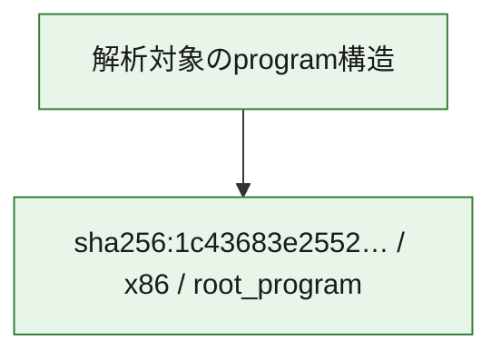

# 全体ロジック：1c43683e2552210952c790756de1a32178b6e810bf9363f79b1d6386b0d944be

代表関数の静的証跡から、起動・初期化、設定・payload復元、process・memory操作、通信、command分配・処理、file操作の処理群を確認しました。

## 読み方

- phaseの掲載順は解析上の整理順です。observed_call_edgesがない段階間の実行順を断定しません。
- 図の実線は静的に観測した関係、点線と黄色のノードは未観測・未解決の関係を示します。
- 図は静的な要約であり、動的実行を再現するものではありません。
- 詳細な関数解説とfingerprintは[STATIC-LOGIC.md](STATIC-LOGIC.md)を参照してください。

## 静的可視化

### 実行フロー

### 感染チェーン

### モジュール関係

## 処理段階

### 1. 起動・初期化

entry pointから初期化と後続処理への移行を確認します。
確度: `confirmed_static_function_evidence`

- `1c43683e2552210952c790756de1a32178b6e810bf9363f79b1d6386b0d944be:ghidra:1400afa60` — 初期化と主要処理への分岐を行う入口関数です。 状態: `succeeded`、選定理由: `entry_point`, `meaningful_symbol_name`, `probable_go_main_user_code`, `reviewed_call_centrality:5`, `role:entrypoint`
- `1c43683e2552210952c790756de1a32178b6e810bf9363f79b1d6386b0d944be:ghidra:1400afc20` — 初期化と主要処理への分岐を行う入口関数です。 状態: `succeeded`、選定理由: `entry_point`, `meaningful_symbol_name`, `probable_go_main_user_code`, `reviewed_call_centrality:24`, `role:entrypoint`
- `1c43683e2552210952c790756de1a32178b6e810bf9363f79b1d6386b0d944be:ghidra:1400b3a80` — 初期化と主要処理への分岐を行う入口関数です。 状態: `succeeded`、選定理由: `entry_point`, `meaningful_symbol_name`, `probable_go_main_user_code`, `reviewed_call_centrality:23`, `role:entrypoint`
- `1c43683e2552210952c790756de1a32178b6e810bf9363f79b1d6386b0d944be:ghidra:1400b9220` — 初期化と主要処理への分岐を行う入口関数です。 状態: `succeeded`、選定理由: `entry_point`, `meaningful_symbol_name`, `probable_go_main_user_code`, `reviewed_call_centrality:22`, `role:entrypoint`
- `1c43683e2552210952c790756de1a32178b6e810bf9363f79b1d6386b0d944be:ghidra:1400bb820` — 初期化と主要処理への分岐を行う入口関数です。 状態: `succeeded`、選定理由: `entry_point`, `meaningful_symbol_name`, `probable_go_main_user_code`, `reviewed_call_centrality:23`, `role:entrypoint`
- `1c43683e2552210952c790756de1a32178b6e810bf9363f79b1d6386b0d944be:ghidra:1400c0320` — 初期化と主要処理への分岐を行う入口関数です。 状態: `succeeded`、選定理由: `entry_point`, `meaningful_symbol_name`, `probable_go_main_user_code`, `reviewed_call_centrality:19`, `role:entrypoint`
- `1c43683e2552210952c790756de1a32178b6e810bf9363f79b1d6386b0d944be:ghidra:1400c66e0` — 初期化と主要処理への分岐を行う入口関数です。 状態: `succeeded`、選定理由: `entry_point`, `meaningful_symbol_name`, `probable_go_main_user_code`, `reviewed_call_centrality:21`, `role:entrypoint`
- `1c43683e2552210952c790756de1a32178b6e810bf9363f79b1d6386b0d944be:ghidra:1400c73c0` — 初期化と主要処理への分岐を行う入口関数です。 状態: `succeeded`、選定理由: `entry_point`, `meaningful_symbol_name`, `probable_go_main_user_code`, `reviewed_call_centrality:22`, `role:entrypoint`
- `1c43683e2552210952c790756de1a32178b6e810bf9363f79b1d6386b0d944be:ghidra:1400c8080` — 初期化と主要処理への分岐を行う入口関数です。 状態: `succeeded`、選定理由: `entry_point`, `meaningful_symbol_name`, `probable_go_main_user_code`, `reviewed_call_centrality:24`, `role:entrypoint`
- `1c43683e2552210952c790756de1a32178b6e810bf9363f79b1d6386b0d944be:ghidra:1400ce440` — 初期化と主要処理への分岐を行う入口関数です。 状態: `succeeded`、選定理由: `entry_point`, `meaningful_symbol_name`, `probable_go_main_user_code`, `reviewed_call_centrality:21`, `role:entrypoint`
- `1c43683e2552210952c790756de1a32178b6e810bf9363f79b1d6386b0d944be:ghidra:1400d1640` — 初期化と主要処理への分岐を行う入口関数です。 状態: `succeeded`、選定理由: `entry_point`, `meaningful_symbol_name`, `probable_go_main_user_code`, `reviewed_call_centrality:23`, `role:entrypoint`
- `1c43683e2552210952c790756de1a32178b6e810bf9363f79b1d6386b0d944be:ghidra:1400d2360` — 初期化と主要処理への分岐を行う入口関数です。 状態: `succeeded`、選定理由: `entry_point`, `meaningful_symbol_name`, `probable_go_main_user_code`, `reviewed_call_centrality:21`, `role:entrypoint`
- `1c43683e2552210952c790756de1a32178b6e810bf9363f79b1d6386b0d944be:ghidra:1400d3000` — 初期化と主要処理への分岐を行う入口関数です。 状態: `succeeded`、選定理由: `entry_point`, `meaningful_symbol_name`, `probable_go_main_user_code`, `reviewed_call_centrality:22`, `role:entrypoint`
- `1c43683e2552210952c790756de1a32178b6e810bf9363f79b1d6386b0d944be:ghidra:1400d3cc0` — 初期化と主要処理への分岐を行う入口関数です。 状態: `succeeded`、選定理由: `entry_point`, `meaningful_symbol_name`, `probable_go_main_user_code`, `reviewed_call_centrality:24`, `role:entrypoint`
- `1c43683e2552210952c790756de1a32178b6e810bf9363f79b1d6386b0d944be:ghidra:1400da080` — 初期化と主要処理への分岐を行う入口関数です。 状態: `succeeded`、選定理由: `entry_point`, `meaningful_symbol_name`, `probable_go_main_user_code`, `reviewed_call_centrality:22`, `role:entrypoint`
- `1c43683e2552210952c790756de1a32178b6e810bf9363f79b1d6386b0d944be:ghidra:1400dec60` — 初期化と主要処理への分岐を行う入口関数です。 状態: `succeeded`、選定理由: `entry_point`, `meaningful_symbol_name`, `probable_go_main_user_code`, `reviewed_call_centrality:20`, `role:entrypoint`
- `1c43683e2552210952c790756de1a32178b6e810bf9363f79b1d6386b0d944be:ghidra:1400e59a0` — 初期化と主要処理への分岐を行う入口関数です。 状態: `succeeded`、選定理由: `entry_point`, `meaningful_symbol_name`, `probable_go_main_user_code`, `reviewed_call_centrality:20`, `role:entrypoint`
- `1c43683e2552210952c790756de1a32178b6e810bf9363f79b1d6386b0d944be:ghidra:1400eb060` — 初期化と主要処理への分岐を行う入口関数です。 状態: `succeeded`、選定理由: `entry_point`, `meaningful_symbol_name`, `probable_go_main_user_code`, `reviewed_call_centrality:23`, `role:entrypoint`
- `1c43683e2552210952c790756de1a32178b6e810bf9363f79b1d6386b0d944be:ghidra:1400efb00` — 初期化と主要処理への分岐を行う入口関数です。 状態: `succeeded`、選定理由: `entry_point`, `meaningful_symbol_name`, `probable_go_main_user_code`, `reviewed_call_centrality:25`, `role:entrypoint`
- `1c43683e2552210952c790756de1a32178b6e810bf9363f79b1d6386b0d944be:ghidra:1400f3b00` — 初期化と主要処理への分岐を行う入口関数です。 状態: `succeeded`、選定理由: `entry_point`, `meaningful_symbol_name`, `probable_go_main_user_code`, `reviewed_call_centrality:20`, `role:entrypoint`
- `1c43683e2552210952c790756de1a32178b6e810bf9363f79b1d6386b0d944be:ghidra:1400fa0e0` — 初期化と主要処理への分岐を行う入口関数です。 状態: `succeeded`、選定理由: `entry_point`, `meaningful_symbol_name`, `probable_go_main_user_code`, `reviewed_call_centrality:23`, `role:entrypoint`
- `1c43683e2552210952c790756de1a32178b6e810bf9363f79b1d6386b0d944be:ghidra:1400ffd80` — 初期化と主要処理への分岐を行う入口関数です。 状態: `succeeded`、選定理由: `entry_point`, `meaningful_symbol_name`, `probable_go_main_user_code`, `reviewed_call_centrality:21`, `role:entrypoint`
- `1c43683e2552210952c790756de1a32178b6e810bf9363f79b1d6386b0d944be:ghidra:1401054c0` — 初期化と主要処理への分岐を行う入口関数です。 状態: `succeeded`、選定理由: `entry_point`, `meaningful_symbol_name`, `probable_go_main_user_code`, `reviewed_call_centrality:22`, `role:entrypoint`
- `1c43683e2552210952c790756de1a32178b6e810bf9363f79b1d6386b0d944be:ghidra:1401094e0` — 初期化と主要処理への分岐を行う入口関数です。 状態: `succeeded`、選定理由: `entry_point`, `meaningful_symbol_name`, `probable_go_main_user_code`, `reviewed_call_centrality:23`, `role:entrypoint`

### 2. 設定・payload復元

設定、resource、payload、暗号化データの復元・変換を確認します。
確度: `confirmed_static_function_evidence`

- `1c43683e2552210952c790756de1a32178b6e810bf9363f79b1d6386b0d944be:ghidra:140087b80` — 設定、resource、payloadなどの解析・変換を行う関数です。 状態: `succeeded`、選定理由: `meaningful_symbol_name`, `reviewed_call_centrality:4`, `role:config_or_data_transform`
- `1c43683e2552210952c790756de1a32178b6e810bf9363f79b1d6386b0d944be:ghidra:140264100` — 暗号、hash、encoding、または復号処理に関係する関数です。 状態: `succeeded`、選定理由: `meaningful_symbol_name`, `reviewed_call_centrality:4`, `role:cryptographic_transform`

### 3. process・memory操作

process、thread、module、memory操作と実行移行を確認します。
確度: `confirmed_static_function_evidence`

- `1c43683e2552210952c790756de1a32178b6e810bf9363f79b1d6386b0d944be:ghidra:140090880` — process、thread、module、またはmemory操作に関係する関数です。 状態: `succeeded`、選定理由: `meaningful_symbol_name`, `reviewed_call_centrality:6`, `role:process_or_memory_operation`

### 4. 通信

通信初期化、endpoint処理、送受信の役割を確認します。
確度: `confirmed_static_function_evidence`

- `1c43683e2552210952c790756de1a32178b6e810bf9363f79b1d6386b0d944be:ghidra:1400915c0` — 通信初期化、送受信、またはendpoint処理に関係する関数です。 状態: `succeeded`、選定理由: `meaningful_symbol_name`, `reviewed_call_centrality:6`, `role:network_communication`

### 5. command分配・処理

受信commandやtaskの解釈、分配、個別handlerへの移行を確認します。
確度: `confirmed_static_function_evidence`

- `1c43683e2552210952c790756de1a32178b6e810bf9363f79b1d6386b0d944be:ghidra:1400903c0` — commandの解釈、分配、または個別処理を担当する関数です。 状態: `succeeded`、選定理由: `meaningful_symbol_name`, `reviewed_call_centrality:5`, `role:command_dispatch_or_handler`

### 6. file操作

fileやdirectoryの作成、読書き、削除を確認します。
確度: `confirmed_static_function_evidence`

- `1c43683e2552210952c790756de1a32178b6e810bf9363f79b1d6386b0d944be:ghidra:140090b40` — fileまたはdirectoryの読書き・管理に関係する関数です。 状態: `succeeded`、選定理由: `meaningful_symbol_name`, `reviewed_call_centrality:6`, `role:file_operation`

### 7. 補助処理

主要処理を支える一般内部関数またはlibrary処理を確認します。
確度: `confirmed_static_function_evidence`

- `1c43683e2552210952c790756de1a32178b6e810bf9363f79b1d6386b0d944be:ghidra:140001080` — compiler生成処理または汎用library処理とみられる関数です。 状態: `succeeded`、選定理由: `meaningful_symbol_name`, `reviewed_call_centrality:5`
- `1c43683e2552210952c790756de1a32178b6e810bf9363f79b1d6386b0d944be:ghidra:140070f00` — 検体内部の一般処理を実装する関数です。 状態: `succeeded`、選定理由: `meaningful_symbol_name`, `reviewed_call_centrality:3`

## 観測したcall関係

- `ghidra-function:0221f36f0cacaff55367ede1` → `ghidra-external:01029e3c506d251c7cc17cd5` （`unclassified` → `unclassified`）
- `ghidra-function:0221f36f0cacaff55367ede1` → `ghidra-external:12a469bc7047d09a99bc3548` （`unclassified` → `unclassified`）
- `ghidra-function:0221f36f0cacaff55367ede1` → `ghidra-external:244538be3c87e71082125568` （`unclassified` → `unclassified`）
- `ghidra-function:0221f36f0cacaff55367ede1` → `ghidra-external:258e9aff4536c195c11d7625` （`unclassified` → `unclassified`）
- `ghidra-function:0221f36f0cacaff55367ede1` → `ghidra-external:2fa6d9577ba492d4bb61cd04` （`unclassified` → `unclassified`）
- `ghidra-function:0221f36f0cacaff55367ede1` → `ghidra-external:35bb3799af32d895f4ce8008` （`unclassified` → `unclassified`）
- `ghidra-function:0221f36f0cacaff55367ede1` → `ghidra-external:42dcd39acf849301be3f5b82` （`unclassified` → `unclassified`）
- `ghidra-function:0221f36f0cacaff55367ede1` → `ghidra-external:59a636c483d15cc9fb91e8ff` （`unclassified` → `unclassified`）
- `ghidra-function:0221f36f0cacaff55367ede1` → `ghidra-external:5e4876df0a74dc98d4d70bd6` （`unclassified` → `unclassified`）
- `ghidra-function:0221f36f0cacaff55367ede1` → `ghidra-external:600988b07bd682b07b045cb6` （`unclassified` → `unclassified`）
- `ghidra-function:0221f36f0cacaff55367ede1` → `ghidra-external:64a5ed093ed4e85dffff482e` （`unclassified` → `unclassified`）
- `ghidra-function:0221f36f0cacaff55367ede1` → `ghidra-external:70ee0dc7b15f622bccd5b1c5` （`unclassified` → `unclassified`）
- `ghidra-function:0221f36f0cacaff55367ede1` → `ghidra-external:77218e8365937139109cc04e` （`unclassified` → `unclassified`）
- `ghidra-function:0221f36f0cacaff55367ede1` → `ghidra-external:80b939ecb852761933ee9bf6` （`unclassified` → `unclassified`）
- `ghidra-function:0221f36f0cacaff55367ede1` → `ghidra-external:931d5b6287af0f84455c2b90` （`unclassified` → `unclassified`）
- `ghidra-function:0221f36f0cacaff55367ede1` → `ghidra-external:b0162b6c61e0fb7867390b9e` （`unclassified` → `unclassified`）
- `ghidra-function:0221f36f0cacaff55367ede1` → `ghidra-external:b0e2db5401fd1cb68e83d1bc` （`unclassified` → `unclassified`）
- `ghidra-function:0221f36f0cacaff55367ede1` → `ghidra-external:c359c1833e4b2223f35d30d1` （`unclassified` → `unclassified`）
- `ghidra-function:0221f36f0cacaff55367ede1` → `ghidra-external:ce8cbd29c7f6fbc35a9e0522` （`unclassified` → `unclassified`）
- `ghidra-function:0221f36f0cacaff55367ede1` → `ghidra-external:d2082424351afde0ecd22d77` （`unclassified` → `unclassified`）
- `ghidra-function:0221f36f0cacaff55367ede1` → `ghidra-external:d3717cb74822e4ccaba657a2` （`unclassified` → `unclassified`）
- `ghidra-function:0221f36f0cacaff55367ede1` → `ghidra-external:d59cf9154297ced2db7973db` （`unclassified` → `unclassified`）
- `ghidra-function:0221f36f0cacaff55367ede1` → `ghidra-external:dca1386349793c4a45f64fb6` （`unclassified` → `unclassified`）
- `ghidra-function:0221f36f0cacaff55367ede1` → `ghidra-external:e4a90e81712fdce74501f878` （`unclassified` → `unclassified`）
- `ghidra-function:03dbb1cb1ebdd53d2182cc7d` → `ghidra-external:01029e3c506d251c7cc17cd5` （`unclassified` → `unclassified`）
- `ghidra-function:03dbb1cb1ebdd53d2182cc7d` → `ghidra-external:075525c1dc0480595e00ea89` （`unclassified` → `unclassified`）
- `ghidra-function:03dbb1cb1ebdd53d2182cc7d` → `ghidra-external:12a469bc7047d09a99bc3548` （`unclassified` → `unclassified`）
- `ghidra-function:03dbb1cb1ebdd53d2182cc7d` → `ghidra-external:244538be3c87e71082125568` （`unclassified` → `unclassified`）
- `ghidra-function:03dbb1cb1ebdd53d2182cc7d` → `ghidra-external:258e9aff4536c195c11d7625` （`unclassified` → `unclassified`）
- `ghidra-function:03dbb1cb1ebdd53d2182cc7d` → `ghidra-external:2fa6d9577ba492d4bb61cd04` （`unclassified` → `unclassified`）
- `ghidra-function:03dbb1cb1ebdd53d2182cc7d` → `ghidra-external:35bb3799af32d895f4ce8008` （`unclassified` → `unclassified`）
- `ghidra-function:03dbb1cb1ebdd53d2182cc7d` → `ghidra-external:59a636c483d15cc9fb91e8ff` （`unclassified` → `unclassified`）
- `ghidra-function:03dbb1cb1ebdd53d2182cc7d` → `ghidra-external:5e4876df0a74dc98d4d70bd6` （`unclassified` → `unclassified`）
- `ghidra-function:03dbb1cb1ebdd53d2182cc7d` → `ghidra-external:600988b07bd682b07b045cb6` （`unclassified` → `unclassified`）
- `ghidra-function:03dbb1cb1ebdd53d2182cc7d` → `ghidra-external:64a5ed093ed4e85dffff482e` （`unclassified` → `unclassified`）
- `ghidra-function:03dbb1cb1ebdd53d2182cc7d` → `ghidra-external:70ee0dc7b15f622bccd5b1c5` （`unclassified` → `unclassified`）
- `ghidra-function:03dbb1cb1ebdd53d2182cc7d` → `ghidra-external:77218e8365937139109cc04e` （`unclassified` → `unclassified`）
- `ghidra-function:03dbb1cb1ebdd53d2182cc7d` → `ghidra-external:80b939ecb852761933ee9bf6` （`unclassified` → `unclassified`）
- `ghidra-function:03dbb1cb1ebdd53d2182cc7d` → `ghidra-external:931d5b6287af0f84455c2b90` （`unclassified` → `unclassified`）
- `ghidra-function:03dbb1cb1ebdd53d2182cc7d` → `ghidra-external:aadfd25b6fe817e13081b26f` （`unclassified` → `unclassified`）
- `ghidra-function:03dbb1cb1ebdd53d2182cc7d` → `ghidra-external:ad6008c39a18e29afbcf50d6` （`unclassified` → `unclassified`）
- `ghidra-function:03dbb1cb1ebdd53d2182cc7d` → `ghidra-external:c359c1833e4b2223f35d30d1` （`unclassified` → `unclassified`）
- `ghidra-function:03dbb1cb1ebdd53d2182cc7d` → `ghidra-external:ce8cbd29c7f6fbc35a9e0522` （`unclassified` → `unclassified`）
- `ghidra-function:03dbb1cb1ebdd53d2182cc7d` → `ghidra-external:d3717cb74822e4ccaba657a2` （`unclassified` → `unclassified`）
- `ghidra-function:03dbb1cb1ebdd53d2182cc7d` → `ghidra-external:d59cf9154297ced2db7973db` （`unclassified` → `unclassified`）
- `ghidra-function:03dbb1cb1ebdd53d2182cc7d` → `ghidra-external:dca1386349793c4a45f64fb6` （`unclassified` → `unclassified`）
- `ghidra-function:1b2e6993b793e3bc22dfcbdd` → `ghidra-external:01029e3c506d251c7cc17cd5` （`unclassified` → `unclassified`）
- `ghidra-function:1b2e6993b793e3bc22dfcbdd` → `ghidra-external:12a469bc7047d09a99bc3548` （`unclassified` → `unclassified`）
- `ghidra-function:1b2e6993b793e3bc22dfcbdd` → `ghidra-external:244538be3c87e71082125568` （`unclassified` → `unclassified`）
- `ghidra-function:1b2e6993b793e3bc22dfcbdd` → `ghidra-external:258e9aff4536c195c11d7625` （`unclassified` → `unclassified`）
- `ghidra-function:1b2e6993b793e3bc22dfcbdd` → `ghidra-external:283849589455c9051dffd590` （`unclassified` → `unclassified`）
- `ghidra-function:1b2e6993b793e3bc22dfcbdd` → `ghidra-external:2fa6d9577ba492d4bb61cd04` （`unclassified` → `unclassified`）
- `ghidra-function:1b2e6993b793e3bc22dfcbdd` → `ghidra-external:35bb3799af32d895f4ce8008` （`unclassified` → `unclassified`）
- `ghidra-function:1b2e6993b793e3bc22dfcbdd` → `ghidra-external:59a636c483d15cc9fb91e8ff` （`unclassified` → `unclassified`）
- `ghidra-function:1b2e6993b793e3bc22dfcbdd` → `ghidra-external:5e4876df0a74dc98d4d70bd6` （`unclassified` → `unclassified`）
- `ghidra-function:1b2e6993b793e3bc22dfcbdd` → `ghidra-external:600988b07bd682b07b045cb6` （`unclassified` → `unclassified`）
- `ghidra-function:1b2e6993b793e3bc22dfcbdd` → `ghidra-external:64a5ed093ed4e85dffff482e` （`unclassified` → `unclassified`）
- `ghidra-function:1b2e6993b793e3bc22dfcbdd` → `ghidra-external:70ee0dc7b15f622bccd5b1c5` （`unclassified` → `unclassified`）
- `ghidra-function:1b2e6993b793e3bc22dfcbdd` → `ghidra-external:77218e8365937139109cc04e` （`unclassified` → `unclassified`）
- `ghidra-function:1b2e6993b793e3bc22dfcbdd` → `ghidra-external:80b939ecb852761933ee9bf6` （`unclassified` → `unclassified`）
- `ghidra-function:1b2e6993b793e3bc22dfcbdd` → `ghidra-external:931d5b6287af0f84455c2b90` （`unclassified` → `unclassified`）
- `ghidra-function:1b2e6993b793e3bc22dfcbdd` → `ghidra-external:af57f62b02b3f465d19448e9` （`unclassified` → `unclassified`）
- `ghidra-function:1b2e6993b793e3bc22dfcbdd` → `ghidra-external:b04e8ba0628598ba016fc1a0` （`unclassified` → `unclassified`）
- `ghidra-function:1b2e6993b793e3bc22dfcbdd` → `ghidra-external:c359c1833e4b2223f35d30d1` （`unclassified` → `unclassified`）
- `ghidra-function:1b2e6993b793e3bc22dfcbdd` → `ghidra-external:ce8cbd29c7f6fbc35a9e0522` （`unclassified` → `unclassified`）
- `ghidra-function:1b2e6993b793e3bc22dfcbdd` → `ghidra-external:d3717cb74822e4ccaba657a2` （`unclassified` → `unclassified`）
- `ghidra-function:1b2e6993b793e3bc22dfcbdd` → `ghidra-external:d59cf9154297ced2db7973db` （`unclassified` → `unclassified`）
- `ghidra-function:1b2e6993b793e3bc22dfcbdd` → `ghidra-external:dca1386349793c4a45f64fb6` （`unclassified` → `unclassified`）
- `ghidra-function:1b2e6993b793e3bc22dfcbdd` → `ghidra-external:e940fd55d5f4c1e52561bcb6` （`unclassified` → `unclassified`）
- `ghidra-function:29f9e279d87ef1b61d6d160f` → `ghidra-external:01029e3c506d251c7cc17cd5` （`unclassified` → `unclassified`）
- `ghidra-function:29f9e279d87ef1b61d6d160f` → `ghidra-external:075525c1dc0480595e00ea89` （`unclassified` → `unclassified`）
- `ghidra-function:29f9e279d87ef1b61d6d160f` → `ghidra-external:0d8f8f9e84a4278743eafd4e` （`unclassified` → `unclassified`）
- `ghidra-function:29f9e279d87ef1b61d6d160f` → `ghidra-external:12a469bc7047d09a99bc3548` （`unclassified` → `unclassified`）
- `ghidra-function:29f9e279d87ef1b61d6d160f` → `ghidra-external:244538be3c87e71082125568` （`unclassified` → `unclassified`）
- `ghidra-function:29f9e279d87ef1b61d6d160f` → `ghidra-external:2fa6d9577ba492d4bb61cd04` （`unclassified` → `unclassified`）
- `ghidra-function:29f9e279d87ef1b61d6d160f` → `ghidra-external:35bb3799af32d895f4ce8008` （`unclassified` → `unclassified`）
- `ghidra-function:29f9e279d87ef1b61d6d160f` → `ghidra-external:59a636c483d15cc9fb91e8ff` （`unclassified` → `unclassified`）
- `ghidra-function:29f9e279d87ef1b61d6d160f` → `ghidra-external:5e4876df0a74dc98d4d70bd6` （`unclassified` → `unclassified`）
- `ghidra-function:29f9e279d87ef1b61d6d160f` → `ghidra-external:64a5ed093ed4e85dffff482e` （`unclassified` → `unclassified`）
- `ghidra-function:29f9e279d87ef1b61d6d160f` → `ghidra-external:6fd873bbc6ba60698848dd3f` （`unclassified` → `unclassified`）
- `ghidra-function:29f9e279d87ef1b61d6d160f` → `ghidra-external:70ee0dc7b15f622bccd5b1c5` （`unclassified` → `unclassified`）
- `ghidra-function:29f9e279d87ef1b61d6d160f` → `ghidra-external:77218e8365937139109cc04e` （`unclassified` → `unclassified`）
- `ghidra-function:29f9e279d87ef1b61d6d160f` → `ghidra-external:80b939ecb852761933ee9bf6` （`unclassified` → `unclassified`）
- `ghidra-function:29f9e279d87ef1b61d6d160f` → `ghidra-external:99daf9b152a6d9456b464a41` （`unclassified` → `unclassified`）
- `ghidra-function:29f9e279d87ef1b61d6d160f` → `ghidra-external:ad6008c39a18e29afbcf50d6` （`unclassified` → `unclassified`）
- `ghidra-function:29f9e279d87ef1b61d6d160f` → `ghidra-external:c359c1833e4b2223f35d30d1` （`unclassified` → `unclassified`）
- `ghidra-function:29f9e279d87ef1b61d6d160f` → `ghidra-external:ce8cbd29c7f6fbc35a9e0522` （`unclassified` → `unclassified`）
- `ghidra-function:29f9e279d87ef1b61d6d160f` → `ghidra-external:d3717cb74822e4ccaba657a2` （`unclassified` → `unclassified`）
- `ghidra-function:29f9e279d87ef1b61d6d160f` → `ghidra-external:d59cf9154297ced2db7973db` （`unclassified` → `unclassified`）
- `ghidra-function:29f9e279d87ef1b61d6d160f` → `ghidra-external:d631febe56afa44511490843` （`unclassified` → `unclassified`）
- `ghidra-function:29f9e279d87ef1b61d6d160f` → `ghidra-external:dca1386349793c4a45f64fb6` （`unclassified` → `unclassified`）
- `ghidra-function:29f9e279d87ef1b61d6d160f` → `ghidra-external:e940fd55d5f4c1e52561bcb6` （`unclassified` → `unclassified`）
- `ghidra-function:2f0c13745229ff7a62944aca` → `ghidra-external:01029e3c506d251c7cc17cd5` （`unclassified` → `unclassified`）
- `ghidra-function:2f0c13745229ff7a62944aca` → `ghidra-external:0b45b1aac459bbc579eadd85` （`unclassified` → `unclassified`）
- `ghidra-function:2f0c13745229ff7a62944aca` → `ghidra-external:12a469bc7047d09a99bc3548` （`unclassified` → `unclassified`）
- `ghidra-function:2f0c13745229ff7a62944aca` → `ghidra-external:14a7fbe28b2b227eafe32c83` （`unclassified` → `unclassified`）
- `ghidra-function:2f0c13745229ff7a62944aca` → `ghidra-external:244538be3c87e71082125568` （`unclassified` → `unclassified`）
- `ghidra-function:2f0c13745229ff7a62944aca` → `ghidra-external:258e9aff4536c195c11d7625` （`unclassified` → `unclassified`）
- `ghidra-function:2f0c13745229ff7a62944aca` → `ghidra-external:283849589455c9051dffd590` （`unclassified` → `unclassified`）
- `ghidra-function:2f0c13745229ff7a62944aca` → `ghidra-external:2fa6d9577ba492d4bb61cd04` （`unclassified` → `unclassified`）
- `ghidra-function:2f0c13745229ff7a62944aca` → `ghidra-external:35bb3799af32d895f4ce8008` （`unclassified` → `unclassified`）
- `ghidra-function:2f0c13745229ff7a62944aca` → `ghidra-external:59a636c483d15cc9fb91e8ff` （`unclassified` → `unclassified`）
- `ghidra-function:2f0c13745229ff7a62944aca` → `ghidra-external:5e4876df0a74dc98d4d70bd6` （`unclassified` → `unclassified`）
- `ghidra-function:2f0c13745229ff7a62944aca` → `ghidra-external:600988b07bd682b07b045cb6` （`unclassified` → `unclassified`）
- `ghidra-function:2f0c13745229ff7a62944aca` → `ghidra-external:64a5ed093ed4e85dffff482e` （`unclassified` → `unclassified`）
- `ghidra-function:2f0c13745229ff7a62944aca` → `ghidra-external:70ee0dc7b15f622bccd5b1c5` （`unclassified` → `unclassified`）
- `ghidra-function:2f0c13745229ff7a62944aca` → `ghidra-external:77218e8365937139109cc04e` （`unclassified` → `unclassified`）
- `ghidra-function:2f0c13745229ff7a62944aca` → `ghidra-external:80b939ecb852761933ee9bf6` （`unclassified` → `unclassified`）
- `ghidra-function:2f0c13745229ff7a62944aca` → `ghidra-external:931d5b6287af0f84455c2b90` （`unclassified` → `unclassified`）
- `ghidra-function:2f0c13745229ff7a62944aca` → `ghidra-external:c359c1833e4b2223f35d30d1` （`unclassified` → `unclassified`）
- `ghidra-function:2f0c13745229ff7a62944aca` → `ghidra-external:ce8cbd29c7f6fbc35a9e0522` （`unclassified` → `unclassified`）
- `ghidra-function:2f0c13745229ff7a62944aca` → `ghidra-external:d3717cb74822e4ccaba657a2` （`unclassified` → `unclassified`）
- `ghidra-function:2f0c13745229ff7a62944aca` → `ghidra-external:d59cf9154297ced2db7973db` （`unclassified` → `unclassified`）
- `ghidra-function:2f0c13745229ff7a62944aca` → `ghidra-external:dca1386349793c4a45f64fb6` （`unclassified` → `unclassified`）
- `ghidra-function:2f0c13745229ff7a62944aca` → `ghidra-external:e4a90e81712fdce74501f878` （`unclassified` → `unclassified`）
- `ghidra-function:2f0c13745229ff7a62944aca` → `ghidra-external:e61b2a05681f306e14d2ddf2` （`unclassified` → `unclassified`）
- `ghidra-function:2f0c13745229ff7a62944aca` → `ghidra-external:e940fd55d5f4c1e52561bcb6` （`unclassified` → `unclassified`）
- `ghidra-function:36ebf64a7fe31abb7b47f39e` → `ghidra-external:01029e3c506d251c7cc17cd5` （`unclassified` → `unclassified`）
- `ghidra-function:36ebf64a7fe31abb7b47f39e` → `ghidra-external:12a469bc7047d09a99bc3548` （`unclassified` → `unclassified`）
- `ghidra-function:36ebf64a7fe31abb7b47f39e` → `ghidra-external:244538be3c87e71082125568` （`unclassified` → `unclassified`）
- `ghidra-function:36ebf64a7fe31abb7b47f39e` → `ghidra-external:258e9aff4536c195c11d7625` （`unclassified` → `unclassified`）
- `ghidra-function:36ebf64a7fe31abb7b47f39e` → `ghidra-external:2fa6d9577ba492d4bb61cd04` （`unclassified` → `unclassified`）
- `ghidra-function:36ebf64a7fe31abb7b47f39e` → `ghidra-external:35bb3799af32d895f4ce8008` （`unclassified` → `unclassified`）
- `ghidra-function:36ebf64a7fe31abb7b47f39e` → `ghidra-external:59a636c483d15cc9fb91e8ff` （`unclassified` → `unclassified`）
- `ghidra-function:36ebf64a7fe31abb7b47f39e` → `ghidra-external:5e4876df0a74dc98d4d70bd6` （`unclassified` → `unclassified`）
- `ghidra-function:36ebf64a7fe31abb7b47f39e` → `ghidra-external:600988b07bd682b07b045cb6` （`unclassified` → `unclassified`）
- `ghidra-function:36ebf64a7fe31abb7b47f39e` → `ghidra-external:64a5ed093ed4e85dffff482e` （`unclassified` → `unclassified`）
- `ghidra-function:36ebf64a7fe31abb7b47f39e` → `ghidra-external:6cdf1a5bba6fc40957f77066` （`unclassified` → `unclassified`）
- `ghidra-function:36ebf64a7fe31abb7b47f39e` → `ghidra-external:70ee0dc7b15f622bccd5b1c5` （`unclassified` → `unclassified`）
- `ghidra-function:36ebf64a7fe31abb7b47f39e` → `ghidra-external:77218e8365937139109cc04e` （`unclassified` → `unclassified`）
- `ghidra-function:36ebf64a7fe31abb7b47f39e` → `ghidra-external:80b939ecb852761933ee9bf6` （`unclassified` → `unclassified`）
- `ghidra-function:36ebf64a7fe31abb7b47f39e` → `ghidra-external:931d5b6287af0f84455c2b90` （`unclassified` → `unclassified`）
- `ghidra-function:36ebf64a7fe31abb7b47f39e` → `ghidra-external:ad6008c39a18e29afbcf50d6` （`unclassified` → `unclassified`）
- `ghidra-function:36ebf64a7fe31abb7b47f39e` → `ghidra-external:c359c1833e4b2223f35d30d1` （`unclassified` → `unclassified`）
- `ghidra-function:36ebf64a7fe31abb7b47f39e` → `ghidra-external:ce8cbd29c7f6fbc35a9e0522` （`unclassified` → `unclassified`）
- `ghidra-function:36ebf64a7fe31abb7b47f39e` → `ghidra-external:d3717cb74822e4ccaba657a2` （`unclassified` → `unclassified`）
- `ghidra-function:36ebf64a7fe31abb7b47f39e` → `ghidra-external:d59cf9154297ced2db7973db` （`unclassified` → `unclassified`）
- `ghidra-function:36ebf64a7fe31abb7b47f39e` → `ghidra-external:d72bcb9b0576203b9fcfff5e` （`unclassified` → `unclassified`）
- `ghidra-function:36ebf64a7fe31abb7b47f39e` → `ghidra-external:dca1386349793c4a45f64fb6` （`unclassified` → `unclassified`）
- `ghidra-function:37e906d80a9cd1f4c9f56adb` → `ghidra-external:01029e3c506d251c7cc17cd5` （`unclassified` → `unclassified`）
- `ghidra-function:37e906d80a9cd1f4c9f56adb` → `ghidra-external:12a469bc7047d09a99bc3548` （`unclassified` → `unclassified`）
- `ghidra-function:37e906d80a9cd1f4c9f56adb` → `ghidra-external:244538be3c87e71082125568` （`unclassified` → `unclassified`）
- `ghidra-function:37e906d80a9cd1f4c9f56adb` → `ghidra-external:258e9aff4536c195c11d7625` （`unclassified` → `unclassified`）
- `ghidra-function:37e906d80a9cd1f4c9f56adb` → `ghidra-external:283849589455c9051dffd590` （`unclassified` → `unclassified`）
- `ghidra-function:37e906d80a9cd1f4c9f56adb` → `ghidra-external:2fa6d9577ba492d4bb61cd04` （`unclassified` → `unclassified`）
- `ghidra-function:37e906d80a9cd1f4c9f56adb` → `ghidra-external:34f2005ad5e710262c5360f0` （`unclassified` → `unclassified`）
- `ghidra-function:37e906d80a9cd1f4c9f56adb` → `ghidra-external:35bb3799af32d895f4ce8008` （`unclassified` → `unclassified`）
- `ghidra-function:37e906d80a9cd1f4c9f56adb` → `ghidra-external:59a636c483d15cc9fb91e8ff` （`unclassified` → `unclassified`）
- `ghidra-function:37e906d80a9cd1f4c9f56adb` → `ghidra-external:5e4876df0a74dc98d4d70bd6` （`unclassified` → `unclassified`）
- `ghidra-function:37e906d80a9cd1f4c9f56adb` → `ghidra-external:600988b07bd682b07b045cb6` （`unclassified` → `unclassified`）
- `ghidra-function:37e906d80a9cd1f4c9f56adb` → `ghidra-external:64a5ed093ed4e85dffff482e` （`unclassified` → `unclassified`）
- `ghidra-function:37e906d80a9cd1f4c9f56adb` → `ghidra-external:70ee0dc7b15f622bccd5b1c5` （`unclassified` → `unclassified`）
- `ghidra-function:37e906d80a9cd1f4c9f56adb` → `ghidra-external:77218e8365937139109cc04e` （`unclassified` → `unclassified`）
- `ghidra-function:37e906d80a9cd1f4c9f56adb` → `ghidra-external:80b939ecb852761933ee9bf6` （`unclassified` → `unclassified`）
- `ghidra-function:37e906d80a9cd1f4c9f56adb` → `ghidra-external:931d5b6287af0f84455c2b90` （`unclassified` → `unclassified`）
- `ghidra-function:37e906d80a9cd1f4c9f56adb` → `ghidra-external:c359c1833e4b2223f35d30d1` （`unclassified` → `unclassified`）
- `ghidra-function:37e906d80a9cd1f4c9f56adb` → `ghidra-external:ce8cbd29c7f6fbc35a9e0522` （`unclassified` → `unclassified`）
- `ghidra-function:37e906d80a9cd1f4c9f56adb` → `ghidra-external:d3717cb74822e4ccaba657a2` （`unclassified` → `unclassified`）
- `ghidra-function:37e906d80a9cd1f4c9f56adb` → `ghidra-external:d59cf9154297ced2db7973db` （`unclassified` → `unclassified`）
- `ghidra-function:37e906d80a9cd1f4c9f56adb` → `ghidra-external:dca1386349793c4a45f64fb6` （`unclassified` → `unclassified`）
- `ghidra-function:4009df5bfe69a3f00000c745` → `ghidra-external:4b6b7125652b7a8dac30179c` （`unclassified` → `unclassified`）
- `ghidra-function:4009df5bfe69a3f00000c745` → `ghidra-external:befb2db1e281b406ed0e51d6` （`unclassified` → `unclassified`）
- `ghidra-function:4009df5bfe69a3f00000c745` → `ghidra-external:fcea33794a65af6e452b2c5a` （`unclassified` → `unclassified`）
- `ghidra-function:446def5e3abcdcd3cf93bd7a` → `ghidra-external:01029e3c506d251c7cc17cd5` （`unclassified` → `unclassified`）
- `ghidra-function:446def5e3abcdcd3cf93bd7a` → `ghidra-external:075525c1dc0480595e00ea89` （`unclassified` → `unclassified`）
- `ghidra-function:446def5e3abcdcd3cf93bd7a` → `ghidra-external:12a469bc7047d09a99bc3548` （`unclassified` → `unclassified`）
- `ghidra-function:446def5e3abcdcd3cf93bd7a` → `ghidra-external:244538be3c87e71082125568` （`unclassified` → `unclassified`）
- `ghidra-function:446def5e3abcdcd3cf93bd7a` → `ghidra-external:2fa6d9577ba492d4bb61cd04` （`unclassified` → `unclassified`）
- `ghidra-function:446def5e3abcdcd3cf93bd7a` → `ghidra-external:35bb3799af32d895f4ce8008` （`unclassified` → `unclassified`）
- `ghidra-function:446def5e3abcdcd3cf93bd7a` → `ghidra-external:59a636c483d15cc9fb91e8ff` （`unclassified` → `unclassified`）
- `ghidra-function:446def5e3abcdcd3cf93bd7a` → `ghidra-external:5e4876df0a74dc98d4d70bd6` （`unclassified` → `unclassified`）
- `ghidra-function:446def5e3abcdcd3cf93bd7a` → `ghidra-external:64a5ed093ed4e85dffff482e` （`unclassified` → `unclassified`）
- `ghidra-function:446def5e3abcdcd3cf93bd7a` → `ghidra-external:70ee0dc7b15f622bccd5b1c5` （`unclassified` → `unclassified`）
- `ghidra-function:446def5e3abcdcd3cf93bd7a` → `ghidra-external:7656a402602cfe32cd1862ac` （`unclassified` → `unclassified`）
- `ghidra-function:446def5e3abcdcd3cf93bd7a` → `ghidra-external:77218e8365937139109cc04e` （`unclassified` → `unclassified`）
- `ghidra-function:446def5e3abcdcd3cf93bd7a` → `ghidra-external:7dafa3bc9a6a637054b4dd1d` （`unclassified` → `unclassified`）
- `ghidra-function:446def5e3abcdcd3cf93bd7a` → `ghidra-external:80b939ecb852761933ee9bf6` （`unclassified` → `unclassified`）
- `ghidra-function:446def5e3abcdcd3cf93bd7a` → `ghidra-external:ad6008c39a18e29afbcf50d6` （`unclassified` → `unclassified`）
- `ghidra-function:446def5e3abcdcd3cf93bd7a` → `ghidra-external:c359c1833e4b2223f35d30d1` （`unclassified` → `unclassified`）
- `ghidra-function:446def5e3abcdcd3cf93bd7a` → `ghidra-external:ce8cbd29c7f6fbc35a9e0522` （`unclassified` → `unclassified`）
- `ghidra-function:446def5e3abcdcd3cf93bd7a` → `ghidra-external:d3717cb74822e4ccaba657a2` （`unclassified` → `unclassified`）
- `ghidra-function:446def5e3abcdcd3cf93bd7a` → `ghidra-external:d59cf9154297ced2db7973db` （`unclassified` → `unclassified`）
- `ghidra-function:446def5e3abcdcd3cf93bd7a` → `ghidra-external:dca1386349793c4a45f64fb6` （`unclassified` → `unclassified`）
- `ghidra-function:46df94ff799fc317a47f8b59` → `ghidra-external:01029e3c506d251c7cc17cd5` （`unclassified` → `unclassified`）
- `ghidra-function:46df94ff799fc317a47f8b59` → `ghidra-external:12a469bc7047d09a99bc3548` （`unclassified` → `unclassified`）
- `ghidra-function:46df94ff799fc317a47f8b59` → `ghidra-external:1c49ed97d9fe4f92f971c67d` （`unclassified` → `unclassified`）
- `ghidra-function:46df94ff799fc317a47f8b59` → `ghidra-external:244538be3c87e71082125568` （`unclassified` → `unclassified`）
- `ghidra-function:46df94ff799fc317a47f8b59` → `ghidra-external:258e9aff4536c195c11d7625` （`unclassified` → `unclassified`）
- `ghidra-function:46df94ff799fc317a47f8b59` → `ghidra-external:2fa6d9577ba492d4bb61cd04` （`unclassified` → `unclassified`）
- `ghidra-function:46df94ff799fc317a47f8b59` → `ghidra-external:35bb3799af32d895f4ce8008` （`unclassified` → `unclassified`）
- `ghidra-function:46df94ff799fc317a47f8b59` → `ghidra-external:59a636c483d15cc9fb91e8ff` （`unclassified` → `unclassified`）
- `ghidra-function:46df94ff799fc317a47f8b59` → `ghidra-external:5e4876df0a74dc98d4d70bd6` （`unclassified` → `unclassified`）
- `ghidra-function:46df94ff799fc317a47f8b59` → `ghidra-external:600988b07bd682b07b045cb6` （`unclassified` → `unclassified`）
- `ghidra-function:46df94ff799fc317a47f8b59` → `ghidra-external:64a5ed093ed4e85dffff482e` （`unclassified` → `unclassified`）
- `ghidra-function:46df94ff799fc317a47f8b59` → `ghidra-external:70ee0dc7b15f622bccd5b1c5` （`unclassified` → `unclassified`）
- `ghidra-function:46df94ff799fc317a47f8b59` → `ghidra-external:77218e8365937139109cc04e` （`unclassified` → `unclassified`）
- `ghidra-function:46df94ff799fc317a47f8b59` → `ghidra-external:80b939ecb852761933ee9bf6` （`unclassified` → `unclassified`）
- `ghidra-function:46df94ff799fc317a47f8b59` → `ghidra-external:931d5b6287af0f84455c2b90` （`unclassified` → `unclassified`）
- `ghidra-function:46df94ff799fc317a47f8b59` → `ghidra-external:c359c1833e4b2223f35d30d1` （`unclassified` → `unclassified`）
- `ghidra-function:46df94ff799fc317a47f8b59` → `ghidra-external:ce8cbd29c7f6fbc35a9e0522` （`unclassified` → `unclassified`）
- 残り352件は`static-logic.json`に記録しています。

## 解析範囲と制約

- 選定外関数は全体inventoryへ残しますが、関数本体の個別解説対象にはしていません。
- indirect call、難読化、packer、VM、壊れたcontrol flowによりcall関係が欠落する場合があります。
- 文書は静的解析に基づき、検体実行や外部通信による動的確認は行っていません。
