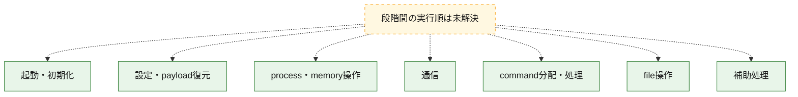
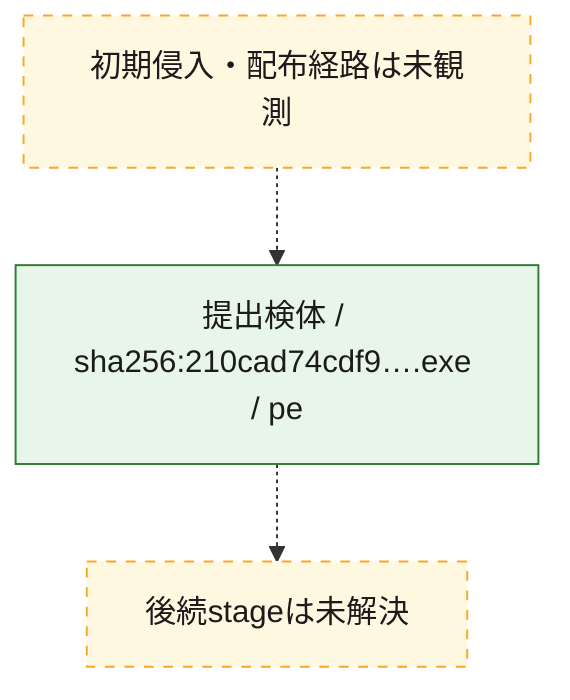
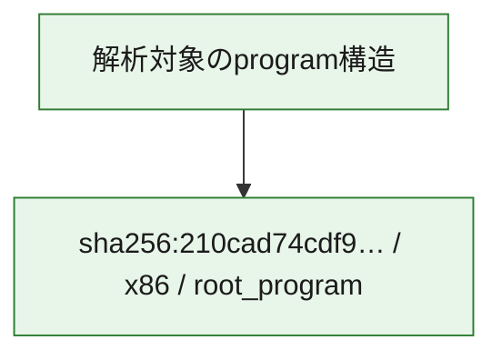

# 全体ロジック：210cad74cdf928b53c9bd5aae45d01954ce8fbb346e7a754f247b416e3f57cc6

代表関数の静的証跡から、起動・初期化、設定・payload復元、process・memory操作、通信、command分配・処理、file操作の処理群を確認しました。

## 読み方

- phaseの掲載順は解析上の整理順です。observed_call_edgesがない段階間の実行順を断定しません。
- 図の実線は静的に観測した関係、点線と黄色のノードは未観測・未解決の関係を示します。
- 図は静的な要約であり、動的実行を再現するものではありません。
- 詳細な関数解説とfingerprintは[STATIC-LOGIC.md](STATIC-LOGIC.md)を参照してください。

## 静的可視化

### 実行フロー

### 感染チェーン

### モジュール関係

## 処理段階

### 1. 起動・初期化

entry pointから初期化と後続処理への移行を確認します。
確度: `confirmed_static_function_evidence_with_limits`

- `210cad74cdf928b53c9bd5aae45d01954ce8fbb346e7a754f247b416e3f57cc6:ghidra:14012f080` — 初期化と主要処理への分岐を行う入口関数です。 状態: `succeeded`、選定理由: `entry_point`, `meaningful_symbol_name`, `probable_go_main_user_code`, `reviewed_call_centrality:5`, `role:entrypoint`
- `210cad74cdf928b53c9bd5aae45d01954ce8fbb346e7a754f247b416e3f57cc6:ghidra:14012f240` — 初期化と主要処理への分岐を行う入口関数です。 状態: `succeeded`、選定理由: `entry_point`, `meaningful_symbol_name`, `probable_go_main_user_code`, `reviewed_call_centrality:23`, `role:entrypoint`
- `210cad74cdf928b53c9bd5aae45d01954ce8fbb346e7a754f247b416e3f57cc6:ghidra:140134220` — 初期化と主要処理への分岐を行う入口関数です。 状態: `succeeded`、選定理由: `entry_point`, `meaningful_symbol_name`, `probable_go_main_user_code`, `reviewed_call_centrality:16`, `role:entrypoint`
- `210cad74cdf928b53c9bd5aae45d01954ce8fbb346e7a754f247b416e3f57cc6:ghidra:140137ce0` — 初期化と主要処理への分岐を行う入口関数です。 状態: `succeeded`、選定理由: `entry_point`, `meaningful_symbol_name`, `probable_go_main_user_code`, `reviewed_call_centrality:14`, `role:entrypoint`
- `210cad74cdf928b53c9bd5aae45d01954ce8fbb346e7a754f247b416e3f57cc6:ghidra:14013b760` — 初期化と主要処理への分岐を行う入口関数です。 状態: `succeeded`、選定理由: `entry_point`, `meaningful_symbol_name`, `probable_go_main_user_code`, `reviewed_call_centrality:14`, `role:entrypoint`
- `210cad74cdf928b53c9bd5aae45d01954ce8fbb346e7a754f247b416e3f57cc6:ghidra:14013de80` — 初期化と主要処理への分岐を行う入口関数です。 状態: `succeeded`、選定理由: `entry_point`, `meaningful_symbol_name`, `probable_go_main_user_code`, `reviewed_call_centrality:15`, `role:entrypoint`
- `210cad74cdf928b53c9bd5aae45d01954ce8fbb346e7a754f247b416e3f57cc6:ghidra:1401448e0` — 初期化と主要処理への分岐を行う入口関数です。 状態: `succeeded`、選定理由: `entry_point`, `meaningful_symbol_name`, `probable_go_main_user_code`, `reviewed_call_centrality:14`, `role:entrypoint`
- `210cad74cdf928b53c9bd5aae45d01954ce8fbb346e7a754f247b416e3f57cc6:ghidra:140147040` — 初期化と主要処理への分岐を行う入口関数です。 状態: `succeeded`、選定理由: `entry_point`, `meaningful_symbol_name`, `probable_go_main_user_code`, `reviewed_call_centrality:16`, `role:entrypoint`
- `210cad74cdf928b53c9bd5aae45d01954ce8fbb346e7a754f247b416e3f57cc6:ghidra:140148380` — 初期化と主要処理への分岐を行う入口関数です。 状態: `succeeded`、選定理由: `entry_point`, `meaningful_symbol_name`, `probable_go_main_user_code`, `reviewed_call_centrality:17`, `role:entrypoint`
- `210cad74cdf928b53c9bd5aae45d01954ce8fbb346e7a754f247b416e3f57cc6:ghidra:14014a180` — 初期化と主要処理への分岐を行う入口関数です。 状態: `succeeded`、選定理由: `entry_point`, `meaningful_symbol_name`, `probable_go_main_user_code`, `reviewed_call_centrality:21`, `role:entrypoint`
- `210cad74cdf928b53c9bd5aae45d01954ce8fbb346e7a754f247b416e3f57cc6:ghidra:14014ace0` — 初期化と主要処理への分岐を行う入口関数です。 状態: `succeeded`、選定理由: `entry_point`, `meaningful_symbol_name`, `probable_go_main_user_code`, `reviewed_call_centrality:19`, `role:entrypoint`
- `210cad74cdf928b53c9bd5aae45d01954ce8fbb346e7a754f247b416e3f57cc6:ghidra:14014cc60` — 初期化と主要処理への分岐を行う入口関数です。 状態: `succeeded`、選定理由: `entry_point`, `meaningful_symbol_name`, `probable_go_main_user_code`, `reviewed_call_centrality:14`, `role:entrypoint`
- `210cad74cdf928b53c9bd5aae45d01954ce8fbb346e7a754f247b416e3f57cc6:ghidra:14014f320` — 初期化と主要処理への分岐を行う入口関数です。 状態: `succeeded`、選定理由: `entry_point`, `meaningful_symbol_name`, `probable_go_main_user_code`, `reviewed_call_centrality:15`, `role:entrypoint`
- `210cad74cdf928b53c9bd5aae45d01954ce8fbb346e7a754f247b416e3f57cc6:ghidra:140151a40` — 初期化と主要処理への分岐を行う入口関数です。 状態: `succeeded`、選定理由: `entry_point`, `meaningful_symbol_name`, `probable_go_main_user_code`, `reviewed_call_centrality:21`, `role:entrypoint`
- `210cad74cdf928b53c9bd5aae45d01954ce8fbb346e7a754f247b416e3f57cc6:ghidra:140157c20` — 初期化と主要処理への分岐を行う入口関数です。 状態: `succeeded`、選定理由: `entry_point`, `meaningful_symbol_name`, `probable_go_main_user_code`, `reviewed_call_centrality:21`, `role:entrypoint`
- `210cad74cdf928b53c9bd5aae45d01954ce8fbb346e7a754f247b416e3f57cc6:ghidra:14015c380` — 初期化と主要処理への分岐を行う入口関数です。 状態: `succeeded`、選定理由: `entry_point`, `meaningful_symbol_name`, `probable_go_main_user_code`, `reviewed_call_centrality:18`, `role:entrypoint`
- `210cad74cdf928b53c9bd5aae45d01954ce8fbb346e7a754f247b416e3f57cc6:ghidra:14015eb60` — 初期化と主要処理への分岐を行う入口関数です。 状態: `succeeded`、選定理由: `entry_point`, `meaningful_symbol_name`, `probable_go_main_user_code`, `reviewed_call_centrality:18`, `role:entrypoint`
- `210cad74cdf928b53c9bd5aae45d01954ce8fbb346e7a754f247b416e3f57cc6:ghidra:140161280` — 初期化と主要処理への分岐を行う入口関数です。 状態: `succeeded`、選定理由: `entry_point`, `meaningful_symbol_name`, `probable_go_main_user_code`, `reviewed_call_centrality:17`, `role:entrypoint`
- `210cad74cdf928b53c9bd5aae45d01954ce8fbb346e7a754f247b416e3f57cc6:ghidra:140162f60` — 初期化と主要処理への分岐を行う入口関数です。 状態: `succeeded`、選定理由: `entry_point`, `meaningful_symbol_name`, `probable_go_main_user_code`, `reviewed_call_centrality:28`, `role:entrypoint`
- `210cad74cdf928b53c9bd5aae45d01954ce8fbb346e7a754f247b416e3f57cc6:ghidra:14016f220` — 初期化と主要処理への分岐を行う入口関数です。 状態: `failed`、選定理由: `entry_point`, `meaningful_symbol_name`, `probable_go_main_user_code`, `role:entrypoint`
- `210cad74cdf928b53c9bd5aae45d01954ce8fbb346e7a754f247b416e3f57cc6:ghidra:1401b9cc0` — 初期化と主要処理への分岐を行う入口関数です。 状態: `succeeded`、選定理由: `entry_point`, `meaningful_symbol_name`, `probable_go_main_user_code`, `reviewed_call_centrality:14`, `role:entrypoint`
- `210cad74cdf928b53c9bd5aae45d01954ce8fbb346e7a754f247b416e3f57cc6:ghidra:1401bcd00` — 初期化と主要処理への分岐を行う入口関数です。 状態: `succeeded`、選定理由: `entry_point`, `meaningful_symbol_name`, `probable_go_main_user_code`, `reviewed_call_centrality:16`, `role:entrypoint`
- `210cad74cdf928b53c9bd5aae45d01954ce8fbb346e7a754f247b416e3f57cc6:ghidra:1401bf380` — 初期化と主要処理への分岐を行う入口関数です。 状態: `succeeded`、選定理由: `entry_point`, `meaningful_symbol_name`, `probable_go_main_user_code`, `reviewed_call_centrality:17`, `role:entrypoint`
- `210cad74cdf928b53c9bd5aae45d01954ce8fbb346e7a754f247b416e3f57cc6:ghidra:1401c2400` — 初期化と主要処理への分岐を行う入口関数です。 状態: `succeeded`、選定理由: `entry_point`, `meaningful_symbol_name`, `probable_go_main_user_code`, `reviewed_call_centrality:14`, `role:entrypoint`

### 2. 設定・payload復元

設定、resource、payload、暗号化データの復元・変換を確認します。
確度: `confirmed_static_function_evidence`

- `210cad74cdf928b53c9bd5aae45d01954ce8fbb346e7a754f247b416e3f57cc6:ghidra:14008b9e0` — 設定、resource、payloadなどの解析・変換を行う関数です。 状態: `succeeded`、選定理由: `meaningful_symbol_name`, `reviewed_call_centrality:4`, `role:config_or_data_transform`
- `210cad74cdf928b53c9bd5aae45d01954ce8fbb346e7a754f247b416e3f57cc6:ghidra:14009c0c0` — 暗号、hash、encoding、または復号処理に関係する関数です。 状態: `succeeded`、選定理由: `meaningful_symbol_name`, `reviewed_call_centrality:2`, `role:cryptographic_transform`

### 3. process・memory操作

process、thread、module、memory操作と実行移行を確認します。
確度: `confirmed_static_function_evidence`

- `210cad74cdf928b53c9bd5aae45d01954ce8fbb346e7a754f247b416e3f57cc6:ghidra:1400b0580` — process、thread、module、またはmemory操作に関係する関数です。 状態: `succeeded`、選定理由: `meaningful_symbol_name`, `reviewed_call_centrality:6`, `role:process_or_memory_operation`

### 4. 通信

通信初期化、endpoint処理、送受信の役割を確認します。
確度: `confirmed_static_function_evidence`

- `210cad74cdf928b53c9bd5aae45d01954ce8fbb346e7a754f247b416e3f57cc6:ghidra:1400b12c0` — 通信初期化、送受信、またはendpoint処理に関係する関数です。 状態: `succeeded`、選定理由: `meaningful_symbol_name`, `reviewed_call_centrality:6`, `role:network_communication`

### 5. command分配・処理

受信commandやtaskの解釈、分配、個別handlerへの移行を確認します。
確度: `confirmed_static_function_evidence`

- `210cad74cdf928b53c9bd5aae45d01954ce8fbb346e7a754f247b416e3f57cc6:ghidra:1400affe0` — commandの解釈、分配、または個別処理を担当する関数です。 状態: `succeeded`、選定理由: `meaningful_symbol_name`, `reviewed_call_centrality:5`, `role:command_dispatch_or_handler`

### 6. file操作

fileやdirectoryの作成、読書き、削除を確認します。
確度: `confirmed_static_function_evidence`

- `210cad74cdf928b53c9bd5aae45d01954ce8fbb346e7a754f247b416e3f57cc6:ghidra:1400b0840` — fileまたはdirectoryの読書き・管理に関係する関数です。 状態: `succeeded`、選定理由: `meaningful_symbol_name`, `reviewed_call_centrality:6`, `role:file_operation`

### 7. 補助処理

主要処理を支える一般内部関数またはlibrary処理を確認します。
確度: `confirmed_static_function_evidence`

- `210cad74cdf928b53c9bd5aae45d01954ce8fbb346e7a754f247b416e3f57cc6:ghidra:140001080` — compiler生成処理または汎用library処理とみられる関数です。 状態: `succeeded`、選定理由: `meaningful_symbol_name`, `reviewed_call_centrality:5`
- `210cad74cdf928b53c9bd5aae45d01954ce8fbb346e7a754f247b416e3f57cc6:ghidra:140073f60` — 検体内部の一般処理を実装する関数です。 状態: `succeeded`、選定理由: `meaningful_symbol_name`, `reviewed_call_centrality:3`

## 観測したcall関係

- `ghidra-function:03ced2870f86299ed1756f0d` → `ghidra-external:1c70d5ef9679395f6f3310f5` （`unclassified` → `unclassified`）
- `ghidra-function:03ced2870f86299ed1756f0d` → `ghidra-external:1d4017d0cb26712f1ccc7157` （`unclassified` → `unclassified`）
- `ghidra-function:03ced2870f86299ed1756f0d` → `ghidra-external:2342f9a745026e28567c076b` （`unclassified` → `unclassified`）
- `ghidra-function:03ced2870f86299ed1756f0d` → `ghidra-external:3ac7121422b5020a91e96a14` （`unclassified` → `unclassified`）
- `ghidra-function:03ced2870f86299ed1756f0d` → `ghidra-external:3b813b9818695af51e20d867` （`unclassified` → `unclassified`）
- `ghidra-function:03ced2870f86299ed1756f0d` → `ghidra-external:71c3935830aec9d50b6b1b0c` （`unclassified` → `unclassified`）
- `ghidra-function:03ced2870f86299ed1756f0d` → `ghidra-external:910162ed63236c9c72bb289b` （`unclassified` → `unclassified`）
- `ghidra-function:03ced2870f86299ed1756f0d` → `ghidra-external:944c41e03973d816eef41043` （`unclassified` → `unclassified`）
- `ghidra-function:03ced2870f86299ed1756f0d` → `ghidra-external:b13f05d1c810b8d2ce94ac40` （`unclassified` → `unclassified`）
- `ghidra-function:03ced2870f86299ed1756f0d` → `ghidra-external:c8cdf09e65bdc729b02ed5a0` （`unclassified` → `unclassified`）
- `ghidra-function:03ced2870f86299ed1756f0d` → `ghidra-external:ca33243de69236a84d590ef8` （`unclassified` → `unclassified`）
- `ghidra-function:03ced2870f86299ed1756f0d` → `ghidra-external:ccb7a567ba9e64d622176ec5` （`unclassified` → `unclassified`）
- `ghidra-function:03ced2870f86299ed1756f0d` → `ghidra-external:ea276a57a21602067fb8bddf` （`unclassified` → `unclassified`）
- `ghidra-function:03ced2870f86299ed1756f0d` → `ghidra-external:f57087a786e1074e4ec5b88e` （`unclassified` → `unclassified`）
- `ghidra-function:0d1a428e5b9dfda7b663f223` → `ghidra-external:0d92e12e868a3e859f3ab045` （`unclassified` → `unclassified`）
- `ghidra-function:0d1a428e5b9dfda7b663f223` → `ghidra-external:231d8af1d710de5695bd4e38` （`unclassified` → `unclassified`）
- `ghidra-function:0d1a428e5b9dfda7b663f223` → `ghidra-external:35e5835aba3438ff0fd2a87d` （`unclassified` → `unclassified`）
- `ghidra-function:219e6101796acdff98e8b572` → `ghidra-external:1c70d5ef9679395f6f3310f5` （`unclassified` → `unclassified`）
- `ghidra-function:219e6101796acdff98e8b572` → `ghidra-external:1d4017d0cb26712f1ccc7157` （`unclassified` → `unclassified`）
- `ghidra-function:219e6101796acdff98e8b572` → `ghidra-external:2342f9a745026e28567c076b` （`unclassified` → `unclassified`）
- `ghidra-function:219e6101796acdff98e8b572` → `ghidra-external:3ac7121422b5020a91e96a14` （`unclassified` → `unclassified`）
- `ghidra-function:219e6101796acdff98e8b572` → `ghidra-external:3b813b9818695af51e20d867` （`unclassified` → `unclassified`）
- `ghidra-function:219e6101796acdff98e8b572` → `ghidra-external:4b97f0ef06404a4b2b520466` （`unclassified` → `unclassified`）
- `ghidra-function:219e6101796acdff98e8b572` → `ghidra-external:71c3935830aec9d50b6b1b0c` （`unclassified` → `unclassified`）
- `ghidra-function:219e6101796acdff98e8b572` → `ghidra-external:910162ed63236c9c72bb289b` （`unclassified` → `unclassified`）
- `ghidra-function:219e6101796acdff98e8b572` → `ghidra-external:944c41e03973d816eef41043` （`unclassified` → `unclassified`）
- `ghidra-function:219e6101796acdff98e8b572` → `ghidra-external:b13f05d1c810b8d2ce94ac40` （`unclassified` → `unclassified`）
- `ghidra-function:219e6101796acdff98e8b572` → `ghidra-external:bdad5a336f793a97fa01b311` （`unclassified` → `unclassified`）
- `ghidra-function:219e6101796acdff98e8b572` → `ghidra-external:c8cdf09e65bdc729b02ed5a0` （`unclassified` → `unclassified`）
- `ghidra-function:219e6101796acdff98e8b572` → `ghidra-external:ca27bf91f328e62ef8c36a40` （`unclassified` → `unclassified`）
- `ghidra-function:219e6101796acdff98e8b572` → `ghidra-external:ca33243de69236a84d590ef8` （`unclassified` → `unclassified`）
- `ghidra-function:219e6101796acdff98e8b572` → `ghidra-external:ccb7a567ba9e64d622176ec5` （`unclassified` → `unclassified`）
- `ghidra-function:219e6101796acdff98e8b572` → `ghidra-external:ea276a57a21602067fb8bddf` （`unclassified` → `unclassified`）
- `ghidra-function:37f9fe4b00ca0d370bf536d5` → `ghidra-external:1c70d5ef9679395f6f3310f5` （`unclassified` → `unclassified`）
- `ghidra-function:37f9fe4b00ca0d370bf536d5` → `ghidra-external:402c07fd88e8672b68657cfd` （`unclassified` → `unclassified`）
- `ghidra-function:37f9fe4b00ca0d370bf536d5` → `ghidra-external:9117e807c2eb8caf848e591a` （`unclassified` → `unclassified`）
- `ghidra-function:37f9fe4b00ca0d370bf536d5` → `ghidra-external:cf56a2b6c7d74549b83737f6` （`unclassified` → `unclassified`）
- `ghidra-function:38e85c012ff50c8373c00ea2` → `ghidra-external:1c70d5ef9679395f6f3310f5` （`unclassified` → `unclassified`）
- `ghidra-function:38e85c012ff50c8373c00ea2` → `ghidra-external:1d4017d0cb26712f1ccc7157` （`unclassified` → `unclassified`）
- `ghidra-function:38e85c012ff50c8373c00ea2` → `ghidra-external:2342f9a745026e28567c076b` （`unclassified` → `unclassified`）
- `ghidra-function:38e85c012ff50c8373c00ea2` → `ghidra-external:3ac7121422b5020a91e96a14` （`unclassified` → `unclassified`）
- `ghidra-function:38e85c012ff50c8373c00ea2` → `ghidra-external:3b813b9818695af51e20d867` （`unclassified` → `unclassified`）
- `ghidra-function:38e85c012ff50c8373c00ea2` → `ghidra-external:71c3935830aec9d50b6b1b0c` （`unclassified` → `unclassified`）
- `ghidra-function:38e85c012ff50c8373c00ea2` → `ghidra-external:7734877a59c5c94fa016ae63` （`unclassified` → `unclassified`）
- `ghidra-function:38e85c012ff50c8373c00ea2` → `ghidra-external:910162ed63236c9c72bb289b` （`unclassified` → `unclassified`）
- `ghidra-function:38e85c012ff50c8373c00ea2` → `ghidra-external:944c41e03973d816eef41043` （`unclassified` → `unclassified`）
- `ghidra-function:38e85c012ff50c8373c00ea2` → `ghidra-external:b13f05d1c810b8d2ce94ac40` （`unclassified` → `unclassified`）
- `ghidra-function:38e85c012ff50c8373c00ea2` → `ghidra-external:c8cdf09e65bdc729b02ed5a0` （`unclassified` → `unclassified`）
- `ghidra-function:38e85c012ff50c8373c00ea2` → `ghidra-external:ca33243de69236a84d590ef8` （`unclassified` → `unclassified`）
- `ghidra-function:38e85c012ff50c8373c00ea2` → `ghidra-external:ccb7a567ba9e64d622176ec5` （`unclassified` → `unclassified`）
- `ghidra-function:38e85c012ff50c8373c00ea2` → `ghidra-external:ea276a57a21602067fb8bddf` （`unclassified` → `unclassified`）
- `ghidra-function:3a2eb678543d50818a58c392` → `ghidra-external:56f438a33ba6920b73c77b4c` （`unclassified` → `unclassified`）
- `ghidra-function:3a2eb678543d50818a58c392` → `ghidra-external:5803cd4748546ab299a494a9` （`unclassified` → `unclassified`）
- `ghidra-function:3a2eb678543d50818a58c392` → `ghidra-external:b06465c9ab41f4df0a43ef3b` （`unclassified` → `unclassified`）
- `ghidra-function:3a2eb678543d50818a58c392` → `ghidra-external:b13f05d1c810b8d2ce94ac40` （`unclassified` → `unclassified`）
- `ghidra-function:3a2eb678543d50818a58c392` → `ghidra-external:d2e87778f3fdde56bf026cfc` （`unclassified` → `unclassified`）
- `ghidra-function:451bff7ce99a8b8a1d01b733` → `ghidra-external:0abf739904627e8bae5534e5` （`unclassified` → `unclassified`）
- `ghidra-function:451bff7ce99a8b8a1d01b733` → `ghidra-external:b13f05d1c810b8d2ce94ac40` （`unclassified` → `unclassified`）
- `ghidra-function:4a58fdac56e3ca7c46134f23` → `ghidra-external:1c70d5ef9679395f6f3310f5` （`unclassified` → `unclassified`）
- `ghidra-function:4a58fdac56e3ca7c46134f23` → `ghidra-external:1d4017d0cb26712f1ccc7157` （`unclassified` → `unclassified`）
- `ghidra-function:4a58fdac56e3ca7c46134f23` → `ghidra-external:2342f9a745026e28567c076b` （`unclassified` → `unclassified`）
- `ghidra-function:4a58fdac56e3ca7c46134f23` → `ghidra-external:29cee6149e9f5b9a9d0d25fc` （`unclassified` → `unclassified`）
- `ghidra-function:4a58fdac56e3ca7c46134f23` → `ghidra-external:3ac7121422b5020a91e96a14` （`unclassified` → `unclassified`）
- `ghidra-function:4a58fdac56e3ca7c46134f23` → `ghidra-external:3b813b9818695af51e20d867` （`unclassified` → `unclassified`）
- `ghidra-function:4a58fdac56e3ca7c46134f23` → `ghidra-external:71c3935830aec9d50b6b1b0c` （`unclassified` → `unclassified`）
- `ghidra-function:4a58fdac56e3ca7c46134f23` → `ghidra-external:910162ed63236c9c72bb289b` （`unclassified` → `unclassified`）
- `ghidra-function:4a58fdac56e3ca7c46134f23` → `ghidra-external:944c41e03973d816eef41043` （`unclassified` → `unclassified`）
- `ghidra-function:4a58fdac56e3ca7c46134f23` → `ghidra-external:b13f05d1c810b8d2ce94ac40` （`unclassified` → `unclassified`）
- `ghidra-function:4a58fdac56e3ca7c46134f23` → `ghidra-external:b93e52220f1d0ab24da567f1` （`unclassified` → `unclassified`）
- `ghidra-function:4a58fdac56e3ca7c46134f23` → `ghidra-external:c8cdf09e65bdc729b02ed5a0` （`unclassified` → `unclassified`）
- `ghidra-function:4a58fdac56e3ca7c46134f23` → `ghidra-external:ca27bf91f328e62ef8c36a40` （`unclassified` → `unclassified`）
- `ghidra-function:4a58fdac56e3ca7c46134f23` → `ghidra-external:ca33243de69236a84d590ef8` （`unclassified` → `unclassified`）
- `ghidra-function:4a58fdac56e3ca7c46134f23` → `ghidra-external:ccb7a567ba9e64d622176ec5` （`unclassified` → `unclassified`）
- `ghidra-function:4a58fdac56e3ca7c46134f23` → `ghidra-external:ce48f9698d9effdc80896ae0` （`unclassified` → `unclassified`）
- `ghidra-function:4a58fdac56e3ca7c46134f23` → `ghidra-external:ea276a57a21602067fb8bddf` （`unclassified` → `unclassified`）
- `ghidra-function:4cfc64103edcb8ccb1a26b6d` → `ghidra-external:1c70d5ef9679395f6f3310f5` （`unclassified` → `unclassified`）
- `ghidra-function:4cfc64103edcb8ccb1a26b6d` → `ghidra-external:1d4017d0cb26712f1ccc7157` （`unclassified` → `unclassified`）
- `ghidra-function:4cfc64103edcb8ccb1a26b6d` → `ghidra-external:22bc18efab4e1b86778f49f4` （`unclassified` → `unclassified`）
- `ghidra-function:4cfc64103edcb8ccb1a26b6d` → `ghidra-external:2342f9a745026e28567c076b` （`unclassified` → `unclassified`）
- `ghidra-function:4cfc64103edcb8ccb1a26b6d` → `ghidra-external:3901e0387b50a1c911ce3a1c` （`unclassified` → `unclassified`）
- `ghidra-function:4cfc64103edcb8ccb1a26b6d` → `ghidra-external:3ac7121422b5020a91e96a14` （`unclassified` → `unclassified`）
- `ghidra-function:4cfc64103edcb8ccb1a26b6d` → `ghidra-external:3b813b9818695af51e20d867` （`unclassified` → `unclassified`）
- `ghidra-function:4cfc64103edcb8ccb1a26b6d` → `ghidra-external:4c32945a3ac6f0a860253a75` （`unclassified` → `unclassified`）
- `ghidra-function:4cfc64103edcb8ccb1a26b6d` → `ghidra-external:71c3935830aec9d50b6b1b0c` （`unclassified` → `unclassified`）
- `ghidra-function:4cfc64103edcb8ccb1a26b6d` → `ghidra-external:910162ed63236c9c72bb289b` （`unclassified` → `unclassified`）
- `ghidra-function:4cfc64103edcb8ccb1a26b6d` → `ghidra-external:944c41e03973d816eef41043` （`unclassified` → `unclassified`）
- `ghidra-function:4cfc64103edcb8ccb1a26b6d` → `ghidra-external:b13f05d1c810b8d2ce94ac40` （`unclassified` → `unclassified`）
- `ghidra-function:4cfc64103edcb8ccb1a26b6d` → `ghidra-external:b93e52220f1d0ab24da567f1` （`unclassified` → `unclassified`）
- `ghidra-function:4cfc64103edcb8ccb1a26b6d` → `ghidra-external:c8cdf09e65bdc729b02ed5a0` （`unclassified` → `unclassified`）
- `ghidra-function:4cfc64103edcb8ccb1a26b6d` → `ghidra-external:ca27bf91f328e62ef8c36a40` （`unclassified` → `unclassified`）
- `ghidra-function:4cfc64103edcb8ccb1a26b6d` → `ghidra-external:ca33243de69236a84d590ef8` （`unclassified` → `unclassified`）
- `ghidra-function:4cfc64103edcb8ccb1a26b6d` → `ghidra-external:ccb7a567ba9e64d622176ec5` （`unclassified` → `unclassified`）
- `ghidra-function:4cfc64103edcb8ccb1a26b6d` → `ghidra-external:d49766312df8cdec37ce851a` （`unclassified` → `unclassified`）
- `ghidra-function:4cfc64103edcb8ccb1a26b6d` → `ghidra-external:ea276a57a21602067fb8bddf` （`unclassified` → `unclassified`）
- `ghidra-function:4f5b877b111f0ca0f14b32d1` → `ghidra-external:154d777b3ed6a322c2113502` （`unclassified` → `unclassified`）
- `ghidra-function:4f5b877b111f0ca0f14b32d1` → `ghidra-external:1c70d5ef9679395f6f3310f5` （`unclassified` → `unclassified`）
- `ghidra-function:4f5b877b111f0ca0f14b32d1` → `ghidra-external:1d4017d0cb26712f1ccc7157` （`unclassified` → `unclassified`）
- `ghidra-function:4f5b877b111f0ca0f14b32d1` → `ghidra-external:2342f9a745026e28567c076b` （`unclassified` → `unclassified`）
- `ghidra-function:4f5b877b111f0ca0f14b32d1` → `ghidra-external:3ac7121422b5020a91e96a14` （`unclassified` → `unclassified`）
- `ghidra-function:4f5b877b111f0ca0f14b32d1` → `ghidra-external:3b813b9818695af51e20d867` （`unclassified` → `unclassified`）
- `ghidra-function:4f5b877b111f0ca0f14b32d1` → `ghidra-external:4b97f0ef06404a4b2b520466` （`unclassified` → `unclassified`）
- `ghidra-function:4f5b877b111f0ca0f14b32d1` → `ghidra-external:71c3935830aec9d50b6b1b0c` （`unclassified` → `unclassified`）
- `ghidra-function:4f5b877b111f0ca0f14b32d1` → `ghidra-external:910162ed63236c9c72bb289b` （`unclassified` → `unclassified`）
- `ghidra-function:4f5b877b111f0ca0f14b32d1` → `ghidra-external:92f2a1a67e219ae578072b39` （`unclassified` → `unclassified`）
- `ghidra-function:4f5b877b111f0ca0f14b32d1` → `ghidra-external:944c41e03973d816eef41043` （`unclassified` → `unclassified`）
- `ghidra-function:4f5b877b111f0ca0f14b32d1` → `ghidra-external:a34f5ea232bb6a144f0f2d82` （`unclassified` → `unclassified`）
- `ghidra-function:4f5b877b111f0ca0f14b32d1` → `ghidra-external:b13f05d1c810b8d2ce94ac40` （`unclassified` → `unclassified`）
- `ghidra-function:4f5b877b111f0ca0f14b32d1` → `ghidra-external:b93e52220f1d0ab24da567f1` （`unclassified` → `unclassified`）
- `ghidra-function:4f5b877b111f0ca0f14b32d1` → `ghidra-external:c3c3700db628e0030127297c` （`unclassified` → `unclassified`）
- `ghidra-function:4f5b877b111f0ca0f14b32d1` → `ghidra-external:c8cdf09e65bdc729b02ed5a0` （`unclassified` → `unclassified`）
- `ghidra-function:4f5b877b111f0ca0f14b32d1` → `ghidra-external:ca27bf91f328e62ef8c36a40` （`unclassified` → `unclassified`）
- `ghidra-function:4f5b877b111f0ca0f14b32d1` → `ghidra-external:ca33243de69236a84d590ef8` （`unclassified` → `unclassified`）
- `ghidra-function:4f5b877b111f0ca0f14b32d1` → `ghidra-external:ccb7a567ba9e64d622176ec5` （`unclassified` → `unclassified`）
- `ghidra-function:4f5b877b111f0ca0f14b32d1` → `ghidra-external:ea276a57a21602067fb8bddf` （`unclassified` → `unclassified`）
- `ghidra-function:4f5b877b111f0ca0f14b32d1` → `ghidra-external:fbc2963baae06c4b12dd7506` （`unclassified` → `unclassified`）
- `ghidra-function:503842ee9ac77e0096984ce3` → `ghidra-external:0d1ffb5a59596174c570a67a` （`unclassified` → `unclassified`）
- `ghidra-function:503842ee9ac77e0096984ce3` → `ghidra-external:0f19e30d1dc5423a1a2a7ae8` （`unclassified` → `unclassified`）
- `ghidra-function:503842ee9ac77e0096984ce3` → `ghidra-external:1094d3aba0a605142cd16285` （`unclassified` → `unclassified`）
- `ghidra-function:503842ee9ac77e0096984ce3` → `ghidra-external:1c70d5ef9679395f6f3310f5` （`unclassified` → `unclassified`）
- `ghidra-function:503842ee9ac77e0096984ce3` → `ghidra-external:1d4017d0cb26712f1ccc7157` （`unclassified` → `unclassified`）
- `ghidra-function:503842ee9ac77e0096984ce3` → `ghidra-external:2342f9a745026e28567c076b` （`unclassified` → `unclassified`）
- `ghidra-function:503842ee9ac77e0096984ce3` → `ghidra-external:2c26d2ee4168733f30bc2900` （`unclassified` → `unclassified`）
- `ghidra-function:503842ee9ac77e0096984ce3` → `ghidra-external:32fc53003717cf047bc10d1b` （`unclassified` → `unclassified`）
- `ghidra-function:503842ee9ac77e0096984ce3` → `ghidra-external:3ac7121422b5020a91e96a14` （`unclassified` → `unclassified`）
- `ghidra-function:503842ee9ac77e0096984ce3` → `ghidra-external:3b813b9818695af51e20d867` （`unclassified` → `unclassified`）
- `ghidra-function:503842ee9ac77e0096984ce3` → `ghidra-external:71c3935830aec9d50b6b1b0c` （`unclassified` → `unclassified`）
- `ghidra-function:503842ee9ac77e0096984ce3` → `ghidra-external:910162ed63236c9c72bb289b` （`unclassified` → `unclassified`）
- `ghidra-function:503842ee9ac77e0096984ce3` → `ghidra-external:944c41e03973d816eef41043` （`unclassified` → `unclassified`）
- `ghidra-function:503842ee9ac77e0096984ce3` → `ghidra-external:a2730dc3aabb33f123dd7a6f` （`unclassified` → `unclassified`）
- `ghidra-function:503842ee9ac77e0096984ce3` → `ghidra-external:b13f05d1c810b8d2ce94ac40` （`unclassified` → `unclassified`）
- `ghidra-function:503842ee9ac77e0096984ce3` → `ghidra-external:bb70f4438c5e172af0e72da2` （`unclassified` → `unclassified`）
- `ghidra-function:503842ee9ac77e0096984ce3` → `ghidra-external:c8cdf09e65bdc729b02ed5a0` （`unclassified` → `unclassified`）
- `ghidra-function:503842ee9ac77e0096984ce3` → `ghidra-external:ca27bf91f328e62ef8c36a40` （`unclassified` → `unclassified`）
- `ghidra-function:503842ee9ac77e0096984ce3` → `ghidra-external:ca33243de69236a84d590ef8` （`unclassified` → `unclassified`）
- `ghidra-function:503842ee9ac77e0096984ce3` → `ghidra-external:ccb7a567ba9e64d622176ec5` （`unclassified` → `unclassified`）
- `ghidra-function:503842ee9ac77e0096984ce3` → `ghidra-external:ea276a57a21602067fb8bddf` （`unclassified` → `unclassified`）
- `ghidra-function:5b942f41b824691077a2d86a` → `ghidra-external:1c70d5ef9679395f6f3310f5` （`unclassified` → `unclassified`）
- `ghidra-function:5b942f41b824691077a2d86a` → `ghidra-external:1d4017d0cb26712f1ccc7157` （`unclassified` → `unclassified`）
- `ghidra-function:5b942f41b824691077a2d86a` → `ghidra-external:2342f9a745026e28567c076b` （`unclassified` → `unclassified`）
- `ghidra-function:5b942f41b824691077a2d86a` → `ghidra-external:3ac7121422b5020a91e96a14` （`unclassified` → `unclassified`）
- `ghidra-function:5b942f41b824691077a2d86a` → `ghidra-external:3b813b9818695af51e20d867` （`unclassified` → `unclassified`）
- `ghidra-function:5b942f41b824691077a2d86a` → `ghidra-external:4567c752d1d88ace98c22e80` （`unclassified` → `unclassified`）
- `ghidra-function:5b942f41b824691077a2d86a` → `ghidra-external:71c3935830aec9d50b6b1b0c` （`unclassified` → `unclassified`）
- `ghidra-function:5b942f41b824691077a2d86a` → `ghidra-external:910162ed63236c9c72bb289b` （`unclassified` → `unclassified`）
- `ghidra-function:5b942f41b824691077a2d86a` → `ghidra-external:944c41e03973d816eef41043` （`unclassified` → `unclassified`）
- `ghidra-function:5b942f41b824691077a2d86a` → `ghidra-external:b13f05d1c810b8d2ce94ac40` （`unclassified` → `unclassified`）
- `ghidra-function:5b942f41b824691077a2d86a` → `ghidra-external:c8cdf09e65bdc729b02ed5a0` （`unclassified` → `unclassified`）
- `ghidra-function:5b942f41b824691077a2d86a` → `ghidra-external:ca33243de69236a84d590ef8` （`unclassified` → `unclassified`）
- `ghidra-function:5b942f41b824691077a2d86a` → `ghidra-external:ccb7a567ba9e64d622176ec5` （`unclassified` → `unclassified`）
- `ghidra-function:5b942f41b824691077a2d86a` → `ghidra-external:ea276a57a21602067fb8bddf` （`unclassified` → `unclassified`）
- `ghidra-function:5fdff2e56dccd38a4d6ea63e` → `ghidra-external:0c7dea48521bcd7b117a0ffa` （`unclassified` → `unclassified`）
- `ghidra-function:5fdff2e56dccd38a4d6ea63e` → `ghidra-external:1c70d5ef9679395f6f3310f5` （`unclassified` → `unclassified`）
- `ghidra-function:5fdff2e56dccd38a4d6ea63e` → `ghidra-external:1d4017d0cb26712f1ccc7157` （`unclassified` → `unclassified`）
- `ghidra-function:5fdff2e56dccd38a4d6ea63e` → `ghidra-external:22bc18efab4e1b86778f49f4` （`unclassified` → `unclassified`）
- `ghidra-function:5fdff2e56dccd38a4d6ea63e` → `ghidra-external:2342f9a745026e28567c076b` （`unclassified` → `unclassified`）
- `ghidra-function:5fdff2e56dccd38a4d6ea63e` → `ghidra-external:3ac7121422b5020a91e96a14` （`unclassified` → `unclassified`）
- `ghidra-function:5fdff2e56dccd38a4d6ea63e` → `ghidra-external:3b813b9818695af51e20d867` （`unclassified` → `unclassified`）
- `ghidra-function:5fdff2e56dccd38a4d6ea63e` → `ghidra-external:48ede83944d33ec2719762a4` （`unclassified` → `unclassified`）
- `ghidra-function:5fdff2e56dccd38a4d6ea63e` → `ghidra-external:4b97f0ef06404a4b2b520466` （`unclassified` → `unclassified`）
- `ghidra-function:5fdff2e56dccd38a4d6ea63e` → `ghidra-external:71c3935830aec9d50b6b1b0c` （`unclassified` → `unclassified`）
- `ghidra-function:5fdff2e56dccd38a4d6ea63e` → `ghidra-external:910162ed63236c9c72bb289b` （`unclassified` → `unclassified`）
- `ghidra-function:5fdff2e56dccd38a4d6ea63e` → `ghidra-external:92f2a1a67e219ae578072b39` （`unclassified` → `unclassified`）
- `ghidra-function:5fdff2e56dccd38a4d6ea63e` → `ghidra-external:944c41e03973d816eef41043` （`unclassified` → `unclassified`）
- `ghidra-function:5fdff2e56dccd38a4d6ea63e` → `ghidra-external:b06465c9ab41f4df0a43ef3b` （`unclassified` → `unclassified`）
- `ghidra-function:5fdff2e56dccd38a4d6ea63e` → `ghidra-external:b13f05d1c810b8d2ce94ac40` （`unclassified` → `unclassified`）
- `ghidra-function:5fdff2e56dccd38a4d6ea63e` → `ghidra-external:c8cdf09e65bdc729b02ed5a0` （`unclassified` → `unclassified`）
- `ghidra-function:5fdff2e56dccd38a4d6ea63e` → `ghidra-external:ca27bf91f328e62ef8c36a40` （`unclassified` → `unclassified`）
- `ghidra-function:5fdff2e56dccd38a4d6ea63e` → `ghidra-external:ca33243de69236a84d590ef8` （`unclassified` → `unclassified`）
- `ghidra-function:5fdff2e56dccd38a4d6ea63e` → `ghidra-external:ccb7a567ba9e64d622176ec5` （`unclassified` → `unclassified`）
- `ghidra-function:5fdff2e56dccd38a4d6ea63e` → `ghidra-external:d2e87778f3fdde56bf026cfc` （`unclassified` → `unclassified`）
- `ghidra-function:5fdff2e56dccd38a4d6ea63e` → `ghidra-external:d49766312df8cdec37ce851a` （`unclassified` → `unclassified`）
- `ghidra-function:5fdff2e56dccd38a4d6ea63e` → `ghidra-external:d6795fb7974c7757d69613c0` （`unclassified` → `unclassified`）
- `ghidra-function:5fdff2e56dccd38a4d6ea63e` → `ghidra-external:ea276a57a21602067fb8bddf` （`unclassified` → `unclassified`）
- `ghidra-function:62869ffd9199176e9c552b9a` → `ghidra-external:1c70d5ef9679395f6f3310f5` （`unclassified` → `unclassified`）
- `ghidra-function:62869ffd9199176e9c552b9a` → `ghidra-external:1d4017d0cb26712f1ccc7157` （`unclassified` → `unclassified`）
- `ghidra-function:62869ffd9199176e9c552b9a` → `ghidra-external:2342f9a745026e28567c076b` （`unclassified` → `unclassified`）
- `ghidra-function:62869ffd9199176e9c552b9a` → `ghidra-external:3ac7121422b5020a91e96a14` （`unclassified` → `unclassified`）
- `ghidra-function:62869ffd9199176e9c552b9a` → `ghidra-external:3b813b9818695af51e20d867` （`unclassified` → `unclassified`）
- `ghidra-function:62869ffd9199176e9c552b9a` → `ghidra-external:48ede83944d33ec2719762a4` （`unclassified` → `unclassified`）
- `ghidra-function:62869ffd9199176e9c552b9a` → `ghidra-external:71c3935830aec9d50b6b1b0c` （`unclassified` → `unclassified`）
- `ghidra-function:62869ffd9199176e9c552b9a` → `ghidra-external:80900e0e8c07808614b44279` （`unclassified` → `unclassified`）
- `ghidra-function:62869ffd9199176e9c552b9a` → `ghidra-external:910162ed63236c9c72bb289b` （`unclassified` → `unclassified`）
- `ghidra-function:62869ffd9199176e9c552b9a` → `ghidra-external:911333a9d53135334f04c9b6` （`unclassified` → `unclassified`）
- `ghidra-function:62869ffd9199176e9c552b9a` → `ghidra-external:944c41e03973d816eef41043` （`unclassified` → `unclassified`）
- `ghidra-function:62869ffd9199176e9c552b9a` → `ghidra-external:b13f05d1c810b8d2ce94ac40` （`unclassified` → `unclassified`）
- `ghidra-function:62869ffd9199176e9c552b9a` → `ghidra-external:bf1e84b77eb858b4c83a3963` （`unclassified` → `unclassified`）
- `ghidra-function:62869ffd9199176e9c552b9a` → `ghidra-external:c0e3cc115162c237574efce6` （`unclassified` → `unclassified`）
- `ghidra-function:62869ffd9199176e9c552b9a` → `ghidra-external:c8cdf09e65bdc729b02ed5a0` （`unclassified` → `unclassified`）
- `ghidra-function:62869ffd9199176e9c552b9a` → `ghidra-external:ca33243de69236a84d590ef8` （`unclassified` → `unclassified`）
- `ghidra-function:62869ffd9199176e9c552b9a` → `ghidra-external:ccb7a567ba9e64d622176ec5` （`unclassified` → `unclassified`）
- `ghidra-function:62869ffd9199176e9c552b9a` → `ghidra-external:ea276a57a21602067fb8bddf` （`unclassified` → `unclassified`）
- `ghidra-function:6c49aa2393690df8d63dbf57` → `ghidra-external:1c70d5ef9679395f6f3310f5` （`unclassified` → `unclassified`）
- `ghidra-function:6c49aa2393690df8d63dbf57` → `ghidra-external:1d4017d0cb26712f1ccc7157` （`unclassified` → `unclassified`）
- `ghidra-function:6c49aa2393690df8d63dbf57` → `ghidra-external:2342f9a745026e28567c076b` （`unclassified` → `unclassified`）
- `ghidra-function:6c49aa2393690df8d63dbf57` → `ghidra-external:3ac7121422b5020a91e96a14` （`unclassified` → `unclassified`）
- `ghidra-function:6c49aa2393690df8d63dbf57` → `ghidra-external:3b813b9818695af51e20d867` （`unclassified` → `unclassified`）
- `ghidra-function:6c49aa2393690df8d63dbf57` → `ghidra-external:71c3935830aec9d50b6b1b0c` （`unclassified` → `unclassified`）
- `ghidra-function:6c49aa2393690df8d63dbf57` → `ghidra-external:910162ed63236c9c72bb289b` （`unclassified` → `unclassified`）
- `ghidra-function:6c49aa2393690df8d63dbf57` → `ghidra-external:944c41e03973d816eef41043` （`unclassified` → `unclassified`）
- `ghidra-function:6c49aa2393690df8d63dbf57` → `ghidra-external:b13f05d1c810b8d2ce94ac40` （`unclassified` → `unclassified`）
- 残り224件は`static-logic.json`に記録しています。

## 解析範囲と制約

- 選定外関数は全体inventoryへ残しますが、関数本体の個別解説対象にはしていません。
- indirect call、難読化、packer、VM、壊れたcontrol flowによりcall関係が欠落する場合があります。
- 文書は静的解析に基づき、検体実行や外部通信による動的確認は行っていません。
