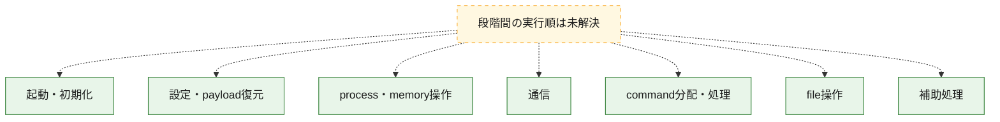
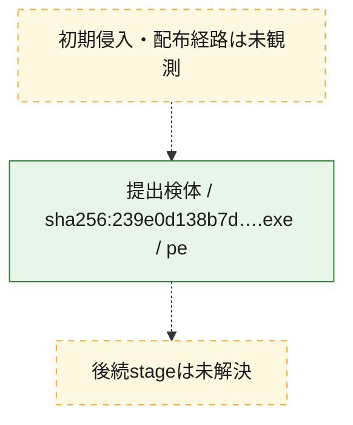
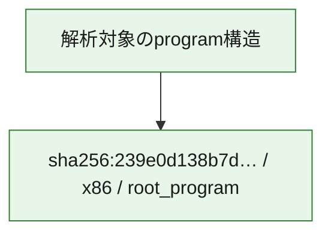

# 全体ロジック：239e0d138b7d137ae4f76476fdf2ba10d17dcf0b40a5d818b7e01612ac69dcb2

代表関数の静的証跡から、起動・初期化、設定・payload復元、process・memory操作、通信、command分配・処理、file操作の処理群を確認しました。

## 読み方

- phaseの掲載順は解析上の整理順です。observed_call_edgesがない段階間の実行順を断定しません。
- 図の実線は静的に観測した関係、点線と黄色のノードは未観測・未解決の関係を示します。
- 図は静的な要約であり、動的実行を再現するものではありません。
- 詳細な関数解説とfingerprintは[STATIC-LOGIC.md](STATIC-LOGIC.md)を参照してください。

## 静的可視化

### 実行フロー

### 感染チェーン

### モジュール関係

## 処理段階

### 1. 起動・初期化

entry pointから初期化と後続処理への移行を確認します。
確度: `confirmed_static_function_evidence`

- `239e0d138b7d137ae4f76476fdf2ba10d17dcf0b40a5d818b7e01612ac69dcb2:ghidra:1e5d93c00` — 初期化と主要処理への分岐を行う入口関数です。 状態: `succeeded`、選定理由: `entry_point`, `meaningful_symbol_name`, `probable_go_main_user_code`, `reviewed_call_centrality:3`, `role:entrypoint`
- `239e0d138b7d137ae4f76476fdf2ba10d17dcf0b40a5d818b7e01612ac69dcb2:ghidra:1e5d93c40` — 初期化と主要処理への分岐を行う入口関数です。 状態: `succeeded`、選定理由: `entry_point`, `meaningful_symbol_name`, `probable_go_main_user_code`, `reviewed_call_centrality:31`, `role:entrypoint`
- `239e0d138b7d137ae4f76476fdf2ba10d17dcf0b40a5d818b7e01612ac69dcb2:ghidra:1e5da78c0` — 初期化と主要処理への分岐を行う入口関数です。 状態: `succeeded`、選定理由: `entry_point`, `meaningful_symbol_name`, `probable_go_main_user_code`, `reviewed_call_centrality:32`, `role:entrypoint`
- `239e0d138b7d137ae4f76476fdf2ba10d17dcf0b40a5d818b7e01612ac69dcb2:ghidra:1e5db6700` — 初期化と主要処理への分岐を行う入口関数です。 状態: `succeeded`、選定理由: `entry_point`, `meaningful_symbol_name`, `probable_go_main_user_code`, `reviewed_call_centrality:28`, `role:entrypoint`
- `239e0d138b7d137ae4f76476fdf2ba10d17dcf0b40a5d818b7e01612ac69dcb2:ghidra:1e5dcc8c0` — 初期化と主要処理への分岐を行う入口関数です。 状態: `succeeded`、選定理由: `entry_point`, `meaningful_symbol_name`, `probable_go_main_user_code`, `reviewed_call_centrality:31`, `role:entrypoint`
- `239e0d138b7d137ae4f76476fdf2ba10d17dcf0b40a5d818b7e01612ac69dcb2:ghidra:1e5dd65c0` — 初期化と主要処理への分岐を行う入口関数です。 状態: `succeeded`、選定理由: `entry_point`, `meaningful_symbol_name`, `probable_go_main_user_code`, `reviewed_call_centrality:35`, `role:entrypoint`
- `239e0d138b7d137ae4f76476fdf2ba10d17dcf0b40a5d818b7e01612ac69dcb2:ghidra:1e5ddb460` — 初期化と主要処理への分岐を行う入口関数です。 状態: `succeeded`、選定理由: `entry_point`, `meaningful_symbol_name`, `probable_go_main_user_code`, `reviewed_call_centrality:33`, `role:entrypoint`
- `239e0d138b7d137ae4f76476fdf2ba10d17dcf0b40a5d818b7e01612ac69dcb2:ghidra:1e5df6660` — 初期化と主要処理への分岐を行う入口関数です。 状態: `succeeded`、選定理由: `entry_point`, `meaningful_symbol_name`, `probable_go_main_user_code`, `reviewed_call_centrality:31`, `role:entrypoint`
- `239e0d138b7d137ae4f76476fdf2ba10d17dcf0b40a5d818b7e01612ac69dcb2:ghidra:1e5dfb5e0` — 初期化と主要処理への分岐を行う入口関数です。 状態: `succeeded`、選定理由: `entry_point`, `meaningful_symbol_name`, `probable_go_main_user_code`, `reviewed_call_centrality:28`, `role:entrypoint`
- `239e0d138b7d137ae4f76476fdf2ba10d17dcf0b40a5d818b7e01612ac69dcb2:ghidra:1e5dfdd40` — 初期化と主要処理への分岐を行う入口関数です。 状態: `succeeded`、選定理由: `entry_point`, `meaningful_symbol_name`, `probable_go_main_user_code`, `reviewed_call_centrality:28`, `role:entrypoint`
- `239e0d138b7d137ae4f76476fdf2ba10d17dcf0b40a5d818b7e01612ac69dcb2:ghidra:1e5e004a0` — 初期化と主要処理への分岐を行う入口関数です。 状態: `succeeded`、選定理由: `entry_point`, `meaningful_symbol_name`, `probable_go_main_user_code`, `reviewed_call_centrality:7`, `role:entrypoint`
- `239e0d138b7d137ae4f76476fdf2ba10d17dcf0b40a5d818b7e01612ac69dcb2:ghidra:1e5e005e0` — 初期化と主要処理への分岐を行う入口関数です。 状態: `succeeded`、選定理由: `entry_point`, `meaningful_symbol_name`, `probable_go_main_user_code`, `reviewed_call_centrality:14`, `role:entrypoint`
- `239e0d138b7d137ae4f76476fdf2ba10d17dcf0b40a5d818b7e01612ac69dcb2:ghidra:1e5e00820` — 初期化と主要処理への分岐を行う入口関数です。 状態: `succeeded`、選定理由: `entry_point`, `meaningful_symbol_name`, `probable_go_main_user_code`, `reviewed_call_centrality:15`, `role:entrypoint`
- `239e0d138b7d137ae4f76476fdf2ba10d17dcf0b40a5d818b7e01612ac69dcb2:ghidra:1e5e00c60` — 初期化と主要処理への分岐を行う入口関数です。 状態: `succeeded`、選定理由: `entry_point`, `meaningful_symbol_name`, `probable_go_main_user_code`, `reviewed_call_centrality:6`, `role:entrypoint`
- `239e0d138b7d137ae4f76476fdf2ba10d17dcf0b40a5d818b7e01612ac69dcb2:ghidra:1e5e00ea0` — 初期化と主要処理への分岐を行う入口関数です。 状態: `succeeded`、選定理由: `entry_point`, `meaningful_symbol_name`, `probable_go_main_user_code`, `reviewed_call_centrality:3`, `role:entrypoint`
- `239e0d138b7d137ae4f76476fdf2ba10d17dcf0b40a5d818b7e01612ac69dcb2:ghidra:1e5e00f60` — 初期化と主要処理への分岐を行う入口関数です。 状態: `succeeded`、選定理由: `entry_point`, `meaningful_symbol_name`, `probable_go_main_user_code`, `reviewed_call_centrality:15`, `role:entrypoint`
- `239e0d138b7d137ae4f76476fdf2ba10d17dcf0b40a5d818b7e01612ac69dcb2:ghidra:1e5e01680` — 初期化と主要処理への分岐を行う入口関数です。 状態: `succeeded`、選定理由: `entry_point`, `meaningful_symbol_name`, `probable_go_main_user_code`, `reviewed_call_centrality:3`, `role:entrypoint`
- `239e0d138b7d137ae4f76476fdf2ba10d17dcf0b40a5d818b7e01612ac69dcb2:ghidra:1e5e016e0` — 初期化と主要処理への分岐を行う入口関数です。 状態: `succeeded`、選定理由: `entry_point`, `meaningful_symbol_name`, `probable_go_main_user_code`, `reviewed_call_centrality:13`, `role:entrypoint`
- `239e0d138b7d137ae4f76476fdf2ba10d17dcf0b40a5d818b7e01612ac69dcb2:ghidra:1e5e01a20` — 初期化と主要処理への分岐を行う入口関数です。 状態: `succeeded`、選定理由: `entry_point`, `meaningful_symbol_name`, `probable_go_main_user_code`, `reviewed_call_centrality:5`, `role:entrypoint`
- `239e0d138b7d137ae4f76476fdf2ba10d17dcf0b40a5d818b7e01612ac69dcb2:ghidra:1e5e01aa0` — 初期化と主要処理への分岐を行う入口関数です。 状態: `succeeded`、選定理由: `entry_point`, `meaningful_symbol_name`, `probable_go_main_user_code`, `reviewed_call_centrality:9`, `role:entrypoint`
- `239e0d138b7d137ae4f76476fdf2ba10d17dcf0b40a5d818b7e01612ac69dcb2:ghidra:1e5e01ba0` — 初期化と主要処理への分岐を行う入口関数です。 状態: `succeeded`、選定理由: `entry_point`, `meaningful_symbol_name`, `probable_go_main_user_code`, `reviewed_call_centrality:8`, `role:entrypoint`
- `239e0d138b7d137ae4f76476fdf2ba10d17dcf0b40a5d818b7e01612ac69dcb2:ghidra:1e5e02020` — 初期化と主要処理への分岐を行う入口関数です。 状態: `succeeded`、選定理由: `entry_point`, `meaningful_symbol_name`, `probable_go_main_user_code`, `reviewed_call_centrality:5`, `role:entrypoint`
- `239e0d138b7d137ae4f76476fdf2ba10d17dcf0b40a5d818b7e01612ac69dcb2:ghidra:1e5e020e0` — 初期化と主要処理への分岐を行う入口関数です。 状態: `succeeded`、選定理由: `entry_point`, `meaningful_symbol_name`, `probable_go_main_user_code`, `reviewed_call_centrality:4`, `role:entrypoint`
- `239e0d138b7d137ae4f76476fdf2ba10d17dcf0b40a5d818b7e01612ac69dcb2:ghidra:1e5e02180` — 初期化と主要処理への分岐を行う入口関数です。 状態: `succeeded`、選定理由: `entry_point`, `meaningful_symbol_name`, `probable_go_main_user_code`, `reviewed_call_centrality:10`, `role:entrypoint`
- `239e0d138b7d137ae4f76476fdf2ba10d17dcf0b40a5d818b7e01612ac69dcb2:ghidra:1e5e02420` — 初期化と主要処理への分岐を行う入口関数です。 状態: `succeeded`、選定理由: `entry_point`, `meaningful_symbol_name`, `probable_go_main_user_code`, `reviewed_call_centrality:8`, `role:entrypoint`

### 2. 設定・payload復元

設定、resource、payload、暗号化データの復元・変換を確認します。
確度: `confirmed_static_function_evidence`

- `239e0d138b7d137ae4f76476fdf2ba10d17dcf0b40a5d818b7e01612ac69dcb2:ghidra:1e5f31320` — 設定、resource、payloadなどの解析・変換を行う関数です。 状態: `succeeded`、選定理由: `entry_point`, `meaningful_symbol_name`, `reviewed_call_centrality:3`, `role:config_or_data_transform`

### 3. process・memory操作

process、thread、module、memory操作と実行移行を確認します。
確度: `confirmed_static_function_evidence`

- `239e0d138b7d137ae4f76476fdf2ba10d17dcf0b40a5d818b7e01612ac69dcb2:ghidra:1e5d4fb20` — process、thread、module、またはmemory操作に関係する関数です。 状態: `succeeded`、選定理由: `meaningful_symbol_name`, `reviewed_call_centrality:3`, `role:process_or_memory_operation`

### 4. 通信

通信初期化、endpoint処理、送受信の役割を確認します。
確度: `confirmed_static_function_evidence`

- `239e0d138b7d137ae4f76476fdf2ba10d17dcf0b40a5d818b7e01612ac69dcb2:ghidra:1e5d62f80` — 通信初期化、送受信、またはendpoint処理に関係する関数です。 状態: `succeeded`、選定理由: `meaningful_symbol_name`, `reviewed_call_centrality:6`, `role:network_communication`

### 5. command分配・処理

受信commandやtaskの解釈、分配、個別handlerへの移行を確認します。
確度: `confirmed_static_function_evidence`

- `239e0d138b7d137ae4f76476fdf2ba10d17dcf0b40a5d818b7e01612ac69dcb2:ghidra:1e5d621c0` — commandの解釈、分配、または個別処理を担当する関数です。 状態: `succeeded`、選定理由: `meaningful_symbol_name`, `reviewed_call_centrality:5`, `role:command_dispatch_or_handler`

### 6. file操作

fileやdirectoryの作成、読書き、削除を確認します。
確度: `confirmed_static_function_evidence`

- `239e0d138b7d137ae4f76476fdf2ba10d17dcf0b40a5d818b7e01612ac69dcb2:ghidra:1e5d62be0` — fileまたはdirectoryの読書き・管理に関係する関数です。 状態: `succeeded`、選定理由: `meaningful_symbol_name`, `reviewed_call_centrality:6`, `role:file_operation`

### 7. 補助処理

主要処理を支える一般内部関数またはlibrary処理を確認します。
確度: `confirmed_static_function_evidence`

- `239e0d138b7d137ae4f76476fdf2ba10d17dcf0b40a5d818b7e01612ac69dcb2:ghidra:1e5ce1350` — 検体内部の一般処理を実装する関数です。 状態: `succeeded`、選定理由: `entry_point`, `meaningful_symbol_name`, `reviewed_call_centrality:5`
- `239e0d138b7d137ae4f76476fdf2ba10d17dcf0b40a5d818b7e01612ac69dcb2:ghidra:1e5f36a80` — compiler生成処理または汎用library処理とみられる関数です。 状態: `succeeded`、選定理由: `entry_point`, `meaningful_symbol_name`, `reviewed_call_centrality:1`

## 観測したcall関係

- `ghidra-function:018e68f6dfc06e8b130bd3d4` → `ghidra-external:19a26095c20e27f26a2fad7a` （`unclassified` → `unclassified`）
- `ghidra-function:018e68f6dfc06e8b130bd3d4` → `ghidra-external:22b00736e44247cbe605019e` （`unclassified` → `unclassified`）
- `ghidra-function:018e68f6dfc06e8b130bd3d4` → `ghidra-external:bde4eafb402a2272e935ec54` （`unclassified` → `unclassified`）
- `ghidra-function:09f021749583efbcb6c61589` → `ghidra-external:03bff75b6bc62efc97049918` （`unclassified` → `unclassified`）
- `ghidra-function:09f021749583efbcb6c61589` → `ghidra-external:09ce93fd04034f2f7e50c03d` （`unclassified` → `unclassified`）
- `ghidra-function:09f021749583efbcb6c61589` → `ghidra-external:0befe0a1d0b0596d5274a2d3` （`unclassified` → `unclassified`）
- `ghidra-function:09f021749583efbcb6c61589` → `ghidra-external:11ef3c2266294e6a8257df83` （`unclassified` → `unclassified`）
- `ghidra-function:09f021749583efbcb6c61589` → `ghidra-external:19c43c510eb8b998a869cbce` （`unclassified` → `unclassified`）
- `ghidra-function:09f021749583efbcb6c61589` → `ghidra-external:22b00736e44247cbe605019e` （`unclassified` → `unclassified`）
- `ghidra-function:09f021749583efbcb6c61589` → `ghidra-external:2f8f1988cb60bb9be643d355` （`unclassified` → `unclassified`）
- `ghidra-function:09f021749583efbcb6c61589` → `ghidra-external:3704b4ac5c983670ed67c9e0` （`unclassified` → `unclassified`）
- `ghidra-function:09f021749583efbcb6c61589` → `ghidra-external:419bd931932931261b95e51b` （`unclassified` → `unclassified`）
- `ghidra-function:09f021749583efbcb6c61589` → `ghidra-external:45ad9b5730229e8c742cbfcb` （`unclassified` → `unclassified`）
- `ghidra-function:09f021749583efbcb6c61589` → `ghidra-external:47a058baea3646b546c55a19` （`unclassified` → `unclassified`）
- `ghidra-function:09f021749583efbcb6c61589` → `ghidra-external:490e369db0be490877ace8a6` （`unclassified` → `unclassified`）
- `ghidra-function:09f021749583efbcb6c61589` → `ghidra-external:5106b1a4acb147593c1a0bfd` （`unclassified` → `unclassified`）
- `ghidra-function:09f021749583efbcb6c61589` → `ghidra-external:569da1a31478aac991e4f558` （`unclassified` → `unclassified`）
- `ghidra-function:09f021749583efbcb6c61589` → `ghidra-external:6bbff1af5ed1add742dee478` （`unclassified` → `unclassified`）
- `ghidra-function:09f021749583efbcb6c61589` → `ghidra-external:6f7b8970428a5d291f12c42b` （`unclassified` → `unclassified`）
- `ghidra-function:09f021749583efbcb6c61589` → `ghidra-external:936b494813eb9f2255d62a5a` （`unclassified` → `unclassified`）
- `ghidra-function:09f021749583efbcb6c61589` → `ghidra-external:9380e6f167ee9fdf27418bd5` （`unclassified` → `unclassified`）
- `ghidra-function:09f021749583efbcb6c61589` → `ghidra-external:9956862cac04085d27a1debd` （`unclassified` → `unclassified`）
- `ghidra-function:09f021749583efbcb6c61589` → `ghidra-external:af1099ad6d13e885ea91d9ba` （`unclassified` → `unclassified`）
- `ghidra-function:09f021749583efbcb6c61589` → `ghidra-external:bee8b7a8b4a109ed2c5a903b` （`unclassified` → `unclassified`）
- `ghidra-function:09f021749583efbcb6c61589` → `ghidra-external:c2bbc8a35fdc2b7c97e1fafe` （`unclassified` → `unclassified`）
- `ghidra-function:09f021749583efbcb6c61589` → `ghidra-external:ca21293172c5742a384873f2` （`unclassified` → `unclassified`）
- `ghidra-function:09f021749583efbcb6c61589` → `ghidra-external:d0f3425dfb54e10d42ce5801` （`unclassified` → `unclassified`）
- `ghidra-function:09f021749583efbcb6c61589` → `ghidra-external:dbbb10eb4474987066443ffe` （`unclassified` → `unclassified`）
- `ghidra-function:09f021749583efbcb6c61589` → `ghidra-external:e44d45cb6e2d196430a6265d` （`unclassified` → `unclassified`）
- `ghidra-function:09f021749583efbcb6c61589` → `ghidra-external:e94acb77476f76a81e200437` （`unclassified` → `unclassified`）
- `ghidra-function:09f021749583efbcb6c61589` → `ghidra-external:f716e693c4cc53042a52e805` （`unclassified` → `unclassified`）
- `ghidra-function:0a4fdd2bfe0af05aa3655f96` → `ghidra-external:22b00736e44247cbe605019e` （`unclassified` → `unclassified`）
- `ghidra-function:0a4fdd2bfe0af05aa3655f96` → `ghidra-external:4ac276a7bed6d587fad325ba` （`unclassified` → `unclassified`）
- `ghidra-function:0a4fdd2bfe0af05aa3655f96` → `ghidra-external:73d7c2b80e7fb7146bd52249` （`unclassified` → `unclassified`）
- `ghidra-function:0a4fdd2bfe0af05aa3655f96` → `ghidra-external:7e02ff6d2b3c4771aeb01098` （`unclassified` → `unclassified`）
- `ghidra-function:0a4fdd2bfe0af05aa3655f96` → `ghidra-external:99c8b5f74a64f5e4f6547a4e` （`unclassified` → `unclassified`）
- `ghidra-function:16e557994154d39b60ef710e` → `ghidra-function:0ff692cc5fd5b314f614a066` （`unclassified` → `unclassified`）
- `ghidra-function:199abeeb14d916c4f9f5f359` → `ghidra-external:22b00736e44247cbe605019e` （`unclassified` → `unclassified`）
- `ghidra-function:199abeeb14d916c4f9f5f359` → `ghidra-external:bde4eafb402a2272e935ec54` （`unclassified` → `unclassified`）
- `ghidra-function:199abeeb14d916c4f9f5f359` → `ghidra-external:c8560904cf7e809ba1ccdad5` （`unclassified` → `unclassified`）
- `ghidra-function:2207e9f0f14a4a9803486af8` → `ghidra-external:1c57e4ad5ffa61b5cb3f9ae6` （`unclassified` → `unclassified`）
- `ghidra-function:2207e9f0f14a4a9803486af8` → `ghidra-external:2b5f1ab57a2e914e4e2a09f0` （`unclassified` → `unclassified`）
- `ghidra-function:2207e9f0f14a4a9803486af8` → `ghidra-external:429f31856536e05b5be7df74` （`unclassified` → `unclassified`）
- `ghidra-function:2207e9f0f14a4a9803486af8` → `ghidra-external:4360a390debe6b8a1dfc7b16` （`unclassified` → `unclassified`）
- `ghidra-function:2207e9f0f14a4a9803486af8` → `ghidra-external:46d23951d77fc30f799d4ca2` （`unclassified` → `unclassified`）
- `ghidra-function:2207e9f0f14a4a9803486af8` → `ghidra-external:6ab91c199727eb603b51945f` （`unclassified` → `unclassified`）
- `ghidra-function:2207e9f0f14a4a9803486af8` → `ghidra-external:7e02ff6d2b3c4771aeb01098` （`unclassified` → `unclassified`）
- `ghidra-function:2207e9f0f14a4a9803486af8` → `ghidra-external:e44d45cb6e2d196430a6265d` （`unclassified` → `unclassified`）
- `ghidra-function:2207e9f0f14a4a9803486af8` → `ghidra-external:f5a34aa99e667aad93fde2ad` （`unclassified` → `unclassified`）
- `ghidra-function:28064316f820ba235533be32` → `ghidra-external:0befe0a1d0b0596d5274a2d3` （`unclassified` → `unclassified`）
- `ghidra-function:28064316f820ba235533be32` → `ghidra-external:1f990106558f3d4afd5afbe1` （`unclassified` → `unclassified`）
- `ghidra-function:28064316f820ba235533be32` → `ghidra-external:490e369db0be490877ace8a6` （`unclassified` → `unclassified`）
- `ghidra-function:28064316f820ba235533be32` → `ghidra-external:4be8ad5a54ca9d838addcdbb` （`unclassified` → `unclassified`）
- `ghidra-function:28064316f820ba235533be32` → `ghidra-external:6c237303f92c16f4957489e0` （`unclassified` → `unclassified`）
- `ghidra-function:28064316f820ba235533be32` → `ghidra-external:9f2eee8544306dbc2a39a068` （`unclassified` → `unclassified`）
- `ghidra-function:28064316f820ba235533be32` → `ghidra-external:a7ae5634b22929c2053b10b8` （`unclassified` → `unclassified`）
- `ghidra-function:28064316f820ba235533be32` → `ghidra-external:af1099ad6d13e885ea91d9ba` （`unclassified` → `unclassified`）
- `ghidra-function:28064316f820ba235533be32` → `ghidra-external:ca21293172c5742a384873f2` （`unclassified` → `unclassified`）
- `ghidra-function:28064316f820ba235533be32` → `ghidra-external:d7ba8dd21f5f13e244cba5d0` （`unclassified` → `unclassified`）
- `ghidra-function:28064316f820ba235533be32` → `ghidra-external:e44d45cb6e2d196430a6265d` （`unclassified` → `unclassified`）
- `ghidra-function:28064316f820ba235533be32` → `ghidra-external:e52991f12a08b58c46038bc6` （`unclassified` → `unclassified`）
- `ghidra-function:28064316f820ba235533be32` → `ghidra-external:e7bcc55db98a731eca9f5552` （`unclassified` → `unclassified`）
- `ghidra-function:28064316f820ba235533be32` → `ghidra-external:ee2d183b0ff2f3bc04eaa33b` （`unclassified` → `unclassified`）
- `ghidra-function:28064316f820ba235533be32` → `ghidra-external:f716e693c4cc53042a52e805` （`unclassified` → `unclassified`）
- `ghidra-function:29c33003837de92110b0c32d` → `ghidra-external:03bff75b6bc62efc97049918` （`unclassified` → `unclassified`）
- `ghidra-function:29c33003837de92110b0c32d` → `ghidra-external:09ce93fd04034f2f7e50c03d` （`unclassified` → `unclassified`）
- `ghidra-function:29c33003837de92110b0c32d` → `ghidra-external:0befe0a1d0b0596d5274a2d3` （`unclassified` → `unclassified`）
- `ghidra-function:29c33003837de92110b0c32d` → `ghidra-external:11ef3c2266294e6a8257df83` （`unclassified` → `unclassified`）
- `ghidra-function:29c33003837de92110b0c32d` → `ghidra-external:19c43c510eb8b998a869cbce` （`unclassified` → `unclassified`）
- `ghidra-function:29c33003837de92110b0c32d` → `ghidra-external:1a830d95f7656f8adc1b392c` （`unclassified` → `unclassified`）
- `ghidra-function:29c33003837de92110b0c32d` → `ghidra-external:22b00736e44247cbe605019e` （`unclassified` → `unclassified`）
- `ghidra-function:29c33003837de92110b0c32d` → `ghidra-external:29d440692da5d85bdeff1c99` （`unclassified` → `unclassified`）
- `ghidra-function:29c33003837de92110b0c32d` → `ghidra-external:2f8f1988cb60bb9be643d355` （`unclassified` → `unclassified`）
- `ghidra-function:29c33003837de92110b0c32d` → `ghidra-external:3704b4ac5c983670ed67c9e0` （`unclassified` → `unclassified`）
- `ghidra-function:29c33003837de92110b0c32d` → `ghidra-external:419bd931932931261b95e51b` （`unclassified` → `unclassified`）
- `ghidra-function:29c33003837de92110b0c32d` → `ghidra-external:45ad9b5730229e8c742cbfcb` （`unclassified` → `unclassified`）
- `ghidra-function:29c33003837de92110b0c32d` → `ghidra-external:47a058baea3646b546c55a19` （`unclassified` → `unclassified`）
- `ghidra-function:29c33003837de92110b0c32d` → `ghidra-external:490e369db0be490877ace8a6` （`unclassified` → `unclassified`）
- `ghidra-function:29c33003837de92110b0c32d` → `ghidra-external:5106b1a4acb147593c1a0bfd` （`unclassified` → `unclassified`）
- `ghidra-function:29c33003837de92110b0c32d` → `ghidra-external:569da1a31478aac991e4f558` （`unclassified` → `unclassified`）
- `ghidra-function:29c33003837de92110b0c32d` → `ghidra-external:6bbff1af5ed1add742dee478` （`unclassified` → `unclassified`）
- `ghidra-function:29c33003837de92110b0c32d` → `ghidra-external:6f7b8970428a5d291f12c42b` （`unclassified` → `unclassified`）
- `ghidra-function:29c33003837de92110b0c32d` → `ghidra-external:9380e6f167ee9fdf27418bd5` （`unclassified` → `unclassified`）
- `ghidra-function:29c33003837de92110b0c32d` → `ghidra-external:9956862cac04085d27a1debd` （`unclassified` → `unclassified`）
- `ghidra-function:29c33003837de92110b0c32d` → `ghidra-external:af1099ad6d13e885ea91d9ba` （`unclassified` → `unclassified`）
- `ghidra-function:29c33003837de92110b0c32d` → `ghidra-external:b49ae40e29cc51c036ded4b8` （`unclassified` → `unclassified`）
- `ghidra-function:29c33003837de92110b0c32d` → `ghidra-external:bee8b7a8b4a109ed2c5a903b` （`unclassified` → `unclassified`）
- `ghidra-function:29c33003837de92110b0c32d` → `ghidra-external:c2bbc8a35fdc2b7c97e1fafe` （`unclassified` → `unclassified`）
- `ghidra-function:29c33003837de92110b0c32d` → `ghidra-external:ca21293172c5742a384873f2` （`unclassified` → `unclassified`）
- `ghidra-function:29c33003837de92110b0c32d` → `ghidra-external:d0f3425dfb54e10d42ce5801` （`unclassified` → `unclassified`）
- `ghidra-function:29c33003837de92110b0c32d` → `ghidra-external:dbbb10eb4474987066443ffe` （`unclassified` → `unclassified`）
- `ghidra-function:29c33003837de92110b0c32d` → `ghidra-external:dcb1dd03d90c203a32ebdd4f` （`unclassified` → `unclassified`）
- `ghidra-function:29c33003837de92110b0c32d` → `ghidra-external:e44d45cb6e2d196430a6265d` （`unclassified` → `unclassified`）
- `ghidra-function:29c33003837de92110b0c32d` → `ghidra-external:e94acb77476f76a81e200437` （`unclassified` → `unclassified`）
- `ghidra-function:29c33003837de92110b0c32d` → `ghidra-external:f716e693c4cc53042a52e805` （`unclassified` → `unclassified`）
- `ghidra-function:31795e620aa6a74fc21ca52b` → `ghidra-external:1fbed79f1800d9420ea8dc51` （`unclassified` → `unclassified`）
- `ghidra-function:31795e620aa6a74fc21ca52b` → `ghidra-external:a1ea67ff0867382ca73c6d5f` （`unclassified` → `unclassified`）
- `ghidra-function:31795e620aa6a74fc21ca52b` → `ghidra-external:e44d45cb6e2d196430a6265d` （`unclassified` → `unclassified`）
- `ghidra-function:344e419c02f0f2ebbee67a26` → `ghidra-external:03bff75b6bc62efc97049918` （`unclassified` → `unclassified`）
- `ghidra-function:344e419c02f0f2ebbee67a26` → `ghidra-external:09ce93fd04034f2f7e50c03d` （`unclassified` → `unclassified`）
- `ghidra-function:344e419c02f0f2ebbee67a26` → `ghidra-external:0befe0a1d0b0596d5274a2d3` （`unclassified` → `unclassified`）
- `ghidra-function:344e419c02f0f2ebbee67a26` → `ghidra-external:11ef3c2266294e6a8257df83` （`unclassified` → `unclassified`）
- `ghidra-function:344e419c02f0f2ebbee67a26` → `ghidra-external:17bfaa334b20932758757c1b` （`unclassified` → `unclassified`）
- `ghidra-function:344e419c02f0f2ebbee67a26` → `ghidra-external:19c43c510eb8b998a869cbce` （`unclassified` → `unclassified`）
- `ghidra-function:344e419c02f0f2ebbee67a26` → `ghidra-external:21d97fbe6ac3c80ef724c5d9` （`unclassified` → `unclassified`）
- `ghidra-function:344e419c02f0f2ebbee67a26` → `ghidra-external:22b00736e44247cbe605019e` （`unclassified` → `unclassified`）
- `ghidra-function:344e419c02f0f2ebbee67a26` → `ghidra-external:2f8f1988cb60bb9be643d355` （`unclassified` → `unclassified`）
- `ghidra-function:344e419c02f0f2ebbee67a26` → `ghidra-external:3704b4ac5c983670ed67c9e0` （`unclassified` → `unclassified`）
- `ghidra-function:344e419c02f0f2ebbee67a26` → `ghidra-external:419bd931932931261b95e51b` （`unclassified` → `unclassified`）
- `ghidra-function:344e419c02f0f2ebbee67a26` → `ghidra-external:45ad9b5730229e8c742cbfcb` （`unclassified` → `unclassified`）
- `ghidra-function:344e419c02f0f2ebbee67a26` → `ghidra-external:47a058baea3646b546c55a19` （`unclassified` → `unclassified`）
- `ghidra-function:344e419c02f0f2ebbee67a26` → `ghidra-external:490e369db0be490877ace8a6` （`unclassified` → `unclassified`）
- `ghidra-function:344e419c02f0f2ebbee67a26` → `ghidra-external:4be8ad5a54ca9d838addcdbb` （`unclassified` → `unclassified`）
- `ghidra-function:344e419c02f0f2ebbee67a26` → `ghidra-external:5106b1a4acb147593c1a0bfd` （`unclassified` → `unclassified`）
- `ghidra-function:344e419c02f0f2ebbee67a26` → `ghidra-external:569da1a31478aac991e4f558` （`unclassified` → `unclassified`）
- `ghidra-function:344e419c02f0f2ebbee67a26` → `ghidra-external:60925afe2f4dab1b8363e9b1` （`unclassified` → `unclassified`）
- `ghidra-function:344e419c02f0f2ebbee67a26` → `ghidra-external:635cdf25885eebc0cbb0d633` （`unclassified` → `unclassified`）
- `ghidra-function:344e419c02f0f2ebbee67a26` → `ghidra-external:6bbff1af5ed1add742dee478` （`unclassified` → `unclassified`）
- `ghidra-function:344e419c02f0f2ebbee67a26` → `ghidra-external:6f7b8970428a5d291f12c42b` （`unclassified` → `unclassified`）
- `ghidra-function:344e419c02f0f2ebbee67a26` → `ghidra-external:7e02ff6d2b3c4771aeb01098` （`unclassified` → `unclassified`）
- `ghidra-function:344e419c02f0f2ebbee67a26` → `ghidra-external:9380e6f167ee9fdf27418bd5` （`unclassified` → `unclassified`）
- `ghidra-function:344e419c02f0f2ebbee67a26` → `ghidra-external:9956862cac04085d27a1debd` （`unclassified` → `unclassified`）
- `ghidra-function:344e419c02f0f2ebbee67a26` → `ghidra-external:a3df75521c86dba8419a9812` （`unclassified` → `unclassified`）
- `ghidra-function:344e419c02f0f2ebbee67a26` → `ghidra-external:af1099ad6d13e885ea91d9ba` （`unclassified` → `unclassified`）
- `ghidra-function:344e419c02f0f2ebbee67a26` → `ghidra-external:bee8b7a8b4a109ed2c5a903b` （`unclassified` → `unclassified`）
- `ghidra-function:344e419c02f0f2ebbee67a26` → `ghidra-external:c2bbc8a35fdc2b7c97e1fafe` （`unclassified` → `unclassified`）
- `ghidra-function:344e419c02f0f2ebbee67a26` → `ghidra-external:ca21293172c5742a384873f2` （`unclassified` → `unclassified`）
- `ghidra-function:344e419c02f0f2ebbee67a26` → `ghidra-external:d0f3425dfb54e10d42ce5801` （`unclassified` → `unclassified`）
- `ghidra-function:344e419c02f0f2ebbee67a26` → `ghidra-external:dbbb10eb4474987066443ffe` （`unclassified` → `unclassified`）
- `ghidra-function:344e419c02f0f2ebbee67a26` → `ghidra-external:e44d45cb6e2d196430a6265d` （`unclassified` → `unclassified`）
- `ghidra-function:344e419c02f0f2ebbee67a26` → `ghidra-external:e93ac47f1e1501dbc7d35d5a` （`unclassified` → `unclassified`）
- `ghidra-function:344e419c02f0f2ebbee67a26` → `ghidra-external:e94acb77476f76a81e200437` （`unclassified` → `unclassified`）
- `ghidra-function:344e419c02f0f2ebbee67a26` → `ghidra-external:f716e693c4cc53042a52e805` （`unclassified` → `unclassified`）
- `ghidra-function:36aa8c936dd4d5d3e802e7c6` → `ghidra-external:51eebe2e7eda8eabacb9ad7f` （`unclassified` → `unclassified`）
- `ghidra-function:36aa8c936dd4d5d3e802e7c6` → `ghidra-external:55ed0ff519cd2a0a3fe64e68` （`unclassified` → `unclassified`）
- `ghidra-function:36aa8c936dd4d5d3e802e7c6` → `ghidra-external:6cb7bc27d424727d7858daeb` （`unclassified` → `unclassified`）
- `ghidra-function:36aa8c936dd4d5d3e802e7c6` → `ghidra-external:7f6e296c57f5db1ef28c1c7a` （`unclassified` → `unclassified`）
- `ghidra-function:36aa8c936dd4d5d3e802e7c6` → `ghidra-external:b797eb6a1da399ffef494551` （`unclassified` → `unclassified`）
- `ghidra-function:36aa8c936dd4d5d3e802e7c6` → `ghidra-external:b7eaf305881046cfc4248d20` （`unclassified` → `unclassified`）
- `ghidra-function:36aa8c936dd4d5d3e802e7c6` → `ghidra-external:e44d45cb6e2d196430a6265d` （`unclassified` → `unclassified`）
- `ghidra-function:36aa8c936dd4d5d3e802e7c6` → `ghidra-external:e52991f12a08b58c46038bc6` （`unclassified` → `unclassified`）
- `ghidra-function:457c8b0184c6b754b81ccb2f` → `ghidra-external:08f29e5ebd1f136feb712b7a` （`unclassified` → `unclassified`）
- `ghidra-function:457c8b0184c6b754b81ccb2f` → `ghidra-external:429f31856536e05b5be7df74` （`unclassified` → `unclassified`）
- `ghidra-function:457c8b0184c6b754b81ccb2f` → `ghidra-external:4360a390debe6b8a1dfc7b16` （`unclassified` → `unclassified`）
- `ghidra-function:457c8b0184c6b754b81ccb2f` → `ghidra-external:e44d45cb6e2d196430a6265d` （`unclassified` → `unclassified`）
- `ghidra-function:457c8b0184c6b754b81ccb2f` → `ghidra-external:f5a34aa99e667aad93fde2ad` （`unclassified` → `unclassified`）
- `ghidra-function:4c3b7d0810789418b145304c` → `ghidra-external:03bff75b6bc62efc97049918` （`unclassified` → `unclassified`）
- `ghidra-function:4c3b7d0810789418b145304c` → `ghidra-external:09ce93fd04034f2f7e50c03d` （`unclassified` → `unclassified`）
- `ghidra-function:4c3b7d0810789418b145304c` → `ghidra-external:0befe0a1d0b0596d5274a2d3` （`unclassified` → `unclassified`）
- `ghidra-function:4c3b7d0810789418b145304c` → `ghidra-external:11ef3c2266294e6a8257df83` （`unclassified` → `unclassified`）
- `ghidra-function:4c3b7d0810789418b145304c` → `ghidra-external:1320cd40c0eda328051236e1` （`unclassified` → `unclassified`）
- `ghidra-function:4c3b7d0810789418b145304c` → `ghidra-external:19c43c510eb8b998a869cbce` （`unclassified` → `unclassified`）
- `ghidra-function:4c3b7d0810789418b145304c` → `ghidra-external:22b00736e44247cbe605019e` （`unclassified` → `unclassified`）
- `ghidra-function:4c3b7d0810789418b145304c` → `ghidra-external:2f8f1988cb60bb9be643d355` （`unclassified` → `unclassified`）
- `ghidra-function:4c3b7d0810789418b145304c` → `ghidra-external:3704b4ac5c983670ed67c9e0` （`unclassified` → `unclassified`）
- `ghidra-function:4c3b7d0810789418b145304c` → `ghidra-external:419bd931932931261b95e51b` （`unclassified` → `unclassified`）
- `ghidra-function:4c3b7d0810789418b145304c` → `ghidra-external:45ad9b5730229e8c742cbfcb` （`unclassified` → `unclassified`）
- `ghidra-function:4c3b7d0810789418b145304c` → `ghidra-external:47a058baea3646b546c55a19` （`unclassified` → `unclassified`）
- `ghidra-function:4c3b7d0810789418b145304c` → `ghidra-external:490e369db0be490877ace8a6` （`unclassified` → `unclassified`）
- `ghidra-function:4c3b7d0810789418b145304c` → `ghidra-external:5106b1a4acb147593c1a0bfd` （`unclassified` → `unclassified`）
- `ghidra-function:4c3b7d0810789418b145304c` → `ghidra-external:569da1a31478aac991e4f558` （`unclassified` → `unclassified`）
- `ghidra-function:4c3b7d0810789418b145304c` → `ghidra-external:6bbff1af5ed1add742dee478` （`unclassified` → `unclassified`）
- `ghidra-function:4c3b7d0810789418b145304c` → `ghidra-external:6f7b8970428a5d291f12c42b` （`unclassified` → `unclassified`）
- `ghidra-function:4c3b7d0810789418b145304c` → `ghidra-external:9380e6f167ee9fdf27418bd5` （`unclassified` → `unclassified`）
- `ghidra-function:4c3b7d0810789418b145304c` → `ghidra-external:96051a50299432393dfc1774` （`unclassified` → `unclassified`）
- `ghidra-function:4c3b7d0810789418b145304c` → `ghidra-external:9956862cac04085d27a1debd` （`unclassified` → `unclassified`）
- `ghidra-function:4c3b7d0810789418b145304c` → `ghidra-external:a0daaf06e444e2ec30ae4892` （`unclassified` → `unclassified`）
- `ghidra-function:4c3b7d0810789418b145304c` → `ghidra-external:af1099ad6d13e885ea91d9ba` （`unclassified` → `unclassified`）
- `ghidra-function:4c3b7d0810789418b145304c` → `ghidra-external:b49ae40e29cc51c036ded4b8` （`unclassified` → `unclassified`）
- `ghidra-function:4c3b7d0810789418b145304c` → `ghidra-external:bee8b7a8b4a109ed2c5a903b` （`unclassified` → `unclassified`）
- `ghidra-function:4c3b7d0810789418b145304c` → `ghidra-external:c2bbc8a35fdc2b7c97e1fafe` （`unclassified` → `unclassified`）
- `ghidra-function:4c3b7d0810789418b145304c` → `ghidra-external:ca21293172c5742a384873f2` （`unclassified` → `unclassified`）
- `ghidra-function:4c3b7d0810789418b145304c` → `ghidra-external:d0f3425dfb54e10d42ce5801` （`unclassified` → `unclassified`）
- `ghidra-function:4c3b7d0810789418b145304c` → `ghidra-external:dbbb10eb4474987066443ffe` （`unclassified` → `unclassified`）
- `ghidra-function:4c3b7d0810789418b145304c` → `ghidra-external:e44d45cb6e2d196430a6265d` （`unclassified` → `unclassified`）
- `ghidra-function:4c3b7d0810789418b145304c` → `ghidra-external:e93ac47f1e1501dbc7d35d5a` （`unclassified` → `unclassified`）
- `ghidra-function:4c3b7d0810789418b145304c` → `ghidra-external:e94acb77476f76a81e200437` （`unclassified` → `unclassified`）
- `ghidra-function:4c3b7d0810789418b145304c` → `ghidra-external:f716e693c4cc53042a52e805` （`unclassified` → `unclassified`）
- `ghidra-function:5aa9dd5252cdc8a27985bdca` → `ghidra-external:21d97fbe6ac3c80ef724c5d9` （`unclassified` → `unclassified`）
- `ghidra-function:5aa9dd5252cdc8a27985bdca` → `ghidra-external:398a888a5d591e0d1f006cd8` （`unclassified` → `unclassified`）
- `ghidra-function:5aa9dd5252cdc8a27985bdca` → `ghidra-external:60925afe2f4dab1b8363e9b1` （`unclassified` → `unclassified`）
- `ghidra-function:5aa9dd5252cdc8a27985bdca` → `ghidra-external:635cdf25885eebc0cbb0d633` （`unclassified` → `unclassified`）
- `ghidra-function:5aa9dd5252cdc8a27985bdca` → `ghidra-external:e44d45cb6e2d196430a6265d` （`unclassified` → `unclassified`）
- `ghidra-function:5aa9dd5252cdc8a27985bdca` → `ghidra-external:f757bb180fa454f36055ebe5` （`unclassified` → `unclassified`）
- `ghidra-function:62c0708b144e721e3243237c` → `ghidra-external:0befe0a1d0b0596d5274a2d3` （`unclassified` → `unclassified`）
- `ghidra-function:62c0708b144e721e3243237c` → `ghidra-external:61edaba0f93f7853ed05c62c` （`unclassified` → `unclassified`）
- `ghidra-function:62c0708b144e721e3243237c` → `ghidra-external:997d1567c0044b06c32fb62b` （`unclassified` → `unclassified`）
- `ghidra-function:62c0708b144e721e3243237c` → `ghidra-external:a148927c1878f742fa5aaf47` （`unclassified` → `unclassified`）
- `ghidra-function:62c0708b144e721e3243237c` → `ghidra-external:e44d45cb6e2d196430a6265d` （`unclassified` → `unclassified`）
- `ghidra-function:62c0708b144e721e3243237c` → `ghidra-external:ee2d183b0ff2f3bc04eaa33b` （`unclassified` → `unclassified`）
- `ghidra-function:6cd1043b5f4607b9fd449cd2` → `ghidra-function:123cbe4a00a3757c9a42fb95` （`unclassified` → `unclassified`）
- `ghidra-function:6cd1043b5f4607b9fd449cd2` → `ghidra-function:178f0c8bcb8f6515c9b4b6bf` （`unclassified` → `unclassified`）
- `ghidra-function:6cd1043b5f4607b9fd449cd2` → `ghidra-function:6f8dfd9f610a301717ae360d` （`unclassified` → `unclassified`）
- `ghidra-function:6cd1043b5f4607b9fd449cd2` → `ghidra-function:956d4409e63573e021767847` （`unclassified` → `unclassified`）
- `ghidra-function:6cd1043b5f4607b9fd449cd2` → `ghidra-function:a2198ddd25f7ed25b1593d66` （`unclassified` → `unclassified`）
- `ghidra-function:765468587e6e182d20479636` → `ghidra-external:03bff75b6bc62efc97049918` （`unclassified` → `unclassified`）
- `ghidra-function:765468587e6e182d20479636` → `ghidra-external:09ce93fd04034f2f7e50c03d` （`unclassified` → `unclassified`）
- `ghidra-function:765468587e6e182d20479636` → `ghidra-external:0befe0a1d0b0596d5274a2d3` （`unclassified` → `unclassified`）
- `ghidra-function:765468587e6e182d20479636` → `ghidra-external:11ef3c2266294e6a8257df83` （`unclassified` → `unclassified`）
- `ghidra-function:765468587e6e182d20479636` → `ghidra-external:19c43c510eb8b998a869cbce` （`unclassified` → `unclassified`）
- 残り234件は`static-logic.json`に記録しています。

## 解析範囲と制約

- 選定外関数は全体inventoryへ残しますが、関数本体の個別解説対象にはしていません。
- indirect call、難読化、packer、VM、壊れたcontrol flowによりcall関係が欠落する場合があります。
- 文書は静的解析に基づき、検体実行や外部通信による動的確認は行っていません。
