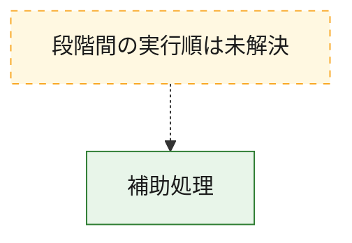
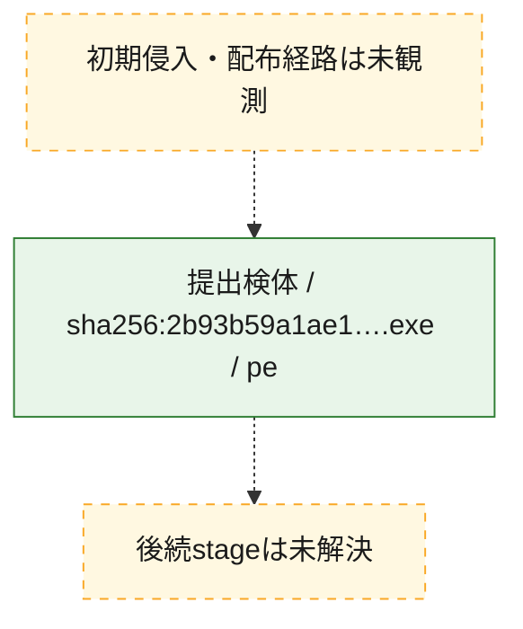
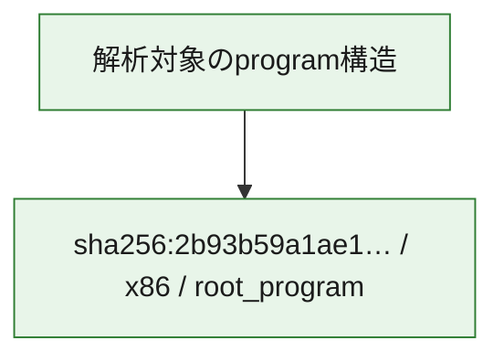

# 全体ロジック：2b93b59a1ae132e8c28ade72e560d11475c1c5870a9baf66deb4cd178812ddd2

代表関数から主要なmalware処理段階を自動分類できませんでした。

## 読み方

- phaseの掲載順は解析上の整理順です。observed_call_edgesがない段階間の実行順を断定しません。
- 図の実線は静的に観測した関係、点線と黄色のノードは未観測・未解決の関係を示します。
- 図は静的な要約であり、動的実行を再現するものではありません。
- 詳細な関数解説とfingerprintは[STATIC-LOGIC.md](STATIC-LOGIC.md)を参照してください。

## 静的可視化

### 実行フロー

### 感染チェーン

### モジュール関係

## 処理段階

### 1. 補助処理

主要処理を支える一般内部関数またはlibrary処理を確認します。
確度: `confirmed_static_function_evidence`

- `2b93b59a1ae132e8c28ade72e560d11475c1c5870a9baf66deb4cd178812ddd2:ghidra:00d21080` — 検体内部の一般処理を実装する関数です。 状態: `succeeded`、選定理由: `context_representative`, `reviewed_call_centrality:2`
- `2b93b59a1ae132e8c28ade72e560d11475c1c5870a9baf66deb4cd178812ddd2:ghidra:00d211a0` — 検体内部の一般処理を実装する関数です。 状態: `succeeded`、選定理由: `context_representative`, `reviewed_call_centrality:2`
- `2b93b59a1ae132e8c28ade72e560d11475c1c5870a9baf66deb4cd178812ddd2:ghidra:00d21200` — 検体内部の一般処理を実装する関数です。 状態: `succeeded`、選定理由: `context_representative`, `reviewed_call_centrality:4`
- `2b93b59a1ae132e8c28ade72e560d11475c1c5870a9baf66deb4cd178812ddd2:ghidra:00d21280` — 検体内部の一般処理を実装する関数です。 状態: `succeeded`、選定理由: `context_representative`, `reviewed_call_centrality:5`
- `2b93b59a1ae132e8c28ade72e560d11475c1c5870a9baf66deb4cd178812ddd2:ghidra:00d21340` — 検体内部の一般処理を実装する関数です。 状態: `succeeded`、選定理由: `context_representative`, `reviewed_call_centrality:5`
- `2b93b59a1ae132e8c28ade72e560d11475c1c5870a9baf66deb4cd178812ddd2:ghidra:00d21460` — 検体内部の一般処理を実装する関数です。 状態: `succeeded`、選定理由: `context_representative`, `reviewed_call_centrality:8`
- `2b93b59a1ae132e8c28ade72e560d11475c1c5870a9baf66deb4cd178812ddd2:ghidra:00d218e0` — 検体内部の一般処理を実装する関数です。 状態: `succeeded`、選定理由: `context_representative`, `reviewed_call_centrality:2`
- `2b93b59a1ae132e8c28ade72e560d11475c1c5870a9baf66deb4cd178812ddd2:ghidra:00d21a20` — 検体内部の一般処理を実装する関数です。 状態: `succeeded`、選定理由: `context_representative`, `reviewed_call_centrality:2`
- `2b93b59a1ae132e8c28ade72e560d11475c1c5870a9baf66deb4cd178812ddd2:ghidra:00d21aa0` — 検体内部の一般処理を実装する関数です。 状態: `succeeded`、選定理由: `context_representative`, `reviewed_call_centrality:3`
- `2b93b59a1ae132e8c28ade72e560d11475c1c5870a9baf66deb4cd178812ddd2:ghidra:00d21b00` — 検体内部の一般処理を実装する関数です。 状態: `succeeded`、選定理由: `context_representative`, `reviewed_call_centrality:11`
- `2b93b59a1ae132e8c28ade72e560d11475c1c5870a9baf66deb4cd178812ddd2:ghidra:00d22040` — 検体内部の一般処理を実装する関数です。 状態: `succeeded`、選定理由: `context_representative`, `reviewed_call_centrality:11`
- `2b93b59a1ae132e8c28ade72e560d11475c1c5870a9baf66deb4cd178812ddd2:ghidra:00d22940` — 検体内部の一般処理を実装する関数です。 状態: `succeeded`、選定理由: `context_representative`, `reviewed_call_centrality:2`
- `2b93b59a1ae132e8c28ade72e560d11475c1c5870a9baf66deb4cd178812ddd2:ghidra:00d229c0` — 検体内部の一般処理を実装する関数です。 状態: `succeeded`、選定理由: `context_representative`, `reviewed_call_centrality:2`
- `2b93b59a1ae132e8c28ade72e560d11475c1c5870a9baf66deb4cd178812ddd2:ghidra:00d235c0` — 検体内部の一般処理を実装する関数です。 状態: `succeeded`、選定理由: `context_representative`, `reviewed_call_centrality:2`
- `2b93b59a1ae132e8c28ade72e560d11475c1c5870a9baf66deb4cd178812ddd2:ghidra:00d23660` — 検体内部の一般処理を実装する関数です。 状態: `succeeded`、選定理由: `context_representative`, `reviewed_call_centrality:3`
- `2b93b59a1ae132e8c28ade72e560d11475c1c5870a9baf66deb4cd178812ddd2:ghidra:00d23740` — 検体内部の一般処理を実装する関数です。 状態: `succeeded`、選定理由: `context_representative`, `reviewed_call_centrality:3`
- `2b93b59a1ae132e8c28ade72e560d11475c1c5870a9baf66deb4cd178812ddd2:ghidra:00d23840` — 検体内部の一般処理を実装する関数です。 状態: `succeeded`、選定理由: `context_representative`, `reviewed_call_centrality:3`
- `2b93b59a1ae132e8c28ade72e560d11475c1c5870a9baf66deb4cd178812ddd2:ghidra:00d23e00` — 検体内部の一般処理を実装する関数です。 状態: `succeeded`、選定理由: `context_representative`, `reviewed_call_centrality:2`
- `2b93b59a1ae132e8c28ade72e560d11475c1c5870a9baf66deb4cd178812ddd2:ghidra:00d23e40` — 検体内部の一般処理を実装する関数です。 状態: `succeeded`、選定理由: `context_representative`, `reviewed_call_centrality:2`
- `2b93b59a1ae132e8c28ade72e560d11475c1c5870a9baf66deb4cd178812ddd2:ghidra:00d23fa0` — 検体内部の一般処理を実装する関数です。 状態: `succeeded`、選定理由: `context_representative`, `reviewed_call_centrality:2`
- `2b93b59a1ae132e8c28ade72e560d11475c1c5870a9baf66deb4cd178812ddd2:ghidra:00d23fe0` — 検体内部の一般処理を実装する関数です。 状態: `succeeded`、選定理由: `context_representative`, `reviewed_call_centrality:2`
- `2b93b59a1ae132e8c28ade72e560d11475c1c5870a9baf66deb4cd178812ddd2:ghidra:00d24020` — 検体内部の一般処理を実装する関数です。 状態: `succeeded`、選定理由: `context_representative`, `reviewed_call_centrality:2`
- `2b93b59a1ae132e8c28ade72e560d11475c1c5870a9baf66deb4cd178812ddd2:ghidra:00d24060` — 検体内部の一般処理を実装する関数です。 状態: `succeeded`、選定理由: `context_representative`, `reviewed_call_centrality:5`
- `2b93b59a1ae132e8c28ade72e560d11475c1c5870a9baf66deb4cd178812ddd2:ghidra:00d24120` — 検体内部の一般処理を実装する関数です。 状態: `succeeded`、選定理由: `context_representative`, `reviewed_call_centrality:5`
- `2b93b59a1ae132e8c28ade72e560d11475c1c5870a9baf66deb4cd178812ddd2:ghidra:00d241e0` — 検体内部の一般処理を実装する関数です。 状態: `succeeded`、選定理由: `context_representative`, `reviewed_call_centrality:2`
- `2b93b59a1ae132e8c28ade72e560d11475c1c5870a9baf66deb4cd178812ddd2:ghidra:00d24240` — 検体内部の一般処理を実装する関数です。 状態: `succeeded`、選定理由: `context_representative`, `reviewed_call_centrality:2`
- `2b93b59a1ae132e8c28ade72e560d11475c1c5870a9baf66deb4cd178812ddd2:ghidra:00d242a0` — 検体内部の一般処理を実装する関数です。 状態: `succeeded`、選定理由: `context_representative`, `reviewed_call_centrality:7`
- `2b93b59a1ae132e8c28ade72e560d11475c1c5870a9baf66deb4cd178812ddd2:ghidra:00d243a0` — 検体内部の一般処理を実装する関数です。 状態: `succeeded`、選定理由: `context_representative`, `reviewed_call_centrality:5`
- `2b93b59a1ae132e8c28ade72e560d11475c1c5870a9baf66deb4cd178812ddd2:ghidra:00d24760` — 検体内部の一般処理を実装する関数です。 状態: `succeeded`、選定理由: `context_representative`, `reviewed_call_centrality:2`
- `2b93b59a1ae132e8c28ade72e560d11475c1c5870a9baf66deb4cd178812ddd2:ghidra:00d247c0` — 検体内部の一般処理を実装する関数です。 状態: `succeeded`、選定理由: `context_representative`, `reviewed_call_centrality:2`
- `2b93b59a1ae132e8c28ade72e560d11475c1c5870a9baf66deb4cd178812ddd2:ghidra:00d24820` — 検体内部の一般処理を実装する関数です。 状態: `succeeded`、選定理由: `context_representative`, `reviewed_call_centrality:2`
- `2b93b59a1ae132e8c28ade72e560d11475c1c5870a9baf66deb4cd178812ddd2:ghidra:00d24880` — 検体内部の一般処理を実装する関数です。 状態: `succeeded`、選定理由: `context_representative`, `reviewed_call_centrality:6`

## 観測したcall関係

- `2b93b59a1ae132e8c28ade72e560d11475c1c5870a9baf66deb4cd178812ddd2:ghidra:00d21aa0` → `2b93b59a1ae132e8c28ade72e560d11475c1c5870a9baf66deb4cd178812ddd2:ghidra:00d21b00` （`support` → `support`）
- `2b93b59a1ae132e8c28ade72e560d11475c1c5870a9baf66deb4cd178812ddd2:ghidra:00d21aa0` → `2b93b59a1ae132e8c28ade72e560d11475c1c5870a9baf66deb4cd178812ddd2:ghidra:00d22040` （`support` → `support`）
- `2b93b59a1ae132e8c28ade72e560d11475c1c5870a9baf66deb4cd178812ddd2:ghidra:00d235c0` → `2b93b59a1ae132e8c28ade72e560d11475c1c5870a9baf66deb4cd178812ddd2:ghidra:00d23840` （`support` → `support`）
- `2b93b59a1ae132e8c28ade72e560d11475c1c5870a9baf66deb4cd178812ddd2:ghidra:00d23660` → `2b93b59a1ae132e8c28ade72e560d11475c1c5870a9baf66deb4cd178812ddd2:ghidra:00d23840` （`support` → `support`）
- `2b93b59a1ae132e8c28ade72e560d11475c1c5870a9baf66deb4cd178812ddd2:ghidra:00d23740` → `2b93b59a1ae132e8c28ade72e560d11475c1c5870a9baf66deb4cd178812ddd2:ghidra:00d23660` （`support` → `support`）
- `2b93b59a1ae132e8c28ade72e560d11475c1c5870a9baf66deb4cd178812ddd2:ghidra:00d23740` → `2b93b59a1ae132e8c28ade72e560d11475c1c5870a9baf66deb4cd178812ddd2:ghidra:00d23840` （`support` → `support`）
- `2b93b59a1ae132e8c28ade72e560d11475c1c5870a9baf66deb4cd178812ddd2:ghidra:00d241e0` → `2b93b59a1ae132e8c28ade72e560d11475c1c5870a9baf66deb4cd178812ddd2:ghidra:00d24060` （`support` → `support`）
- `2b93b59a1ae132e8c28ade72e560d11475c1c5870a9baf66deb4cd178812ddd2:ghidra:00d24240` → `2b93b59a1ae132e8c28ade72e560d11475c1c5870a9baf66deb4cd178812ddd2:ghidra:00d24120` （`support` → `support`）
- `2b93b59a1ae132e8c28ade72e560d11475c1c5870a9baf66deb4cd178812ddd2:ghidra:00d243a0` → `2b93b59a1ae132e8c28ade72e560d11475c1c5870a9baf66deb4cd178812ddd2:ghidra:00d21200` （`support` → `support`）
- `2b93b59a1ae132e8c28ade72e560d11475c1c5870a9baf66deb4cd178812ddd2:ghidra:00d24820` → `2b93b59a1ae132e8c28ade72e560d11475c1c5870a9baf66deb4cd178812ddd2:ghidra:00d24880` （`support` → `support`）
- `ghidra-function:105bbb068f442fa1210bdab4` → `ghidra-external:f977af0a203f01ac7635d7f0` （`unclassified` → `unclassified`）
- `ghidra-function:105bbb068f442fa1210bdab4` → `ghidra-function:5987be92ff257bf7ac42b791` （`unclassified` → `unclassified`）
- `ghidra-function:105bbb068f442fa1210bdab4` → `ghidra-function:8060173b40e1fbfe7befa882` （`unclassified` → `unclassified`）
- `ghidra-function:202448f1bedab71550ff2f90` → `ghidra-external:e87ea7be48c5940d9495d693` （`unclassified` → `unclassified`）
- `ghidra-function:202448f1bedab71550ff2f90` → `ghidra-external:f977af0a203f01ac7635d7f0` （`unclassified` → `unclassified`）
- `ghidra-function:202448f1bedab71550ff2f90` → `ghidra-function:332953a2838a5e564188f462` （`unclassified` → `unclassified`）
- `ghidra-function:202448f1bedab71550ff2f90` → `ghidra-function:694a6bb3b25997711e0730cb` （`unclassified` → `unclassified`）
- `ghidra-function:202448f1bedab71550ff2f90` → `ghidra-function:a96a0db26c178f0dda826e09` （`unclassified` → `unclassified`）
- `ghidra-function:230474a91777683c3e4f753b` → `ghidra-external:f977af0a203f01ac7635d7f0` （`unclassified` → `unclassified`）
- `ghidra-function:230474a91777683c3e4f753b` → `ghidra-function:5987be92ff257bf7ac42b791` （`unclassified` → `unclassified`）
- `ghidra-function:2344abeae4e0f2640845d259` → `ghidra-external:92bce6d07afc847bf9aea27d` （`unclassified` → `unclassified`）
- `ghidra-function:2344abeae4e0f2640845d259` → `ghidra-external:f977af0a203f01ac7635d7f0` （`unclassified` → `unclassified`）
- `ghidra-function:2344abeae4e0f2640845d259` → `ghidra-function:47a043bb8914022dc1c86fb2` （`unclassified` → `unclassified`）
- `ghidra-function:2344abeae4e0f2640845d259` → `ghidra-function:8c252c7733a8d0ae9b1edd4c` （`unclassified` → `unclassified`）
- `ghidra-function:2344abeae4e0f2640845d259` → `ghidra-function:8f3491fc2c6a4ccdaa99b43c` （`unclassified` → `unclassified`）
- `ghidra-function:2344abeae4e0f2640845d259` → `ghidra-function:f96be42bda0f7f9746dc71ea` （`unclassified` → `unclassified`）
- `ghidra-function:2344abeae4e0f2640845d259` → `ghidra-function:fc9720dff261b53da01c0010` （`unclassified` → `unclassified`）
- `ghidra-function:2755a2c441a750d6d3458b7e` → `ghidra-external:3350c01289aa1349528d7926` （`unclassified` → `unclassified`）
- `ghidra-function:2755a2c441a750d6d3458b7e` → `ghidra-external:f977af0a203f01ac7635d7f0` （`unclassified` → `unclassified`）
- `ghidra-function:2b082caa8bd86420110acfe5` → `ghidra-external:4e6381934406b2a095dcbbb0` （`unclassified` → `unclassified`）
- `ghidra-function:2b082caa8bd86420110acfe5` → `ghidra-external:9ea132a26dd4a21fceea5e01` （`unclassified` → `unclassified`）
- `ghidra-function:2b082caa8bd86420110acfe5` → `ghidra-external:f977af0a203f01ac7635d7f0` （`unclassified` → `unclassified`）
- `ghidra-function:2b082caa8bd86420110acfe5` → `ghidra-function:7ad48d3646c2977305b3ec99` （`unclassified` → `unclassified`）
- `ghidra-function:2f06a458ee8baa4ae3c61c25` → `ghidra-external:1aaa67deace0ce7655f285bc` （`unclassified` → `unclassified`）
- `ghidra-function:2f06a458ee8baa4ae3c61c25` → `ghidra-external:b1b378ab6d207731b8bf3303` （`unclassified` → `unclassified`）
- `ghidra-function:2f06a458ee8baa4ae3c61c25` → `ghidra-function:332953a2838a5e564188f462` （`unclassified` → `unclassified`）
- `ghidra-function:2fb24a435dcbc376b1c8e19e` → `ghidra-external:9ea132a26dd4a21fceea5e01` （`unclassified` → `unclassified`）
- `ghidra-function:2fb24a435dcbc376b1c8e19e` → `ghidra-external:f977af0a203f01ac7635d7f0` （`unclassified` → `unclassified`）
- `ghidra-function:34b61834de8015b27944ddac` → `ghidra-external:675f313cda60a3c1698eb784` （`unclassified` → `unclassified`）
- `ghidra-function:34b61834de8015b27944ddac` → `ghidra-external:f977af0a203f01ac7635d7f0` （`unclassified` → `unclassified`）
- `ghidra-function:450fa20fef90364901ce7ca0` → `ghidra-external:f977af0a203f01ac7635d7f0` （`unclassified` → `unclassified`）
- `ghidra-function:450fa20fef90364901ce7ca0` → `ghidra-function:904b296f60a1244fb3b648f5` （`unclassified` → `unclassified`）
- `ghidra-function:450fa20fef90364901ce7ca0` → `ghidra-function:c8036754b790182e47f090d0` （`unclassified` → `unclassified`）
- `ghidra-function:4f8e244ca6aa10d974500c15` → `ghidra-external:8be8be02e3a3467d317c2bff` （`unclassified` → `unclassified`）
- `ghidra-function:4f8e244ca6aa10d974500c15` → `ghidra-external:f977af0a203f01ac7635d7f0` （`unclassified` → `unclassified`）
- `ghidra-function:585447c47ff71d31039a2581` → `ghidra-external:b1b378ab6d207731b8bf3303` （`unclassified` → `unclassified`）
- `ghidra-function:585447c47ff71d31039a2581` → `ghidra-external:be1696caaee8a02b6791fb66` （`unclassified` → `unclassified`）
- `ghidra-function:5b54cab251659d184b2f37f9` → `ghidra-external:f977af0a203f01ac7635d7f0` （`unclassified` → `unclassified`）
- `ghidra-function:5b54cab251659d184b2f37f9` → `ghidra-function:516198eaa2aaa01e2310635b` （`unclassified` → `unclassified`）
- `ghidra-function:5c6ca1309f1c90090abeb682` → `ghidra-external:7a83abce1d7eef2c9a0124c1` （`unclassified` → `unclassified`）
- `ghidra-function:5c6ca1309f1c90090abeb682` → `ghidra-external:f977af0a203f01ac7635d7f0` （`unclassified` → `unclassified`）
- `ghidra-function:5f370ade108a9bc9af9369dc` → `ghidra-external:f977af0a203f01ac7635d7f0` （`unclassified` → `unclassified`）
- `ghidra-function:5f370ade108a9bc9af9369dc` → `ghidra-function:9371b19c0794a62758b9ca82` （`unclassified` → `unclassified`）
- `ghidra-function:5fd7382d55b8e51ea0f32123` → `ghidra-external:f977af0a203f01ac7635d7f0` （`unclassified` → `unclassified`）
- `ghidra-function:5fd7382d55b8e51ea0f32123` → `ghidra-function:f96be42bda0f7f9746dc71ea` （`unclassified` → `unclassified`）
- `ghidra-function:622b7b3657274c9aab1fd0b9` → `ghidra-external:7a83abce1d7eef2c9a0124c1` （`unclassified` → `unclassified`）
- `ghidra-function:622b7b3657274c9aab1fd0b9` → `ghidra-external:f977af0a203f01ac7635d7f0` （`unclassified` → `unclassified`）
- `ghidra-function:6ad1c4fd10c56a664ce2d327` → `ghidra-external:f977af0a203f01ac7635d7f0` （`unclassified` → `unclassified`）
- `ghidra-function:6ad1c4fd10c56a664ce2d327` → `ghidra-function:2f06a458ee8baa4ae3c61c25` （`unclassified` → `unclassified`）
- `ghidra-function:6ad1c4fd10c56a664ce2d327` → `ghidra-function:47a043bb8914022dc1c86fb2` （`unclassified` → `unclassified`）
- `ghidra-function:6ad1c4fd10c56a664ce2d327` → `ghidra-function:8f3491fc2c6a4ccdaa99b43c` （`unclassified` → `unclassified`）
- `ghidra-function:6ad1c4fd10c56a664ce2d327` → `ghidra-function:fc9720dff261b53da01c0010` （`unclassified` → `unclassified`）
- `ghidra-function:7b7617e0d339eb6c72801db3` → `ghidra-external:f977af0a203f01ac7635d7f0` （`unclassified` → `unclassified`）
- `ghidra-function:7b7617e0d339eb6c72801db3` → `ghidra-function:af51a780fb037eb8f00004e2` （`unclassified` → `unclassified`）
- `ghidra-function:8060173b40e1fbfe7befa882` → `ghidra-external:f977af0a203f01ac7635d7f0` （`unclassified` → `unclassified`）
- `ghidra-function:8060173b40e1fbfe7befa882` → `ghidra-function:5987be92ff257bf7ac42b791` （`unclassified` → `unclassified`）
- `ghidra-function:904b296f60a1244fb3b648f5` → `ghidra-external:48f92732654c05a9d0734b8d` （`unclassified` → `unclassified`）
- `ghidra-function:904b296f60a1244fb3b648f5` → `ghidra-external:505aa5f5ed40750fc5d27248` （`unclassified` → `unclassified`）
- `ghidra-function:904b296f60a1244fb3b648f5` → `ghidra-external:6463abbf0eb7170538bba4bd` （`unclassified` → `unclassified`）
- `ghidra-function:904b296f60a1244fb3b648f5` → `ghidra-external:72aef2e6fc9de99f8f689cc0` （`unclassified` → `unclassified`）
- `ghidra-function:904b296f60a1244fb3b648f5` → `ghidra-external:8be8be02e3a3467d317c2bff` （`unclassified` → `unclassified`）
- `ghidra-function:904b296f60a1244fb3b648f5` → `ghidra-external:eb891b26acfd317fb657f7c2` （`unclassified` → `unclassified`）
- `ghidra-function:904b296f60a1244fb3b648f5` → `ghidra-external:f977af0a203f01ac7635d7f0` （`unclassified` → `unclassified`）
- `ghidra-function:904b296f60a1244fb3b648f5` → `ghidra-external:fe96028483f76e793d2ca98a` （`unclassified` → `unclassified`）
- `ghidra-function:904b296f60a1244fb3b648f5` → `ghidra-function:7e92fd82633b54794751c118` （`unclassified` → `unclassified`）
- `ghidra-function:904b296f60a1244fb3b648f5` → `ghidra-function:841cd808d731c6792cea0401` （`unclassified` → `unclassified`）
- `ghidra-function:9371b19c0794a62758b9ca82` → `ghidra-external:f977af0a203f01ac7635d7f0` （`unclassified` → `unclassified`）
- `ghidra-function:9371b19c0794a62758b9ca82` → `ghidra-function:47a043bb8914022dc1c86fb2` （`unclassified` → `unclassified`）
- `ghidra-function:9371b19c0794a62758b9ca82` → `ghidra-function:8f3491fc2c6a4ccdaa99b43c` （`unclassified` → `unclassified`）
- `ghidra-function:9371b19c0794a62758b9ca82` → `ghidra-function:f96be42bda0f7f9746dc71ea` （`unclassified` → `unclassified`）
- `ghidra-function:9371b19c0794a62758b9ca82` → `ghidra-function:fc9720dff261b53da01c0010` （`unclassified` → `unclassified`）
- `ghidra-function:af51a780fb037eb8f00004e2` → `ghidra-external:4e6381934406b2a095dcbbb0` （`unclassified` → `unclassified`）
- `ghidra-function:af51a780fb037eb8f00004e2` → `ghidra-external:9ea132a26dd4a21fceea5e01` （`unclassified` → `unclassified`）
- `ghidra-function:af51a780fb037eb8f00004e2` → `ghidra-external:f977af0a203f01ac7635d7f0` （`unclassified` → `unclassified`）
- `ghidra-function:af51a780fb037eb8f00004e2` → `ghidra-function:7ad48d3646c2977305b3ec99` （`unclassified` → `unclassified`）
- `ghidra-function:bc031a3af6245ee642befc02` → `ghidra-external:7a83abce1d7eef2c9a0124c1` （`unclassified` → `unclassified`）
- `ghidra-function:bc031a3af6245ee642befc02` → `ghidra-external:f977af0a203f01ac7635d7f0` （`unclassified` → `unclassified`）
- `ghidra-function:c46b117f05262a98fe11fff9` → `ghidra-external:be1696caaee8a02b6791fb66` （`unclassified` → `unclassified`）
- `ghidra-function:c46b117f05262a98fe11fff9` → `ghidra-function:31bb054c81750d2607f67290` （`unclassified` → `unclassified`）
- `ghidra-function:c6053ebbdb92d0f5c20e695a` → `ghidra-external:7a83abce1d7eef2c9a0124c1` （`unclassified` → `unclassified`）
- `ghidra-function:c6053ebbdb92d0f5c20e695a` → `ghidra-external:f977af0a203f01ac7635d7f0` （`unclassified` → `unclassified`）
- `ghidra-function:c8036754b790182e47f090d0` → `ghidra-external:1aaa67deace0ce7655f285bc` （`unclassified` → `unclassified`）
- `ghidra-function:c8036754b790182e47f090d0` → `ghidra-external:52e677b15b66a252fb8ec206` （`unclassified` → `unclassified`）
- `ghidra-function:c8036754b790182e47f090d0` → `ghidra-external:7a83abce1d7eef2c9a0124c1` （`unclassified` → `unclassified`）
- `ghidra-function:c8036754b790182e47f090d0` → `ghidra-external:92bce6d07afc847bf9aea27d` （`unclassified` → `unclassified`）
- `ghidra-function:c8036754b790182e47f090d0` → `ghidra-external:be1696caaee8a02b6791fb66` （`unclassified` → `unclassified`）
- `ghidra-function:c8036754b790182e47f090d0` → `ghidra-external:f1440e9aebe3e9f20f581ae1` （`unclassified` → `unclassified`）
- `ghidra-function:c8036754b790182e47f090d0` → `ghidra-external:f977af0a203f01ac7635d7f0` （`unclassified` → `unclassified`）
- `ghidra-function:c8036754b790182e47f090d0` → `ghidra-function:603455273c8a96774985ac93` （`unclassified` → `unclassified`）
- `ghidra-function:c8036754b790182e47f090d0` → `ghidra-function:73bbe43692e40e65fc618c42` （`unclassified` → `unclassified`）
- `ghidra-function:c8036754b790182e47f090d0` → `ghidra-function:a16cbd1793fe247fedf93db6` （`unclassified` → `unclassified`）
- `ghidra-function:d1933c8db8bac390be5ef771` → `ghidra-external:7a83abce1d7eef2c9a0124c1` （`unclassified` → `unclassified`）
- `ghidra-function:d1933c8db8bac390be5ef771` → `ghidra-external:f977af0a203f01ac7635d7f0` （`unclassified` → `unclassified`）
- `ghidra-function:d2a0f093949b77a70153c4a1` → `ghidra-external:52e677b15b66a252fb8ec206` （`unclassified` → `unclassified`）
- `ghidra-function:d2a0f093949b77a70153c4a1` → `ghidra-external:75ae8f1e5b097f70b499552c` （`unclassified` → `unclassified`）
- `ghidra-function:d2a0f093949b77a70153c4a1` → `ghidra-external:be1696caaee8a02b6791fb66` （`unclassified` → `unclassified`）
- `ghidra-function:d2a0f093949b77a70153c4a1` → `ghidra-external:f977af0a203f01ac7635d7f0` （`unclassified` → `unclassified`）
- `ghidra-function:d2a0f093949b77a70153c4a1` → `ghidra-function:b4db96a95484036bf4497806` （`unclassified` → `unclassified`）
- `ghidra-function:d2a0f093949b77a70153c4a1` → `ghidra-function:e340c8233fefa49acb5d7c1d` （`unclassified` → `unclassified`）
- `ghidra-function:d2a0f093949b77a70153c4a1` → `ghidra-function:f96be42bda0f7f9746dc71ea` （`unclassified` → `unclassified`）
- `ghidra-function:d2a0f093949b77a70153c4a1` → `ghidra-function:fc9720dff261b53da01c0010` （`unclassified` → `unclassified`）
- `ghidra-function:e26c1e584e70b4e557272383` → `ghidra-external:e87ea7be48c5940d9495d693` （`unclassified` → `unclassified`）
- `ghidra-function:e26c1e584e70b4e557272383` → `ghidra-external:f977af0a203f01ac7635d7f0` （`unclassified` → `unclassified`）
- `ghidra-function:e26c1e584e70b4e557272383` → `ghidra-function:332953a2838a5e564188f462` （`unclassified` → `unclassified`）
- `ghidra-function:e26c1e584e70b4e557272383` → `ghidra-function:694a6bb3b25997711e0730cb` （`unclassified` → `unclassified`）
- `ghidra-function:e26c1e584e70b4e557272383` → `ghidra-function:a96a0db26c178f0dda826e09` （`unclassified` → `unclassified`）
- `ghidra-function:fed160371ed56eb0ffa03655` → `ghidra-external:f977af0a203f01ac7635d7f0` （`unclassified` → `unclassified`）
- `ghidra-function:fed160371ed56eb0ffa03655` → `ghidra-function:2b082caa8bd86420110acfe5` （`unclassified` → `unclassified`）

## 解析範囲と制約

- 選定外関数は全体inventoryへ残しますが、関数本体の個別解説対象にはしていません。
- indirect call、難読化、packer、VM、壊れたcontrol flowによりcall関係が欠落する場合があります。
- 文書は静的解析に基づき、検体実行や外部通信による動的確認は行っていません。
