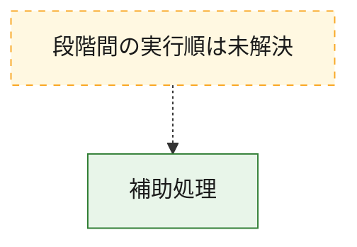
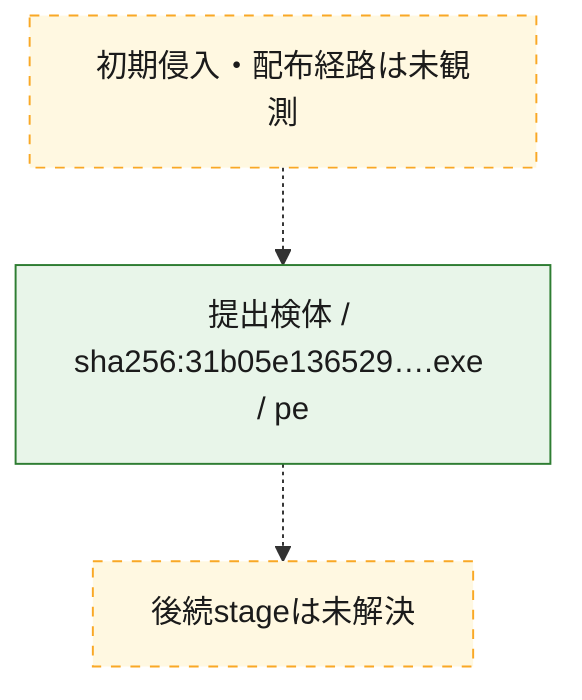
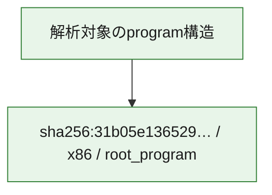

# 全体ロジック：31b05e1365291fe2486c3fa4e68e17ce11a07b4d97e419604f0fbbb2b137f49e

代表関数から主要なmalware処理段階を自動分類できませんでした。

## 読み方

- phaseの掲載順は解析上の整理順です。observed_call_edgesがない段階間の実行順を断定しません。
- 図の実線は静的に観測した関係、点線と黄色のノードは未観測・未解決の関係を示します。
- 図は静的な要約であり、動的実行を再現するものではありません。
- 詳細な関数解説とfingerprintは[STATIC-LOGIC.md](STATIC-LOGIC.md)を参照してください。

## 静的可視化

### 実行フロー

### 感染チェーン

### モジュール関係

## 処理段階

### 1. 補助処理

主要処理を支える一般内部関数またはlibrary処理を確認します。
確度: `confirmed_static_function_evidence`

- `31b05e1365291fe2486c3fa4e68e17ce11a07b4d97e419604f0fbbb2b137f49e:ghidra:140001080` — 検体内部の一般処理を実装する関数です。 状態: `succeeded`、選定理由: `context_representative`, `reviewed_call_centrality:4`
- `31b05e1365291fe2486c3fa4e68e17ce11a07b4d97e419604f0fbbb2b137f49e:ghidra:140001180` — 検体内部の一般処理を実装する関数です。 状態: `succeeded`、選定理由: `context_representative`, `reviewed_call_centrality:2`
- `31b05e1365291fe2486c3fa4e68e17ce11a07b4d97e419604f0fbbb2b137f49e:ghidra:1400012a0` — 検体内部の一般処理を実装する関数です。 状態: `succeeded`、選定理由: `context_representative`, `reviewed_call_centrality:4`
- `31b05e1365291fe2486c3fa4e68e17ce11a07b4d97e419604f0fbbb2b137f49e:ghidra:140001320` — 検体内部の一般処理を実装する関数です。 状態: `succeeded`、選定理由: `context_representative`, `reviewed_call_centrality:4`
- `31b05e1365291fe2486c3fa4e68e17ce11a07b4d97e419604f0fbbb2b137f49e:ghidra:1400013c0` — 検体内部の一般処理を実装する関数です。 状態: `succeeded`、選定理由: `context_representative`, `reviewed_call_centrality:4`
- `31b05e1365291fe2486c3fa4e68e17ce11a07b4d97e419604f0fbbb2b137f49e:ghidra:1400014c0` — 検体内部の一般処理を実装する関数です。 状態: `succeeded`、選定理由: `context_representative`, `reviewed_call_centrality:3`
- `31b05e1365291fe2486c3fa4e68e17ce11a07b4d97e419604f0fbbb2b137f49e:ghidra:140001560` — 検体内部の一般処理を実装する関数です。 状態: `succeeded`、選定理由: `context_representative`, `reviewed_call_centrality:2`
- `31b05e1365291fe2486c3fa4e68e17ce11a07b4d97e419604f0fbbb2b137f49e:ghidra:1400015e0` — 検体内部の一般処理を実装する関数です。 状態: `succeeded`、選定理由: `context_representative`, `reviewed_call_centrality:3`
- `31b05e1365291fe2486c3fa4e68e17ce11a07b4d97e419604f0fbbb2b137f49e:ghidra:140001640` — 検体内部の一般処理を実装する関数です。 状態: `succeeded`、選定理由: `context_representative`, `reviewed_call_centrality:8`
- `31b05e1365291fe2486c3fa4e68e17ce11a07b4d97e419604f0fbbb2b137f49e:ghidra:140001b40` — 検体内部の一般処理を実装する関数です。 状態: `succeeded`、選定理由: `context_representative`, `reviewed_call_centrality:11`
- `31b05e1365291fe2486c3fa4e68e17ce11a07b4d97e419604f0fbbb2b137f49e:ghidra:1400026c0` — 検体内部の一般処理を実装する関数です。 状態: `succeeded`、選定理由: `context_representative`, `reviewed_call_centrality:2`
- `31b05e1365291fe2486c3fa4e68e17ce11a07b4d97e419604f0fbbb2b137f49e:ghidra:140002740` — 検体内部の一般処理を実装する関数です。 状態: `succeeded`、選定理由: `context_representative`, `reviewed_call_centrality:2`
- `31b05e1365291fe2486c3fa4e68e17ce11a07b4d97e419604f0fbbb2b137f49e:ghidra:1400033c0` — 検体内部の一般処理を実装する関数です。 状態: `succeeded`、選定理由: `context_representative`, `reviewed_call_centrality:10`
- `31b05e1365291fe2486c3fa4e68e17ce11a07b4d97e419604f0fbbb2b137f49e:ghidra:140003600` — 検体内部の一般処理を実装する関数です。 状態: `succeeded`、選定理由: `context_representative`, `reviewed_call_centrality:6`
- `31b05e1365291fe2486c3fa4e68e17ce11a07b4d97e419604f0fbbb2b137f49e:ghidra:140003880` — 検体内部の一般処理を実装する関数です。 状態: `succeeded`、選定理由: `context_representative`, `reviewed_call_centrality:7`
- `31b05e1365291fe2486c3fa4e68e17ce11a07b4d97e419604f0fbbb2b137f49e:ghidra:1400039e0` — 検体内部の一般処理を実装する関数です。 状態: `succeeded`、選定理由: `context_representative`, `reviewed_call_centrality:9`
- `31b05e1365291fe2486c3fa4e68e17ce11a07b4d97e419604f0fbbb2b137f49e:ghidra:140003cc0` — 検体内部の一般処理を実装する関数です。 状態: `succeeded`、選定理由: `context_representative`, `reviewed_call_centrality:3`
- `31b05e1365291fe2486c3fa4e68e17ce11a07b4d97e419604f0fbbb2b137f49e:ghidra:140003d40` — 検体内部の一般処理を実装する関数です。 状態: `succeeded`、選定理由: `context_representative`, `reviewed_call_centrality:5`
- `31b05e1365291fe2486c3fa4e68e17ce11a07b4d97e419604f0fbbb2b137f49e:ghidra:140003ee0` — 検体内部の一般処理を実装する関数です。 状態: `succeeded`、選定理由: `context_representative`, `reviewed_call_centrality:3`
- `31b05e1365291fe2486c3fa4e68e17ce11a07b4d97e419604f0fbbb2b137f49e:ghidra:1400040e0` — 検体内部の一般処理を実装する関数です。 状態: `succeeded`、選定理由: `context_representative`, `reviewed_call_centrality:3`
- `31b05e1365291fe2486c3fa4e68e17ce11a07b4d97e419604f0fbbb2b137f49e:ghidra:140004140` — 検体内部の一般処理を実装する関数です。 状態: `succeeded`、選定理由: `context_representative`, `reviewed_call_centrality:6`
- `31b05e1365291fe2486c3fa4e68e17ce11a07b4d97e419604f0fbbb2b137f49e:ghidra:1400042a0` — 検体内部の一般処理を実装する関数です。 状態: `succeeded`、選定理由: `context_representative`, `reviewed_call_centrality:6`
- `31b05e1365291fe2486c3fa4e68e17ce11a07b4d97e419604f0fbbb2b137f49e:ghidra:140004400` — 検体内部の一般処理を実装する関数です。 状態: `succeeded`、選定理由: `context_representative`, `reviewed_call_centrality:2`
- `31b05e1365291fe2486c3fa4e68e17ce11a07b4d97e419604f0fbbb2b137f49e:ghidra:140004620` — 検体内部の一般処理を実装する関数です。 状態: `succeeded`、選定理由: `context_representative`, `reviewed_call_centrality:8`
- `31b05e1365291fe2486c3fa4e68e17ce11a07b4d97e419604f0fbbb2b137f49e:ghidra:140004860` — 検体内部の一般処理を実装する関数です。 状態: `succeeded`、選定理由: `context_representative`, `reviewed_call_centrality:8`
- `31b05e1365291fe2486c3fa4e68e17ce11a07b4d97e419604f0fbbb2b137f49e:ghidra:140004960` — 検体内部の一般処理を実装する関数です。 状態: `succeeded`、選定理由: `context_representative`, `reviewed_call_centrality:5`
- `31b05e1365291fe2486c3fa4e68e17ce11a07b4d97e419604f0fbbb2b137f49e:ghidra:140004a80` — 検体内部の一般処理を実装する関数です。 状態: `succeeded`、選定理由: `context_representative`, `reviewed_call_centrality:7`
- `31b05e1365291fe2486c3fa4e68e17ce11a07b4d97e419604f0fbbb2b137f49e:ghidra:140004c60` — 検体内部の一般処理を実装する関数です。 状態: `succeeded`、選定理由: `context_representative`, `reviewed_call_centrality:5`
- `31b05e1365291fe2486c3fa4e68e17ce11a07b4d97e419604f0fbbb2b137f49e:ghidra:140004fe0` — 検体内部の一般処理を実装する関数です。 状態: `succeeded`、選定理由: `context_representative`, `reviewed_call_centrality:3`
- `31b05e1365291fe2486c3fa4e68e17ce11a07b4d97e419604f0fbbb2b137f49e:ghidra:140005040` — 検体内部の一般処理を実装する関数です。 状態: `succeeded`、選定理由: `context_representative`, `reviewed_call_centrality:5`
- `31b05e1365291fe2486c3fa4e68e17ce11a07b4d97e419604f0fbbb2b137f49e:ghidra:140005260` — 検体内部の一般処理を実装する関数です。 状態: `succeeded`、選定理由: `context_representative`, `reviewed_call_centrality:5`
- `31b05e1365291fe2486c3fa4e68e17ce11a07b4d97e419604f0fbbb2b137f49e:ghidra:140005440` — 検体内部の一般処理を実装する関数です。 状態: `succeeded`、選定理由: `context_representative`, `reviewed_call_centrality:8`

## 観測したcall関係

- `31b05e1365291fe2486c3fa4e68e17ce11a07b4d97e419604f0fbbb2b137f49e:ghidra:1400015e0` → `31b05e1365291fe2486c3fa4e68e17ce11a07b4d97e419604f0fbbb2b137f49e:ghidra:140001640` （`support` → `support`）
- `31b05e1365291fe2486c3fa4e68e17ce11a07b4d97e419604f0fbbb2b137f49e:ghidra:1400015e0` → `31b05e1365291fe2486c3fa4e68e17ce11a07b4d97e419604f0fbbb2b137f49e:ghidra:140001b40` （`support` → `support`）
- `31b05e1365291fe2486c3fa4e68e17ce11a07b4d97e419604f0fbbb2b137f49e:ghidra:1400033c0` → `31b05e1365291fe2486c3fa4e68e17ce11a07b4d97e419604f0fbbb2b137f49e:ghidra:140004860` （`support` → `support`）
- `31b05e1365291fe2486c3fa4e68e17ce11a07b4d97e419604f0fbbb2b137f49e:ghidra:140003d40` → `31b05e1365291fe2486c3fa4e68e17ce11a07b4d97e419604f0fbbb2b137f49e:ghidra:140004860` （`support` → `support`）
- `31b05e1365291fe2486c3fa4e68e17ce11a07b4d97e419604f0fbbb2b137f49e:ghidra:140003d40` → `31b05e1365291fe2486c3fa4e68e17ce11a07b4d97e419604f0fbbb2b137f49e:ghidra:140004a80` （`support` → `support`）
- `31b05e1365291fe2486c3fa4e68e17ce11a07b4d97e419604f0fbbb2b137f49e:ghidra:140003ee0` → `31b05e1365291fe2486c3fa4e68e17ce11a07b4d97e419604f0fbbb2b137f49e:ghidra:1400012a0` （`support` → `support`）
- `31b05e1365291fe2486c3fa4e68e17ce11a07b4d97e419604f0fbbb2b137f49e:ghidra:140004860` → `31b05e1365291fe2486c3fa4e68e17ce11a07b4d97e419604f0fbbb2b137f49e:ghidra:140004960` （`support` → `support`）
- `31b05e1365291fe2486c3fa4e68e17ce11a07b4d97e419604f0fbbb2b137f49e:ghidra:140004fe0` → `31b05e1365291fe2486c3fa4e68e17ce11a07b4d97e419604f0fbbb2b137f49e:ghidra:140005040` （`support` → `support`）
- `31b05e1365291fe2486c3fa4e68e17ce11a07b4d97e419604f0fbbb2b137f49e:ghidra:140004fe0` → `31b05e1365291fe2486c3fa4e68e17ce11a07b4d97e419604f0fbbb2b137f49e:ghidra:140005260` （`support` → `support`）
- `31b05e1365291fe2486c3fa4e68e17ce11a07b4d97e419604f0fbbb2b137f49e:ghidra:140005040` → `31b05e1365291fe2486c3fa4e68e17ce11a07b4d97e419604f0fbbb2b137f49e:ghidra:140003600` （`support` → `support`）
- `31b05e1365291fe2486c3fa4e68e17ce11a07b4d97e419604f0fbbb2b137f49e:ghidra:140005040` → `31b05e1365291fe2486c3fa4e68e17ce11a07b4d97e419604f0fbbb2b137f49e:ghidra:140004860` （`support` → `support`）
- `31b05e1365291fe2486c3fa4e68e17ce11a07b4d97e419604f0fbbb2b137f49e:ghidra:140005040` → `31b05e1365291fe2486c3fa4e68e17ce11a07b4d97e419604f0fbbb2b137f49e:ghidra:140004a80` （`support` → `support`）
- `31b05e1365291fe2486c3fa4e68e17ce11a07b4d97e419604f0fbbb2b137f49e:ghidra:140005260` → `31b05e1365291fe2486c3fa4e68e17ce11a07b4d97e419604f0fbbb2b137f49e:ghidra:140004860` （`support` → `support`）
- `31b05e1365291fe2486c3fa4e68e17ce11a07b4d97e419604f0fbbb2b137f49e:ghidra:140005260` → `31b05e1365291fe2486c3fa4e68e17ce11a07b4d97e419604f0fbbb2b137f49e:ghidra:140004a80` （`support` → `support`）
- `31b05e1365291fe2486c3fa4e68e17ce11a07b4d97e419604f0fbbb2b137f49e:ghidra:140005440` → `31b05e1365291fe2486c3fa4e68e17ce11a07b4d97e419604f0fbbb2b137f49e:ghidra:140003880` （`support` → `support`）
- `31b05e1365291fe2486c3fa4e68e17ce11a07b4d97e419604f0fbbb2b137f49e:ghidra:140005440` → `31b05e1365291fe2486c3fa4e68e17ce11a07b4d97e419604f0fbbb2b137f49e:ghidra:140003ee0` （`support` → `support`）
- `ghidra-function:11e076860914b82aa3fe160e` → `ghidra-external:2352cb5d69eeefc513ace4ed` （`unclassified` → `unclassified`）
- `ghidra-function:11e076860914b82aa3fe160e` → `ghidra-external:dd5d04c8d00c82586c8ede3a` （`unclassified` → `unclassified`）
- `ghidra-function:11e076860914b82aa3fe160e` → `ghidra-external:f557a1e5d8a44d41612c2003` （`unclassified` → `unclassified`）
- `ghidra-function:11e076860914b82aa3fe160e` → `ghidra-function:11316f3c382b9aa5c0b49f80` （`unclassified` → `unclassified`）
- `ghidra-function:11e076860914b82aa3fe160e` → `ghidra-function:76d20c28df1da90584ea8501` （`unclassified` → `unclassified`）
- `ghidra-function:11e076860914b82aa3fe160e` → `ghidra-function:a65303859b3ac453171c961c` （`unclassified` → `unclassified`）
- `ghidra-function:11e076860914b82aa3fe160e` → `ghidra-function:cef5c4d5251bb508a2d05618` （`unclassified` → `unclassified`）
- `ghidra-function:135b5e49bb5b30950e28488a` → `ghidra-external:f557a1e5d8a44d41612c2003` （`unclassified` → `unclassified`）
- `ghidra-function:135b5e49bb5b30950e28488a` → `ghidra-function:2fe36a9bb2baf6a0fcf0b1fe` （`unclassified` → `unclassified`）
- `ghidra-function:135b5e49bb5b30950e28488a` → `ghidra-function:89fb72f36d1a4a12ded70354` （`unclassified` → `unclassified`）
- `ghidra-function:135b5e49bb5b30950e28488a` → `ghidra-function:ec7f8367cf2e06b477cc6cbd` （`unclassified` → `unclassified`）
- `ghidra-function:27445ae7b5b03379b79f961f` → `ghidra-external:0a13d5408a3228cf5cb8ba00` （`unclassified` → `unclassified`）
- `ghidra-function:27445ae7b5b03379b79f961f` → `ghidra-external:2352cb5d69eeefc513ace4ed` （`unclassified` → `unclassified`）
- `ghidra-function:27445ae7b5b03379b79f961f` → `ghidra-external:64241d699fd1747ae123145f` （`unclassified` → `unclassified`）
- `ghidra-function:27445ae7b5b03379b79f961f` → `ghidra-external:86f9eb760c5c4c805853b916` （`unclassified` → `unclassified`）
- `ghidra-function:27445ae7b5b03379b79f961f` → `ghidra-external:881fb92a1ff1d107639d64ab` （`unclassified` → `unclassified`）
- `ghidra-function:27445ae7b5b03379b79f961f` → `ghidra-external:f557a1e5d8a44d41612c2003` （`unclassified` → `unclassified`）
- `ghidra-function:27445ae7b5b03379b79f961f` → `ghidra-external:fc39b232a3f5a91f91c48ce1` （`unclassified` → `unclassified`）
- `ghidra-function:27445ae7b5b03379b79f961f` → `ghidra-function:b1ca15f28870e7fa72c6cba4` （`unclassified` → `unclassified`）
- `ghidra-function:27575170caf9baa8aafc2c53` → `ghidra-external:86f9eb760c5c4c805853b916` （`unclassified` → `unclassified`）
- `ghidra-function:27575170caf9baa8aafc2c53` → `ghidra-external:8fcaccd58da93274784697fe` （`unclassified` → `unclassified`）
- `ghidra-function:27575170caf9baa8aafc2c53` → `ghidra-external:a20f09c4ff8d4bd0889d8aae` （`unclassified` → `unclassified`）
- `ghidra-function:27575170caf9baa8aafc2c53` → `ghidra-external:f557a1e5d8a44d41612c2003` （`unclassified` → `unclassified`）
- `ghidra-function:27575170caf9baa8aafc2c53` → `ghidra-function:11316f3c382b9aa5c0b49f80` （`unclassified` → `unclassified`）
- `ghidra-function:2865fddb790701b015046da6` → `ghidra-external:0a13d5408a3228cf5cb8ba00` （`unclassified` → `unclassified`）
- `ghidra-function:2865fddb790701b015046da6` → `ghidra-external:f557a1e5d8a44d41612c2003` （`unclassified` → `unclassified`）
- `ghidra-function:2865fddb790701b015046da6` → `ghidra-function:e550a0fb7ab54a53361b3ccb` （`unclassified` → `unclassified`）
- `ghidra-function:28d69d47c7114b28aa607fb1` → `ghidra-external:64241d699fd1747ae123145f` （`unclassified` → `unclassified`）
- `ghidra-function:28d69d47c7114b28aa607fb1` → `ghidra-external:86f9eb760c5c4c805853b916` （`unclassified` → `unclassified`）
- `ghidra-function:28d69d47c7114b28aa607fb1` → `ghidra-external:881fb92a1ff1d107639d64ab` （`unclassified` → `unclassified`）
- `ghidra-function:28d69d47c7114b28aa607fb1` → `ghidra-external:f557a1e5d8a44d41612c2003` （`unclassified` → `unclassified`）
- `ghidra-function:28d69d47c7114b28aa607fb1` → `ghidra-external:fc39b232a3f5a91f91c48ce1` （`unclassified` → `unclassified`）
- `ghidra-function:28d69d47c7114b28aa607fb1` → `ghidra-function:b1ca15f28870e7fa72c6cba4` （`unclassified` → `unclassified`）
- `ghidra-function:2d76e549d565f600e27b3f84` → `ghidra-external:767c6c02140ca774d57fb563` （`unclassified` → `unclassified`）
- `ghidra-function:2d76e549d565f600e27b3f84` → `ghidra-external:86f9eb760c5c4c805853b916` （`unclassified` → `unclassified`）
- `ghidra-function:2d76e549d565f600e27b3f84` → `ghidra-external:f557a1e5d8a44d41612c2003` （`unclassified` → `unclassified`）
- `ghidra-function:2d76e549d565f600e27b3f84` → `ghidra-external:fc39b232a3f5a91f91c48ce1` （`unclassified` → `unclassified`）
- `ghidra-function:2d76e549d565f600e27b3f84` → `ghidra-function:a2cbc933ca66f0d9614361de` （`unclassified` → `unclassified`）
- `ghidra-function:2d76e549d565f600e27b3f84` → `ghidra-function:acd41b97b7fe1bb46ece304e` （`unclassified` → `unclassified`）
- `ghidra-function:2d76e549d565f600e27b3f84` → `ghidra-function:b1ca15f28870e7fa72c6cba4` （`unclassified` → `unclassified`）
- `ghidra-function:2d76e549d565f600e27b3f84` → `ghidra-function:ec7f8367cf2e06b477cc6cbd` （`unclassified` → `unclassified`）
- `ghidra-function:2fe36a9bb2baf6a0fcf0b1fe` → `ghidra-external:0a13d5408a3228cf5cb8ba00` （`unclassified` → `unclassified`）
- `ghidra-function:2fe36a9bb2baf6a0fcf0b1fe` → `ghidra-external:f557a1e5d8a44d41612c2003` （`unclassified` → `unclassified`）
- `ghidra-function:2fe36a9bb2baf6a0fcf0b1fe` → `ghidra-function:e550a0fb7ab54a53361b3ccb` （`unclassified` → `unclassified`）
- `ghidra-function:2fe36a9bb2baf6a0fcf0b1fe` → `ghidra-function:ec7f8367cf2e06b477cc6cbd` （`unclassified` → `unclassified`）
- `ghidra-function:3595d2e810b3c23dbc498e8f` → `ghidra-external:2352cb5d69eeefc513ace4ed` （`unclassified` → `unclassified`）
- `ghidra-function:3595d2e810b3c23dbc498e8f` → `ghidra-external:f557a1e5d8a44d41612c2003` （`unclassified` → `unclassified`）
- `ghidra-function:38b32e8e6d6247b1912af5a7` → `ghidra-external:00157cff395e62c75c11183c` （`unclassified` → `unclassified`）
- `ghidra-function:38b32e8e6d6247b1912af5a7` → `ghidra-external:06bd330f6112cf1d4e2279b2` （`unclassified` → `unclassified`）
- `ghidra-function:38b32e8e6d6247b1912af5a7` → `ghidra-external:0a13d5408a3228cf5cb8ba00` （`unclassified` → `unclassified`）
- `ghidra-function:38b32e8e6d6247b1912af5a7` → `ghidra-external:2d8fcd05eeb8da44a1dd061a` （`unclassified` → `unclassified`）
- `ghidra-function:38b32e8e6d6247b1912af5a7` → `ghidra-external:550b64c544b65f3fbc65c616` （`unclassified` → `unclassified`）
- `ghidra-function:38b32e8e6d6247b1912af5a7` → `ghidra-external:7a698e1bad9dc2eb635b76e7` （`unclassified` → `unclassified`）
- `ghidra-function:38b32e8e6d6247b1912af5a7` → `ghidra-external:c36b63d1061f523512d669eb` （`unclassified` → `unclassified`）
- `ghidra-function:38b32e8e6d6247b1912af5a7` → `ghidra-external:f557a1e5d8a44d41612c2003` （`unclassified` → `unclassified`）
- `ghidra-function:38b32e8e6d6247b1912af5a7` → `ghidra-function:89fb72f36d1a4a12ded70354` （`unclassified` → `unclassified`）
- `ghidra-function:38b32e8e6d6247b1912af5a7` → `ghidra-function:aa96cc5b9f998607016b4b3a` （`unclassified` → `unclassified`）
- `ghidra-function:45f43d1268108c350622735e` → `ghidra-external:2352cb5d69eeefc513ace4ed` （`unclassified` → `unclassified`）
- `ghidra-function:45f43d1268108c350622735e` → `ghidra-external:f557a1e5d8a44d41612c2003` （`unclassified` → `unclassified`）
- `ghidra-function:4a9255a5450e492b3ef2bb97` → `ghidra-external:2352cb5d69eeefc513ace4ed` （`unclassified` → `unclassified`）
- `ghidra-function:4a9255a5450e492b3ef2bb97` → `ghidra-external:f557a1e5d8a44d41612c2003` （`unclassified` → `unclassified`）
- `ghidra-function:4f217df3ea0f78b7b2be5847` → `ghidra-external:0a13d5408a3228cf5cb8ba00` （`unclassified` → `unclassified`）
- `ghidra-function:4f217df3ea0f78b7b2be5847` → `ghidra-external:f557a1e5d8a44d41612c2003` （`unclassified` → `unclassified`）
- `ghidra-function:4f217df3ea0f78b7b2be5847` → `ghidra-function:135b5e49bb5b30950e28488a` （`unclassified` → `unclassified`）
- `ghidra-function:4f217df3ea0f78b7b2be5847` → `ghidra-function:7b2fdbbff728e0834971b766` （`unclassified` → `unclassified`）
- `ghidra-function:5659000321a38bce06d9abb4` → `ghidra-external:f557a1e5d8a44d41612c2003` （`unclassified` → `unclassified`）
- `ghidra-function:5659000321a38bce06d9abb4` → `ghidra-function:bd390738a58ba0a5a4c25497` （`unclassified` → `unclassified`）
- `ghidra-function:5659000321a38bce06d9abb4` → `ghidra-function:dfca5e8887156acb8c7a6f29` （`unclassified` → `unclassified`）
- `ghidra-function:5ad282bb6dd04bd4355c74ac` → `ghidra-external:cd091d1780dc0d86409af4e0` （`unclassified` → `unclassified`）
- `ghidra-function:5ad282bb6dd04bd4355c74ac` → `ghidra-function:11316f3c382b9aa5c0b49f80` （`unclassified` → `unclassified`）
- `ghidra-function:5ad282bb6dd04bd4355c74ac` → `ghidra-function:81f4ee64a2f3928eeaa93e4b` （`unclassified` → `unclassified`）
- `ghidra-function:61d65c51be30e65c6584ea06` → `ghidra-external:767c6c02140ca774d57fb563` （`unclassified` → `unclassified`）
- `ghidra-function:61d65c51be30e65c6584ea06` → `ghidra-external:f557a1e5d8a44d41612c2003` （`unclassified` → `unclassified`）
- `ghidra-function:61d65c51be30e65c6584ea06` → `ghidra-function:268188b6f1912311afb25123` （`unclassified` → `unclassified`）
- `ghidra-function:61d65c51be30e65c6584ea06` → `ghidra-function:df4d9f109901752153e3b747` （`unclassified` → `unclassified`）
- `ghidra-function:6974be7ac68a3cc7ec085690` → `ghidra-external:0f964ccf1ce5c236b697573e` （`unclassified` → `unclassified`）
- `ghidra-function:6974be7ac68a3cc7ec085690` → `ghidra-external:d0640311cce30dca2b71a2c1` （`unclassified` → `unclassified`）
- `ghidra-function:6974be7ac68a3cc7ec085690` → `ghidra-external:f557a1e5d8a44d41612c2003` （`unclassified` → `unclassified`）
- `ghidra-function:6974be7ac68a3cc7ec085690` → `ghidra-function:ec7f8367cf2e06b477cc6cbd` （`unclassified` → `unclassified`）
- `ghidra-function:71f5f1550b4f5442add5bbce` → `ghidra-external:0a13d5408a3228cf5cb8ba00` （`unclassified` → `unclassified`）
- `ghidra-function:71f5f1550b4f5442add5bbce` → `ghidra-external:0f964ccf1ce5c236b697573e` （`unclassified` → `unclassified`）
- `ghidra-function:71f5f1550b4f5442add5bbce` → `ghidra-external:767c6c02140ca774d57fb563` （`unclassified` → `unclassified`）
- `ghidra-function:71f5f1550b4f5442add5bbce` → `ghidra-external:76903b323fcaa75f493cae63` （`unclassified` → `unclassified`）
- `ghidra-function:71f5f1550b4f5442add5bbce` → `ghidra-external:f557a1e5d8a44d41612c2003` （`unclassified` → `unclassified`）
- `ghidra-function:71f5f1550b4f5442add5bbce` → `ghidra-function:11316f3c382b9aa5c0b49f80` （`unclassified` → `unclassified`）
- `ghidra-function:71f5f1550b4f5442add5bbce` → `ghidra-function:135b5e49bb5b30950e28488a` （`unclassified` → `unclassified`）
- `ghidra-function:71f5f1550b4f5442add5bbce` → `ghidra-function:20d22021b8a215dbe7ad4d94` （`unclassified` → `unclassified`）
- `ghidra-function:71f5f1550b4f5442add5bbce` → `ghidra-function:8992f96ad5edb69ad90ee801` （`unclassified` → `unclassified`）
- `ghidra-function:71f5f1550b4f5442add5bbce` → `ghidra-function:89fb72f36d1a4a12ded70354` （`unclassified` → `unclassified`）
- `ghidra-function:761704cb17a9195d5ce942ff` → `ghidra-external:0a13d5408a3228cf5cb8ba00` （`unclassified` → `unclassified`）
- `ghidra-function:761704cb17a9195d5ce942ff` → `ghidra-external:dd5d04c8d00c82586c8ede3a` （`unclassified` → `unclassified`）
- `ghidra-function:761704cb17a9195d5ce942ff` → `ghidra-external:f557a1e5d8a44d41612c2003` （`unclassified` → `unclassified`）
- `ghidra-function:761704cb17a9195d5ce942ff` → `ghidra-function:11316f3c382b9aa5c0b49f80` （`unclassified` → `unclassified`）
- `ghidra-function:761704cb17a9195d5ce942ff` → `ghidra-function:8992f96ad5edb69ad90ee801` （`unclassified` → `unclassified`）
- `ghidra-function:7787620e221338601b79b0b0` → `ghidra-external:64241d699fd1747ae123145f` （`unclassified` → `unclassified`）
- `ghidra-function:7787620e221338601b79b0b0` → `ghidra-external:86f9eb760c5c4c805853b916` （`unclassified` → `unclassified`）
- `ghidra-function:7787620e221338601b79b0b0` → `ghidra-external:881fb92a1ff1d107639d64ab` （`unclassified` → `unclassified`）
- `ghidra-function:7787620e221338601b79b0b0` → `ghidra-external:f557a1e5d8a44d41612c2003` （`unclassified` → `unclassified`）
- `ghidra-function:7787620e221338601b79b0b0` → `ghidra-external:fc39b232a3f5a91f91c48ce1` （`unclassified` → `unclassified`）
- `ghidra-function:7787620e221338601b79b0b0` → `ghidra-function:b1ca15f28870e7fa72c6cba4` （`unclassified` → `unclassified`）
- `ghidra-function:7b2fdbbff728e0834971b766` → `ghidra-external:0a13d5408a3228cf5cb8ba00` （`unclassified` → `unclassified`）
- `ghidra-function:7b2fdbbff728e0834971b766` → `ghidra-external:f557a1e5d8a44d41612c2003` （`unclassified` → `unclassified`）
- `ghidra-function:7b2fdbbff728e0834971b766` → `ghidra-function:3a24bb517fcbfb4cae49a54b` （`unclassified` → `unclassified`）
- `ghidra-function:7b2fdbbff728e0834971b766` → `ghidra-function:ec7f8367cf2e06b477cc6cbd` （`unclassified` → `unclassified`）
- `ghidra-function:7d03b1459b665dcaa99e1067` → `ghidra-external:f557a1e5d8a44d41612c2003` （`unclassified` → `unclassified`）
- `ghidra-function:7d03b1459b665dcaa99e1067` → `ghidra-function:135b5e49bb5b30950e28488a` （`unclassified` → `unclassified`）
- `ghidra-function:7d03b1459b665dcaa99e1067` → `ghidra-function:761704cb17a9195d5ce942ff` （`unclassified` → `unclassified`）
- `ghidra-function:7d03b1459b665dcaa99e1067` → `ghidra-function:7b2fdbbff728e0834971b766` （`unclassified` → `unclassified`）
- `ghidra-function:880a6ef086ae8e3a5982d38e` → `ghidra-external:0a13d5408a3228cf5cb8ba00` （`unclassified` → `unclassified`）
- `ghidra-function:880a6ef086ae8e3a5982d38e` → `ghidra-external:64241d699fd1747ae123145f` （`unclassified` → `unclassified`）
- `ghidra-function:880a6ef086ae8e3a5982d38e` → `ghidra-external:86f9eb760c5c4c805853b916` （`unclassified` → `unclassified`）
- `ghidra-function:880a6ef086ae8e3a5982d38e` → `ghidra-external:881fb92a1ff1d107639d64ab` （`unclassified` → `unclassified`）
- `ghidra-function:880a6ef086ae8e3a5982d38e` → `ghidra-external:f557a1e5d8a44d41612c2003` （`unclassified` → `unclassified`）
- `ghidra-function:880a6ef086ae8e3a5982d38e` → `ghidra-external:fc39b232a3f5a91f91c48ce1` （`unclassified` → `unclassified`）
- `ghidra-function:880a6ef086ae8e3a5982d38e` → `ghidra-function:3a24bb517fcbfb4cae49a54b` （`unclassified` → `unclassified`）
- `ghidra-function:880a6ef086ae8e3a5982d38e` → `ghidra-function:84c395c29d9a422b99965f55` （`unclassified` → `unclassified`）
- `ghidra-function:880a6ef086ae8e3a5982d38e` → `ghidra-function:b1ca15f28870e7fa72c6cba4` （`unclassified` → `unclassified`）
- `ghidra-function:914c0282cfa1871b6b0f4916` → `ghidra-external:cd091d1780dc0d86409af4e0` （`unclassified` → `unclassified`）
- `ghidra-function:914c0282cfa1871b6b0f4916` → `ghidra-external:ec0156899b10ddc887dabd9b` （`unclassified` → `unclassified`）
- `ghidra-function:914c0282cfa1871b6b0f4916` → `ghidra-function:268188b6f1912311afb25123` （`unclassified` → `unclassified`）
- `ghidra-function:a2368c1c3a4b94d77ee402ec` → `ghidra-external:2352cb5d69eeefc513ace4ed` （`unclassified` → `unclassified`）
- `ghidra-function:a2368c1c3a4b94d77ee402ec` → `ghidra-external:f557a1e5d8a44d41612c2003` （`unclassified` → `unclassified`）
- `ghidra-function:a2cbc933ca66f0d9614361de` → `ghidra-external:64241d699fd1747ae123145f` （`unclassified` → `unclassified`）
- `ghidra-function:a2cbc933ca66f0d9614361de` → `ghidra-external:767c6c02140ca774d57fb563` （`unclassified` → `unclassified`）
- `ghidra-function:a2cbc933ca66f0d9614361de` → `ghidra-external:86f9eb760c5c4c805853b916` （`unclassified` → `unclassified`）
- `ghidra-function:a2cbc933ca66f0d9614361de` → `ghidra-external:d5cd770fac5141f988684600` （`unclassified` → `unclassified`）
- `ghidra-function:a2cbc933ca66f0d9614361de` → `ghidra-external:f557a1e5d8a44d41612c2003` （`unclassified` → `unclassified`）
- `ghidra-function:a2cbc933ca66f0d9614361de` → `ghidra-external:fc39b232a3f5a91f91c48ce1` （`unclassified` → `unclassified`）
- `ghidra-function:acd41b97b7fe1bb46ece304e` → `ghidra-external:f557a1e5d8a44d41612c2003` （`unclassified` → `unclassified`）
- `ghidra-function:acd41b97b7fe1bb46ece304e` → `ghidra-function:914c0282cfa1871b6b0f4916` （`unclassified` → `unclassified`）
- `ghidra-function:cce5aaa5001eb831766c1acf` → `ghidra-external:cf1ff1121cea79f4302f0257` （`unclassified` → `unclassified`）
- `ghidra-function:cce5aaa5001eb831766c1acf` → `ghidra-external:f557a1e5d8a44d41612c2003` （`unclassified` → `unclassified`）
- `ghidra-function:cce5aaa5001eb831766c1acf` → `ghidra-function:135b5e49bb5b30950e28488a` （`unclassified` → `unclassified`）
- `ghidra-function:cce5aaa5001eb831766c1acf` → `ghidra-function:7b2fdbbff728e0834971b766` （`unclassified` → `unclassified`）
- `ghidra-function:cce5aaa5001eb831766c1acf` → `ghidra-function:8992f96ad5edb69ad90ee801` （`unclassified` → `unclassified`）
- `ghidra-function:d16d3a464337575331d467bb` → `ghidra-external:cd091d1780dc0d86409af4e0` （`unclassified` → `unclassified`）
- `ghidra-function:d16d3a464337575331d467bb` → `ghidra-function:11316f3c382b9aa5c0b49f80` （`unclassified` → `unclassified`）
- `ghidra-function:dd74fc91a6b7772bfd9e5c14` → `ghidra-external:767c6c02140ca774d57fb563` （`unclassified` → `unclassified`）
- `ghidra-function:dd74fc91a6b7772bfd9e5c14` → `ghidra-external:f557a1e5d8a44d41612c2003` （`unclassified` → `unclassified`）
- `ghidra-function:dd74fc91a6b7772bfd9e5c14` → `ghidra-function:268188b6f1912311afb25123` （`unclassified` → `unclassified`）
- `ghidra-function:dd74fc91a6b7772bfd9e5c14` → `ghidra-function:df4d9f109901752153e3b747` （`unclassified` → `unclassified`）
- `ghidra-function:e673bf7086a69153b9bca58a` → `ghidra-external:f557a1e5d8a44d41612c2003` （`unclassified` → `unclassified`）
- `ghidra-function:e673bf7086a69153b9bca58a` → `ghidra-function:4f217df3ea0f78b7b2be5847` （`unclassified` → `unclassified`）
- `ghidra-function:e673bf7086a69153b9bca58a` → `ghidra-function:7d03b1459b665dcaa99e1067` （`unclassified` → `unclassified`）
- `ghidra-function:f744196cab2bb1c06b19c31a` → `ghidra-external:f557a1e5d8a44d41612c2003` （`unclassified` → `unclassified`）
- `ghidra-function:f744196cab2bb1c06b19c31a` → `ghidra-function:11e076860914b82aa3fe160e` （`unclassified` → `unclassified`）
- `ghidra-function:f744196cab2bb1c06b19c31a` → `ghidra-function:38b32e8e6d6247b1912af5a7` （`unclassified` → `unclassified`）

## 解析範囲と制約

- 選定外関数は全体inventoryへ残しますが、関数本体の個別解説対象にはしていません。
- indirect call、難読化、packer、VM、壊れたcontrol flowによりcall関係が欠落する場合があります。
- 文書は静的解析に基づき、検体実行や外部通信による動的確認は行っていません。
