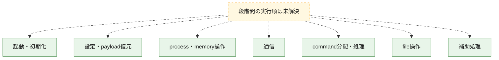
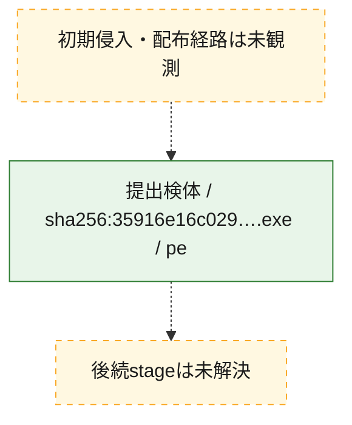
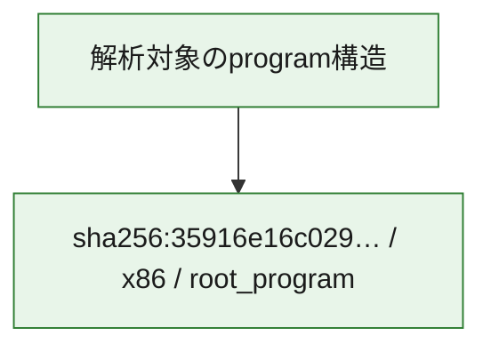

# 全体ロジック：35916e16c0296d4d2d74927710e7a29796a1aaca98bb37225b7265696ccd8200

代表関数の静的証跡から、起動・初期化、設定・payload復元、process・memory操作、通信、command分配・処理、file操作の処理群を確認しました。

## 読み方

- phaseの掲載順は解析上の整理順です。observed_call_edgesがない段階間の実行順を断定しません。
- 図の実線は静的に観測した関係、点線と黄色のノードは未観測・未解決の関係を示します。
- 図は静的な要約であり、動的実行を再現するものではありません。
- 詳細な関数解説とfingerprintは[STATIC-LOGIC.md](STATIC-LOGIC.md)を参照してください。

## 静的可視化

### 実行フロー

### 感染チェーン

### モジュール関係

## 処理段階

### 1. 起動・初期化

entry pointから初期化と後続処理への移行を確認します。
確度: `confirmed_static_function_evidence_with_limits`

- `35916e16c0296d4d2d74927710e7a29796a1aaca98bb37225b7265696ccd8200:ghidra:1400b5ce0` — 初期化と主要処理への分岐を行う入口関数です。 状態: `succeeded`、選定理由: `entry_point`, `meaningful_symbol_name`, `probable_go_main_user_code`, `reviewed_call_centrality:3`, `role:entrypoint`
- `35916e16c0296d4d2d74927710e7a29796a1aaca98bb37225b7265696ccd8200:ghidra:1400b5d20` — 初期化と主要処理への分岐を行う入口関数です。 状態: `failed`、選定理由: `entry_point`, `meaningful_symbol_name`, `probable_go_main_user_code`, `role:entrypoint`
- `35916e16c0296d4d2d74927710e7a29796a1aaca98bb37225b7265696ccd8200:ghidra:1400d8b40` — 初期化と主要処理への分岐を行う入口関数です。 状態: `failed`、選定理由: `entry_point`, `meaningful_symbol_name`, `probable_go_main_user_code`, `role:entrypoint`
- `35916e16c0296d4d2d74927710e7a29796a1aaca98bb37225b7265696ccd8200:ghidra:1400f2f20` — 初期化と主要処理への分岐を行う入口関数です。 状態: `failed`、選定理由: `entry_point`, `meaningful_symbol_name`, `probable_go_main_user_code`, `role:entrypoint`
- `35916e16c0296d4d2d74927710e7a29796a1aaca98bb37225b7265696ccd8200:ghidra:14011a120` — 初期化と主要処理への分岐を行う入口関数です。 状態: `failed`、選定理由: `entry_point`, `meaningful_symbol_name`, `probable_go_main_user_code`, `role:entrypoint`
- `35916e16c0296d4d2d74927710e7a29796a1aaca98bb37225b7265696ccd8200:ghidra:14012b620` — 初期化と主要処理への分岐を行う入口関数です。 状態: `succeeded`、選定理由: `entry_point`, `meaningful_symbol_name`, `probable_go_main_user_code`, `reviewed_call_centrality:33`, `role:entrypoint`
- `35916e16c0296d4d2d74927710e7a29796a1aaca98bb37225b7265696ccd8200:ghidra:140134120` — 初期化と主要処理への分岐を行う入口関数です。 状態: `failed`、選定理由: `entry_point`, `meaningful_symbol_name`, `probable_go_main_user_code`, `role:entrypoint`
- `35916e16c0296d4d2d74927710e7a29796a1aaca98bb37225b7265696ccd8200:ghidra:140164000` — 初期化と主要処理への分岐を行う入口関数です。 状態: `failed`、選定理由: `entry_point`, `meaningful_symbol_name`, `probable_go_main_user_code`, `role:entrypoint`
- `35916e16c0296d4d2d74927710e7a29796a1aaca98bb37225b7265696ccd8200:ghidra:14016cb60` — 初期化と主要処理への分岐を行う入口関数です。 状態: `succeeded`、選定理由: `entry_point`, `meaningful_symbol_name`, `probable_go_main_user_code`, `reviewed_call_centrality:26`, `role:entrypoint`
- `35916e16c0296d4d2d74927710e7a29796a1aaca98bb37225b7265696ccd8200:ghidra:140171060` — 初期化と主要処理への分岐を行う入口関数です。 状態: `succeeded`、選定理由: `entry_point`, `meaningful_symbol_name`, `probable_go_main_user_code`, `reviewed_call_centrality:26`, `role:entrypoint`
- `35916e16c0296d4d2d74927710e7a29796a1aaca98bb37225b7265696ccd8200:ghidra:140175580` — 初期化と主要処理への分岐を行う入口関数です。 状態: `succeeded`、選定理由: `entry_point`, `meaningful_symbol_name`, `probable_go_main_user_code`, `reviewed_call_centrality:13`, `role:entrypoint`
- `35916e16c0296d4d2d74927710e7a29796a1aaca98bb37225b7265696ccd8200:ghidra:140175960` — 初期化と主要処理への分岐を行う入口関数です。 状態: `succeeded`、選定理由: `entry_point`, `meaningful_symbol_name`, `probable_go_main_user_code`, `reviewed_call_centrality:4`, `role:entrypoint`
- `35916e16c0296d4d2d74927710e7a29796a1aaca98bb37225b7265696ccd8200:ghidra:140175c00` — 初期化と主要処理への分岐を行う入口関数です。 状態: `succeeded`、選定理由: `entry_point`, `meaningful_symbol_name`, `probable_go_main_user_code`, `reviewed_call_centrality:3`, `role:entrypoint`
- `35916e16c0296d4d2d74927710e7a29796a1aaca98bb37225b7265696ccd8200:ghidra:140175d20` — 初期化と主要処理への分岐を行う入口関数です。 状態: `succeeded`、選定理由: `entry_point`, `meaningful_symbol_name`, `probable_go_main_user_code`, `reviewed_call_centrality:4`, `role:entrypoint`
- `35916e16c0296d4d2d74927710e7a29796a1aaca98bb37225b7265696ccd8200:ghidra:140175fa0` — 初期化と主要処理への分岐を行う入口関数です。 状態: `succeeded`、選定理由: `entry_point`, `meaningful_symbol_name`, `probable_go_main_user_code`, `reviewed_call_centrality:11`, `role:entrypoint`
- `35916e16c0296d4d2d74927710e7a29796a1aaca98bb37225b7265696ccd8200:ghidra:140176420` — 初期化と主要処理への分岐を行う入口関数です。 状態: `succeeded`、選定理由: `entry_point`, `meaningful_symbol_name`, `probable_go_main_user_code`, `reviewed_call_centrality:4`, `role:entrypoint`
- `35916e16c0296d4d2d74927710e7a29796a1aaca98bb37225b7265696ccd8200:ghidra:140176480` — 初期化と主要処理への分岐を行う入口関数です。 状態: `failed`、選定理由: `entry_point`, `meaningful_symbol_name`, `probable_go_main_user_code`, `role:entrypoint`
- `35916e16c0296d4d2d74927710e7a29796a1aaca98bb37225b7265696ccd8200:ghidra:14019f440` — 初期化と主要処理への分岐を行う入口関数です。 状態: `succeeded`、選定理由: `entry_point`, `meaningful_symbol_name`, `probable_go_main_user_code`, `reviewed_call_centrality:3`, `role:entrypoint`
- `35916e16c0296d4d2d74927710e7a29796a1aaca98bb37225b7265696ccd8200:ghidra:14019f4a0` — 初期化と主要処理への分岐を行う入口関数です。 状態: `succeeded`、選定理由: `entry_point`, `meaningful_symbol_name`, `probable_go_main_user_code`, `reviewed_call_centrality:9`, `role:entrypoint`
- `35916e16c0296d4d2d74927710e7a29796a1aaca98bb37225b7265696ccd8200:ghidra:14019f720` — 初期化と主要処理への分岐を行う入口関数です。 状態: `succeeded`、選定理由: `entry_point`, `meaningful_symbol_name`, `probable_go_main_user_code`, `reviewed_call_centrality:5`, `role:entrypoint`

### 2. 設定・payload復元

設定、resource、payload、暗号化データの復元・変換を確認します。
確度: `confirmed_static_function_evidence`

- `35916e16c0296d4d2d74927710e7a29796a1aaca98bb37225b7265696ccd8200:ghidra:14007ddc0` — 設定、resource、payloadなどの解析・変換を行う関数です。 状態: `succeeded`、選定理由: `meaningful_symbol_name`, `reviewed_call_centrality:4`, `role:config_or_data_transform`
- `35916e16c0296d4d2d74927710e7a29796a1aaca98bb37225b7265696ccd8200:ghidra:14007df60` — 設定、resource、payloadなどの解析・変換を行う関数です。 状態: `succeeded`、選定理由: `meaningful_symbol_name`, `reviewed_call_centrality:4`, `role:config_or_data_transform`
- `35916e16c0296d4d2d74927710e7a29796a1aaca98bb37225b7265696ccd8200:ghidra:1400815e0` — 設定、resource、payloadなどの解析・変換を行う関数です。 状態: `succeeded`、選定理由: `meaningful_symbol_name`, `reviewed_call_centrality:5`, `role:config_or_data_transform`
- `35916e16c0296d4d2d74927710e7a29796a1aaca98bb37225b7265696ccd8200:ghidra:1401a0160` — 暗号、hash、encoding、または復号処理に関係する関数です。 状態: `succeeded`、選定理由: `meaningful_symbol_name`, `reviewed_call_centrality:4`, `role:cryptographic_transform`

### 3. process・memory操作

process、thread、module、memory操作と実行移行を確認します。
確度: `confirmed_static_function_evidence`

- `35916e16c0296d4d2d74927710e7a29796a1aaca98bb37225b7265696ccd8200:ghidra:14006f880` — process、thread、module、またはmemory操作に関係する関数です。 状態: `succeeded`、選定理由: `meaningful_symbol_name`, `reviewed_call_centrality:3`, `role:process_or_memory_operation`
- `35916e16c0296d4d2d74927710e7a29796a1aaca98bb37225b7265696ccd8200:ghidra:1400824e0` — process、thread、module、またはmemory操作に関係する関数です。 状態: `succeeded`、選定理由: `meaningful_symbol_name`, `reviewed_call_centrality:6`, `role:process_or_memory_operation`
- `35916e16c0296d4d2d74927710e7a29796a1aaca98bb37225b7265696ccd8200:ghidra:140082560` — process、thread、module、またはmemory操作に関係する関数です。 状態: `succeeded`、選定理由: `meaningful_symbol_name`, `reviewed_call_centrality:6`, `role:process_or_memory_operation`

### 4. 通信

通信初期化、endpoint処理、送受信の役割を確認します。
確度: `confirmed_static_function_evidence`

- `35916e16c0296d4d2d74927710e7a29796a1aaca98bb37225b7265696ccd8200:ghidra:140082d20` — 通信初期化、送受信、またはendpoint処理に関係する関数です。 状態: `succeeded`、選定理由: `meaningful_symbol_name`, `reviewed_call_centrality:6`, `role:network_communication`

### 5. command分配・処理

受信commandやtaskの解釈、分配、個別handlerへの移行を確認します。
確度: `confirmed_static_function_evidence`

- `35916e16c0296d4d2d74927710e7a29796a1aaca98bb37225b7265696ccd8200:ghidra:140081f60` — commandの解釈、分配、または個別処理を担当する関数です。 状態: `succeeded`、選定理由: `meaningful_symbol_name`, `reviewed_call_centrality:5`, `role:command_dispatch_or_handler`

### 6. file操作

fileやdirectoryの作成、読書き、削除を確認します。
確度: `confirmed_static_function_evidence`

- `35916e16c0296d4d2d74927710e7a29796a1aaca98bb37225b7265696ccd8200:ghidra:140082980` — fileまたはdirectoryの読書き・管理に関係する関数です。 状態: `succeeded`、選定理由: `meaningful_symbol_name`, `reviewed_call_centrality:6`, `role:file_operation`

### 7. 補助処理

主要処理を支える一般内部関数またはlibrary処理を確認します。
確度: `confirmed_static_function_evidence`

- `35916e16c0296d4d2d74927710e7a29796a1aaca98bb37225b7265696ccd8200:ghidra:1400010a0` — compiler生成処理または汎用library処理とみられる関数です。 状態: `succeeded`、選定理由: `meaningful_symbol_name`, `reviewed_call_centrality:3`
- `35916e16c0296d4d2d74927710e7a29796a1aaca98bb37225b7265696ccd8200:ghidra:14006aee0` — 検体内部の一般処理を実装する関数です。 状態: `succeeded`、選定理由: `meaningful_symbol_name`, `reviewed_call_centrality:3`

## 観測したcall関係

- `ghidra-function:0341aa42040261032a06def6` → `ghidra-external:0b937d4ff7c765fd327e0c4f` （`unclassified` → `unclassified`）
- `ghidra-function:0341aa42040261032a06def6` → `ghidra-external:0de7c36826f4ec75f462412e` （`unclassified` → `unclassified`）
- `ghidra-function:0341aa42040261032a06def6` → `ghidra-external:1fc6096ad2da699c4a03c20b` （`unclassified` → `unclassified`）
- `ghidra-function:0341aa42040261032a06def6` → `ghidra-external:2a6e07b5439c53dcc252db15` （`unclassified` → `unclassified`）
- `ghidra-function:0341aa42040261032a06def6` → `ghidra-external:8e9cdfeafae9b0d6b7f08e82` （`unclassified` → `unclassified`）
- `ghidra-function:0341aa42040261032a06def6` → `ghidra-external:93018d6cb9b6ba2f91d4a267` （`unclassified` → `unclassified`）
- `ghidra-function:0341aa42040261032a06def6` → `ghidra-external:9bfee5c5fb1a1d226b58dcf6` （`unclassified` → `unclassified`）
- `ghidra-function:0341aa42040261032a06def6` → `ghidra-external:b662ed4f9a7afc0381aa3714` （`unclassified` → `unclassified`）
- `ghidra-function:0341aa42040261032a06def6` → `ghidra-external:c407ba465329efb9d0d30db3` （`unclassified` → `unclassified`）
- `ghidra-function:0341aa42040261032a06def6` → `ghidra-external:f0344cf735e926cf32e95094` （`unclassified` → `unclassified`）
- `ghidra-function:0341aa42040261032a06def6` → `ghidra-external:f6d43a45f53d9b7f1001c661` （`unclassified` → `unclassified`）
- `ghidra-function:0f795eb43444710c53b416ca` → `ghidra-external:409370cde29be91858efe79c` （`unclassified` → `unclassified`）
- `ghidra-function:0f795eb43444710c53b416ca` → `ghidra-external:80f78d9ee903c51d1b5d4c3c` （`unclassified` → `unclassified`）
- `ghidra-function:0f795eb43444710c53b416ca` → `ghidra-external:8b52ee35f732dbf3ce5f5648` （`unclassified` → `unclassified`）
- `ghidra-function:125680c163852508c36af0a7` → `ghidra-external:3ff9f93e91a952d02054b8ab` （`unclassified` → `unclassified`）
- `ghidra-function:125680c163852508c36af0a7` → `ghidra-external:47ef1231251028888eb894b5` （`unclassified` → `unclassified`）
- `ghidra-function:125680c163852508c36af0a7` → `ghidra-external:5e5251a92babf68b786e5dcc` （`unclassified` → `unclassified`）
- `ghidra-function:125680c163852508c36af0a7` → `ghidra-external:f6d43a45f53d9b7f1001c661` （`unclassified` → `unclassified`）
- `ghidra-function:1ed5211b470cfc692d42705b` → `ghidra-external:005cee7bc9a37d0a9f8823b7` （`unclassified` → `unclassified`）
- `ghidra-function:1ed5211b470cfc692d42705b` → `ghidra-external:07da8d4dfc0d76c6c36f58c3` （`unclassified` → `unclassified`）
- `ghidra-function:1ed5211b470cfc692d42705b` → `ghidra-external:0b937d4ff7c765fd327e0c4f` （`unclassified` → `unclassified`）
- `ghidra-function:1ed5211b470cfc692d42705b` → `ghidra-external:10057955014ffde9692408cf` （`unclassified` → `unclassified`）
- `ghidra-function:1ed5211b470cfc692d42705b` → `ghidra-external:2066a31785a8a8a17512e48b` （`unclassified` → `unclassified`）
- `ghidra-function:1ed5211b470cfc692d42705b` → `ghidra-external:211c64e66f0d83c443b4cf61` （`unclassified` → `unclassified`）
- `ghidra-function:1ed5211b470cfc692d42705b` → `ghidra-external:3bc928f25524d86dd3c06475` （`unclassified` → `unclassified`）
- `ghidra-function:1ed5211b470cfc692d42705b` → `ghidra-external:3c8278485583eda1f45b6ac7` （`unclassified` → `unclassified`）
- `ghidra-function:1ed5211b470cfc692d42705b` → `ghidra-external:47ef1231251028888eb894b5` （`unclassified` → `unclassified`）
- `ghidra-function:1ed5211b470cfc692d42705b` → `ghidra-external:4cb9d1e991b7b1f183a41f9b` （`unclassified` → `unclassified`）
- `ghidra-function:1ed5211b470cfc692d42705b` → `ghidra-external:56a611c655ffe32db8526676` （`unclassified` → `unclassified`）
- `ghidra-function:1ed5211b470cfc692d42705b` → `ghidra-external:5b04620631dbb99f36a646e4` （`unclassified` → `unclassified`）
- `ghidra-function:1ed5211b470cfc692d42705b` → `ghidra-external:64e71b0c0248ed118eb5f170` （`unclassified` → `unclassified`）
- `ghidra-function:1ed5211b470cfc692d42705b` → `ghidra-external:79c75dc359a7ee0711d7db45` （`unclassified` → `unclassified`）
- `ghidra-function:1ed5211b470cfc692d42705b` → `ghidra-external:7a5f9c6f428870263d924335` （`unclassified` → `unclassified`）
- `ghidra-function:1ed5211b470cfc692d42705b` → `ghidra-external:7f06c1bc95bdae4c02aeec88` （`unclassified` → `unclassified`）
- `ghidra-function:1ed5211b470cfc692d42705b` → `ghidra-external:80f78d9ee903c51d1b5d4c3c` （`unclassified` → `unclassified`）
- `ghidra-function:1ed5211b470cfc692d42705b` → `ghidra-external:81f4f01f30ebbc48d65420b0` （`unclassified` → `unclassified`）
- `ghidra-function:1ed5211b470cfc692d42705b` → `ghidra-external:84d2648bbf08a16f9846257b` （`unclassified` → `unclassified`）
- `ghidra-function:1ed5211b470cfc692d42705b` → `ghidra-external:8663cb095334160b295d5c7b` （`unclassified` → `unclassified`）
- `ghidra-function:1ed5211b470cfc692d42705b` → `ghidra-external:8f26003da5802738fa0c8a1d` （`unclassified` → `unclassified`）
- `ghidra-function:1ed5211b470cfc692d42705b` → `ghidra-external:90765e9a2ffda3e24433a175` （`unclassified` → `unclassified`）
- `ghidra-function:1ed5211b470cfc692d42705b` → `ghidra-external:93018d6cb9b6ba2f91d4a267` （`unclassified` → `unclassified`）
- `ghidra-function:1ed5211b470cfc692d42705b` → `ghidra-external:940302f31000ba0768f9d8d3` （`unclassified` → `unclassified`）
- `ghidra-function:1ed5211b470cfc692d42705b` → `ghidra-external:9d4b77dcf479f2181277cf3b` （`unclassified` → `unclassified`）
- `ghidra-function:1ed5211b470cfc692d42705b` → `ghidra-external:9f174f29c8d6d83999c1cc9d` （`unclassified` → `unclassified`）
- `ghidra-function:1ed5211b470cfc692d42705b` → `ghidra-external:c407ba465329efb9d0d30db3` （`unclassified` → `unclassified`）
- `ghidra-function:1ed5211b470cfc692d42705b` → `ghidra-external:c67b9a12d67fdd9457297a31` （`unclassified` → `unclassified`）
- `ghidra-function:1ed5211b470cfc692d42705b` → `ghidra-external:c8a909f3e95421692416a882` （`unclassified` → `unclassified`）
- `ghidra-function:1ed5211b470cfc692d42705b` → `ghidra-external:d5bc9ba0a63253ec0ec0c206` （`unclassified` → `unclassified`）
- `ghidra-function:1ed5211b470cfc692d42705b` → `ghidra-external:e9644be254286a0e526c3d18` （`unclassified` → `unclassified`）
- `ghidra-function:1ed5211b470cfc692d42705b` → `ghidra-external:f2e72d84ec7857e561a39456` （`unclassified` → `unclassified`）
- `ghidra-function:1ed5211b470cfc692d42705b` → `ghidra-external:f6d43a45f53d9b7f1001c661` （`unclassified` → `unclassified`）
- `ghidra-function:1f2bb48957846621b0792f5a` → `ghidra-external:2d1223a01219cfbb3d3922aa` （`unclassified` → `unclassified`）
- `ghidra-function:1f2bb48957846621b0792f5a` → `ghidra-external:51bd77227b5e60d18abc95ff` （`unclassified` → `unclassified`）
- `ghidra-function:1f2bb48957846621b0792f5a` → `ghidra-external:5346e2e587d41667be09bb96` （`unclassified` → `unclassified`）
- `ghidra-function:1f2bb48957846621b0792f5a` → `ghidra-external:7a632c1c6cf91f6fab555ca2` （`unclassified` → `unclassified`）
- `ghidra-function:1f2bb48957846621b0792f5a` → `ghidra-external:80f78d9ee903c51d1b5d4c3c` （`unclassified` → `unclassified`）
- `ghidra-function:1f2bb48957846621b0792f5a` → `ghidra-external:8c70a8799818478ab25004e8` （`unclassified` → `unclassified`）
- `ghidra-function:1f2bb48957846621b0792f5a` → `ghidra-external:9bfee5c5fb1a1d226b58dcf6` （`unclassified` → `unclassified`）
- `ghidra-function:1f2bb48957846621b0792f5a` → `ghidra-external:af01f8fc550f83e3733505c1` （`unclassified` → `unclassified`）
- `ghidra-function:1f2bb48957846621b0792f5a` → `ghidra-external:b1c5d01248532756914b84c4` （`unclassified` → `unclassified`）
- `ghidra-function:1f2bb48957846621b0792f5a` → `ghidra-external:bf0e139fd45d204c43c7b275` （`unclassified` → `unclassified`）
- `ghidra-function:1f2bb48957846621b0792f5a` → `ghidra-external:c407ba465329efb9d0d30db3` （`unclassified` → `unclassified`）
- `ghidra-function:1f2bb48957846621b0792f5a` → `ghidra-external:cf7c11586c37c87b2e809cbb` （`unclassified` → `unclassified`）
- `ghidra-function:1f2bb48957846621b0792f5a` → `ghidra-external:f6d43a45f53d9b7f1001c661` （`unclassified` → `unclassified`）
- `ghidra-function:20f2eb7dc8aa8e3674d0e7c7` → `ghidra-external:0b937d4ff7c765fd327e0c4f` （`unclassified` → `unclassified`）
- `ghidra-function:20f2eb7dc8aa8e3674d0e7c7` → `ghidra-external:49a6b350dbe87a37c2c695a6` （`unclassified` → `unclassified`）
- `ghidra-function:20f2eb7dc8aa8e3674d0e7c7` → `ghidra-external:8656df2192b0a86cbdf47eee` （`unclassified` → `unclassified`）
- `ghidra-function:20f2eb7dc8aa8e3674d0e7c7` → `ghidra-external:93973a2408d74c7b1644d606` （`unclassified` → `unclassified`）
- `ghidra-function:20f2eb7dc8aa8e3674d0e7c7` → `ghidra-external:a01d3b0e62c3bd2787a34ee9` （`unclassified` → `unclassified`）
- `ghidra-function:271c8f7a75d8a88defba090e` → `ghidra-external:10b754d0bfb87833d4466c54` （`unclassified` → `unclassified`）
- `ghidra-function:271c8f7a75d8a88defba090e` → `ghidra-external:49f1b2e1b0588038a1cb241f` （`unclassified` → `unclassified`）
- `ghidra-function:271c8f7a75d8a88defba090e` → `ghidra-external:c407ba465329efb9d0d30db3` （`unclassified` → `unclassified`）
- `ghidra-function:271c8f7a75d8a88defba090e` → `ghidra-external:f6d43a45f53d9b7f1001c661` （`unclassified` → `unclassified`）
- `ghidra-function:2b3681d82bee8849bbf91f35` → `ghidra-external:b28ef511792c426d8f86c057` （`unclassified` → `unclassified`）
- `ghidra-function:2b3681d82bee8849bbf91f35` → `ghidra-external:dc8e72531f8f90d2ea9b84c7` （`unclassified` → `unclassified`）
- `ghidra-function:2b3681d82bee8849bbf91f35` → `ghidra-external:f6d43a45f53d9b7f1001c661` （`unclassified` → `unclassified`）
- `ghidra-function:3b45a92aa350c9a2201f466b` → `ghidra-external:005cee7bc9a37d0a9f8823b7` （`unclassified` → `unclassified`）
- `ghidra-function:3b45a92aa350c9a2201f466b` → `ghidra-external:07da8d4dfc0d76c6c36f58c3` （`unclassified` → `unclassified`）
- `ghidra-function:3b45a92aa350c9a2201f466b` → `ghidra-external:10057955014ffde9692408cf` （`unclassified` → `unclassified`）
- `ghidra-function:3b45a92aa350c9a2201f466b` → `ghidra-external:2066a31785a8a8a17512e48b` （`unclassified` → `unclassified`）
- `ghidra-function:3b45a92aa350c9a2201f466b` → `ghidra-external:211c64e66f0d83c443b4cf61` （`unclassified` → `unclassified`）
- `ghidra-function:3b45a92aa350c9a2201f466b` → `ghidra-external:3bc928f25524d86dd3c06475` （`unclassified` → `unclassified`）
- `ghidra-function:3b45a92aa350c9a2201f466b` → `ghidra-external:3c8278485583eda1f45b6ac7` （`unclassified` → `unclassified`）
- `ghidra-function:3b45a92aa350c9a2201f466b` → `ghidra-external:56a611c655ffe32db8526676` （`unclassified` → `unclassified`）
- `ghidra-function:3b45a92aa350c9a2201f466b` → `ghidra-external:5b04620631dbb99f36a646e4` （`unclassified` → `unclassified`）
- `ghidra-function:3b45a92aa350c9a2201f466b` → `ghidra-external:6315d6f5b538c36708e35b98` （`unclassified` → `unclassified`）
- `ghidra-function:3b45a92aa350c9a2201f466b` → `ghidra-external:7a5f9c6f428870263d924335` （`unclassified` → `unclassified`）
- `ghidra-function:3b45a92aa350c9a2201f466b` → `ghidra-external:7f06c1bc95bdae4c02aeec88` （`unclassified` → `unclassified`）
- `ghidra-function:3b45a92aa350c9a2201f466b` → `ghidra-external:80f78d9ee903c51d1b5d4c3c` （`unclassified` → `unclassified`）
- `ghidra-function:3b45a92aa350c9a2201f466b` → `ghidra-external:84d2648bbf08a16f9846257b` （`unclassified` → `unclassified`）
- `ghidra-function:3b45a92aa350c9a2201f466b` → `ghidra-external:8663cb095334160b295d5c7b` （`unclassified` → `unclassified`）
- `ghidra-function:3b45a92aa350c9a2201f466b` → `ghidra-external:8f26003da5802738fa0c8a1d` （`unclassified` → `unclassified`）
- `ghidra-function:3b45a92aa350c9a2201f466b` → `ghidra-external:93018d6cb9b6ba2f91d4a267` （`unclassified` → `unclassified`）
- `ghidra-function:3b45a92aa350c9a2201f466b` → `ghidra-external:940302f31000ba0768f9d8d3` （`unclassified` → `unclassified`）
- `ghidra-function:3b45a92aa350c9a2201f466b` → `ghidra-external:9d4b77dcf479f2181277cf3b` （`unclassified` → `unclassified`）
- `ghidra-function:3b45a92aa350c9a2201f466b` → `ghidra-external:9f174f29c8d6d83999c1cc9d` （`unclassified` → `unclassified`）
- `ghidra-function:3b45a92aa350c9a2201f466b` → `ghidra-external:c407ba465329efb9d0d30db3` （`unclassified` → `unclassified`）
- `ghidra-function:3b45a92aa350c9a2201f466b` → `ghidra-external:c8a909f3e95421692416a882` （`unclassified` → `unclassified`）
- `ghidra-function:3b45a92aa350c9a2201f466b` → `ghidra-external:d5bc9ba0a63253ec0ec0c206` （`unclassified` → `unclassified`）
- `ghidra-function:3b45a92aa350c9a2201f466b` → `ghidra-external:e9644be254286a0e526c3d18` （`unclassified` → `unclassified`）
- `ghidra-function:3b45a92aa350c9a2201f466b` → `ghidra-external:f2e72d84ec7857e561a39456` （`unclassified` → `unclassified`）
- `ghidra-function:3b45a92aa350c9a2201f466b` → `ghidra-external:f6d43a45f53d9b7f1001c661` （`unclassified` → `unclassified`）
- `ghidra-function:419ba45a10c560317e08d287` → `ghidra-external:0ab7d35dcedd24aca73076a2` （`unclassified` → `unclassified`）
- `ghidra-function:419ba45a10c560317e08d287` → `ghidra-external:80f78d9ee903c51d1b5d4c3c` （`unclassified` → `unclassified`）
- `ghidra-function:419ba45a10c560317e08d287` → `ghidra-external:821a5a984be7e71e89cc1701` （`unclassified` → `unclassified`）
- `ghidra-function:419ba45a10c560317e08d287` → `ghidra-external:93018d6cb9b6ba2f91d4a267` （`unclassified` → `unclassified`）
- `ghidra-function:419ba45a10c560317e08d287` → `ghidra-external:f6d43a45f53d9b7f1001c661` （`unclassified` → `unclassified`）
- `ghidra-function:4c379c3e6b8bc0f79ea00c7d` → `ghidra-external:064ad0e0c4ea4c589ea0c8dc` （`unclassified` → `unclassified`）
- `ghidra-function:4c379c3e6b8bc0f79ea00c7d` → `ghidra-external:64e71b0c0248ed118eb5f170` （`unclassified` → `unclassified`）
- `ghidra-function:4c379c3e6b8bc0f79ea00c7d` → `ghidra-external:79c75dc359a7ee0711d7db45` （`unclassified` → `unclassified`）
- `ghidra-function:4c379c3e6b8bc0f79ea00c7d` → `ghidra-external:81f4f01f30ebbc48d65420b0` （`unclassified` → `unclassified`）
- `ghidra-function:4c379c3e6b8bc0f79ea00c7d` → `ghidra-external:d21c32570e4cb0f46e9b5211` （`unclassified` → `unclassified`）
- `ghidra-function:4c379c3e6b8bc0f79ea00c7d` → `ghidra-external:f6d43a45f53d9b7f1001c661` （`unclassified` → `unclassified`）
- `ghidra-function:5499b3c0c86c688d2c77cd72` → `ghidra-external:80f78d9ee903c51d1b5d4c3c` （`unclassified` → `unclassified`）
- `ghidra-function:5499b3c0c86c688d2c77cd72` → `ghidra-external:8b52ee35f732dbf3ce5f5648` （`unclassified` → `unclassified`）
- `ghidra-function:5499b3c0c86c688d2c77cd72` → `ghidra-external:d9122bed4412b1f62b32037d` （`unclassified` → `unclassified`）
- `ghidra-function:5cc9bb068bff42d4e764003f` → `ghidra-external:005cee7bc9a37d0a9f8823b7` （`unclassified` → `unclassified`）
- `ghidra-function:5cc9bb068bff42d4e764003f` → `ghidra-external:07da8d4dfc0d76c6c36f58c3` （`unclassified` → `unclassified`）
- `ghidra-function:5cc9bb068bff42d4e764003f` → `ghidra-external:10057955014ffde9692408cf` （`unclassified` → `unclassified`）
- `ghidra-function:5cc9bb068bff42d4e764003f` → `ghidra-external:2066a31785a8a8a17512e48b` （`unclassified` → `unclassified`）
- `ghidra-function:5cc9bb068bff42d4e764003f` → `ghidra-external:211c64e66f0d83c443b4cf61` （`unclassified` → `unclassified`）
- `ghidra-function:5cc9bb068bff42d4e764003f` → `ghidra-external:3bc928f25524d86dd3c06475` （`unclassified` → `unclassified`）
- `ghidra-function:5cc9bb068bff42d4e764003f` → `ghidra-external:3c8278485583eda1f45b6ac7` （`unclassified` → `unclassified`）
- `ghidra-function:5cc9bb068bff42d4e764003f` → `ghidra-external:56a611c655ffe32db8526676` （`unclassified` → `unclassified`）
- `ghidra-function:5cc9bb068bff42d4e764003f` → `ghidra-external:5a77f7b65b35ff97c375a111` （`unclassified` → `unclassified`）
- `ghidra-function:5cc9bb068bff42d4e764003f` → `ghidra-external:5b04620631dbb99f36a646e4` （`unclassified` → `unclassified`）
- `ghidra-function:5cc9bb068bff42d4e764003f` → `ghidra-external:7a5f9c6f428870263d924335` （`unclassified` → `unclassified`）
- `ghidra-function:5cc9bb068bff42d4e764003f` → `ghidra-external:7f06c1bc95bdae4c02aeec88` （`unclassified` → `unclassified`）
- `ghidra-function:5cc9bb068bff42d4e764003f` → `ghidra-external:80f78d9ee903c51d1b5d4c3c` （`unclassified` → `unclassified`）
- `ghidra-function:5cc9bb068bff42d4e764003f` → `ghidra-external:84d2648bbf08a16f9846257b` （`unclassified` → `unclassified`）
- `ghidra-function:5cc9bb068bff42d4e764003f` → `ghidra-external:8663cb095334160b295d5c7b` （`unclassified` → `unclassified`）
- `ghidra-function:5cc9bb068bff42d4e764003f` → `ghidra-external:8f26003da5802738fa0c8a1d` （`unclassified` → `unclassified`）
- `ghidra-function:5cc9bb068bff42d4e764003f` → `ghidra-external:93018d6cb9b6ba2f91d4a267` （`unclassified` → `unclassified`）
- `ghidra-function:5cc9bb068bff42d4e764003f` → `ghidra-external:940302f31000ba0768f9d8d3` （`unclassified` → `unclassified`）
- `ghidra-function:5cc9bb068bff42d4e764003f` → `ghidra-external:9d4b77dcf479f2181277cf3b` （`unclassified` → `unclassified`）
- `ghidra-function:5cc9bb068bff42d4e764003f` → `ghidra-external:9f174f29c8d6d83999c1cc9d` （`unclassified` → `unclassified`）
- `ghidra-function:5cc9bb068bff42d4e764003f` → `ghidra-external:c407ba465329efb9d0d30db3` （`unclassified` → `unclassified`）
- `ghidra-function:5cc9bb068bff42d4e764003f` → `ghidra-external:c8a909f3e95421692416a882` （`unclassified` → `unclassified`）
- `ghidra-function:5cc9bb068bff42d4e764003f` → `ghidra-external:d5bc9ba0a63253ec0ec0c206` （`unclassified` → `unclassified`）
- `ghidra-function:5cc9bb068bff42d4e764003f` → `ghidra-external:e9644be254286a0e526c3d18` （`unclassified` → `unclassified`）
- `ghidra-function:5cc9bb068bff42d4e764003f` → `ghidra-external:f2e72d84ec7857e561a39456` （`unclassified` → `unclassified`）
- `ghidra-function:5cc9bb068bff42d4e764003f` → `ghidra-external:f6d43a45f53d9b7f1001c661` （`unclassified` → `unclassified`）
- `ghidra-function:6702a5d73fbd1222415fce2e` → `ghidra-external:501ede25d95ee4055aabbb2f` （`unclassified` → `unclassified`）
- `ghidra-function:6702a5d73fbd1222415fce2e` → `ghidra-external:7a0b2c01ed15479615fb9755` （`unclassified` → `unclassified`）
- `ghidra-function:6702a5d73fbd1222415fce2e` → `ghidra-external:80f78d9ee903c51d1b5d4c3c` （`unclassified` → `unclassified`）
- `ghidra-function:6702a5d73fbd1222415fce2e` → `ghidra-external:8b52ee35f732dbf3ce5f5648` （`unclassified` → `unclassified`）
- `ghidra-function:71e3689b5cf882616fc9beeb` → `ghidra-external:4d49fbd2610b688cfb844728` （`unclassified` → `unclassified`）
- `ghidra-function:71e3689b5cf882616fc9beeb` → `ghidra-external:79c75dc359a7ee0711d7db45` （`unclassified` → `unclassified`）
- `ghidra-function:71e3689b5cf882616fc9beeb` → `ghidra-external:81f4f01f30ebbc48d65420b0` （`unclassified` → `unclassified`）
- `ghidra-function:71e3689b5cf882616fc9beeb` → `ghidra-external:ee308d47a4b978b322dcd82e` （`unclassified` → `unclassified`）
- `ghidra-function:71e3689b5cf882616fc9beeb` → `ghidra-external:f6d43a45f53d9b7f1001c661` （`unclassified` → `unclassified`）
- `ghidra-function:7612cf9e264d2028ec753e34` → `ghidra-external:47ef1231251028888eb894b5` （`unclassified` → `unclassified`）
- `ghidra-function:7612cf9e264d2028ec753e34` → `ghidra-external:80f78d9ee903c51d1b5d4c3c` （`unclassified` → `unclassified`）
- `ghidra-function:7612cf9e264d2028ec753e34` → `ghidra-external:8b52ee35f732dbf3ce5f5648` （`unclassified` → `unclassified`）
- `ghidra-function:7612cf9e264d2028ec753e34` → `ghidra-external:d94b42b3d6ae9c76d6d529ac` （`unclassified` → `unclassified`）
- `ghidra-function:96bfab6d58e6c1c888806aac` → `ghidra-external:64e71b0c0248ed118eb5f170` （`unclassified` → `unclassified`）
- `ghidra-function:96bfab6d58e6c1c888806aac` → `ghidra-external:79c75dc359a7ee0711d7db45` （`unclassified` → `unclassified`）
- `ghidra-function:96bfab6d58e6c1c888806aac` → `ghidra-external:81f4f01f30ebbc48d65420b0` （`unclassified` → `unclassified`）
- `ghidra-function:96bfab6d58e6c1c888806aac` → `ghidra-external:af9c3a1c93cffbf98bdb01eb` （`unclassified` → `unclassified`）
- `ghidra-function:96bfab6d58e6c1c888806aac` → `ghidra-external:ee308d47a4b978b322dcd82e` （`unclassified` → `unclassified`）
- `ghidra-function:96bfab6d58e6c1c888806aac` → `ghidra-external:f6d43a45f53d9b7f1001c661` （`unclassified` → `unclassified`）
- `ghidra-function:98372044dfbbdc53f67fd1eb` → `ghidra-external:3c8278485583eda1f45b6ac7` （`unclassified` → `unclassified`）
- `ghidra-function:98372044dfbbdc53f67fd1eb` → `ghidra-external:3ff9f93e91a952d02054b8ab` （`unclassified` → `unclassified`）
- `ghidra-function:98372044dfbbdc53f67fd1eb` → `ghidra-external:575f3ef5d21933b011a5dd07` （`unclassified` → `unclassified`）
- `ghidra-function:98372044dfbbdc53f67fd1eb` → `ghidra-external:79c75dc359a7ee0711d7db45` （`unclassified` → `unclassified`）
- `ghidra-function:98372044dfbbdc53f67fd1eb` → `ghidra-external:81f4f01f30ebbc48d65420b0` （`unclassified` → `unclassified`）
- `ghidra-function:98372044dfbbdc53f67fd1eb` → `ghidra-external:93018d6cb9b6ba2f91d4a267` （`unclassified` → `unclassified`）
- `ghidra-function:98372044dfbbdc53f67fd1eb` → `ghidra-external:ac21889d17873fe37138badf` （`unclassified` → `unclassified`）
- `ghidra-function:98372044dfbbdc53f67fd1eb` → `ghidra-external:f24459d61755e0166bb319a6` （`unclassified` → `unclassified`）
- `ghidra-function:98372044dfbbdc53f67fd1eb` → `ghidra-external:f6d43a45f53d9b7f1001c661` （`unclassified` → `unclassified`）
- `ghidra-function:9ed37a816907e646246aa468` → `ghidra-external:0b937d4ff7c765fd327e0c4f` （`unclassified` → `unclassified`）
- `ghidra-function:9ed37a816907e646246aa468` → `ghidra-external:80f78d9ee903c51d1b5d4c3c` （`unclassified` → `unclassified`）
- `ghidra-function:9ed37a816907e646246aa468` → `ghidra-external:aa3b1caf9e9a68f29b015c2a` （`unclassified` → `unclassified`）
- `ghidra-function:9ed37a816907e646246aa468` → `ghidra-external:af9c3a1c93cffbf98bdb01eb` （`unclassified` → `unclassified`）
- `ghidra-function:9ed37a816907e646246aa468` → `ghidra-external:c16cc953a0d632cc8f8b3655` （`unclassified` → `unclassified`）
- `ghidra-function:9ed37a816907e646246aa468` → `ghidra-external:f6d43a45f53d9b7f1001c661` （`unclassified` → `unclassified`）
- `ghidra-function:aab9b9aa7f37a255efda046c` → `ghidra-external:47ef1231251028888eb894b5` （`unclassified` → `unclassified`）
- `ghidra-function:aab9b9aa7f37a255efda046c` → `ghidra-external:4b894f6b2df6e1771ccbf78b` （`unclassified` → `unclassified`）
- `ghidra-function:aab9b9aa7f37a255efda046c` → `ghidra-external:80f78d9ee903c51d1b5d4c3c` （`unclassified` → `unclassified`）
- `ghidra-function:aab9b9aa7f37a255efda046c` → `ghidra-external:8b52ee35f732dbf3ce5f5648` （`unclassified` → `unclassified`）
- `ghidra-function:b86e9b878761632dbfc9e38e` → `ghidra-external:64e71b0c0248ed118eb5f170` （`unclassified` → `unclassified`）
- `ghidra-function:b86e9b878761632dbfc9e38e` → `ghidra-external:79c75dc359a7ee0711d7db45` （`unclassified` → `unclassified`）
- `ghidra-function:b86e9b878761632dbfc9e38e` → `ghidra-external:81f4f01f30ebbc48d65420b0` （`unclassified` → `unclassified`）
- `ghidra-function:b86e9b878761632dbfc9e38e` → `ghidra-external:874db786f755599847e4fbbf` （`unclassified` → `unclassified`）
- `ghidra-function:b86e9b878761632dbfc9e38e` → `ghidra-external:ee308d47a4b978b322dcd82e` （`unclassified` → `unclassified`）
- `ghidra-function:b86e9b878761632dbfc9e38e` → `ghidra-external:f6d43a45f53d9b7f1001c661` （`unclassified` → `unclassified`）
- `ghidra-function:d174bb3c9a60972dab3740da` → `ghidra-external:400810622d98eefffd225bdf` （`unclassified` → `unclassified`）
- `ghidra-function:d174bb3c9a60972dab3740da` → `ghidra-external:798ffe264aab924495426a43` （`unclassified` → `unclassified`）
- `ghidra-function:d174bb3c9a60972dab3740da` → `ghidra-external:eb078c0538664a691bcad489` （`unclassified` → `unclassified`）
- `ghidra-function:d3aa76dbd1e39b930b53a1fb` → `ghidra-external:2a6e07b5439c53dcc252db15` （`unclassified` → `unclassified`）
- `ghidra-function:d3aa76dbd1e39b930b53a1fb` → `ghidra-external:b662ed4f9a7afc0381aa3714` （`unclassified` → `unclassified`）
- `ghidra-function:d3aa76dbd1e39b930b53a1fb` → `ghidra-external:f6d43a45f53d9b7f1001c661` （`unclassified` → `unclassified`）
- `ghidra-function:e1f32db1c98eb0e5a96b22b6` → `ghidra-external:cbb0275bda8fef4e7cc3f9ef` （`unclassified` → `unclassified`）
- `ghidra-function:e1f32db1c98eb0e5a96b22b6` → `ghidra-external:dd37eae4f6915af98e91c857` （`unclassified` → `unclassified`）
- `ghidra-function:e1f32db1c98eb0e5a96b22b6` → `ghidra-external:e177eb20bbc49e04fab82fde` （`unclassified` → `unclassified`）
- `ghidra-function:e1f32db1c98eb0e5a96b22b6` → `ghidra-external:f6d43a45f53d9b7f1001c661` （`unclassified` → `unclassified`）
- `ghidra-function:fa577beadb48009b5638a920` → `ghidra-external:08a14cc3b5fa0b9675f32fab` （`unclassified` → `unclassified`）
- `ghidra-function:fa577beadb48009b5638a920` → `ghidra-external:10057955014ffde9692408cf` （`unclassified` → `unclassified`）
- `ghidra-function:fa577beadb48009b5638a920` → `ghidra-external:f6d43a45f53d9b7f1001c661` （`unclassified` → `unclassified`）

## 解析範囲と制約

- 選定外関数は全体inventoryへ残しますが、関数本体の個別解説対象にはしていません。
- indirect call、難読化、packer、VM、壊れたcontrol flowによりcall関係が欠落する場合があります。
- 文書は静的解析に基づき、検体実行や外部通信による動的確認は行っていません。
