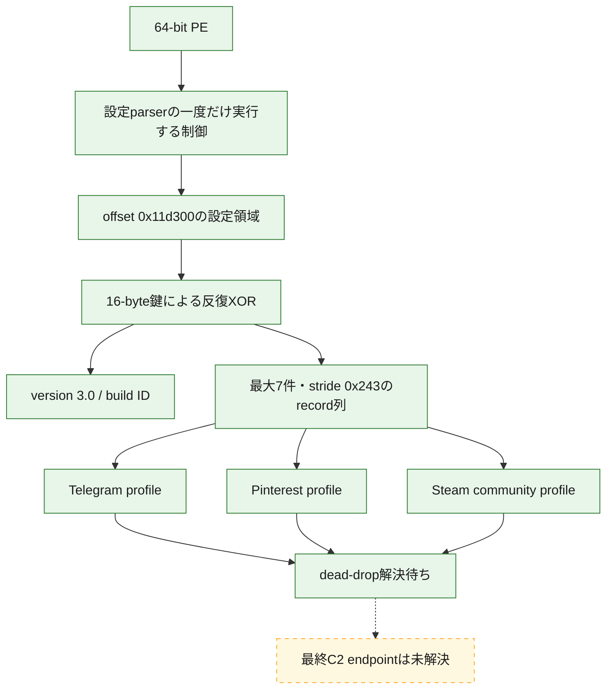

# Vidar全体ロジック：3b8e7ffdd1469728a242a7b86bb168486dc2b7258b03aa15c52df604e1105e86

## 静的に確認した処理順

## 処理段階

1. PE内の固定設定領域を設定entryがcore parserへ渡す。
2. core parserは固定offset、長さfield、record上限を検証する。
3. 反復XOR decoderがversion、build ID、URL、tag、User-Agentを復号する。
4. 3件のURLを共有サービス上のdead-dropとして分類する。
5. dead-drop本文から得られる最終C2は未回収のため、直接C2として公開しない。

## 感染チェーンの範囲

初期侵入、親process、永続化、後段payloadは本検体の静的成果物だけでは確認していない。本解析は提出PE内の設定復号とendpoint意味論に限定しており、一般的なVidarの挙動を検体固有事実として補完していない。

## 安全境界

- 検体または復元codeを実行していない。
- dead-dropと外部hostへ接続していない。
- 点線は未観測の関係を表し、静的に確定した処理と区別している。
