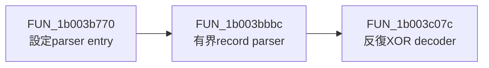

# Vidar静的ロジック解析：3b8e7ffdd1469728a242a7b86bb168486dc2b7258b03aa15c52df604e1105e86

## 解析状態

- 状態: `reviewed_function_logic`
- 解析手段: `ghidra-mcp`と有界静的設定parser
- 明示的program selector: `/DailyAnalysis/20260816/Vidar/3b8e7ffd/3b8e7ffdd1469728a242a7b86bb168486dc2b7258b03aa15c52df604e1105e86.exe`
- Ghidra関数数: 1,232
- レビュー済み代表関数: 3
- 確認したcall関係: 2
- 検体実行・外部接続: なし

## 代表関数

### 設定parser entry: `FUN_1b003b770` (`0x1b003b770`)

状態byteで重複処理を避け、設定領域をcore parserへ渡すwrapperである。設定解析の入口と一度だけ処理する制御を確認した。

### 有界設定record parser: `FUN_1b003bbbc` (`0x1b003bbbc`)

設定先頭の16-byte鍵を使い、version、build ID、URL、tag、User-Agentを復号する。versionはoffset `0x10`と長さfield `0x30`、build IDはoffset `0x31`と長さfield `0x71`を使う。record列はoffset `0x72`から始まり、stride `0x243`、最大7件である。各fieldの長さを確認し、空recordで終了する。

### 反復XOR decoder: `FUN_1b003c07c` (`0x1b003c07c`)

各byteへ`key[index modulo key_length]`をXORし、末尾へNULを付加する。実検体では鍵長が16 byteである。生の鍵は公開せず、hashだけを[config.json](config.json)へ記録した。

## call関係

## fingerprintの扱い

Ghidra MCPのfunction hash取得では対象function bodyが1 byte相当として返り、空hashと命令数0になった。誤ったfingerprintを公開しないため、hashは未記録とし、明示selector、address、逆コンパイルで確認した意味論だけを保存した。

## 制約

- 全1,232関数の役割分類は行っていない。
- 代表3関数の生の逆コンパイル全文は公開していない。
- dead-drop本文と最終C2は検体内に含まれず、未解決である。
