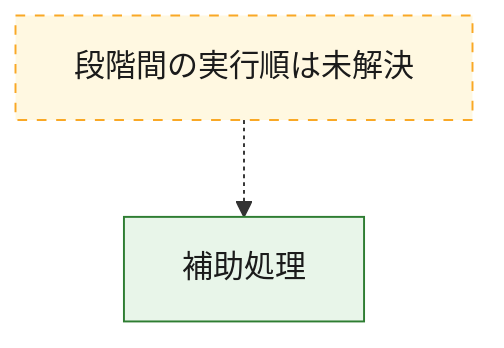
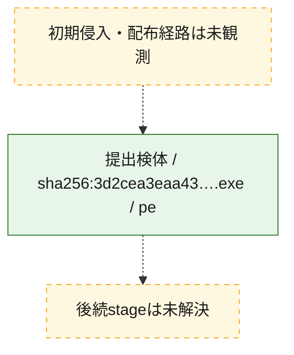
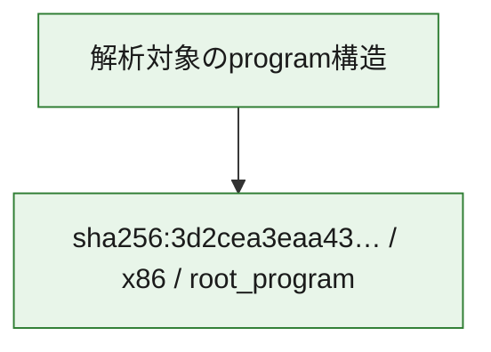

# 全体ロジック：3d2cea3eaa43053ae0efa20de8544387d7cabeb70c89980f4241f3b6efa0e323

代表関数から主要なmalware処理段階を自動分類できませんでした。

## 読み方

- phaseの掲載順は解析上の整理順です。observed_call_edgesがない段階間の実行順を断定しません。
- 図の実線は静的に観測した関係、点線と黄色のノードは未観測・未解決の関係を示します。
- 図は静的な要約であり、動的実行を再現するものではありません。
- 詳細な関数解説とfingerprintは[STATIC-LOGIC.md](STATIC-LOGIC.md)を参照してください。

## 静的可視化

### 実行フロー

### 感染チェーン

### モジュール関係

## 処理段階

### 1. 補助処理

主要処理を支える一般内部関数またはlibrary処理を確認します。
確度: `confirmed_static_function_evidence`

- `3d2cea3eaa43053ae0efa20de8544387d7cabeb70c89980f4241f3b6efa0e323:ghidra:1d0001050` — 検体内部の一般処理を実装する関数です。 状態: `succeeded`、選定理由: `context_representative`, `reviewed_call_centrality:1`
- `3d2cea3eaa43053ae0efa20de8544387d7cabeb70c89980f4241f3b6efa0e323:ghidra:1d00011c0` — 検体内部の一般処理を実装する関数です。 状態: `succeeded`、選定理由: `context_representative`, `reviewed_call_centrality:11`
- `3d2cea3eaa43053ae0efa20de8544387d7cabeb70c89980f4241f3b6efa0e323:ghidra:1d00014c0` — 検体内部の一般処理を実装する関数です。 状態: `succeeded`、選定理由: `context_representative`, `reviewed_call_centrality:31`
- `3d2cea3eaa43053ae0efa20de8544387d7cabeb70c89980f4241f3b6efa0e323:ghidra:1d0001ac0` — 検体内部の一般処理を実装する関数です。 状態: `succeeded`、選定理由: `context_representative`, `reviewed_call_centrality:29`
- `3d2cea3eaa43053ae0efa20de8544387d7cabeb70c89980f4241f3b6efa0e323:ghidra:1d00026cc` — 検体内部の一般処理を実装する関数です。 状態: `succeeded`、選定理由: `context_representative`, `reviewed_call_centrality:3`
- `3d2cea3eaa43053ae0efa20de8544387d7cabeb70c89980f4241f3b6efa0e323:ghidra:1d0002850` — 検体内部の一般処理を実装する関数です。 状態: `succeeded`、選定理由: `context_representative`, `reviewed_call_centrality:7`
- `3d2cea3eaa43053ae0efa20de8544387d7cabeb70c89980f4241f3b6efa0e323:ghidra:1d0002a00` — 検体内部の一般処理を実装する関数です。 状態: `succeeded`、選定理由: `context_representative`, `reviewed_call_centrality:11`
- `3d2cea3eaa43053ae0efa20de8544387d7cabeb70c89980f4241f3b6efa0e323:ghidra:1d0002cc0` — 検体内部の一般処理を実装する関数です。 状態: `succeeded`、選定理由: `context_representative`, `reviewed_call_centrality:3`
- `3d2cea3eaa43053ae0efa20de8544387d7cabeb70c89980f4241f3b6efa0e323:ghidra:1d0002e10` — 検体内部の一般処理を実装する関数です。 状態: `succeeded`、選定理由: `context_representative`, `reviewed_call_centrality:7`
- `3d2cea3eaa43053ae0efa20de8544387d7cabeb70c89980f4241f3b6efa0e323:ghidra:1d000310c` — 検体内部の一般処理を実装する関数です。 状態: `succeeded`、選定理由: `context_representative`, `reviewed_call_centrality:6`
- `3d2cea3eaa43053ae0efa20de8544387d7cabeb70c89980f4241f3b6efa0e323:ghidra:1d0003210` — 検体内部の一般処理を実装する関数です。 状態: `succeeded`、選定理由: `context_representative`, `reviewed_call_centrality:26`
- `3d2cea3eaa43053ae0efa20de8544387d7cabeb70c89980f4241f3b6efa0e323:ghidra:1d0003910` — 検体内部の一般処理を実装する関数です。 状態: `succeeded`、選定理由: `context_representative`, `reviewed_call_centrality:9`
- `3d2cea3eaa43053ae0efa20de8544387d7cabeb70c89980f4241f3b6efa0e323:ghidra:1d0003bf8` — 検体内部の一般処理を実装する関数です。 状態: `succeeded`、選定理由: `context_representative`, `reviewed_call_centrality:8`
- `3d2cea3eaa43053ae0efa20de8544387d7cabeb70c89980f4241f3b6efa0e323:ghidra:1d0003dd0` — 検体内部の一般処理を実装する関数です。 状態: `succeeded`、選定理由: `context_representative`, `reviewed_call_centrality:1`
- `3d2cea3eaa43053ae0efa20de8544387d7cabeb70c89980f4241f3b6efa0e323:ghidra:1d0003f88` — 検体内部の一般処理を実装する関数です。 状態: `succeeded`、選定理由: `context_representative`
- `3d2cea3eaa43053ae0efa20de8544387d7cabeb70c89980f4241f3b6efa0e323:ghidra:1d00040d0` — 検体内部の一般処理を実装する関数です。 状態: `succeeded`、選定理由: `context_representative`, `reviewed_call_centrality:2`
- `3d2cea3eaa43053ae0efa20de8544387d7cabeb70c89980f4241f3b6efa0e323:ghidra:1d00043f4` — 検体内部の一般処理を実装する関数です。 状態: `succeeded`、選定理由: `context_representative`, `reviewed_call_centrality:7`
- `3d2cea3eaa43053ae0efa20de8544387d7cabeb70c89980f4241f3b6efa0e323:ghidra:1d0004570` — 検体内部の一般処理を実装する関数です。 状態: `succeeded`、選定理由: `context_representative`, `reviewed_call_centrality:2`
- `3d2cea3eaa43053ae0efa20de8544387d7cabeb70c89980f4241f3b6efa0e323:ghidra:1d000465c` — 検体内部の一般処理を実装する関数です。 状態: `succeeded`、選定理由: `context_representative`, `reviewed_call_centrality:27`
- `3d2cea3eaa43053ae0efa20de8544387d7cabeb70c89980f4241f3b6efa0e323:ghidra:1d0004994` — 検体内部の一般処理を実装する関数です。 状態: `succeeded`、選定理由: `context_representative`, `reviewed_call_centrality:22`
- `3d2cea3eaa43053ae0efa20de8544387d7cabeb70c89980f4241f3b6efa0e323:ghidra:1d0005460` — 検体内部の一般処理を実装する関数です。 状態: `succeeded`、選定理由: `context_representative`, `reviewed_call_centrality:9`
- `3d2cea3eaa43053ae0efa20de8544387d7cabeb70c89980f4241f3b6efa0e323:ghidra:1d0005630` — 検体内部の一般処理を実装する関数です。 状態: `succeeded`、選定理由: `context_representative`, `reviewed_call_centrality:11`
- `3d2cea3eaa43053ae0efa20de8544387d7cabeb70c89980f4241f3b6efa0e323:ghidra:1d00057e8` — 検体内部の一般処理を実装する関数です。 状態: `succeeded`、選定理由: `context_representative`, `reviewed_call_centrality:9`
- `3d2cea3eaa43053ae0efa20de8544387d7cabeb70c89980f4241f3b6efa0e323:ghidra:1d00059c0` — 検体内部の一般処理を実装する関数です。 状態: `succeeded`、選定理由: `context_representative`, `reviewed_call_centrality:5`
- `3d2cea3eaa43053ae0efa20de8544387d7cabeb70c89980f4241f3b6efa0e323:ghidra:1d0005ad0` — 検体内部の一般処理を実装する関数です。 状態: `succeeded`、選定理由: `context_representative`, `reviewed_call_centrality:7`
- `3d2cea3eaa43053ae0efa20de8544387d7cabeb70c89980f4241f3b6efa0e323:ghidra:1d0005dcc` — 検体内部の一般処理を実装する関数です。 状態: `succeeded`、選定理由: `context_representative`, `reviewed_call_centrality:1`
- `3d2cea3eaa43053ae0efa20de8544387d7cabeb70c89980f4241f3b6efa0e323:ghidra:1d0005ef0` — 検体内部の一般処理を実装する関数です。 状態: `succeeded`、選定理由: `context_representative`, `reviewed_call_centrality:2`
- `3d2cea3eaa43053ae0efa20de8544387d7cabeb70c89980f4241f3b6efa0e323:ghidra:1d00064f0` — 検体内部の一般処理を実装する関数です。 状態: `succeeded`、選定理由: `context_representative`
- `3d2cea3eaa43053ae0efa20de8544387d7cabeb70c89980f4241f3b6efa0e323:ghidra:1d0006604` — 検体内部の一般処理を実装する関数です。 状態: `succeeded`、選定理由: `context_representative`, `reviewed_call_centrality:13`
- `3d2cea3eaa43053ae0efa20de8544387d7cabeb70c89980f4241f3b6efa0e323:ghidra:1d0006a70` — 検体内部の一般処理を実装する関数です。 状態: `succeeded`、選定理由: `context_representative`, `reviewed_call_centrality:1`
- `3d2cea3eaa43053ae0efa20de8544387d7cabeb70c89980f4241f3b6efa0e323:ghidra:1d0006ac0` — 検体内部の一般処理を実装する関数です。 状態: `succeeded`、選定理由: `context_representative`, `reviewed_call_centrality:17`
- `3d2cea3eaa43053ae0efa20de8544387d7cabeb70c89980f4241f3b6efa0e323:ghidra:1d00070c4` — 検体内部の一般処理を実装する関数です。 状態: `succeeded`、選定理由: `context_representative`, `reviewed_call_centrality:31`

## 観測したcall関係

- 代表関数間で直接解決できた呼出関係はありません。

## 解析範囲と制約

- 選定外関数は全体inventoryへ残しますが、関数本体の個別解説対象にはしていません。
- indirect call、難読化、packer、VM、壊れたcontrol flowによりcall関係が欠落する場合があります。
- 文書は静的解析に基づき、検体実行や外部通信による動的確認は行っていません。
