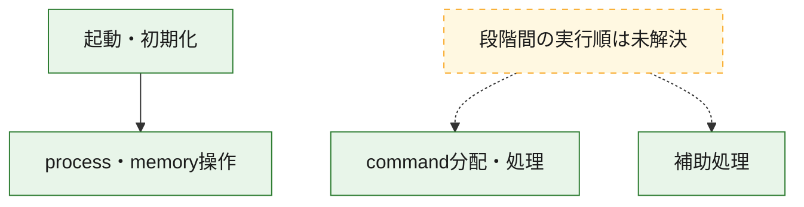
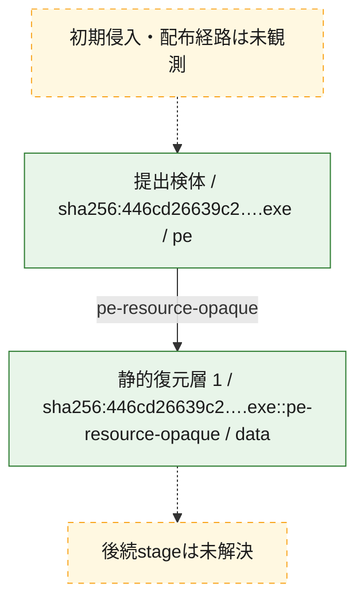
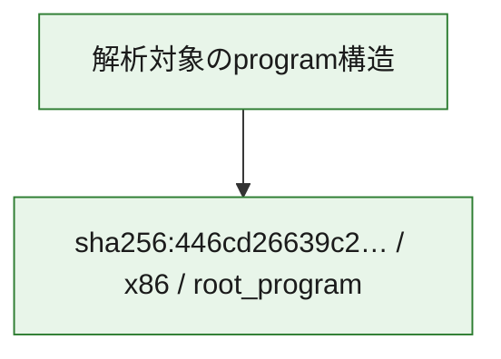

# 全体ロジック：446cd26639c2d1e09dd9d9edebbd7150d6d5c0f40a4f63c534430c5974a95879

代表関数の静的証跡から、起動・初期化、process・memory操作、command分配・処理の処理群を確認しました。

## 読み方

- phaseの掲載順は解析上の整理順です。observed_call_edgesがない段階間の実行順を断定しません。
- 図の実線は静的に観測した関係、点線と黄色のノードは未観測・未解決の関係を示します。
- 図は静的な要約であり、動的実行を再現するものではありません。
- 詳細な関数解説とfingerprintは[STATIC-LOGIC.md](STATIC-LOGIC.md)を参照してください。

## 静的可視化

### 実行フロー

### 感染チェーン

### モジュール関係

## 処理段階

### 1. 起動・初期化

entry pointから初期化と後続処理への移行を確認します。
確度: `confirmed_static_function_evidence`

- `446cd26639c2d1e09dd9d9edebbd7150d6d5c0f40a4f63c534430c5974a95879:ghidra:1400076c0` — 初期化と主要処理への分岐を行う入口関数です。 状態: `succeeded`、選定理由: `entry_point`, `meaningful_symbol_name`, `reviewed_call_centrality:11`, `role:entrypoint`

### 2. process・memory操作

process、thread、module、memory操作と実行移行を確認します。
確度: `confirmed_static_function_evidence`

- `446cd26639c2d1e09dd9d9edebbd7150d6d5c0f40a4f63c534430c5974a95879:ghidra:140001000` — process、thread、module、またはmemory操作に関係する関数です。 状態: `succeeded`、選定理由: `context_representative`, `reviewed_call_centrality:26`, `role:process_or_memory_operation`
- `446cd26639c2d1e09dd9d9edebbd7150d6d5c0f40a4f63c534430c5974a95879:ghidra:140004030` — process、thread、module、またはmemory操作に関係する関数です。 状態: `succeeded`、選定理由: `context_representative`, `reviewed_call_centrality:14`, `role:process_or_memory_operation`

### 3. command分配・処理

受信commandやtaskの解釈、分配、個別handlerへの移行を確認します。
確度: `confirmed_static_function_evidence_with_limits`

- `446cd26639c2d1e09dd9d9edebbd7150d6d5c0f40a4f63c534430c5974a95879:ghidra:14001a150` — commandの解釈、分配、または個別処理を担当する関数です。 状態: `limited_bad_instruction_or_flow`、選定理由: `meaningful_symbol_name`, `role:command_dispatch_or_handler`

### 4. 補助処理

主要処理を支える一般内部関数またはlibrary処理を確認します。
確度: `confirmed_static_function_evidence_with_limits`

- `446cd26639c2d1e09dd9d9edebbd7150d6d5c0f40a4f63c534430c5974a95879:ghidra:140001710` — 検体内部の一般処理を実装する関数です。 状態: `succeeded`、選定理由: `context_representative`
- `446cd26639c2d1e09dd9d9edebbd7150d6d5c0f40a4f63c534430c5974a95879:ghidra:140001d30` — 検体内部の一般処理を実装する関数です。 状態: `succeeded`、選定理由: `context_representative`, `reviewed_call_centrality:4`
- `446cd26639c2d1e09dd9d9edebbd7150d6d5c0f40a4f63c534430c5974a95879:ghidra:140001f30` — 検体内部の一般処理を実装する関数です。 状態: `succeeded`、選定理由: `context_representative`, `reviewed_call_centrality:1`
- `446cd26639c2d1e09dd9d9edebbd7150d6d5c0f40a4f63c534430c5974a95879:ghidra:140002020` — 検体内部の一般処理を実装する関数です。 状態: `succeeded`、選定理由: `context_representative`
- `446cd26639c2d1e09dd9d9edebbd7150d6d5c0f40a4f63c534430c5974a95879:ghidra:1400020a0` — 検体内部の一般処理を実装する関数です。 状態: `succeeded`、選定理由: `context_representative`
- `446cd26639c2d1e09dd9d9edebbd7150d6d5c0f40a4f63c534430c5974a95879:ghidra:140002110` — 検体内部の一般処理を実装する関数です。 状態: `succeeded`、選定理由: `context_representative`
- `446cd26639c2d1e09dd9d9edebbd7150d6d5c0f40a4f63c534430c5974a95879:ghidra:1400021f0` — 検体内部の一般処理を実装する関数です。 状態: `succeeded`、選定理由: `context_representative`
- `446cd26639c2d1e09dd9d9edebbd7150d6d5c0f40a4f63c534430c5974a95879:ghidra:1400022d0` — 検体内部の一般処理を実装する関数です。 状態: `limited_bad_instruction_or_flow`、選定理由: `context_representative`, `reviewed_call_centrality:3`
- `446cd26639c2d1e09dd9d9edebbd7150d6d5c0f40a4f63c534430c5974a95879:ghidra:140002360` — 検体内部の一般処理を実装する関数です。 状態: `limited_bad_instruction_or_flow`、選定理由: `context_representative`, `reviewed_call_centrality:3`
- `446cd26639c2d1e09dd9d9edebbd7150d6d5c0f40a4f63c534430c5974a95879:ghidra:140002400` — 検体内部の一般処理を実装する関数です。 状態: `limited_bad_instruction_or_flow`、選定理由: `context_representative`, `reviewed_call_centrality:3`
- `446cd26639c2d1e09dd9d9edebbd7150d6d5c0f40a4f63c534430c5974a95879:ghidra:1400024a0` — 検体内部の一般処理を実装する関数です。 状態: `limited_bad_instruction_or_flow`、選定理由: `context_representative`, `reviewed_call_centrality:3`
- `446cd26639c2d1e09dd9d9edebbd7150d6d5c0f40a4f63c534430c5974a95879:ghidra:140002540` — 検体内部の一般処理を実装する関数です。 状態: `limited_bad_instruction_or_flow`、選定理由: `context_representative`, `reviewed_call_centrality:1`
- `446cd26639c2d1e09dd9d9edebbd7150d6d5c0f40a4f63c534430c5974a95879:ghidra:1400026d0` — 検体内部の一般処理を実装する関数です。 状態: `limited_bad_instruction_or_flow`、選定理由: `context_representative`, `reviewed_call_centrality:1`
- `446cd26639c2d1e09dd9d9edebbd7150d6d5c0f40a4f63c534430c5974a95879:ghidra:1400028f0` — 検体内部の一般処理を実装する関数です。 状態: `succeeded`、選定理由: `context_representative`, `reviewed_call_centrality:1`
- `446cd26639c2d1e09dd9d9edebbd7150d6d5c0f40a4f63c534430c5974a95879:ghidra:140002980` — 検体内部の一般処理を実装する関数です。 状態: `limited_bad_instruction_or_flow`、選定理由: `context_representative`, `reviewed_call_centrality:3`
- `446cd26639c2d1e09dd9d9edebbd7150d6d5c0f40a4f63c534430c5974a95879:ghidra:140002a10` — 検体内部の一般処理を実装する関数です。 状態: `limited_bad_instruction_or_flow`、選定理由: `context_representative`, `reviewed_call_centrality:3`
- `446cd26639c2d1e09dd9d9edebbd7150d6d5c0f40a4f63c534430c5974a95879:ghidra:140002ab0` — 検体内部の一般処理を実装する関数です。 状態: `succeeded`、選定理由: `context_representative`
- `446cd26639c2d1e09dd9d9edebbd7150d6d5c0f40a4f63c534430c5974a95879:ghidra:140002b20` — 検体内部の一般処理を実装する関数です。 状態: `succeeded`、選定理由: `context_representative`
- `446cd26639c2d1e09dd9d9edebbd7150d6d5c0f40a4f63c534430c5974a95879:ghidra:140002b90` — 検体内部の一般処理を実装する関数です。 状態: `succeeded`、選定理由: `context_representative`, `reviewed_call_centrality:2`
- `446cd26639c2d1e09dd9d9edebbd7150d6d5c0f40a4f63c534430c5974a95879:ghidra:140002dd0` — 検体内部の一般処理を実装する関数です。 状態: `succeeded`、選定理由: `context_representative`, `reviewed_call_centrality:2`
- `446cd26639c2d1e09dd9d9edebbd7150d6d5c0f40a4f63c534430c5974a95879:ghidra:140003010` — 検体内部の一般処理を実装する関数です。 状態: `succeeded`、選定理由: `context_representative`, `reviewed_call_centrality:9`
- `446cd26639c2d1e09dd9d9edebbd7150d6d5c0f40a4f63c534430c5974a95879:ghidra:1400044c0` — 検体内部の一般処理を実装する関数です。 状態: `succeeded`、選定理由: `context_representative`, `reviewed_call_centrality:3`
- `446cd26639c2d1e09dd9d9edebbd7150d6d5c0f40a4f63c534430c5974a95879:ghidra:1400045e0` — 検体内部の一般処理を実装する関数です。 状態: `succeeded`、選定理由: `context_representative`, `reviewed_call_centrality:2`
- `446cd26639c2d1e09dd9d9edebbd7150d6d5c0f40a4f63c534430c5974a95879:ghidra:1400047f0` — 検体内部の一般処理を実装する関数です。 状態: `succeeded`、選定理由: `context_representative`, `reviewed_call_centrality:3`
- `446cd26639c2d1e09dd9d9edebbd7150d6d5c0f40a4f63c534430c5974a95879:ghidra:1400048f0` — 検体内部の一般処理を実装する関数です。 状態: `succeeded`、選定理由: `context_representative`, `reviewed_call_centrality:5`
- `446cd26639c2d1e09dd9d9edebbd7150d6d5c0f40a4f63c534430c5974a95879:ghidra:140004bd0` — 検体内部の一般処理を実装する関数です。 状態: `succeeded`、選定理由: `context_representative`, `reviewed_call_centrality:6`
- `446cd26639c2d1e09dd9d9edebbd7150d6d5c0f40a4f63c534430c5974a95879:ghidra:140004e90` — 検体内部の一般処理を実装する関数です。 状態: `succeeded`、選定理由: `context_representative`, `reviewed_call_centrality:7`
- `446cd26639c2d1e09dd9d9edebbd7150d6d5c0f40a4f63c534430c5974a95879:ghidra:14001201c` — 検体内部の一般処理を実装する関数です。 状態: `succeeded`、選定理由: `meaningful_symbol_name`

## 観測したcall関係

- `446cd26639c2d1e09dd9d9edebbd7150d6d5c0f40a4f63c534430c5974a95879:ghidra:140001f30` → `446cd26639c2d1e09dd9d9edebbd7150d6d5c0f40a4f63c534430c5974a95879:ghidra:1400047f0` （`support` → `support`）
- `446cd26639c2d1e09dd9d9edebbd7150d6d5c0f40a4f63c534430c5974a95879:ghidra:1400028f0` → `446cd26639c2d1e09dd9d9edebbd7150d6d5c0f40a4f63c534430c5974a95879:ghidra:1400045e0` （`support` → `support`）
- `446cd26639c2d1e09dd9d9edebbd7150d6d5c0f40a4f63c534430c5974a95879:ghidra:140003010` → `446cd26639c2d1e09dd9d9edebbd7150d6d5c0f40a4f63c534430c5974a95879:ghidra:140001d30` （`support` → `support`）
- `446cd26639c2d1e09dd9d9edebbd7150d6d5c0f40a4f63c534430c5974a95879:ghidra:140003010` → `446cd26639c2d1e09dd9d9edebbd7150d6d5c0f40a4f63c534430c5974a95879:ghidra:1400048f0` （`support` → `support`）
- `446cd26639c2d1e09dd9d9edebbd7150d6d5c0f40a4f63c534430c5974a95879:ghidra:140003010` → `446cd26639c2d1e09dd9d9edebbd7150d6d5c0f40a4f63c534430c5974a95879:ghidra:140004bd0` （`support` → `support`）
- `446cd26639c2d1e09dd9d9edebbd7150d6d5c0f40a4f63c534430c5974a95879:ghidra:140003010` → `446cd26639c2d1e09dd9d9edebbd7150d6d5c0f40a4f63c534430c5974a95879:ghidra:140004e90` （`support` → `support`）
- `446cd26639c2d1e09dd9d9edebbd7150d6d5c0f40a4f63c534430c5974a95879:ghidra:1400045e0` → `446cd26639c2d1e09dd9d9edebbd7150d6d5c0f40a4f63c534430c5974a95879:ghidra:1400044c0` （`support` → `support`）
- `446cd26639c2d1e09dd9d9edebbd7150d6d5c0f40a4f63c534430c5974a95879:ghidra:1400076c0` → `446cd26639c2d1e09dd9d9edebbd7150d6d5c0f40a4f63c534430c5974a95879:ghidra:140001000` （`startup` → `execution`）
- `ghidra-function:1d8630a615380de0cb8b57c7` → `ghidra-function:7515227e0f5bcf5a4e79aa72` （`unclassified` → `unclassified`）
- `ghidra-function:1d8630a615380de0cb8b57c7` → `ghidra-function:9b659953dabce0e696cd726d` （`unclassified` → `unclassified`）
- `ghidra-function:2842981e19da96beb310ef77` → `ghidra-function:7515227e0f5bcf5a4e79aa72` （`unclassified` → `unclassified`）
- `ghidra-function:2842981e19da96beb310ef77` → `ghidra-function:9b659953dabce0e696cd726d` （`unclassified` → `unclassified`）
- `ghidra-function:2b3f9dbaa478f3c4bb2e9dbe` → `ghidra-function:9b659953dabce0e696cd726d` （`unclassified` → `unclassified`）
- `ghidra-function:323508b7f17361b184538e13` → `ghidra-external:9baff67443897a52b03b18ff` （`unclassified` → `unclassified`）
- `ghidra-function:323508b7f17361b184538e13` → `ghidra-function:9b659953dabce0e696cd726d` （`unclassified` → `unclassified`）
- `ghidra-function:35c3e32219e8ba06fa677ccb` → `ghidra-external:97e8fceb9983fdee52490fd7` （`unclassified` → `unclassified`）
- `ghidra-function:35c3e32219e8ba06fa677ccb` → `ghidra-external:fc0075148a271bee7fa745e2` （`unclassified` → `unclassified`）
- `ghidra-function:35c3e32219e8ba06fa677ccb` → `ghidra-function:1c6678797eda0bc3739429b0` （`unclassified` → `unclassified`）
- `ghidra-function:35c3e32219e8ba06fa677ccb` → `ghidra-function:36343ba9e6903d820f1ad42a` （`unclassified` → `unclassified`）
- `ghidra-function:35c3e32219e8ba06fa677ccb` → `ghidra-function:418ee8cf4888f428c68775ff` （`unclassified` → `unclassified`）
- `ghidra-function:35c3e32219e8ba06fa677ccb` → `ghidra-function:4bb92c7600ec7db437c14049` （`unclassified` → `unclassified`）
- `ghidra-function:35c3e32219e8ba06fa677ccb` → `ghidra-function:5067cc9e83a845f865ea6f0f` （`unclassified` → `unclassified`）
- `ghidra-function:35c3e32219e8ba06fa677ccb` → `ghidra-function:54ec0f4cd39f01b341346bb6` （`unclassified` → `unclassified`）
- `ghidra-function:35c3e32219e8ba06fa677ccb` → `ghidra-function:56980dde1aa2ed563d504577` （`unclassified` → `unclassified`）
- `ghidra-function:35c3e32219e8ba06fa677ccb` → `ghidra-function:6e84d92ca8dc4642025aad9f` （`unclassified` → `unclassified`）
- `ghidra-function:35c3e32219e8ba06fa677ccb` → `ghidra-function:9b659953dabce0e696cd726d` （`unclassified` → `unclassified`）
- `ghidra-function:35c3e32219e8ba06fa677ccb` → `ghidra-function:9c7f44ca672c1172df5d3c64` （`unclassified` → `unclassified`）
- `ghidra-function:35c3e32219e8ba06fa677ccb` → `ghidra-function:a81a3aa98f439fb4e1b7021d` （`unclassified` → `unclassified`）
- `ghidra-function:35c3e32219e8ba06fa677ccb` → `ghidra-function:b91e1b2c99e8b0dcc22ec753` （`unclassified` → `unclassified`）
- `ghidra-function:35c3e32219e8ba06fa677ccb` → `ghidra-function:e3c5c2beaf759c5ec2189e1d` （`unclassified` → `unclassified`）
- `ghidra-function:35c3e32219e8ba06fa677ccb` → `ghidra-function:ea5280e814316f86a7ea1523` （`unclassified` → `unclassified`）
- `ghidra-function:35c3e32219e8ba06fa677ccb` → `ghidra-function:f7b2cda1e89c8ca8d8188044` （`unclassified` → `unclassified`）
- `ghidra-function:3e580335c09b15ab4a8a4391` → `ghidra-external:5b23333bd59e710babdf9e4e` （`unclassified` → `unclassified`）
- `ghidra-function:3e580335c09b15ab4a8a4391` → `ghidra-external:6bd4b6cec5bb1cbfe9ec5ebe` （`unclassified` → `unclassified`）
- `ghidra-function:3e580335c09b15ab4a8a4391` → `ghidra-function:36343ba9e6903d820f1ad42a` （`unclassified` → `unclassified`）
- `ghidra-function:3e580335c09b15ab4a8a4391` → `ghidra-function:418ee8cf4888f428c68775ff` （`unclassified` → `unclassified`）
- `ghidra-function:3e580335c09b15ab4a8a4391` → `ghidra-function:5ac2017130aa0cecb1bc21c0` （`unclassified` → `unclassified`）
- `ghidra-function:3e580335c09b15ab4a8a4391` → `ghidra-function:7e8bb7d20437eb0b8000fcfa` （`unclassified` → `unclassified`）
- `ghidra-function:3e580335c09b15ab4a8a4391` → `ghidra-function:96348dc4a4829a78c9e33622` （`unclassified` → `unclassified`）
- `ghidra-function:3e580335c09b15ab4a8a4391` → `ghidra-function:9b659953dabce0e696cd726d` （`unclassified` → `unclassified`）
- `ghidra-function:3e580335c09b15ab4a8a4391` → `ghidra-function:d299975fc2c6d5a80afaba1e` （`unclassified` → `unclassified`）
- `ghidra-function:4088781d8e74df5db9e8ae98` → `ghidra-function:9b659953dabce0e696cd726d` （`unclassified` → `unclassified`）
- `ghidra-function:4e1a7bc8b7a54bbd21da97a0` → `ghidra-function:7515227e0f5bcf5a4e79aa72` （`unclassified` → `unclassified`）
- `ghidra-function:4e1a7bc8b7a54bbd21da97a0` → `ghidra-function:9b659953dabce0e696cd726d` （`unclassified` → `unclassified`）
- `ghidra-function:4f1ed6edf121b9d46b82d384` → `ghidra-function:93cbdbea1e7d8d96466b884f` （`unclassified` → `unclassified`）
- `ghidra-function:63f4222a40179f422d2b1483` → `ghidra-external:e5416eea0936c56523e77312` （`unclassified` → `unclassified`）
- `ghidra-function:63f4222a40179f422d2b1483` → `ghidra-function:9b659953dabce0e696cd726d` （`unclassified` → `unclassified`）
- `ghidra-function:82cf6633afdae372bbeb4081` → `ghidra-external:fc0075148a271bee7fa745e2` （`unclassified` → `unclassified`）
- `ghidra-function:82cf6633afdae372bbeb4081` → `ghidra-function:0c9b947234db288228f8f208` （`unclassified` → `unclassified`）
- `ghidra-function:82cf6633afdae372bbeb4081` → `ghidra-function:31e198378b0126646137197d` （`unclassified` → `unclassified`）
- `ghidra-function:82cf6633afdae372bbeb4081` → `ghidra-function:35c3e32219e8ba06fa677ccb` （`unclassified` → `unclassified`）
- `ghidra-function:82cf6633afdae372bbeb4081` → `ghidra-function:38ea537bcf7ddb140b8e8425` （`unclassified` → `unclassified`）
- `ghidra-function:82cf6633afdae372bbeb4081` → `ghidra-function:4bf902e3f7e47068e8e69a62` （`unclassified` → `unclassified`）
- `ghidra-function:82cf6633afdae372bbeb4081` → `ghidra-function:5067cc9e83a845f865ea6f0f` （`unclassified` → `unclassified`）
- `ghidra-function:82cf6633afdae372bbeb4081` → `ghidra-function:56980dde1aa2ed563d504577` （`unclassified` → `unclassified`）
- `ghidra-function:82cf6633afdae372bbeb4081` → `ghidra-function:88fe29de0f335160e57973ee` （`unclassified` → `unclassified`）
- `ghidra-function:8dfb98055e7285df35ba889c` → `ghidra-external:019082df76cfe232a4d6bcdb` （`unclassified` → `unclassified`）
- `ghidra-function:8dfb98055e7285df35ba889c` → `ghidra-external:60559178f1bfc296c3136ed7` （`unclassified` → `unclassified`）
- `ghidra-function:8dfb98055e7285df35ba889c` → `ghidra-external:a64322b5cef8815ba33cfcec` （`unclassified` → `unclassified`）
- `ghidra-function:8dfb98055e7285df35ba889c` → `ghidra-external:cd862bcb1efc48e2ed883795` （`unclassified` → `unclassified`）
- `ghidra-function:93cbdbea1e7d8d96466b884f` → `ghidra-function:9b659953dabce0e696cd726d` （`unclassified` → `unclassified`）
- `ghidra-function:93cbdbea1e7d8d96466b884f` → `ghidra-function:d299975fc2c6d5a80afaba1e` （`unclassified` → `unclassified`）
- `ghidra-function:9878104cbb4536710fe048f3` → `ghidra-function:9b659953dabce0e696cd726d` （`unclassified` → `unclassified`）
- `ghidra-function:9878104cbb4536710fe048f3` → `ghidra-function:d299975fc2c6d5a80afaba1e` （`unclassified` → `unclassified`）
- `ghidra-function:a54f2b6a0a765c1ee1398ff6` → `ghidra-function:7515227e0f5bcf5a4e79aa72` （`unclassified` → `unclassified`）
- `ghidra-function:a54f2b6a0a765c1ee1398ff6` → `ghidra-function:9b659953dabce0e696cd726d` （`unclassified` → `unclassified`）
- `ghidra-function:b3081acc5983b7a9c5dd5bf5` → `ghidra-function:9878104cbb4536710fe048f3` （`unclassified` → `unclassified`）
- `ghidra-function:b4e85f2e57323bc92e2d11f7` → `ghidra-external:44cd8f021b7d208f8269ab25` （`unclassified` → `unclassified`）
- `ghidra-function:b4e85f2e57323bc92e2d11f7` → `ghidra-external:60559178f1bfc296c3136ed7` （`unclassified` → `unclassified`）
- `ghidra-function:b4e85f2e57323bc92e2d11f7` → `ghidra-external:a64322b5cef8815ba33cfcec` （`unclassified` → `unclassified`）
- `ghidra-function:b4e85f2e57323bc92e2d11f7` → `ghidra-external:cd862bcb1efc48e2ed883795` （`unclassified` → `unclassified`）
- `ghidra-function:b4e85f2e57323bc92e2d11f7` → `ghidra-external:e547919472775cfcbbe8c4e8` （`unclassified` → `unclassified`）
- `ghidra-function:c942932e37147a4b288d40d3` → `ghidra-external:60559178f1bfc296c3136ed7` （`unclassified` → `unclassified`）
- `ghidra-function:c942932e37147a4b288d40d3` → `ghidra-external:a64322b5cef8815ba33cfcec` （`unclassified` → `unclassified`）
- `ghidra-function:c942932e37147a4b288d40d3` → `ghidra-external:cd862bcb1efc48e2ed883795` （`unclassified` → `unclassified`）
- `ghidra-function:c942932e37147a4b288d40d3` → `ghidra-function:8c4ae57bc14ee786615df384` （`unclassified` → `unclassified`）
- `ghidra-function:c942932e37147a4b288d40d3` → `ghidra-function:8dfb98055e7285df35ba889c` （`unclassified` → `unclassified`）
- `ghidra-function:c942932e37147a4b288d40d3` → `ghidra-function:9785ea4ec091eed9c94c336f` （`unclassified` → `unclassified`）
- `ghidra-function:c942932e37147a4b288d40d3` → `ghidra-function:b4e85f2e57323bc92e2d11f7` （`unclassified` → `unclassified`）
- `ghidra-function:c942932e37147a4b288d40d3` → `ghidra-function:cc57ec7b8f745e0384e4feef` （`unclassified` → `unclassified`）
- `ghidra-function:c942932e37147a4b288d40d3` → `ghidra-function:f8f315b9a07e264acf926d24` （`unclassified` → `unclassified`）
- `ghidra-function:caf99516f2bc1e0f23382e95` → `ghidra-function:7515227e0f5bcf5a4e79aa72` （`unclassified` → `unclassified`）
- `ghidra-function:caf99516f2bc1e0f23382e95` → `ghidra-function:9b659953dabce0e696cd726d` （`unclassified` → `unclassified`）
- `ghidra-function:cc57ec7b8f745e0384e4feef` → `ghidra-external:60559178f1bfc296c3136ed7` （`unclassified` → `unclassified`）
- `ghidra-function:cc57ec7b8f745e0384e4feef` → `ghidra-external:a64322b5cef8815ba33cfcec` （`unclassified` → `unclassified`）
- `ghidra-function:cc57ec7b8f745e0384e4feef` → `ghidra-external:cd862bcb1efc48e2ed883795` （`unclassified` → `unclassified`）
- `ghidra-function:db940de023aa72b322d0ea07` → `ghidra-function:7515227e0f5bcf5a4e79aa72` （`unclassified` → `unclassified`）
- `ghidra-function:db940de023aa72b322d0ea07` → `ghidra-function:9b659953dabce0e696cd726d` （`unclassified` → `unclassified`）
- `ghidra-function:f8f315b9a07e264acf926d24` → `ghidra-external:019082df76cfe232a4d6bcdb` （`unclassified` → `unclassified`）
- `ghidra-function:f8f315b9a07e264acf926d24` → `ghidra-external:44cd8f021b7d208f8269ab25` （`unclassified` → `unclassified`）
- `ghidra-function:f8f315b9a07e264acf926d24` → `ghidra-external:60559178f1bfc296c3136ed7` （`unclassified` → `unclassified`）
- `ghidra-function:f8f315b9a07e264acf926d24` → `ghidra-external:a64322b5cef8815ba33cfcec` （`unclassified` → `unclassified`）
- `ghidra-function:f8f315b9a07e264acf926d24` → `ghidra-external:cd862bcb1efc48e2ed883795` （`unclassified` → `unclassified`）
- `ghidra-function:f8f315b9a07e264acf926d24` → `ghidra-external:e547919472775cfcbbe8c4e8` （`unclassified` → `unclassified`）
- `ghidra-function:f92c40fda9d07a7b52272caf` → `ghidra-function:4f1ed6edf121b9d46b82d384` （`unclassified` → `unclassified`）

## 解析範囲と制約

- 選定外関数は全体inventoryへ残しますが、関数本体の個別解説対象にはしていません。
- indirect call、難読化、packer、VM、壊れたcontrol flowによりcall関係が欠落する場合があります。
- 文書は静的解析に基づき、検体実行や外部通信による動的確認は行っていません。
