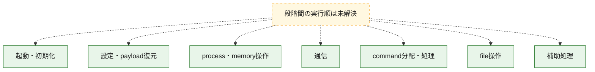
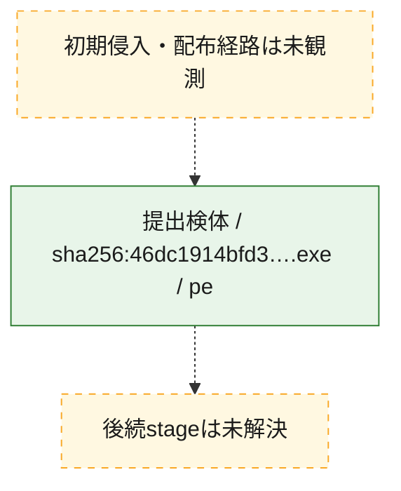
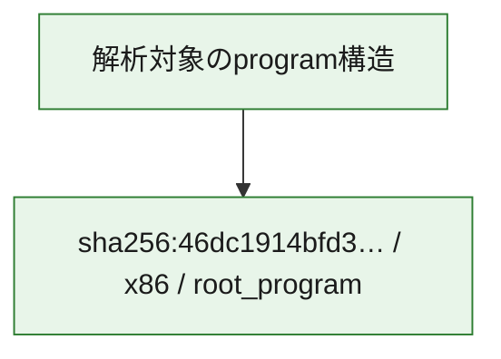

# 全体ロジック：46dc1914bfd36e66de65da421aba7581711cf761705a0cc8c9affc9f674c710e

代表関数の静的証跡から、起動・初期化、設定・payload復元、process・memory操作、通信、command分配・処理、file操作の処理群を確認しました。

## 読み方

- phaseの掲載順は解析上の整理順です。observed_call_edgesがない段階間の実行順を断定しません。
- 図の実線は静的に観測した関係、点線と黄色のノードは未観測・未解決の関係を示します。
- 図は静的な要約であり、動的実行を再現するものではありません。
- 詳細な関数解説とfingerprintは[STATIC-LOGIC.md](STATIC-LOGIC.md)を参照してください。

## 静的可視化

### 実行フロー

### 感染チェーン

### モジュール関係

## 処理段階

### 1. 起動・初期化

entry pointから初期化と後続処理への移行を確認します。
確度: `confirmed_static_function_evidence_with_limits`

- `46dc1914bfd36e66de65da421aba7581711cf761705a0cc8c9affc9f674c710e:ghidra:0051b540` — 初期化と主要処理への分岐を行う入口関数です。 状態: `succeeded`、選定理由: `entry_point`, `meaningful_symbol_name`, `probable_go_main_user_code`, `reviewed_call_centrality:3`, `role:entrypoint`
- `46dc1914bfd36e66de65da421aba7581711cf761705a0cc8c9affc9f674c710e:ghidra:0051b580` — 初期化と主要処理への分岐を行う入口関数です。 状態: `succeeded`、選定理由: `entry_point`, `meaningful_symbol_name`, `probable_go_main_user_code`, `reviewed_call_centrality:20`, `role:entrypoint`
- `46dc1914bfd36e66de65da421aba7581711cf761705a0cc8c9affc9f674c710e:ghidra:00521700` — 初期化と主要処理への分岐を行う入口関数です。 状態: `succeeded`、選定理由: `entry_point`, `meaningful_symbol_name`, `probable_go_main_user_code`, `reviewed_call_centrality:19`, `role:entrypoint`
- `46dc1914bfd36e66de65da421aba7581711cf761705a0cc8c9affc9f674c710e:ghidra:005247c0` — 初期化と主要処理への分岐を行う入口関数です。 状態: `succeeded`、選定理由: `entry_point`, `meaningful_symbol_name`, `probable_go_main_user_code`, `reviewed_call_centrality:21`, `role:entrypoint`
- `46dc1914bfd36e66de65da421aba7581711cf761705a0cc8c9affc9f674c710e:ghidra:00529060` — 初期化と主要処理への分岐を行う入口関数です。 状態: `succeeded`、選定理由: `entry_point`, `meaningful_symbol_name`, `probable_go_main_user_code`, `reviewed_call_centrality:22`, `role:entrypoint`
- `46dc1914bfd36e66de65da421aba7581711cf761705a0cc8c9affc9f674c710e:ghidra:005385e0` — 初期化と主要処理への分岐を行う入口関数です。 状態: `succeeded`、選定理由: `entry_point`, `meaningful_symbol_name`, `probable_go_main_user_code`, `reviewed_call_centrality:19`, `role:entrypoint`
- `46dc1914bfd36e66de65da421aba7581711cf761705a0cc8c9affc9f674c710e:ghidra:0053d000` — 初期化と主要処理への分岐を行う入口関数です。 状態: `succeeded`、選定理由: `entry_point`, `meaningful_symbol_name`, `probable_go_main_user_code`, `reviewed_call_centrality:19`, `role:entrypoint`
- `46dc1914bfd36e66de65da421aba7581711cf761705a0cc8c9affc9f674c710e:ghidra:00547c80` — 初期化と主要処理への分岐を行う入口関数です。 状態: `succeeded`、選定理由: `entry_point`, `meaningful_symbol_name`, `probable_go_main_user_code`, `reviewed_call_centrality:20`, `role:entrypoint`
- `46dc1914bfd36e66de65da421aba7581711cf761705a0cc8c9affc9f674c710e:ghidra:005528e0` — 初期化と主要処理への分岐を行う入口関数です。 状態: `succeeded`、選定理由: `entry_point`, `meaningful_symbol_name`, `probable_go_main_user_code`, `reviewed_call_centrality:20`, `role:entrypoint`
- `46dc1914bfd36e66de65da421aba7581711cf761705a0cc8c9affc9f674c710e:ghidra:00563300` — 初期化と主要処理への分岐を行う入口関数です。 状態: `succeeded`、選定理由: `entry_point`, `meaningful_symbol_name`, `probable_go_main_user_code`, `reviewed_call_centrality:21`, `role:entrypoint`
- `46dc1914bfd36e66de65da421aba7581711cf761705a0cc8c9affc9f674c710e:ghidra:005759a0` — 初期化と主要処理への分岐を行う入口関数です。 状態: `succeeded`、選定理由: `entry_point`, `meaningful_symbol_name`, `probable_go_main_user_code`, `reviewed_call_centrality:19`, `role:entrypoint`
- `46dc1914bfd36e66de65da421aba7581711cf761705a0cc8c9affc9f674c710e:ghidra:005771a0` — 初期化と主要処理への分岐を行う入口関数です。 状態: `succeeded`、選定理由: `entry_point`, `meaningful_symbol_name`, `probable_go_main_user_code`, `reviewed_call_centrality:20`, `role:entrypoint`
- `46dc1914bfd36e66de65da421aba7581711cf761705a0cc8c9affc9f674c710e:ghidra:0057ec60` — 初期化と主要処理への分岐を行う入口関数です。 状態: `succeeded`、選定理由: `entry_point`, `meaningful_symbol_name`, `probable_go_main_user_code`, `reviewed_call_centrality:19`, `role:entrypoint`
- `46dc1914bfd36e66de65da421aba7581711cf761705a0cc8c9affc9f674c710e:ghidra:00580460` — 初期化と主要処理への分岐を行う入口関数です。 状態: `succeeded`、選定理由: `entry_point`, `meaningful_symbol_name`, `probable_go_main_user_code`, `reviewed_call_centrality:21`, `role:entrypoint`
- `46dc1914bfd36e66de65da421aba7581711cf761705a0cc8c9affc9f674c710e:ghidra:0058b0c0` — 初期化と主要処理への分岐を行う入口関数です。 状態: `succeeded`、選定理由: `entry_point`, `meaningful_symbol_name`, `probable_go_main_user_code`, `reviewed_call_centrality:22`, `role:entrypoint`
- `46dc1914bfd36e66de65da421aba7581711cf761705a0cc8c9affc9f674c710e:ghidra:00597600` — 初期化と主要処理への分岐を行う入口関数です。 状態: `succeeded`、選定理由: `entry_point`, `meaningful_symbol_name`, `probable_go_main_user_code`, `reviewed_call_centrality:19`, `role:entrypoint`
- `46dc1914bfd36e66de65da421aba7581711cf761705a0cc8c9affc9f674c710e:ghidra:0059a780` — 初期化と主要処理への分岐を行う入口関数です。 状態: `succeeded`、選定理由: `entry_point`, `meaningful_symbol_name`, `probable_go_main_user_code`, `reviewed_call_centrality:19`, `role:entrypoint`
- `46dc1914bfd36e66de65da421aba7581711cf761705a0cc8c9affc9f674c710e:ghidra:005a6b20` — 初期化と主要処理への分岐を行う入口関数です。 状態: `failed`、選定理由: `entry_point`, `meaningful_symbol_name`, `probable_go_main_user_code`, `role:entrypoint`
- `46dc1914bfd36e66de65da421aba7581711cf761705a0cc8c9affc9f674c710e:ghidra:005d1b60` — 初期化と主要処理への分岐を行う入口関数です。 状態: `succeeded`、選定理由: `entry_point`, `meaningful_symbol_name`, `probable_go_main_user_code`, `reviewed_call_centrality:19`, `role:entrypoint`
- `46dc1914bfd36e66de65da421aba7581711cf761705a0cc8c9affc9f674c710e:ghidra:005de040` — 初期化と主要処理への分岐を行う入口関数です。 状態: `succeeded`、選定理由: `entry_point`, `meaningful_symbol_name`, `probable_go_main_user_code`, `reviewed_call_centrality:19`, `role:entrypoint`
- `46dc1914bfd36e66de65da421aba7581711cf761705a0cc8c9affc9f674c710e:ghidra:005e41e0` — 初期化と主要処理への分岐を行う入口関数です。 状態: `succeeded`、選定理由: `entry_point`, `meaningful_symbol_name`, `probable_go_main_user_code`, `reviewed_call_centrality:21`, `role:entrypoint`
- `46dc1914bfd36e66de65da421aba7581711cf761705a0cc8c9affc9f674c710e:ghidra:005f3640` — 初期化と主要処理への分岐を行う入口関数です。 状態: `succeeded`、選定理由: `entry_point`, `meaningful_symbol_name`, `probable_go_main_user_code`, `reviewed_call_centrality:21`, `role:entrypoint`
- `46dc1914bfd36e66de65da421aba7581711cf761705a0cc8c9affc9f674c710e:ghidra:005f9780` — 初期化と主要処理への分岐を行う入口関数です。 状態: `succeeded`、選定理由: `entry_point`, `meaningful_symbol_name`, `probable_go_main_user_code`, `reviewed_call_centrality:24`, `role:entrypoint`
- `46dc1914bfd36e66de65da421aba7581711cf761705a0cc8c9affc9f674c710e:ghidra:00601420` — 初期化と主要処理への分岐を行う入口関数です。 状態: `succeeded`、選定理由: `entry_point`, `meaningful_symbol_name`, `probable_go_main_user_code`, `reviewed_call_centrality:20`, `role:entrypoint`
- `46dc1914bfd36e66de65da421aba7581711cf761705a0cc8c9affc9f674c710e:ghidra:0060c020` — 初期化と主要処理への分岐を行う入口関数です。 状態: `succeeded`、選定理由: `entry_point`, `meaningful_symbol_name`, `probable_go_main_user_code`, `reviewed_call_centrality:21`, `role:entrypoint`

### 2. 設定・payload復元

設定、resource、payload、暗号化データの復元・変換を確認します。
確度: `confirmed_static_function_evidence`

- `46dc1914bfd36e66de65da421aba7581711cf761705a0cc8c9affc9f674c710e:ghidra:0047fd00` — 設定、resource、payloadなどの解析・変換を行う関数です。 状態: `succeeded`、選定理由: `meaningful_symbol_name`, `reviewed_call_centrality:4`, `role:config_or_data_transform`

### 3. process・memory操作

process、thread、module、memory操作と実行移行を確認します。
確度: `confirmed_static_function_evidence`

- `46dc1914bfd36e66de65da421aba7581711cf761705a0cc8c9affc9f674c710e:ghidra:0046e3a0` — process、thread、module、またはmemory操作に関係する関数です。 状態: `succeeded`、選定理由: `meaningful_symbol_name`, `reviewed_call_centrality:3`, `role:process_or_memory_operation`

### 4. 通信

通信初期化、endpoint処理、送受信の役割を確認します。
確度: `confirmed_static_function_evidence`

- `46dc1914bfd36e66de65da421aba7581711cf761705a0cc8c9affc9f674c710e:ghidra:004a4d40` — 通信初期化、送受信、またはendpoint処理に関係する関数です。 状態: `succeeded`、選定理由: `meaningful_symbol_name`, `reviewed_call_centrality:8`, `role:network_communication`

### 5. command分配・処理

受信commandやtaskの解釈、分配、個別handlerへの移行を確認します。
確度: `confirmed_static_function_evidence`

- `46dc1914bfd36e66de65da421aba7581711cf761705a0cc8c9affc9f674c710e:ghidra:004bce80` — commandの解釈、分配、または個別処理を担当する関数です。 状態: `succeeded`、選定理由: `meaningful_symbol_name`, `reviewed_call_centrality:5`, `role:command_dispatch_or_handler`

### 6. file操作

fileやdirectoryの作成、読書き、削除を確認します。
確度: `confirmed_static_function_evidence`

- `46dc1914bfd36e66de65da421aba7581711cf761705a0cc8c9affc9f674c710e:ghidra:004bd8e0` — fileまたはdirectoryの読書き・管理に関係する関数です。 状態: `succeeded`、選定理由: `meaningful_symbol_name`, `reviewed_call_centrality:6`, `role:file_operation`

### 7. 補助処理

主要処理を支える一般内部関数またはlibrary処理を確認します。
確度: `confirmed_static_function_evidence`

- `46dc1914bfd36e66de65da421aba7581711cf761705a0cc8c9affc9f674c710e:ghidra:00401080` — compiler生成処理または汎用library処理とみられる関数です。 状態: `succeeded`、選定理由: `meaningful_symbol_name`, `reviewed_call_centrality:10`
- `46dc1914bfd36e66de65da421aba7581711cf761705a0cc8c9affc9f674c710e:ghidra:00465320` — 検体内部の一般処理を実装する関数です。 状態: `succeeded`、選定理由: `meaningful_symbol_name`, `reviewed_call_centrality:3`

## 観測したcall関係

- `ghidra-function:02e389409d1ad50350c9ff52` → `ghidra-external:3e0213c5082048db7ad16d25` （`unclassified` → `unclassified`）
- `ghidra-function:02e389409d1ad50350c9ff52` → `ghidra-external:4356c85e6d9d9311481f6134` （`unclassified` → `unclassified`）
- `ghidra-function:02e389409d1ad50350c9ff52` → `ghidra-external:743dbd727000497d1965f842` （`unclassified` → `unclassified`）
- `ghidra-function:02e389409d1ad50350c9ff52` → `ghidra-external:c902c9d6ef90162fcada108b` （`unclassified` → `unclassified`）
- `ghidra-function:0d30736979467339689a4c5a` → `ghidra-external:1e5682c66174939ddf71c7db` （`unclassified` → `unclassified`）
- `ghidra-function:0d30736979467339689a4c5a` → `ghidra-external:283e08982d771bd1a0f4f7dd` （`unclassified` → `unclassified`）
- `ghidra-function:0d30736979467339689a4c5a` → `ghidra-external:28c2b0346845bd798477b4ad` （`unclassified` → `unclassified`）
- `ghidra-function:0d30736979467339689a4c5a` → `ghidra-external:4356c85e6d9d9311481f6134` （`unclassified` → `unclassified`）
- `ghidra-function:0d30736979467339689a4c5a` → `ghidra-external:76bc93cbbd387d1c75172048` （`unclassified` → `unclassified`）
- `ghidra-function:0d30736979467339689a4c5a` → `ghidra-external:7ce2203729f84d66eed50f93` （`unclassified` → `unclassified`）
- `ghidra-function:0d30736979467339689a4c5a` → `ghidra-external:7de84756ba0d0d946d7c0fce` （`unclassified` → `unclassified`）
- `ghidra-function:0d30736979467339689a4c5a` → `ghidra-external:8123081185f9a2de8d5cd868` （`unclassified` → `unclassified`）
- `ghidra-function:0d30736979467339689a4c5a` → `ghidra-external:9709ee0c6eab1bc564a8ad54` （`unclassified` → `unclassified`）
- `ghidra-function:0d30736979467339689a4c5a` → `ghidra-external:b57d794637f7ad0dbcaadb79` （`unclassified` → `unclassified`）
- `ghidra-function:0d30736979467339689a4c5a` → `ghidra-external:bb3454c6a1187edb2e4aeb87` （`unclassified` → `unclassified`）
- `ghidra-function:0d30736979467339689a4c5a` → `ghidra-external:bfd0b59023fe54c713673861` （`unclassified` → `unclassified`）
- `ghidra-function:0d30736979467339689a4c5a` → `ghidra-external:c631e51d634efed3b07b8654` （`unclassified` → `unclassified`）
- `ghidra-function:0d30736979467339689a4c5a` → `ghidra-external:c902c9d6ef90162fcada108b` （`unclassified` → `unclassified`）
- `ghidra-function:0d30736979467339689a4c5a` → `ghidra-external:ccd4748853c9d79c167231e9` （`unclassified` → `unclassified`）
- `ghidra-function:0d30736979467339689a4c5a` → `ghidra-external:d42d2c77a201c71e353ce537` （`unclassified` → `unclassified`）
- `ghidra-function:0d30736979467339689a4c5a` → `ghidra-external:dd5d7b575abefe8c15627e53` （`unclassified` → `unclassified`）
- `ghidra-function:0d30736979467339689a4c5a` → `ghidra-external:de5aa676316b9e3632b65dda` （`unclassified` → `unclassified`）
- `ghidra-function:0d30736979467339689a4c5a` → `ghidra-external:e6564e689665dd739f60f998` （`unclassified` → `unclassified`）
- `ghidra-function:0d30736979467339689a4c5a` → `ghidra-external:f35726422e47f42762df938e` （`unclassified` → `unclassified`）
- `ghidra-function:0d30736979467339689a4c5a` → `ghidra-external:f67e4e7dcb00dc1e0d1d4bba` （`unclassified` → `unclassified`）
- `ghidra-function:0fb307928e725b67ce2df4cd` → `ghidra-external:1e5682c66174939ddf71c7db` （`unclassified` → `unclassified`）
- `ghidra-function:0fb307928e725b67ce2df4cd` → `ghidra-external:283e08982d771bd1a0f4f7dd` （`unclassified` → `unclassified`）
- `ghidra-function:0fb307928e725b67ce2df4cd` → `ghidra-external:28c2b0346845bd798477b4ad` （`unclassified` → `unclassified`）
- `ghidra-function:0fb307928e725b67ce2df4cd` → `ghidra-external:4356c85e6d9d9311481f6134` （`unclassified` → `unclassified`）
- `ghidra-function:0fb307928e725b67ce2df4cd` → `ghidra-external:59af3a5a5fc9e28f90241733` （`unclassified` → `unclassified`）
- `ghidra-function:0fb307928e725b67ce2df4cd` → `ghidra-external:76bc93cbbd387d1c75172048` （`unclassified` → `unclassified`）
- `ghidra-function:0fb307928e725b67ce2df4cd` → `ghidra-external:7ce2203729f84d66eed50f93` （`unclassified` → `unclassified`）
- `ghidra-function:0fb307928e725b67ce2df4cd` → `ghidra-external:7de84756ba0d0d946d7c0fce` （`unclassified` → `unclassified`）
- `ghidra-function:0fb307928e725b67ce2df4cd` → `ghidra-external:8123081185f9a2de8d5cd868` （`unclassified` → `unclassified`）
- `ghidra-function:0fb307928e725b67ce2df4cd` → `ghidra-external:98f7699cafbe5ca78c5919d4` （`unclassified` → `unclassified`）
- `ghidra-function:0fb307928e725b67ce2df4cd` → `ghidra-external:b57d794637f7ad0dbcaadb79` （`unclassified` → `unclassified`）
- `ghidra-function:0fb307928e725b67ce2df4cd` → `ghidra-external:bb3454c6a1187edb2e4aeb87` （`unclassified` → `unclassified`）
- `ghidra-function:0fb307928e725b67ce2df4cd` → `ghidra-external:c631e51d634efed3b07b8654` （`unclassified` → `unclassified`）
- `ghidra-function:0fb307928e725b67ce2df4cd` → `ghidra-external:c902c9d6ef90162fcada108b` （`unclassified` → `unclassified`）
- `ghidra-function:0fb307928e725b67ce2df4cd` → `ghidra-external:ccd4748853c9d79c167231e9` （`unclassified` → `unclassified`）
- `ghidra-function:0fb307928e725b67ce2df4cd` → `ghidra-external:dd5d7b575abefe8c15627e53` （`unclassified` → `unclassified`）
- `ghidra-function:0fb307928e725b67ce2df4cd` → `ghidra-external:de5aa676316b9e3632b65dda` （`unclassified` → `unclassified`）
- `ghidra-function:0fb307928e725b67ce2df4cd` → `ghidra-external:e6564e689665dd739f60f998` （`unclassified` → `unclassified`）
- `ghidra-function:0fb307928e725b67ce2df4cd` → `ghidra-external:f35726422e47f42762df938e` （`unclassified` → `unclassified`）
- `ghidra-function:0fb307928e725b67ce2df4cd` → `ghidra-external:f67e4e7dcb00dc1e0d1d4bba` （`unclassified` → `unclassified`）
- `ghidra-function:102d4adf1cb6abc8e5be0a37` → `ghidra-external:1e5682c66174939ddf71c7db` （`unclassified` → `unclassified`）
- `ghidra-function:102d4adf1cb6abc8e5be0a37` → `ghidra-external:283e08982d771bd1a0f4f7dd` （`unclassified` → `unclassified`）
- `ghidra-function:102d4adf1cb6abc8e5be0a37` → `ghidra-external:28c2b0346845bd798477b4ad` （`unclassified` → `unclassified`）
- `ghidra-function:102d4adf1cb6abc8e5be0a37` → `ghidra-external:4356c85e6d9d9311481f6134` （`unclassified` → `unclassified`）
- `ghidra-function:102d4adf1cb6abc8e5be0a37` → `ghidra-external:76bc93cbbd387d1c75172048` （`unclassified` → `unclassified`）
- `ghidra-function:102d4adf1cb6abc8e5be0a37` → `ghidra-external:7ce2203729f84d66eed50f93` （`unclassified` → `unclassified`）
- `ghidra-function:102d4adf1cb6abc8e5be0a37` → `ghidra-external:7de84756ba0d0d946d7c0fce` （`unclassified` → `unclassified`）
- `ghidra-function:102d4adf1cb6abc8e5be0a37` → `ghidra-external:8123081185f9a2de8d5cd868` （`unclassified` → `unclassified`）
- `ghidra-function:102d4adf1cb6abc8e5be0a37` → `ghidra-external:b57d794637f7ad0dbcaadb79` （`unclassified` → `unclassified`）
- `ghidra-function:102d4adf1cb6abc8e5be0a37` → `ghidra-external:bb3454c6a1187edb2e4aeb87` （`unclassified` → `unclassified`）
- `ghidra-function:102d4adf1cb6abc8e5be0a37` → `ghidra-external:c631e51d634efed3b07b8654` （`unclassified` → `unclassified`）
- `ghidra-function:102d4adf1cb6abc8e5be0a37` → `ghidra-external:c902c9d6ef90162fcada108b` （`unclassified` → `unclassified`）
- `ghidra-function:102d4adf1cb6abc8e5be0a37` → `ghidra-external:ca7bddb6729787e7bca80549` （`unclassified` → `unclassified`）
- `ghidra-function:102d4adf1cb6abc8e5be0a37` → `ghidra-external:ccd4748853c9d79c167231e9` （`unclassified` → `unclassified`）
- `ghidra-function:102d4adf1cb6abc8e5be0a37` → `ghidra-external:dd5d7b575abefe8c15627e53` （`unclassified` → `unclassified`）
- `ghidra-function:102d4adf1cb6abc8e5be0a37` → `ghidra-external:de5aa676316b9e3632b65dda` （`unclassified` → `unclassified`）
- `ghidra-function:102d4adf1cb6abc8e5be0a37` → `ghidra-external:e6564e689665dd739f60f998` （`unclassified` → `unclassified`）
- `ghidra-function:102d4adf1cb6abc8e5be0a37` → `ghidra-external:f35726422e47f42762df938e` （`unclassified` → `unclassified`）
- `ghidra-function:102d4adf1cb6abc8e5be0a37` → `ghidra-external:f67e4e7dcb00dc1e0d1d4bba` （`unclassified` → `unclassified`）
- `ghidra-function:1507517b98d908218bab9340` → `ghidra-external:5ad9839b9affa8b1bc51910e` （`unclassified` → `unclassified`）
- `ghidra-function:1507517b98d908218bab9340` → `ghidra-external:656c8bcb6d9fa7a2d5ac2ee5` （`unclassified` → `unclassified`）
- `ghidra-function:1507517b98d908218bab9340` → `ghidra-external:6ad9df16040377ed7043bc07` （`unclassified` → `unclassified`）
- `ghidra-function:1507517b98d908218bab9340` → `ghidra-external:7ce2203729f84d66eed50f93` （`unclassified` → `unclassified`）
- `ghidra-function:1507517b98d908218bab9340` → `ghidra-external:90a775965561d87ad18fa4cd` （`unclassified` → `unclassified`）
- `ghidra-function:1f12afc96289f9cc01c5b3c2` → `ghidra-external:17e43118c9fdc895008a23d1` （`unclassified` → `unclassified`）
- `ghidra-function:1f12afc96289f9cc01c5b3c2` → `ghidra-external:516599a09c518d8f274e3ac5` （`unclassified` → `unclassified`）
- `ghidra-function:1f12afc96289f9cc01c5b3c2` → `ghidra-external:59af3a5a5fc9e28f90241733` （`unclassified` → `unclassified`）
- `ghidra-function:1f12afc96289f9cc01c5b3c2` → `ghidra-external:5c8e7d76c5bdf2437b9b7e30` （`unclassified` → `unclassified`）
- `ghidra-function:1f12afc96289f9cc01c5b3c2` → `ghidra-external:656c8bcb6d9fa7a2d5ac2ee5` （`unclassified` → `unclassified`）
- `ghidra-function:1f12afc96289f9cc01c5b3c2` → `ghidra-external:7ce2203729f84d66eed50f93` （`unclassified` → `unclassified`）
- `ghidra-function:1f12afc96289f9cc01c5b3c2` → `ghidra-external:7d63d9d22e11e1d2626d1959` （`unclassified` → `unclassified`）
- `ghidra-function:1f12afc96289f9cc01c5b3c2` → `ghidra-external:e92aeb235a9fc3b99d5d0481` （`unclassified` → `unclassified`）
- `ghidra-function:21352f3af34b55915c65aea1` → `ghidra-external:1e5682c66174939ddf71c7db` （`unclassified` → `unclassified`）
- `ghidra-function:21352f3af34b55915c65aea1` → `ghidra-external:283e08982d771bd1a0f4f7dd` （`unclassified` → `unclassified`）
- `ghidra-function:21352f3af34b55915c65aea1` → `ghidra-external:28c2b0346845bd798477b4ad` （`unclassified` → `unclassified`）
- `ghidra-function:21352f3af34b55915c65aea1` → `ghidra-external:4356c85e6d9d9311481f6134` （`unclassified` → `unclassified`）
- `ghidra-function:21352f3af34b55915c65aea1` → `ghidra-external:76bc93cbbd387d1c75172048` （`unclassified` → `unclassified`）
- `ghidra-function:21352f3af34b55915c65aea1` → `ghidra-external:7ce2203729f84d66eed50f93` （`unclassified` → `unclassified`）
- `ghidra-function:21352f3af34b55915c65aea1` → `ghidra-external:7de84756ba0d0d946d7c0fce` （`unclassified` → `unclassified`）
- `ghidra-function:21352f3af34b55915c65aea1` → `ghidra-external:8123081185f9a2de8d5cd868` （`unclassified` → `unclassified`）
- `ghidra-function:21352f3af34b55915c65aea1` → `ghidra-external:b57d794637f7ad0dbcaadb79` （`unclassified` → `unclassified`）
- `ghidra-function:21352f3af34b55915c65aea1` → `ghidra-external:bb3454c6a1187edb2e4aeb87` （`unclassified` → `unclassified`）
- `ghidra-function:21352f3af34b55915c65aea1` → `ghidra-external:bf020f5f02ed5e9c53931aac` （`unclassified` → `unclassified`）
- `ghidra-function:21352f3af34b55915c65aea1` → `ghidra-external:c631e51d634efed3b07b8654` （`unclassified` → `unclassified`）
- `ghidra-function:21352f3af34b55915c65aea1` → `ghidra-external:c65a81c6b02fd9aa41f74cd9` （`unclassified` → `unclassified`）
- `ghidra-function:21352f3af34b55915c65aea1` → `ghidra-external:c902c9d6ef90162fcada108b` （`unclassified` → `unclassified`）
- `ghidra-function:21352f3af34b55915c65aea1` → `ghidra-external:ccd4748853c9d79c167231e9` （`unclassified` → `unclassified`）
- `ghidra-function:21352f3af34b55915c65aea1` → `ghidra-external:dd5d7b575abefe8c15627e53` （`unclassified` → `unclassified`）
- `ghidra-function:21352f3af34b55915c65aea1` → `ghidra-external:de5aa676316b9e3632b65dda` （`unclassified` → `unclassified`）
- `ghidra-function:21352f3af34b55915c65aea1` → `ghidra-external:e6564e689665dd739f60f998` （`unclassified` → `unclassified`）
- `ghidra-function:21352f3af34b55915c65aea1` → `ghidra-external:f35726422e47f42762df938e` （`unclassified` → `unclassified`）
- `ghidra-function:21352f3af34b55915c65aea1` → `ghidra-external:f67e4e7dcb00dc1e0d1d4bba` （`unclassified` → `unclassified`）
- `ghidra-function:21cfa61c3a2b491038516452` → `ghidra-external:0bd8c7f09ac79155283de15c` （`unclassified` → `unclassified`）
- `ghidra-function:21cfa61c3a2b491038516452` → `ghidra-external:1e5682c66174939ddf71c7db` （`unclassified` → `unclassified`）
- `ghidra-function:21cfa61c3a2b491038516452` → `ghidra-external:283e08982d771bd1a0f4f7dd` （`unclassified` → `unclassified`）
- `ghidra-function:21cfa61c3a2b491038516452` → `ghidra-external:28c2b0346845bd798477b4ad` （`unclassified` → `unclassified`）
- `ghidra-function:21cfa61c3a2b491038516452` → `ghidra-external:4356c85e6d9d9311481f6134` （`unclassified` → `unclassified`）
- `ghidra-function:21cfa61c3a2b491038516452` → `ghidra-external:5c7551b6c8f6845e6a6bb68d` （`unclassified` → `unclassified`）
- `ghidra-function:21cfa61c3a2b491038516452` → `ghidra-external:70f0f2f57349e1bba5fadd0d` （`unclassified` → `unclassified`）
- `ghidra-function:21cfa61c3a2b491038516452` → `ghidra-external:76bc93cbbd387d1c75172048` （`unclassified` → `unclassified`）
- `ghidra-function:21cfa61c3a2b491038516452` → `ghidra-external:7ce2203729f84d66eed50f93` （`unclassified` → `unclassified`）
- `ghidra-function:21cfa61c3a2b491038516452` → `ghidra-external:7de84756ba0d0d946d7c0fce` （`unclassified` → `unclassified`）
- `ghidra-function:21cfa61c3a2b491038516452` → `ghidra-external:8123081185f9a2de8d5cd868` （`unclassified` → `unclassified`）
- `ghidra-function:21cfa61c3a2b491038516452` → `ghidra-external:9b91b75bd4bf6c9fc6d9a2a3` （`unclassified` → `unclassified`）
- `ghidra-function:21cfa61c3a2b491038516452` → `ghidra-external:b2d586929611ab7d8fd07ee1` （`unclassified` → `unclassified`）
- `ghidra-function:21cfa61c3a2b491038516452` → `ghidra-external:b57d794637f7ad0dbcaadb79` （`unclassified` → `unclassified`）
- `ghidra-function:21cfa61c3a2b491038516452` → `ghidra-external:b83c06852435c642a0553341` （`unclassified` → `unclassified`）
- `ghidra-function:21cfa61c3a2b491038516452` → `ghidra-external:bb3454c6a1187edb2e4aeb87` （`unclassified` → `unclassified`）
- `ghidra-function:21cfa61c3a2b491038516452` → `ghidra-external:c631e51d634efed3b07b8654` （`unclassified` → `unclassified`）
- `ghidra-function:21cfa61c3a2b491038516452` → `ghidra-external:c902c9d6ef90162fcada108b` （`unclassified` → `unclassified`）
- `ghidra-function:21cfa61c3a2b491038516452` → `ghidra-external:ccd4748853c9d79c167231e9` （`unclassified` → `unclassified`）
- `ghidra-function:21cfa61c3a2b491038516452` → `ghidra-external:dd5d7b575abefe8c15627e53` （`unclassified` → `unclassified`）
- `ghidra-function:21cfa61c3a2b491038516452` → `ghidra-external:de5aa676316b9e3632b65dda` （`unclassified` → `unclassified`）
- `ghidra-function:21cfa61c3a2b491038516452` → `ghidra-external:e6564e689665dd739f60f998` （`unclassified` → `unclassified`）
- `ghidra-function:21cfa61c3a2b491038516452` → `ghidra-external:f35726422e47f42762df938e` （`unclassified` → `unclassified`）
- `ghidra-function:21cfa61c3a2b491038516452` → `ghidra-external:f67e4e7dcb00dc1e0d1d4bba` （`unclassified` → `unclassified`）
- `ghidra-function:315c138310a3288b89a083c5` → `ghidra-external:1e5682c66174939ddf71c7db` （`unclassified` → `unclassified`）
- `ghidra-function:315c138310a3288b89a083c5` → `ghidra-external:283e08982d771bd1a0f4f7dd` （`unclassified` → `unclassified`）
- `ghidra-function:315c138310a3288b89a083c5` → `ghidra-external:28c2b0346845bd798477b4ad` （`unclassified` → `unclassified`）
- `ghidra-function:315c138310a3288b89a083c5` → `ghidra-external:4356c85e6d9d9311481f6134` （`unclassified` → `unclassified`）
- `ghidra-function:315c138310a3288b89a083c5` → `ghidra-external:5c7551b6c8f6845e6a6bb68d` （`unclassified` → `unclassified`）
- `ghidra-function:315c138310a3288b89a083c5` → `ghidra-external:693597989bda54543bd71a28` （`unclassified` → `unclassified`）
- `ghidra-function:315c138310a3288b89a083c5` → `ghidra-external:76bc93cbbd387d1c75172048` （`unclassified` → `unclassified`）
- `ghidra-function:315c138310a3288b89a083c5` → `ghidra-external:7ce2203729f84d66eed50f93` （`unclassified` → `unclassified`）
- `ghidra-function:315c138310a3288b89a083c5` → `ghidra-external:7de84756ba0d0d946d7c0fce` （`unclassified` → `unclassified`）
- `ghidra-function:315c138310a3288b89a083c5` → `ghidra-external:8123081185f9a2de8d5cd868` （`unclassified` → `unclassified`）
- `ghidra-function:315c138310a3288b89a083c5` → `ghidra-external:b57d794637f7ad0dbcaadb79` （`unclassified` → `unclassified`）
- `ghidra-function:315c138310a3288b89a083c5` → `ghidra-external:bb3454c6a1187edb2e4aeb87` （`unclassified` → `unclassified`）
- `ghidra-function:315c138310a3288b89a083c5` → `ghidra-external:c631e51d634efed3b07b8654` （`unclassified` → `unclassified`）
- `ghidra-function:315c138310a3288b89a083c5` → `ghidra-external:c902c9d6ef90162fcada108b` （`unclassified` → `unclassified`）
- `ghidra-function:315c138310a3288b89a083c5` → `ghidra-external:ccd4748853c9d79c167231e9` （`unclassified` → `unclassified`）
- `ghidra-function:315c138310a3288b89a083c5` → `ghidra-external:dd5d7b575abefe8c15627e53` （`unclassified` → `unclassified`）
- `ghidra-function:315c138310a3288b89a083c5` → `ghidra-external:de5aa676316b9e3632b65dda` （`unclassified` → `unclassified`）
- `ghidra-function:315c138310a3288b89a083c5` → `ghidra-external:e4b0218db894caf7ef8c0d2e` （`unclassified` → `unclassified`）
- `ghidra-function:315c138310a3288b89a083c5` → `ghidra-external:e6564e689665dd739f60f998` （`unclassified` → `unclassified`）
- `ghidra-function:315c138310a3288b89a083c5` → `ghidra-external:e8a072c67177545e2993b7e3` （`unclassified` → `unclassified`）
- `ghidra-function:315c138310a3288b89a083c5` → `ghidra-external:f35726422e47f42762df938e` （`unclassified` → `unclassified`）
- `ghidra-function:315c138310a3288b89a083c5` → `ghidra-external:f67e4e7dcb00dc1e0d1d4bba` （`unclassified` → `unclassified`）
- `ghidra-function:3e29b2c3a0a01921e2496175` → `ghidra-external:1800a89e6abecfa8ea42503a` （`unclassified` → `unclassified`）
- `ghidra-function:3e29b2c3a0a01921e2496175` → `ghidra-external:1e5682c66174939ddf71c7db` （`unclassified` → `unclassified`）
- `ghidra-function:3e29b2c3a0a01921e2496175` → `ghidra-external:283e08982d771bd1a0f4f7dd` （`unclassified` → `unclassified`）
- `ghidra-function:3e29b2c3a0a01921e2496175` → `ghidra-external:28c2b0346845bd798477b4ad` （`unclassified` → `unclassified`）
- `ghidra-function:3e29b2c3a0a01921e2496175` → `ghidra-external:4356c85e6d9d9311481f6134` （`unclassified` → `unclassified`）
- `ghidra-function:3e29b2c3a0a01921e2496175` → `ghidra-external:76bc93cbbd387d1c75172048` （`unclassified` → `unclassified`）
- `ghidra-function:3e29b2c3a0a01921e2496175` → `ghidra-external:7ce2203729f84d66eed50f93` （`unclassified` → `unclassified`）
- `ghidra-function:3e29b2c3a0a01921e2496175` → `ghidra-external:7de84756ba0d0d946d7c0fce` （`unclassified` → `unclassified`）
- `ghidra-function:3e29b2c3a0a01921e2496175` → `ghidra-external:8123081185f9a2de8d5cd868` （`unclassified` → `unclassified`）
- `ghidra-function:3e29b2c3a0a01921e2496175` → `ghidra-external:b57d794637f7ad0dbcaadb79` （`unclassified` → `unclassified`）
- `ghidra-function:3e29b2c3a0a01921e2496175` → `ghidra-external:bb3454c6a1187edb2e4aeb87` （`unclassified` → `unclassified`）
- `ghidra-function:3e29b2c3a0a01921e2496175` → `ghidra-external:c631e51d634efed3b07b8654` （`unclassified` → `unclassified`）
- `ghidra-function:3e29b2c3a0a01921e2496175` → `ghidra-external:c902c9d6ef90162fcada108b` （`unclassified` → `unclassified`）
- `ghidra-function:3e29b2c3a0a01921e2496175` → `ghidra-external:ccd4748853c9d79c167231e9` （`unclassified` → `unclassified`）
- `ghidra-function:3e29b2c3a0a01921e2496175` → `ghidra-external:dd5d7b575abefe8c15627e53` （`unclassified` → `unclassified`）
- `ghidra-function:3e29b2c3a0a01921e2496175` → `ghidra-external:de5aa676316b9e3632b65dda` （`unclassified` → `unclassified`）
- `ghidra-function:3e29b2c3a0a01921e2496175` → `ghidra-external:e6564e689665dd739f60f998` （`unclassified` → `unclassified`）
- `ghidra-function:3e29b2c3a0a01921e2496175` → `ghidra-external:f35726422e47f42762df938e` （`unclassified` → `unclassified`）
- `ghidra-function:3e29b2c3a0a01921e2496175` → `ghidra-external:f67e4e7dcb00dc1e0d1d4bba` （`unclassified` → `unclassified`）
- `ghidra-function:3e29b2c3a0a01921e2496175` → `ghidra-external:ff483768abb1b0db49da7f61` （`unclassified` → `unclassified`）
- `ghidra-function:4a4281490c7ab1775ee03c0e` → `ghidra-external:1e5682c66174939ddf71c7db` （`unclassified` → `unclassified`）
- `ghidra-function:4a4281490c7ab1775ee03c0e` → `ghidra-external:283e08982d771bd1a0f4f7dd` （`unclassified` → `unclassified`）
- `ghidra-function:4a4281490c7ab1775ee03c0e` → `ghidra-external:28c2b0346845bd798477b4ad` （`unclassified` → `unclassified`）
- `ghidra-function:4a4281490c7ab1775ee03c0e` → `ghidra-external:4356c85e6d9d9311481f6134` （`unclassified` → `unclassified`）
- `ghidra-function:4a4281490c7ab1775ee03c0e` → `ghidra-external:76bc93cbbd387d1c75172048` （`unclassified` → `unclassified`）
- `ghidra-function:4a4281490c7ab1775ee03c0e` → `ghidra-external:7ce2203729f84d66eed50f93` （`unclassified` → `unclassified`）
- `ghidra-function:4a4281490c7ab1775ee03c0e` → `ghidra-external:7de84756ba0d0d946d7c0fce` （`unclassified` → `unclassified`）
- `ghidra-function:4a4281490c7ab1775ee03c0e` → `ghidra-external:8123081185f9a2de8d5cd868` （`unclassified` → `unclassified`）
- `ghidra-function:4a4281490c7ab1775ee03c0e` → `ghidra-external:b57d794637f7ad0dbcaadb79` （`unclassified` → `unclassified`）
- `ghidra-function:4a4281490c7ab1775ee03c0e` → `ghidra-external:ba8bcd155ace5950c170c32a` （`unclassified` → `unclassified`）
- `ghidra-function:4a4281490c7ab1775ee03c0e` → `ghidra-external:bb3454c6a1187edb2e4aeb87` （`unclassified` → `unclassified`）
- `ghidra-function:4a4281490c7ab1775ee03c0e` → `ghidra-external:c631e51d634efed3b07b8654` （`unclassified` → `unclassified`）
- `ghidra-function:4a4281490c7ab1775ee03c0e` → `ghidra-external:c902c9d6ef90162fcada108b` （`unclassified` → `unclassified`）
- `ghidra-function:4a4281490c7ab1775ee03c0e` → `ghidra-external:ccd4748853c9d79c167231e9` （`unclassified` → `unclassified`）
- `ghidra-function:4a4281490c7ab1775ee03c0e` → `ghidra-external:dd5d7b575abefe8c15627e53` （`unclassified` → `unclassified`）
- `ghidra-function:4a4281490c7ab1775ee03c0e` → `ghidra-external:de5aa676316b9e3632b65dda` （`unclassified` → `unclassified`）
- `ghidra-function:4a4281490c7ab1775ee03c0e` → `ghidra-external:e6564e689665dd739f60f998` （`unclassified` → `unclassified`）
- `ghidra-function:4a4281490c7ab1775ee03c0e` → `ghidra-external:f35726422e47f42762df938e` （`unclassified` → `unclassified`）
- `ghidra-function:4a4281490c7ab1775ee03c0e` → `ghidra-external:f67e4e7dcb00dc1e0d1d4bba` （`unclassified` → `unclassified`）
- `ghidra-function:4b7e88323339e4cd60bc9342` → `ghidra-external:1e5682c66174939ddf71c7db` （`unclassified` → `unclassified`）
- `ghidra-function:4b7e88323339e4cd60bc9342` → `ghidra-external:283e08982d771bd1a0f4f7dd` （`unclassified` → `unclassified`）
- `ghidra-function:4b7e88323339e4cd60bc9342` → `ghidra-external:28c2b0346845bd798477b4ad` （`unclassified` → `unclassified`）
- `ghidra-function:4b7e88323339e4cd60bc9342` → `ghidra-external:4356c85e6d9d9311481f6134` （`unclassified` → `unclassified`）
- `ghidra-function:4b7e88323339e4cd60bc9342` → `ghidra-external:76bc93cbbd387d1c75172048` （`unclassified` → `unclassified`）
- `ghidra-function:4b7e88323339e4cd60bc9342` → `ghidra-external:7ce2203729f84d66eed50f93` （`unclassified` → `unclassified`）
- `ghidra-function:4b7e88323339e4cd60bc9342` → `ghidra-external:7de84756ba0d0d946d7c0fce` （`unclassified` → `unclassified`）
- `ghidra-function:4b7e88323339e4cd60bc9342` → `ghidra-external:8123081185f9a2de8d5cd868` （`unclassified` → `unclassified`）
- `ghidra-function:4b7e88323339e4cd60bc9342` → `ghidra-external:98f7699cafbe5ca78c5919d4` （`unclassified` → `unclassified`）
- `ghidra-function:4b7e88323339e4cd60bc9342` → `ghidra-external:b4f218b320b89ffa5724442b` （`unclassified` → `unclassified`）
- `ghidra-function:4b7e88323339e4cd60bc9342` → `ghidra-external:b57d794637f7ad0dbcaadb79` （`unclassified` → `unclassified`）
- `ghidra-function:4b7e88323339e4cd60bc9342` → `ghidra-external:bb3454c6a1187edb2e4aeb87` （`unclassified` → `unclassified`）
- `ghidra-function:4b7e88323339e4cd60bc9342` → `ghidra-external:c631e51d634efed3b07b8654` （`unclassified` → `unclassified`）
- `ghidra-function:4b7e88323339e4cd60bc9342` → `ghidra-external:c902c9d6ef90162fcada108b` （`unclassified` → `unclassified`）
- `ghidra-function:4b7e88323339e4cd60bc9342` → `ghidra-external:ccd4748853c9d79c167231e9` （`unclassified` → `unclassified`）
- `ghidra-function:4b7e88323339e4cd60bc9342` → `ghidra-external:dd5d7b575abefe8c15627e53` （`unclassified` → `unclassified`）
- `ghidra-function:4b7e88323339e4cd60bc9342` → `ghidra-external:de5aa676316b9e3632b65dda` （`unclassified` → `unclassified`）
- `ghidra-function:4b7e88323339e4cd60bc9342` → `ghidra-external:e5c2af705911b13bf99225e5` （`unclassified` → `unclassified`）
- 残り307件は`static-logic.json`に記録しています。

## 解析範囲と制約

- 選定外関数は全体inventoryへ残しますが、関数本体の個別解説対象にはしていません。
- indirect call、難読化、packer、VM、壊れたcontrol flowによりcall関係が欠落する場合があります。
- 文書は静的解析に基づき、検体実行や外部通信による動的確認は行っていません。
