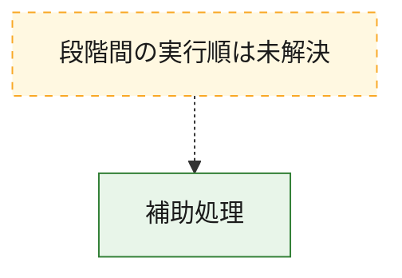
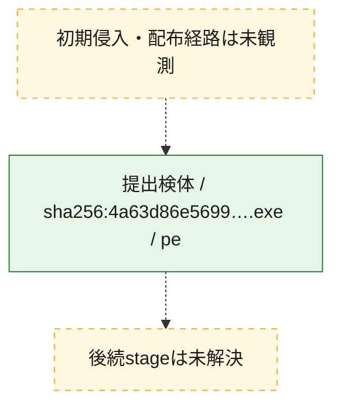
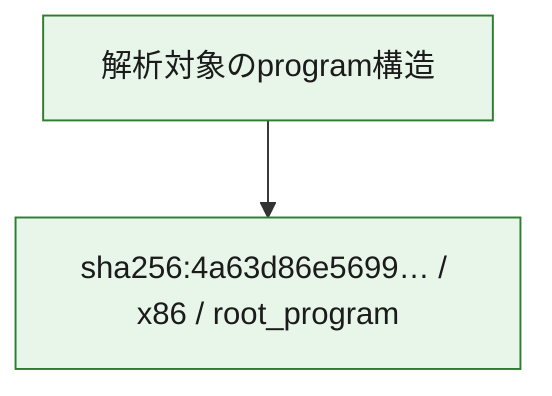

# 全体ロジック：4a63d86e569952d1f3a472246b4de8e820bdaa51fa0e3bc0872457d83e388d71

代表関数から主要なmalware処理段階を自動分類できませんでした。

## 読み方

- phaseの掲載順は解析上の整理順です。observed_call_edgesがない段階間の実行順を断定しません。
- 図の実線は静的に観測した関係、点線と黄色のノードは未観測・未解決の関係を示します。
- 図は静的な要約であり、動的実行を再現するものではありません。
- 詳細な関数解説とfingerprintは[STATIC-LOGIC.md](STATIC-LOGIC.md)を参照してください。

## 静的可視化

### 実行フロー

### 感染チェーン

### モジュール関係

## 処理段階

### 1. 補助処理

主要処理を支える一般内部関数またはlibrary処理を確認します。
確度: `confirmed_static_function_evidence`

- `4a63d86e569952d1f3a472246b4de8e820bdaa51fa0e3bc0872457d83e388d71:ghidra:1400010a0` — 検体内部の一般処理を実装する関数です。 状態: `succeeded`、選定理由: `context_representative`, `reviewed_call_centrality:2`
- `4a63d86e569952d1f3a472246b4de8e820bdaa51fa0e3bc0872457d83e388d71:ghidra:1400011e0` — 検体内部の一般処理を実装する関数です。 状態: `succeeded`、選定理由: `context_representative`, `reviewed_call_centrality:4`
- `4a63d86e569952d1f3a472246b4de8e820bdaa51fa0e3bc0872457d83e388d71:ghidra:140001260` — 検体内部の一般処理を実装する関数です。 状態: `succeeded`、選定理由: `context_representative`, `reviewed_call_centrality:4`
- `4a63d86e569952d1f3a472246b4de8e820bdaa51fa0e3bc0872457d83e388d71:ghidra:140001300` — 検体内部の一般処理を実装する関数です。 状態: `succeeded`、選定理由: `context_representative`, `reviewed_call_centrality:4`
- `4a63d86e569952d1f3a472246b4de8e820bdaa51fa0e3bc0872457d83e388d71:ghidra:140001400` — 検体内部の一般処理を実装する関数です。 状態: `succeeded`、選定理由: `context_representative`, `reviewed_call_centrality:8`
- `4a63d86e569952d1f3a472246b4de8e820bdaa51fa0e3bc0872457d83e388d71:ghidra:140001880` — 検体内部の一般処理を実装する関数です。 状態: `succeeded`、選定理由: `context_representative`, `reviewed_call_centrality:2`
- `4a63d86e569952d1f3a472246b4de8e820bdaa51fa0e3bc0872457d83e388d71:ghidra:140001980` — 検体内部の一般処理を実装する関数です。 状態: `succeeded`、選定理由: `context_representative`, `reviewed_call_centrality:2`
- `4a63d86e569952d1f3a472246b4de8e820bdaa51fa0e3bc0872457d83e388d71:ghidra:140001a00` — 検体内部の一般処理を実装する関数です。 状態: `succeeded`、選定理由: `context_representative`, `reviewed_call_centrality:3`
- `4a63d86e569952d1f3a472246b4de8e820bdaa51fa0e3bc0872457d83e388d71:ghidra:140001a60` — 検体内部の一般処理を実装する関数です。 状態: `succeeded`、選定理由: `context_representative`, `reviewed_call_centrality:11`
- `4a63d86e569952d1f3a472246b4de8e820bdaa51fa0e3bc0872457d83e388d71:ghidra:140001fa0` — 検体内部の一般処理を実装する関数です。 状態: `succeeded`、選定理由: `context_representative`, `reviewed_call_centrality:11`
- `4a63d86e569952d1f3a472246b4de8e820bdaa51fa0e3bc0872457d83e388d71:ghidra:1400028e0` — 検体内部の一般処理を実装する関数です。 状態: `succeeded`、選定理由: `context_representative`, `reviewed_call_centrality:2`
- `4a63d86e569952d1f3a472246b4de8e820bdaa51fa0e3bc0872457d83e388d71:ghidra:140002960` — 検体内部の一般処理を実装する関数です。 状態: `succeeded`、選定理由: `context_representative`, `reviewed_call_centrality:2`
- `4a63d86e569952d1f3a472246b4de8e820bdaa51fa0e3bc0872457d83e388d71:ghidra:1400032e0` — 検体内部の一般処理を実装する関数です。 状態: `succeeded`、選定理由: `context_representative`, `reviewed_call_centrality:10`
- `4a63d86e569952d1f3a472246b4de8e820bdaa51fa0e3bc0872457d83e388d71:ghidra:140003560` — 検体内部の一般処理を実装する関数です。 状態: `succeeded`、選定理由: `context_representative`, `reviewed_call_centrality:5`
- `4a63d86e569952d1f3a472246b4de8e820bdaa51fa0e3bc0872457d83e388d71:ghidra:1400037e0` — 検体内部の一般処理を実装する関数です。 状態: `succeeded`、選定理由: `context_representative`, `reviewed_call_centrality:4`
- `4a63d86e569952d1f3a472246b4de8e820bdaa51fa0e3bc0872457d83e388d71:ghidra:140003900` — 検体内部の一般処理を実装する関数です。 状態: `succeeded`、選定理由: `context_representative`, `reviewed_call_centrality:7`
- `4a63d86e569952d1f3a472246b4de8e820bdaa51fa0e3bc0872457d83e388d71:ghidra:140003a40` — 検体内部の一般処理を実装する関数です。 状態: `succeeded`、選定理由: `context_representative`, `reviewed_call_centrality:9`
- `4a63d86e569952d1f3a472246b4de8e820bdaa51fa0e3bc0872457d83e388d71:ghidra:140003d00` — 検体内部の一般処理を実装する関数です。 状態: `succeeded`、選定理由: `context_representative`, `reviewed_call_centrality:3`
- `4a63d86e569952d1f3a472246b4de8e820bdaa51fa0e3bc0872457d83e388d71:ghidra:140003d80` — 検体内部の一般処理を実装する関数です。 状態: `succeeded`、選定理由: `context_representative`, `reviewed_call_centrality:5`
- `4a63d86e569952d1f3a472246b4de8e820bdaa51fa0e3bc0872457d83e388d71:ghidra:140003f20` — 検体内部の一般処理を実装する関数です。 状態: `succeeded`、選定理由: `context_representative`, `reviewed_call_centrality:8`
- `4a63d86e569952d1f3a472246b4de8e820bdaa51fa0e3bc0872457d83e388d71:ghidra:1400040c0` — 検体内部の一般処理を実装する関数です。 状態: `succeeded`、選定理由: `context_representative`, `reviewed_call_centrality:8`
- `4a63d86e569952d1f3a472246b4de8e820bdaa51fa0e3bc0872457d83e388d71:ghidra:1400042a0` — 検体内部の一般処理を実装する関数です。 状態: `succeeded`、選定理由: `context_representative`, `reviewed_call_centrality:3`
- `4a63d86e569952d1f3a472246b4de8e820bdaa51fa0e3bc0872457d83e388d71:ghidra:1400044a0` — 検体内部の一般処理を実装する関数です。 状態: `succeeded`、選定理由: `context_representative`, `reviewed_call_centrality:3`
- `4a63d86e569952d1f3a472246b4de8e820bdaa51fa0e3bc0872457d83e388d71:ghidra:140004500` — 検体内部の一般処理を実装する関数です。 状態: `succeeded`、選定理由: `context_representative`, `reviewed_call_centrality:6`
- `4a63d86e569952d1f3a472246b4de8e820bdaa51fa0e3bc0872457d83e388d71:ghidra:140004660` — 検体内部の一般処理を実装する関数です。 状態: `succeeded`、選定理由: `context_representative`, `reviewed_call_centrality:6`
- `4a63d86e569952d1f3a472246b4de8e820bdaa51fa0e3bc0872457d83e388d71:ghidra:1400047c0` — 検体内部の一般処理を実装する関数です。 状態: `succeeded`、選定理由: `context_representative`, `reviewed_call_centrality:7`
- `4a63d86e569952d1f3a472246b4de8e820bdaa51fa0e3bc0872457d83e388d71:ghidra:140004940` — 検体内部の一般処理を実装する関数です。 状態: `succeeded`、選定理由: `context_representative`, `reviewed_call_centrality:2`
- `4a63d86e569952d1f3a472246b4de8e820bdaa51fa0e3bc0872457d83e388d71:ghidra:140004b60` — 検体内部の一般処理を実装する関数です。 状態: `succeeded`、選定理由: `context_representative`, `reviewed_call_centrality:8`
- `4a63d86e569952d1f3a472246b4de8e820bdaa51fa0e3bc0872457d83e388d71:ghidra:140004d80` — 検体内部の一般処理を実装する関数です。 状態: `succeeded`、選定理由: `context_representative`, `reviewed_call_centrality:6`
- `4a63d86e569952d1f3a472246b4de8e820bdaa51fa0e3bc0872457d83e388d71:ghidra:140004e80` — 検体内部の一般処理を実装する関数です。 状態: `succeeded`、選定理由: `context_representative`, `reviewed_call_centrality:5`
- `4a63d86e569952d1f3a472246b4de8e820bdaa51fa0e3bc0872457d83e388d71:ghidra:140004fa0` — 検体内部の一般処理を実装する関数です。 状態: `succeeded`、選定理由: `context_representative`, `reviewed_call_centrality:7`
- `4a63d86e569952d1f3a472246b4de8e820bdaa51fa0e3bc0872457d83e388d71:ghidra:140005180` — 検体内部の一般処理を実装する関数です。 状態: `succeeded`、選定理由: `context_representative`, `reviewed_call_centrality:5`

## 観測したcall関係

- `4a63d86e569952d1f3a472246b4de8e820bdaa51fa0e3bc0872457d83e388d71:ghidra:140001a00` → `4a63d86e569952d1f3a472246b4de8e820bdaa51fa0e3bc0872457d83e388d71:ghidra:140001a60` （`support` → `support`）
- `4a63d86e569952d1f3a472246b4de8e820bdaa51fa0e3bc0872457d83e388d71:ghidra:140001a00` → `4a63d86e569952d1f3a472246b4de8e820bdaa51fa0e3bc0872457d83e388d71:ghidra:140001fa0` （`support` → `support`）
- `4a63d86e569952d1f3a472246b4de8e820bdaa51fa0e3bc0872457d83e388d71:ghidra:1400032e0` → `4a63d86e569952d1f3a472246b4de8e820bdaa51fa0e3bc0872457d83e388d71:ghidra:140004d80` （`support` → `support`）
- `4a63d86e569952d1f3a472246b4de8e820bdaa51fa0e3bc0872457d83e388d71:ghidra:1400037e0` → `4a63d86e569952d1f3a472246b4de8e820bdaa51fa0e3bc0872457d83e388d71:ghidra:140003900` （`support` → `support`）
- `4a63d86e569952d1f3a472246b4de8e820bdaa51fa0e3bc0872457d83e388d71:ghidra:1400037e0` → `4a63d86e569952d1f3a472246b4de8e820bdaa51fa0e3bc0872457d83e388d71:ghidra:140004fa0` （`support` → `support`）
- `4a63d86e569952d1f3a472246b4de8e820bdaa51fa0e3bc0872457d83e388d71:ghidra:140003d80` → `4a63d86e569952d1f3a472246b4de8e820bdaa51fa0e3bc0872457d83e388d71:ghidra:140004d80` （`support` → `support`）
- `4a63d86e569952d1f3a472246b4de8e820bdaa51fa0e3bc0872457d83e388d71:ghidra:140003d80` → `4a63d86e569952d1f3a472246b4de8e820bdaa51fa0e3bc0872457d83e388d71:ghidra:140005180` （`support` → `support`）
- `4a63d86e569952d1f3a472246b4de8e820bdaa51fa0e3bc0872457d83e388d71:ghidra:140003f20` → `4a63d86e569952d1f3a472246b4de8e820bdaa51fa0e3bc0872457d83e388d71:ghidra:1400040c0` （`support` → `support`）
- `4a63d86e569952d1f3a472246b4de8e820bdaa51fa0e3bc0872457d83e388d71:ghidra:140003f20` → `4a63d86e569952d1f3a472246b4de8e820bdaa51fa0e3bc0872457d83e388d71:ghidra:1400042a0` （`support` → `support`）
- `4a63d86e569952d1f3a472246b4de8e820bdaa51fa0e3bc0872457d83e388d71:ghidra:1400042a0` → `4a63d86e569952d1f3a472246b4de8e820bdaa51fa0e3bc0872457d83e388d71:ghidra:1400011e0` （`support` → `support`）
- `4a63d86e569952d1f3a472246b4de8e820bdaa51fa0e3bc0872457d83e388d71:ghidra:140004d80` → `4a63d86e569952d1f3a472246b4de8e820bdaa51fa0e3bc0872457d83e388d71:ghidra:140004e80` （`support` → `support`）
- `ghidra-function:029f31e3fef5929964e79dee` → `ghidra-external:0ebd4fa55e4547f841925830` （`unclassified` → `unclassified`）
- `ghidra-function:029f31e3fef5929964e79dee` → `ghidra-external:232ae356c4c173770013ea7d` （`unclassified` → `unclassified`）
- `ghidra-function:029f31e3fef5929964e79dee` → `ghidra-external:42f63e0d887b3942a8dd01bd` （`unclassified` → `unclassified`）
- `ghidra-function:029f31e3fef5929964e79dee` → `ghidra-external:8148765649e482901516ab35` （`unclassified` → `unclassified`）
- `ghidra-function:029f31e3fef5929964e79dee` → `ghidra-external:99b158564f6b620fdee92d45` （`unclassified` → `unclassified`）
- `ghidra-function:029f31e3fef5929964e79dee` → `ghidra-external:eca94aa70eae265f65206c05` （`unclassified` → `unclassified`）
- `ghidra-function:085735c37076177638a943b7` → `ghidra-external:0ebd4fa55e4547f841925830` （`unclassified` → `unclassified`）
- `ghidra-function:085735c37076177638a943b7` → `ghidra-external:232ae356c4c173770013ea7d` （`unclassified` → `unclassified`）
- `ghidra-function:085735c37076177638a943b7` → `ghidra-external:8148765649e482901516ab35` （`unclassified` → `unclassified`）
- `ghidra-function:085735c37076177638a943b7` → `ghidra-external:aecf74270cbf1033ca2edf64` （`unclassified` → `unclassified`）
- `ghidra-function:085735c37076177638a943b7` → `ghidra-external:eca94aa70eae265f65206c05` （`unclassified` → `unclassified`）
- `ghidra-function:085735c37076177638a943b7` → `ghidra-function:fa8c75267d0349b1bff68051` （`unclassified` → `unclassified`）
- `ghidra-function:094a4a018c451fa210f46d20` → `ghidra-external:2ae0e94777fe3eaadca2de4b` （`unclassified` → `unclassified`）
- `ghidra-function:094a4a018c451fa210f46d20` → `ghidra-external:eca94aa70eae265f65206c05` （`unclassified` → `unclassified`）
- `ghidra-function:094a4a018c451fa210f46d20` → `ghidra-function:2a9eb1781917ee6d118c7b2d` （`unclassified` → `unclassified`）
- `ghidra-function:094a4a018c451fa210f46d20` → `ghidra-function:6fc3e8c84de759e109f13db8` （`unclassified` → `unclassified`）
- `ghidra-function:094a4a018c451fa210f46d20` → `ghidra-function:df27143204d2b043d439f55e` （`unclassified` → `unclassified`）
- `ghidra-function:0acc9280d7a6a789e93ce8b6` → `ghidra-external:eca94aa70eae265f65206c05` （`unclassified` → `unclassified`）
- `ghidra-function:0acc9280d7a6a789e93ce8b6` → `ghidra-function:434ad49715efb4d7fef803a8` （`unclassified` → `unclassified`）
- `ghidra-function:0acc9280d7a6a789e93ce8b6` → `ghidra-function:50842102a8e9643e52db92eb` （`unclassified` → `unclassified`）
- `ghidra-function:17e70ecb7b05a71a684cc043` → `ghidra-external:0dcfd04bad62d9aee07d109c` （`unclassified` → `unclassified`）
- `ghidra-function:17e70ecb7b05a71a684cc043` → `ghidra-external:0ebd4fa55e4547f841925830` （`unclassified` → `unclassified`）
- `ghidra-function:17e70ecb7b05a71a684cc043` → `ghidra-external:232ae356c4c173770013ea7d` （`unclassified` → `unclassified`）
- `ghidra-function:17e70ecb7b05a71a684cc043` → `ghidra-external:42f63e0d887b3942a8dd01bd` （`unclassified` → `unclassified`）
- `ghidra-function:17e70ecb7b05a71a684cc043` → `ghidra-external:8148765649e482901516ab35` （`unclassified` → `unclassified`）
- `ghidra-function:17e70ecb7b05a71a684cc043` → `ghidra-external:eca94aa70eae265f65206c05` （`unclassified` → `unclassified`）
- `ghidra-function:17e70ecb7b05a71a684cc043` → `ghidra-function:f6c903f80615734b5bb48356` （`unclassified` → `unclassified`）
- `ghidra-function:1bb116334234d3959dffcb36` → `ghidra-external:0ebd4fa55e4547f841925830` （`unclassified` → `unclassified`）
- `ghidra-function:1bb116334234d3959dffcb36` → `ghidra-external:232ae356c4c173770013ea7d` （`unclassified` → `unclassified`）
- `ghidra-function:1bb116334234d3959dffcb36` → `ghidra-external:7cde256b0abd0a8854b76cbe` （`unclassified` → `unclassified`）
- `ghidra-function:1bb116334234d3959dffcb36` → `ghidra-external:7f95e68117497fa521abac8b` （`unclassified` → `unclassified`）
- `ghidra-function:1bb116334234d3959dffcb36` → `ghidra-external:8148765649e482901516ab35` （`unclassified` → `unclassified`）
- `ghidra-function:1bb116334234d3959dffcb36` → `ghidra-external:aecf74270cbf1033ca2edf64` （`unclassified` → `unclassified`）
- `ghidra-function:1bb116334234d3959dffcb36` → `ghidra-external:eca94aa70eae265f65206c05` （`unclassified` → `unclassified`）
- `ghidra-function:1bb116334234d3959dffcb36` → `ghidra-function:fa8c75267d0349b1bff68051` （`unclassified` → `unclassified`）
- `ghidra-function:1c5d5550b43dfc33b24f45cd` → `ghidra-external:5487b11902aeb6b079f7bf6d` （`unclassified` → `unclassified`）
- `ghidra-function:1c5d5550b43dfc33b24f45cd` → `ghidra-external:8b5a0aeb31cc2e8131ec2ba5` （`unclassified` → `unclassified`）
- `ghidra-function:1de9b3c07a2d0fc26575045c` → `ghidra-external:7f95e68117497fa521abac8b` （`unclassified` → `unclassified`）
- `ghidra-function:1de9b3c07a2d0fc26575045c` → `ghidra-external:eca94aa70eae265f65206c05` （`unclassified` → `unclassified`）
- `ghidra-function:1de9b3c07a2d0fc26575045c` → `ghidra-function:ee5fbba4daa02a85fe6b61d9` （`unclassified` → `unclassified`）
- `ghidra-function:2aa48facab1e33e7cad3d677` → `ghidra-external:eca94aa70eae265f65206c05` （`unclassified` → `unclassified`）
- `ghidra-function:2aa48facab1e33e7cad3d677` → `ghidra-function:029f31e3fef5929964e79dee` （`unclassified` → `unclassified`）
- `ghidra-function:2aa48facab1e33e7cad3d677` → `ghidra-function:6a7656872c19ec964169217d` （`unclassified` → `unclassified`）
- `ghidra-function:2aa48facab1e33e7cad3d677` → `ghidra-function:fa8c75267d0349b1bff68051` （`unclassified` → `unclassified`）
- `ghidra-function:3381d3b730fae61947aca928` → `ghidra-external:0ebd4fa55e4547f841925830` （`unclassified` → `unclassified`）
- `ghidra-function:3381d3b730fae61947aca928` → `ghidra-external:232ae356c4c173770013ea7d` （`unclassified` → `unclassified`）
- `ghidra-function:3381d3b730fae61947aca928` → `ghidra-external:7f95e68117497fa521abac8b` （`unclassified` → `unclassified`）
- `ghidra-function:3381d3b730fae61947aca928` → `ghidra-external:8148765649e482901516ab35` （`unclassified` → `unclassified`）
- `ghidra-function:3381d3b730fae61947aca928` → `ghidra-external:aecf74270cbf1033ca2edf64` （`unclassified` → `unclassified`）
- `ghidra-function:3381d3b730fae61947aca928` → `ghidra-external:eca94aa70eae265f65206c05` （`unclassified` → `unclassified`）
- `ghidra-function:3381d3b730fae61947aca928` → `ghidra-function:d61f26b4d2a13b10bbc3b287` （`unclassified` → `unclassified`）
- `ghidra-function:3381d3b730fae61947aca928` → `ghidra-function:ea86d74078c9f8ae1bde3866` （`unclassified` → `unclassified`）
- `ghidra-function:3381d3b730fae61947aca928` → `ghidra-function:fa8c75267d0349b1bff68051` （`unclassified` → `unclassified`）
- `ghidra-function:39164c4a4456161e6f29d299` → `ghidra-external:eca94aa70eae265f65206c05` （`unclassified` → `unclassified`）
- `ghidra-function:39164c4a4456161e6f29d299` → `ghidra-function:beee793592f82389c043566a` （`unclassified` → `unclassified`）
- `ghidra-function:404194a061f4767eb40f6229` → `ghidra-external:5487b11902aeb6b079f7bf6d` （`unclassified` → `unclassified`）
- `ghidra-function:404194a061f4767eb40f6229` → `ghidra-function:913d4d65c1719ad7f510de57` （`unclassified` → `unclassified`）
- `ghidra-function:434ad49715efb4d7fef803a8` → `ghidra-external:2f0e12ff8b68c2e784f8b71e` （`unclassified` → `unclassified`）
- `ghidra-function:434ad49715efb4d7fef803a8` → `ghidra-external:3cfc1174fc7348df6df39e9f` （`unclassified` → `unclassified`）
- `ghidra-function:434ad49715efb4d7fef803a8` → `ghidra-external:5487b11902aeb6b079f7bf6d` （`unclassified` → `unclassified`）
- `ghidra-function:434ad49715efb4d7fef803a8` → `ghidra-external:56b5d55d6fc1fa6227b4ac0d` （`unclassified` → `unclassified`）
- `ghidra-function:434ad49715efb4d7fef803a8` → `ghidra-external:7cde256b0abd0a8854b76cbe` （`unclassified` → `unclassified`）
- `ghidra-function:434ad49715efb4d7fef803a8` → `ghidra-external:89bcec2bf13ede250526e9fc` （`unclassified` → `unclassified`）
- `ghidra-function:434ad49715efb4d7fef803a8` → `ghidra-external:eca94aa70eae265f65206c05` （`unclassified` → `unclassified`）
- `ghidra-function:434ad49715efb4d7fef803a8` → `ghidra-function:4ea8ea6867e16ccd7ef7d7ba` （`unclassified` → `unclassified`）
- `ghidra-function:434ad49715efb4d7fef803a8` → `ghidra-function:96bc26e8343c6976ac6046ef` （`unclassified` → `unclassified`）
- `ghidra-function:434ad49715efb4d7fef803a8` → `ghidra-function:fa33e5bffb6043b99a8059ae` （`unclassified` → `unclassified`）
- `ghidra-function:50842102a8e9643e52db92eb` → `ghidra-external:10162288c7aae85bfccbbc0c` （`unclassified` → `unclassified`）
- `ghidra-function:50842102a8e9643e52db92eb` → `ghidra-external:258a2a7c73a7a911816ce19a` （`unclassified` → `unclassified`）
- `ghidra-function:50842102a8e9643e52db92eb` → `ghidra-external:5ae774a006a81279cf5b9d5a` （`unclassified` → `unclassified`）
- `ghidra-function:50842102a8e9643e52db92eb` → `ghidra-external:7f95e68117497fa521abac8b` （`unclassified` → `unclassified`）
- `ghidra-function:50842102a8e9643e52db92eb` → `ghidra-external:94f77efb81f90511780fce3e` （`unclassified` → `unclassified`）
- `ghidra-function:50842102a8e9643e52db92eb` → `ghidra-external:a3b201b1450ba1edf74aa826` （`unclassified` → `unclassified`）
- `ghidra-function:50842102a8e9643e52db92eb` → `ghidra-external:a5d91c318a40cf9aea14294e` （`unclassified` → `unclassified`）
- `ghidra-function:50842102a8e9643e52db92eb` → `ghidra-external:eca94aa70eae265f65206c05` （`unclassified` → `unclassified`）
- `ghidra-function:50842102a8e9643e52db92eb` → `ghidra-function:65c7109ea398d9492e60ebdd` （`unclassified` → `unclassified`）
- `ghidra-function:50842102a8e9643e52db92eb` → `ghidra-function:791abc71d7812552e118e837` （`unclassified` → `unclassified`）
- `ghidra-function:6842daf26cee21fc5ae3fec9` → `ghidra-external:1917dcacde2be9feae71c020` （`unclassified` → `unclassified`）
- `ghidra-function:6842daf26cee21fc5ae3fec9` → `ghidra-external:52f00dbdc081638dcda7f315` （`unclassified` → `unclassified`）
- `ghidra-function:6842daf26cee21fc5ae3fec9` → `ghidra-external:5487b11902aeb6b079f7bf6d` （`unclassified` → `unclassified`）
- `ghidra-function:6842daf26cee21fc5ae3fec9` → `ghidra-external:7f95e68117497fa521abac8b` （`unclassified` → `unclassified`）
- `ghidra-function:6842daf26cee21fc5ae3fec9` → `ghidra-external:99b158564f6b620fdee92d45` （`unclassified` → `unclassified`）
- `ghidra-function:6842daf26cee21fc5ae3fec9` → `ghidra-external:eca94aa70eae265f65206c05` （`unclassified` → `unclassified`）
- `ghidra-function:6842daf26cee21fc5ae3fec9` → `ghidra-function:2a9eb1781917ee6d118c7b2d` （`unclassified` → `unclassified`）
- `ghidra-function:6842daf26cee21fc5ae3fec9` → `ghidra-function:791abc71d7812552e118e837` （`unclassified` → `unclassified`）
- `ghidra-function:6842daf26cee21fc5ae3fec9` → `ghidra-function:df27143204d2b043d439f55e` （`unclassified` → `unclassified`）
- `ghidra-function:6842daf26cee21fc5ae3fec9` → `ghidra-function:f541a837df622d2b1667df48` （`unclassified` → `unclassified`）
- `ghidra-function:6909d5774527352ecb032821` → `ghidra-external:7cde256b0abd0a8854b76cbe` （`unclassified` → `unclassified`）
- `ghidra-function:6909d5774527352ecb032821` → `ghidra-external:eca94aa70eae265f65206c05` （`unclassified` → `unclassified`）
- `ghidra-function:6a7656872c19ec964169217d` → `ghidra-external:0ebd4fa55e4547f841925830` （`unclassified` → `unclassified`）
- `ghidra-function:6a7656872c19ec964169217d` → `ghidra-external:232ae356c4c173770013ea7d` （`unclassified` → `unclassified`）
- `ghidra-function:6a7656872c19ec964169217d` → `ghidra-external:42f63e0d887b3942a8dd01bd` （`unclassified` → `unclassified`）
- `ghidra-function:6a7656872c19ec964169217d` → `ghidra-external:8148765649e482901516ab35` （`unclassified` → `unclassified`）
- `ghidra-function:6a7656872c19ec964169217d` → `ghidra-external:99b158564f6b620fdee92d45` （`unclassified` → `unclassified`）
- `ghidra-function:6a7656872c19ec964169217d` → `ghidra-external:eca94aa70eae265f65206c05` （`unclassified` → `unclassified`）
- `ghidra-function:6a7ed62e50fa13ec7c847781` → `ghidra-external:5487b11902aeb6b079f7bf6d` （`unclassified` → `unclassified`）
- `ghidra-function:6a7ed62e50fa13ec7c847781` → `ghidra-external:7f95e68117497fa521abac8b` （`unclassified` → `unclassified`）
- `ghidra-function:6a7ed62e50fa13ec7c847781` → `ghidra-external:89bcec2bf13ede250526e9fc` （`unclassified` → `unclassified`）
- `ghidra-function:6a7ed62e50fa13ec7c847781` → `ghidra-external:eca94aa70eae265f65206c05` （`unclassified` → `unclassified`）
- `ghidra-function:6a7ed62e50fa13ec7c847781` → `ghidra-function:2a9eb1781917ee6d118c7b2d` （`unclassified` → `unclassified`）
- `ghidra-function:6fc3e8c84de759e109f13db8` → `ghidra-external:7f95e68117497fa521abac8b` （`unclassified` → `unclassified`）
- `ghidra-function:6fc3e8c84de759e109f13db8` → `ghidra-external:eca94aa70eae265f65206c05` （`unclassified` → `unclassified`）
- `ghidra-function:6fc3e8c84de759e109f13db8` → `ghidra-function:82d0e2abe10246149c50bb06` （`unclassified` → `unclassified`）
- `ghidra-function:6fc3e8c84de759e109f13db8` → `ghidra-function:d61f26b4d2a13b10bbc3b287` （`unclassified` → `unclassified`）
- `ghidra-function:7d6c49877f3102ff95e61f01` → `ghidra-external:99b158564f6b620fdee92d45` （`unclassified` → `unclassified`）
- `ghidra-function:7d6c49877f3102ff95e61f01` → `ghidra-external:eca94aa70eae265f65206c05` （`unclassified` → `unclassified`）
- `ghidra-function:7d6c49877f3102ff95e61f01` → `ghidra-function:17e70ecb7b05a71a684cc043` （`unclassified` → `unclassified`）
- `ghidra-function:7d6c49877f3102ff95e61f01` → `ghidra-function:29a00dd14c549ce28eec1a49` （`unclassified` → `unclassified`）
- `ghidra-function:7d6c49877f3102ff95e61f01` → `ghidra-function:39164c4a4456161e6f29d299` （`unclassified` → `unclassified`）
- `ghidra-function:7d6c49877f3102ff95e61f01` → `ghidra-function:82d0e2abe10246149c50bb06` （`unclassified` → `unclassified`）
- `ghidra-function:7d6c49877f3102ff95e61f01` → `ghidra-function:f541a837df622d2b1667df48` （`unclassified` → `unclassified`）
- `ghidra-function:7d6c49877f3102ff95e61f01` → `ghidra-function:fa8c75267d0349b1bff68051` （`unclassified` → `unclassified`）
- `ghidra-function:912b685650aae4787002330b` → `ghidra-external:7f95e68117497fa521abac8b` （`unclassified` → `unclassified`）
- `ghidra-function:912b685650aae4787002330b` → `ghidra-external:eca94aa70eae265f65206c05` （`unclassified` → `unclassified`）
- `ghidra-function:912b685650aae4787002330b` → `ghidra-function:82d0e2abe10246149c50bb06` （`unclassified` → `unclassified`）
- `ghidra-function:912b685650aae4787002330b` → `ghidra-function:ee5fbba4daa02a85fe6b61d9` （`unclassified` → `unclassified`）
- `ghidra-function:94502e6f3517973706fdfcef` → `ghidra-external:eca94aa70eae265f65206c05` （`unclassified` → `unclassified`）
- `ghidra-function:94502e6f3517973706fdfcef` → `ghidra-function:28910ed46f9a6dfb85a194e4` （`unclassified` → `unclassified`）
- `ghidra-function:94502e6f3517973706fdfcef` → `ghidra-function:d69b9e2aac34391cb5f6074e` （`unclassified` → `unclassified`）
- `ghidra-function:a4b6cf2683571c495d4d2535` → `ghidra-external:0fa5778622e9be063f3fe1f2` （`unclassified` → `unclassified`）
- `ghidra-function:a4b6cf2683571c495d4d2535` → `ghidra-external:2f0e12ff8b68c2e784f8b71e` （`unclassified` → `unclassified`）
- `ghidra-function:a4b6cf2683571c495d4d2535` → `ghidra-external:5487b11902aeb6b079f7bf6d` （`unclassified` → `unclassified`）
- `ghidra-function:a4b6cf2683571c495d4d2535` → `ghidra-external:eca94aa70eae265f65206c05` （`unclassified` → `unclassified`）
- `ghidra-function:a4b6cf2683571c495d4d2535` → `ghidra-function:21543687c032282b91e9e05b` （`unclassified` → `unclassified`）
- `ghidra-function:a4b6cf2683571c495d4d2535` → `ghidra-function:2a9eb1781917ee6d118c7b2d` （`unclassified` → `unclassified`）
- `ghidra-function:a4b6cf2683571c495d4d2535` → `ghidra-function:82d0e2abe10246149c50bb06` （`unclassified` → `unclassified`）
- `ghidra-function:a4b6cf2683571c495d4d2535` → `ghidra-function:d5da14467469afb383d7b121` （`unclassified` → `unclassified`）
- `ghidra-function:a7abd13975792ec3dbaf49bf` → `ghidra-external:7cde256b0abd0a8854b76cbe` （`unclassified` → `unclassified`）
- `ghidra-function:a7abd13975792ec3dbaf49bf` → `ghidra-external:eca94aa70eae265f65206c05` （`unclassified` → `unclassified`）
- `ghidra-function:ba58776857ccdd99da785604` → `ghidra-external:0ebd4fa55e4547f841925830` （`unclassified` → `unclassified`）
- `ghidra-function:ba58776857ccdd99da785604` → `ghidra-external:232ae356c4c173770013ea7d` （`unclassified` → `unclassified`）
- `ghidra-function:ba58776857ccdd99da785604` → `ghidra-external:8148765649e482901516ab35` （`unclassified` → `unclassified`）
- `ghidra-function:ba58776857ccdd99da785604` → `ghidra-external:aecf74270cbf1033ca2edf64` （`unclassified` → `unclassified`）
- `ghidra-function:ba58776857ccdd99da785604` → `ghidra-external:eca94aa70eae265f65206c05` （`unclassified` → `unclassified`）
- `ghidra-function:ba58776857ccdd99da785604` → `ghidra-function:fa8c75267d0349b1bff68051` （`unclassified` → `unclassified`）
- `ghidra-function:beee793592f82389c043566a` → `ghidra-external:56b5d55d6fc1fa6227b4ac0d` （`unclassified` → `unclassified`）
- `ghidra-function:beee793592f82389c043566a` → `ghidra-external:8b5a0aeb31cc2e8131ec2ba5` （`unclassified` → `unclassified`）
- `ghidra-function:beee793592f82389c043566a` → `ghidra-function:7ecf3dbe7ee5bf1abc224803` （`unclassified` → `unclassified`）
- `ghidra-function:ca243208d37e9d85696bbf0f` → `ghidra-external:99b158564f6b620fdee92d45` （`unclassified` → `unclassified`）
- `ghidra-function:ca243208d37e9d85696bbf0f` → `ghidra-external:eca94aa70eae265f65206c05` （`unclassified` → `unclassified`）
- `ghidra-function:ca243208d37e9d85696bbf0f` → `ghidra-function:2bc315e22dbb3ca6b54bbc62` （`unclassified` → `unclassified`）
- `ghidra-function:ca243208d37e9d85696bbf0f` → `ghidra-function:7ecf3dbe7ee5bf1abc224803` （`unclassified` → `unclassified`）
- `ghidra-function:d4ee995881c3c752a2593077` → `ghidra-external:7cde256b0abd0a8854b76cbe` （`unclassified` → `unclassified`）
- `ghidra-function:d4ee995881c3c752a2593077` → `ghidra-external:eca94aa70eae265f65206c05` （`unclassified` → `unclassified`）
- `ghidra-function:d7caf0f268976466c5d215ea` → `ghidra-external:0ebd4fa55e4547f841925830` （`unclassified` → `unclassified`）
- `ghidra-function:d7caf0f268976466c5d215ea` → `ghidra-external:232ae356c4c173770013ea7d` （`unclassified` → `unclassified`）
- `ghidra-function:d7caf0f268976466c5d215ea` → `ghidra-external:7f95e68117497fa521abac8b` （`unclassified` → `unclassified`）
- `ghidra-function:d7caf0f268976466c5d215ea` → `ghidra-external:8148765649e482901516ab35` （`unclassified` → `unclassified`）
- `ghidra-function:d7caf0f268976466c5d215ea` → `ghidra-external:aecf74270cbf1033ca2edf64` （`unclassified` → `unclassified`）
- `ghidra-function:d7caf0f268976466c5d215ea` → `ghidra-external:eca94aa70eae265f65206c05` （`unclassified` → `unclassified`）
- `ghidra-function:d7caf0f268976466c5d215ea` → `ghidra-function:fa8c75267d0349b1bff68051` （`unclassified` → `unclassified`）
- `ghidra-function:daa991c79ed1376c06484198` → `ghidra-external:99b158564f6b620fdee92d45` （`unclassified` → `unclassified`）
- `ghidra-function:daa991c79ed1376c06484198` → `ghidra-external:eca94aa70eae265f65206c05` （`unclassified` → `unclassified`）
- `ghidra-function:daa991c79ed1376c06484198` → `ghidra-function:2bc315e22dbb3ca6b54bbc62` （`unclassified` → `unclassified`）
- `ghidra-function:daa991c79ed1376c06484198` → `ghidra-function:7ecf3dbe7ee5bf1abc224803` （`unclassified` → `unclassified`）
- `ghidra-function:df27143204d2b043d439f55e` → `ghidra-external:eca94aa70eae265f65206c05` （`unclassified` → `unclassified`）
- `ghidra-function:df27143204d2b043d439f55e` → `ghidra-function:791abc71d7812552e118e837` （`unclassified` → `unclassified`）
- `ghidra-function:df27143204d2b043d439f55e` → `ghidra-function:82d0e2abe10246149c50bb06` （`unclassified` → `unclassified`）
- `ghidra-function:df27143204d2b043d439f55e` → `ghidra-function:912b685650aae4787002330b` （`unclassified` → `unclassified`）
- `ghidra-function:f0cafa9bac5b961f86dd47a8` → `ghidra-external:7cde256b0abd0a8854b76cbe` （`unclassified` → `unclassified`）
- `ghidra-function:f0cafa9bac5b961f86dd47a8` → `ghidra-external:eca94aa70eae265f65206c05` （`unclassified` → `unclassified`）

## 解析範囲と制約

- 選定外関数は全体inventoryへ残しますが、関数本体の個別解説対象にはしていません。
- indirect call、難読化、packer、VM、壊れたcontrol flowによりcall関係が欠落する場合があります。
- 文書は静的解析に基づき、検体実行や外部通信による動的確認は行っていません。
