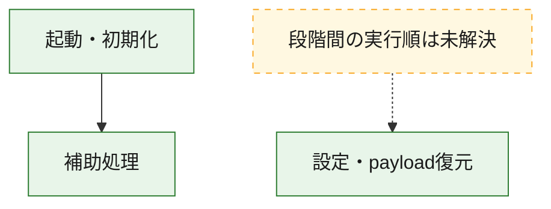
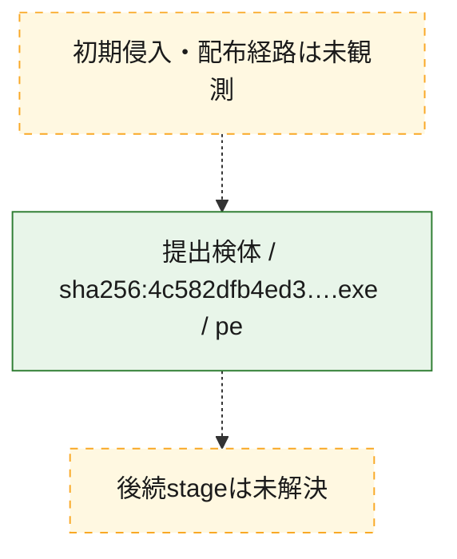
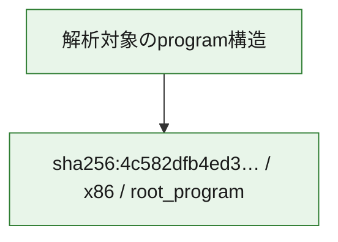

# 全体ロジック：4c582dfb4ed3e7837dfeab75e440b8ef9b4fa52cde869e16fe168db313935413

代表関数の静的証跡から、起動・初期化、設定・payload復元の処理群を確認しました。

## 読み方

- phaseの掲載順は解析上の整理順です。observed_call_edgesがない段階間の実行順を断定しません。
- 図の実線は静的に観測した関係、点線と黄色のノードは未観測・未解決の関係を示します。
- 図は静的な要約であり、動的実行を再現するものではありません。
- 詳細な関数解説とfingerprintは[STATIC-LOGIC.md](STATIC-LOGIC.md)を参照してください。

## 静的可視化

### 実行フロー

### 感染チェーン

### モジュール関係

## 処理段階

### 1. 起動・初期化

entry pointから初期化と後続処理への移行を確認します。
確度: `confirmed_static_function_evidence`

- `4c582dfb4ed3e7837dfeab75e440b8ef9b4fa52cde869e16fe168db313935413:ghidra:1e5ce1350` — 初期化と主要処理への分岐を行う入口関数です。 状態: `succeeded`、選定理由: `entry_point`, `meaningful_symbol_name`, `reviewed_call_centrality:5`, `role:entrypoint`

### 2. 設定・payload復元

設定、resource、payload、暗号化データの復元・変換を確認します。
確度: `confirmed_static_function_evidence`

- `4c582dfb4ed3e7837dfeab75e440b8ef9b4fa52cde869e16fe168db313935413:ghidra:1e5f5f9c0` — 設定、resource、payloadなどの解析・変換を行う関数です。 状態: `succeeded`、選定理由: `entry_point`, `meaningful_symbol_name`, `reviewed_call_centrality:3`, `role:config_or_data_transform`
- `4c582dfb4ed3e7837dfeab75e440b8ef9b4fa52cde869e16fe168db313935413:ghidra:1e5f5fac0` — 設定、resource、payloadなどの解析・変換を行う関数です。 状態: `succeeded`、選定理由: `entry_point`, `meaningful_symbol_name`, `reviewed_call_centrality:3`, `role:config_or_data_transform`
- `4c582dfb4ed3e7837dfeab75e440b8ef9b4fa52cde869e16fe168db313935413:ghidra:1e5f5fb00` — 設定、resource、payloadなどの解析・変換を行う関数です。 状態: `succeeded`、選定理由: `entry_point`, `meaningful_symbol_name`, `reviewed_call_centrality:3`, `role:config_or_data_transform`
- `4c582dfb4ed3e7837dfeab75e440b8ef9b4fa52cde869e16fe168db313935413:ghidra:1e5f5fb40` — 設定、resource、payloadなどの解析・変換を行う関数です。 状態: `succeeded`、選定理由: `entry_point`, `meaningful_symbol_name`, `reviewed_call_centrality:3`, `role:config_or_data_transform`
- `4c582dfb4ed3e7837dfeab75e440b8ef9b4fa52cde869e16fe168db313935413:ghidra:1e5f5fb80` — 設定、resource、payloadなどの解析・変換を行う関数です。 状態: `succeeded`、選定理由: `entry_point`, `meaningful_symbol_name`, `reviewed_call_centrality:3`, `role:config_or_data_transform`
- `4c582dfb4ed3e7837dfeab75e440b8ef9b4fa52cde869e16fe168db313935413:ghidra:1e5f5fbc0` — 設定、resource、payloadなどの解析・変換を行う関数です。 状態: `succeeded`、選定理由: `entry_point`, `meaningful_symbol_name`, `reviewed_call_centrality:3`, `role:config_or_data_transform`
- `4c582dfb4ed3e7837dfeab75e440b8ef9b4fa52cde869e16fe168db313935413:ghidra:1e5f5fc00` — 設定、resource、payloadなどの解析・変換を行う関数です。 状態: `succeeded`、選定理由: `entry_point`, `meaningful_symbol_name`, `reviewed_call_centrality:3`, `role:config_or_data_transform`
- `4c582dfb4ed3e7837dfeab75e440b8ef9b4fa52cde869e16fe168db313935413:ghidra:1e5f5fc40` — 設定、resource、payloadなどの解析・変換を行う関数です。 状態: `succeeded`、選定理由: `entry_point`, `meaningful_symbol_name`, `reviewed_call_centrality:3`, `role:config_or_data_transform`
- `4c582dfb4ed3e7837dfeab75e440b8ef9b4fa52cde869e16fe168db313935413:ghidra:1e5f5fc80` — 設定、resource、payloadなどの解析・変換を行う関数です。 状態: `succeeded`、選定理由: `entry_point`, `meaningful_symbol_name`, `reviewed_call_centrality:3`, `role:config_or_data_transform`

### 3. 補助処理

主要処理を支える一般内部関数またはlibrary処理を確認します。
確度: `confirmed_static_function_evidence`

- `4c582dfb4ed3e7837dfeab75e440b8ef9b4fa52cde869e16fe168db313935413:ghidra:1e5ce1000` — 検体内部の一般処理を実装する関数です。 状態: `succeeded`、選定理由: `context_representative`, `reviewed_call_centrality:1`
- `4c582dfb4ed3e7837dfeab75e440b8ef9b4fa52cde869e16fe168db313935413:ghidra:1e5ce1010` — 検体内部の一般処理を実装する関数です。 状態: `succeeded`、選定理由: `context_representative`, `reviewed_call_centrality:10`
- `4c582dfb4ed3e7837dfeab75e440b8ef9b4fa52cde869e16fe168db313935413:ghidra:1e5ce1200` — 検体内部の一般処理を実装する関数です。 状態: `succeeded`、選定理由: `context_representative`, `reviewed_call_centrality:5`
- `4c582dfb4ed3e7837dfeab75e440b8ef9b4fa52cde869e16fe168db313935413:ghidra:1e5ce1370` — 検体内部の一般処理を実装する関数です。 状態: `succeeded`、選定理由: `context_representative`, `reviewed_call_centrality:5`
- `4c582dfb4ed3e7837dfeab75e440b8ef9b4fa52cde869e16fe168db313935413:ghidra:1e5ce1380` — 検体内部の一般処理を実装する関数です。 状態: `succeeded`、選定理由: `context_representative`, `reviewed_call_centrality:5`
- `4c582dfb4ed3e7837dfeab75e440b8ef9b4fa52cde869e16fe168db313935413:ghidra:1e5ce1390` — 検体内部の一般処理を実装する関数です。 状態: `succeeded`、選定理由: `context_representative`
- `4c582dfb4ed3e7837dfeab75e440b8ef9b4fa52cde869e16fe168db313935413:ghidra:1e5ce1440` — 検体内部の一般処理を実装する関数です。 状態: `succeeded`、選定理由: `context_representative`, `reviewed_call_centrality:2`
- `4c582dfb4ed3e7837dfeab75e440b8ef9b4fa52cde869e16fe168db313935413:ghidra:1e5ce1580` — 検体内部の一般処理を実装する関数です。 状態: `succeeded`、選定理由: `context_representative`, `reviewed_call_centrality:3`
- `4c582dfb4ed3e7837dfeab75e440b8ef9b4fa52cde869e16fe168db313935413:ghidra:1e5ce1600` — 検体内部の一般処理を実装する関数です。 状態: `succeeded`、選定理由: `context_representative`, `reviewed_call_centrality:4`
- `4c582dfb4ed3e7837dfeab75e440b8ef9b4fa52cde869e16fe168db313935413:ghidra:1e5ce16a0` — 検体内部の一般処理を実装する関数です。 状態: `succeeded`、選定理由: `context_representative`, `reviewed_call_centrality:4`
- `4c582dfb4ed3e7837dfeab75e440b8ef9b4fa52cde869e16fe168db313935413:ghidra:1e5ce17a0` — 検体内部の一般処理を実装する関数です。 状態: `succeeded`、選定理由: `context_representative`, `reviewed_call_centrality:8`
- `4c582dfb4ed3e7837dfeab75e440b8ef9b4fa52cde869e16fe168db313935413:ghidra:1e5ce1c20` — 検体内部の一般処理を実装する関数です。 状態: `succeeded`、選定理由: `context_representative`, `reviewed_call_centrality:2`
- `4c582dfb4ed3e7837dfeab75e440b8ef9b4fa52cde869e16fe168db313935413:ghidra:1e5ce1d20` — 検体内部の一般処理を実装する関数です。 状態: `succeeded`、選定理由: `context_representative`, `reviewed_call_centrality:2`
- `4c582dfb4ed3e7837dfeab75e440b8ef9b4fa52cde869e16fe168db313935413:ghidra:1e5ce1da0` — 検体内部の一般処理を実装する関数です。 状態: `succeeded`、選定理由: `context_representative`, `reviewed_call_centrality:3`
- `4c582dfb4ed3e7837dfeab75e440b8ef9b4fa52cde869e16fe168db313935413:ghidra:1e5ce1e00` — 検体内部の一般処理を実装する関数です。 状態: `succeeded`、選定理由: `context_representative`, `reviewed_call_centrality:11`
- `4c582dfb4ed3e7837dfeab75e440b8ef9b4fa52cde869e16fe168db313935413:ghidra:1e5ce2340` — 検体内部の一般処理を実装する関数です。 状態: `succeeded`、選定理由: `context_representative`, `reviewed_call_centrality:11`
- `4c582dfb4ed3e7837dfeab75e440b8ef9b4fa52cde869e16fe168db313935413:ghidra:1e5ce2c80` — 検体内部の一般処理を実装する関数です。 状態: `succeeded`、選定理由: `context_representative`, `reviewed_call_centrality:2`
- `4c582dfb4ed3e7837dfeab75e440b8ef9b4fa52cde869e16fe168db313935413:ghidra:1e5f5fa00` — 検体内部の一般処理を実装する関数です。 状態: `succeeded`、選定理由: `entry_point`, `meaningful_symbol_name`, `reviewed_call_centrality:3`
- `4c582dfb4ed3e7837dfeab75e440b8ef9b4fa52cde869e16fe168db313935413:ghidra:1e5f5fa40` — 検体内部の一般処理を実装する関数です。 状態: `succeeded`、選定理由: `entry_point`, `meaningful_symbol_name`, `reviewed_call_centrality:3`
- `4c582dfb4ed3e7837dfeab75e440b8ef9b4fa52cde869e16fe168db313935413:ghidra:1e5f5fa80` — 検体内部の一般処理を実装する関数です。 状態: `succeeded`、選定理由: `entry_point`, `meaningful_symbol_name`, `reviewed_call_centrality:3`
- `4c582dfb4ed3e7837dfeab75e440b8ef9b4fa52cde869e16fe168db313935413:ghidra:1e5f65120` — compiler生成処理または汎用library処理とみられる関数です。 状態: `succeeded`、選定理由: `entry_point`, `meaningful_symbol_name`, `reviewed_call_centrality:1`
- `4c582dfb4ed3e7837dfeab75e440b8ef9b4fa52cde869e16fe168db313935413:ghidra:1e5f65150` — compiler生成処理または汎用library処理とみられる関数です。 状態: `succeeded`、選定理由: `entry_point`, `meaningful_symbol_name`, `reviewed_call_centrality:3`

## 観測したcall関係

- `4c582dfb4ed3e7837dfeab75e440b8ef9b4fa52cde869e16fe168db313935413:ghidra:1e5ce1010` → `4c582dfb4ed3e7837dfeab75e440b8ef9b4fa52cde869e16fe168db313935413:ghidra:1e5f65150` （`support` → `support`）
- `4c582dfb4ed3e7837dfeab75e440b8ef9b4fa52cde869e16fe168db313935413:ghidra:1e5ce1200` → `4c582dfb4ed3e7837dfeab75e440b8ef9b4fa52cde869e16fe168db313935413:ghidra:1e5ce1010` （`support` → `support`）
- `4c582dfb4ed3e7837dfeab75e440b8ef9b4fa52cde869e16fe168db313935413:ghidra:1e5ce1350` → `4c582dfb4ed3e7837dfeab75e440b8ef9b4fa52cde869e16fe168db313935413:ghidra:1e5ce1010` （`startup` → `support`）
- `4c582dfb4ed3e7837dfeab75e440b8ef9b4fa52cde869e16fe168db313935413:ghidra:1e5ce1da0` → `4c582dfb4ed3e7837dfeab75e440b8ef9b4fa52cde869e16fe168db313935413:ghidra:1e5ce1e00` （`support` → `support`）
- `4c582dfb4ed3e7837dfeab75e440b8ef9b4fa52cde869e16fe168db313935413:ghidra:1e5ce1da0` → `4c582dfb4ed3e7837dfeab75e440b8ef9b4fa52cde869e16fe168db313935413:ghidra:1e5ce2340` （`support` → `support`）
- `ghidra-function:0092c9c819fc1eb95b983440` → `ghidra-function:4f22d7d08668af79c552704e` （`unclassified` → `unclassified`）
- `ghidra-function:0092c9c819fc1eb95b983440` → `ghidra-function:6cb79d36c477a61a9d080025` （`unclassified` → `unclassified`）
- `ghidra-function:0092c9c819fc1eb95b983440` → `ghidra-function:a95d7518b3916e5961725e6b` （`unclassified` → `unclassified`）
- `ghidra-function:049e72eb98591a46f46675bd` → `ghidra-external:dc7ef60da6cc6fd8ea880c60` （`unclassified` → `unclassified`）
- `ghidra-function:049e72eb98591a46f46675bd` → `ghidra-external:ef06e06ebe67a35b250dc3f7` （`unclassified` → `unclassified`）
- `ghidra-function:049e72eb98591a46f46675bd` → `ghidra-function:11c47058a1f9aa3f6a22e10a` （`unclassified` → `unclassified`）
- `ghidra-function:049e72eb98591a46f46675bd` → `ghidra-function:4314b1090b463a761f68cfe8` （`unclassified` → `unclassified`）
- `ghidra-function:061a04843424e7cb6f8f8a14` → `ghidra-external:1997782c263a1728406a6383` （`unclassified` → `unclassified`）
- `ghidra-function:061a04843424e7cb6f8f8a14` → `ghidra-external:ef06e06ebe67a35b250dc3f7` （`unclassified` → `unclassified`）
- `ghidra-function:079b8cc61cf339a7b6ab0303` → `ghidra-function:4f22d7d08668af79c552704e` （`unclassified` → `unclassified`）
- `ghidra-function:079b8cc61cf339a7b6ab0303` → `ghidra-function:6cb79d36c477a61a9d080025` （`unclassified` → `unclassified`）
- `ghidra-function:079b8cc61cf339a7b6ab0303` → `ghidra-function:a95d7518b3916e5961725e6b` （`unclassified` → `unclassified`）
- `ghidra-function:088d08a4b219beaa22faf79a` → `ghidra-external:05a469dcbaa2e79739d6331b` （`unclassified` → `unclassified`）
- `ghidra-function:1e034e044cf64fea26c29488` → `ghidra-external:dc7ef60da6cc6fd8ea880c60` （`unclassified` → `unclassified`）
- `ghidra-function:1e034e044cf64fea26c29488` → `ghidra-external:ef06e06ebe67a35b250dc3f7` （`unclassified` → `unclassified`）
- `ghidra-function:1e034e044cf64fea26c29488` → `ghidra-function:11c47058a1f9aa3f6a22e10a` （`unclassified` → `unclassified`）
- `ghidra-function:1e034e044cf64fea26c29488` → `ghidra-function:4314b1090b463a761f68cfe8` （`unclassified` → `unclassified`）
- `ghidra-function:21f3af827c837e5351ab902c` → `ghidra-external:6d670c02249cc33462e07c75` （`unclassified` → `unclassified`）
- `ghidra-function:21f3af827c837e5351ab902c` → `ghidra-external:c14612eb4a317416ac7bb944` （`unclassified` → `unclassified`）
- `ghidra-function:21f3af827c837e5351ab902c` → `ghidra-external:ef06e06ebe67a35b250dc3f7` （`unclassified` → `unclassified`）
- `ghidra-function:21f3af827c837e5351ab902c` → `ghidra-external:ff005c55eaaa5dfd59cda187` （`unclassified` → `unclassified`）
- `ghidra-function:21f3af827c837e5351ab902c` → `ghidra-function:21663ba9ba11fd67cee21f3d` （`unclassified` → `unclassified`）
- `ghidra-function:21f3af827c837e5351ab902c` → `ghidra-function:780a309a0529067f5c66729a` （`unclassified` → `unclassified`）
- `ghidra-function:21f3af827c837e5351ab902c` → `ghidra-function:a581eea10bca23554d48903c` （`unclassified` → `unclassified`）
- `ghidra-function:21f3af827c837e5351ab902c` → `ghidra-function:e9a4463c3360e3f3c28d02dd` （`unclassified` → `unclassified`）
- `ghidra-function:22abc03121df22578fdcfffe` → `ghidra-external:ef06e06ebe67a35b250dc3f7` （`unclassified` → `unclassified`）
- `ghidra-function:22abc03121df22578fdcfffe` → `ghidra-function:e5b7aee6bce98ee860c8324c` （`unclassified` → `unclassified`）
- `ghidra-function:22abc03121df22578fdcfffe` → `ghidra-function:f55703a154400a34cfb9bc5a` （`unclassified` → `unclassified`）
- `ghidra-function:2a5343563ff9cb2d538add57` → `ghidra-function:905222df846abdf95bc148b7` （`unclassified` → `unclassified`）
- `ghidra-function:2a5343563ff9cb2d538add57` → `ghidra-function:9b5ac9bb279b339cf853870e` （`unclassified` → `unclassified`）
- `ghidra-function:2a5343563ff9cb2d538add57` → `ghidra-function:b6c10ff766e0dc3a27fc080b` （`unclassified` → `unclassified`）
- `ghidra-function:2a5343563ff9cb2d538add57` → `ghidra-function:cb8d28e4853250ada61bbecb` （`unclassified` → `unclassified`）
- `ghidra-function:2a5343563ff9cb2d538add57` → `ghidra-function:e4d404ee9b6de36ce2926bd6` （`unclassified` → `unclassified`）
- `ghidra-function:2edae94b5c07f89f46854eab` → `ghidra-function:4f22d7d08668af79c552704e` （`unclassified` → `unclassified`）
- `ghidra-function:2edae94b5c07f89f46854eab` → `ghidra-function:6cb79d36c477a61a9d080025` （`unclassified` → `unclassified`）
- `ghidra-function:2edae94b5c07f89f46854eab` → `ghidra-function:a95d7518b3916e5961725e6b` （`unclassified` → `unclassified`）
- `ghidra-function:524408fdbc9195241f57b946` → `ghidra-external:6d670c02249cc33462e07c75` （`unclassified` → `unclassified`）
- `ghidra-function:524408fdbc9195241f57b946` → `ghidra-external:f2a55f27aa1464c317962146` （`unclassified` → `unclassified`）
- `ghidra-function:5c0cb6b33d594dd3893f1a8d` → `ghidra-function:659358b14cb987141e8b665e` （`unclassified` → `unclassified`）
- `ghidra-function:69c0d0cbe1d6fbd5664566c0` → `ghidra-external:05a469dcbaa2e79739d6331b` （`unclassified` → `unclassified`）
- `ghidra-function:69c0d0cbe1d6fbd5664566c0` → `ghidra-external:55753825183c5f34eb808a9a` （`unclassified` → `unclassified`）
- `ghidra-function:69c0d0cbe1d6fbd5664566c0` → `ghidra-external:70c8d49cabd281b355bbbf18` （`unclassified` → `unclassified`）
- `ghidra-function:69c0d0cbe1d6fbd5664566c0` → `ghidra-external:c7dab9748fc17466afe10126` （`unclassified` → `unclassified`）
- `ghidra-function:69c0d0cbe1d6fbd5664566c0` → `ghidra-external:debcd5e4d97198d2014ab312` （`unclassified` → `unclassified`）
- `ghidra-function:6a26ec90d19c7e2575541dce` → `ghidra-function:4f22d7d08668af79c552704e` （`unclassified` → `unclassified`）
- `ghidra-function:6a26ec90d19c7e2575541dce` → `ghidra-function:6cb79d36c477a61a9d080025` （`unclassified` → `unclassified`）
- `ghidra-function:6a26ec90d19c7e2575541dce` → `ghidra-function:a95d7518b3916e5961725e6b` （`unclassified` → `unclassified`）
- `ghidra-function:78d7a0933df086cbed9f9830` → `ghidra-function:4f22d7d08668af79c552704e` （`unclassified` → `unclassified`）
- `ghidra-function:78d7a0933df086cbed9f9830` → `ghidra-function:6cb79d36c477a61a9d080025` （`unclassified` → `unclassified`）
- `ghidra-function:78d7a0933df086cbed9f9830` → `ghidra-function:a95d7518b3916e5961725e6b` （`unclassified` → `unclassified`）
- `ghidra-function:82508446875fff08df0b33d8` → `ghidra-external:05a469dcbaa2e79739d6331b` （`unclassified` → `unclassified`）
- `ghidra-function:82508446875fff08df0b33d8` → `ghidra-external:55753825183c5f34eb808a9a` （`unclassified` → `unclassified`）
- `ghidra-function:82508446875fff08df0b33d8` → `ghidra-external:70c8d49cabd281b355bbbf18` （`unclassified` → `unclassified`）
- `ghidra-function:82508446875fff08df0b33d8` → `ghidra-external:c7dab9748fc17466afe10126` （`unclassified` → `unclassified`）
- `ghidra-function:82508446875fff08df0b33d8` → `ghidra-external:debcd5e4d97198d2014ab312` （`unclassified` → `unclassified`）
- `ghidra-function:93521ae20c4163bbaf1582e9` → `ghidra-function:905222df846abdf95bc148b7` （`unclassified` → `unclassified`）
- `ghidra-function:93521ae20c4163bbaf1582e9` → `ghidra-function:9b5ac9bb279b339cf853870e` （`unclassified` → `unclassified`）
- `ghidra-function:93521ae20c4163bbaf1582e9` → `ghidra-function:b6c10ff766e0dc3a27fc080b` （`unclassified` → `unclassified`）
- `ghidra-function:93521ae20c4163bbaf1582e9` → `ghidra-function:cb8d28e4853250ada61bbecb` （`unclassified` → `unclassified`）
- `ghidra-function:93521ae20c4163bbaf1582e9` → `ghidra-function:e4d404ee9b6de36ce2926bd6` （`unclassified` → `unclassified`）
- `ghidra-function:997e5749affd0f68eb66fe9e` → `ghidra-function:4f22d7d08668af79c552704e` （`unclassified` → `unclassified`）
- `ghidra-function:997e5749affd0f68eb66fe9e` → `ghidra-function:6cb79d36c477a61a9d080025` （`unclassified` → `unclassified`）
- `ghidra-function:997e5749affd0f68eb66fe9e` → `ghidra-function:a95d7518b3916e5961725e6b` （`unclassified` → `unclassified`）
- `ghidra-function:99bfea808360c4de27bfabab` → `ghidra-function:4f22d7d08668af79c552704e` （`unclassified` → `unclassified`）
- `ghidra-function:99bfea808360c4de27bfabab` → `ghidra-function:6cb79d36c477a61a9d080025` （`unclassified` → `unclassified`）
- `ghidra-function:99bfea808360c4de27bfabab` → `ghidra-function:a95d7518b3916e5961725e6b` （`unclassified` → `unclassified`）
- `ghidra-function:9b5ac9bb279b339cf853870e` → `ghidra-external:00d9975ff38cbf436dc1ceed` （`unclassified` → `unclassified`）
- `ghidra-function:9b5ac9bb279b339cf853870e` → `ghidra-external:35a125db9b9147649e07bf65` （`unclassified` → `unclassified`）
- `ghidra-function:9b5ac9bb279b339cf853870e` → `ghidra-external:7bf36fedfe1e66576f92e13b` （`unclassified` → `unclassified`）
- `ghidra-function:9b5ac9bb279b339cf853870e` → `ghidra-external:cc703ebb0b7e99156ce928bb` （`unclassified` → `unclassified`）
- `ghidra-function:9b5ac9bb279b339cf853870e` → `ghidra-function:58596610a4ecfc8b1668c49c` （`unclassified` → `unclassified`）
- `ghidra-function:9b5ac9bb279b339cf853870e` → `ghidra-function:90df9d49143ad72d8d8ffc96` （`unclassified` → `unclassified`）
- `ghidra-function:9b5ac9bb279b339cf853870e` → `ghidra-function:b806fdf2ed8eaa994e8fb84e` （`unclassified` → `unclassified`）
- `ghidra-function:ab6894974120af20ec95e46e` → `ghidra-external:d0a83b1bb1e658117de086a3` （`unclassified` → `unclassified`）
- `ghidra-function:ab6894974120af20ec95e46e` → `ghidra-external:f2a55f27aa1464c317962146` （`unclassified` → `unclassified`）
- `ghidra-function:ab6894974120af20ec95e46e` → `ghidra-function:11c47058a1f9aa3f6a22e10a` （`unclassified` → `unclassified`）
- `ghidra-function:b139ff76c514ee33e8c31e26` → `ghidra-function:4f22d7d08668af79c552704e` （`unclassified` → `unclassified`）
- `ghidra-function:b139ff76c514ee33e8c31e26` → `ghidra-function:6cb79d36c477a61a9d080025` （`unclassified` → `unclassified`）
- `ghidra-function:b139ff76c514ee33e8c31e26` → `ghidra-function:a95d7518b3916e5961725e6b` （`unclassified` → `unclassified`）
- `ghidra-function:b3087b3693ce5aaef89a0eb4` → `ghidra-function:4f22d7d08668af79c552704e` （`unclassified` → `unclassified`）
- `ghidra-function:b3087b3693ce5aaef89a0eb4` → `ghidra-function:6cb79d36c477a61a9d080025` （`unclassified` → `unclassified`）
- `ghidra-function:b3087b3693ce5aaef89a0eb4` → `ghidra-function:a95d7518b3916e5961725e6b` （`unclassified` → `unclassified`）
- `ghidra-function:b806fdf2ed8eaa994e8fb84e` → `ghidra-external:05a469dcbaa2e79739d6331b` （`unclassified` → `unclassified`）
- `ghidra-function:b806fdf2ed8eaa994e8fb84e` → `ghidra-function:659358b14cb987141e8b665e` （`unclassified` → `unclassified`）
- `ghidra-function:bd88f3c7688f489d47ef43c7` → `ghidra-external:6d670c02249cc33462e07c75` （`unclassified` → `unclassified`）
- `ghidra-function:bd88f3c7688f489d47ef43c7` → `ghidra-function:96652c078538c4ccaef705b2` （`unclassified` → `unclassified`）
- `ghidra-function:c1c41ad71fcb786aaf8b3180` → `ghidra-function:4f22d7d08668af79c552704e` （`unclassified` → `unclassified`）
- `ghidra-function:c1c41ad71fcb786aaf8b3180` → `ghidra-function:6cb79d36c477a61a9d080025` （`unclassified` → `unclassified`）
- `ghidra-function:c1c41ad71fcb786aaf8b3180` → `ghidra-function:a95d7518b3916e5961725e6b` （`unclassified` → `unclassified`）
- `ghidra-function:d9af4ed461829414617e184d` → `ghidra-function:4f22d7d08668af79c552704e` （`unclassified` → `unclassified`）
- `ghidra-function:d9af4ed461829414617e184d` → `ghidra-function:6cb79d36c477a61a9d080025` （`unclassified` → `unclassified`）
- `ghidra-function:d9af4ed461829414617e184d` → `ghidra-function:a95d7518b3916e5961725e6b` （`unclassified` → `unclassified`）
- `ghidra-function:dbb9dca1ea6a6c781459a73a` → `ghidra-function:4f22d7d08668af79c552704e` （`unclassified` → `unclassified`）
- `ghidra-function:dbb9dca1ea6a6c781459a73a` → `ghidra-function:6cb79d36c477a61a9d080025` （`unclassified` → `unclassified`）
- `ghidra-function:dbb9dca1ea6a6c781459a73a` → `ghidra-function:a95d7518b3916e5961725e6b` （`unclassified` → `unclassified`）
- `ghidra-function:e3afeb4df0372e090389bdc5` → `ghidra-external:1997782c263a1728406a6383` （`unclassified` → `unclassified`）
- `ghidra-function:e3afeb4df0372e090389bdc5` → `ghidra-external:ef06e06ebe67a35b250dc3f7` （`unclassified` → `unclassified`）
- `ghidra-function:e5b7aee6bce98ee860c8324c` → `ghidra-external:05a469dcbaa2e79739d6331b` （`unclassified` → `unclassified`）
- `ghidra-function:e5b7aee6bce98ee860c8324c` → `ghidra-external:4f59ffcd3f1f9d8da50685dd` （`unclassified` → `unclassified`）
- `ghidra-function:e5b7aee6bce98ee860c8324c` → `ghidra-external:a14659feeeda4dedaa2618c2` （`unclassified` → `unclassified`）
- `ghidra-function:e5b7aee6bce98ee860c8324c` → `ghidra-external:abbbf88cb014aac193ed1871` （`unclassified` → `unclassified`）
- `ghidra-function:e5b7aee6bce98ee860c8324c` → `ghidra-external:bb247d17da9c2669aaad9351` （`unclassified` → `unclassified`）
- `ghidra-function:e5b7aee6bce98ee860c8324c` → `ghidra-external:e1108c0cdf20755df16d9b7a` （`unclassified` → `unclassified`）
- `ghidra-function:e5b7aee6bce98ee860c8324c` → `ghidra-external:ef06e06ebe67a35b250dc3f7` （`unclassified` → `unclassified`）
- `ghidra-function:e5b7aee6bce98ee860c8324c` → `ghidra-external:f35547417982deef9d257180` （`unclassified` → `unclassified`）
- `ghidra-function:e5b7aee6bce98ee860c8324c` → `ghidra-function:8ca7fbf6f85b28b467538dc8` （`unclassified` → `unclassified`）
- `ghidra-function:e5b7aee6bce98ee860c8324c` → `ghidra-function:b51608d84edf7fb6faa50a06` （`unclassified` → `unclassified`）
- `ghidra-function:f55703a154400a34cfb9bc5a` → `ghidra-external:049254bfc55f470d09b92966` （`unclassified` → `unclassified`）
- `ghidra-function:f55703a154400a34cfb9bc5a` → `ghidra-external:1997782c263a1728406a6383` （`unclassified` → `unclassified`）
- `ghidra-function:f55703a154400a34cfb9bc5a` → `ghidra-external:4eebe8579b44261bbb972d55` （`unclassified` → `unclassified`）
- `ghidra-function:f55703a154400a34cfb9bc5a` → `ghidra-external:6d670c02249cc33462e07c75` （`unclassified` → `unclassified`）
- `ghidra-function:f55703a154400a34cfb9bc5a` → `ghidra-external:c14612eb4a317416ac7bb944` （`unclassified` → `unclassified`）
- `ghidra-function:f55703a154400a34cfb9bc5a` → `ghidra-external:d0a83b1bb1e658117de086a3` （`unclassified` → `unclassified`）
- `ghidra-function:f55703a154400a34cfb9bc5a` → `ghidra-external:ef06e06ebe67a35b250dc3f7` （`unclassified` → `unclassified`）
- `ghidra-function:f55703a154400a34cfb9bc5a` → `ghidra-function:92f3285156c58e3dbab9af3e` （`unclassified` → `unclassified`）
- `ghidra-function:f55703a154400a34cfb9bc5a` → `ghidra-function:c526877bda0046c56fb7a5d5` （`unclassified` → `unclassified`）
- `ghidra-function:f55703a154400a34cfb9bc5a` → `ghidra-function:eb507ed7b71a5a4ba6761069` （`unclassified` → `unclassified`）

## 解析範囲と制約

- 選定外関数は全体inventoryへ残しますが、関数本体の個別解説対象にはしていません。
- indirect call、難読化、packer、VM、壊れたcontrol flowによりcall関係が欠落する場合があります。
- 文書は静的解析に基づき、検体実行や外部通信による動的確認は行っていません。
