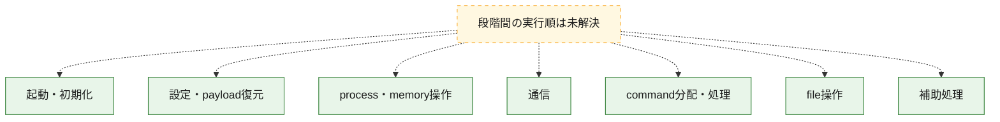
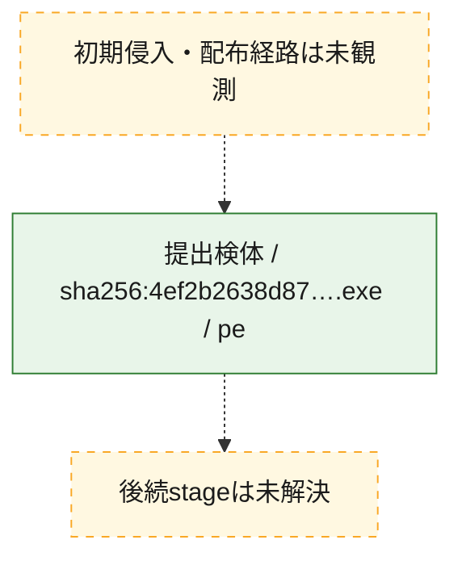
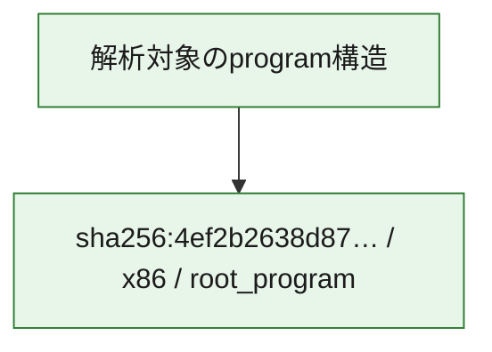

# 全体ロジック：4ef2b2638d87670790c999a61136c25449b4e0a3ab83929f88054c499e85619a

代表関数の静的証跡から、起動・初期化、設定・payload復元、process・memory操作、通信、command分配・処理、file操作の処理群を確認しました。

## 読み方

- phaseの掲載順は解析上の整理順です。observed_call_edgesがない段階間の実行順を断定しません。
- 図の実線は静的に観測した関係、点線と黄色のノードは未観測・未解決の関係を示します。
- 図は静的な要約であり、動的実行を再現するものではありません。
- 詳細な関数解説とfingerprintは[STATIC-LOGIC.md](STATIC-LOGIC.md)を参照してください。

## 静的可視化

### 実行フロー

### 感染チェーン

### モジュール関係

## 処理段階

### 1. 起動・初期化

entry pointから初期化と後続処理への移行を確認します。
確度: `confirmed_static_function_evidence_with_limits`

- `4ef2b2638d87670790c999a61136c25449b4e0a3ab83929f88054c499e85619a:ghidra:140183a40` — 初期化と主要処理への分岐を行う入口関数です。 状態: `succeeded`、選定理由: `entry_point`, `meaningful_symbol_name`, `probable_go_main_user_code`, `reviewed_call_centrality:3`, `role:entrypoint`
- `4ef2b2638d87670790c999a61136c25449b4e0a3ab83929f88054c499e85619a:ghidra:140183a80` — 初期化と主要処理への分岐を行う入口関数です。 状態: `failed`、選定理由: `entry_point`, `meaningful_symbol_name`, `probable_go_main_user_code`, `role:entrypoint`
- `4ef2b2638d87670790c999a61136c25449b4e0a3ab83929f88054c499e85619a:ghidra:14018f380` — 初期化と主要処理への分岐を行う入口関数です。 状態: `failed`、選定理由: `entry_point`, `meaningful_symbol_name`, `probable_go_main_user_code`, `role:entrypoint`
- `4ef2b2638d87670790c999a61136c25449b4e0a3ab83929f88054c499e85619a:ghidra:14019c380` — 初期化と主要処理への分岐を行う入口関数です。 状態: `failed`、選定理由: `entry_point`, `meaningful_symbol_name`, `probable_go_main_user_code`, `role:entrypoint`
- `4ef2b2638d87670790c999a61136c25449b4e0a3ab83929f88054c499e85619a:ghidra:1401abf20` — 初期化と主要処理への分岐を行う入口関数です。 状態: `succeeded`、選定理由: `entry_point`, `meaningful_symbol_name`, `probable_go_main_user_code`, `reviewed_call_centrality:24`, `role:entrypoint`
- `4ef2b2638d87670790c999a61136c25449b4e0a3ab83929f88054c499e85619a:ghidra:1401b3160` — 初期化と主要処理への分岐を行う入口関数です。 状態: `succeeded`、選定理由: `entry_point`, `meaningful_symbol_name`, `probable_go_main_user_code`, `reviewed_call_centrality:27`, `role:entrypoint`
- `4ef2b2638d87670790c999a61136c25449b4e0a3ab83929f88054c499e85619a:ghidra:1401b5f80` — 初期化と主要処理への分岐を行う入口関数です。 状態: `failed`、選定理由: `entry_point`, `meaningful_symbol_name`, `probable_go_main_user_code`, `role:entrypoint`
- `4ef2b2638d87670790c999a61136c25449b4e0a3ab83929f88054c499e85619a:ghidra:1401c8aa0` — 初期化と主要処理への分岐を行う入口関数です。 状態: `succeeded`、選定理由: `entry_point`, `meaningful_symbol_name`, `probable_go_main_user_code`, `reviewed_call_centrality:25`, `role:entrypoint`
- `4ef2b2638d87670790c999a61136c25449b4e0a3ab83929f88054c499e85619a:ghidra:1401cd060` — 初期化と主要処理への分岐を行う入口関数です。 状態: `succeeded`、選定理由: `entry_point`, `meaningful_symbol_name`, `probable_go_main_user_code`, `reviewed_call_centrality:22`, `role:entrypoint`
- `4ef2b2638d87670790c999a61136c25449b4e0a3ab83929f88054c499e85619a:ghidra:1401ce720` — 初期化と主要処理への分岐を行う入口関数です。 状態: `succeeded`、選定理由: `entry_point`, `meaningful_symbol_name`, `probable_go_main_user_code`, `reviewed_call_centrality:22`, `role:entrypoint`
- `4ef2b2638d87670790c999a61136c25449b4e0a3ab83929f88054c499e85619a:ghidra:1401cfe00` — 初期化と主要処理への分岐を行う入口関数です。 状態: `succeeded`、選定理由: `entry_point`, `meaningful_symbol_name`, `probable_go_main_user_code`, `reviewed_call_centrality:6`, `role:entrypoint`
- `4ef2b2638d87670790c999a61136c25449b4e0a3ab83929f88054c499e85619a:ghidra:1401cfec0` — 初期化と主要処理への分岐を行う入口関数です。 状態: `succeeded`、選定理由: `entry_point`, `meaningful_symbol_name`, `probable_go_main_user_code`, `reviewed_call_centrality:8`, `role:entrypoint`
- `4ef2b2638d87670790c999a61136c25449b4e0a3ab83929f88054c499e85619a:ghidra:1401d0000` — 初期化と主要処理への分岐を行う入口関数です。 状態: `succeeded`、選定理由: `entry_point`, `meaningful_symbol_name`, `probable_go_main_user_code`, `reviewed_call_centrality:8`, `role:entrypoint`
- `4ef2b2638d87670790c999a61136c25449b4e0a3ab83929f88054c499e85619a:ghidra:1401d01e0` — 初期化と主要処理への分岐を行う入口関数です。 状態: `succeeded`、選定理由: `entry_point`, `meaningful_symbol_name`, `probable_go_main_user_code`, `reviewed_call_centrality:8`, `role:entrypoint`
- `4ef2b2638d87670790c999a61136c25449b4e0a3ab83929f88054c499e85619a:ghidra:1401d03e0` — 初期化と主要処理への分岐を行う入口関数です。 状態: `succeeded`、選定理由: `entry_point`, `meaningful_symbol_name`, `probable_go_main_user_code`, `reviewed_call_centrality:14`, `role:entrypoint`
- `4ef2b2638d87670790c999a61136c25449b4e0a3ab83929f88054c499e85619a:ghidra:1401d0600` — 初期化と主要処理への分岐を行う入口関数です。 状態: `succeeded`、選定理由: `entry_point`, `meaningful_symbol_name`, `probable_go_main_user_code`, `reviewed_call_centrality:3`, `role:entrypoint`
- `4ef2b2638d87670790c999a61136c25449b4e0a3ab83929f88054c499e85619a:ghidra:1401d0660` — 初期化と主要処理への分岐を行う入口関数です。 状態: `succeeded`、選定理由: `entry_point`, `meaningful_symbol_name`, `probable_go_main_user_code`, `reviewed_call_centrality:3`, `role:entrypoint`
- `4ef2b2638d87670790c999a61136c25449b4e0a3ab83929f88054c499e85619a:ghidra:1401d06e0` — 初期化と主要処理への分岐を行う入口関数です。 状態: `succeeded`、選定理由: `entry_point`, `meaningful_symbol_name`, `probable_go_main_user_code`, `reviewed_call_centrality:5`, `role:entrypoint`
- `4ef2b2638d87670790c999a61136c25449b4e0a3ab83929f88054c499e85619a:ghidra:1401d07e0` — 初期化と主要処理への分岐を行う入口関数です。 状態: `succeeded`、選定理由: `entry_point`, `meaningful_symbol_name`, `probable_go_main_user_code`, `reviewed_call_centrality:4`, `role:entrypoint`
- `4ef2b2638d87670790c999a61136c25449b4e0a3ab83929f88054c499e85619a:ghidra:1401d08a0` — 初期化と主要処理への分岐を行う入口関数です。 状態: `succeeded`、選定理由: `entry_point`, `meaningful_symbol_name`, `probable_go_main_user_code`, `reviewed_call_centrality:3`, `role:entrypoint`
- `4ef2b2638d87670790c999a61136c25449b4e0a3ab83929f88054c499e85619a:ghidra:1401d0900` — 初期化と主要処理への分岐を行う入口関数です。 状態: `succeeded`、選定理由: `entry_point`, `meaningful_symbol_name`, `probable_go_main_user_code`, `reviewed_call_centrality:7`, `role:entrypoint`
- `4ef2b2638d87670790c999a61136c25449b4e0a3ab83929f88054c499e85619a:ghidra:1401d0ae0` — 初期化と主要処理への分岐を行う入口関数です。 状態: `succeeded`、選定理由: `entry_point`, `meaningful_symbol_name`, `probable_go_main_user_code`, `reviewed_call_centrality:6`, `role:entrypoint`
- `4ef2b2638d87670790c999a61136c25449b4e0a3ab83929f88054c499e85619a:ghidra:1401d0ba0` — 初期化と主要処理への分岐を行う入口関数です。 状態: `succeeded`、選定理由: `entry_point`, `meaningful_symbol_name`, `probable_go_main_user_code`, `reviewed_call_centrality:7`, `role:entrypoint`
- `4ef2b2638d87670790c999a61136c25449b4e0a3ab83929f88054c499e85619a:ghidra:1401d0c80` — 初期化と主要処理への分岐を行う入口関数です。 状態: `succeeded`、選定理由: `entry_point`, `meaningful_symbol_name`, `probable_go_main_user_code`, `reviewed_call_centrality:5`, `role:entrypoint`

### 2. 設定・payload復元

設定、resource、payload、暗号化データの復元・変換を確認します。
確度: `confirmed_static_function_evidence`

- `4ef2b2638d87670790c999a61136c25449b4e0a3ab83929f88054c499e85619a:ghidra:1400837c0` — 設定、resource、payloadなどの解析・変換を行う関数です。 状態: `succeeded`、選定理由: `meaningful_symbol_name`, `reviewed_call_centrality:4`, `role:config_or_data_transform`
- `4ef2b2638d87670790c999a61136c25449b4e0a3ab83929f88054c499e85619a:ghidra:1400e4200` — 暗号、hash、encoding、または復号処理に関係する関数です。 状態: `succeeded`、選定理由: `meaningful_symbol_name`, `reviewed_call_centrality:11`, `role:cryptographic_transform`

### 3. process・memory操作

process、thread、module、memory操作と実行移行を確認します。
確度: `confirmed_static_function_evidence`

- `4ef2b2638d87670790c999a61136c25449b4e0a3ab83929f88054c499e85619a:ghidra:140074880` — process、thread、module、またはmemory操作に関係する関数です。 状態: `succeeded`、選定理由: `meaningful_symbol_name`, `reviewed_call_centrality:3`, `role:process_or_memory_operation`

### 4. 通信

通信初期化、endpoint処理、送受信の役割を確認します。
確度: `confirmed_static_function_evidence`

- `4ef2b2638d87670790c999a61136c25449b4e0a3ab83929f88054c499e85619a:ghidra:140087c60` — 通信初期化、送受信、またはendpoint処理に関係する関数です。 状態: `succeeded`、選定理由: `meaningful_symbol_name`, `reviewed_call_centrality:3`, `role:network_communication`

### 5. command分配・処理

受信commandやtaskの解釈、分配、個別handlerへの移行を確認します。
確度: `confirmed_static_function_evidence`

- `4ef2b2638d87670790c999a61136c25449b4e0a3ab83929f88054c499e85619a:ghidra:140089460` — commandの解釈、分配、または個別処理を担当する関数です。 状態: `succeeded`、選定理由: `meaningful_symbol_name`, `reviewed_call_centrality:5`, `role:command_dispatch_or_handler`

### 6. file操作

fileやdirectoryの作成、読書き、削除を確認します。
確度: `confirmed_static_function_evidence`

- `4ef2b2638d87670790c999a61136c25449b4e0a3ab83929f88054c499e85619a:ghidra:140088220` — fileまたはdirectoryの読書き・管理に関係する関数です。 状態: `succeeded`、選定理由: `meaningful_symbol_name`, `reviewed_call_centrality:7`, `role:file_operation`

### 7. 補助処理

主要処理を支える一般内部関数またはlibrary処理を確認します。
確度: `confirmed_static_function_evidence`

- `4ef2b2638d87670790c999a61136c25449b4e0a3ab83929f88054c499e85619a:ghidra:1400010a0` — compiler生成処理または汎用library処理とみられる関数です。 状態: `succeeded`、選定理由: `meaningful_symbol_name`, `reviewed_call_centrality:3`
- `4ef2b2638d87670790c999a61136c25449b4e0a3ab83929f88054c499e85619a:ghidra:14006f020` — 検体内部の一般処理を実装する関数です。 状態: `succeeded`、選定理由: `meaningful_symbol_name`, `reviewed_call_centrality:3`

## 観測したcall関係

- `ghidra-function:05ce56cc511a4ade6875e42e` → `ghidra-external:49b6e7fd5733dfac50a8fada` （`unclassified` → `unclassified`）
- `ghidra-function:05ce56cc511a4ade6875e42e` → `ghidra-external:93abed301f1044887b12072e` （`unclassified` → `unclassified`）
- `ghidra-function:05ce56cc511a4ade6875e42e` → `ghidra-external:ba17eb24e4156b283af1fb15` （`unclassified` → `unclassified`）
- `ghidra-function:0d117a0be403d27e2ccc7e66` → `ghidra-external:061172c57a1d9a4e99d8c097` （`unclassified` → `unclassified`）
- `ghidra-function:0d117a0be403d27e2ccc7e66` → `ghidra-external:0d9707ab5f35a5b654db469c` （`unclassified` → `unclassified`）
- `ghidra-function:0d117a0be403d27e2ccc7e66` → `ghidra-external:2a3bdd4ef088ef4247697447` （`unclassified` → `unclassified`）
- `ghidra-function:0d117a0be403d27e2ccc7e66` → `ghidra-external:3b56861b0b3114c8f7980abd` （`unclassified` → `unclassified`）
- `ghidra-function:0d117a0be403d27e2ccc7e66` → `ghidra-external:4067574567def5dc54d0ef1b` （`unclassified` → `unclassified`）
- `ghidra-function:0d117a0be403d27e2ccc7e66` → `ghidra-external:6dc4742b44510b93599ecc2d` （`unclassified` → `unclassified`）
- `ghidra-function:0d117a0be403d27e2ccc7e66` → `ghidra-external:6f5ded894b62a4495008d272` （`unclassified` → `unclassified`）
- `ghidra-function:0d117a0be403d27e2ccc7e66` → `ghidra-external:a159999f048b31ad812bf957` （`unclassified` → `unclassified`）
- `ghidra-function:0d117a0be403d27e2ccc7e66` → `ghidra-external:b4bbfea6e4562360434b6d59` （`unclassified` → `unclassified`）
- `ghidra-function:0d117a0be403d27e2ccc7e66` → `ghidra-external:ba17eb24e4156b283af1fb15` （`unclassified` → `unclassified`）
- `ghidra-function:0d117a0be403d27e2ccc7e66` → `ghidra-external:bb2cb32fab905815d3848521` （`unclassified` → `unclassified`）
- `ghidra-function:0d117a0be403d27e2ccc7e66` → `ghidra-external:d732e06e0aeb0d8efe5a0d95` （`unclassified` → `unclassified`）
- `ghidra-function:0d117a0be403d27e2ccc7e66` → `ghidra-external:e21312df2ec9f540e4889c68` （`unclassified` → `unclassified`）
- `ghidra-function:0d117a0be403d27e2ccc7e66` → `ghidra-external:f24522f61d15d99ea4739097` （`unclassified` → `unclassified`）
- `ghidra-function:151581428d6304fe33685fea` → `ghidra-external:061172c57a1d9a4e99d8c097` （`unclassified` → `unclassified`）
- `ghidra-function:151581428d6304fe33685fea` → `ghidra-external:15a4ebf9d0ae90fb7ed6839b` （`unclassified` → `unclassified`）
- `ghidra-function:151581428d6304fe33685fea` → `ghidra-external:284edf47ae665ca08c05ff77` （`unclassified` → `unclassified`）
- `ghidra-function:151581428d6304fe33685fea` → `ghidra-external:33c79d76f072ef951b4ac341` （`unclassified` → `unclassified`）
- `ghidra-function:151581428d6304fe33685fea` → `ghidra-external:344a359eac55f1212726b6ed` （`unclassified` → `unclassified`）
- `ghidra-function:151581428d6304fe33685fea` → `ghidra-external:3b56861b0b3114c8f7980abd` （`unclassified` → `unclassified`）
- `ghidra-function:151581428d6304fe33685fea` → `ghidra-external:4c934cac2858d172cee43cbc` （`unclassified` → `unclassified`）
- `ghidra-function:151581428d6304fe33685fea` → `ghidra-external:53915321b5143f1271f52cfb` （`unclassified` → `unclassified`）
- `ghidra-function:151581428d6304fe33685fea` → `ghidra-external:54f7613913bfc310464c93ac` （`unclassified` → `unclassified`）
- `ghidra-function:151581428d6304fe33685fea` → `ghidra-external:6f7b03c48eb60106e71f7473` （`unclassified` → `unclassified`）
- `ghidra-function:151581428d6304fe33685fea` → `ghidra-external:81c379b3245697b910a98aef` （`unclassified` → `unclassified`）
- `ghidra-function:151581428d6304fe33685fea` → `ghidra-external:857a9ab7716265bf56d0387d` （`unclassified` → `unclassified`）
- `ghidra-function:151581428d6304fe33685fea` → `ghidra-external:900a82520388aa96c6eadc7d` （`unclassified` → `unclassified`）
- `ghidra-function:151581428d6304fe33685fea` → `ghidra-external:90c7e2a5b3c69eb13b041538` （`unclassified` → `unclassified`）
- `ghidra-function:151581428d6304fe33685fea` → `ghidra-external:90cc27e6cd1377fd9873e08f` （`unclassified` → `unclassified`）
- `ghidra-function:151581428d6304fe33685fea` → `ghidra-external:94fb933b137e4284d6a690d9` （`unclassified` → `unclassified`）
- `ghidra-function:151581428d6304fe33685fea` → `ghidra-external:9b8943753128fce2efe01e79` （`unclassified` → `unclassified`）
- `ghidra-function:151581428d6304fe33685fea` → `ghidra-external:9efa2eeb8d78365ae0fb1f17` （`unclassified` → `unclassified`）
- `ghidra-function:151581428d6304fe33685fea` → `ghidra-external:ba17eb24e4156b283af1fb15` （`unclassified` → `unclassified`）
- `ghidra-function:151581428d6304fe33685fea` → `ghidra-external:c4a00ab775f19b55b3bd5623` （`unclassified` → `unclassified`）
- `ghidra-function:151581428d6304fe33685fea` → `ghidra-external:c4fac01d2f61ac1731b20212` （`unclassified` → `unclassified`）
- `ghidra-function:151581428d6304fe33685fea` → `ghidra-external:c5788495159b037af0a6aee3` （`unclassified` → `unclassified`）
- `ghidra-function:151581428d6304fe33685fea` → `ghidra-external:e072fdadca38794560768e72` （`unclassified` → `unclassified`）
- `ghidra-function:151581428d6304fe33685fea` → `ghidra-external:ede57428c376e6da0568de83` （`unclassified` → `unclassified`）
- `ghidra-function:189194a0efe3bbbf18b61f34` → `ghidra-external:48d44f7ec3ce5c4ad89b3e5e` （`unclassified` → `unclassified`）
- `ghidra-function:189194a0efe3bbbf18b61f34` → `ghidra-external:90cc27e6cd1377fd9873e08f` （`unclassified` → `unclassified`）
- `ghidra-function:189194a0efe3bbbf18b61f34` → `ghidra-external:9d4625e71a567f5fbd498b66` （`unclassified` → `unclassified`）
- `ghidra-function:189194a0efe3bbbf18b61f34` → `ghidra-external:ba17eb24e4156b283af1fb15` （`unclassified` → `unclassified`）
- `ghidra-function:189194a0efe3bbbf18b61f34` → `ghidra-external:d162246e2c54bba715aff130` （`unclassified` → `unclassified`）
- `ghidra-function:1e80fbc9092c78b12216ab73` → `ghidra-external:359bbfee8715c5eb19d3a444` （`unclassified` → `unclassified`）
- `ghidra-function:1e80fbc9092c78b12216ab73` → `ghidra-external:5b252c89d59509db0529add4` （`unclassified` → `unclassified`）
- `ghidra-function:1e80fbc9092c78b12216ab73` → `ghidra-external:698727be5fae70e351d8b756` （`unclassified` → `unclassified`）
- `ghidra-function:1e80fbc9092c78b12216ab73` → `ghidra-external:ba17eb24e4156b283af1fb15` （`unclassified` → `unclassified`）
- `ghidra-function:1e80fbc9092c78b12216ab73` → `ghidra-external:c9c39131d9af2de5b4f7d359` （`unclassified` → `unclassified`）
- `ghidra-function:1e80fbc9092c78b12216ab73` → `ghidra-external:d0d9b32b45ab5bc08090e117` （`unclassified` → `unclassified`）
- `ghidra-function:1e80fbc9092c78b12216ab73` → `ghidra-external:d162246e2c54bba715aff130` （`unclassified` → `unclassified`）
- `ghidra-function:2cdb06755fea8363e0c62294` → `ghidra-external:284edf47ae665ca08c05ff77` （`unclassified` → `unclassified`）
- `ghidra-function:2cdb06755fea8363e0c62294` → `ghidra-external:2fe3cac3063c8021ba673725` （`unclassified` → `unclassified`）
- `ghidra-function:2cdb06755fea8363e0c62294` → `ghidra-external:33c79d76f072ef951b4ac341` （`unclassified` → `unclassified`）
- `ghidra-function:2cdb06755fea8363e0c62294` → `ghidra-external:344a359eac55f1212726b6ed` （`unclassified` → `unclassified`）
- `ghidra-function:2cdb06755fea8363e0c62294` → `ghidra-external:3b56861b0b3114c8f7980abd` （`unclassified` → `unclassified`）
- `ghidra-function:2cdb06755fea8363e0c62294` → `ghidra-external:4c934cac2858d172cee43cbc` （`unclassified` → `unclassified`）
- `ghidra-function:2cdb06755fea8363e0c62294` → `ghidra-external:53915321b5143f1271f52cfb` （`unclassified` → `unclassified`）
- `ghidra-function:2cdb06755fea8363e0c62294` → `ghidra-external:54f7613913bfc310464c93ac` （`unclassified` → `unclassified`）
- `ghidra-function:2cdb06755fea8363e0c62294` → `ghidra-external:6f7b03c48eb60106e71f7473` （`unclassified` → `unclassified`）
- `ghidra-function:2cdb06755fea8363e0c62294` → `ghidra-external:80e108f8991d754bfaf3d745` （`unclassified` → `unclassified`）
- `ghidra-function:2cdb06755fea8363e0c62294` → `ghidra-external:81c379b3245697b910a98aef` （`unclassified` → `unclassified`）
- `ghidra-function:2cdb06755fea8363e0c62294` → `ghidra-external:857a9ab7716265bf56d0387d` （`unclassified` → `unclassified`）
- `ghidra-function:2cdb06755fea8363e0c62294` → `ghidra-external:900a82520388aa96c6eadc7d` （`unclassified` → `unclassified`）
- `ghidra-function:2cdb06755fea8363e0c62294` → `ghidra-external:90c7e2a5b3c69eb13b041538` （`unclassified` → `unclassified`）
- `ghidra-function:2cdb06755fea8363e0c62294` → `ghidra-external:90cc27e6cd1377fd9873e08f` （`unclassified` → `unclassified`）
- `ghidra-function:2cdb06755fea8363e0c62294` → `ghidra-external:9b8943753128fce2efe01e79` （`unclassified` → `unclassified`）
- `ghidra-function:2cdb06755fea8363e0c62294` → `ghidra-external:9efa2eeb8d78365ae0fb1f17` （`unclassified` → `unclassified`）
- `ghidra-function:2cdb06755fea8363e0c62294` → `ghidra-external:ba17eb24e4156b283af1fb15` （`unclassified` → `unclassified`）
- `ghidra-function:2cdb06755fea8363e0c62294` → `ghidra-external:c4a00ab775f19b55b3bd5623` （`unclassified` → `unclassified`）
- `ghidra-function:2cdb06755fea8363e0c62294` → `ghidra-external:c4fac01d2f61ac1731b20212` （`unclassified` → `unclassified`）
- `ghidra-function:2cdb06755fea8363e0c62294` → `ghidra-external:c5788495159b037af0a6aee3` （`unclassified` → `unclassified`）
- `ghidra-function:2cdb06755fea8363e0c62294` → `ghidra-external:ede57428c376e6da0568de83` （`unclassified` → `unclassified`）
- `ghidra-function:321c60555a3cb82a01074670` → `ghidra-external:061172c57a1d9a4e99d8c097` （`unclassified` → `unclassified`）
- `ghidra-function:321c60555a3cb82a01074670` → `ghidra-external:4067574567def5dc54d0ef1b` （`unclassified` → `unclassified`）
- `ghidra-function:321c60555a3cb82a01074670` → `ghidra-external:4afaf5243587ee122f5262f0` （`unclassified` → `unclassified`）
- `ghidra-function:321c60555a3cb82a01074670` → `ghidra-external:51971f1e06862d52268601ca` （`unclassified` → `unclassified`）
- `ghidra-function:321c60555a3cb82a01074670` → `ghidra-external:910932931fbd51858ecbb162` （`unclassified` → `unclassified`）
- `ghidra-function:321c60555a3cb82a01074670` → `ghidra-external:9c940a0fa3fb20d32a74b44e` （`unclassified` → `unclassified`）
- `ghidra-function:321c60555a3cb82a01074670` → `ghidra-external:b9e873ee6c301029a2c29c92` （`unclassified` → `unclassified`）
- `ghidra-function:321c60555a3cb82a01074670` → `ghidra-external:ba17eb24e4156b283af1fb15` （`unclassified` → `unclassified`）
- `ghidra-function:321c60555a3cb82a01074670` → `ghidra-external:bb85cee174aa5dbc1d565ba4` （`unclassified` → `unclassified`）
- `ghidra-function:321c60555a3cb82a01074670` → `ghidra-external:e072fdadca38794560768e72` （`unclassified` → `unclassified`）
- `ghidra-function:321c60555a3cb82a01074670` → `ghidra-external:e4adfcbbfd973e3dd1ccde1d` （`unclassified` → `unclassified`）
- `ghidra-function:36005f980ef5b4e6011dee30` → `ghidra-external:127658a25fe552d29d612d25` （`unclassified` → `unclassified`）
- `ghidra-function:36005f980ef5b4e6011dee30` → `ghidra-external:37e3cd33a0b62890eccccc93` （`unclassified` → `unclassified`）
- `ghidra-function:36005f980ef5b4e6011dee30` → `ghidra-external:99dbbdf52856baf5023c79ce` （`unclassified` → `unclassified`）
- `ghidra-function:36005f980ef5b4e6011dee30` → `ghidra-external:9a7cf76cd9f54e910c4671a9` （`unclassified` → `unclassified`）
- `ghidra-function:36005f980ef5b4e6011dee30` → `ghidra-external:9feee25b55175122aa2c6df9` （`unclassified` → `unclassified`）
- `ghidra-function:36005f980ef5b4e6011dee30` → `ghidra-external:ba17eb24e4156b283af1fb15` （`unclassified` → `unclassified`）
- `ghidra-function:36005f980ef5b4e6011dee30` → `ghidra-external:eee93213a8da5552d2b80261` （`unclassified` → `unclassified`）
- `ghidra-function:37f0ab2eede15b885e565ba4` → `ghidra-external:237b98c4dad7151cce62e2f8` （`unclassified` → `unclassified`）
- `ghidra-function:37f0ab2eede15b885e565ba4` → `ghidra-external:6cc1a8e20e0110e0ed076a7a` （`unclassified` → `unclassified`）
- `ghidra-function:37f0ab2eede15b885e565ba4` → `ghidra-external:7a3fcd2e121dffd25ba42361` （`unclassified` → `unclassified`）
- `ghidra-function:37f0ab2eede15b885e565ba4` → `ghidra-external:ba17eb24e4156b283af1fb15` （`unclassified` → `unclassified`）
- `ghidra-function:6198969027a799c118783c0f` → `ghidra-external:027c407c1f707ea66f54036e` （`unclassified` → `unclassified`）
- `ghidra-function:6198969027a799c118783c0f` → `ghidra-external:9ef845ae2862f0b364c9c729` （`unclassified` → `unclassified`）
- `ghidra-function:6198969027a799c118783c0f` → `ghidra-external:ba17eb24e4156b283af1fb15` （`unclassified` → `unclassified`）
- `ghidra-function:6ac778c0f61431fe8304734a` → `ghidra-external:284edf47ae665ca08c05ff77` （`unclassified` → `unclassified`）
- `ghidra-function:6ac778c0f61431fe8304734a` → `ghidra-external:2fe3cac3063c8021ba673725` （`unclassified` → `unclassified`）
- `ghidra-function:6ac778c0f61431fe8304734a` → `ghidra-external:33c79d76f072ef951b4ac341` （`unclassified` → `unclassified`）
- `ghidra-function:6ac778c0f61431fe8304734a` → `ghidra-external:344a359eac55f1212726b6ed` （`unclassified` → `unclassified`）
- `ghidra-function:6ac778c0f61431fe8304734a` → `ghidra-external:3b56861b0b3114c8f7980abd` （`unclassified` → `unclassified`）
- `ghidra-function:6ac778c0f61431fe8304734a` → `ghidra-external:4c934cac2858d172cee43cbc` （`unclassified` → `unclassified`）
- `ghidra-function:6ac778c0f61431fe8304734a` → `ghidra-external:53915321b5143f1271f52cfb` （`unclassified` → `unclassified`）
- `ghidra-function:6ac778c0f61431fe8304734a` → `ghidra-external:54f7613913bfc310464c93ac` （`unclassified` → `unclassified`）
- `ghidra-function:6ac778c0f61431fe8304734a` → `ghidra-external:6f7b03c48eb60106e71f7473` （`unclassified` → `unclassified`）
- `ghidra-function:6ac778c0f61431fe8304734a` → `ghidra-external:81c379b3245697b910a98aef` （`unclassified` → `unclassified`）
- `ghidra-function:6ac778c0f61431fe8304734a` → `ghidra-external:857a9ab7716265bf56d0387d` （`unclassified` → `unclassified`）
- `ghidra-function:6ac778c0f61431fe8304734a` → `ghidra-external:900a82520388aa96c6eadc7d` （`unclassified` → `unclassified`）
- `ghidra-function:6ac778c0f61431fe8304734a` → `ghidra-external:90c7e2a5b3c69eb13b041538` （`unclassified` → `unclassified`）
- `ghidra-function:6ac778c0f61431fe8304734a` → `ghidra-external:90cc27e6cd1377fd9873e08f` （`unclassified` → `unclassified`）
- `ghidra-function:6ac778c0f61431fe8304734a` → `ghidra-external:9b8943753128fce2efe01e79` （`unclassified` → `unclassified`）
- `ghidra-function:6ac778c0f61431fe8304734a` → `ghidra-external:9efa2eeb8d78365ae0fb1f17` （`unclassified` → `unclassified`）
- `ghidra-function:6ac778c0f61431fe8304734a` → `ghidra-external:ba17eb24e4156b283af1fb15` （`unclassified` → `unclassified`）
- `ghidra-function:6ac778c0f61431fe8304734a` → `ghidra-external:c4a00ab775f19b55b3bd5623` （`unclassified` → `unclassified`）
- `ghidra-function:6ac778c0f61431fe8304734a` → `ghidra-external:c4fac01d2f61ac1731b20212` （`unclassified` → `unclassified`）
- `ghidra-function:6ac778c0f61431fe8304734a` → `ghidra-external:c5788495159b037af0a6aee3` （`unclassified` → `unclassified`）
- `ghidra-function:6ac778c0f61431fe8304734a` → `ghidra-external:ede57428c376e6da0568de83` （`unclassified` → `unclassified`）
- `ghidra-function:6ac778c0f61431fe8304734a` → `ghidra-external:efd9ac8a1131f0f199e5340c` （`unclassified` → `unclassified`）
- `ghidra-function:6b0a2fe6d71278bc55cd73e3` → `ghidra-external:100a6acab61468755d2506c6` （`unclassified` → `unclassified`）
- `ghidra-function:6b0a2fe6d71278bc55cd73e3` → `ghidra-external:2bc67078486abc868a51420c` （`unclassified` → `unclassified`）
- `ghidra-function:6b0a2fe6d71278bc55cd73e3` → `ghidra-external:3f8c6891ef52a0b0a62cf26a` （`unclassified` → `unclassified`）
- `ghidra-function:6b0a2fe6d71278bc55cd73e3` → `ghidra-external:4d95803852674972504fdd42` （`unclassified` → `unclassified`）
- `ghidra-function:6b0a2fe6d71278bc55cd73e3` → `ghidra-external:6f5ded894b62a4495008d272` （`unclassified` → `unclassified`）
- `ghidra-function:6b0a2fe6d71278bc55cd73e3` → `ghidra-external:94052b671c67ce039a1de87b` （`unclassified` → `unclassified`）
- `ghidra-function:6b0a2fe6d71278bc55cd73e3` → `ghidra-external:ba17eb24e4156b283af1fb15` （`unclassified` → `unclassified`）
- `ghidra-function:6b0a2fe6d71278bc55cd73e3` → `ghidra-external:c324702345c9038075dc7c72` （`unclassified` → `unclassified`）
- `ghidra-function:7577e74abcef8047e945385c` → `ghidra-external:6f5ded894b62a4495008d272` （`unclassified` → `unclassified`）
- `ghidra-function:7577e74abcef8047e945385c` → `ghidra-external:7ccd7a79977ff072f48e10a5` （`unclassified` → `unclassified`）
- `ghidra-function:7577e74abcef8047e945385c` → `ghidra-external:ba17eb24e4156b283af1fb15` （`unclassified` → `unclassified`）
- `ghidra-function:7962475acc98f17110baef00` → `ghidra-external:51971f1e06862d52268601ca` （`unclassified` → `unclassified`）
- `ghidra-function:7962475acc98f17110baef00` → `ghidra-external:7569ae9462104fbd665a02c6` （`unclassified` → `unclassified`）
- `ghidra-function:7962475acc98f17110baef00` → `ghidra-external:9e70745cc9945d6591fe4742` （`unclassified` → `unclassified`）
- `ghidra-function:7962475acc98f17110baef00` → `ghidra-external:ba17eb24e4156b283af1fb15` （`unclassified` → `unclassified`）
- `ghidra-function:7962475acc98f17110baef00` → `ghidra-external:dd9c1746a7f8ca02caf9acc9` （`unclassified` → `unclassified`）
- `ghidra-function:8bb07ca7b50dec02b9adf7c9` → `ghidra-external:0d9707ab5f35a5b654db469c` （`unclassified` → `unclassified`）
- `ghidra-function:8bb07ca7b50dec02b9adf7c9` → `ghidra-external:284edf47ae665ca08c05ff77` （`unclassified` → `unclassified`）
- `ghidra-function:8bb07ca7b50dec02b9adf7c9` → `ghidra-external:33c79d76f072ef951b4ac341` （`unclassified` → `unclassified`）
- `ghidra-function:8bb07ca7b50dec02b9adf7c9` → `ghidra-external:344a359eac55f1212726b6ed` （`unclassified` → `unclassified`）
- `ghidra-function:8bb07ca7b50dec02b9adf7c9` → `ghidra-external:3b56861b0b3114c8f7980abd` （`unclassified` → `unclassified`）
- `ghidra-function:8bb07ca7b50dec02b9adf7c9` → `ghidra-external:4067574567def5dc54d0ef1b` （`unclassified` → `unclassified`）
- `ghidra-function:8bb07ca7b50dec02b9adf7c9` → `ghidra-external:444d8cf0f3992893b085722f` （`unclassified` → `unclassified`）
- `ghidra-function:8bb07ca7b50dec02b9adf7c9` → `ghidra-external:4c934cac2858d172cee43cbc` （`unclassified` → `unclassified`）
- `ghidra-function:8bb07ca7b50dec02b9adf7c9` → `ghidra-external:52f96960db9c56c1c398422f` （`unclassified` → `unclassified`）
- `ghidra-function:8bb07ca7b50dec02b9adf7c9` → `ghidra-external:53915321b5143f1271f52cfb` （`unclassified` → `unclassified`）
- `ghidra-function:8bb07ca7b50dec02b9adf7c9` → `ghidra-external:54f7613913bfc310464c93ac` （`unclassified` → `unclassified`）
- `ghidra-function:8bb07ca7b50dec02b9adf7c9` → `ghidra-external:6c3108f31a5523b0e19bdedd` （`unclassified` → `unclassified`）
- `ghidra-function:8bb07ca7b50dec02b9adf7c9` → `ghidra-external:6f7b03c48eb60106e71f7473` （`unclassified` → `unclassified`）
- `ghidra-function:8bb07ca7b50dec02b9adf7c9` → `ghidra-external:81c379b3245697b910a98aef` （`unclassified` → `unclassified`）
- `ghidra-function:8bb07ca7b50dec02b9adf7c9` → `ghidra-external:857a9ab7716265bf56d0387d` （`unclassified` → `unclassified`）
- `ghidra-function:8bb07ca7b50dec02b9adf7c9` → `ghidra-external:900a82520388aa96c6eadc7d` （`unclassified` → `unclassified`）
- `ghidra-function:8bb07ca7b50dec02b9adf7c9` → `ghidra-external:90c7e2a5b3c69eb13b041538` （`unclassified` → `unclassified`）
- `ghidra-function:8bb07ca7b50dec02b9adf7c9` → `ghidra-external:90cc27e6cd1377fd9873e08f` （`unclassified` → `unclassified`）
- `ghidra-function:8bb07ca7b50dec02b9adf7c9` → `ghidra-external:9b8943753128fce2efe01e79` （`unclassified` → `unclassified`）
- `ghidra-function:8bb07ca7b50dec02b9adf7c9` → `ghidra-external:9efa2eeb8d78365ae0fb1f17` （`unclassified` → `unclassified`）
- `ghidra-function:8bb07ca7b50dec02b9adf7c9` → `ghidra-external:ba17eb24e4156b283af1fb15` （`unclassified` → `unclassified`）
- `ghidra-function:8bb07ca7b50dec02b9adf7c9` → `ghidra-external:c4a00ab775f19b55b3bd5623` （`unclassified` → `unclassified`）
- `ghidra-function:8bb07ca7b50dec02b9adf7c9` → `ghidra-external:c4fac01d2f61ac1731b20212` （`unclassified` → `unclassified`）
- `ghidra-function:8bb07ca7b50dec02b9adf7c9` → `ghidra-external:c5788495159b037af0a6aee3` （`unclassified` → `unclassified`）
- `ghidra-function:8bb07ca7b50dec02b9adf7c9` → `ghidra-external:ede57428c376e6da0568de83` （`unclassified` → `unclassified`）
- `ghidra-function:ab65120378b85a912062a76e` → `ghidra-external:2329be06950befa4b648ffde` （`unclassified` → `unclassified`）
- `ghidra-function:ab65120378b85a912062a76e` → `ghidra-external:64ae5c1db64b56e58764a05f` （`unclassified` → `unclassified`）
- `ghidra-function:ab65120378b85a912062a76e` → `ghidra-external:c6998192855dd9a660881308` （`unclassified` → `unclassified`）
- `ghidra-function:ae760c392cd85487d7f42055` → `ghidra-external:2750d529d292d7102e0bcd79` （`unclassified` → `unclassified`）
- `ghidra-function:ae760c392cd85487d7f42055` → `ghidra-external:6f5ded894b62a4495008d272` （`unclassified` → `unclassified`）
- `ghidra-function:ae760c392cd85487d7f42055` → `ghidra-external:95443e8cc7bc0e22db0d4eed` （`unclassified` → `unclassified`）
- `ghidra-function:ae760c392cd85487d7f42055` → `ghidra-external:9a12991ec8a4d66992ba481c` （`unclassified` → `unclassified`）
- `ghidra-function:ae760c392cd85487d7f42055` → `ghidra-external:ba17eb24e4156b283af1fb15` （`unclassified` → `unclassified`）
- `ghidra-function:ae760c392cd85487d7f42055` → `ghidra-external:d897a6ee4d44c3bafecd5579` （`unclassified` → `unclassified`）
- `ghidra-function:af3b3ccb7f28cfb600abf849` → `ghidra-external:3b56861b0b3114c8f7980abd` （`unclassified` → `unclassified`）
- `ghidra-function:af3b3ccb7f28cfb600abf849` → `ghidra-external:ba17eb24e4156b283af1fb15` （`unclassified` → `unclassified`）
- `ghidra-function:af3b3ccb7f28cfb600abf849` → `ghidra-external:f7fd081369cdc111f471df8b` （`unclassified` → `unclassified`）
- `ghidra-function:bf1cdbc1736b07124a51b62e` → `ghidra-external:2fe3cac3063c8021ba673725` （`unclassified` → `unclassified`）
- `ghidra-function:bf1cdbc1736b07124a51b62e` → `ghidra-external:9589b483000a2720b8b30fd6` （`unclassified` → `unclassified`）
- `ghidra-function:bf1cdbc1736b07124a51b62e` → `ghidra-external:eb4f588df5e9885bfefcfe07` （`unclassified` → `unclassified`）
- `ghidra-function:c0fb9fdd868d4ea8cd92ac70` → `ghidra-external:2bc67078486abc868a51420c` （`unclassified` → `unclassified`）
- `ghidra-function:c0fb9fdd868d4ea8cd92ac70` → `ghidra-external:30ff218b418bc6ed63e87a67` （`unclassified` → `unclassified`）
- `ghidra-function:c0fb9fdd868d4ea8cd92ac70` → `ghidra-external:3f8c6891ef52a0b0a62cf26a` （`unclassified` → `unclassified`）
- `ghidra-function:c0fb9fdd868d4ea8cd92ac70` → `ghidra-external:4d95803852674972504fdd42` （`unclassified` → `unclassified`）
- `ghidra-function:c0fb9fdd868d4ea8cd92ac70` → `ghidra-external:68d229af4bdfa0a79490b3ec` （`unclassified` → `unclassified`）
- `ghidra-function:c0fb9fdd868d4ea8cd92ac70` → `ghidra-external:94052b671c67ce039a1de87b` （`unclassified` → `unclassified`）
- `ghidra-function:c0fb9fdd868d4ea8cd92ac70` → `ghidra-external:ba17eb24e4156b283af1fb15` （`unclassified` → `unclassified`）
- `ghidra-function:c0fb9fdd868d4ea8cd92ac70` → `ghidra-external:e072fdadca38794560768e72` （`unclassified` → `unclassified`）
- `ghidra-function:cdc57b770f23d4216ab177a8` → `ghidra-external:2fe3cac3063c8021ba673725` （`unclassified` → `unclassified`）
- `ghidra-function:cdc57b770f23d4216ab177a8` → `ghidra-external:3aec16d54aff4df2b573f743` （`unclassified` → `unclassified`）
- `ghidra-function:cdc57b770f23d4216ab177a8` → `ghidra-external:eb4f588df5e9885bfefcfe07` （`unclassified` → `unclassified`）
- `ghidra-function:dac864344266d548e075abfa` → `ghidra-external:2fe3cac3063c8021ba673725` （`unclassified` → `unclassified`）
- `ghidra-function:dac864344266d548e075abfa` → `ghidra-external:99affa9767b99e1dbe3016a2` （`unclassified` → `unclassified`）
- `ghidra-function:dac864344266d548e075abfa` → `ghidra-external:a90fca2efea393452aae5d7e` （`unclassified` → `unclassified`）
- `ghidra-function:dac864344266d548e075abfa` → `ghidra-external:ba17eb24e4156b283af1fb15` （`unclassified` → `unclassified`）
- `ghidra-function:dac864344266d548e075abfa` → `ghidra-external:f2ce1eee950f81d60d4f2d69` （`unclassified` → `unclassified`）
- `ghidra-function:dac864344266d548e075abfa` → `ghidra-external:fc7063e7540cd21f62b8b110` （`unclassified` → `unclassified`）
- `ghidra-function:dd452c81f5af3d10d2d7bc67` → `ghidra-external:7399c2970fe264f841a23f9f` （`unclassified` → `unclassified`）
- `ghidra-function:dd452c81f5af3d10d2d7bc67` → `ghidra-external:a2b04d79809e6825f43c4423` （`unclassified` → `unclassified`）
- `ghidra-function:dd452c81f5af3d10d2d7bc67` → `ghidra-external:ba17eb24e4156b283af1fb15` （`unclassified` → `unclassified`）
- `ghidra-function:dd452c81f5af3d10d2d7bc67` → `ghidra-external:bd77c65dfec7f2b93075fbfb` （`unclassified` → `unclassified`）
- `ghidra-function:dd452c81f5af3d10d2d7bc67` → `ghidra-external:c8297e6c49a864f8c4c9f80a` （`unclassified` → `unclassified`）
- 残り49件は`static-logic.json`に記録しています。

## 解析範囲と制約

- 選定外関数は全体inventoryへ残しますが、関数本体の個別解説対象にはしていません。
- indirect call、難読化、packer、VM、壊れたcontrol flowによりcall関係が欠落する場合があります。
- 文書は静的解析に基づき、検体実行や外部通信による動的確認は行っていません。
