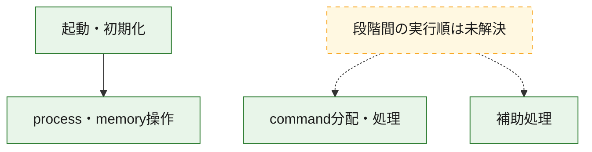
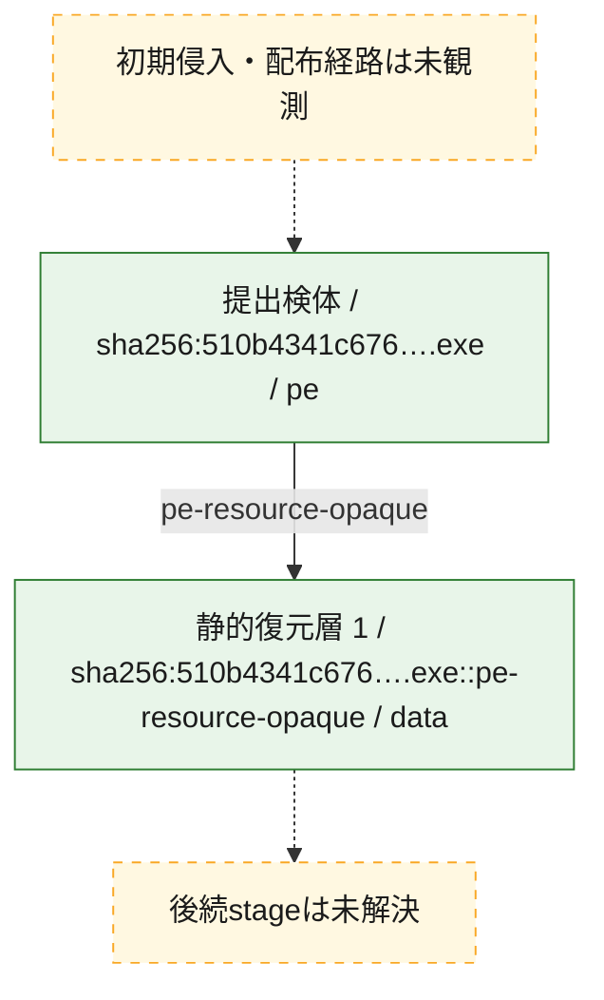
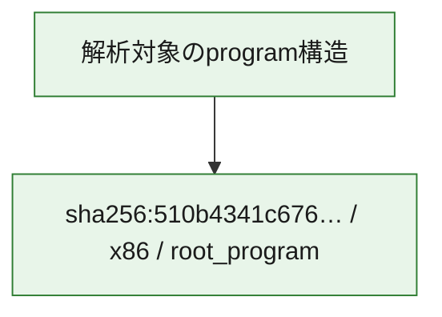

# 全体ロジック：510b4341c6763d5bf045973f4f9832cb8b66a414abda634d4fafed05cba03058

代表関数の静的証跡から、起動・初期化、process・memory操作、command分配・処理の処理群を確認しました。

## 読み方

- phaseの掲載順は解析上の整理順です。observed_call_edgesがない段階間の実行順を断定しません。
- 図の実線は静的に観測した関係、点線と黄色のノードは未観測・未解決の関係を示します。
- 図は静的な要約であり、動的実行を再現するものではありません。
- 詳細な関数解説とfingerprintは[STATIC-LOGIC.md](STATIC-LOGIC.md)を参照してください。

## 静的可視化

### 実行フロー

### 感染チェーン

### モジュール関係

## 処理段階

### 1. 起動・初期化

entry pointから初期化と後続処理への移行を確認します。
確度: `confirmed_static_function_evidence`

- `510b4341c6763d5bf045973f4f9832cb8b66a414abda634d4fafed05cba03058:ghidra:1400076c0` — 初期化と主要処理への分岐を行う入口関数です。 状態: `succeeded`、選定理由: `entry_point`, `meaningful_symbol_name`, `reviewed_call_centrality:11`, `role:entrypoint`

### 2. process・memory操作

process、thread、module、memory操作と実行移行を確認します。
確度: `confirmed_static_function_evidence`

- `510b4341c6763d5bf045973f4f9832cb8b66a414abda634d4fafed05cba03058:ghidra:140001000` — process、thread、module、またはmemory操作に関係する関数です。 状態: `succeeded`、選定理由: `context_representative`, `reviewed_call_centrality:27`, `role:process_or_memory_operation`
- `510b4341c6763d5bf045973f4f9832cb8b66a414abda634d4fafed05cba03058:ghidra:140004030` — process、thread、module、またはmemory操作に関係する関数です。 状態: `succeeded`、選定理由: `context_representative`, `reviewed_call_centrality:14`, `role:process_or_memory_operation`

### 3. command分配・処理

受信commandやtaskの解釈、分配、個別handlerへの移行を確認します。
確度: `confirmed_static_function_evidence_with_limits`

- `510b4341c6763d5bf045973f4f9832cb8b66a414abda634d4fafed05cba03058:ghidra:14001a150` — commandの解釈、分配、または個別処理を担当する関数です。 状態: `limited_bad_instruction_or_flow`、選定理由: `meaningful_symbol_name`, `role:command_dispatch_or_handler`

### 4. 補助処理

主要処理を支える一般内部関数またはlibrary処理を確認します。
確度: `confirmed_static_function_evidence_with_limits`

- `510b4341c6763d5bf045973f4f9832cb8b66a414abda634d4fafed05cba03058:ghidra:140001710` — 検体内部の一般処理を実装する関数です。 状態: `succeeded`、選定理由: `context_representative`
- `510b4341c6763d5bf045973f4f9832cb8b66a414abda634d4fafed05cba03058:ghidra:140001d30` — 検体内部の一般処理を実装する関数です。 状態: `succeeded`、選定理由: `context_representative`, `reviewed_call_centrality:4`
- `510b4341c6763d5bf045973f4f9832cb8b66a414abda634d4fafed05cba03058:ghidra:140001f30` — 検体内部の一般処理を実装する関数です。 状態: `succeeded`、選定理由: `context_representative`, `reviewed_call_centrality:1`
- `510b4341c6763d5bf045973f4f9832cb8b66a414abda634d4fafed05cba03058:ghidra:140002020` — 検体内部の一般処理を実装する関数です。 状態: `succeeded`、選定理由: `context_representative`
- `510b4341c6763d5bf045973f4f9832cb8b66a414abda634d4fafed05cba03058:ghidra:1400020a0` — 検体内部の一般処理を実装する関数です。 状態: `succeeded`、選定理由: `context_representative`
- `510b4341c6763d5bf045973f4f9832cb8b66a414abda634d4fafed05cba03058:ghidra:140002110` — 検体内部の一般処理を実装する関数です。 状態: `succeeded`、選定理由: `context_representative`
- `510b4341c6763d5bf045973f4f9832cb8b66a414abda634d4fafed05cba03058:ghidra:1400021f0` — 検体内部の一般処理を実装する関数です。 状態: `succeeded`、選定理由: `context_representative`
- `510b4341c6763d5bf045973f4f9832cb8b66a414abda634d4fafed05cba03058:ghidra:1400022d0` — 検体内部の一般処理を実装する関数です。 状態: `limited_bad_instruction_or_flow`、選定理由: `context_representative`, `reviewed_call_centrality:3`
- `510b4341c6763d5bf045973f4f9832cb8b66a414abda634d4fafed05cba03058:ghidra:140002360` — 検体内部の一般処理を実装する関数です。 状態: `limited_bad_instruction_or_flow`、選定理由: `context_representative`, `reviewed_call_centrality:3`
- `510b4341c6763d5bf045973f4f9832cb8b66a414abda634d4fafed05cba03058:ghidra:140002400` — 検体内部の一般処理を実装する関数です。 状態: `limited_bad_instruction_or_flow`、選定理由: `context_representative`, `reviewed_call_centrality:3`
- `510b4341c6763d5bf045973f4f9832cb8b66a414abda634d4fafed05cba03058:ghidra:1400024a0` — 検体内部の一般処理を実装する関数です。 状態: `limited_bad_instruction_or_flow`、選定理由: `context_representative`, `reviewed_call_centrality:3`
- `510b4341c6763d5bf045973f4f9832cb8b66a414abda634d4fafed05cba03058:ghidra:140002540` — 検体内部の一般処理を実装する関数です。 状態: `limited_bad_instruction_or_flow`、選定理由: `context_representative`, `reviewed_call_centrality:1`
- `510b4341c6763d5bf045973f4f9832cb8b66a414abda634d4fafed05cba03058:ghidra:1400026d0` — 検体内部の一般処理を実装する関数です。 状態: `limited_bad_instruction_or_flow`、選定理由: `context_representative`, `reviewed_call_centrality:1`
- `510b4341c6763d5bf045973f4f9832cb8b66a414abda634d4fafed05cba03058:ghidra:1400028f0` — 検体内部の一般処理を実装する関数です。 状態: `succeeded`、選定理由: `context_representative`, `reviewed_call_centrality:1`
- `510b4341c6763d5bf045973f4f9832cb8b66a414abda634d4fafed05cba03058:ghidra:140002980` — 検体内部の一般処理を実装する関数です。 状態: `limited_bad_instruction_or_flow`、選定理由: `context_representative`, `reviewed_call_centrality:3`
- `510b4341c6763d5bf045973f4f9832cb8b66a414abda634d4fafed05cba03058:ghidra:140002a10` — 検体内部の一般処理を実装する関数です。 状態: `limited_bad_instruction_or_flow`、選定理由: `context_representative`, `reviewed_call_centrality:3`
- `510b4341c6763d5bf045973f4f9832cb8b66a414abda634d4fafed05cba03058:ghidra:140002ab0` — 検体内部の一般処理を実装する関数です。 状態: `succeeded`、選定理由: `context_representative`
- `510b4341c6763d5bf045973f4f9832cb8b66a414abda634d4fafed05cba03058:ghidra:140002b20` — 検体内部の一般処理を実装する関数です。 状態: `succeeded`、選定理由: `context_representative`
- `510b4341c6763d5bf045973f4f9832cb8b66a414abda634d4fafed05cba03058:ghidra:140002b90` — 検体内部の一般処理を実装する関数です。 状態: `succeeded`、選定理由: `context_representative`, `reviewed_call_centrality:2`
- `510b4341c6763d5bf045973f4f9832cb8b66a414abda634d4fafed05cba03058:ghidra:140002dd0` — 検体内部の一般処理を実装する関数です。 状態: `succeeded`、選定理由: `context_representative`, `reviewed_call_centrality:2`
- `510b4341c6763d5bf045973f4f9832cb8b66a414abda634d4fafed05cba03058:ghidra:140003010` — 検体内部の一般処理を実装する関数です。 状態: `succeeded`、選定理由: `context_representative`, `reviewed_call_centrality:9`
- `510b4341c6763d5bf045973f4f9832cb8b66a414abda634d4fafed05cba03058:ghidra:1400044c0` — 検体内部の一般処理を実装する関数です。 状態: `succeeded`、選定理由: `context_representative`, `reviewed_call_centrality:3`
- `510b4341c6763d5bf045973f4f9832cb8b66a414abda634d4fafed05cba03058:ghidra:1400045e0` — 検体内部の一般処理を実装する関数です。 状態: `succeeded`、選定理由: `context_representative`, `reviewed_call_centrality:2`
- `510b4341c6763d5bf045973f4f9832cb8b66a414abda634d4fafed05cba03058:ghidra:1400047f0` — 検体内部の一般処理を実装する関数です。 状態: `succeeded`、選定理由: `context_representative`, `reviewed_call_centrality:3`
- `510b4341c6763d5bf045973f4f9832cb8b66a414abda634d4fafed05cba03058:ghidra:1400048f0` — 検体内部の一般処理を実装する関数です。 状態: `succeeded`、選定理由: `context_representative`, `reviewed_call_centrality:5`
- `510b4341c6763d5bf045973f4f9832cb8b66a414abda634d4fafed05cba03058:ghidra:140004bd0` — 検体内部の一般処理を実装する関数です。 状態: `succeeded`、選定理由: `context_representative`, `reviewed_call_centrality:6`
- `510b4341c6763d5bf045973f4f9832cb8b66a414abda634d4fafed05cba03058:ghidra:140004e90` — 検体内部の一般処理を実装する関数です。 状態: `succeeded`、選定理由: `context_representative`, `reviewed_call_centrality:7`
- `510b4341c6763d5bf045973f4f9832cb8b66a414abda634d4fafed05cba03058:ghidra:14001201c` — 検体内部の一般処理を実装する関数です。 状態: `succeeded`、選定理由: `meaningful_symbol_name`

## 観測したcall関係

- `510b4341c6763d5bf045973f4f9832cb8b66a414abda634d4fafed05cba03058:ghidra:140001f30` → `510b4341c6763d5bf045973f4f9832cb8b66a414abda634d4fafed05cba03058:ghidra:1400047f0` （`support` → `support`）
- `510b4341c6763d5bf045973f4f9832cb8b66a414abda634d4fafed05cba03058:ghidra:1400028f0` → `510b4341c6763d5bf045973f4f9832cb8b66a414abda634d4fafed05cba03058:ghidra:1400045e0` （`support` → `support`）
- `510b4341c6763d5bf045973f4f9832cb8b66a414abda634d4fafed05cba03058:ghidra:140003010` → `510b4341c6763d5bf045973f4f9832cb8b66a414abda634d4fafed05cba03058:ghidra:140001d30` （`support` → `support`）
- `510b4341c6763d5bf045973f4f9832cb8b66a414abda634d4fafed05cba03058:ghidra:140003010` → `510b4341c6763d5bf045973f4f9832cb8b66a414abda634d4fafed05cba03058:ghidra:1400048f0` （`support` → `support`）
- `510b4341c6763d5bf045973f4f9832cb8b66a414abda634d4fafed05cba03058:ghidra:140003010` → `510b4341c6763d5bf045973f4f9832cb8b66a414abda634d4fafed05cba03058:ghidra:140004bd0` （`support` → `support`）
- `510b4341c6763d5bf045973f4f9832cb8b66a414abda634d4fafed05cba03058:ghidra:140003010` → `510b4341c6763d5bf045973f4f9832cb8b66a414abda634d4fafed05cba03058:ghidra:140004e90` （`support` → `support`）
- `510b4341c6763d5bf045973f4f9832cb8b66a414abda634d4fafed05cba03058:ghidra:1400045e0` → `510b4341c6763d5bf045973f4f9832cb8b66a414abda634d4fafed05cba03058:ghidra:1400044c0` （`support` → `support`）
- `510b4341c6763d5bf045973f4f9832cb8b66a414abda634d4fafed05cba03058:ghidra:1400076c0` → `510b4341c6763d5bf045973f4f9832cb8b66a414abda634d4fafed05cba03058:ghidra:140001000` （`startup` → `execution`）
- `ghidra-function:02cf8990ac4bea6772c8f1b6` → `ghidra-external:1647c5836f7ef3aa6da3f841` （`unclassified` → `unclassified`）
- `ghidra-function:02cf8990ac4bea6772c8f1b6` → `ghidra-external:226138650dac990481c340d7` （`unclassified` → `unclassified`）
- `ghidra-function:02cf8990ac4bea6772c8f1b6` → `ghidra-external:6949bf04b82b8dca8b226c0a` （`unclassified` → `unclassified`）
- `ghidra-function:02cf8990ac4bea6772c8f1b6` → `ghidra-external:8017c14362fccc9d7a8c9ea5` （`unclassified` → `unclassified`）
- `ghidra-function:19c43da174e14f27755ecca3` → `ghidra-external:4e4ef818e6ac8da3bc0a6bd4` （`unclassified` → `unclassified`）
- `ghidra-function:19c43da174e14f27755ecca3` → `ghidra-function:f02f728bbbf68cf01f217d82` （`unclassified` → `unclassified`）
- `ghidra-function:25fcab63b80b8a80f32fc01d` → `ghidra-external:644bfb99cb01d0b2ebc9d837` （`unclassified` → `unclassified`）
- `ghidra-function:25fcab63b80b8a80f32fc01d` → `ghidra-function:f02f728bbbf68cf01f217d82` （`unclassified` → `unclassified`）
- `ghidra-function:2b8552557f36e2ad21d53fd0` → `ghidra-function:c2ae92d4aea1e6badb6a216e` （`unclassified` → `unclassified`）
- `ghidra-function:2b8552557f36e2ad21d53fd0` → `ghidra-function:f02f728bbbf68cf01f217d82` （`unclassified` → `unclassified`）
- `ghidra-function:2c1bc228d2b7698d1448deb9` → `ghidra-external:006bd4ee92a1e250d9049edd` （`unclassified` → `unclassified`）
- `ghidra-function:2c1bc228d2b7698d1448deb9` → `ghidra-external:fbff7874f718b3aa99edd0a7` （`unclassified` → `unclassified`）
- `ghidra-function:2c1bc228d2b7698d1448deb9` → `ghidra-function:6a851a93e3fc90235e688431` （`unclassified` → `unclassified`）
- `ghidra-function:2c1bc228d2b7698d1448deb9` → `ghidra-function:9c6afdde641dcdb5f8ed6c9d` （`unclassified` → `unclassified`）
- `ghidra-function:2c1bc228d2b7698d1448deb9` → `ghidra-function:9e106347e4b2cfb287889fda` （`unclassified` → `unclassified`）
- `ghidra-function:2c1bc228d2b7698d1448deb9` → `ghidra-function:ba9f97e9ea9d67a5eb1ba004` （`unclassified` → `unclassified`）
- `ghidra-function:2c1bc228d2b7698d1448deb9` → `ghidra-function:c2ae92d4aea1e6badb6a216e` （`unclassified` → `unclassified`）
- `ghidra-function:2c1bc228d2b7698d1448deb9` → `ghidra-function:cf5c98eaccf6f45c8d6fa2d0` （`unclassified` → `unclassified`）
- `ghidra-function:2c1bc228d2b7698d1448deb9` → `ghidra-function:f02f728bbbf68cf01f217d82` （`unclassified` → `unclassified`）
- `ghidra-function:2e305fa9554b26ee3e722f23` → `ghidra-external:1647c5836f7ef3aa6da3f841` （`unclassified` → `unclassified`）
- `ghidra-function:2e305fa9554b26ee3e722f23` → `ghidra-external:226138650dac990481c340d7` （`unclassified` → `unclassified`）
- `ghidra-function:2e305fa9554b26ee3e722f23` → `ghidra-external:6949bf04b82b8dca8b226c0a` （`unclassified` → `unclassified`）
- `ghidra-function:33b8138c891f1b7a930af323` → `ghidra-external:3acc2325622d8f7b6d407493` （`unclassified` → `unclassified`）
- `ghidra-function:33b8138c891f1b7a930af323` → `ghidra-function:37205ba72b75bc19e047919e` （`unclassified` → `unclassified`）
- `ghidra-function:33b8138c891f1b7a930af323` → `ghidra-function:38b80e6fe4535e68a90d4cd3` （`unclassified` → `unclassified`）
- `ghidra-function:33b8138c891f1b7a930af323` → `ghidra-function:40e77669aa1bc149f2d65a88` （`unclassified` → `unclassified`）
- `ghidra-function:33b8138c891f1b7a930af323` → `ghidra-function:5644264dc205c64a12ede22a` （`unclassified` → `unclassified`）
- `ghidra-function:33b8138c891f1b7a930af323` → `ghidra-function:67b5533b79f2afb59eb5275d` （`unclassified` → `unclassified`）
- `ghidra-function:33b8138c891f1b7a930af323` → `ghidra-function:80e1bc6b30d605677208efc1` （`unclassified` → `unclassified`）
- `ghidra-function:33b8138c891f1b7a930af323` → `ghidra-function:c02b90e82a8287f872b9646a` （`unclassified` → `unclassified`）
- `ghidra-function:33b8138c891f1b7a930af323` → `ghidra-function:cee92546665bc91182c651db` （`unclassified` → `unclassified`）
- `ghidra-function:37205ba72b75bc19e047919e` → `ghidra-external:20618f0fc5656c9df421551b` （`unclassified` → `unclassified`）
- `ghidra-function:37205ba72b75bc19e047919e` → `ghidra-external:3acc2325622d8f7b6d407493` （`unclassified` → `unclassified`）
- `ghidra-function:37205ba72b75bc19e047919e` → `ghidra-external:7eea42fa0211daa1aae5c927` （`unclassified` → `unclassified`）
- `ghidra-function:37205ba72b75bc19e047919e` → `ghidra-function:0c416b7413894621fa938cc6` （`unclassified` → `unclassified`）
- `ghidra-function:37205ba72b75bc19e047919e` → `ghidra-function:1a37122cf16b4b611f0f71db` （`unclassified` → `unclassified`）
- `ghidra-function:37205ba72b75bc19e047919e` → `ghidra-function:1adb72cf54bb8d177b679a9c` （`unclassified` → `unclassified`）
- `ghidra-function:37205ba72b75bc19e047919e` → `ghidra-function:30488a29acf625200a723e9a` （`unclassified` → `unclassified`）
- `ghidra-function:37205ba72b75bc19e047919e` → `ghidra-function:38b80e6fe4535e68a90d4cd3` （`unclassified` → `unclassified`）
- `ghidra-function:37205ba72b75bc19e047919e` → `ghidra-function:46bce644b51b68c391e1c61f` （`unclassified` → `unclassified`）
- `ghidra-function:37205ba72b75bc19e047919e` → `ghidra-function:80e1bc6b30d605677208efc1` （`unclassified` → `unclassified`）
- `ghidra-function:37205ba72b75bc19e047919e` → `ghidra-function:863d1eefa0c29dff21304043` （`unclassified` → `unclassified`）
- `ghidra-function:37205ba72b75bc19e047919e` → `ghidra-function:9c6afdde641dcdb5f8ed6c9d` （`unclassified` → `unclassified`）
- `ghidra-function:37205ba72b75bc19e047919e` → `ghidra-function:9e106347e4b2cfb287889fda` （`unclassified` → `unclassified`）
- `ghidra-function:37205ba72b75bc19e047919e` → `ghidra-function:d194dc31cb4273ee0d8df567` （`unclassified` → `unclassified`）
- `ghidra-function:37205ba72b75bc19e047919e` → `ghidra-function:d73680dc6a4155d6f8ad9f8f` （`unclassified` → `unclassified`）
- `ghidra-function:37205ba72b75bc19e047919e` → `ghidra-function:f02f728bbbf68cf01f217d82` （`unclassified` → `unclassified`）
- `ghidra-function:37205ba72b75bc19e047919e` → `ghidra-function:f7665fae086cfd8b4e59640d` （`unclassified` → `unclassified`）
- `ghidra-function:37205ba72b75bc19e047919e` → `ghidra-function:fe18e48bd26122dea06582df` （`unclassified` → `unclassified`）
- `ghidra-function:4ec465948c9d63bfe5375d0c` → `ghidra-external:1647c5836f7ef3aa6da3f841` （`unclassified` → `unclassified`）
- `ghidra-function:4ec465948c9d63bfe5375d0c` → `ghidra-external:226138650dac990481c340d7` （`unclassified` → `unclassified`）
- `ghidra-function:4ec465948c9d63bfe5375d0c` → `ghidra-external:55d12d8c1a1c0cbee2049d8a` （`unclassified` → `unclassified`）
- `ghidra-function:4ec465948c9d63bfe5375d0c` → `ghidra-external:6949bf04b82b8dca8b226c0a` （`unclassified` → `unclassified`）
- `ghidra-function:4ec465948c9d63bfe5375d0c` → `ghidra-external:8017c14362fccc9d7a8c9ea5` （`unclassified` → `unclassified`）
- `ghidra-function:4ec465948c9d63bfe5375d0c` → `ghidra-external:c7a121c4c547bc42ccd7e391` （`unclassified` → `unclassified`）
- `ghidra-function:50ded356692bbcaf9ba7e606` → `ghidra-function:c2ae92d4aea1e6badb6a216e` （`unclassified` → `unclassified`）
- `ghidra-function:50ded356692bbcaf9ba7e606` → `ghidra-function:f02f728bbbf68cf01f217d82` （`unclassified` → `unclassified`）
- `ghidra-function:62c80a872fc854e4bf7e9b0a` → `ghidra-function:50ded356692bbcaf9ba7e606` （`unclassified` → `unclassified`）
- `ghidra-function:78909aa79a5ccb8becbd2e9b` → `ghidra-external:1647c5836f7ef3aa6da3f841` （`unclassified` → `unclassified`）
- `ghidra-function:78909aa79a5ccb8becbd2e9b` → `ghidra-external:226138650dac990481c340d7` （`unclassified` → `unclassified`）
- `ghidra-function:78909aa79a5ccb8becbd2e9b` → `ghidra-external:55d12d8c1a1c0cbee2049d8a` （`unclassified` → `unclassified`）
- `ghidra-function:78909aa79a5ccb8becbd2e9b` → `ghidra-external:6949bf04b82b8dca8b226c0a` （`unclassified` → `unclassified`）
- `ghidra-function:78909aa79a5ccb8becbd2e9b` → `ghidra-external:c7a121c4c547bc42ccd7e391` （`unclassified` → `unclassified`）
- `ghidra-function:85010730677b192e262cd30c` → `ghidra-function:f02f728bbbf68cf01f217d82` （`unclassified` → `unclassified`）
- `ghidra-function:85010730677b192e262cd30c` → `ghidra-function:faebeddbdfdd04c2d1aae072` （`unclassified` → `unclassified`）
- `ghidra-function:97d2a25468b297f48b384dfa` → `ghidra-function:f02f728bbbf68cf01f217d82` （`unclassified` → `unclassified`）
- `ghidra-function:97d2a25468b297f48b384dfa` → `ghidra-function:faebeddbdfdd04c2d1aae072` （`unclassified` → `unclassified`）
- `ghidra-function:9d3371d43973aa366250e7ea` → `ghidra-function:f02f728bbbf68cf01f217d82` （`unclassified` → `unclassified`）
- `ghidra-function:9d3371d43973aa366250e7ea` → `ghidra-function:faebeddbdfdd04c2d1aae072` （`unclassified` → `unclassified`）
- `ghidra-function:a7d972214b816d9727bfd4f8` → `ghidra-function:f02f728bbbf68cf01f217d82` （`unclassified` → `unclassified`）
- `ghidra-function:a7d972214b816d9727bfd4f8` → `ghidra-function:faebeddbdfdd04c2d1aae072` （`unclassified` → `unclassified`）
- `ghidra-function:aec8619ca6c45623d7e5bb7d` → `ghidra-function:f02f728bbbf68cf01f217d82` （`unclassified` → `unclassified`）
- `ghidra-function:aec8619ca6c45623d7e5bb7d` → `ghidra-function:faebeddbdfdd04c2d1aae072` （`unclassified` → `unclassified`）
- `ghidra-function:af865aa842b81dc4f2a02f75` → `ghidra-function:f02f728bbbf68cf01f217d82` （`unclassified` → `unclassified`）
- `ghidra-function:b7a8de9783e3a4327bcaa0f7` → `ghidra-function:2b8552557f36e2ad21d53fd0` （`unclassified` → `unclassified`）
- `ghidra-function:b7b83b8f49c77931129f6d7e` → `ghidra-function:b7a8de9783e3a4327bcaa0f7` （`unclassified` → `unclassified`）
- `ghidra-function:b8b374ee79970f31c0ef5138` → `ghidra-external:1647c5836f7ef3aa6da3f841` （`unclassified` → `unclassified`）
- `ghidra-function:b8b374ee79970f31c0ef5138` → `ghidra-external:226138650dac990481c340d7` （`unclassified` → `unclassified`）
- `ghidra-function:b8b374ee79970f31c0ef5138` → `ghidra-external:6949bf04b82b8dca8b226c0a` （`unclassified` → `unclassified`）
- `ghidra-function:b8b374ee79970f31c0ef5138` → `ghidra-function:02cf8990ac4bea6772c8f1b6` （`unclassified` → `unclassified`）
- `ghidra-function:b8b374ee79970f31c0ef5138` → `ghidra-function:2e305fa9554b26ee3e722f23` （`unclassified` → `unclassified`）
- `ghidra-function:b8b374ee79970f31c0ef5138` → `ghidra-function:4ec465948c9d63bfe5375d0c` （`unclassified` → `unclassified`）
- `ghidra-function:b8b374ee79970f31c0ef5138` → `ghidra-function:54701b4d75bf835cfcac9027` （`unclassified` → `unclassified`）
- `ghidra-function:b8b374ee79970f31c0ef5138` → `ghidra-function:6ba1784991784aca092a1d4f` （`unclassified` → `unclassified`）
- `ghidra-function:b8b374ee79970f31c0ef5138` → `ghidra-function:78909aa79a5ccb8becbd2e9b` （`unclassified` → `unclassified`）
- `ghidra-function:be336980b31743620d2044bb` → `ghidra-function:f02f728bbbf68cf01f217d82` （`unclassified` → `unclassified`）
- `ghidra-function:be336980b31743620d2044bb` → `ghidra-function:faebeddbdfdd04c2d1aae072` （`unclassified` → `unclassified`）
- `ghidra-function:f13e52db11ce7e5c281628f7` → `ghidra-function:f02f728bbbf68cf01f217d82` （`unclassified` → `unclassified`）

## 解析範囲と制約

- 選定外関数は全体inventoryへ残しますが、関数本体の個別解説対象にはしていません。
- indirect call、難読化、packer、VM、壊れたcontrol flowによりcall関係が欠落する場合があります。
- 文書は静的解析に基づき、検体実行や外部通信による動的確認は行っていません。
