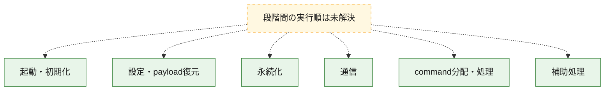
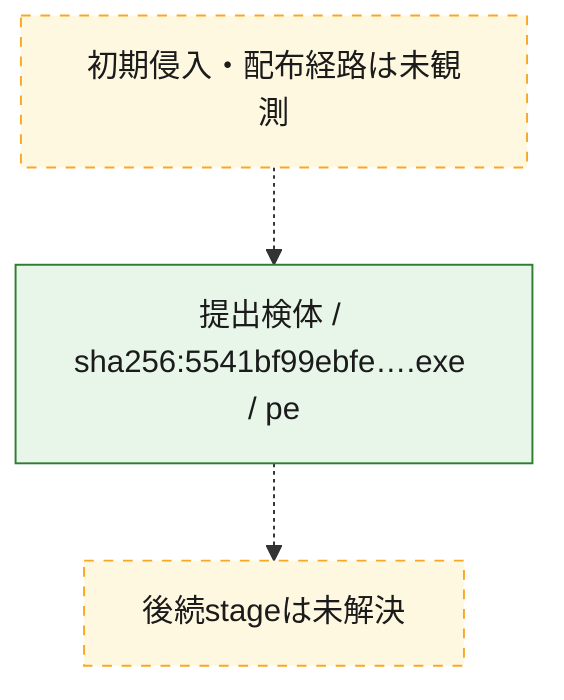
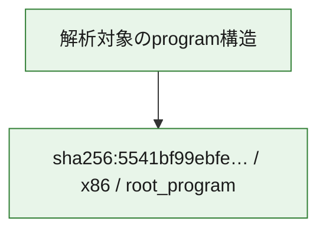

# 全体ロジック：5541bf99ebfee0f4c9ab33624b49e125348bf02280b9efbb8824919f53c8630c

代表関数の静的証跡から、起動・初期化、設定・payload復元、永続化、通信、command分配・処理の処理群を確認しました。

## 読み方

- phaseの掲載順は解析上の整理順です。observed_call_edgesがない段階間の実行順を断定しません。
- 図の実線は静的に観測した関係、点線と黄色のノードは未観測・未解決の関係を示します。
- 図は静的な要約であり、動的実行を再現するものではありません。
- 詳細な関数解説とfingerprintは[STATIC-LOGIC.md](STATIC-LOGIC.md)を参照してください。

## 静的可視化

### 実行フロー

### 感染チェーン

### モジュール関係

## 処理段階

### 1. 起動・初期化

entry pointから初期化と後続処理への移行を確認します。
確度: `confirmed_static_function_evidence`

- `5541bf99ebfee0f4c9ab33624b49e125348bf02280b9efbb8824919f53c8630c:ghidra:140075d90` — 初期化と主要処理への分岐を行う入口関数です。 状態: `succeeded`、選定理由: `call_graph_centrality:in=0,out=4`, `entry_point`, `meaningful_symbol_name`, `reviewed_call_centrality:4`, `reviewed_call_centrality:5`, `role:entrypoint`

### 2. 設定・payload復元

設定、resource、payload、暗号化データの復元・変換を確認します。
確度: `confirmed_static_function_evidence_with_limits`

- `5541bf99ebfee0f4c9ab33624b49e125348bf02280b9efbb8824919f53c8630c:ghidra:140075d00` — 暗号、hash、encoding、または復号処理に関係する関数です。 状態: `failed`、選定理由: `entry_point`, `meaningful_symbol_name`, `role:cryptographic_transform`
- `5541bf99ebfee0f4c9ab33624b49e125348bf02280b9efbb8824919f53c8630c:ghidra:140075d30` — 暗号、hash、encoding、または復号処理に関係する関数です。 状態: `failed`、選定理由: `entry_point`, `meaningful_symbol_name`, `role:cryptographic_transform`
- `5541bf99ebfee0f4c9ab33624b49e125348bf02280b9efbb8824919f53c8630c:ghidra:140075d50` — 暗号、hash、encoding、または復号処理に関係する関数です。 状態: `succeeded`、選定理由: `entry_point`, `meaningful_symbol_name`, `role:cryptographic_transform`
- `5541bf99ebfee0f4c9ab33624b49e125348bf02280b9efbb8824919f53c8630c:ghidra:140075d80` — 暗号、hash、encoding、または復号処理に関係する関数です。 状態: `succeeded`、選定理由: `entry_point`, `meaningful_symbol_name`, `role:cryptographic_transform`
- `5541bf99ebfee0f4c9ab33624b49e125348bf02280b9efbb8824919f53c8630c:ghidra:140075de0` — 設定、resource、payloadなどの解析・変換を行う関数です。 状態: `failed`、選定理由: `entry_point`, `meaningful_symbol_name`, `role:config_or_data_transform`
- `5541bf99ebfee0f4c9ab33624b49e125348bf02280b9efbb8824919f53c8630c:ghidra:140075df0` — 設定、resource、payloadなどの解析・変換を行う関数です。 状態: `failed`、選定理由: `entry_point`, `meaningful_symbol_name`, `role:config_or_data_transform`
- `5541bf99ebfee0f4c9ab33624b49e125348bf02280b9efbb8824919f53c8630c:ghidra:140075e40` — 暗号、hash、encoding、または復号処理に関係する関数です。 状態: `succeeded`、選定理由: `entry_point`, `meaningful_symbol_name`, `role:cryptographic_transform`
- `5541bf99ebfee0f4c9ab33624b49e125348bf02280b9efbb8824919f53c8630c:ghidra:140075e50` — 設定、resource、payloadなどの解析・変換を行う関数です。 状態: `failed`、選定理由: `entry_point`, `meaningful_symbol_name`, `role:config_or_data_transform`

### 3. 永続化

自動起動や永続化に関係する設定変更を確認します。
確度: `confirmed_static_function_evidence`

- `5541bf99ebfee0f4c9ab33624b49e125348bf02280b9efbb8824919f53c8630c:ghidra:140075d70` — 自動起動または永続化に関係する処理を含む関数です。 状態: `succeeded`、選定理由: `entry_point`, `meaningful_symbol_name`, `role:persistence`
- `5541bf99ebfee0f4c9ab33624b49e125348bf02280b9efbb8824919f53c8630c:ghidra:140075e30` — 自動起動または永続化に関係する処理を含む関数です。 状態: `succeeded`、選定理由: `entry_point`, `meaningful_symbol_name`, `role:persistence`

### 4. 通信

通信初期化、endpoint処理、送受信の役割を確認します。
確度: `confirmed_static_function_evidence_with_limits`

- `5541bf99ebfee0f4c9ab33624b49e125348bf02280b9efbb8824919f53c8630c:ghidra:140075d10` — 通信初期化、送受信、またはendpoint処理に関係する関数です。 状態: `failed`、選定理由: `entry_point`, `meaningful_symbol_name`, `role:network_communication`
- `5541bf99ebfee0f4c9ab33624b49e125348bf02280b9efbb8824919f53c8630c:ghidra:140075e00` — 通信初期化、送受信、またはendpoint処理に関係する関数です。 状態: `succeeded`、選定理由: `entry_point`, `meaningful_symbol_name`, `role:network_communication`

### 5. command分配・処理

受信commandやtaskの解釈、分配、個別handlerへの移行を確認します。
確度: `confirmed_static_function_evidence`

- `5541bf99ebfee0f4c9ab33624b49e125348bf02280b9efbb8824919f53c8630c:ghidra:140075d20` — commandの解釈、分配、または個別処理を担当する関数です。 状態: `succeeded`、選定理由: `entry_point`, `meaningful_symbol_name`, `role:command_dispatch_or_handler`
- `5541bf99ebfee0f4c9ab33624b49e125348bf02280b9efbb8824919f53c8630c:ghidra:140075e70` — commandの解釈、分配、または個別処理を担当する関数です。 状態: `succeeded`、選定理由: `entry_point`, `meaningful_symbol_name`, `role:command_dispatch_or_handler`

### 6. 補助処理

主要処理を支える一般内部関数またはlibrary処理を確認します。
確度: `confirmed_static_function_evidence_with_limits`

- `5541bf99ebfee0f4c9ab33624b49e125348bf02280b9efbb8824919f53c8630c:ghidra:140072110` — 検体内部の一般処理を実装する関数です。 状態: `succeeded`、選定理由: `call_graph_centrality:in=1,out=1`, `large_function:instructions=1220`, `reviewed_call_centrality:2`, `reviewed_call_centrality:3`
- `5541bf99ebfee0f4c9ab33624b49e125348bf02280b9efbb8824919f53c8630c:ghidra:140073350` — 検体内部の一般処理を実装する関数です。 状態: `succeeded`、選定理由: `call_graph_centrality:in=1,out=0`, `large_function:instructions=442`, `reviewed_call_centrality:1`
- `5541bf99ebfee0f4c9ab33624b49e125348bf02280b9efbb8824919f53c8630c:ghidra:1400739f0` — 検体内部の一般処理を実装する関数です。 状態: `succeeded`、選定理由: `call_graph_centrality:in=2,out=0`, `large_function:instructions=160`, `reviewed_call_centrality:2`
- `5541bf99ebfee0f4c9ab33624b49e125348bf02280b9efbb8824919f53c8630c:ghidra:140073be0` — 検体内部の一般処理を実装する関数です。 状態: `succeeded`、選定理由: `call_graph_centrality:in=1,out=9`, `large_function:instructions=939`, `reviewed_call_centrality:10`, `reviewed_call_centrality:11`
- `5541bf99ebfee0f4c9ab33624b49e125348bf02280b9efbb8824919f53c8630c:ghidra:140074a20` — 検体内部の一般処理を実装する関数です。 状態: `succeeded`、選定理由: `call_graph_centrality:in=1,out=0`, `large_function:instructions=260`, `reviewed_call_centrality:1`
- `5541bf99ebfee0f4c9ab33624b49e125348bf02280b9efbb8824919f53c8630c:ghidra:140074f90` — 検体内部の一般処理を実装する関数です。 状態: `succeeded`、選定理由: `call_graph_centrality:in=1,out=1`, `large_function:instructions=631`, `reviewed_call_centrality:2`
- `5541bf99ebfee0f4c9ab33624b49e125348bf02280b9efbb8824919f53c8630c:ghidra:1400758c0` — 検体内部の一般処理を実装する関数です。 状態: `succeeded`、選定理由: `call_graph_centrality:in=1,out=2`, `large_function:instructions=293`, `reviewed_call_centrality:3`, `reviewed_call_centrality:6`
- `5541bf99ebfee0f4c9ab33624b49e125348bf02280b9efbb8824919f53c8630c:ghidra:140075d40` — 検体内部の一般処理を実装する関数です。 状態: `succeeded`、選定理由: `entry_point`, `meaningful_symbol_name`
- `5541bf99ebfee0f4c9ab33624b49e125348bf02280b9efbb8824919f53c8630c:ghidra:140075d60` — 検体内部の一般処理を実装する関数です。 状態: `succeeded`、選定理由: `entry_point`, `meaningful_symbol_name`
- `5541bf99ebfee0f4c9ab33624b49e125348bf02280b9efbb8824919f53c8630c:ghidra:140075e10` — 検体内部の一般処理を実装する関数です。 状態: `succeeded`、選定理由: `entry_point`, `meaningful_symbol_name`
- `5541bf99ebfee0f4c9ab33624b49e125348bf02280b9efbb8824919f53c8630c:ghidra:140075e20` — 検体内部の一般処理を実装する関数です。 状態: `failed`、選定理由: `entry_point`, `meaningful_symbol_name`
- `5541bf99ebfee0f4c9ab33624b49e125348bf02280b9efbb8824919f53c8630c:ghidra:140075e60` — 検体内部の一般処理を実装する関数です。 状態: `succeeded`、選定理由: `entry_point`, `meaningful_symbol_name`
- `5541bf99ebfee0f4c9ab33624b49e125348bf02280b9efbb8824919f53c8630c:ghidra:140075fb0` — 検体内部の一般処理を実装する関数です。 状態: `succeeded`、選定理由: `call_graph_centrality:in=7,out=0`, `reviewed_call_centrality:7`
- `5541bf99ebfee0f4c9ab33624b49e125348bf02280b9efbb8824919f53c8630c:ghidra:140076050` — 検体内部の一般処理を実装する関数です。 状態: `succeeded`、選定理由: `call_graph_centrality:in=7,out=2`, `reviewed_call_centrality:9`
- `5541bf99ebfee0f4c9ab33624b49e125348bf02280b9efbb8824919f53c8630c:ghidra:140076410` — 検体内部の一般処理を実装する関数です。 状態: `succeeded`、選定理由: `call_graph_centrality:in=1,out=5`, `reviewed_call_centrality:6`
- `5541bf99ebfee0f4c9ab33624b49e125348bf02280b9efbb8824919f53c8630c:ghidra:1400764d0` — 検体内部の一般処理を実装する関数です。 状態: `succeeded`、選定理由: `call_graph_centrality:in=1,out=4`, `large_function:instructions=161`, `reviewed_call_centrality:5`
- `5541bf99ebfee0f4c9ab33624b49e125348bf02280b9efbb8824919f53c8630c:ghidra:140076710` — 検体内部の一般処理を実装する関数です。 状態: `succeeded`、選定理由: `call_graph_centrality:in=1,out=6`, `large_function:instructions=419`, `reviewed_call_centrality:7`

## 観測したcall関係

- 代表関数間で直接解決できた呼出関係はありません。

## 解析範囲と制約

- 選定外関数は全体inventoryへ残しますが、関数本体の個別解説対象にはしていません。
- indirect call、難読化、packer、VM、壊れたcontrol flowによりcall関係が欠落する場合があります。
- 文書は静的解析に基づき、検体実行や外部通信による動的確認は行っていません。
