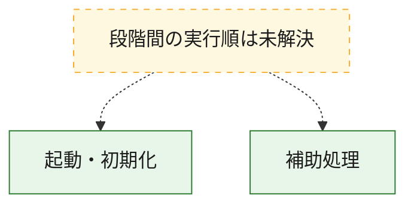
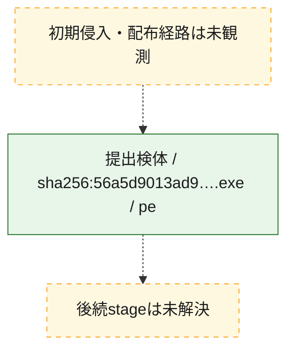
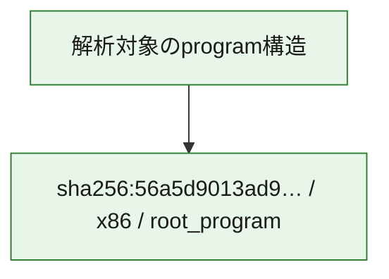

# 全体ロジック：56a5d9013ad9c47137c9e879a93636914cb52e625fc926d97c0069342168cbb3

代表関数の静的証跡から、起動・初期化の処理群を確認しました。

## 読み方

- phaseの掲載順は解析上の整理順です。observed_call_edgesがない段階間の実行順を断定しません。
- 図の実線は静的に観測した関係、点線と黄色のノードは未観測・未解決の関係を示します。
- 図は静的な要約であり、動的実行を再現するものではありません。
- 詳細な関数解説とfingerprintは[STATIC-LOGIC.md](STATIC-LOGIC.md)を参照してください。

## 静的可視化

### 実行フロー

### 感染チェーン

### モジュール関係

## 処理段階

### 1. 起動・初期化

entry pointから初期化と後続処理への移行を確認します。
確度: `confirmed_static_function_evidence`

- `56a5d9013ad9c47137c9e879a93636914cb52e625fc926d97c0069342168cbb3:ghidra:48013dbd0` — 初期化と主要処理への分岐を行う入口関数です。 状態: `succeeded`、選定理由: `entry_point`, `meaningful_symbol_name`, `reviewed_call_centrality:9`, `role:entrypoint`

### 2. 補助処理

主要処理を支える一般内部関数またはlibrary処理を確認します。
確度: `confirmed_static_function_evidence`

- `56a5d9013ad9c47137c9e879a93636914cb52e625fc926d97c0069342168cbb3:ghidra:480001048` — 検体内部の一般処理を実装する関数です。 状態: `succeeded`、選定理由: `context_representative`
- `56a5d9013ad9c47137c9e879a93636914cb52e625fc926d97c0069342168cbb3:ghidra:4800010a4` — 検体内部の一般処理を実装する関数です。 状態: `succeeded`、選定理由: `context_representative`
- `56a5d9013ad9c47137c9e879a93636914cb52e625fc926d97c0069342168cbb3:ghidra:480001104` — 検体内部の一般処理を実装する関数です。 状態: `succeeded`、選定理由: `context_representative`, `reviewed_call_centrality:9`
- `56a5d9013ad9c47137c9e879a93636914cb52e625fc926d97c0069342168cbb3:ghidra:4800011ec` — 検体内部の一般処理を実装する関数です。 状態: `succeeded`、選定理由: `context_representative`
- `56a5d9013ad9c47137c9e879a93636914cb52e625fc926d97c0069342168cbb3:ghidra:480001318` — 検体内部の一般処理を実装する関数です。 状態: `succeeded`、選定理由: `context_representative`, `reviewed_call_centrality:4`
- `56a5d9013ad9c47137c9e879a93636914cb52e625fc926d97c0069342168cbb3:ghidra:4800014ac` — 検体内部の一般処理を実装する関数です。 状態: `succeeded`、選定理由: `context_representative`, `reviewed_call_centrality:10`
- `56a5d9013ad9c47137c9e879a93636914cb52e625fc926d97c0069342168cbb3:ghidra:48000164c` — 検体内部の一般処理を実装する関数です。 状態: `succeeded`、選定理由: `context_representative`, `reviewed_call_centrality:2`
- `56a5d9013ad9c47137c9e879a93636914cb52e625fc926d97c0069342168cbb3:ghidra:48000181c` — 検体内部の一般処理を実装する関数です。 状態: `succeeded`、選定理由: `context_representative`, `reviewed_call_centrality:6`
- `56a5d9013ad9c47137c9e879a93636914cb52e625fc926d97c0069342168cbb3:ghidra:480001984` — 検体内部の一般処理を実装する関数です。 状態: `succeeded`、選定理由: `context_representative`, `reviewed_call_centrality:10`
- `56a5d9013ad9c47137c9e879a93636914cb52e625fc926d97c0069342168cbb3:ghidra:480001c74` — 検体内部の一般処理を実装する関数です。 状態: `succeeded`、選定理由: `context_representative`, `reviewed_call_centrality:3`
- `56a5d9013ad9c47137c9e879a93636914cb52e625fc926d97c0069342168cbb3:ghidra:480001d9c` — 検体内部の一般処理を実装する関数です。 状態: `succeeded`、選定理由: `context_representative`, `reviewed_call_centrality:3`
- `56a5d9013ad9c47137c9e879a93636914cb52e625fc926d97c0069342168cbb3:ghidra:480001ff4` — 検体内部の一般処理を実装する関数です。 状態: `succeeded`、選定理由: `context_representative`, `reviewed_call_centrality:11`
- `56a5d9013ad9c47137c9e879a93636914cb52e625fc926d97c0069342168cbb3:ghidra:48000238c` — 検体内部の一般処理を実装する関数です。 状態: `succeeded`、選定理由: `context_representative`, `reviewed_call_centrality:6`
- `56a5d9013ad9c47137c9e879a93636914cb52e625fc926d97c0069342168cbb3:ghidra:4800025a8` — 検体内部の一般処理を実装する関数です。 状態: `succeeded`、選定理由: `context_representative`, `reviewed_call_centrality:3`
- `56a5d9013ad9c47137c9e879a93636914cb52e625fc926d97c0069342168cbb3:ghidra:48000276c` — 検体内部の一般処理を実装する関数です。 状態: `succeeded`、選定理由: `context_representative`, `reviewed_call_centrality:12`
- `56a5d9013ad9c47137c9e879a93636914cb52e625fc926d97c0069342168cbb3:ghidra:480002900` — 検体内部の一般処理を実装する関数です。 状態: `succeeded`、選定理由: `context_representative`, `reviewed_call_centrality:3`
- `56a5d9013ad9c47137c9e879a93636914cb52e625fc926d97c0069342168cbb3:ghidra:4800029c0` — 検体内部の一般処理を実装する関数です。 状態: `succeeded`、選定理由: `context_representative`, `reviewed_call_centrality:2`
- `56a5d9013ad9c47137c9e879a93636914cb52e625fc926d97c0069342168cbb3:ghidra:480002a30` — 検体内部の一般処理を実装する関数です。 状態: `succeeded`、選定理由: `context_representative`
- `56a5d9013ad9c47137c9e879a93636914cb52e625fc926d97c0069342168cbb3:ghidra:480002a58` — 検体内部の一般処理を実装する関数です。 状態: `succeeded`、選定理由: `context_representative`
- `56a5d9013ad9c47137c9e879a93636914cb52e625fc926d97c0069342168cbb3:ghidra:480002b00` — 検体内部の一般処理を実装する関数です。 状態: `succeeded`、選定理由: `context_representative`, `reviewed_call_centrality:4`
- `56a5d9013ad9c47137c9e879a93636914cb52e625fc926d97c0069342168cbb3:ghidra:480002cd0` — 検体内部の一般処理を実装する関数です。 状態: `succeeded`、選定理由: `context_representative`, `reviewed_call_centrality:3`
- `56a5d9013ad9c47137c9e879a93636914cb52e625fc926d97c0069342168cbb3:ghidra:480002d88` — 検体内部の一般処理を実装する関数です。 状態: `succeeded`、選定理由: `context_representative`, `reviewed_call_centrality:2`
- `56a5d9013ad9c47137c9e879a93636914cb52e625fc926d97c0069342168cbb3:ghidra:480002e18` — 検体内部の一般処理を実装する関数です。 状態: `succeeded`、選定理由: `context_representative`, `reviewed_call_centrality:2`
- `56a5d9013ad9c47137c9e879a93636914cb52e625fc926d97c0069342168cbb3:ghidra:480002ec0` — 検体内部の一般処理を実装する関数です。 状態: `succeeded`、選定理由: `context_representative`, `reviewed_call_centrality:2`
- `56a5d9013ad9c47137c9e879a93636914cb52e625fc926d97c0069342168cbb3:ghidra:480002f90` — 検体内部の一般処理を実装する関数です。 状態: `succeeded`、選定理由: `context_representative`, `reviewed_call_centrality:2`
- `56a5d9013ad9c47137c9e879a93636914cb52e625fc926d97c0069342168cbb3:ghidra:480003098` — 検体内部の一般処理を実装する関数です。 状態: `succeeded`、選定理由: `context_representative`, `reviewed_call_centrality:11`
- `56a5d9013ad9c47137c9e879a93636914cb52e625fc926d97c0069342168cbb3:ghidra:4800034f0` — 検体内部の一般処理を実装する関数です。 状態: `succeeded`、選定理由: `context_representative`, `reviewed_call_centrality:12`
- `56a5d9013ad9c47137c9e879a93636914cb52e625fc926d97c0069342168cbb3:ghidra:480003908` — 検体内部の一般処理を実装する関数です。 状態: `succeeded`、選定理由: `context_representative`, `reviewed_call_centrality:3`
- `56a5d9013ad9c47137c9e879a93636914cb52e625fc926d97c0069342168cbb3:ghidra:480003970` — 検体内部の一般処理を実装する関数です。 状態: `succeeded`、選定理由: `context_representative`, `reviewed_call_centrality:2`
- `56a5d9013ad9c47137c9e879a93636914cb52e625fc926d97c0069342168cbb3:ghidra:480003a90` — 検体内部の一般処理を実装する関数です。 状態: `succeeded`、選定理由: `context_representative`, `reviewed_call_centrality:17`
- `56a5d9013ad9c47137c9e879a93636914cb52e625fc926d97c0069342168cbb3:ghidra:480003fd4` — 検体内部の一般処理を実装する関数です。 状態: `succeeded`、選定理由: `context_representative`, `reviewed_call_centrality:16`

## 観測したcall関係

- `56a5d9013ad9c47137c9e879a93636914cb52e625fc926d97c0069342168cbb3:ghidra:48000164c` → `56a5d9013ad9c47137c9e879a93636914cb52e625fc926d97c0069342168cbb3:ghidra:480001104` （`support` → `support`）
- `56a5d9013ad9c47137c9e879a93636914cb52e625fc926d97c0069342168cbb3:ghidra:480001984` → `56a5d9013ad9c47137c9e879a93636914cb52e625fc926d97c0069342168cbb3:ghidra:480001104` （`support` → `support`）
- `56a5d9013ad9c47137c9e879a93636914cb52e625fc926d97c0069342168cbb3:ghidra:480001984` → `56a5d9013ad9c47137c9e879a93636914cb52e625fc926d97c0069342168cbb3:ghidra:480001318` （`support` → `support`）
- `56a5d9013ad9c47137c9e879a93636914cb52e625fc926d97c0069342168cbb3:ghidra:480001984` → `56a5d9013ad9c47137c9e879a93636914cb52e625fc926d97c0069342168cbb3:ghidra:4800014ac` （`support` → `support`）
- `56a5d9013ad9c47137c9e879a93636914cb52e625fc926d97c0069342168cbb3:ghidra:480001984` → `56a5d9013ad9c47137c9e879a93636914cb52e625fc926d97c0069342168cbb3:ghidra:48000181c` （`support` → `support`）
- `56a5d9013ad9c47137c9e879a93636914cb52e625fc926d97c0069342168cbb3:ghidra:480001984` → `56a5d9013ad9c47137c9e879a93636914cb52e625fc926d97c0069342168cbb3:ghidra:48000276c` （`support` → `support`）
- `56a5d9013ad9c47137c9e879a93636914cb52e625fc926d97c0069342168cbb3:ghidra:480001984` → `56a5d9013ad9c47137c9e879a93636914cb52e625fc926d97c0069342168cbb3:ghidra:480002900` （`support` → `support`）
- `56a5d9013ad9c47137c9e879a93636914cb52e625fc926d97c0069342168cbb3:ghidra:480001984` → `56a5d9013ad9c47137c9e879a93636914cb52e625fc926d97c0069342168cbb3:ghidra:4800029c0` （`support` → `support`）
- `56a5d9013ad9c47137c9e879a93636914cb52e625fc926d97c0069342168cbb3:ghidra:480001984` → `56a5d9013ad9c47137c9e879a93636914cb52e625fc926d97c0069342168cbb3:ghidra:480002b00` （`support` → `support`）
- `56a5d9013ad9c47137c9e879a93636914cb52e625fc926d97c0069342168cbb3:ghidra:480001c74` → `56a5d9013ad9c47137c9e879a93636914cb52e625fc926d97c0069342168cbb3:ghidra:480001104` （`support` → `support`）
- `56a5d9013ad9c47137c9e879a93636914cb52e625fc926d97c0069342168cbb3:ghidra:480001c74` → `56a5d9013ad9c47137c9e879a93636914cb52e625fc926d97c0069342168cbb3:ghidra:48000181c` （`support` → `support`）
- `56a5d9013ad9c47137c9e879a93636914cb52e625fc926d97c0069342168cbb3:ghidra:480001d9c` → `56a5d9013ad9c47137c9e879a93636914cb52e625fc926d97c0069342168cbb3:ghidra:480001104` （`support` → `support`）
- `56a5d9013ad9c47137c9e879a93636914cb52e625fc926d97c0069342168cbb3:ghidra:480001d9c` → `56a5d9013ad9c47137c9e879a93636914cb52e625fc926d97c0069342168cbb3:ghidra:48000181c` （`support` → `support`）
- `56a5d9013ad9c47137c9e879a93636914cb52e625fc926d97c0069342168cbb3:ghidra:480001ff4` → `56a5d9013ad9c47137c9e879a93636914cb52e625fc926d97c0069342168cbb3:ghidra:480001104` （`support` → `support`）
- `56a5d9013ad9c47137c9e879a93636914cb52e625fc926d97c0069342168cbb3:ghidra:480001ff4` → `56a5d9013ad9c47137c9e879a93636914cb52e625fc926d97c0069342168cbb3:ghidra:480001318` （`support` → `support`）
- `56a5d9013ad9c47137c9e879a93636914cb52e625fc926d97c0069342168cbb3:ghidra:480001ff4` → `56a5d9013ad9c47137c9e879a93636914cb52e625fc926d97c0069342168cbb3:ghidra:4800014ac` （`support` → `support`）
- `56a5d9013ad9c47137c9e879a93636914cb52e625fc926d97c0069342168cbb3:ghidra:480001ff4` → `56a5d9013ad9c47137c9e879a93636914cb52e625fc926d97c0069342168cbb3:ghidra:48000181c` （`support` → `support`）
- `56a5d9013ad9c47137c9e879a93636914cb52e625fc926d97c0069342168cbb3:ghidra:480001ff4` → `56a5d9013ad9c47137c9e879a93636914cb52e625fc926d97c0069342168cbb3:ghidra:4800025a8` （`support` → `support`）
- `56a5d9013ad9c47137c9e879a93636914cb52e625fc926d97c0069342168cbb3:ghidra:480001ff4` → `56a5d9013ad9c47137c9e879a93636914cb52e625fc926d97c0069342168cbb3:ghidra:48000276c` （`support` → `support`）
- `56a5d9013ad9c47137c9e879a93636914cb52e625fc926d97c0069342168cbb3:ghidra:480001ff4` → `56a5d9013ad9c47137c9e879a93636914cb52e625fc926d97c0069342168cbb3:ghidra:480002900` （`support` → `support`）
- `56a5d9013ad9c47137c9e879a93636914cb52e625fc926d97c0069342168cbb3:ghidra:480001ff4` → `56a5d9013ad9c47137c9e879a93636914cb52e625fc926d97c0069342168cbb3:ghidra:4800029c0` （`support` → `support`）
- `56a5d9013ad9c47137c9e879a93636914cb52e625fc926d97c0069342168cbb3:ghidra:480001ff4` → `56a5d9013ad9c47137c9e879a93636914cb52e625fc926d97c0069342168cbb3:ghidra:480002b00` （`support` → `support`）
- `56a5d9013ad9c47137c9e879a93636914cb52e625fc926d97c0069342168cbb3:ghidra:48000238c` → `56a5d9013ad9c47137c9e879a93636914cb52e625fc926d97c0069342168cbb3:ghidra:480001104` （`support` → `support`）
- `56a5d9013ad9c47137c9e879a93636914cb52e625fc926d97c0069342168cbb3:ghidra:48000238c` → `56a5d9013ad9c47137c9e879a93636914cb52e625fc926d97c0069342168cbb3:ghidra:4800014ac` （`support` → `support`）
- `56a5d9013ad9c47137c9e879a93636914cb52e625fc926d97c0069342168cbb3:ghidra:48000238c` → `56a5d9013ad9c47137c9e879a93636914cb52e625fc926d97c0069342168cbb3:ghidra:48000181c` （`support` → `support`）
- `56a5d9013ad9c47137c9e879a93636914cb52e625fc926d97c0069342168cbb3:ghidra:48000238c` → `56a5d9013ad9c47137c9e879a93636914cb52e625fc926d97c0069342168cbb3:ghidra:4800025a8` （`support` → `support`）
- `56a5d9013ad9c47137c9e879a93636914cb52e625fc926d97c0069342168cbb3:ghidra:4800025a8` → `56a5d9013ad9c47137c9e879a93636914cb52e625fc926d97c0069342168cbb3:ghidra:480001104` （`support` → `support`）
- `56a5d9013ad9c47137c9e879a93636914cb52e625fc926d97c0069342168cbb3:ghidra:48000276c` → `56a5d9013ad9c47137c9e879a93636914cb52e625fc926d97c0069342168cbb3:ghidra:480001984` （`support` → `support`）
- `56a5d9013ad9c47137c9e879a93636914cb52e625fc926d97c0069342168cbb3:ghidra:48000276c` → `56a5d9013ad9c47137c9e879a93636914cb52e625fc926d97c0069342168cbb3:ghidra:480001c74` （`support` → `support`）
- `56a5d9013ad9c47137c9e879a93636914cb52e625fc926d97c0069342168cbb3:ghidra:48000276c` → `56a5d9013ad9c47137c9e879a93636914cb52e625fc926d97c0069342168cbb3:ghidra:480001d9c` （`support` → `support`）
- `56a5d9013ad9c47137c9e879a93636914cb52e625fc926d97c0069342168cbb3:ghidra:48000276c` → `56a5d9013ad9c47137c9e879a93636914cb52e625fc926d97c0069342168cbb3:ghidra:480001ff4` （`support` → `support`）
- `56a5d9013ad9c47137c9e879a93636914cb52e625fc926d97c0069342168cbb3:ghidra:48000276c` → `56a5d9013ad9c47137c9e879a93636914cb52e625fc926d97c0069342168cbb3:ghidra:48000238c` （`support` → `support`）
- `56a5d9013ad9c47137c9e879a93636914cb52e625fc926d97c0069342168cbb3:ghidra:48000276c` → `56a5d9013ad9c47137c9e879a93636914cb52e625fc926d97c0069342168cbb3:ghidra:480002900` （`support` → `support`）
- `56a5d9013ad9c47137c9e879a93636914cb52e625fc926d97c0069342168cbb3:ghidra:480002b00` → `56a5d9013ad9c47137c9e879a93636914cb52e625fc926d97c0069342168cbb3:ghidra:4800014ac` （`support` → `support`）
- `56a5d9013ad9c47137c9e879a93636914cb52e625fc926d97c0069342168cbb3:ghidra:480002d88` → `56a5d9013ad9c47137c9e879a93636914cb52e625fc926d97c0069342168cbb3:ghidra:480002cd0` （`support` → `support`）
- `56a5d9013ad9c47137c9e879a93636914cb52e625fc926d97c0069342168cbb3:ghidra:480002e18` → `56a5d9013ad9c47137c9e879a93636914cb52e625fc926d97c0069342168cbb3:ghidra:480002cd0` （`support` → `support`）
- `56a5d9013ad9c47137c9e879a93636914cb52e625fc926d97c0069342168cbb3:ghidra:480002ec0` → `56a5d9013ad9c47137c9e879a93636914cb52e625fc926d97c0069342168cbb3:ghidra:480002e18` （`support` → `support`）
- `56a5d9013ad9c47137c9e879a93636914cb52e625fc926d97c0069342168cbb3:ghidra:480002f90` → `56a5d9013ad9c47137c9e879a93636914cb52e625fc926d97c0069342168cbb3:ghidra:48000276c` （`support` → `support`）
- `56a5d9013ad9c47137c9e879a93636914cb52e625fc926d97c0069342168cbb3:ghidra:480003098` → `56a5d9013ad9c47137c9e879a93636914cb52e625fc926d97c0069342168cbb3:ghidra:4800014ac` （`support` → `support`）
- `56a5d9013ad9c47137c9e879a93636914cb52e625fc926d97c0069342168cbb3:ghidra:480003098` → `56a5d9013ad9c47137c9e879a93636914cb52e625fc926d97c0069342168cbb3:ghidra:480003908` （`support` → `support`）
- `56a5d9013ad9c47137c9e879a93636914cb52e625fc926d97c0069342168cbb3:ghidra:480003098` → `56a5d9013ad9c47137c9e879a93636914cb52e625fc926d97c0069342168cbb3:ghidra:480003970` （`support` → `support`）
- `56a5d9013ad9c47137c9e879a93636914cb52e625fc926d97c0069342168cbb3:ghidra:4800034f0` → `56a5d9013ad9c47137c9e879a93636914cb52e625fc926d97c0069342168cbb3:ghidra:480001104` （`support` → `support`）
- `56a5d9013ad9c47137c9e879a93636914cb52e625fc926d97c0069342168cbb3:ghidra:4800034f0` → `56a5d9013ad9c47137c9e879a93636914cb52e625fc926d97c0069342168cbb3:ghidra:4800014ac` （`support` → `support`）
- `56a5d9013ad9c47137c9e879a93636914cb52e625fc926d97c0069342168cbb3:ghidra:4800034f0` → `56a5d9013ad9c47137c9e879a93636914cb52e625fc926d97c0069342168cbb3:ghidra:480003908` （`support` → `support`）
- `56a5d9013ad9c47137c9e879a93636914cb52e625fc926d97c0069342168cbb3:ghidra:480003970` → `56a5d9013ad9c47137c9e879a93636914cb52e625fc926d97c0069342168cbb3:ghidra:480003908` （`support` → `support`）
- `56a5d9013ad9c47137c9e879a93636914cb52e625fc926d97c0069342168cbb3:ghidra:480003a90` → `56a5d9013ad9c47137c9e879a93636914cb52e625fc926d97c0069342168cbb3:ghidra:480001318` （`support` → `support`）
- `56a5d9013ad9c47137c9e879a93636914cb52e625fc926d97c0069342168cbb3:ghidra:480003a90` → `56a5d9013ad9c47137c9e879a93636914cb52e625fc926d97c0069342168cbb3:ghidra:4800014ac` （`support` → `support`）
- `56a5d9013ad9c47137c9e879a93636914cb52e625fc926d97c0069342168cbb3:ghidra:480003fd4` → `56a5d9013ad9c47137c9e879a93636914cb52e625fc926d97c0069342168cbb3:ghidra:480003098` （`support` → `support`）
- `ghidra-function:05d7543e71fea9fb084bb277` → `ghidra-external:080fb1d2b9af2a64ae915bea` （`unclassified` → `unclassified`）
- `ghidra-function:05d7543e71fea9fb084bb277` → `ghidra-function:664cacf62821a45b34a82bc6` （`unclassified` → `unclassified`）
- `ghidra-function:11a6ec54c7d2e46de6ec12ee` → `ghidra-function:664cacf62821a45b34a82bc6` （`unclassified` → `unclassified`）
- `ghidra-function:11a6ec54c7d2e46de6ec12ee` → `ghidra-function:a55767f0d7ae2e595615ba68` （`unclassified` → `unclassified`）
- `ghidra-function:1fd21dff9fe913b258380be5` → `ghidra-function:19852a4f2aa84febbbd5fd73` （`unclassified` → `unclassified`）
- `ghidra-function:33d97d7ef598fb449c9a1ba7` → `ghidra-external:2e74db736c3ad4c413812fd9` （`unclassified` → `unclassified`）
- `ghidra-function:33d97d7ef598fb449c9a1ba7` → `ghidra-function:51449437c3b21a8699ee1fee` （`unclassified` → `unclassified`）
- `ghidra-function:33d97d7ef598fb449c9a1ba7` → `ghidra-function:5714b3c665395d0aec988456` （`unclassified` → `unclassified`）
- `ghidra-function:33d97d7ef598fb449c9a1ba7` → `ghidra-function:664cacf62821a45b34a82bc6` （`unclassified` → `unclassified`）
- `ghidra-function:33d97d7ef598fb449c9a1ba7` → `ghidra-function:84cae299d3bbb73126dd78ae` （`unclassified` → `unclassified`）
- `ghidra-function:33d97d7ef598fb449c9a1ba7` → `ghidra-function:8c42dd6f546b5fd7452b3880` （`unclassified` → `unclassified`）
- `ghidra-function:33d97d7ef598fb449c9a1ba7` → `ghidra-function:a55767f0d7ae2e595615ba68` （`unclassified` → `unclassified`）
- `ghidra-function:33d97d7ef598fb449c9a1ba7` → `ghidra-function:ba8e783df18429d86e0dee46` （`unclassified` → `unclassified`）
- `ghidra-function:33d97d7ef598fb449c9a1ba7` → `ghidra-function:ca2330aab28cad47c7309fe4` （`unclassified` → `unclassified`）
- `ghidra-function:33d97d7ef598fb449c9a1ba7` → `ghidra-function:f2b1aaf758aaaefa598dd525` （`unclassified` → `unclassified`）
- `ghidra-function:424bef955a94024a4a3866b4` → `ghidra-external:88015541af55116ddfb2b950` （`unclassified` → `unclassified`）
- `ghidra-function:424bef955a94024a4a3866b4` → `ghidra-external:b22d62cfbe2465f243711043` （`unclassified` → `unclassified`）
- `ghidra-function:424bef955a94024a4a3866b4` → `ghidra-function:03100a5642c25f723c30e114` （`unclassified` → `unclassified`）
- `ghidra-function:424bef955a94024a4a3866b4` → `ghidra-function:065f33bca728e5863f3c5982` （`unclassified` → `unclassified`）
- `ghidra-function:424bef955a94024a4a3866b4` → `ghidra-function:3097cf72f60530b2790d86d0` （`unclassified` → `unclassified`）
- `ghidra-function:424bef955a94024a4a3866b4` → `ghidra-function:4c0fb45ecf8174fb51902bb6` （`unclassified` → `unclassified`）
- `ghidra-function:424bef955a94024a4a3866b4` → `ghidra-function:5714b3c665395d0aec988456` （`unclassified` → `unclassified`）
- `ghidra-function:424bef955a94024a4a3866b4` → `ghidra-function:664cacf62821a45b34a82bc6` （`unclassified` → `unclassified`）
- `ghidra-function:424bef955a94024a4a3866b4` → `ghidra-function:8dd863aceccfb1e86ed9a854` （`unclassified` → `unclassified`）
- `ghidra-function:424bef955a94024a4a3866b4` → `ghidra-function:a9df6eb93b601e0c64ccfbb4` （`unclassified` → `unclassified`）
- `ghidra-function:424bef955a94024a4a3866b4` → `ghidra-function:b60c8bc9d8e5eb9ad4c88c80` （`unclassified` → `unclassified`）
- `ghidra-function:424bef955a94024a4a3866b4` → `ghidra-function:d5aa8da36d5073ab3f8be6a1` （`unclassified` → `unclassified`）
- `ghidra-function:426d7347c83ae5b08d368c4e` → `ghidra-function:1fd21dff9fe913b258380be5` （`unclassified` → `unclassified`）
- `ghidra-function:51449437c3b21a8699ee1fee` → `ghidra-external:776843fb7305e1a9cd9d2bda` （`unclassified` → `unclassified`）
- `ghidra-function:51449437c3b21a8699ee1fee` → `ghidra-function:5714b3c665395d0aec988456` （`unclassified` → `unclassified`）
- `ghidra-function:5714b3c665395d0aec988456` → `ghidra-external:080fb1d2b9af2a64ae915bea` （`unclassified` → `unclassified`）
- `ghidra-function:5714b3c665395d0aec988456` → `ghidra-external:2e74db736c3ad4c413812fd9` （`unclassified` → `unclassified`）
- `ghidra-function:5714b3c665395d0aec988456` → `ghidra-external:acdf61b821da6d10085ec6a9` （`unclassified` → `unclassified`）
- `ghidra-function:5dd0fd9f627a4a7fcc5f1257` → `ghidra-function:664cacf62821a45b34a82bc6` （`unclassified` → `unclassified`）
- `ghidra-function:5dd0fd9f627a4a7fcc5f1257` → `ghidra-function:a55767f0d7ae2e595615ba68` （`unclassified` → `unclassified`）
- `ghidra-function:6031e39bcc4bba60e417d052` → `ghidra-external:2e74db736c3ad4c413812fd9` （`unclassified` → `unclassified`）
- `ghidra-function:6031e39bcc4bba60e417d052` → `ghidra-external:b22d62cfbe2465f243711043` （`unclassified` → `unclassified`）
- `ghidra-function:6031e39bcc4bba60e417d052` → `ghidra-function:03100a5642c25f723c30e114` （`unclassified` → `unclassified`）
- `ghidra-function:6031e39bcc4bba60e417d052` → `ghidra-function:3097cf72f60530b2790d86d0` （`unclassified` → `unclassified`）
- `ghidra-function:6031e39bcc4bba60e417d052` → `ghidra-function:5714b3c665395d0aec988456` （`unclassified` → `unclassified`）
- `ghidra-function:6031e39bcc4bba60e417d052` → `ghidra-function:7a1f486e3e8dda9afc236dc6` （`unclassified` → `unclassified`）
- `ghidra-function:6031e39bcc4bba60e417d052` → `ghidra-function:8dd863aceccfb1e86ed9a854` （`unclassified` → `unclassified`）
- `ghidra-function:6031e39bcc4bba60e417d052` → `ghidra-function:a9df6eb93b601e0c64ccfbb4` （`unclassified` → `unclassified`）
- `ghidra-function:6031e39bcc4bba60e417d052` → `ghidra-function:c78e1d8de24edea76f5f1afa` （`unclassified` → `unclassified`）
- `ghidra-function:6031e39bcc4bba60e417d052` → `ghidra-function:d5aa8da36d5073ab3f8be6a1` （`unclassified` → `unclassified`）
- `ghidra-function:652374d5283b4dc22912f7b3` → `ghidra-external:2e74db736c3ad4c413812fd9` （`unclassified` → `unclassified`）
- `ghidra-function:652374d5283b4dc22912f7b3` → `ghidra-external:64ec3e8b5c0834e621cf7f83` （`unclassified` → `unclassified`）
- `ghidra-function:652374d5283b4dc22912f7b3` → `ghidra-external:776843fb7305e1a9cd9d2bda` （`unclassified` → `unclassified`）
- `ghidra-function:652374d5283b4dc22912f7b3` → `ghidra-function:246dbbbabcda90edd9f16477` （`unclassified` → `unclassified`）
- `ghidra-function:652374d5283b4dc22912f7b3` → `ghidra-function:30075b255ddff965edbdbb0d` （`unclassified` → `unclassified`）
- `ghidra-function:652374d5283b4dc22912f7b3` → `ghidra-function:3097cf72f60530b2790d86d0` （`unclassified` → `unclassified`）
- `ghidra-function:652374d5283b4dc22912f7b3` → `ghidra-function:3e825f014a3392b23244e0da` （`unclassified` → `unclassified`）
- `ghidra-function:652374d5283b4dc22912f7b3` → `ghidra-function:44c8a8dcf936f41e5067a8cd` （`unclassified` → `unclassified`）
- `ghidra-function:652374d5283b4dc22912f7b3` → `ghidra-function:52e7c24fed301b8bb7011737` （`unclassified` → `unclassified`）
- `ghidra-function:652374d5283b4dc22912f7b3` → `ghidra-function:5714b3c665395d0aec988456` （`unclassified` → `unclassified`）
- `ghidra-function:652374d5283b4dc22912f7b3` → `ghidra-function:73294406d47f94113063bcd1` （`unclassified` → `unclassified`）
- `ghidra-function:652374d5283b4dc22912f7b3` → `ghidra-function:8dd863aceccfb1e86ed9a854` （`unclassified` → `unclassified`）
- `ghidra-function:652374d5283b4dc22912f7b3` → `ghidra-function:a123a8e83baf764a9cb4aced` （`unclassified` → `unclassified`）
- `ghidra-function:652374d5283b4dc22912f7b3` → `ghidra-function:a9a6b6b92293677992ca4fd4` （`unclassified` → `unclassified`）
- `ghidra-function:652374d5283b4dc22912f7b3` → `ghidra-function:b60c8bc9d8e5eb9ad4c88c80` （`unclassified` → `unclassified`）
- `ghidra-function:652374d5283b4dc22912f7b3` → `ghidra-function:ba8e783df18429d86e0dee46` （`unclassified` → `unclassified`）
- `ghidra-function:652374d5283b4dc22912f7b3` → `ghidra-function:ef3ba5be0f79c7ab49a0c73a` （`unclassified` → `unclassified`）
- `ghidra-function:664cacf62821a45b34a82bc6` → `ghidra-external:080fb1d2b9af2a64ae915bea` （`unclassified` → `unclassified`）
- `ghidra-function:84cae299d3bbb73126dd78ae` → `ghidra-function:11a6ec54c7d2e46de6ec12ee` （`unclassified` → `unclassified`）
- `ghidra-function:84cae299d3bbb73126dd78ae` → `ghidra-function:33d97d7ef598fb449c9a1ba7` （`unclassified` → `unclassified`）
- `ghidra-function:84cae299d3bbb73126dd78ae` → `ghidra-function:35f48276ede59eba407af825` （`unclassified` → `unclassified`）
- `ghidra-function:84cae299d3bbb73126dd78ae` → `ghidra-function:502a7bf101ee9c57742a9032` （`unclassified` → `unclassified`）
- `ghidra-function:84cae299d3bbb73126dd78ae` → `ghidra-function:5dd0fd9f627a4a7fcc5f1257` （`unclassified` → `unclassified`）
- `ghidra-function:84cae299d3bbb73126dd78ae` → `ghidra-function:a57992cb1018d224ed1b576d` （`unclassified` → `unclassified`）
- `ghidra-function:84cae299d3bbb73126dd78ae` → `ghidra-function:b8d06c9123187dcf4b201dc3` （`unclassified` → `unclassified`）
- `ghidra-function:84cae299d3bbb73126dd78ae` → `ghidra-function:bcbb1f1f188ba14cfef98ea6` （`unclassified` → `unclassified`）
- `ghidra-function:84cae299d3bbb73126dd78ae` → `ghidra-function:f2b1aaf758aaaefa598dd525` （`unclassified` → `unclassified`）
- `ghidra-function:8c42dd6f546b5fd7452b3880` → `ghidra-function:664cacf62821a45b34a82bc6` （`unclassified` → `unclassified`）
- `ghidra-function:8c89bea206cf27ecca1a47f1` → `ghidra-function:84cae299d3bbb73126dd78ae` （`unclassified` → `unclassified`）
- `ghidra-function:8c89bea206cf27ecca1a47f1` → `ghidra-function:8dd863aceccfb1e86ed9a854` （`unclassified` → `unclassified`）
- `ghidra-function:9f8557f90b2a5422057c0e03` → `ghidra-function:1fd21dff9fe913b258380be5` （`unclassified` → `unclassified`）
- `ghidra-function:9f8557f90b2a5422057c0e03` → `ghidra-function:8cdc4cd38a209836c5a87777` （`unclassified` → `unclassified`）
- `ghidra-function:a55767f0d7ae2e595615ba68` → `ghidra-external:2e74db736c3ad4c413812fd9` （`unclassified` → `unclassified`）
- `ghidra-function:b8d06c9123187dcf4b201dc3` → `ghidra-external:2e74db736c3ad4c413812fd9` （`unclassified` → `unclassified`）
- `ghidra-function:b8d06c9123187dcf4b201dc3` → `ghidra-function:51449437c3b21a8699ee1fee` （`unclassified` → `unclassified`）
- `ghidra-function:b8d06c9123187dcf4b201dc3` → `ghidra-function:5714b3c665395d0aec988456` （`unclassified` → `unclassified`）
- `ghidra-function:b8d06c9123187dcf4b201dc3` → `ghidra-function:664cacf62821a45b34a82bc6` （`unclassified` → `unclassified`）
- `ghidra-function:b8d06c9123187dcf4b201dc3` → `ghidra-function:84cae299d3bbb73126dd78ae` （`unclassified` → `unclassified`）
- `ghidra-function:b8d06c9123187dcf4b201dc3` → `ghidra-function:a55767f0d7ae2e595615ba68` （`unclassified` → `unclassified`）
- `ghidra-function:b8d06c9123187dcf4b201dc3` → `ghidra-function:ba8e783df18429d86e0dee46` （`unclassified` → `unclassified`）
- `ghidra-function:b8d06c9123187dcf4b201dc3` → `ghidra-function:ca2330aab28cad47c7309fe4` （`unclassified` → `unclassified`）
- `ghidra-function:b8d06c9123187dcf4b201dc3` → `ghidra-function:f2b1aaf758aaaefa598dd525` （`unclassified` → `unclassified`）
- `ghidra-function:ba8e783df18429d86e0dee46` → `ghidra-external:2e74db736c3ad4c413812fd9` （`unclassified` → `unclassified`）
- `ghidra-function:bcbb1f1f188ba14cfef98ea6` → `ghidra-external:2e74db736c3ad4c413812fd9` （`unclassified` → `unclassified`）
- `ghidra-function:bcbb1f1f188ba14cfef98ea6` → `ghidra-function:5714b3c665395d0aec988456` （`unclassified` → `unclassified`）
- `ghidra-function:bcbb1f1f188ba14cfef98ea6` → `ghidra-function:664cacf62821a45b34a82bc6` （`unclassified` → `unclassified`）
- `ghidra-function:bcbb1f1f188ba14cfef98ea6` → `ghidra-function:8c42dd6f546b5fd7452b3880` （`unclassified` → `unclassified`）
- `ghidra-function:bcbb1f1f188ba14cfef98ea6` → `ghidra-function:a55767f0d7ae2e595615ba68` （`unclassified` → `unclassified`）
- `ghidra-function:c78e1d8de24edea76f5f1afa` → `ghidra-function:a9df6eb93b601e0c64ccfbb4` （`unclassified` → `unclassified`）
- `ghidra-function:cfaa98b0089da7e6913b5584` → `ghidra-function:2eabb8d1e735e5717b481154` （`unclassified` → `unclassified`）
- `ghidra-function:cfaa98b0089da7e6913b5584` → `ghidra-function:3be04e2009550873c1139edb` （`unclassified` → `unclassified`）
- `ghidra-function:cfaa98b0089da7e6913b5584` → `ghidra-function:3e825f014a3392b23244e0da` （`unclassified` → `unclassified`）
- `ghidra-function:cfaa98b0089da7e6913b5584` → `ghidra-function:43fc7c992a3f77341ad0d0ee` （`unclassified` → `unclassified`）
- `ghidra-function:cfaa98b0089da7e6913b5584` → `ghidra-function:5e7ad8eaf991c6455e946403` （`unclassified` → `unclassified`）
- `ghidra-function:cfaa98b0089da7e6913b5584` → `ghidra-function:5fc26cd31ed724157dda4621` （`unclassified` → `unclassified`）
- `ghidra-function:cfaa98b0089da7e6913b5584` → `ghidra-function:6031e39bcc4bba60e417d052` （`unclassified` → `unclassified`）
- `ghidra-function:cfaa98b0089da7e6913b5584` → `ghidra-function:64201e179a0beb8075f06866` （`unclassified` → `unclassified`）
- `ghidra-function:cfaa98b0089da7e6913b5584` → `ghidra-function:6dd22e27cb10274e9a934c92` （`unclassified` → `unclassified`）
- `ghidra-function:cfaa98b0089da7e6913b5584` → `ghidra-function:8e27287fa3d74a7883b319a3` （`unclassified` → `unclassified`）
- `ghidra-function:cfaa98b0089da7e6913b5584` → `ghidra-function:8e750ac66c67ceddefac3ed6` （`unclassified` → `unclassified`）
- `ghidra-function:cfaa98b0089da7e6913b5584` → `ghidra-function:aad31752b1bea2e37430bd0b` （`unclassified` → `unclassified`）
- `ghidra-function:cfaa98b0089da7e6913b5584` → `ghidra-function:ad75857f26c9b4f704c83e57` （`unclassified` → `unclassified`）
- `ghidra-function:cfaa98b0089da7e6913b5584` → `ghidra-function:b9c774599e24b62c7d9ef04c` （`unclassified` → `unclassified`）
- `ghidra-function:cfaa98b0089da7e6913b5584` → `ghidra-function:df054ead6eacabf5088966e4` （`unclassified` → `unclassified`）
- `ghidra-function:cfaa98b0089da7e6913b5584` → `ghidra-function:ea9f8db723da86efbfa10c17` （`unclassified` → `unclassified`）
- `ghidra-function:d7b130a8f1b279c4f1d8ce88` → `ghidra-function:426d7347c83ae5b08d368c4e` （`unclassified` → `unclassified`）
- `ghidra-function:d7b130a8f1b279c4f1d8ce88` → `ghidra-function:ae691df72e2ca9058fa9a745` （`unclassified` → `unclassified`）
- `ghidra-function:e914320906c92a61d1a16db5` → `ghidra-external:2e74db736c3ad4c413812fd9` （`unclassified` → `unclassified`）
- `ghidra-function:e914320906c92a61d1a16db5` → `ghidra-external:c549418148a99b211b06a4fe` （`unclassified` → `unclassified`）
- `ghidra-function:e914320906c92a61d1a16db5` → `ghidra-function:6652e4a9d4122671e3a94a07` （`unclassified` → `unclassified`）
- `ghidra-function:e914320906c92a61d1a16db5` → `ghidra-function:71186136a7ce3950a12c0d13` （`unclassified` → `unclassified`）
- `ghidra-function:e914320906c92a61d1a16db5` → `ghidra-function:73294406d47f94113063bcd1` （`unclassified` → `unclassified`）
- `ghidra-function:e914320906c92a61d1a16db5` → `ghidra-function:7380078b8abbef25dfc43cff` （`unclassified` → `unclassified`）
- `ghidra-function:e914320906c92a61d1a16db5` → `ghidra-function:ad946d5a1648b446e0c70223` （`unclassified` → `unclassified`）
- `ghidra-function:e914320906c92a61d1a16db5` → `ghidra-function:d5aa8da36d5073ab3f8be6a1` （`unclassified` → `unclassified`）
- `ghidra-function:e914320906c92a61d1a16db5` → `ghidra-function:ebde41e025a512583067df60` （`unclassified` → `unclassified`）

## 解析範囲と制約

- 選定外関数は全体inventoryへ残しますが、関数本体の個別解説対象にはしていません。
- indirect call、難読化、packer、VM、壊れたcontrol flowによりcall関係が欠落する場合があります。
- 文書は静的解析に基づき、検体実行や外部通信による動的確認は行っていません。
