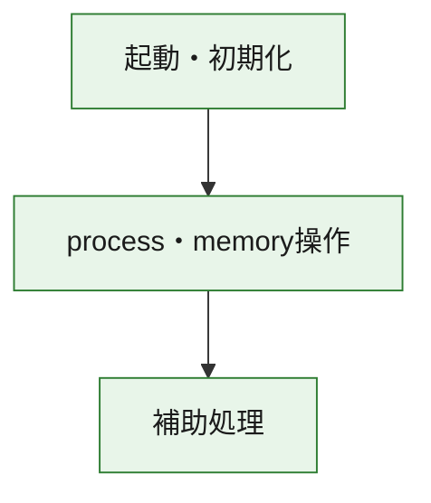
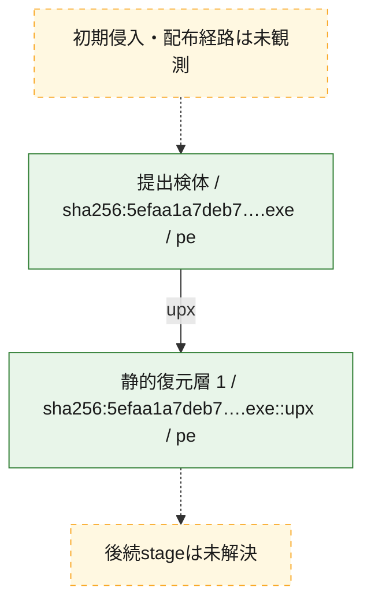
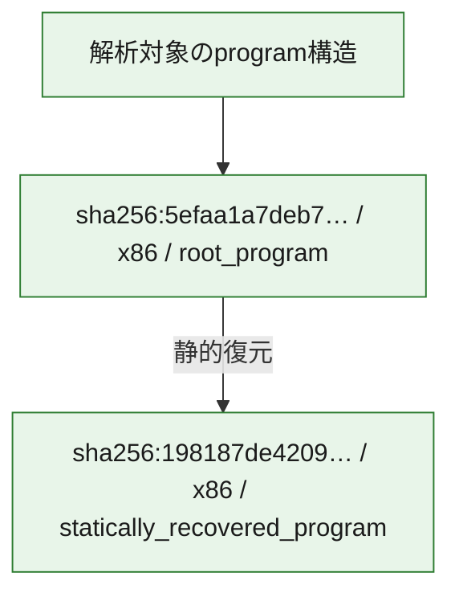

# 全体ロジック：5efaa1a7deb7076091d316c3a896c07667aa5633fe212a9460721c2db57d3d9e

代表関数の静的証跡から、起動・初期化、process・memory操作の処理群を確認しました。

## 読み方

- phaseの掲載順は解析上の整理順です。observed_call_edgesがない段階間の実行順を断定しません。
- 図の実線は静的に観測した関係、点線と黄色のノードは未観測・未解決の関係を示します。
- 図は静的な要約であり、動的実行を再現するものではありません。
- 詳細な関数解説とfingerprintは[STATIC-LOGIC.md](STATIC-LOGIC.md)を参照してください。

## 静的可視化

### 実行フロー

### 感染チェーン

### モジュール関係

## 処理段階

### 1. 起動・初期化

entry pointから初期化と後続処理への移行を確認します。
確度: `confirmed_static_function_evidence`

- `5efaa1a7deb7076091d316c3a896c07667aa5633fe212a9460721c2db57d3d9e:ghidra:1102974b0` — 初期化と主要処理への分岐を行う入口関数です。 状態: `succeeded`、選定理由: `call_graph_centrality:in=0,out=1`, `entry_point`, `meaningful_symbol_name`, `reviewed_call_centrality:1`, `reviewed_call_centrality:2`, `role:entrypoint`, `small_program_complete_context`
- `198187de42093d2de75576ff16beb75ddd6082235ccb215463053e4e4edcdc95:ghidra:1101446f0` — 初期化と主要処理への分岐を行う入口関数です。 状態: `succeeded`、選定理由: `entry_point`, `meaningful_symbol_name`, `reviewed_call_centrality:10`, `role:entrypoint`

### 2. process・memory操作

process、thread、module、memory操作と実行移行を確認します。
確度: `confirmed_static_function_evidence_with_limits`

- `5efaa1a7deb7076091d316c3a896c07667aa5633fe212a9460721c2db57d3d9e:ghidra:110297520` — process、thread、module、またはmemory操作に関係する関数です。 状態: `limited_bad_instruction_or_flow`、選定理由: `call_graph_centrality:in=1,out=2`, `large_function:instructions=166`, `reviewed_call_centrality:4`, `reviewed_call_centrality:8`, `role:process_or_memory_operation`, `small_program_complete_context`

### 3. 補助処理

主要処理を支える一般内部関数またはlibrary処理を確認します。
確度: `confirmed_static_function_evidence`

- `5efaa1a7deb7076091d316c3a896c07667aa5633fe212a9460721c2db57d3d9e:ghidra:1102974e2` — 検体内部の一般処理を実装する関数です。 状態: `succeeded`、選定理由: `call_graph_centrality:in=1,out=0`, `reviewed_call_centrality:1`, `small_program_complete_context`
- `198187de42093d2de75576ff16beb75ddd6082235ccb215463053e4e4edcdc95:ghidra:110001050` — 検体内部の一般処理を実装する関数です。 状態: `succeeded`、選定理由: `context_representative`, `reviewed_call_centrality:12`
- `198187de42093d2de75576ff16beb75ddd6082235ccb215463053e4e4edcdc95:ghidra:1100014b8` — 検体内部の一般処理を実装する関数です。 状態: `succeeded`、選定理由: `context_representative`, `reviewed_call_centrality:1`
- `198187de42093d2de75576ff16beb75ddd6082235ccb215463053e4e4edcdc95:ghidra:110001550` — 検体内部の一般処理を実装する関数です。 状態: `succeeded`、選定理由: `context_representative`, `reviewed_call_centrality:16`
- `198187de42093d2de75576ff16beb75ddd6082235ccb215463053e4e4edcdc95:ghidra:110001ba0` — 検体内部の一般処理を実装する関数です。 状態: `succeeded`、選定理由: `context_representative`, `reviewed_call_centrality:31`
- `198187de42093d2de75576ff16beb75ddd6082235ccb215463053e4e4edcdc95:ghidra:110002424` — 検体内部の一般処理を実装する関数です。 状態: `succeeded`、選定理由: `context_representative`, `reviewed_call_centrality:3`
- `198187de42093d2de75576ff16beb75ddd6082235ccb215463053e4e4edcdc95:ghidra:1100024a8` — 検体内部の一般処理を実装する関数です。 状態: `succeeded`、選定理由: `context_representative`, `reviewed_call_centrality:4`
- `198187de42093d2de75576ff16beb75ddd6082235ccb215463053e4e4edcdc95:ghidra:1100028c0` — 検体内部の一般処理を実装する関数です。 状態: `succeeded`、選定理由: `context_representative`, `reviewed_call_centrality:25`
- `198187de42093d2de75576ff16beb75ddd6082235ccb215463053e4e4edcdc95:ghidra:110002d2c` — 検体内部の一般処理を実装する関数です。 状態: `succeeded`、選定理由: `context_representative`, `reviewed_call_centrality:11`
- `198187de42093d2de75576ff16beb75ddd6082235ccb215463053e4e4edcdc95:ghidra:110003080` — 検体内部の一般処理を実装する関数です。 状態: `succeeded`、選定理由: `context_representative`, `reviewed_call_centrality:1`
- `198187de42093d2de75576ff16beb75ddd6082235ccb215463053e4e4edcdc95:ghidra:110003220` — 検体内部の一般処理を実装する関数です。 状態: `succeeded`、選定理由: `context_representative`, `reviewed_call_centrality:37`
- `198187de42093d2de75576ff16beb75ddd6082235ccb215463053e4e4edcdc95:ghidra:110003e10` — 検体内部の一般処理を実装する関数です。 状態: `succeeded`、選定理由: `context_representative`, `reviewed_call_centrality:2`
- `198187de42093d2de75576ff16beb75ddd6082235ccb215463053e4e4edcdc95:ghidra:110004080` — 検体内部の一般処理を実装する関数です。 状態: `succeeded`、選定理由: `context_representative`, `reviewed_call_centrality:3`
- `198187de42093d2de75576ff16beb75ddd6082235ccb215463053e4e4edcdc95:ghidra:110004300` — 検体内部の一般処理を実装する関数です。 状態: `succeeded`、選定理由: `context_representative`, `reviewed_call_centrality:2`
- `198187de42093d2de75576ff16beb75ddd6082235ccb215463053e4e4edcdc95:ghidra:1100043b8` — 検体内部の一般処理を実装する関数です。 状態: `succeeded`、選定理由: `context_representative`, `reviewed_call_centrality:2`
- `198187de42093d2de75576ff16beb75ddd6082235ccb215463053e4e4edcdc95:ghidra:11000447c` — 検体内部の一般処理を実装する関数です。 状態: `succeeded`、選定理由: `context_representative`, `reviewed_call_centrality:2`
- `198187de42093d2de75576ff16beb75ddd6082235ccb215463053e4e4edcdc95:ghidra:110004548` — 検体内部の一般処理を実装する関数です。 状態: `succeeded`、選定理由: `context_representative`, `reviewed_call_centrality:15`
- `198187de42093d2de75576ff16beb75ddd6082235ccb215463053e4e4edcdc95:ghidra:110005270` — 検体内部の一般処理を実装する関数です。 状態: `succeeded`、選定理由: `context_representative`, `reviewed_call_centrality:2`
- `198187de42093d2de75576ff16beb75ddd6082235ccb215463053e4e4edcdc95:ghidra:110005390` — 検体内部の一般処理を実装する関数です。 状態: `succeeded`、選定理由: `context_representative`, `reviewed_call_centrality:1`
- `198187de42093d2de75576ff16beb75ddd6082235ccb215463053e4e4edcdc95:ghidra:1100053d0` — 検体内部の一般処理を実装する関数です。 状態: `succeeded`、選定理由: `context_representative`
- `198187de42093d2de75576ff16beb75ddd6082235ccb215463053e4e4edcdc95:ghidra:110005450` — 検体内部の一般処理を実装する関数です。 状態: `succeeded`、選定理由: `context_representative`, `reviewed_call_centrality:6`
- `198187de42093d2de75576ff16beb75ddd6082235ccb215463053e4e4edcdc95:ghidra:11000568c` — 検体内部の一般処理を実装する関数です。 状態: `succeeded`、選定理由: `context_representative`
- `198187de42093d2de75576ff16beb75ddd6082235ccb215463053e4e4edcdc95:ghidra:1100056b0` — 検体内部の一般処理を実装する関数です。 状態: `succeeded`、選定理由: `context_representative`, `reviewed_call_centrality:2`
- `198187de42093d2de75576ff16beb75ddd6082235ccb215463053e4e4edcdc95:ghidra:110005900` — 検体内部の一般処理を実装する関数です。 状態: `succeeded`、選定理由: `context_representative`, `reviewed_call_centrality:24`
- `198187de42093d2de75576ff16beb75ddd6082235ccb215463053e4e4edcdc95:ghidra:110006490` — 検体内部の一般処理を実装する関数です。 状態: `succeeded`、選定理由: `context_representative`
- `198187de42093d2de75576ff16beb75ddd6082235ccb215463053e4e4edcdc95:ghidra:11000656c` — 検体内部の一般処理を実装する関数です。 状態: `succeeded`、選定理由: `context_representative`
- `198187de42093d2de75576ff16beb75ddd6082235ccb215463053e4e4edcdc95:ghidra:110006630` — 検体内部の一般処理を実装する関数です。 状態: `succeeded`、選定理由: `context_representative`, `reviewed_call_centrality:1`
- `198187de42093d2de75576ff16beb75ddd6082235ccb215463053e4e4edcdc95:ghidra:1100067c0` — 検体内部の一般処理を実装する関数です。 状態: `succeeded`、選定理由: `context_representative`, `reviewed_call_centrality:21`
- `198187de42093d2de75576ff16beb75ddd6082235ccb215463053e4e4edcdc95:ghidra:110006f88` — 検体内部の一般処理を実装する関数です。 状態: `succeeded`、選定理由: `context_representative`, `reviewed_call_centrality:8`
- `198187de42093d2de75576ff16beb75ddd6082235ccb215463053e4e4edcdc95:ghidra:110007100` — 検体内部の一般処理を実装する関数です。 状態: `succeeded`、選定理由: `context_representative`, `reviewed_call_centrality:13`
- `198187de42093d2de75576ff16beb75ddd6082235ccb215463053e4e4edcdc95:ghidra:110007378` — 検体内部の一般処理を実装する関数です。 状態: `succeeded`、選定理由: `context_representative`, `reviewed_call_centrality:11`
- `198187de42093d2de75576ff16beb75ddd6082235ccb215463053e4e4edcdc95:ghidra:110007780` — 検体内部の一般処理を実装する関数です。 状態: `succeeded`、選定理由: `context_representative`, `reviewed_call_centrality:4`

## 観測したcall関係

- `198187de42093d2de75576ff16beb75ddd6082235ccb215463053e4e4edcdc95:ghidra:110001050` → `198187de42093d2de75576ff16beb75ddd6082235ccb215463053e4e4edcdc95:ghidra:1100014b8` （`support` → `support`）
- `198187de42093d2de75576ff16beb75ddd6082235ccb215463053e4e4edcdc95:ghidra:110001550` → `198187de42093d2de75576ff16beb75ddd6082235ccb215463053e4e4edcdc95:ghidra:110005900` （`support` → `support`）
- `198187de42093d2de75576ff16beb75ddd6082235ccb215463053e4e4edcdc95:ghidra:110001ba0` → `198187de42093d2de75576ff16beb75ddd6082235ccb215463053e4e4edcdc95:ghidra:110001050` （`support` → `support`）
- `198187de42093d2de75576ff16beb75ddd6082235ccb215463053e4e4edcdc95:ghidra:110001ba0` → `198187de42093d2de75576ff16beb75ddd6082235ccb215463053e4e4edcdc95:ghidra:110001550` （`support` → `support`）
- `198187de42093d2de75576ff16beb75ddd6082235ccb215463053e4e4edcdc95:ghidra:110001ba0` → `198187de42093d2de75576ff16beb75ddd6082235ccb215463053e4e4edcdc95:ghidra:110005900` （`support` → `support`）
- `198187de42093d2de75576ff16beb75ddd6082235ccb215463053e4e4edcdc95:ghidra:1100024a8` → `198187de42093d2de75576ff16beb75ddd6082235ccb215463053e4e4edcdc95:ghidra:110002424` （`support` → `support`）
- `198187de42093d2de75576ff16beb75ddd6082235ccb215463053e4e4edcdc95:ghidra:1100028c0` → `198187de42093d2de75576ff16beb75ddd6082235ccb215463053e4e4edcdc95:ghidra:1100024a8` （`support` → `support`）
- `198187de42093d2de75576ff16beb75ddd6082235ccb215463053e4e4edcdc95:ghidra:1100028c0` → `198187de42093d2de75576ff16beb75ddd6082235ccb215463053e4e4edcdc95:ghidra:110005900` （`support` → `support`）
- `198187de42093d2de75576ff16beb75ddd6082235ccb215463053e4e4edcdc95:ghidra:110002d2c` → `198187de42093d2de75576ff16beb75ddd6082235ccb215463053e4e4edcdc95:ghidra:110005900` （`support` → `support`）
- `198187de42093d2de75576ff16beb75ddd6082235ccb215463053e4e4edcdc95:ghidra:110003220` → `198187de42093d2de75576ff16beb75ddd6082235ccb215463053e4e4edcdc95:ghidra:110005900` （`support` → `support`）
- `198187de42093d2de75576ff16beb75ddd6082235ccb215463053e4e4edcdc95:ghidra:110004548` → `198187de42093d2de75576ff16beb75ddd6082235ccb215463053e4e4edcdc95:ghidra:110005900` （`support` → `support`）
- `198187de42093d2de75576ff16beb75ddd6082235ccb215463053e4e4edcdc95:ghidra:110005390` → `198187de42093d2de75576ff16beb75ddd6082235ccb215463053e4e4edcdc95:ghidra:110005270` （`support` → `support`）
- `198187de42093d2de75576ff16beb75ddd6082235ccb215463053e4e4edcdc95:ghidra:110005900` → `198187de42093d2de75576ff16beb75ddd6082235ccb215463053e4e4edcdc95:ghidra:110005270` （`support` → `support`）
- `198187de42093d2de75576ff16beb75ddd6082235ccb215463053e4e4edcdc95:ghidra:110005900` → `198187de42093d2de75576ff16beb75ddd6082235ccb215463053e4e4edcdc95:ghidra:110005450` （`support` → `support`）
- `198187de42093d2de75576ff16beb75ddd6082235ccb215463053e4e4edcdc95:ghidra:1100067c0` → `198187de42093d2de75576ff16beb75ddd6082235ccb215463053e4e4edcdc95:ghidra:110004300` （`support` → `support`）
- `198187de42093d2de75576ff16beb75ddd6082235ccb215463053e4e4edcdc95:ghidra:1100067c0` → `198187de42093d2de75576ff16beb75ddd6082235ccb215463053e4e4edcdc95:ghidra:1100043b8` （`support` → `support`）
- `198187de42093d2de75576ff16beb75ddd6082235ccb215463053e4e4edcdc95:ghidra:1100067c0` → `198187de42093d2de75576ff16beb75ddd6082235ccb215463053e4e4edcdc95:ghidra:11000447c` （`support` → `support`）
- `198187de42093d2de75576ff16beb75ddd6082235ccb215463053e4e4edcdc95:ghidra:1100067c0` → `198187de42093d2de75576ff16beb75ddd6082235ccb215463053e4e4edcdc95:ghidra:110005900` （`support` → `support`）
- `198187de42093d2de75576ff16beb75ddd6082235ccb215463053e4e4edcdc95:ghidra:1100067c0` → `198187de42093d2de75576ff16beb75ddd6082235ccb215463053e4e4edcdc95:ghidra:110007100` （`support` → `support`）
- `198187de42093d2de75576ff16beb75ddd6082235ccb215463053e4e4edcdc95:ghidra:110006f88` → `198187de42093d2de75576ff16beb75ddd6082235ccb215463053e4e4edcdc95:ghidra:110004080` （`support` → `support`）
- `198187de42093d2de75576ff16beb75ddd6082235ccb215463053e4e4edcdc95:ghidra:110007378` → `198187de42093d2de75576ff16beb75ddd6082235ccb215463053e4e4edcdc95:ghidra:110001ba0` （`support` → `support`）
- `198187de42093d2de75576ff16beb75ddd6082235ccb215463053e4e4edcdc95:ghidra:110007378` → `198187de42093d2de75576ff16beb75ddd6082235ccb215463053e4e4edcdc95:ghidra:110005900` （`support` → `support`）
- `198187de42093d2de75576ff16beb75ddd6082235ccb215463053e4e4edcdc95:ghidra:110007780` → `198187de42093d2de75576ff16beb75ddd6082235ccb215463053e4e4edcdc95:ghidra:1100043b8` （`support` → `support`）
- `5efaa1a7deb7076091d316c3a896c07667aa5633fe212a9460721c2db57d3d9e:ghidra:1102974b0` → `5efaa1a7deb7076091d316c3a896c07667aa5633fe212a9460721c2db57d3d9e:ghidra:110297520` （`startup` → `execution`）
- `5efaa1a7deb7076091d316c3a896c07667aa5633fe212a9460721c2db57d3d9e:ghidra:110297520` → `5efaa1a7deb7076091d316c3a896c07667aa5633fe212a9460721c2db57d3d9e:ghidra:1102974e2` （`execution` → `support`）
- `ghidra-function:109e73ce76d9379cdb73bc9a` → `ghidra-external:06ccf03f94dc591b5aa4ccd4` （`unclassified` → `unclassified`）
- `ghidra-function:109e73ce76d9379cdb73bc9a` → `ghidra-function:b6afa5df7c98edebdcc4dd23` （`unclassified` → `unclassified`）
- `ghidra-function:18149237410c6591769ed2e6` → `ghidra-external:06ccf03f94dc591b5aa4ccd4` （`unclassified` → `unclassified`）
- `ghidra-function:18149237410c6591769ed2e6` → `ghidra-external:adf71aa4600472f143536eb6` （`unclassified` → `unclassified`）
- `ghidra-function:18149237410c6591769ed2e6` → `ghidra-function:05eb0fe36ed9074e44db439a` （`unclassified` → `unclassified`）
- `ghidra-function:18149237410c6591769ed2e6` → `ghidra-function:081b84fbaf5e36283685bad9` （`unclassified` → `unclassified`）
- `ghidra-function:18149237410c6591769ed2e6` → `ghidra-function:0997206a2c4cacd630d16d7d` （`unclassified` → `unclassified`）
- `ghidra-function:18149237410c6591769ed2e6` → `ghidra-function:2b5bf6ee1fb0b7a88dac1baf` （`unclassified` → `unclassified`）
- `ghidra-function:18149237410c6591769ed2e6` → `ghidra-function:2de538c1f58361c052c49c36` （`unclassified` → `unclassified`）
- `ghidra-function:18149237410c6591769ed2e6` → `ghidra-function:3127aadefa42adf7e122014a` （`unclassified` → `unclassified`）
- `ghidra-function:18149237410c6591769ed2e6` → `ghidra-function:32e2286e4e83c2a91984a10c` （`unclassified` → `unclassified`）
- `ghidra-function:18149237410c6591769ed2e6` → `ghidra-function:3bb8b67762a511fe2c4578de` （`unclassified` → `unclassified`）
- `ghidra-function:18149237410c6591769ed2e6` → `ghidra-function:431f0d12fa4f9c42026bfc7d` （`unclassified` → `unclassified`）
- `ghidra-function:18149237410c6591769ed2e6` → `ghidra-function:44954a7b4ac4a1bc54d033cb` （`unclassified` → `unclassified`）
- `ghidra-function:18149237410c6591769ed2e6` → `ghidra-function:44a202c921a42ff9d985c264` （`unclassified` → `unclassified`）
- `ghidra-function:18149237410c6591769ed2e6` → `ghidra-function:4b8631ea71ad7ff6dc559bc0` （`unclassified` → `unclassified`）
- `ghidra-function:18149237410c6591769ed2e6` → `ghidra-function:5379623ac186be0054281c37` （`unclassified` → `unclassified`）
- `ghidra-function:18149237410c6591769ed2e6` → `ghidra-function:5d3c6ba0295a03387ffd76e2` （`unclassified` → `unclassified`）
- `ghidra-function:18149237410c6591769ed2e6` → `ghidra-function:615df5d5edc5c5599dd34ae8` （`unclassified` → `unclassified`）
- `ghidra-function:18149237410c6591769ed2e6` → `ghidra-function:617d4f42394ea920218d006d` （`unclassified` → `unclassified`）
- `ghidra-function:18149237410c6591769ed2e6` → `ghidra-function:6deb993f1b89d11973c5d237` （`unclassified` → `unclassified`）
- `ghidra-function:18149237410c6591769ed2e6` → `ghidra-function:71de19e0c51964849dd49c7c` （`unclassified` → `unclassified`）
- `ghidra-function:18149237410c6591769ed2e6` → `ghidra-function:72c38c1b9d7ce2b769c9edd5` （`unclassified` → `unclassified`）
- `ghidra-function:18149237410c6591769ed2e6` → `ghidra-function:780f4e10cd909717099470d7` （`unclassified` → `unclassified`）
- `ghidra-function:18149237410c6591769ed2e6` → `ghidra-function:99f0e3cf907aaf8494962f18` （`unclassified` → `unclassified`）
- `ghidra-function:18149237410c6591769ed2e6` → `ghidra-function:9b13568bb6fea2e1f64981b5` （`unclassified` → `unclassified`）
- `ghidra-function:18149237410c6591769ed2e6` → `ghidra-function:c26741e9095302e81a6668a1` （`unclassified` → `unclassified`）
- `ghidra-function:18149237410c6591769ed2e6` → `ghidra-function:d82dc2855d89b99f6cfaefe9` （`unclassified` → `unclassified`）
- `ghidra-function:18149237410c6591769ed2e6` → `ghidra-function:d9014dde35717fbab678ecdd` （`unclassified` → `unclassified`）
- `ghidra-function:18149237410c6591769ed2e6` → `ghidra-function:de8a803f56940163d8a1f650` （`unclassified` → `unclassified`）
- `ghidra-function:18149237410c6591769ed2e6` → `ghidra-function:f792db76d7af1d44a73805df` （`unclassified` → `unclassified`）
- `ghidra-function:18149237410c6591769ed2e6` → `ghidra-function:fa756f21a4cff891fa429cb6` （`unclassified` → `unclassified`）
- `ghidra-function:231a4ed8358c2a04d5459522` → `ghidra-external:06ccf03f94dc591b5aa4ccd4` （`unclassified` → `unclassified`）
- `ghidra-function:2e060d19e02a8d0d8accd611` → `ghidra-external:0c0cda856d61cb0af6d2fb8a` （`unclassified` → `unclassified`）
- `ghidra-function:2e060d19e02a8d0d8accd611` → `ghidra-external:3ff7a687fa633e02fe091ad4` （`unclassified` → `unclassified`）
- `ghidra-function:2e060d19e02a8d0d8accd611` → `ghidra-function:0ec95fb432888712b2d48848` （`unclassified` → `unclassified`）
- `ghidra-function:2e060d19e02a8d0d8accd611` → `ghidra-function:50e4b4919a630a494a6da343` （`unclassified` → `unclassified`）
- `ghidra-function:2e060d19e02a8d0d8accd611` → `ghidra-function:6477395839f58bdb9e0ff6e4` （`unclassified` → `unclassified`）
- `ghidra-function:2e060d19e02a8d0d8accd611` → `ghidra-function:6d8b58580c6d890de7e50ce9` （`unclassified` → `unclassified`）
- `ghidra-function:2e060d19e02a8d0d8accd611` → `ghidra-function:762255090240ad0192723dec` （`unclassified` → `unclassified`）
- `ghidra-function:2e060d19e02a8d0d8accd611` → `ghidra-function:abc107fcbc526b17e38a893f` （`unclassified` → `unclassified`）
- `ghidra-function:2e060d19e02a8d0d8accd611` → `ghidra-function:b6afa5df7c98edebdcc4dd23` （`unclassified` → `unclassified`）
- `ghidra-function:2e060d19e02a8d0d8accd611` → `ghidra-function:d9014dde35717fbab678ecdd` （`unclassified` → `unclassified`）
- `ghidra-function:2e060d19e02a8d0d8accd611` → `ghidra-function:f1576a6d0dee31519be31eb5` （`unclassified` → `unclassified`）
- `ghidra-function:3127aadefa42adf7e122014a` → `ghidra-external:3ff7a687fa633e02fe091ad4` （`unclassified` → `unclassified`）
- `ghidra-function:3127aadefa42adf7e122014a` → `ghidra-function:3738d461ae9676344850cc37` （`unclassified` → `unclassified`）
- `ghidra-function:3127aadefa42adf7e122014a` → `ghidra-function:6d8b58580c6d890de7e50ce9` （`unclassified` → `unclassified`）
- `ghidra-function:3127aadefa42adf7e122014a` → `ghidra-function:7335a967a023ec5725dda37e` （`unclassified` → `unclassified`）
- `ghidra-function:3127aadefa42adf7e122014a` → `ghidra-function:762255090240ad0192723dec` （`unclassified` → `unclassified`）
- `ghidra-function:3127aadefa42adf7e122014a` → `ghidra-function:773643dc70501e9744abf74f` （`unclassified` → `unclassified`）
- `ghidra-function:3127aadefa42adf7e122014a` → `ghidra-function:8a5c84316700d4a32a2840f7` （`unclassified` → `unclassified`）
- `ghidra-function:3127aadefa42adf7e122014a` → `ghidra-function:abc107fcbc526b17e38a893f` （`unclassified` → `unclassified`）
- `ghidra-function:3127aadefa42adf7e122014a` → `ghidra-function:ac3bbc5a634ae03c5b62fa3c` （`unclassified` → `unclassified`）
- `ghidra-function:3127aadefa42adf7e122014a` → `ghidra-function:de8a803f56940163d8a1f650` （`unclassified` → `unclassified`）
- `ghidra-function:3127aadefa42adf7e122014a` → `ghidra-function:fb9bd25f51cae33c824c39dd` （`unclassified` → `unclassified`）
- `ghidra-function:36ba6bf087e29aab0e415970` → `ghidra-function:482a61778b9acffce5ce03ad` （`unclassified` → `unclassified`）
- `ghidra-function:36ba6bf087e29aab0e415970` → `ghidra-function:5a7ca3d37c991e9f8ff6609b` （`unclassified` → `unclassified`）
- `ghidra-function:397c2fd63e3406f2cbc779ed` → `ghidra-external:86559b6cc52f61e393a9f5dc` （`unclassified` → `unclassified`）
- `ghidra-function:397c2fd63e3406f2cbc779ed` → `ghidra-function:973b091444723b9ceb5b7708` （`unclassified` → `unclassified`）
- `ghidra-function:406a00a65e8b6553cdf2e12c` → `ghidra-external:adf71aa4600472f143536eb6` （`unclassified` → `unclassified`）
- `ghidra-function:406a00a65e8b6553cdf2e12c` → `ghidra-function:160fb340606040409b9b93f1` （`unclassified` → `unclassified`）
- `ghidra-function:406a00a65e8b6553cdf2e12c` → `ghidra-function:21070b13f862e3ecd8eb93ec` （`unclassified` → `unclassified`）
- `ghidra-function:406a00a65e8b6553cdf2e12c` → `ghidra-function:270db96703226905b2ce6d4b` （`unclassified` → `unclassified`）
- `ghidra-function:406a00a65e8b6553cdf2e12c` → `ghidra-function:294b1c71ea7281b9dcebd52d` （`unclassified` → `unclassified`）
- `ghidra-function:406a00a65e8b6553cdf2e12c` → `ghidra-function:2aca9e52003a90a6cccbe7d5` （`unclassified` → `unclassified`）
- `ghidra-function:406a00a65e8b6553cdf2e12c` → `ghidra-function:2dd4bae14aaf72f6856a8e59` （`unclassified` → `unclassified`）
- `ghidra-function:406a00a65e8b6553cdf2e12c` → `ghidra-function:2effac9d3cdef4c9ac5fc608` （`unclassified` → `unclassified`）
- `ghidra-function:406a00a65e8b6553cdf2e12c` → `ghidra-function:42cfd7e23bfa9a9f8e3428c0` （`unclassified` → `unclassified`）
- `ghidra-function:406a00a65e8b6553cdf2e12c` → `ghidra-function:52350ab9086a92a26c140c52` （`unclassified` → `unclassified`）
- `ghidra-function:406a00a65e8b6553cdf2e12c` → `ghidra-function:54decf695b961b9e0be5a362` （`unclassified` → `unclassified`）
- `ghidra-function:406a00a65e8b6553cdf2e12c` → `ghidra-function:55f6b37d22bf90ffc32448e4` （`unclassified` → `unclassified`）
- `ghidra-function:406a00a65e8b6553cdf2e12c` → `ghidra-function:65a0f25a0cf73b2d3c588ee9` （`unclassified` → `unclassified`）
- `ghidra-function:406a00a65e8b6553cdf2e12c` → `ghidra-function:69b9dfc0432067f0867e2717` （`unclassified` → `unclassified`）
- `ghidra-function:406a00a65e8b6553cdf2e12c` → `ghidra-function:7ea5d412161749dde903b69e` （`unclassified` → `unclassified`）
- `ghidra-function:406a00a65e8b6553cdf2e12c` → `ghidra-function:8a5c84316700d4a32a2840f7` （`unclassified` → `unclassified`）
- `ghidra-function:406a00a65e8b6553cdf2e12c` → `ghidra-function:8be157b6f7e2804453b45bdd` （`unclassified` → `unclassified`）
- `ghidra-function:406a00a65e8b6553cdf2e12c` → `ghidra-function:a230171e0716de137525c9fe` （`unclassified` → `unclassified`）
- `ghidra-function:406a00a65e8b6553cdf2e12c` → `ghidra-function:a8c635ba4357c3750ae4aed5` （`unclassified` → `unclassified`）
- `ghidra-function:406a00a65e8b6553cdf2e12c` → `ghidra-function:b870661a8fc80411085127d7` （`unclassified` → `unclassified`）
- `ghidra-function:406a00a65e8b6553cdf2e12c` → `ghidra-function:d379b7bd35558e9d48c05932` （`unclassified` → `unclassified`）
- `ghidra-function:406a00a65e8b6553cdf2e12c` → `ghidra-function:d9014dde35717fbab678ecdd` （`unclassified` → `unclassified`）
- `ghidra-function:406a00a65e8b6553cdf2e12c` → `ghidra-function:de8a803f56940163d8a1f650` （`unclassified` → `unclassified`）
- `ghidra-function:406a00a65e8b6553cdf2e12c` → `ghidra-function:e11699dd79c14b879dd4973d` （`unclassified` → `unclassified`）
- `ghidra-function:406a00a65e8b6553cdf2e12c` → `ghidra-function:ecf8be76c02bfb5bb318c3d1` （`unclassified` → `unclassified`）
- `ghidra-function:559662b276c7829ea1d53c8b` → `ghidra-external:06ccf03f94dc591b5aa4ccd4` （`unclassified` → `unclassified`）
- `ghidra-function:55f6b37d22bf90ffc32448e4` → `ghidra-external:3ff7a687fa633e02fe091ad4` （`unclassified` → `unclassified`）
- `ghidra-function:55f6b37d22bf90ffc32448e4` → `ghidra-function:397c2fd63e3406f2cbc779ed` （`unclassified` → `unclassified`）
- `ghidra-function:55f6b37d22bf90ffc32448e4` → `ghidra-function:de8a803f56940163d8a1f650` （`unclassified` → `unclassified`）
- `ghidra-function:584c5f3204a4c969d7bbc20f` → `ghidra-external:06ccf03f94dc591b5aa4ccd4` （`unclassified` → `unclassified`）
- `ghidra-function:584c5f3204a4c969d7bbc20f` → `ghidra-function:0053aba71d1319b1d9404058` （`unclassified` → `unclassified`）
- `ghidra-function:584c5f3204a4c969d7bbc20f` → `ghidra-function:6deb993f1b89d11973c5d237` （`unclassified` → `unclassified`）
- `ghidra-function:584c5f3204a4c969d7bbc20f` → `ghidra-function:f7b35b272b62e62874479798` （`unclassified` → `unclassified`）
- `ghidra-function:61601a0debd14d762dc6dd15` → `ghidra-external:06ccf03f94dc591b5aa4ccd4` （`unclassified` → `unclassified`）
- `ghidra-function:61601a0debd14d762dc6dd15` → `ghidra-external:3ff7a687fa633e02fe091ad4` （`unclassified` → `unclassified`）
- `ghidra-function:61601a0debd14d762dc6dd15` → `ghidra-function:124807aa71a93bebfe843b5b` （`unclassified` → `unclassified`）
- `ghidra-function:61601a0debd14d762dc6dd15` → `ghidra-function:160e45e07d93e394da948751` （`unclassified` → `unclassified`）
- `ghidra-function:61601a0debd14d762dc6dd15` → `ghidra-function:2395968acbd01f5905c01b18` （`unclassified` → `unclassified`）
- `ghidra-function:61601a0debd14d762dc6dd15` → `ghidra-function:2fff8c717dbe1bee13bc8015` （`unclassified` → `unclassified`）
- `ghidra-function:61601a0debd14d762dc6dd15` → `ghidra-function:348189613575dd2f79a6fa17` （`unclassified` → `unclassified`）
- `ghidra-function:61601a0debd14d762dc6dd15` → `ghidra-function:559662b276c7829ea1d53c8b` （`unclassified` → `unclassified`）
- `ghidra-function:61601a0debd14d762dc6dd15` → `ghidra-function:67868b41b3e891c887556980` （`unclassified` → `unclassified`）
- `ghidra-function:61601a0debd14d762dc6dd15` → `ghidra-function:8a5c84316700d4a32a2840f7` （`unclassified` → `unclassified`）
- `ghidra-function:61601a0debd14d762dc6dd15` → `ghidra-function:9b13568bb6fea2e1f64981b5` （`unclassified` → `unclassified`）
- `ghidra-function:61601a0debd14d762dc6dd15` → `ghidra-function:a4ba3e12ef6f5bcae37288fa` （`unclassified` → `unclassified`）
- `ghidra-function:61601a0debd14d762dc6dd15` → `ghidra-function:b2c119001184b8cc3573d56f` （`unclassified` → `unclassified`）
- `ghidra-function:61601a0debd14d762dc6dd15` → `ghidra-function:ba9630e5a29fb366c3fa605c` （`unclassified` → `unclassified`）
- `ghidra-function:61601a0debd14d762dc6dd15` → `ghidra-function:bf7c125c952d3be269183e23` （`unclassified` → `unclassified`）
- `ghidra-function:61601a0debd14d762dc6dd15` → `ghidra-function:d32af56ab720a35dc8aa04ad` （`unclassified` → `unclassified`）
- `ghidra-function:61601a0debd14d762dc6dd15` → `ghidra-function:d9014dde35717fbab678ecdd` （`unclassified` → `unclassified`）
- `ghidra-function:61601a0debd14d762dc6dd15` → `ghidra-function:de8a803f56940163d8a1f650` （`unclassified` → `unclassified`）
- `ghidra-function:61601a0debd14d762dc6dd15` → `ghidra-function:e55861fd7414910624c0821e` （`unclassified` → `unclassified`）
- `ghidra-function:61601a0debd14d762dc6dd15` → `ghidra-function:e8247b9bafc2875016772a9a` （`unclassified` → `unclassified`）
- `ghidra-function:61601a0debd14d762dc6dd15` → `ghidra-function:f7b35b272b62e62874479798` （`unclassified` → `unclassified`）
- `ghidra-function:6621d2a812119b7bbaf94b30` → `ghidra-external:06ccf03f94dc591b5aa4ccd4` （`unclassified` → `unclassified`）
- `ghidra-function:6bc89f628a9875e35f2b3e17` → `ghidra-external:06ccf03f94dc591b5aa4ccd4` （`unclassified` → `unclassified`）
- `ghidra-function:6bc89f628a9875e35f2b3e17` → `ghidra-function:33f1b151244de73351709f92` （`unclassified` → `unclassified`）
- `ghidra-function:71de19e0c51964849dd49c7c` → `ghidra-external:06ccf03f94dc591b5aa4ccd4` （`unclassified` → `unclassified`）
- `ghidra-function:71de19e0c51964849dd49c7c` → `ghidra-function:01169f8464a518054c802472` （`unclassified` → `unclassified`）
- `ghidra-function:71de19e0c51964849dd49c7c` → `ghidra-function:133f6860b50b1868408eaad2` （`unclassified` → `unclassified`）
- `ghidra-function:71de19e0c51964849dd49c7c` → `ghidra-function:160fb340606040409b9b93f1` （`unclassified` → `unclassified`）
- `ghidra-function:71de19e0c51964849dd49c7c` → `ghidra-function:33f1b151244de73351709f92` （`unclassified` → `unclassified`）
- `ghidra-function:71de19e0c51964849dd49c7c` → `ghidra-function:3738d461ae9676344850cc37` （`unclassified` → `unclassified`）
- `ghidra-function:71de19e0c51964849dd49c7c` → `ghidra-function:482a61778b9acffce5ce03ad` （`unclassified` → `unclassified`）
- `ghidra-function:71de19e0c51964849dd49c7c` → `ghidra-function:6d8b58580c6d890de7e50ce9` （`unclassified` → `unclassified`）
- `ghidra-function:71de19e0c51964849dd49c7c` → `ghidra-function:762255090240ad0192723dec` （`unclassified` → `unclassified`）
- `ghidra-function:71de19e0c51964849dd49c7c` → `ghidra-function:ac973a78d9d9ab4226c2b662` （`unclassified` → `unclassified`）
- `ghidra-function:71de19e0c51964849dd49c7c` → `ghidra-function:b1e49d2897b8993e39635581` （`unclassified` → `unclassified`）
- `ghidra-function:71de19e0c51964849dd49c7c` → `ghidra-function:d9014dde35717fbab678ecdd` （`unclassified` → `unclassified`）
- `ghidra-function:71de19e0c51964849dd49c7c` → `ghidra-function:de8a803f56940163d8a1f650` （`unclassified` → `unclassified`）
- `ghidra-function:71de19e0c51964849dd49c7c` → `ghidra-function:eab48925c460297f7aed7516` （`unclassified` → `unclassified`）
- `ghidra-function:71de19e0c51964849dd49c7c` → `ghidra-function:f77a803eee5d0e8d7d30c705` （`unclassified` → `unclassified`）
- `ghidra-function:75139f79ff899811803e5cc3` → `ghidra-function:14447c5dd3482cc0e8501ec7` （`unclassified` → `unclassified`）
- `ghidra-function:8eee519b16faf9eb7fc55f1d` → `ghidra-external:06ccf03f94dc591b5aa4ccd4` （`unclassified` → `unclassified`）
- `ghidra-function:8eee519b16faf9eb7fc55f1d` → `ghidra-function:2a8017f352478a81f7ab8318` （`unclassified` → `unclassified`）
- `ghidra-function:8eee519b16faf9eb7fc55f1d` → `ghidra-function:ac973a78d9d9ab4226c2b662` （`unclassified` → `unclassified`）
- `ghidra-function:8eee519b16faf9eb7fc55f1d` → `ghidra-function:b543582978b7e96127fd6ae7` （`unclassified` → `unclassified`）
- `ghidra-function:8eee519b16faf9eb7fc55f1d` → `ghidra-function:eab48925c460297f7aed7516` （`unclassified` → `unclassified`）
- `ghidra-function:93d22e60eeba838448e76c22` → `ghidra-external:06ccf03f94dc591b5aa4ccd4` （`unclassified` → `unclassified`）
- `ghidra-function:93d22e60eeba838448e76c22` → `ghidra-external:3ff7a687fa633e02fe091ad4` （`unclassified` → `unclassified`）
- `ghidra-function:93d22e60eeba838448e76c22` → `ghidra-external:6357623d70266171f4f8acb8` （`unclassified` → `unclassified`）
- `ghidra-function:93d22e60eeba838448e76c22` → `ghidra-external:783703d4547b26e9d4724d18` （`unclassified` → `unclassified`）
- `ghidra-function:93d22e60eeba838448e76c22` → `ghidra-external:a3e8695cbba80e48cfeed18f` （`unclassified` → `unclassified`）
- `ghidra-function:93d22e60eeba838448e76c22` → `ghidra-function:26203e24263416fa0a3741d0` （`unclassified` → `unclassified`）
- `ghidra-function:93d22e60eeba838448e76c22` → `ghidra-function:2de538c1f58361c052c49c36` （`unclassified` → `unclassified`）
- `ghidra-function:93d22e60eeba838448e76c22` → `ghidra-function:500a28ab87d01a415d608ef0` （`unclassified` → `unclassified`）
- `ghidra-function:93d22e60eeba838448e76c22` → `ghidra-function:5ba6a248efe71dbc3ef0c5c8` （`unclassified` → `unclassified`）
- `ghidra-function:93d22e60eeba838448e76c22` → `ghidra-function:665d5c9d61331acadcd9ca5e` （`unclassified` → `unclassified`）
- `ghidra-function:93d22e60eeba838448e76c22` → `ghidra-function:ac973a78d9d9ab4226c2b662` （`unclassified` → `unclassified`）
- `ghidra-function:93d22e60eeba838448e76c22` → `ghidra-function:d021726d00806198fda4b6a1` （`unclassified` → `unclassified`）
- `ghidra-function:93d22e60eeba838448e76c22` → `ghidra-function:d9014dde35717fbab678ecdd` （`unclassified` → `unclassified`）
- `ghidra-function:93d22e60eeba838448e76c22` → `ghidra-function:db16a553399d9911c35d24f8` （`unclassified` → `unclassified`）
- `ghidra-function:93d22e60eeba838448e76c22` → `ghidra-function:fa756f21a4cff891fa429cb6` （`unclassified` → `unclassified`）
- `ghidra-function:a3b34a174323e7b028c061ff` → `ghidra-external:1c196138a7a9a0dc2616d96f` （`unclassified` → `unclassified`）
- `ghidra-function:a3b34a174323e7b028c061ff` → `ghidra-external:88693d675e6c567cc37b9126` （`unclassified` → `unclassified`）
- `ghidra-function:a3b34a174323e7b028c061ff` → `ghidra-external:b7cfa77e32b90373f5ef2549` （`unclassified` → `unclassified`）
- `ghidra-function:a3b34a174323e7b028c061ff` → `ghidra-external:ca0305c19639b922caefea5d` （`unclassified` → `unclassified`）
- `ghidra-function:a3b34a174323e7b028c061ff` → `ghidra-external:dbbab269f6f873dd3329880f` （`unclassified` → `unclassified`）
- `ghidra-function:a3b34a174323e7b028c061ff` → `ghidra-function:b8f64d0fa1dce03973fe8845` （`unclassified` → `unclassified`）
- `ghidra-function:a3b34a174323e7b028c061ff` → `ghidra-function:d7dc5a66bbcbca3c6a23c8f5` （`unclassified` → `unclassified`）
- `ghidra-function:b09e909675a389ed5894085b` → `ghidra-external:06ccf03f94dc591b5aa4ccd4` （`unclassified` → `unclassified`）
- `ghidra-function:b09e909675a389ed5894085b` → `ghidra-function:0228e6a2ae93c6015cd65f08` （`unclassified` → `unclassified`）
- `ghidra-function:b09e909675a389ed5894085b` → `ghidra-function:18149237410c6591769ed2e6` （`unclassified` → `unclassified`）
- `ghidra-function:b09e909675a389ed5894085b` → `ghidra-function:4686825ed63d2d1144da83c8` （`unclassified` → `unclassified`）
- `ghidra-function:b09e909675a389ed5894085b` → `ghidra-function:4ca2ccbc3d1b1cfda56c3ad2` （`unclassified` → `unclassified`）
- `ghidra-function:b09e909675a389ed5894085b` → `ghidra-function:4cfbb8ccb6418555a58fd314` （`unclassified` → `unclassified`）
- `ghidra-function:b09e909675a389ed5894085b` → `ghidra-function:72befaa0ac8a0cacf0ec1a3f` （`unclassified` → `unclassified`）
- `ghidra-function:b09e909675a389ed5894085b` → `ghidra-function:72d6c072e100b3f8f8ac47fe` （`unclassified` → `unclassified`）
- `ghidra-function:b09e909675a389ed5894085b` → `ghidra-function:7eb9e62bffe74dedd5ac3b6b` （`unclassified` → `unclassified`）
- `ghidra-function:b09e909675a389ed5894085b` → `ghidra-function:9ac4c280f9b85e16764021ad` （`unclassified` → `unclassified`）
- `ghidra-function:b09e909675a389ed5894085b` → `ghidra-function:d9014dde35717fbab678ecdd` （`unclassified` → `unclassified`）
- `ghidra-function:b2c119001184b8cc3573d56f` → `ghidra-function:6d8b58580c6d890de7e50ce9` （`unclassified` → `unclassified`）
- `ghidra-function:b3b617d49e02324d6463b0d3` → `ghidra-function:160fb340606040409b9b93f1` （`unclassified` → `unclassified`）
- `ghidra-function:b3b617d49e02324d6463b0d3` → `ghidra-function:36ba6bf087e29aab0e415970` （`unclassified` → `unclassified`）
- `ghidra-function:b3b617d49e02324d6463b0d3` → `ghidra-function:533ce3fc6c272a42d132324e` （`unclassified` → `unclassified`）
- `ghidra-function:b3b617d49e02324d6463b0d3` → `ghidra-function:9b13568bb6fea2e1f64981b5` （`unclassified` → `unclassified`）
- 残り81件は`static-logic.json`に記録しています。

## 解析範囲と制約

- 選定外関数は全体inventoryへ残しますが、関数本体の個別解説対象にはしていません。
- indirect call、難読化、packer、VM、壊れたcontrol flowによりcall関係が欠落する場合があります。
- 文書は静的解析に基づき、検体実行や外部通信による動的確認は行っていません。
