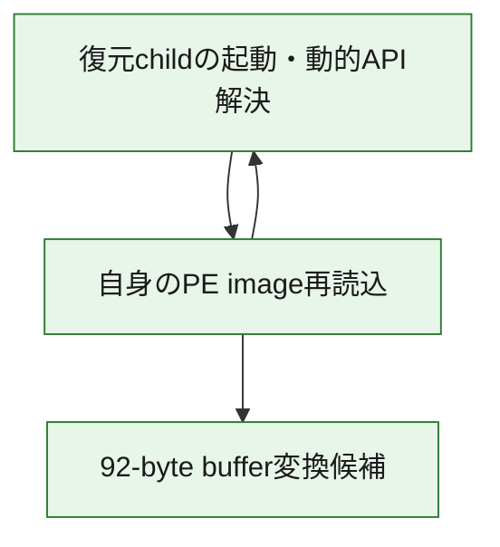
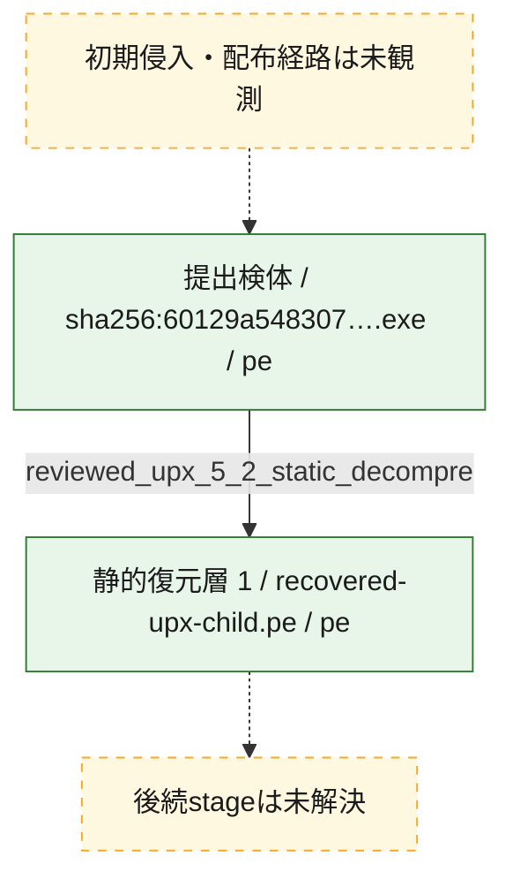
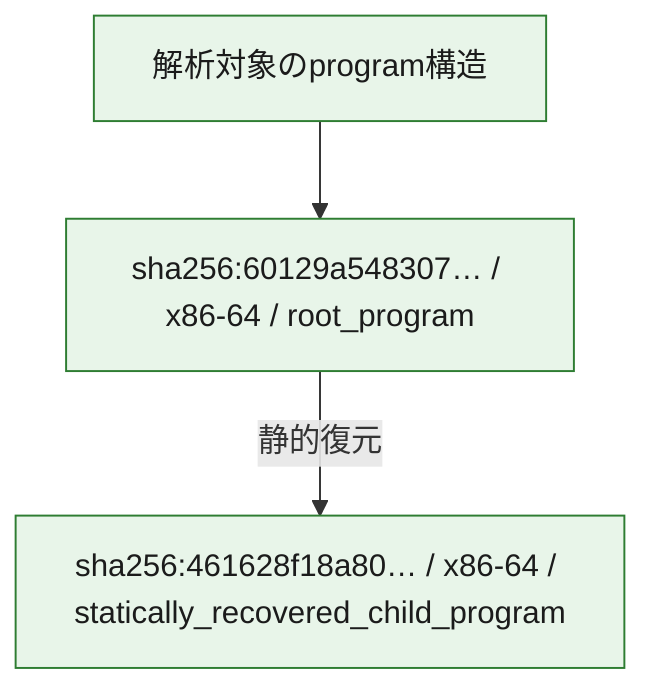

# 全体ロジック：60129a548307204fed1f4c698e12bc17d941592d81deb163f9fa63f4c6ecb3db

UPX復元後のimportless x64 PEについて、entryからPEB/module/export resolver、自身のimage再読込、92-byte変換候補までを静的に確認しました。C2、command、terminal behaviorは未解決です。

## 読み方

- 実線は代表関数間の直接callをGhidra decompilationと有界CFGで相関した関係です。掲載順だけでは実行順を補完しません。
- 図の実線は静的に観測した関係、点線と黄色のノードは未観測・未解決の関係を示します。
- 図は静的な要約であり、動的実行を再現するものではありません。
- 詳細な関数解説とfingerprintは[STATIC-LOGIC.md](STATIC-LOGIC.md)を参照してください。

## 静的可視化

### 実行フロー

### 感染チェーン

### モジュール関係

## 比較プロファイル

| 比較軸 | このcaseの正規化値 |
|---|---|
| 実行段階 | `loader_execution`、`file_operations`、`payload_decoding` |
| 感染・復元層 | PE → `reviewed_upx_5_2_static_decompression` → importless x64 PE |
| モジュール構成 | packed root PE、静的復元child、動的API resolver、自身のimage reader、変換候補 |
| 機能・挙動 | RDTSC観測、自身のread-only読込、FNV-1a型API解決、92-byte変換候補 |
| 代表関数の役割 | entry、PEB/module/export resolver、API hash、self-image reader、runtime dispatch、stream-XOR型変換 |
| コードfingerprint | 11代表関数についてnormalized logic SHA-256、semantic sequence SHA-256、SimHash64をgeneratorで記録 |

## 他ケースとの比較

このcaseは複数の独立軸を持ちますが、全case類似索引はcollection全体の更新時に再生成します。現時点では候補の有無を断定しません。family名、単一API、単一hash一致だけを類似根拠にはしません。類似候補が得られてもcampaignまたはactorの同一性は自動確定しません。

## 処理段階

### 1. 復元childの起動・動的API解決

entry、PEB参照、module/export resolver、FNV型hashでimportless PEのAPI解決準備を行います。RDTSCは観測済みですが解析回避の成立は未確定です。
確度: `confirmed_static_function_evidence`

- `60129a548307204fed1f4c698e12bc17d941592d81deb163f9fa63f4c6ecb3db:recovered-ghidra:7401290e0` — UPX復元後PEの入口です。有界CFGでは133 basic block、209既知edge、2,453命令を確認し、RDTSC 5回と未解決のregister間接callを保持します。 状態: `succeeded`、選定理由: `recovered_child`, `role:loader_entrypoint`, `reviewed_static_evidence`
- `60129a548307204fed1f4c698e12bc17d941592d81deb163f9fa63f4c6ecb3db:recovered-ghidra:74011cf3c` — timing値とPEB由来値を初期化状態へ混合し、ntdll.dllとkernel32.dllのmodule hashをresolverへ渡します。 状態: `succeeded`、選定理由: `recovered_child`, `role:runtime_initialization`, `reviewed_static_evidence`
- `60129a548307204fed1f4c698e12bc17d941592d81deb163f9fa63f4c6ecb3db:recovered-ghidra:74011c40c` — GS:[0x30]から参照したTEB内pointerを経由し、offset 0x60のPEB位置を返す短いhelperです。 状態: `succeeded`、選定理由: `recovered_child`, `role:peb_access`, `reviewed_static_evidence`
- `60129a548307204fed1f4c698e12bc17d941592d81deb163f9fa63f4c6ecb3db:recovered-ghidra:74011df70` — PEB loader listを巡回し、module名をlowercase化してFNV型hashと照合するresolverです。 状態: `succeeded`、選定理由: `recovered_child`, `role:module_hash_resolver`, `reviewed_static_evidence`
- `60129a548307204fed1f4c698e12bc17d941592d81deb163f9fa63f4c6ecb3db:recovered-ghidra:74011cb84` — ASCII名をseed 0x52d58f79から開始し、各byteでXOR後に0x01000697を乗算する32-bit FNV-1a型hash関数です。 状態: `succeeded`、選定理由: `recovered_child`, `role:api_name_hash`, `reviewed_static_evidence`
- `60129a548307204fed1f4c698e12bc17d941592d81deb163f9fa63f4c6ecb3db:recovered-ghidra:74011d5b4` — moduleのMZ/PE headerとexport directoryを検証し、export名hashからaddressを解決します。 状態: `succeeded`、選定理由: `recovered_child`, `role:pe_export_hash_resolver`, `reviewed_static_evidence`
- `60129a548307204fed1f4c698e12bc17d941592d81deb163f9fa63f4c6ecb3db:recovered-ghidra:74011ddf0` — 初期化済みkernel32 baseを取得し、PE export hash resolverへAPI hashを中継するwrapperです。 状態: `succeeded`、選定理由: `recovered_child`, `role:api_hash_resolver`, `reviewed_static_evidence`

### 2. 自身のPE image再読込

read-only open、header読込、section range選択、再読込、handle closeを確認します。process生成や外部file書込は確認していません。
確度: `confirmed_static_function_evidence`

- `60129a548307204fed1f4c698e12bc17d941592d81deb163f9fa63f4c6ecb3db:recovered-ghidra:740114f84` — 自身のpathを取得してread-onlyで開き、PE section tableに基づく範囲を読み戻します。process生成は確認していません。 状態: `succeeded`、選定理由: `recovered_child`, `role:self_image_reader`, `reviewed_static_evidence`

### 3. 92-byte buffer変換候補

runtime function-pointer dispatchとstream-XOR型更新で92-byte出力を構成します。用途と平文は未解決で、terminal payload復元とは扱いません。
確度: `confirmed_structure_with_semantic_limit`

- `60129a548307204fed1f4c698e12bc17d941592d81deb163f9fa63f4c6ecb3db:recovered-ghidra:74000ba18` — 入力byteをindexとしてruntime function-pointer tableを引き、各handlerを間接呼出しする前段です。handler対応は未解決です。 状態: `limited_indirect_flow`、選定理由: `recovered_child`, `role:runtime_transform_dispatch`, `reviewed_static_evidence`
- `60129a548307204fed1f4c698e12bc17d941592d81deb163f9fa63f4c6ecb3db:recovered-ghidra:74008ac98` — 埋込みbyte列とruntime dispatch結果を組み合わせ、最終変換関数へ92-byte出力を要求するbuilderです。出力の意味は未確定です。 状態: `succeeded`、選定理由: `recovered_child`, `role:transformed_buffer_builder`, `reviewed_static_evidence`
- `60129a548307204fed1f4c698e12bc17d941592d81deb163f9fa63f4c6ecb3db:recovered-ghidra:74000bd74` — 2つの入力bufferで32-bit stateを更新し、回転・XORしたstate byteと92-byte入力をXORして出力します。 状態: `succeeded`、選定理由: `recovered_child`, `role:stream_xor_transform`, `reviewed_static_evidence`

## 観測したcall関係

- `60129a548307204fed1f4c698e12bc17d941592d81deb163f9fa63f4c6ecb3db:recovered-ghidra:74008ac98` → `60129a548307204fed1f4c698e12bc17d941592d81deb163f9fa63f4c6ecb3db:recovered-ghidra:74000ba18` （`payload_decoding` → `payload_decoding`）
- `60129a548307204fed1f4c698e12bc17d941592d81deb163f9fa63f4c6ecb3db:recovered-ghidra:74008ac98` → `60129a548307204fed1f4c698e12bc17d941592d81deb163f9fa63f4c6ecb3db:recovered-ghidra:74000bd74` （`payload_decoding` → `payload_decoding`）
- `60129a548307204fed1f4c698e12bc17d941592d81deb163f9fa63f4c6ecb3db:recovered-ghidra:740114f84` → `60129a548307204fed1f4c698e12bc17d941592d81deb163f9fa63f4c6ecb3db:recovered-ghidra:74008ac98` （`file_operations` → `payload_decoding`）
- `60129a548307204fed1f4c698e12bc17d941592d81deb163f9fa63f4c6ecb3db:recovered-ghidra:740114f84` → `60129a548307204fed1f4c698e12bc17d941592d81deb163f9fa63f4c6ecb3db:recovered-ghidra:74011d5b4` （`file_operations` → `loader_execution`）
- `60129a548307204fed1f4c698e12bc17d941592d81deb163f9fa63f4c6ecb3db:recovered-ghidra:740114f84` → `60129a548307204fed1f4c698e12bc17d941592d81deb163f9fa63f4c6ecb3db:recovered-ghidra:74011ddf0` （`file_operations` → `loader_execution`）
- `60129a548307204fed1f4c698e12bc17d941592d81deb163f9fa63f4c6ecb3db:recovered-ghidra:74011cf3c` → `60129a548307204fed1f4c698e12bc17d941592d81deb163f9fa63f4c6ecb3db:recovered-ghidra:74011c40c` （`loader_execution` → `loader_execution`）
- `60129a548307204fed1f4c698e12bc17d941592d81deb163f9fa63f4c6ecb3db:recovered-ghidra:74011cf3c` → `60129a548307204fed1f4c698e12bc17d941592d81deb163f9fa63f4c6ecb3db:recovered-ghidra:74011df70` （`loader_execution` → `loader_execution`）
- `60129a548307204fed1f4c698e12bc17d941592d81deb163f9fa63f4c6ecb3db:recovered-ghidra:74011d5b4` → `60129a548307204fed1f4c698e12bc17d941592d81deb163f9fa63f4c6ecb3db:recovered-ghidra:74011cb84` （`loader_execution` → `loader_execution`）
- `60129a548307204fed1f4c698e12bc17d941592d81deb163f9fa63f4c6ecb3db:recovered-ghidra:74011ddf0` → `60129a548307204fed1f4c698e12bc17d941592d81deb163f9fa63f4c6ecb3db:recovered-ghidra:74011d5b4` （`loader_execution` → `loader_execution`）
- `60129a548307204fed1f4c698e12bc17d941592d81deb163f9fa63f4c6ecb3db:recovered-ghidra:74011df70` → `60129a548307204fed1f4c698e12bc17d941592d81deb163f9fa63f4c6ecb3db:recovered-ghidra:74011c40c` （`loader_execution` → `loader_execution`）
- `60129a548307204fed1f4c698e12bc17d941592d81deb163f9fa63f4c6ecb3db:recovered-ghidra:74011df70` → `60129a548307204fed1f4c698e12bc17d941592d81deb163f9fa63f4c6ecb3db:recovered-ghidra:74011cb84` （`loader_execution` → `loader_execution`）
- `60129a548307204fed1f4c698e12bc17d941592d81deb163f9fa63f4c6ecb3db:recovered-ghidra:7401290e0` → `60129a548307204fed1f4c698e12bc17d941592d81deb163f9fa63f4c6ecb3db:recovered-ghidra:740114f84` （`loader_execution` → `file_operations`）
- `60129a548307204fed1f4c698e12bc17d941592d81deb163f9fa63f4c6ecb3db:recovered-ghidra:7401290e0` → `60129a548307204fed1f4c698e12bc17d941592d81deb163f9fa63f4c6ecb3db:recovered-ghidra:74011cb84` （`loader_execution` → `loader_execution`）
- `60129a548307204fed1f4c698e12bc17d941592d81deb163f9fa63f4c6ecb3db:recovered-ghidra:7401290e0` → `60129a548307204fed1f4c698e12bc17d941592d81deb163f9fa63f4c6ecb3db:recovered-ghidra:74011cf3c` （`loader_execution` → `loader_execution`）
- `60129a548307204fed1f4c698e12bc17d941592d81deb163f9fa63f4c6ecb3db:recovered-ghidra:7401290e0` → `60129a548307204fed1f4c698e12bc17d941592d81deb163f9fa63f4c6ecb3db:recovered-ghidra:74011ddf0` （`loader_execution` → `loader_execution`）

## 解析範囲と制約

- UPX復元後childの全1,418関数inventoryは取得しましたが、個別説明は役割とcall関係で選んだ11代表関数に限定しています。
- entryのRVA 0x129cb1にあるcall rsiと、変換前段のruntime function-pointer tableは未解決です。
- 92-byte出力は変換bufferとして確認しましたが、平文、設定、payload、C2 commandのいずれかは確定していません。
- API名候補は固定corpus照合であり、未知hashは推測せずunresolvedに保持しています。
- caseのVidar表記は提供元labelであり、この関数解析だけからfamily固有の意味を補完していません。
- 検体と復元PEは実行・CPU emulationせず、外部通信も行っていません。
