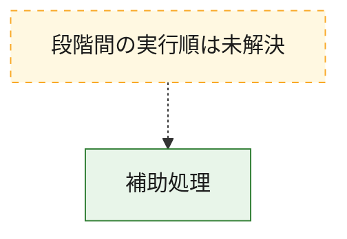
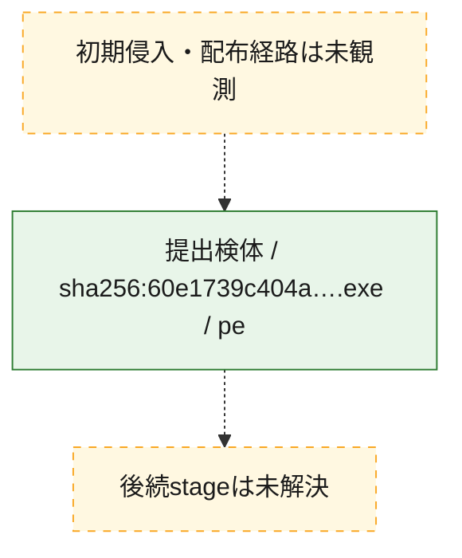
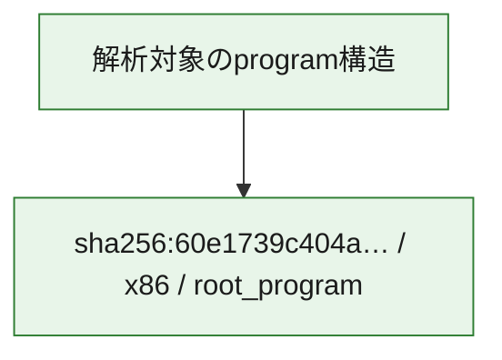

# 全体ロジック：60e1739c404a3bff934dc9d2947eb8faf5139c30a617724007e201a39a7eda90

代表関数から主要なmalware処理段階を自動分類できませんでした。

## 読み方

- phaseの掲載順は解析上の整理順です。observed_call_edgesがない段階間の実行順を断定しません。
- 図の実線は静的に観測した関係、点線と黄色のノードは未観測・未解決の関係を示します。
- 図は静的な要約であり、動的実行を再現するものではありません。
- 詳細な関数解説とfingerprintは[STATIC-LOGIC.md](STATIC-LOGIC.md)を参照してください。

## 静的可視化

### 実行フロー

### 感染チェーン

### モジュール関係

## 処理段階

### 1. 補助処理

主要処理を支える一般内部関数またはlibrary処理を確認します。
確度: `confirmed_static_function_evidence`

- `60e1739c404a3bff934dc9d2947eb8faf5139c30a617724007e201a39a7eda90:ghidra:1400010a0` — 検体内部の一般処理を実装する関数です。 状態: `succeeded`、選定理由: `context_representative`, `reviewed_call_centrality:2`
- `60e1739c404a3bff934dc9d2947eb8faf5139c30a617724007e201a39a7eda90:ghidra:1400011e0` — 検体内部の一般処理を実装する関数です。 状態: `succeeded`、選定理由: `context_representative`, `reviewed_call_centrality:4`
- `60e1739c404a3bff934dc9d2947eb8faf5139c30a617724007e201a39a7eda90:ghidra:140001260` — 検体内部の一般処理を実装する関数です。 状態: `succeeded`、選定理由: `context_representative`, `reviewed_call_centrality:4`
- `60e1739c404a3bff934dc9d2947eb8faf5139c30a617724007e201a39a7eda90:ghidra:140001300` — 検体内部の一般処理を実装する関数です。 状態: `succeeded`、選定理由: `context_representative`, `reviewed_call_centrality:4`
- `60e1739c404a3bff934dc9d2947eb8faf5139c30a617724007e201a39a7eda90:ghidra:140001400` — 検体内部の一般処理を実装する関数です。 状態: `succeeded`、選定理由: `context_representative`, `reviewed_call_centrality:8`
- `60e1739c404a3bff934dc9d2947eb8faf5139c30a617724007e201a39a7eda90:ghidra:140001880` — 検体内部の一般処理を実装する関数です。 状態: `succeeded`、選定理由: `context_representative`, `reviewed_call_centrality:2`
- `60e1739c404a3bff934dc9d2947eb8faf5139c30a617724007e201a39a7eda90:ghidra:140001980` — 検体内部の一般処理を実装する関数です。 状態: `succeeded`、選定理由: `context_representative`, `reviewed_call_centrality:2`
- `60e1739c404a3bff934dc9d2947eb8faf5139c30a617724007e201a39a7eda90:ghidra:140001a00` — 検体内部の一般処理を実装する関数です。 状態: `succeeded`、選定理由: `context_representative`, `reviewed_call_centrality:3`
- `60e1739c404a3bff934dc9d2947eb8faf5139c30a617724007e201a39a7eda90:ghidra:140001a60` — 検体内部の一般処理を実装する関数です。 状態: `succeeded`、選定理由: `context_representative`, `reviewed_call_centrality:11`
- `60e1739c404a3bff934dc9d2947eb8faf5139c30a617724007e201a39a7eda90:ghidra:140001fa0` — 検体内部の一般処理を実装する関数です。 状態: `succeeded`、選定理由: `context_representative`, `reviewed_call_centrality:11`
- `60e1739c404a3bff934dc9d2947eb8faf5139c30a617724007e201a39a7eda90:ghidra:1400028e0` — 検体内部の一般処理を実装する関数です。 状態: `succeeded`、選定理由: `context_representative`, `reviewed_call_centrality:2`
- `60e1739c404a3bff934dc9d2947eb8faf5139c30a617724007e201a39a7eda90:ghidra:140002960` — 検体内部の一般処理を実装する関数です。 状態: `succeeded`、選定理由: `context_representative`, `reviewed_call_centrality:2`
- `60e1739c404a3bff934dc9d2947eb8faf5139c30a617724007e201a39a7eda90:ghidra:140003640` — 検体内部の一般処理を実装する関数です。 状態: `succeeded`、選定理由: `context_representative`, `reviewed_call_centrality:10`
- `60e1739c404a3bff934dc9d2947eb8faf5139c30a617724007e201a39a7eda90:ghidra:1400038c0` — 検体内部の一般処理を実装する関数です。 状態: `succeeded`、選定理由: `context_representative`, `reviewed_call_centrality:5`
- `60e1739c404a3bff934dc9d2947eb8faf5139c30a617724007e201a39a7eda90:ghidra:140003b40` — 検体内部の一般処理を実装する関数です。 状態: `succeeded`、選定理由: `context_representative`, `reviewed_call_centrality:4`
- `60e1739c404a3bff934dc9d2947eb8faf5139c30a617724007e201a39a7eda90:ghidra:140003c60` — 検体内部の一般処理を実装する関数です。 状態: `succeeded`、選定理由: `context_representative`, `reviewed_call_centrality:7`
- `60e1739c404a3bff934dc9d2947eb8faf5139c30a617724007e201a39a7eda90:ghidra:140003da0` — 検体内部の一般処理を実装する関数です。 状態: `succeeded`、選定理由: `context_representative`, `reviewed_call_centrality:9`
- `60e1739c404a3bff934dc9d2947eb8faf5139c30a617724007e201a39a7eda90:ghidra:140004060` — 検体内部の一般処理を実装する関数です。 状態: `succeeded`、選定理由: `context_representative`, `reviewed_call_centrality:3`
- `60e1739c404a3bff934dc9d2947eb8faf5139c30a617724007e201a39a7eda90:ghidra:1400040e0` — 検体内部の一般処理を実装する関数です。 状態: `succeeded`、選定理由: `context_representative`, `reviewed_call_centrality:5`
- `60e1739c404a3bff934dc9d2947eb8faf5139c30a617724007e201a39a7eda90:ghidra:140004280` — 検体内部の一般処理を実装する関数です。 状態: `succeeded`、選定理由: `context_representative`, `reviewed_call_centrality:8`
- `60e1739c404a3bff934dc9d2947eb8faf5139c30a617724007e201a39a7eda90:ghidra:140004420` — 検体内部の一般処理を実装する関数です。 状態: `succeeded`、選定理由: `context_representative`, `reviewed_call_centrality:8`
- `60e1739c404a3bff934dc9d2947eb8faf5139c30a617724007e201a39a7eda90:ghidra:140004600` — 検体内部の一般処理を実装する関数です。 状態: `succeeded`、選定理由: `context_representative`, `reviewed_call_centrality:3`
- `60e1739c404a3bff934dc9d2947eb8faf5139c30a617724007e201a39a7eda90:ghidra:140004800` — 検体内部の一般処理を実装する関数です。 状態: `succeeded`、選定理由: `context_representative`, `reviewed_call_centrality:3`
- `60e1739c404a3bff934dc9d2947eb8faf5139c30a617724007e201a39a7eda90:ghidra:140004860` — 検体内部の一般処理を実装する関数です。 状態: `succeeded`、選定理由: `context_representative`, `reviewed_call_centrality:6`
- `60e1739c404a3bff934dc9d2947eb8faf5139c30a617724007e201a39a7eda90:ghidra:1400049c0` — 検体内部の一般処理を実装する関数です。 状態: `succeeded`、選定理由: `context_representative`, `reviewed_call_centrality:6`
- `60e1739c404a3bff934dc9d2947eb8faf5139c30a617724007e201a39a7eda90:ghidra:140004b20` — 検体内部の一般処理を実装する関数です。 状態: `succeeded`、選定理由: `context_representative`, `reviewed_call_centrality:7`
- `60e1739c404a3bff934dc9d2947eb8faf5139c30a617724007e201a39a7eda90:ghidra:140004ca0` — 検体内部の一般処理を実装する関数です。 状態: `succeeded`、選定理由: `context_representative`, `reviewed_call_centrality:2`
- `60e1739c404a3bff934dc9d2947eb8faf5139c30a617724007e201a39a7eda90:ghidra:140004ec0` — 検体内部の一般処理を実装する関数です。 状態: `succeeded`、選定理由: `context_representative`, `reviewed_call_centrality:8`
- `60e1739c404a3bff934dc9d2947eb8faf5139c30a617724007e201a39a7eda90:ghidra:1400050e0` — 検体内部の一般処理を実装する関数です。 状態: `succeeded`、選定理由: `context_representative`, `reviewed_call_centrality:6`
- `60e1739c404a3bff934dc9d2947eb8faf5139c30a617724007e201a39a7eda90:ghidra:1400051e0` — 検体内部の一般処理を実装する関数です。 状態: `succeeded`、選定理由: `context_representative`, `reviewed_call_centrality:5`
- `60e1739c404a3bff934dc9d2947eb8faf5139c30a617724007e201a39a7eda90:ghidra:140005300` — 検体内部の一般処理を実装する関数です。 状態: `succeeded`、選定理由: `context_representative`, `reviewed_call_centrality:7`
- `60e1739c404a3bff934dc9d2947eb8faf5139c30a617724007e201a39a7eda90:ghidra:1400054e0` — 検体内部の一般処理を実装する関数です。 状態: `succeeded`、選定理由: `context_representative`, `reviewed_call_centrality:5`

## 観測したcall関係

- `60e1739c404a3bff934dc9d2947eb8faf5139c30a617724007e201a39a7eda90:ghidra:140001a00` → `60e1739c404a3bff934dc9d2947eb8faf5139c30a617724007e201a39a7eda90:ghidra:140001a60` （`support` → `support`）
- `60e1739c404a3bff934dc9d2947eb8faf5139c30a617724007e201a39a7eda90:ghidra:140001a00` → `60e1739c404a3bff934dc9d2947eb8faf5139c30a617724007e201a39a7eda90:ghidra:140001fa0` （`support` → `support`）
- `60e1739c404a3bff934dc9d2947eb8faf5139c30a617724007e201a39a7eda90:ghidra:140003640` → `60e1739c404a3bff934dc9d2947eb8faf5139c30a617724007e201a39a7eda90:ghidra:1400050e0` （`support` → `support`）
- `60e1739c404a3bff934dc9d2947eb8faf5139c30a617724007e201a39a7eda90:ghidra:140003b40` → `60e1739c404a3bff934dc9d2947eb8faf5139c30a617724007e201a39a7eda90:ghidra:140003c60` （`support` → `support`）
- `60e1739c404a3bff934dc9d2947eb8faf5139c30a617724007e201a39a7eda90:ghidra:140003b40` → `60e1739c404a3bff934dc9d2947eb8faf5139c30a617724007e201a39a7eda90:ghidra:140005300` （`support` → `support`）
- `60e1739c404a3bff934dc9d2947eb8faf5139c30a617724007e201a39a7eda90:ghidra:1400040e0` → `60e1739c404a3bff934dc9d2947eb8faf5139c30a617724007e201a39a7eda90:ghidra:1400050e0` （`support` → `support`）
- `60e1739c404a3bff934dc9d2947eb8faf5139c30a617724007e201a39a7eda90:ghidra:1400040e0` → `60e1739c404a3bff934dc9d2947eb8faf5139c30a617724007e201a39a7eda90:ghidra:1400054e0` （`support` → `support`）
- `60e1739c404a3bff934dc9d2947eb8faf5139c30a617724007e201a39a7eda90:ghidra:140004280` → `60e1739c404a3bff934dc9d2947eb8faf5139c30a617724007e201a39a7eda90:ghidra:140004420` （`support` → `support`）
- `60e1739c404a3bff934dc9d2947eb8faf5139c30a617724007e201a39a7eda90:ghidra:140004280` → `60e1739c404a3bff934dc9d2947eb8faf5139c30a617724007e201a39a7eda90:ghidra:140004600` （`support` → `support`）
- `60e1739c404a3bff934dc9d2947eb8faf5139c30a617724007e201a39a7eda90:ghidra:140004600` → `60e1739c404a3bff934dc9d2947eb8faf5139c30a617724007e201a39a7eda90:ghidra:1400011e0` （`support` → `support`）
- `60e1739c404a3bff934dc9d2947eb8faf5139c30a617724007e201a39a7eda90:ghidra:1400050e0` → `60e1739c404a3bff934dc9d2947eb8faf5139c30a617724007e201a39a7eda90:ghidra:1400051e0` （`support` → `support`）
- `ghidra-function:00172b6b1a9e1150449fe5ca` → `ghidra-external:5bfae8d19fd8a80bbd3ef208` （`unclassified` → `unclassified`）
- `ghidra-function:00172b6b1a9e1150449fe5ca` → `ghidra-external:a19074d93cfde50a289463b7` （`unclassified` → `unclassified`）
- `ghidra-function:0adacf5aa7df52ca53984d12` → `ghidra-external:30dca15d6a0aa5722b002a8d` （`unclassified` → `unclassified`）
- `ghidra-function:0adacf5aa7df52ca53984d12` → `ghidra-external:3bb4cc858bcdc7eff18ec7c9` （`unclassified` → `unclassified`）
- `ghidra-function:0adacf5aa7df52ca53984d12` → `ghidra-external:3c41ac86c55c9c433aa7b52f` （`unclassified` → `unclassified`）
- `ghidra-function:0adacf5aa7df52ca53984d12` → `ghidra-external:53e612c3bcff79a288fa99f6` （`unclassified` → `unclassified`）
- `ghidra-function:0adacf5aa7df52ca53984d12` → `ghidra-external:5bfae8d19fd8a80bbd3ef208` （`unclassified` → `unclassified`）
- `ghidra-function:0adacf5aa7df52ca53984d12` → `ghidra-external:b4d0c8ac7e15056ad9f07dd5` （`unclassified` → `unclassified`）
- `ghidra-function:0adacf5aa7df52ca53984d12` → `ghidra-external:edbf3382eef25fad30860224` （`unclassified` → `unclassified`）
- `ghidra-function:0adacf5aa7df52ca53984d12` → `ghidra-function:195a2f11d1a50321a2bbf014` （`unclassified` → `unclassified`）
- `ghidra-function:0adacf5aa7df52ca53984d12` → `ghidra-function:7d25f360c1bf5733abf5380d` （`unclassified` → `unclassified`）
- `ghidra-function:0adacf5aa7df52ca53984d12` → `ghidra-function:ae132b3a61e5639ec62ae4ca` （`unclassified` → `unclassified`）
- `ghidra-function:10ac7813bc781ba415405595` → `ghidra-external:5331075c86c76522d976a7c5` （`unclassified` → `unclassified`）
- `ghidra-function:10ac7813bc781ba415405595` → `ghidra-external:edbf3382eef25fad30860224` （`unclassified` → `unclassified`）
- `ghidra-function:10ac7813bc781ba415405595` → `ghidra-function:0bd7aa1e43214302d867e270` （`unclassified` → `unclassified`）
- `ghidra-function:10ac7813bc781ba415405595` → `ghidra-function:71021d1fcece755909dd37f2` （`unclassified` → `unclassified`）
- `ghidra-function:129b4a65683180c9c935508b` → `ghidra-external:5331075c86c76522d976a7c5` （`unclassified` → `unclassified`）
- `ghidra-function:129b4a65683180c9c935508b` → `ghidra-external:5bfae8d19fd8a80bbd3ef208` （`unclassified` → `unclassified`）
- `ghidra-function:129b4a65683180c9c935508b` → `ghidra-external:8ff8c2b519d32ee1b7977858` （`unclassified` → `unclassified`）
- `ghidra-function:129b4a65683180c9c935508b` → `ghidra-external:b9bfde21a9fc0ec0da2c6cba` （`unclassified` → `unclassified`）
- `ghidra-function:129b4a65683180c9c935508b` → `ghidra-external:edbf3382eef25fad30860224` （`unclassified` → `unclassified`）
- `ghidra-function:129b4a65683180c9c935508b` → `ghidra-external:f111bd80f64b892cbf6e6c40` （`unclassified` → `unclassified`）
- `ghidra-function:129b4a65683180c9c935508b` → `ghidra-function:143b4a150d82c76ee0d4feaf` （`unclassified` → `unclassified`）
- `ghidra-function:129b4a65683180c9c935508b` → `ghidra-function:421d15a13ffa4882bd466ef8` （`unclassified` → `unclassified`）
- `ghidra-function:129b4a65683180c9c935508b` → `ghidra-function:59ddd68c024ffe1b5c033d64` （`unclassified` → `unclassified`）
- `ghidra-function:129b4a65683180c9c935508b` → `ghidra-function:64fdc41fe54215cecc75f835` （`unclassified` → `unclassified`）
- `ghidra-function:13c0a0bb648fa073437a1fbc` → `ghidra-external:edbf3382eef25fad30860224` （`unclassified` → `unclassified`）
- `ghidra-function:13c0a0bb648fa073437a1fbc` → `ghidra-function:20b3f4979106f80566423fe6` （`unclassified` → `unclassified`）
- `ghidra-function:13c0a0bb648fa073437a1fbc` → `ghidra-function:446aba2937e2d19b15fb8d33` （`unclassified` → `unclassified`）
- `ghidra-function:13c0a0bb648fa073437a1fbc` → `ghidra-function:b604ff0571b55921a3e3b1f1` （`unclassified` → `unclassified`）
- `ghidra-function:20b3f4979106f80566423fe6` → `ghidra-external:2f6f477d501498ff9af8269f` （`unclassified` → `unclassified`）
- `ghidra-function:20b3f4979106f80566423fe6` → `ghidra-external:30707d4d1e6940b180c64a23` （`unclassified` → `unclassified`）
- `ghidra-function:20b3f4979106f80566423fe6` → `ghidra-external:5331075c86c76522d976a7c5` （`unclassified` → `unclassified`）
- `ghidra-function:20b3f4979106f80566423fe6` → `ghidra-external:dab3cc690a1e859a3437698b` （`unclassified` → `unclassified`）
- `ghidra-function:20b3f4979106f80566423fe6` → `ghidra-external:edbf3382eef25fad30860224` （`unclassified` → `unclassified`）
- `ghidra-function:20b3f4979106f80566423fe6` → `ghidra-external:f551e0770887976d406e8cee` （`unclassified` → `unclassified`）
- `ghidra-function:225afd26aa63fbe3d5f9c630` → `ghidra-external:5331075c86c76522d976a7c5` （`unclassified` → `unclassified`）
- `ghidra-function:225afd26aa63fbe3d5f9c630` → `ghidra-external:edbf3382eef25fad30860224` （`unclassified` → `unclassified`）
- `ghidra-function:225afd26aa63fbe3d5f9c630` → `ghidra-function:0368a7918ef74ec3054a1aa4` （`unclassified` → `unclassified`）
- `ghidra-function:225afd26aa63fbe3d5f9c630` → `ghidra-function:143b4a150d82c76ee0d4feaf` （`unclassified` → `unclassified`）
- `ghidra-function:225afd26aa63fbe3d5f9c630` → `ghidra-function:7fafe372b77a558e1c3394f0` （`unclassified` → `unclassified`）
- `ghidra-function:225afd26aa63fbe3d5f9c630` → `ghidra-function:b2a3e44ba487243e0ade08a2` （`unclassified` → `unclassified`）
- `ghidra-function:225afd26aa63fbe3d5f9c630` → `ghidra-function:b604ff0571b55921a3e3b1f1` （`unclassified` → `unclassified`）
- `ghidra-function:225afd26aa63fbe3d5f9c630` → `ghidra-function:ceb1d3092274d3a956f21e7c` （`unclassified` → `unclassified`）
- `ghidra-function:32afd285a0c7085f0c1b9b5f` → `ghidra-external:5331075c86c76522d976a7c5` （`unclassified` → `unclassified`）
- `ghidra-function:32afd285a0c7085f0c1b9b5f` → `ghidra-external:edbf3382eef25fad30860224` （`unclassified` → `unclassified`）
- `ghidra-function:32afd285a0c7085f0c1b9b5f` → `ghidra-function:0bd7aa1e43214302d867e270` （`unclassified` → `unclassified`）
- `ghidra-function:32afd285a0c7085f0c1b9b5f` → `ghidra-function:71021d1fcece755909dd37f2` （`unclassified` → `unclassified`）
- `ghidra-function:3c0abce2ead49103f8f117e2` → `ghidra-external:edbf3382eef25fad30860224` （`unclassified` → `unclassified`）
- `ghidra-function:3c0abce2ead49103f8f117e2` → `ghidra-external:f111bd80f64b892cbf6e6c40` （`unclassified` → `unclassified`）
- `ghidra-function:3c0abce2ead49103f8f117e2` → `ghidra-function:05f285a5ed03da61d2106c4e` （`unclassified` → `unclassified`）
- `ghidra-function:3c9d00a45106847d4f00c129` → `ghidra-external:3bb4cc858bcdc7eff18ec7c9` （`unclassified` → `unclassified`）
- `ghidra-function:3c9d00a45106847d4f00c129` → `ghidra-external:edbf3382eef25fad30860224` （`unclassified` → `unclassified`）
- `ghidra-function:446aba2937e2d19b15fb8d33` → `ghidra-external:2f6f477d501498ff9af8269f` （`unclassified` → `unclassified`）
- `ghidra-function:446aba2937e2d19b15fb8d33` → `ghidra-external:30707d4d1e6940b180c64a23` （`unclassified` → `unclassified`）
- `ghidra-function:446aba2937e2d19b15fb8d33` → `ghidra-external:5331075c86c76522d976a7c5` （`unclassified` → `unclassified`）
- `ghidra-function:446aba2937e2d19b15fb8d33` → `ghidra-external:dab3cc690a1e859a3437698b` （`unclassified` → `unclassified`）
- `ghidra-function:446aba2937e2d19b15fb8d33` → `ghidra-external:edbf3382eef25fad30860224` （`unclassified` → `unclassified`）
- `ghidra-function:446aba2937e2d19b15fb8d33` → `ghidra-external:f551e0770887976d406e8cee` （`unclassified` → `unclassified`）
- `ghidra-function:59ddd68c024ffe1b5c033d64` → `ghidra-external:edbf3382eef25fad30860224` （`unclassified` → `unclassified`）
- `ghidra-function:59ddd68c024ffe1b5c033d64` → `ghidra-function:421d15a13ffa4882bd466ef8` （`unclassified` → `unclassified`）
- `ghidra-function:59ddd68c024ffe1b5c033d64` → `ghidra-function:83c2e4c2b6d74a3500064347` （`unclassified` → `unclassified`）
- `ghidra-function:59ddd68c024ffe1b5c033d64` → `ghidra-function:b2a3e44ba487243e0ade08a2` （`unclassified` → `unclassified`）
- `ghidra-function:5ab5a0f548900515de24bdb0` → `ghidra-external:56ba4e7802a045098d1f23de` （`unclassified` → `unclassified`）
- `ghidra-function:5ab5a0f548900515de24bdb0` → `ghidra-external:edbf3382eef25fad30860224` （`unclassified` → `unclassified`）
- `ghidra-function:5ab5a0f548900515de24bdb0` → `ghidra-function:59ddd68c024ffe1b5c033d64` （`unclassified` → `unclassified`）
- `ghidra-function:5ab5a0f548900515de24bdb0` → `ghidra-function:64fdc41fe54215cecc75f835` （`unclassified` → `unclassified`）
- `ghidra-function:5ab5a0f548900515de24bdb0` → `ghidra-function:c0ed36dcd2a8981b1986ebbf` （`unclassified` → `unclassified`）
- `ghidra-function:728ceaf56af1c47efd6bd63d` → `ghidra-external:2f6f477d501498ff9af8269f` （`unclassified` → `unclassified`）
- `ghidra-function:728ceaf56af1c47efd6bd63d` → `ghidra-external:30707d4d1e6940b180c64a23` （`unclassified` → `unclassified`）
- `ghidra-function:728ceaf56af1c47efd6bd63d` → `ghidra-external:8ac438482392f59c1020c46c` （`unclassified` → `unclassified`）
- `ghidra-function:728ceaf56af1c47efd6bd63d` → `ghidra-external:edbf3382eef25fad30860224` （`unclassified` → `unclassified`）
- `ghidra-function:728ceaf56af1c47efd6bd63d` → `ghidra-external:f111bd80f64b892cbf6e6c40` （`unclassified` → `unclassified`）
- `ghidra-function:728ceaf56af1c47efd6bd63d` → `ghidra-external:f551e0770887976d406e8cee` （`unclassified` → `unclassified`）
- `ghidra-function:728ceaf56af1c47efd6bd63d` → `ghidra-function:b604ff0571b55921a3e3b1f1` （`unclassified` → `unclassified`）
- `ghidra-function:7d3642e9c1d6d7c195aa21ef` → `ghidra-external:2f6f477d501498ff9af8269f` （`unclassified` → `unclassified`）
- `ghidra-function:7d3642e9c1d6d7c195aa21ef` → `ghidra-external:30707d4d1e6940b180c64a23` （`unclassified` → `unclassified`）
- `ghidra-function:7d3642e9c1d6d7c195aa21ef` → `ghidra-external:3bb4cc858bcdc7eff18ec7c9` （`unclassified` → `unclassified`）
- `ghidra-function:7d3642e9c1d6d7c195aa21ef` → `ghidra-external:8ac438482392f59c1020c46c` （`unclassified` → `unclassified`）
- `ghidra-function:7d3642e9c1d6d7c195aa21ef` → `ghidra-external:edbf3382eef25fad30860224` （`unclassified` → `unclassified`）
- `ghidra-function:7d3642e9c1d6d7c195aa21ef` → `ghidra-external:f111bd80f64b892cbf6e6c40` （`unclassified` → `unclassified`）
- `ghidra-function:7d3642e9c1d6d7c195aa21ef` → `ghidra-external:f551e0770887976d406e8cee` （`unclassified` → `unclassified`）
- `ghidra-function:7d3642e9c1d6d7c195aa21ef` → `ghidra-function:b604ff0571b55921a3e3b1f1` （`unclassified` → `unclassified`）
- `ghidra-function:7fafe372b77a558e1c3394f0` → `ghidra-external:edbf3382eef25fad30860224` （`unclassified` → `unclassified`）
- `ghidra-function:7fafe372b77a558e1c3394f0` → `ghidra-function:caf5957477df01cce28bcb09` （`unclassified` → `unclassified`）
- `ghidra-function:83c2e4c2b6d74a3500064347` → `ghidra-external:edbf3382eef25fad30860224` （`unclassified` → `unclassified`）
- `ghidra-function:83c2e4c2b6d74a3500064347` → `ghidra-external:f111bd80f64b892cbf6e6c40` （`unclassified` → `unclassified`）
- `ghidra-function:83c2e4c2b6d74a3500064347` → `ghidra-function:05f285a5ed03da61d2106c4e` （`unclassified` → `unclassified`）
- `ghidra-function:83c2e4c2b6d74a3500064347` → `ghidra-function:b2a3e44ba487243e0ade08a2` （`unclassified` → `unclassified`）
- `ghidra-function:8e4ac3abc54b67deaa3568e3` → `ghidra-external:edbf3382eef25fad30860224` （`unclassified` → `unclassified`）
- `ghidra-function:8e4ac3abc54b67deaa3568e3` → `ghidra-function:0adacf5aa7df52ca53984d12` （`unclassified` → `unclassified`）
- `ghidra-function:8e4ac3abc54b67deaa3568e3` → `ghidra-function:fca0cedfa813eae3612b28e8` （`unclassified` → `unclassified`）
- `ghidra-function:ab9a29ce75798456045c352f` → `ghidra-external:2f6f477d501498ff9af8269f` （`unclassified` → `unclassified`）
- `ghidra-function:ab9a29ce75798456045c352f` → `ghidra-external:30707d4d1e6940b180c64a23` （`unclassified` → `unclassified`）
- `ghidra-function:ab9a29ce75798456045c352f` → `ghidra-external:8ac438482392f59c1020c46c` （`unclassified` → `unclassified`）
- `ghidra-function:ab9a29ce75798456045c352f` → `ghidra-external:edbf3382eef25fad30860224` （`unclassified` → `unclassified`）
- `ghidra-function:ab9a29ce75798456045c352f` → `ghidra-external:f111bd80f64b892cbf6e6c40` （`unclassified` → `unclassified`）
- `ghidra-function:ab9a29ce75798456045c352f` → `ghidra-external:f551e0770887976d406e8cee` （`unclassified` → `unclassified`）
- `ghidra-function:ab9a29ce75798456045c352f` → `ghidra-function:7107d98ff59a62c085af0d06` （`unclassified` → `unclassified`）
- `ghidra-function:ab9a29ce75798456045c352f` → `ghidra-function:adcb43717af2674fb0ee0ad0` （`unclassified` → `unclassified`）
- `ghidra-function:ab9a29ce75798456045c352f` → `ghidra-function:b604ff0571b55921a3e3b1f1` （`unclassified` → `unclassified`）
- `ghidra-function:c0ed36dcd2a8981b1986ebbf` → `ghidra-external:edbf3382eef25fad30860224` （`unclassified` → `unclassified`）
- `ghidra-function:c0ed36dcd2a8981b1986ebbf` → `ghidra-external:f111bd80f64b892cbf6e6c40` （`unclassified` → `unclassified`）
- `ghidra-function:c0ed36dcd2a8981b1986ebbf` → `ghidra-function:adcb43717af2674fb0ee0ad0` （`unclassified` → `unclassified`）
- `ghidra-function:c0ed36dcd2a8981b1986ebbf` → `ghidra-function:b2a3e44ba487243e0ade08a2` （`unclassified` → `unclassified`）
- `ghidra-function:caf5957477df01cce28bcb09` → `ghidra-external:53e612c3bcff79a288fa99f6` （`unclassified` → `unclassified`）
- `ghidra-function:caf5957477df01cce28bcb09` → `ghidra-external:a19074d93cfde50a289463b7` （`unclassified` → `unclassified`）
- `ghidra-function:caf5957477df01cce28bcb09` → `ghidra-function:71021d1fcece755909dd37f2` （`unclassified` → `unclassified`）
- `ghidra-function:cdb50fe637b52cec62cd4a42` → `ghidra-external:3bb4cc858bcdc7eff18ec7c9` （`unclassified` → `unclassified`）
- `ghidra-function:cdb50fe637b52cec62cd4a42` → `ghidra-external:edbf3382eef25fad30860224` （`unclassified` → `unclassified`）
- `ghidra-function:ceb1d3092274d3a956f21e7c` → `ghidra-external:2f6f477d501498ff9af8269f` （`unclassified` → `unclassified`）
- `ghidra-function:ceb1d3092274d3a956f21e7c` → `ghidra-external:30707d4d1e6940b180c64a23` （`unclassified` → `unclassified`）
- `ghidra-function:ceb1d3092274d3a956f21e7c` → `ghidra-external:65f1291bc5107ee99b544529` （`unclassified` → `unclassified`）
- `ghidra-function:ceb1d3092274d3a956f21e7c` → `ghidra-external:dab3cc690a1e859a3437698b` （`unclassified` → `unclassified`）
- `ghidra-function:ceb1d3092274d3a956f21e7c` → `ghidra-external:edbf3382eef25fad30860224` （`unclassified` → `unclassified`）
- `ghidra-function:ceb1d3092274d3a956f21e7c` → `ghidra-external:f551e0770887976d406e8cee` （`unclassified` → `unclassified`）
- `ghidra-function:ceb1d3092274d3a956f21e7c` → `ghidra-function:da5a167c0b440fabd8e65311` （`unclassified` → `unclassified`）
- `ghidra-function:d1b5d1fcfe50859b754b4bd1` → `ghidra-external:3bb4cc858bcdc7eff18ec7c9` （`unclassified` → `unclassified`）
- `ghidra-function:d1b5d1fcfe50859b754b4bd1` → `ghidra-external:edbf3382eef25fad30860224` （`unclassified` → `unclassified`）
- `ghidra-function:d809276fd79bb301efea3939` → `ghidra-external:5bfae8d19fd8a80bbd3ef208` （`unclassified` → `unclassified`）
- `ghidra-function:d809276fd79bb301efea3939` → `ghidra-external:b4d0c8ac7e15056ad9f07dd5` （`unclassified` → `unclassified`）
- `ghidra-function:d809276fd79bb301efea3939` → `ghidra-external:edbf3382eef25fad30860224` （`unclassified` → `unclassified`）
- `ghidra-function:d809276fd79bb301efea3939` → `ghidra-external:f111bd80f64b892cbf6e6c40` （`unclassified` → `unclassified`）
- `ghidra-function:d809276fd79bb301efea3939` → `ghidra-function:64fdc41fe54215cecc75f835` （`unclassified` → `unclassified`）
- `ghidra-function:db5242b089784355c581b12c` → `ghidra-external:edbf3382eef25fad30860224` （`unclassified` → `unclassified`）
- `ghidra-function:db5242b089784355c581b12c` → `ghidra-function:6459c11776b725d8fd949876` （`unclassified` → `unclassified`）
- `ghidra-function:db5242b089784355c581b12c` → `ghidra-function:e7c66b96539e848d22d85901` （`unclassified` → `unclassified`）
- `ghidra-function:df7dff92cfe90d64782ed5d1` → `ghidra-external:2f6f477d501498ff9af8269f` （`unclassified` → `unclassified`）
- `ghidra-function:df7dff92cfe90d64782ed5d1` → `ghidra-external:30707d4d1e6940b180c64a23` （`unclassified` → `unclassified`）
- `ghidra-function:df7dff92cfe90d64782ed5d1` → `ghidra-external:8ac438482392f59c1020c46c` （`unclassified` → `unclassified`）
- `ghidra-function:df7dff92cfe90d64782ed5d1` → `ghidra-external:edbf3382eef25fad30860224` （`unclassified` → `unclassified`）
- `ghidra-function:df7dff92cfe90d64782ed5d1` → `ghidra-external:f551e0770887976d406e8cee` （`unclassified` → `unclassified`）
- `ghidra-function:df7dff92cfe90d64782ed5d1` → `ghidra-function:b604ff0571b55921a3e3b1f1` （`unclassified` → `unclassified`）
- `ghidra-function:e87a9cdd67d405b2e15c3acb` → `ghidra-external:3c41ac86c55c9c433aa7b52f` （`unclassified` → `unclassified`）
- `ghidra-function:e87a9cdd67d405b2e15c3acb` → `ghidra-external:5bfae8d19fd8a80bbd3ef208` （`unclassified` → `unclassified`）
- `ghidra-function:e87a9cdd67d405b2e15c3acb` → `ghidra-external:b08d68cbfacfbab626f8d7eb` （`unclassified` → `unclassified`）
- `ghidra-function:e87a9cdd67d405b2e15c3acb` → `ghidra-external:edbf3382eef25fad30860224` （`unclassified` → `unclassified`）
- `ghidra-function:e87a9cdd67d405b2e15c3acb` → `ghidra-function:01419a5366e83e5ac89fcb9c` （`unclassified` → `unclassified`）
- `ghidra-function:e87a9cdd67d405b2e15c3acb` → `ghidra-function:537698dae5f604041dbed261` （`unclassified` → `unclassified`）
- `ghidra-function:e87a9cdd67d405b2e15c3acb` → `ghidra-function:64fdc41fe54215cecc75f835` （`unclassified` → `unclassified`）
- `ghidra-function:e87a9cdd67d405b2e15c3acb` → `ghidra-function:b2a3e44ba487243e0ade08a2` （`unclassified` → `unclassified`）
- `ghidra-function:e8e422df0f96f68e9b4b0a8e` → `ghidra-external:5bfae8d19fd8a80bbd3ef208` （`unclassified` → `unclassified`）
- `ghidra-function:e8e422df0f96f68e9b4b0a8e` → `ghidra-function:719ae51f1ad034b723bc8006` （`unclassified` → `unclassified`）
- `ghidra-function:eb7e1ef7e95bc89ba504fcd9` → `ghidra-external:3bb4cc858bcdc7eff18ec7c9` （`unclassified` → `unclassified`）
- `ghidra-function:eb7e1ef7e95bc89ba504fcd9` → `ghidra-external:edbf3382eef25fad30860224` （`unclassified` → `unclassified`）
- `ghidra-function:f79c1f27f523fe35296596bb` → `ghidra-external:2f6f477d501498ff9af8269f` （`unclassified` → `unclassified`）
- `ghidra-function:f79c1f27f523fe35296596bb` → `ghidra-external:30707d4d1e6940b180c64a23` （`unclassified` → `unclassified`）
- `ghidra-function:f79c1f27f523fe35296596bb` → `ghidra-external:8ac438482392f59c1020c46c` （`unclassified` → `unclassified`）
- `ghidra-function:f79c1f27f523fe35296596bb` → `ghidra-external:edbf3382eef25fad30860224` （`unclassified` → `unclassified`）
- `ghidra-function:f79c1f27f523fe35296596bb` → `ghidra-external:f551e0770887976d406e8cee` （`unclassified` → `unclassified`）
- `ghidra-function:f79c1f27f523fe35296596bb` → `ghidra-function:b604ff0571b55921a3e3b1f1` （`unclassified` → `unclassified`）
- `ghidra-function:fca0cedfa813eae3612b28e8` → `ghidra-external:606cc88b51aea01e00ce87cb` （`unclassified` → `unclassified`）
- `ghidra-function:fca0cedfa813eae3612b28e8` → `ghidra-external:883a0110985045bc442ae4e7` （`unclassified` → `unclassified`）
- `ghidra-function:fca0cedfa813eae3612b28e8` → `ghidra-external:9619852bae9c043f67dea003` （`unclassified` → `unclassified`）
- `ghidra-function:fca0cedfa813eae3612b28e8` → `ghidra-external:9a583dc026ecd36d47ee503a` （`unclassified` → `unclassified`）
- `ghidra-function:fca0cedfa813eae3612b28e8` → `ghidra-external:e735a4acef82d0807a9a45d4` （`unclassified` → `unclassified`）
- `ghidra-function:fca0cedfa813eae3612b28e8` → `ghidra-external:edbf3382eef25fad30860224` （`unclassified` → `unclassified`）
- `ghidra-function:fca0cedfa813eae3612b28e8` → `ghidra-external:f111bd80f64b892cbf6e6c40` （`unclassified` → `unclassified`）
- `ghidra-function:fca0cedfa813eae3612b28e8` → `ghidra-external:f4d30ed0702822a83cfa87ef` （`unclassified` → `unclassified`）
- `ghidra-function:fca0cedfa813eae3612b28e8` → `ghidra-function:32a3041876b5c60fa3ceb25a` （`unclassified` → `unclassified`）
- `ghidra-function:fca0cedfa813eae3612b28e8` → `ghidra-function:421d15a13ffa4882bd466ef8` （`unclassified` → `unclassified`）

## 解析範囲と制約

- 選定外関数は全体inventoryへ残しますが、関数本体の個別解説対象にはしていません。
- indirect call、難読化、packer、VM、壊れたcontrol flowによりcall関係が欠落する場合があります。
- 文書は静的解析に基づき、検体実行や外部通信による動的確認は行っていません。
