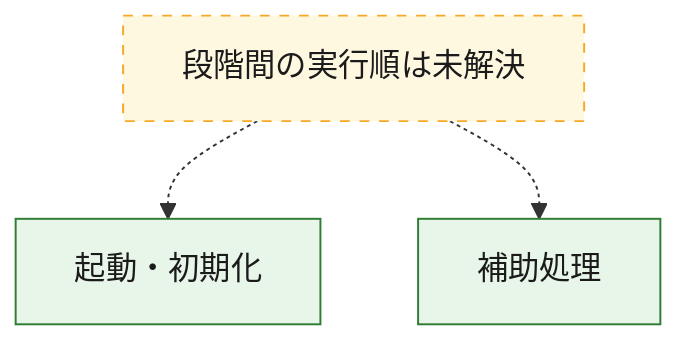
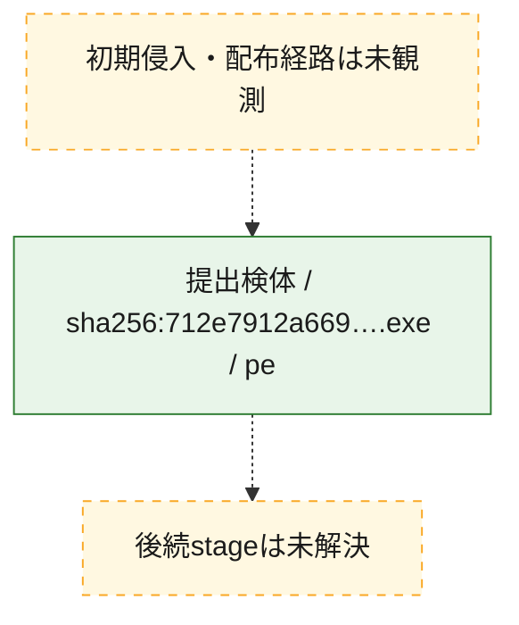
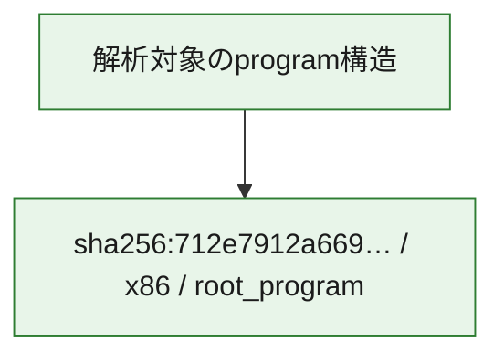

# 全体ロジック：712e7912a669a71a7006fd1a0333b5da45dbbc78672c46ae62e794fbc1372959

代表関数の静的証跡から、起動・初期化の処理群を確認しました。

## 読み方

- phaseの掲載順は解析上の整理順です。observed_call_edgesがない段階間の実行順を断定しません。
- 図の実線は静的に観測した関係、点線と黄色のノードは未観測・未解決の関係を示します。
- 図は静的な要約であり、動的実行を再現するものではありません。
- 詳細な関数解説とfingerprintは[STATIC-LOGIC.md](STATIC-LOGIC.md)を参照してください。

## 静的可視化

### 実行フロー

### 感染チェーン

### モジュール関係

## 処理段階

### 1. 起動・初期化

entry pointから初期化と後続処理への移行を確認します。
確度: `confirmed_static_function_evidence`

- `712e7912a669a71a7006fd1a0333b5da45dbbc78672c46ae62e794fbc1372959:ghidra:460001d00` — 初期化と主要処理への分岐を行う入口関数です。 状態: `succeeded`、選定理由: `entry_point`, `meaningful_symbol_name`, `reviewed_call_centrality:2`, `role:entrypoint`

### 2. 補助処理

主要処理を支える一般内部関数またはlibrary処理を確認します。
確度: `confirmed_static_function_evidence`

- `712e7912a669a71a7006fd1a0333b5da45dbbc78672c46ae62e794fbc1372959:ghidra:460001048` — 検体内部の一般処理を実装する関数です。 状態: `succeeded`、選定理由: `context_representative`, `reviewed_call_centrality:5`
- `712e7912a669a71a7006fd1a0333b5da45dbbc78672c46ae62e794fbc1372959:ghidra:4600011f8` — 検体内部の一般処理を実装する関数です。 状態: `succeeded`、選定理由: `context_representative`, `reviewed_call_centrality:3`
- `712e7912a669a71a7006fd1a0333b5da45dbbc78672c46ae62e794fbc1372959:ghidra:460001340` — 検体内部の一般処理を実装する関数です。 状態: `succeeded`、選定理由: `context_representative`
- `712e7912a669a71a7006fd1a0333b5da45dbbc78672c46ae62e794fbc1372959:ghidra:4600013a0` — 検体内部の一般処理を実装する関数です。 状態: `succeeded`、選定理由: `context_representative`, `reviewed_call_centrality:4`
- `712e7912a669a71a7006fd1a0333b5da45dbbc78672c46ae62e794fbc1372959:ghidra:460001420` — 検体内部の一般処理を実装する関数です。 状態: `succeeded`、選定理由: `context_representative`, `reviewed_call_centrality:11`
- `712e7912a669a71a7006fd1a0333b5da45dbbc78672c46ae62e794fbc1372959:ghidra:4600019c8` — 検体内部の一般処理を実装する関数です。 状態: `succeeded`、選定理由: `context_representative`, `reviewed_call_centrality:2`
- `712e7912a669a71a7006fd1a0333b5da45dbbc78672c46ae62e794fbc1372959:ghidra:460001a50` — 検体内部の一般処理を実装する関数です。 状態: `succeeded`、選定理由: `context_representative`, `reviewed_call_centrality:9`
- `712e7912a669a71a7006fd1a0333b5da45dbbc78672c46ae62e794fbc1372959:ghidra:460003974` — 検体内部の一般処理を実装する関数です。 状態: `succeeded`、選定理由: `context_representative`, `reviewed_call_centrality:3`
- `712e7912a669a71a7006fd1a0333b5da45dbbc78672c46ae62e794fbc1372959:ghidra:460003b10` — 検体内部の一般処理を実装する関数です。 状態: `succeeded`、選定理由: `context_representative`, `reviewed_call_centrality:2`
- `712e7912a669a71a7006fd1a0333b5da45dbbc78672c46ae62e794fbc1372959:ghidra:460003bdc` — 検体内部の一般処理を実装する関数です。 状態: `succeeded`、選定理由: `context_representative`
- `712e7912a669a71a7006fd1a0333b5da45dbbc78672c46ae62e794fbc1372959:ghidra:460003c50` — 検体内部の一般処理を実装する関数です。 状態: `succeeded`、選定理由: `context_representative`, `reviewed_call_centrality:3`
- `712e7912a669a71a7006fd1a0333b5da45dbbc78672c46ae62e794fbc1372959:ghidra:460003ddc` — 検体内部の一般処理を実装する関数です。 状態: `succeeded`、選定理由: `context_representative`, `reviewed_call_centrality:1`
- `712e7912a669a71a7006fd1a0333b5da45dbbc78672c46ae62e794fbc1372959:ghidra:460003ed0` — 検体内部の一般処理を実装する関数です。 状態: `succeeded`、選定理由: `context_representative`
- `712e7912a669a71a7006fd1a0333b5da45dbbc78672c46ae62e794fbc1372959:ghidra:460003f54` — 検体内部の一般処理を実装する関数です。 状態: `succeeded`、選定理由: `context_representative`
- `712e7912a669a71a7006fd1a0333b5da45dbbc78672c46ae62e794fbc1372959:ghidra:460003fa0` — 検体内部の一般処理を実装する関数です。 状態: `succeeded`、選定理由: `context_representative`, `reviewed_call_centrality:1`
- `712e7912a669a71a7006fd1a0333b5da45dbbc78672c46ae62e794fbc1372959:ghidra:460004038` — 検体内部の一般処理を実装する関数です。 状態: `succeeded`、選定理由: `context_representative`, `reviewed_call_centrality:8`
- `712e7912a669a71a7006fd1a0333b5da45dbbc78672c46ae62e794fbc1372959:ghidra:4600040dc` — 検体内部の一般処理を実装する関数です。 状態: `succeeded`、選定理由: `context_representative`, `reviewed_call_centrality:6`
- `712e7912a669a71a7006fd1a0333b5da45dbbc78672c46ae62e794fbc1372959:ghidra:460004250` — 検体内部の一般処理を実装する関数です。 状態: `succeeded`、選定理由: `context_representative`, `reviewed_call_centrality:2`
- `712e7912a669a71a7006fd1a0333b5da45dbbc78672c46ae62e794fbc1372959:ghidra:4600042f4` — 検体内部の一般処理を実装する関数です。 状態: `succeeded`、選定理由: `context_representative`
- `712e7912a669a71a7006fd1a0333b5da45dbbc78672c46ae62e794fbc1372959:ghidra:4600043c4` — 検体内部の一般処理を実装する関数です。 状態: `succeeded`、選定理由: `context_representative`, `reviewed_call_centrality:4`
- `712e7912a669a71a7006fd1a0333b5da45dbbc78672c46ae62e794fbc1372959:ghidra:460004934` — 検体内部の一般処理を実装する関数です。 状態: `succeeded`、選定理由: `context_representative`, `reviewed_call_centrality:12`
- `712e7912a669a71a7006fd1a0333b5da45dbbc78672c46ae62e794fbc1372959:ghidra:460004de8` — 検体内部の一般処理を実装する関数です。 状態: `succeeded`、選定理由: `context_representative`, `reviewed_call_centrality:40`
- `712e7912a669a71a7006fd1a0333b5da45dbbc78672c46ae62e794fbc1372959:ghidra:4600067f0` — 検体内部の一般処理を実装する関数です。 状態: `succeeded`、選定理由: `context_representative`, `reviewed_call_centrality:47`
- `712e7912a669a71a7006fd1a0333b5da45dbbc78672c46ae62e794fbc1372959:ghidra:460007398` — 検体内部の一般処理を実装する関数です。 状態: `succeeded`、選定理由: `context_representative`, `reviewed_call_centrality:12`
- `712e7912a669a71a7006fd1a0333b5da45dbbc78672c46ae62e794fbc1372959:ghidra:4600074d4` — 検体内部の一般処理を実装する関数です。 状態: `succeeded`、選定理由: `context_representative`, `reviewed_call_centrality:10`
- `712e7912a669a71a7006fd1a0333b5da45dbbc78672c46ae62e794fbc1372959:ghidra:4600077a8` — 検体内部の一般処理を実装する関数です。 状態: `succeeded`、選定理由: `context_representative`, `reviewed_call_centrality:1`
- `712e7912a669a71a7006fd1a0333b5da45dbbc78672c46ae62e794fbc1372959:ghidra:46000790c` — 検体内部の一般処理を実装する関数です。 状態: `succeeded`、選定理由: `context_representative`, `reviewed_call_centrality:10`
- `712e7912a669a71a7006fd1a0333b5da45dbbc78672c46ae62e794fbc1372959:ghidra:460007b00` — 検体内部の一般処理を実装する関数です。 状態: `succeeded`、選定理由: `context_representative`, `reviewed_call_centrality:25`
- `712e7912a669a71a7006fd1a0333b5da45dbbc78672c46ae62e794fbc1372959:ghidra:4600081f8` — 検体内部の一般処理を実装する関数です。 状態: `succeeded`、選定理由: `context_representative`, `reviewed_call_centrality:26`
- `712e7912a669a71a7006fd1a0333b5da45dbbc78672c46ae62e794fbc1372959:ghidra:460008dc0` — 検体内部の一般処理を実装する関数です。 状態: `succeeded`、選定理由: `context_representative`, `reviewed_call_centrality:3`
- `712e7912a669a71a7006fd1a0333b5da45dbbc78672c46ae62e794fbc1372959:ghidra:460008f50` — 検体内部の一般処理を実装する関数です。 状態: `succeeded`、選定理由: `context_representative`, `reviewed_call_centrality:7`

## 観測したcall関係

- 代表関数間で直接解決できた呼出関係はありません。

## 解析範囲と制約

- 選定外関数は全体inventoryへ残しますが、関数本体の個別解説対象にはしていません。
- indirect call、難読化、packer、VM、壊れたcontrol flowによりcall関係が欠落する場合があります。
- 文書は静的解析に基づき、検体実行や外部通信による動的確認は行っていません。
