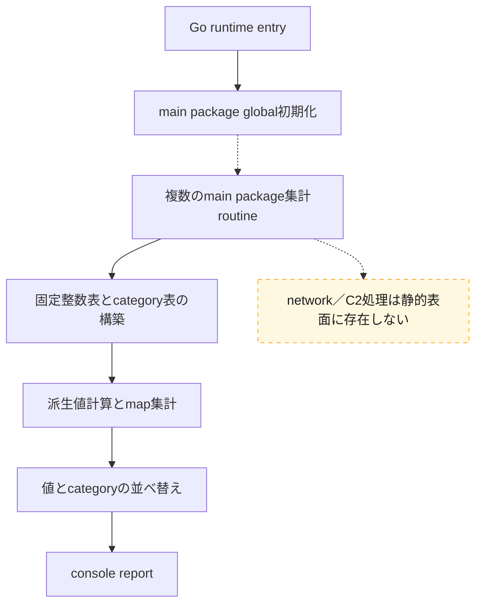
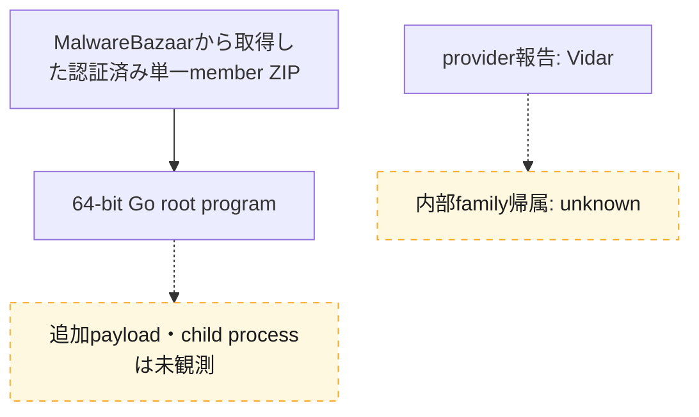
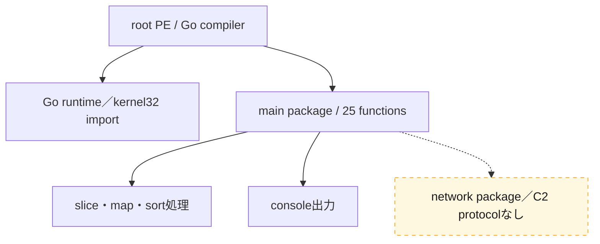

# 全体ロジック：79399d2ccde8a358e1f62b9422e4ba4d337d14b293f0d351b5f611549188cf19

追加静的解析では、root program内に固定整数表の計算、map集計、並べ替え、console reportを確認しました。配布経路、別stage、network moduleは観測していません。

## 読み方

- 実線はGhidraで静的に確認した関係です。
- 点線は未観測または未解決の関係です。
- phaseの掲載順は解析上の整理順であり、観測していない実行順を補いません。
- 関数別の根拠とfingerprintは[STATIC-LOGIC.md](STATIC-LOGIC.md)を参照してください。

## 実行フロー

`main.main`はGhidra上でstubとして認識され、application routine間の直接edgeは完全には復元できません。各routine内部の処理順は実線で示し、entryから個別routineへの未解決dispatchは点線としています。

## 感染チェーン

配布元labelは収集文脈であり、code lineageの実線根拠には使用していません。

## モジュール関係

## 比較プロファイル

| 軸 | この検体 | Vidar 3.0のreview済みケース |
|---|---|---|
| compiler／形式 | Go、64-bit PE | native 64-bit PE |
| 設定復号 | なし | 反復XOR設定record |
| network表面 | network package／APIなし | dead-drop URLと設定parserあり |
| application関数 | 数値表、map、sort、console | 設定entry、record parser、decoder |
| C2判定 | `no_c2_capability_verified` | final C2未解決、dead-drop確認 |

形式、関数役割、設定schema、network能力の4軸が一致しないため、provider labelだけでVidar類似とは判定しません。

## 制約

- 検体を実行していないため、動的なconsole内容や親子processは確認していません。
- `main.main`のstub化によりruntimeから個別routineへの完全なcall edgeは未復元です。
- family帰属には由来既知の比較検体または配布文脈の独立証拠が必要です。
