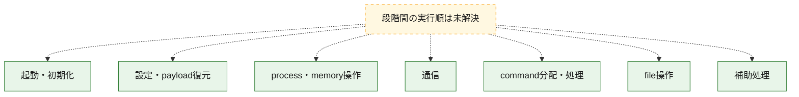
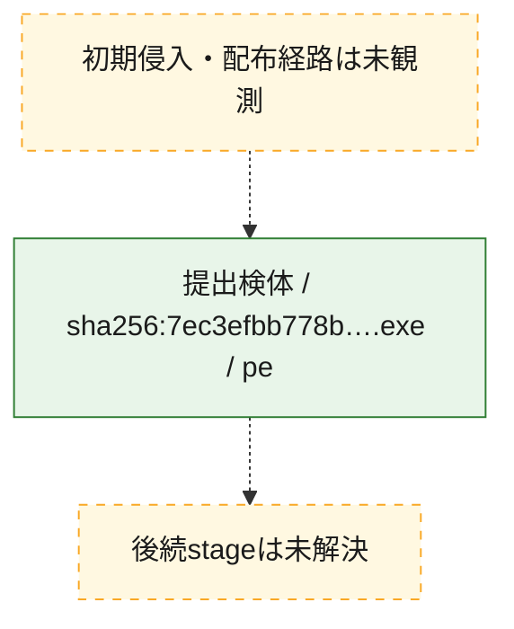
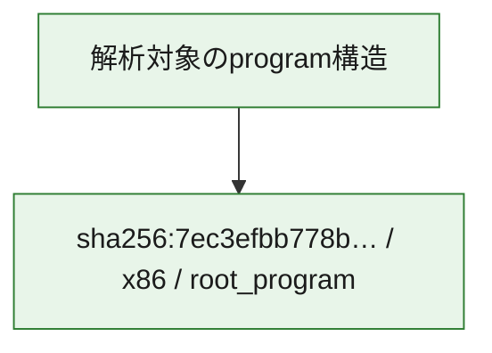

# 全体ロジック：7ec3efbb778bf3151bcc92213aef6f7b789569978eaf7beda4b79e47f26dc7ac

代表関数の静的証跡から、起動・初期化、設定・payload復元、process・memory操作、通信、command分配・処理、file操作の処理群を確認しました。

## 読み方

- phaseの掲載順は解析上の整理順です。observed_call_edgesがない段階間の実行順を断定しません。
- 図の実線は静的に観測した関係、点線と黄色のノードは未観測・未解決の関係を示します。
- 図は静的な要約であり、動的実行を再現するものではありません。
- 詳細な関数解説とfingerprintは[STATIC-LOGIC.md](STATIC-LOGIC.md)を参照してください。

## 静的可視化

### 実行フロー

### 感染チェーン

### モジュール関係

## 処理段階

### 1. 起動・初期化

entry pointから初期化と後続処理への移行を確認します。
確度: `confirmed_static_function_evidence`

- `7ec3efbb778bf3151bcc92213aef6f7b789569978eaf7beda4b79e47f26dc7ac:ghidra:1400ab900` — 初期化と主要処理への分岐を行う入口関数です。 状態: `succeeded`、選定理由: `entry_point`, `meaningful_symbol_name`, `probable_go_main_user_code`, `reviewed_call_centrality:4`, `role:entrypoint`
- `7ec3efbb778bf3151bcc92213aef6f7b789569978eaf7beda4b79e47f26dc7ac:ghidra:1400abc80` — 初期化と主要処理への分岐を行う入口関数です。 状態: `succeeded`、選定理由: `entry_point`, `meaningful_symbol_name`, `probable_go_main_user_code`, `reviewed_call_centrality:4`, `role:entrypoint`
- `7ec3efbb778bf3151bcc92213aef6f7b789569978eaf7beda4b79e47f26dc7ac:ghidra:1400abd20` — 初期化と主要処理への分岐を行う入口関数です。 状態: `succeeded`、選定理由: `entry_point`, `meaningful_symbol_name`, `probable_go_main_user_code`, `reviewed_call_centrality:23`, `role:entrypoint`
- `7ec3efbb778bf3151bcc92213aef6f7b789569978eaf7beda4b79e47f26dc7ac:ghidra:1400b0e80` — 初期化と主要処理への分岐を行う入口関数です。 状態: `succeeded`、選定理由: `entry_point`, `meaningful_symbol_name`, `probable_go_main_user_code`, `reviewed_call_centrality:21`, `role:entrypoint`
- `7ec3efbb778bf3151bcc92213aef6f7b789569978eaf7beda4b79e47f26dc7ac:ghidra:1400b2a60` — 初期化と主要処理への分岐を行う入口関数です。 状態: `succeeded`、選定理由: `entry_point`, `meaningful_symbol_name`, `probable_go_main_user_code`, `reviewed_call_centrality:21`, `role:entrypoint`
- `7ec3efbb778bf3151bcc92213aef6f7b789569978eaf7beda4b79e47f26dc7ac:ghidra:1400b95c0` — 初期化と主要処理への分岐を行う入口関数です。 状態: `succeeded`、選定理由: `entry_point`, `meaningful_symbol_name`, `probable_go_main_user_code`, `reviewed_call_centrality:21`, `role:entrypoint`
- `7ec3efbb778bf3151bcc92213aef6f7b789569978eaf7beda4b79e47f26dc7ac:ghidra:1400bf400` — 初期化と主要処理への分岐を行う入口関数です。 状態: `succeeded`、選定理由: `entry_point`, `meaningful_symbol_name`, `probable_go_main_user_code`, `reviewed_call_centrality:67`, `role:entrypoint`
- `7ec3efbb778bf3151bcc92213aef6f7b789569978eaf7beda4b79e47f26dc7ac:ghidra:1400c8440` — 初期化と主要処理への分岐を行う入口関数です。 状態: `succeeded`、選定理由: `entry_point`, `meaningful_symbol_name`, `probable_go_main_user_code`, `reviewed_call_centrality:22`, `role:entrypoint`
- `7ec3efbb778bf3151bcc92213aef6f7b789569978eaf7beda4b79e47f26dc7ac:ghidra:1400ce2a0` — 初期化と主要処理への分岐を行う入口関数です。 状態: `succeeded`、選定理由: `entry_point`, `meaningful_symbol_name`, `probable_go_main_user_code`, `reviewed_call_centrality:24`, `role:entrypoint`
- `7ec3efbb778bf3151bcc92213aef6f7b789569978eaf7beda4b79e47f26dc7ac:ghidra:1400d4220` — 初期化と主要処理への分岐を行う入口関数です。 状態: `succeeded`、選定理由: `entry_point`, `meaningful_symbol_name`, `probable_go_main_user_code`, `reviewed_call_centrality:23`, `role:entrypoint`
- `7ec3efbb778bf3151bcc92213aef6f7b789569978eaf7beda4b79e47f26dc7ac:ghidra:1400dbc40` — 初期化と主要処理への分岐を行う入口関数です。 状態: `succeeded`、選定理由: `entry_point`, `meaningful_symbol_name`, `probable_go_main_user_code`, `reviewed_call_centrality:20`, `role:entrypoint`
- `7ec3efbb778bf3151bcc92213aef6f7b789569978eaf7beda4b79e47f26dc7ac:ghidra:1400e0c80` — 初期化と主要処理への分岐を行う入口関数です。 状態: `succeeded`、選定理由: `entry_point`, `meaningful_symbol_name`, `probable_go_main_user_code`, `reviewed_call_centrality:21`, `role:entrypoint`
- `7ec3efbb778bf3151bcc92213aef6f7b789569978eaf7beda4b79e47f26dc7ac:ghidra:1400e7820` — 初期化と主要処理への分岐を行う入口関数です。 状態: `succeeded`、選定理由: `entry_point`, `meaningful_symbol_name`, `probable_go_main_user_code`, `reviewed_call_centrality:21`, `role:entrypoint`
- `7ec3efbb778bf3151bcc92213aef6f7b789569978eaf7beda4b79e47f26dc7ac:ghidra:1400ebbe0` — 初期化と主要処理への分岐を行う入口関数です。 状態: `succeeded`、選定理由: `entry_point`, `meaningful_symbol_name`, `probable_go_main_user_code`, `reviewed_call_centrality:21`, `role:entrypoint`
- `7ec3efbb778bf3151bcc92213aef6f7b789569978eaf7beda4b79e47f26dc7ac:ghidra:1400f2920` — 初期化と主要処理への分岐を行う入口関数です。 状態: `succeeded`、選定理由: `entry_point`, `meaningful_symbol_name`, `probable_go_main_user_code`, `reviewed_call_centrality:25`, `role:entrypoint`
- `7ec3efbb778bf3151bcc92213aef6f7b789569978eaf7beda4b79e47f26dc7ac:ghidra:1400f7aa0` — 初期化と主要処理への分岐を行う入口関数です。 状態: `succeeded`、選定理由: `entry_point`, `meaningful_symbol_name`, `probable_go_main_user_code`, `reviewed_call_centrality:22`, `role:entrypoint`
- `7ec3efbb778bf3151bcc92213aef6f7b789569978eaf7beda4b79e47f26dc7ac:ghidra:1400fbf40` — 初期化と主要処理への分岐を行う入口関数です。 状態: `succeeded`、選定理由: `entry_point`, `meaningful_symbol_name`, `probable_go_main_user_code`, `reviewed_call_centrality:20`, `role:entrypoint`
- `7ec3efbb778bf3151bcc92213aef6f7b789569978eaf7beda4b79e47f26dc7ac:ghidra:140100fa0` — 初期化と主要処理への分岐を行う入口関数です。 状態: `succeeded`、選定理由: `entry_point`, `meaningful_symbol_name`, `probable_go_main_user_code`, `reviewed_call_centrality:22`, `role:entrypoint`
- `7ec3efbb778bf3151bcc92213aef6f7b789569978eaf7beda4b79e47f26dc7ac:ghidra:1401048a0` — 初期化と主要処理への分岐を行う入口関数です。 状態: `succeeded`、選定理由: `entry_point`, `meaningful_symbol_name`, `probable_go_main_user_code`, `reviewed_call_centrality:21`, `role:entrypoint`
- `7ec3efbb778bf3151bcc92213aef6f7b789569978eaf7beda4b79e47f26dc7ac:ghidra:140109a60` — 初期化と主要処理への分岐を行う入口関数です。 状態: `succeeded`、選定理由: `entry_point`, `meaningful_symbol_name`, `probable_go_main_user_code`, `reviewed_call_centrality:25`, `role:entrypoint`
- `7ec3efbb778bf3151bcc92213aef6f7b789569978eaf7beda4b79e47f26dc7ac:ghidra:1401106a0` — 初期化と主要処理への分岐を行う入口関数です。 状態: `succeeded`、選定理由: `entry_point`, `meaningful_symbol_name`, `probable_go_main_user_code`, `reviewed_call_centrality:21`, `role:entrypoint`
- `7ec3efbb778bf3151bcc92213aef6f7b789569978eaf7beda4b79e47f26dc7ac:ghidra:140115700` — 初期化と主要処理への分岐を行う入口関数です。 状態: `succeeded`、選定理由: `entry_point`, `meaningful_symbol_name`, `probable_go_main_user_code`, `reviewed_call_centrality:23`, `role:entrypoint`
- `7ec3efbb778bf3151bcc92213aef6f7b789569978eaf7beda4b79e47f26dc7ac:ghidra:14011b5c0` — 初期化と主要処理への分岐を行う入口関数です。 状態: `succeeded`、選定理由: `entry_point`, `meaningful_symbol_name`, `probable_go_main_user_code`, `reviewed_call_centrality:21`, `role:entrypoint`
- `7ec3efbb778bf3151bcc92213aef6f7b789569978eaf7beda4b79e47f26dc7ac:ghidra:14011de80` — 初期化と主要処理への分岐を行う入口関数です。 状態: `succeeded`、選定理由: `entry_point`, `meaningful_symbol_name`, `probable_go_main_user_code`, `reviewed_call_centrality:21`, `role:entrypoint`

### 2. 設定・payload復元

設定、resource、payload、暗号化データの復元・変換を確認します。
確度: `confirmed_static_function_evidence`

- `7ec3efbb778bf3151bcc92213aef6f7b789569978eaf7beda4b79e47f26dc7ac:ghidra:1400862e0` — 設定、resource、payloadなどの解析・変換を行う関数です。 状態: `succeeded`、選定理由: `meaningful_symbol_name`, `reviewed_call_centrality:4`, `role:config_or_data_transform`
- `7ec3efbb778bf3151bcc92213aef6f7b789569978eaf7beda4b79e47f26dc7ac:ghidra:1402ed340` — 暗号、hash、encoding、または復号処理に関係する関数です。 状態: `succeeded`、選定理由: `meaningful_symbol_name`, `reviewed_call_centrality:4`, `role:cryptographic_transform`

### 3. process・memory操作

process、thread、module、memory操作と実行移行を確認します。
確度: `confirmed_static_function_evidence`

- `7ec3efbb778bf3151bcc92213aef6f7b789569978eaf7beda4b79e47f26dc7ac:ghidra:14008f8a0` — process、thread、module、またはmemory操作に関係する関数です。 状態: `succeeded`、選定理由: `meaningful_symbol_name`, `reviewed_call_centrality:6`, `role:process_or_memory_operation`

### 4. 通信

通信初期化、endpoint処理、送受信の役割を確認します。
確度: `confirmed_static_function_evidence`

- `7ec3efbb778bf3151bcc92213aef6f7b789569978eaf7beda4b79e47f26dc7ac:ghidra:1400901c0` — 通信初期化、送受信、またはendpoint処理に関係する関数です。 状態: `succeeded`、選定理由: `meaningful_symbol_name`, `reviewed_call_centrality:6`, `role:network_communication`

### 5. command分配・処理

受信commandやtaskの解釈、分配、個別handlerへの移行を確認します。
確度: `confirmed_static_function_evidence`

- `7ec3efbb778bf3151bcc92213aef6f7b789569978eaf7beda4b79e47f26dc7ac:ghidra:14008f3c0` — commandの解釈、分配、または個別処理を担当する関数です。 状態: `succeeded`、選定理由: `meaningful_symbol_name`, `reviewed_call_centrality:5`, `role:command_dispatch_or_handler`

### 6. file操作

fileやdirectoryの作成、読書き、削除を確認します。
確度: `confirmed_static_function_evidence`

- `7ec3efbb778bf3151bcc92213aef6f7b789569978eaf7beda4b79e47f26dc7ac:ghidra:14008fd80` — fileまたはdirectoryの読書き・管理に関係する関数です。 状態: `succeeded`、選定理由: `meaningful_symbol_name`, `reviewed_call_centrality:6`, `role:file_operation`

### 7. 補助処理

主要処理を支える一般内部関数またはlibrary処理を確認します。
確度: `confirmed_static_function_evidence`

- `7ec3efbb778bf3151bcc92213aef6f7b789569978eaf7beda4b79e47f26dc7ac:ghidra:140001080` — compiler生成処理または汎用library処理とみられる関数です。 状態: `succeeded`、選定理由: `meaningful_symbol_name`, `reviewed_call_centrality:5`
- `7ec3efbb778bf3151bcc92213aef6f7b789569978eaf7beda4b79e47f26dc7ac:ghidra:1400757c0` — 検体内部の一般処理を実装する関数です。 状態: `succeeded`、選定理由: `meaningful_symbol_name`, `reviewed_call_centrality:3`

## 観測したcall関係

- `ghidra-function:03ed9d4af88adc6970943c74` → `ghidra-external:0c62e6349f3e6f0421244492` （`unclassified` → `unclassified`）
- `ghidra-function:03ed9d4af88adc6970943c74` → `ghidra-external:0e9cbcc55bd2645146629848` （`unclassified` → `unclassified`）
- `ghidra-function:03ed9d4af88adc6970943c74` → `ghidra-external:38de18bcc7974cf1bde2ccac` （`unclassified` → `unclassified`）
- `ghidra-function:03ed9d4af88adc6970943c74` → `ghidra-external:3eab0f4a17fd4c0eaf4a1992` （`unclassified` → `unclassified`）
- `ghidra-function:03ed9d4af88adc6970943c74` → `ghidra-external:45c5530fb56a6c84b09145b3` （`unclassified` → `unclassified`）
- `ghidra-function:03ed9d4af88adc6970943c74` → `ghidra-external:5015d193559ba60c6b9b5c94` （`unclassified` → `unclassified`）
- `ghidra-function:03ed9d4af88adc6970943c74` → `ghidra-external:59890592839227bf04e357f4` （`unclassified` → `unclassified`）
- `ghidra-function:03ed9d4af88adc6970943c74` → `ghidra-external:6bf3d3ceb1c62633bbdd6991` （`unclassified` → `unclassified`）
- `ghidra-function:03ed9d4af88adc6970943c74` → `ghidra-external:879bffb68d0794d015f6d083` （`unclassified` → `unclassified`）
- `ghidra-function:03ed9d4af88adc6970943c74` → `ghidra-external:96f3b096757cf8ae68665342` （`unclassified` → `unclassified`）
- `ghidra-function:03ed9d4af88adc6970943c74` → `ghidra-external:a300a4cb1bbbe21ede297351` （`unclassified` → `unclassified`）
- `ghidra-function:03ed9d4af88adc6970943c74` → `ghidra-external:a4a5a9cb4cc59a84d3a17ce4` （`unclassified` → `unclassified`）
- `ghidra-function:03ed9d4af88adc6970943c74` → `ghidra-external:a97ed764a24bdd03cf336831` （`unclassified` → `unclassified`）
- `ghidra-function:03ed9d4af88adc6970943c74` → `ghidra-external:a99144c59ce0639074a3bb39` （`unclassified` → `unclassified`）
- `ghidra-function:03ed9d4af88adc6970943c74` → `ghidra-external:b7255e34e5504bdb9cc7b181` （`unclassified` → `unclassified`）
- `ghidra-function:03ed9d4af88adc6970943c74` → `ghidra-external:cbe0ef0f9b00f25b4bf0e917` （`unclassified` → `unclassified`）
- `ghidra-function:03ed9d4af88adc6970943c74` → `ghidra-external:cf2c44b8884b04e640758d9e` （`unclassified` → `unclassified`）
- `ghidra-function:03ed9d4af88adc6970943c74` → `ghidra-external:d6c91d25101e55e0fb21bcd9` （`unclassified` → `unclassified`）
- `ghidra-function:03ed9d4af88adc6970943c74` → `ghidra-external:d733bea1d89ca5147bff3556` （`unclassified` → `unclassified`）
- `ghidra-function:03ed9d4af88adc6970943c74` → `ghidra-external:e3a0d35b6562b89f1306bccf` （`unclassified` → `unclassified`）
- `ghidra-function:03ed9d4af88adc6970943c74` → `ghidra-external:eed2ff37af42411c1368f3ec` （`unclassified` → `unclassified`）
- `ghidra-function:08ec498a75b62520794b0bf1` → `ghidra-external:0c62e6349f3e6f0421244492` （`unclassified` → `unclassified`）
- `ghidra-function:08ec498a75b62520794b0bf1` → `ghidra-external:0e9cbcc55bd2645146629848` （`unclassified` → `unclassified`）
- `ghidra-function:08ec498a75b62520794b0bf1` → `ghidra-external:38de18bcc7974cf1bde2ccac` （`unclassified` → `unclassified`）
- `ghidra-function:08ec498a75b62520794b0bf1` → `ghidra-external:3eab0f4a17fd4c0eaf4a1992` （`unclassified` → `unclassified`）
- `ghidra-function:08ec498a75b62520794b0bf1` → `ghidra-external:45c5530fb56a6c84b09145b3` （`unclassified` → `unclassified`）
- `ghidra-function:08ec498a75b62520794b0bf1` → `ghidra-external:5015d193559ba60c6b9b5c94` （`unclassified` → `unclassified`）
- `ghidra-function:08ec498a75b62520794b0bf1` → `ghidra-external:59890592839227bf04e357f4` （`unclassified` → `unclassified`）
- `ghidra-function:08ec498a75b62520794b0bf1` → `ghidra-external:6bf3d3ceb1c62633bbdd6991` （`unclassified` → `unclassified`）
- `ghidra-function:08ec498a75b62520794b0bf1` → `ghidra-external:760cdc66371e98cfc3d04046` （`unclassified` → `unclassified`）
- `ghidra-function:08ec498a75b62520794b0bf1` → `ghidra-external:879bffb68d0794d015f6d083` （`unclassified` → `unclassified`）
- `ghidra-function:08ec498a75b62520794b0bf1` → `ghidra-external:96f3b096757cf8ae68665342` （`unclassified` → `unclassified`）
- `ghidra-function:08ec498a75b62520794b0bf1` → `ghidra-external:98464db9834128323a94a282` （`unclassified` → `unclassified`）
- `ghidra-function:08ec498a75b62520794b0bf1` → `ghidra-external:a300a4cb1bbbe21ede297351` （`unclassified` → `unclassified`）
- `ghidra-function:08ec498a75b62520794b0bf1` → `ghidra-external:a4a5a9cb4cc59a84d3a17ce4` （`unclassified` → `unclassified`）
- `ghidra-function:08ec498a75b62520794b0bf1` → `ghidra-external:a97ed764a24bdd03cf336831` （`unclassified` → `unclassified`）
- `ghidra-function:08ec498a75b62520794b0bf1` → `ghidra-external:a99144c59ce0639074a3bb39` （`unclassified` → `unclassified`）
- `ghidra-function:08ec498a75b62520794b0bf1` → `ghidra-external:abaa289c8317c53bd83149a5` （`unclassified` → `unclassified`）
- `ghidra-function:08ec498a75b62520794b0bf1` → `ghidra-external:cbe0ef0f9b00f25b4bf0e917` （`unclassified` → `unclassified`）
- `ghidra-function:08ec498a75b62520794b0bf1` → `ghidra-external:cf2c44b8884b04e640758d9e` （`unclassified` → `unclassified`）
- `ghidra-function:08ec498a75b62520794b0bf1` → `ghidra-external:d6c91d25101e55e0fb21bcd9` （`unclassified` → `unclassified`）
- `ghidra-function:08ec498a75b62520794b0bf1` → `ghidra-external:d733bea1d89ca5147bff3556` （`unclassified` → `unclassified`）
- `ghidra-function:08ec498a75b62520794b0bf1` → `ghidra-external:e3a0d35b6562b89f1306bccf` （`unclassified` → `unclassified`）
- `ghidra-function:08ec498a75b62520794b0bf1` → `ghidra-external:eed2ff37af42411c1368f3ec` （`unclassified` → `unclassified`）
- `ghidra-function:0db981324f1f11c6c3022300` → `ghidra-external:0c62e6349f3e6f0421244492` （`unclassified` → `unclassified`）
- `ghidra-function:0db981324f1f11c6c3022300` → `ghidra-external:5789c4ff101698af6a56400a` （`unclassified` → `unclassified`）
- `ghidra-function:0db981324f1f11c6c3022300` → `ghidra-external:a29e877e2777734542cc0265` （`unclassified` → `unclassified`）
- `ghidra-function:0db981324f1f11c6c3022300` → `ghidra-external:b45e6a81fc55c04d6ed8b4cf` （`unclassified` → `unclassified`）
- `ghidra-function:0db981324f1f11c6c3022300` → `ghidra-external:f852590c3fd8687f7947b5e7` （`unclassified` → `unclassified`）
- `ghidra-function:15178c6669dfb3135224872a` → `ghidra-external:0c62e6349f3e6f0421244492` （`unclassified` → `unclassified`）
- `ghidra-function:15178c6669dfb3135224872a` → `ghidra-external:888fd7399b28d2155402e466` （`unclassified` → `unclassified`）
- `ghidra-function:15178c6669dfb3135224872a` → `ghidra-external:c218a123c124a01feefd7b19` （`unclassified` → `unclassified`）
- `ghidra-function:15178c6669dfb3135224872a` → `ghidra-external:d525402f252c1315aebfed34` （`unclassified` → `unclassified`）
- `ghidra-function:19f2d937562d37e008c8dcc4` → `ghidra-external:0c62e6349f3e6f0421244492` （`unclassified` → `unclassified`）
- `ghidra-function:19f2d937562d37e008c8dcc4` → `ghidra-external:0e9cbcc55bd2645146629848` （`unclassified` → `unclassified`）
- `ghidra-function:19f2d937562d37e008c8dcc4` → `ghidra-external:38de18bcc7974cf1bde2ccac` （`unclassified` → `unclassified`）
- `ghidra-function:19f2d937562d37e008c8dcc4` → `ghidra-external:3eab0f4a17fd4c0eaf4a1992` （`unclassified` → `unclassified`）
- `ghidra-function:19f2d937562d37e008c8dcc4` → `ghidra-external:45c5530fb56a6c84b09145b3` （`unclassified` → `unclassified`）
- `ghidra-function:19f2d937562d37e008c8dcc4` → `ghidra-external:5015d193559ba60c6b9b5c94` （`unclassified` → `unclassified`）
- `ghidra-function:19f2d937562d37e008c8dcc4` → `ghidra-external:59890592839227bf04e357f4` （`unclassified` → `unclassified`）
- `ghidra-function:19f2d937562d37e008c8dcc4` → `ghidra-external:6bf3d3ceb1c62633bbdd6991` （`unclassified` → `unclassified`）
- `ghidra-function:19f2d937562d37e008c8dcc4` → `ghidra-external:6de95c387e244ea114ddc005` （`unclassified` → `unclassified`）
- `ghidra-function:19f2d937562d37e008c8dcc4` → `ghidra-external:879bffb68d0794d015f6d083` （`unclassified` → `unclassified`）
- `ghidra-function:19f2d937562d37e008c8dcc4` → `ghidra-external:96f3b096757cf8ae68665342` （`unclassified` → `unclassified`）
- `ghidra-function:19f2d937562d37e008c8dcc4` → `ghidra-external:a300a4cb1bbbe21ede297351` （`unclassified` → `unclassified`）
- `ghidra-function:19f2d937562d37e008c8dcc4` → `ghidra-external:a4a5a9cb4cc59a84d3a17ce4` （`unclassified` → `unclassified`）
- `ghidra-function:19f2d937562d37e008c8dcc4` → `ghidra-external:a97ed764a24bdd03cf336831` （`unclassified` → `unclassified`）
- `ghidra-function:19f2d937562d37e008c8dcc4` → `ghidra-external:cbe0ef0f9b00f25b4bf0e917` （`unclassified` → `unclassified`）
- `ghidra-function:19f2d937562d37e008c8dcc4` → `ghidra-external:cf2c44b8884b04e640758d9e` （`unclassified` → `unclassified`）
- `ghidra-function:19f2d937562d37e008c8dcc4` → `ghidra-external:d25df8d4e929d1599ab1d26b` （`unclassified` → `unclassified`）
- `ghidra-function:19f2d937562d37e008c8dcc4` → `ghidra-external:d6c91d25101e55e0fb21bcd9` （`unclassified` → `unclassified`）
- `ghidra-function:19f2d937562d37e008c8dcc4` → `ghidra-external:d733bea1d89ca5147bff3556` （`unclassified` → `unclassified`）
- `ghidra-function:19f2d937562d37e008c8dcc4` → `ghidra-external:e3a0d35b6562b89f1306bccf` （`unclassified` → `unclassified`）
- `ghidra-function:19f2d937562d37e008c8dcc4` → `ghidra-external:eed2ff37af42411c1368f3ec` （`unclassified` → `unclassified`）
- `ghidra-function:1db4209fa74fb54c625ecf0b` → `ghidra-external:0c62e6349f3e6f0421244492` （`unclassified` → `unclassified`）
- `ghidra-function:1db4209fa74fb54c625ecf0b` → `ghidra-external:0f6b3c26a951f2febd166432` （`unclassified` → `unclassified`）
- `ghidra-function:1db4209fa74fb54c625ecf0b` → `ghidra-external:70ee7649c065a9bfc991eaef` （`unclassified` → `unclassified`）
- `ghidra-function:1db4209fa74fb54c625ecf0b` → `ghidra-external:9efa079c1b35d4428b1ad8eb` （`unclassified` → `unclassified`）
- `ghidra-function:1db4209fa74fb54c625ecf0b` → `ghidra-external:bfced9ad378357c74382ff64` （`unclassified` → `unclassified`）
- `ghidra-function:1db4209fa74fb54c625ecf0b` → `ghidra-external:cbe0ef0f9b00f25b4bf0e917` （`unclassified` → `unclassified`）
- `ghidra-function:205992e9280ff100d0cd3108` → `ghidra-external:56aa501ea064f422fff6ec72` （`unclassified` → `unclassified`）
- `ghidra-function:205992e9280ff100d0cd3108` → `ghidra-external:cbe0ef0f9b00f25b4bf0e917` （`unclassified` → `unclassified`）
- `ghidra-function:205992e9280ff100d0cd3108` → `ghidra-external:eed2ff37af42411c1368f3ec` （`unclassified` → `unclassified`）
- `ghidra-function:205992e9280ff100d0cd3108` → `ghidra-external:ff26da333879a1e1a1ee32ba` （`unclassified` → `unclassified`）
- `ghidra-function:3cb26a4e9d55b60ccbffde7b` → `ghidra-external:0434caa6075c2953af02de60` （`unclassified` → `unclassified`）
- `ghidra-function:3cb26a4e9d55b60ccbffde7b` → `ghidra-external:0c62e6349f3e6f0421244492` （`unclassified` → `unclassified`）
- `ghidra-function:3cb26a4e9d55b60ccbffde7b` → `ghidra-external:0e9cbcc55bd2645146629848` （`unclassified` → `unclassified`）
- `ghidra-function:3cb26a4e9d55b60ccbffde7b` → `ghidra-external:38de18bcc7974cf1bde2ccac` （`unclassified` → `unclassified`）
- `ghidra-function:3cb26a4e9d55b60ccbffde7b` → `ghidra-external:3eab0f4a17fd4c0eaf4a1992` （`unclassified` → `unclassified`）
- `ghidra-function:3cb26a4e9d55b60ccbffde7b` → `ghidra-external:45c5530fb56a6c84b09145b3` （`unclassified` → `unclassified`）
- `ghidra-function:3cb26a4e9d55b60ccbffde7b` → `ghidra-external:5015d193559ba60c6b9b5c94` （`unclassified` → `unclassified`）
- `ghidra-function:3cb26a4e9d55b60ccbffde7b` → `ghidra-external:59890592839227bf04e357f4` （`unclassified` → `unclassified`）
- `ghidra-function:3cb26a4e9d55b60ccbffde7b` → `ghidra-external:6bf3d3ceb1c62633bbdd6991` （`unclassified` → `unclassified`）
- `ghidra-function:3cb26a4e9d55b60ccbffde7b` → `ghidra-external:879bffb68d0794d015f6d083` （`unclassified` → `unclassified`）
- `ghidra-function:3cb26a4e9d55b60ccbffde7b` → `ghidra-external:96f3b096757cf8ae68665342` （`unclassified` → `unclassified`）
- `ghidra-function:3cb26a4e9d55b60ccbffde7b` → `ghidra-external:a300a4cb1bbbe21ede297351` （`unclassified` → `unclassified`）
- `ghidra-function:3cb26a4e9d55b60ccbffde7b` → `ghidra-external:a4a5a9cb4cc59a84d3a17ce4` （`unclassified` → `unclassified`）
- `ghidra-function:3cb26a4e9d55b60ccbffde7b` → `ghidra-external:a97ed764a24bdd03cf336831` （`unclassified` → `unclassified`）
- `ghidra-function:3cb26a4e9d55b60ccbffde7b` → `ghidra-external:cbe0ef0f9b00f25b4bf0e917` （`unclassified` → `unclassified`）
- `ghidra-function:3cb26a4e9d55b60ccbffde7b` → `ghidra-external:cf2c44b8884b04e640758d9e` （`unclassified` → `unclassified`）
- `ghidra-function:3cb26a4e9d55b60ccbffde7b` → `ghidra-external:d6c91d25101e55e0fb21bcd9` （`unclassified` → `unclassified`）
- `ghidra-function:3cb26a4e9d55b60ccbffde7b` → `ghidra-external:d733bea1d89ca5147bff3556` （`unclassified` → `unclassified`）
- `ghidra-function:3cb26a4e9d55b60ccbffde7b` → `ghidra-external:e3a0d35b6562b89f1306bccf` （`unclassified` → `unclassified`）
- `ghidra-function:3cb26a4e9d55b60ccbffde7b` → `ghidra-external:eed2ff37af42411c1368f3ec` （`unclassified` → `unclassified`）
- `ghidra-function:402e702ddf4c56c326486160` → `ghidra-external:0c62e6349f3e6f0421244492` （`unclassified` → `unclassified`）
- `ghidra-function:402e702ddf4c56c326486160` → `ghidra-external:0e9cbcc55bd2645146629848` （`unclassified` → `unclassified`）
- `ghidra-function:402e702ddf4c56c326486160` → `ghidra-external:18ff5ec1ac10ce55b24927f0` （`unclassified` → `unclassified`）
- `ghidra-function:402e702ddf4c56c326486160` → `ghidra-external:38de18bcc7974cf1bde2ccac` （`unclassified` → `unclassified`）
- `ghidra-function:402e702ddf4c56c326486160` → `ghidra-external:3eab0f4a17fd4c0eaf4a1992` （`unclassified` → `unclassified`）
- `ghidra-function:402e702ddf4c56c326486160` → `ghidra-external:45c5530fb56a6c84b09145b3` （`unclassified` → `unclassified`）
- `ghidra-function:402e702ddf4c56c326486160` → `ghidra-external:5015d193559ba60c6b9b5c94` （`unclassified` → `unclassified`）
- `ghidra-function:402e702ddf4c56c326486160` → `ghidra-external:59890592839227bf04e357f4` （`unclassified` → `unclassified`）
- `ghidra-function:402e702ddf4c56c326486160` → `ghidra-external:5ef92f893814761c1dae9e11` （`unclassified` → `unclassified`）
- `ghidra-function:402e702ddf4c56c326486160` → `ghidra-external:6bf3d3ceb1c62633bbdd6991` （`unclassified` → `unclassified`）
- `ghidra-function:402e702ddf4c56c326486160` → `ghidra-external:879bffb68d0794d015f6d083` （`unclassified` → `unclassified`）
- `ghidra-function:402e702ddf4c56c326486160` → `ghidra-external:96f3b096757cf8ae68665342` （`unclassified` → `unclassified`）
- `ghidra-function:402e702ddf4c56c326486160` → `ghidra-external:98464db9834128323a94a282` （`unclassified` → `unclassified`）
- `ghidra-function:402e702ddf4c56c326486160` → `ghidra-external:a300a4cb1bbbe21ede297351` （`unclassified` → `unclassified`）
- `ghidra-function:402e702ddf4c56c326486160` → `ghidra-external:a4a5a9cb4cc59a84d3a17ce4` （`unclassified` → `unclassified`）
- `ghidra-function:402e702ddf4c56c326486160` → `ghidra-external:a97ed764a24bdd03cf336831` （`unclassified` → `unclassified`）
- `ghidra-function:402e702ddf4c56c326486160` → `ghidra-external:a99144c59ce0639074a3bb39` （`unclassified` → `unclassified`）
- `ghidra-function:402e702ddf4c56c326486160` → `ghidra-external:b7255e34e5504bdb9cc7b181` （`unclassified` → `unclassified`）
- `ghidra-function:402e702ddf4c56c326486160` → `ghidra-external:cbe0ef0f9b00f25b4bf0e917` （`unclassified` → `unclassified`）
- `ghidra-function:402e702ddf4c56c326486160` → `ghidra-external:cf2c44b8884b04e640758d9e` （`unclassified` → `unclassified`）
- `ghidra-function:402e702ddf4c56c326486160` → `ghidra-external:d6c91d25101e55e0fb21bcd9` （`unclassified` → `unclassified`）
- `ghidra-function:402e702ddf4c56c326486160` → `ghidra-external:d733bea1d89ca5147bff3556` （`unclassified` → `unclassified`）
- `ghidra-function:402e702ddf4c56c326486160` → `ghidra-external:e3a0d35b6562b89f1306bccf` （`unclassified` → `unclassified`）
- `ghidra-function:402e702ddf4c56c326486160` → `ghidra-external:eed2ff37af42411c1368f3ec` （`unclassified` → `unclassified`）
- `ghidra-function:5870e09c07da3a13ab09a2d3` → `ghidra-external:0c62e6349f3e6f0421244492` （`unclassified` → `unclassified`）
- `ghidra-function:5870e09c07da3a13ab09a2d3` → `ghidra-external:0e9cbcc55bd2645146629848` （`unclassified` → `unclassified`）
- `ghidra-function:5870e09c07da3a13ab09a2d3` → `ghidra-external:38de18bcc7974cf1bde2ccac` （`unclassified` → `unclassified`）
- `ghidra-function:5870e09c07da3a13ab09a2d3` → `ghidra-external:3eab0f4a17fd4c0eaf4a1992` （`unclassified` → `unclassified`）
- `ghidra-function:5870e09c07da3a13ab09a2d3` → `ghidra-external:45c5530fb56a6c84b09145b3` （`unclassified` → `unclassified`）
- `ghidra-function:5870e09c07da3a13ab09a2d3` → `ghidra-external:5015d193559ba60c6b9b5c94` （`unclassified` → `unclassified`）
- `ghidra-function:5870e09c07da3a13ab09a2d3` → `ghidra-external:59890592839227bf04e357f4` （`unclassified` → `unclassified`）
- `ghidra-function:5870e09c07da3a13ab09a2d3` → `ghidra-external:6bf3d3ceb1c62633bbdd6991` （`unclassified` → `unclassified`）
- `ghidra-function:5870e09c07da3a13ab09a2d3` → `ghidra-external:760cdc66371e98cfc3d04046` （`unclassified` → `unclassified`）
- `ghidra-function:5870e09c07da3a13ab09a2d3` → `ghidra-external:879bffb68d0794d015f6d083` （`unclassified` → `unclassified`）
- `ghidra-function:5870e09c07da3a13ab09a2d3` → `ghidra-external:96f3b096757cf8ae68665342` （`unclassified` → `unclassified`）
- `ghidra-function:5870e09c07da3a13ab09a2d3` → `ghidra-external:a300a4cb1bbbe21ede297351` （`unclassified` → `unclassified`）
- `ghidra-function:5870e09c07da3a13ab09a2d3` → `ghidra-external:a4a5a9cb4cc59a84d3a17ce4` （`unclassified` → `unclassified`）
- `ghidra-function:5870e09c07da3a13ab09a2d3` → `ghidra-external:a97ed764a24bdd03cf336831` （`unclassified` → `unclassified`）
- `ghidra-function:5870e09c07da3a13ab09a2d3` → `ghidra-external:cbe0ef0f9b00f25b4bf0e917` （`unclassified` → `unclassified`）
- `ghidra-function:5870e09c07da3a13ab09a2d3` → `ghidra-external:cf2c44b8884b04e640758d9e` （`unclassified` → `unclassified`）
- `ghidra-function:5870e09c07da3a13ab09a2d3` → `ghidra-external:d6c91d25101e55e0fb21bcd9` （`unclassified` → `unclassified`）
- `ghidra-function:5870e09c07da3a13ab09a2d3` → `ghidra-external:d733bea1d89ca5147bff3556` （`unclassified` → `unclassified`）
- `ghidra-function:5870e09c07da3a13ab09a2d3` → `ghidra-external:dc9fa885a492317f28ccd2a7` （`unclassified` → `unclassified`）
- `ghidra-function:5870e09c07da3a13ab09a2d3` → `ghidra-external:e3a0d35b6562b89f1306bccf` （`unclassified` → `unclassified`）
- `ghidra-function:5870e09c07da3a13ab09a2d3` → `ghidra-external:eed2ff37af42411c1368f3ec` （`unclassified` → `unclassified`）
- `ghidra-function:5a6ec937306ae9541c57ac53` → `ghidra-external:0c62e6349f3e6f0421244492` （`unclassified` → `unclassified`）
- `ghidra-function:5a6ec937306ae9541c57ac53` → `ghidra-external:0e9cbcc55bd2645146629848` （`unclassified` → `unclassified`）
- `ghidra-function:5a6ec937306ae9541c57ac53` → `ghidra-external:38de18bcc7974cf1bde2ccac` （`unclassified` → `unclassified`）
- `ghidra-function:5a6ec937306ae9541c57ac53` → `ghidra-external:3eab0f4a17fd4c0eaf4a1992` （`unclassified` → `unclassified`）
- `ghidra-function:5a6ec937306ae9541c57ac53` → `ghidra-external:45c5530fb56a6c84b09145b3` （`unclassified` → `unclassified`）
- `ghidra-function:5a6ec937306ae9541c57ac53` → `ghidra-external:5015d193559ba60c6b9b5c94` （`unclassified` → `unclassified`）
- `ghidra-function:5a6ec937306ae9541c57ac53` → `ghidra-external:59890592839227bf04e357f4` （`unclassified` → `unclassified`）
- `ghidra-function:5a6ec937306ae9541c57ac53` → `ghidra-external:5b43559e4fb6794ecfdcc063` （`unclassified` → `unclassified`）
- `ghidra-function:5a6ec937306ae9541c57ac53` → `ghidra-external:6bf3d3ceb1c62633bbdd6991` （`unclassified` → `unclassified`）
- `ghidra-function:5a6ec937306ae9541c57ac53` → `ghidra-external:879bffb68d0794d015f6d083` （`unclassified` → `unclassified`）
- `ghidra-function:5a6ec937306ae9541c57ac53` → `ghidra-external:96f3b096757cf8ae68665342` （`unclassified` → `unclassified`）
- `ghidra-function:5a6ec937306ae9541c57ac53` → `ghidra-external:a300a4cb1bbbe21ede297351` （`unclassified` → `unclassified`）
- `ghidra-function:5a6ec937306ae9541c57ac53` → `ghidra-external:a4a5a9cb4cc59a84d3a17ce4` （`unclassified` → `unclassified`）
- `ghidra-function:5a6ec937306ae9541c57ac53` → `ghidra-external:a97ed764a24bdd03cf336831` （`unclassified` → `unclassified`）
- `ghidra-function:5a6ec937306ae9541c57ac53` → `ghidra-external:cbe0ef0f9b00f25b4bf0e917` （`unclassified` → `unclassified`）
- `ghidra-function:5a6ec937306ae9541c57ac53` → `ghidra-external:cf2c44b8884b04e640758d9e` （`unclassified` → `unclassified`）
- `ghidra-function:5a6ec937306ae9541c57ac53` → `ghidra-external:d6c91d25101e55e0fb21bcd9` （`unclassified` → `unclassified`）
- `ghidra-function:5a6ec937306ae9541c57ac53` → `ghidra-external:d733bea1d89ca5147bff3556` （`unclassified` → `unclassified`）
- `ghidra-function:5a6ec937306ae9541c57ac53` → `ghidra-external:d8ec8bf0ea77c5acc414679d` （`unclassified` → `unclassified`）
- `ghidra-function:5a6ec937306ae9541c57ac53` → `ghidra-external:e3a0d35b6562b89f1306bccf` （`unclassified` → `unclassified`）
- `ghidra-function:5a6ec937306ae9541c57ac53` → `ghidra-external:eed2ff37af42411c1368f3ec` （`unclassified` → `unclassified`）
- `ghidra-function:66d1acc02fa2c2c2dd600d09` → `ghidra-external:0c62e6349f3e6f0421244492` （`unclassified` → `unclassified`）
- `ghidra-function:66d1acc02fa2c2c2dd600d09` → `ghidra-external:0e9cbcc55bd2645146629848` （`unclassified` → `unclassified`）
- `ghidra-function:66d1acc02fa2c2c2dd600d09` → `ghidra-external:38de18bcc7974cf1bde2ccac` （`unclassified` → `unclassified`）
- `ghidra-function:66d1acc02fa2c2c2dd600d09` → `ghidra-external:3eab0f4a17fd4c0eaf4a1992` （`unclassified` → `unclassified`）
- `ghidra-function:66d1acc02fa2c2c2dd600d09` → `ghidra-external:45c5530fb56a6c84b09145b3` （`unclassified` → `unclassified`）
- `ghidra-function:66d1acc02fa2c2c2dd600d09` → `ghidra-external:5015d193559ba60c6b9b5c94` （`unclassified` → `unclassified`）
- `ghidra-function:66d1acc02fa2c2c2dd600d09` → `ghidra-external:59890592839227bf04e357f4` （`unclassified` → `unclassified`）
- `ghidra-function:66d1acc02fa2c2c2dd600d09` → `ghidra-external:6bf3d3ceb1c62633bbdd6991` （`unclassified` → `unclassified`）
- `ghidra-function:66d1acc02fa2c2c2dd600d09` → `ghidra-external:879bffb68d0794d015f6d083` （`unclassified` → `unclassified`）
- `ghidra-function:66d1acc02fa2c2c2dd600d09` → `ghidra-external:96f3b096757cf8ae68665342` （`unclassified` → `unclassified`）
- `ghidra-function:66d1acc02fa2c2c2dd600d09` → `ghidra-external:a300a4cb1bbbe21ede297351` （`unclassified` → `unclassified`）
- `ghidra-function:66d1acc02fa2c2c2dd600d09` → `ghidra-external:a4a5a9cb4cc59a84d3a17ce4` （`unclassified` → `unclassified`）
- `ghidra-function:66d1acc02fa2c2c2dd600d09` → `ghidra-external:a97ed764a24bdd03cf336831` （`unclassified` → `unclassified`）
- `ghidra-function:66d1acc02fa2c2c2dd600d09` → `ghidra-external:abaa289c8317c53bd83149a5` （`unclassified` → `unclassified`）
- `ghidra-function:66d1acc02fa2c2c2dd600d09` → `ghidra-external:cbe0ef0f9b00f25b4bf0e917` （`unclassified` → `unclassified`）
- `ghidra-function:66d1acc02fa2c2c2dd600d09` → `ghidra-external:cf2c44b8884b04e640758d9e` （`unclassified` → `unclassified`）
- `ghidra-function:66d1acc02fa2c2c2dd600d09` → `ghidra-external:d6c91d25101e55e0fb21bcd9` （`unclassified` → `unclassified`）
- `ghidra-function:66d1acc02fa2c2c2dd600d09` → `ghidra-external:d733bea1d89ca5147bff3556` （`unclassified` → `unclassified`）
- `ghidra-function:66d1acc02fa2c2c2dd600d09` → `ghidra-external:e3a0d35b6562b89f1306bccf` （`unclassified` → `unclassified`）
- `ghidra-function:66d1acc02fa2c2c2dd600d09` → `ghidra-external:eed2ff37af42411c1368f3ec` （`unclassified` → `unclassified`）
- `ghidra-function:682ac2cf01987be13ff9802a` → `ghidra-external:0c62e6349f3e6f0421244492` （`unclassified` → `unclassified`）
- `ghidra-function:682ac2cf01987be13ff9802a` → `ghidra-external:0e9cbcc55bd2645146629848` （`unclassified` → `unclassified`）
- `ghidra-function:682ac2cf01987be13ff9802a` → `ghidra-external:38de18bcc7974cf1bde2ccac` （`unclassified` → `unclassified`）
- `ghidra-function:682ac2cf01987be13ff9802a` → `ghidra-external:3eab0f4a17fd4c0eaf4a1992` （`unclassified` → `unclassified`）
- `ghidra-function:682ac2cf01987be13ff9802a` → `ghidra-external:45c5530fb56a6c84b09145b3` （`unclassified` → `unclassified`）
- `ghidra-function:682ac2cf01987be13ff9802a` → `ghidra-external:5015d193559ba60c6b9b5c94` （`unclassified` → `unclassified`）
- `ghidra-function:682ac2cf01987be13ff9802a` → `ghidra-external:59890592839227bf04e357f4` （`unclassified` → `unclassified`）
- `ghidra-function:682ac2cf01987be13ff9802a` → `ghidra-external:6bf3d3ceb1c62633bbdd6991` （`unclassified` → `unclassified`）
- `ghidra-function:682ac2cf01987be13ff9802a` → `ghidra-external:760cdc66371e98cfc3d04046` （`unclassified` → `unclassified`）
- `ghidra-function:682ac2cf01987be13ff9802a` → `ghidra-external:879bffb68d0794d015f6d083` （`unclassified` → `unclassified`）
- 残り373件は`static-logic.json`に記録しています。

## 解析範囲と制約

- 選定外関数は全体inventoryへ残しますが、関数本体の個別解説対象にはしていません。
- indirect call、難読化、packer、VM、壊れたcontrol flowによりcall関係が欠落する場合があります。
- 文書は静的解析に基づき、検体実行や外部通信による動的確認は行っていません。
