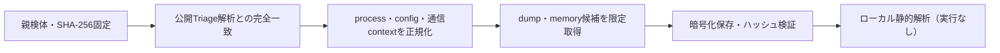

# Triage公開解析・後段取得証跡

## 完全ハッシュ一致

- [260924-hjaw6stz9k](https://tria.ge/260924-hjaw6stz9k): ファミリー候補 `vidar`、評価score `10`
- [260924-a29t8axz8r](https://tria.ge/260924-a29t8axz8r): ファミリー候補 `vidar`、評価score `10`

## プロセス・通信

- 観測process: `2026-09-23_deef36e5c2b4ace8c0ed01542fb16285_frostygoop_hive_luca-stealer_salatstealer_sliver.exe, 815474181729abbb340095d4b7a9a0e5b10858e6ab1d429dd0d6633646b8d49b.bin.exe`
- raw commandは保存せず、command SHA-256と処理patternだけをJSONへ保持します。
- sandbox background trafficは`context_only`であり、C2へ自動昇格しません。

- `https://65.109.8.10/`（sandbox config候補）
- `https://community.fandom.com/wikia.php`（sandbox config候補）
- `https://steamcommunity.com/profiles/76561198639924729`（sandbox config候補）
- `https://telegram.me/<redacted>`（sandbox config候補）

## 後段取得物

- `ffd427d35834f47c2f5ece66e0c26076cb769830028bf0f65773067cc88f97da` / `memory_image` / 2695168 bytes / 親と同一: `false` / 静的解析: `未実施`

## 判定境界

Triage由来のfamily、process、config、通信は外部sandbox証跡です。Config extractorが返したendpointはC2候補として扱いますが、静的設定復元またはprocess帰属とprotocol応答が揃うまでは確認済みC2とはしません。取得成果物と検体は実行していません。
