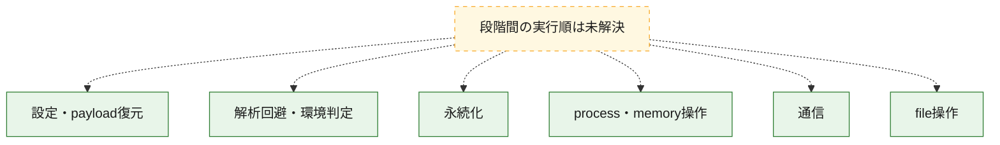
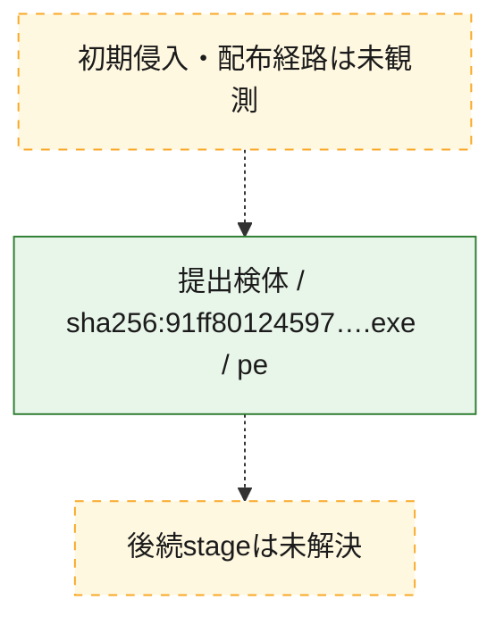
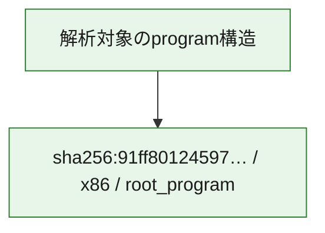

# 全体ロジック：91ff8012459769296998c26962f88e83c86c06b7f435dc167f1060a53bbdaae1

代表関数の静的証跡から、設定・payload復元、解析回避・環境判定、永続化、process・memory操作、通信、file操作の処理群を確認しました。

## 読み方

- phaseの掲載順は解析上の整理順です。observed_call_edgesがない段階間の実行順を断定しません。
- 図の実線は静的に観測した関係、点線と黄色のノードは未観測・未解決の関係を示します。
- 図は静的な要約であり、動的実行を再現するものではありません。
- 詳細な関数解説とfingerprintは[STATIC-LOGIC.md](STATIC-LOGIC.md)を参照してください。

## 静的可視化

### 実行フロー

### 感染チェーン

### モジュール関係

## 処理段階

### 1. 設定・payload復元

設定、resource、payload、暗号化データの復元・変換を確認します。
確度: `confirmed_static_function_evidence`

- `91ff8012459769296998c26962f88e83c86c06b7f435dc167f1060a53bbdaae1:ghidra:1400063c0` — 暗号、hash、encoding、または復号処理に関係する関数です。 状態: `succeeded`、選定理由: `call_graph_centrality:in=1,out=8`, `large_function:instructions=234`, `meaningful_symbol_name`, `reviewed_call_centrality:11`, `reviewed_call_centrality:23`, `role:cryptographic_transform`
- `91ff8012459769296998c26962f88e83c86c06b7f435dc167f1060a53bbdaae1:ghidra:140006960` — 暗号、hash、encoding、または復号処理に関係する関数です。 状態: `succeeded`、選定理由: `call_graph_centrality:in=1,out=8`, `large_function:instructions=238`, `meaningful_symbol_name`, `reviewed_call_centrality:11`, `reviewed_call_centrality:22`, `role:cryptographic_transform`
- `91ff8012459769296998c26962f88e83c86c06b7f435dc167f1060a53bbdaae1:ghidra:140007260` — 暗号、hash、encoding、または復号処理に関係する関数です。 状態: `succeeded`、選定理由: `call_graph_centrality:in=12,out=10`, `large_function:instructions=303`, `meaningful_symbol_name`, `reviewed_call_centrality:15`, `reviewed_call_centrality:37`, `role:cryptographic_transform`
- `91ff8012459769296998c26962f88e83c86c06b7f435dc167f1060a53bbdaae1:ghidra:140007d60` — 暗号、hash、encoding、または復号処理に関係する関数です。 状態: `succeeded`、選定理由: `call_graph_centrality:in=3,out=10`, `large_function:instructions=318`, `meaningful_symbol_name`, `reviewed_call_centrality:16`, `reviewed_call_centrality:28`, `role:cryptographic_transform`
- `91ff8012459769296998c26962f88e83c86c06b7f435dc167f1060a53bbdaae1:ghidra:1400085e0` — 暗号、hash、encoding、または復号処理に関係する関数です。 状態: `succeeded`、選定理由: `call_graph_centrality:in=2,out=8`, `large_function:instructions=389`, `meaningful_symbol_name`, `reviewed_call_centrality:12`, `reviewed_call_centrality:20`, `role:cryptographic_transform`
- `91ff8012459769296998c26962f88e83c86c06b7f435dc167f1060a53bbdaae1:ghidra:1400093a0` — 暗号、hash、encoding、または復号処理に関係する関数です。 状態: `succeeded`、選定理由: `call_graph_centrality:in=4,out=0`, `large_function:instructions=294`, `meaningful_symbol_name`, `reviewed_call_centrality:3`, `reviewed_call_centrality:6`, `role:cryptographic_transform`
- `91ff8012459769296998c26962f88e83c86c06b7f435dc167f1060a53bbdaae1:ghidra:140017740` — 暗号、hash、encoding、または復号処理に関係する関数です。 状態: `succeeded`、選定理由: `call_graph_centrality:in=1,out=16`, `large_function:instructions=356`, `meaningful_symbol_name`, `reviewed_call_centrality:31`, `reviewed_call_centrality:35`, `role:cryptographic_transform`
- `91ff8012459769296998c26962f88e83c86c06b7f435dc167f1060a53bbdaae1:ghidra:140017f00` — 暗号、hash、encoding、または復号処理に関係する関数です。 状態: `succeeded`、選定理由: `call_graph_centrality:in=0,out=9`, `large_function:instructions=118`, `meaningful_symbol_name`, `reviewed_call_centrality:16`, `reviewed_call_centrality:20`, `role:cryptographic_transform`
- `91ff8012459769296998c26962f88e83c86c06b7f435dc167f1060a53bbdaae1:ghidra:140024ea0` — 設定、resource、payloadなどの解析・変換を行う関数です。 状態: `succeeded`、選定理由: `call_graph_centrality:in=1,out=8`, `meaningful_symbol_name`, `reviewed_call_centrality:16`, `reviewed_call_centrality:18`, `role:config_or_data_transform`

### 2. 解析回避・環境判定

debugger、sandbox、仮想環境、時間差などの判定を確認します。
確度: `confirmed_static_function_evidence`

- `91ff8012459769296998c26962f88e83c86c06b7f435dc167f1060a53bbdaae1:ghidra:140001a20` — debugger、仮想環境、sandbox、または時間差の確認に関係する関数です。 状態: `succeeded`、選定理由: `call_graph_centrality:in=1,out=9`, `large_function:instructions=439`, `meaningful_symbol_name`, `reviewed_call_centrality:15`, `reviewed_call_centrality:19`, `role:anti_analysis`
- `91ff8012459769296998c26962f88e83c86c06b7f435dc167f1060a53bbdaae1:ghidra:140010fa0` — debugger、仮想環境、sandbox、または時間差の確認に関係する関数です。 状態: `succeeded`、選定理由: `call_graph_centrality:in=5,out=5`, `large_function:instructions=72`, `meaningful_symbol_name`, `reviewed_call_centrality:10`, `reviewed_call_centrality:18`, `role:anti_analysis`
- `91ff8012459769296998c26962f88e83c86c06b7f435dc167f1060a53bbdaae1:ghidra:1400257a0` — debugger、仮想環境、sandbox、または時間差の確認に関係する関数です。 状態: `succeeded`、選定理由: `call_graph_centrality:in=1,out=10`, `large_function:instructions=143`, `meaningful_symbol_name`, `reviewed_call_centrality:17`, `reviewed_call_centrality:25`, `role:anti_analysis`

### 3. 永続化

自動起動や永続化に関係する設定変更を確認します。
確度: `confirmed_static_function_evidence`

- `91ff8012459769296998c26962f88e83c86c06b7f435dc167f1060a53bbdaae1:ghidra:140014320` — 自動起動または永続化に関係する処理を含む関数です。 状態: `succeeded`、選定理由: `call_graph_centrality:in=16,out=1`, `meaningful_symbol_name`, `reviewed_call_centrality:19`, `reviewed_call_centrality:9`, `role:persistence`

### 4. process・memory操作

process、thread、module、memory操作と実行移行を確認します。
確度: `confirmed_static_function_evidence`

- `91ff8012459769296998c26962f88e83c86c06b7f435dc167f1060a53bbdaae1:ghidra:1400014e0` — process、thread、module、またはmemory操作に関係する関数です。 状態: `succeeded`、選定理由: `call_graph_centrality:in=1,out=8`, `large_function:instructions=305`, `meaningful_symbol_name`, `reviewed_call_centrality:16`, `reviewed_call_centrality:20`, `role:process_or_memory_operation`
- `91ff8012459769296998c26962f88e83c86c06b7f435dc167f1060a53bbdaae1:ghidra:14000a800` — process、thread、module、またはmemory操作に関係する関数です。 状態: `succeeded`、選定理由: `call_graph_centrality:in=1,out=12`, `large_function:instructions=126`, `meaningful_symbol_name`, `reviewed_call_centrality:22`, `reviewed_call_centrality:28`, `role:process_or_memory_operation`

### 5. 通信

通信初期化、endpoint処理、送受信の役割を確認します。
確度: `confirmed_static_function_evidence`

- `91ff8012459769296998c26962f88e83c86c06b7f435dc167f1060a53bbdaae1:ghidra:14000aa80` — 通信初期化、送受信、またはendpoint処理に関係する関数です。 状態: `succeeded`、選定理由: `call_graph_centrality:in=1,out=9`, `large_function:instructions=160`, `meaningful_symbol_name`, `reviewed_call_centrality:16`, `reviewed_call_centrality:20`, `role:network_communication`
- `91ff8012459769296998c26962f88e83c86c06b7f435dc167f1060a53bbdaae1:ghidra:14000b160` — 通信初期化、送受信、またはendpoint処理に関係する関数です。 状態: `succeeded`、選定理由: `call_graph_centrality:in=2,out=19`, `large_function:instructions=354`, `meaningful_symbol_name`, `reviewed_call_centrality:37`, `reviewed_call_centrality:38`, `role:network_communication`
- `91ff8012459769296998c26962f88e83c86c06b7f435dc167f1060a53bbdaae1:ghidra:14000c0a0` — 通信初期化、送受信、またはendpoint処理に関係する関数です。 状態: `succeeded`、選定理由: `call_graph_centrality:in=1,out=23`, `large_function:instructions=407`, `meaningful_symbol_name`, `reviewed_call_centrality:42`, `reviewed_call_centrality:46`, `role:network_communication`
- `91ff8012459769296998c26962f88e83c86c06b7f435dc167f1060a53bbdaae1:ghidra:14000c780` — 通信初期化、送受信、またはendpoint処理に関係する関数です。 状態: `succeeded`、選定理由: `call_graph_centrality:in=1,out=8`, `large_function:instructions=127`, `meaningful_symbol_name`, `reviewed_call_centrality:16`, `reviewed_call_centrality:18`, `role:network_communication`
- `91ff8012459769296998c26962f88e83c86c06b7f435dc167f1060a53bbdaae1:ghidra:1400115a0` — 通信初期化、送受信、またはendpoint処理に関係する関数です。 状態: `succeeded`、選定理由: `call_graph_centrality:in=179,out=9`, `large_function:instructions=277`, `meaningful_symbol_name`, `reviewed_call_centrality:201`, `reviewed_call_centrality:75`, `role:anti_analysis`, `role:network_communication`
- `91ff8012459769296998c26962f88e83c86c06b7f435dc167f1060a53bbdaae1:ghidra:140012320` — 通信初期化、送受信、またはendpoint処理に関係する関数です。 状態: `succeeded`、選定理由: `call_graph_centrality:in=1,out=18`, `large_function:instructions=392`, `meaningful_symbol_name`, `reviewed_call_centrality:31`, `reviewed_call_centrality:45`, `role:network_communication`, `role:persistence`
- `91ff8012459769296998c26962f88e83c86c06b7f435dc167f1060a53bbdaae1:ghidra:14001ba80` — 通信初期化、送受信、またはendpoint処理に関係する関数です。 状態: `succeeded`、選定理由: `call_graph_centrality:in=9,out=7`, `large_function:instructions=73`, `meaningful_symbol_name`, `reviewed_call_centrality:21`, `reviewed_call_centrality:27`, `role:network_communication`, `role:persistence`
- `91ff8012459769296998c26962f88e83c86c06b7f435dc167f1060a53bbdaae1:ghidra:14001cdc0` — 通信初期化、送受信、またはendpoint処理に関係する関数です。 状態: `succeeded`、選定理由: `call_graph_centrality:in=1,out=34`, `large_function:instructions=850`, `meaningful_symbol_name`, `reviewed_call_centrality:58`, `reviewed_call_centrality:75`, `role:network_communication`, `role:process_or_memory_operation`
- `91ff8012459769296998c26962f88e83c86c06b7f435dc167f1060a53bbdaae1:ghidra:14001e240` — 通信初期化、送受信、またはendpoint処理に関係する関数です。 状態: `succeeded`、選定理由: `call_graph_centrality:in=1,out=17`, `large_function:instructions=256`, `meaningful_symbol_name`, `reviewed_call_centrality:30`, `reviewed_call_centrality:38`, `role:network_communication`
- `91ff8012459769296998c26962f88e83c86c06b7f435dc167f1060a53bbdaae1:ghidra:140027b60` — 通信初期化、送受信、またはendpoint処理に関係する関数です。 状態: `succeeded`、選定理由: `call_graph_centrality:in=1,out=9`, `large_function:instructions=95`, `meaningful_symbol_name`, `reviewed_call_centrality:14`, `reviewed_call_centrality:22`, `role:network_communication`
- `91ff8012459769296998c26962f88e83c86c06b7f435dc167f1060a53bbdaae1:ghidra:140028160` — 通信初期化、送受信、またはendpoint処理に関係する関数です。 状態: `succeeded`、選定理由: `call_graph_centrality:in=5,out=24`, `large_function:instructions=858`, `meaningful_symbol_name`, `reviewed_call_centrality:47`, `reviewed_call_centrality:63`, `role:network_communication`

### 6. file操作

fileやdirectoryの作成、読書き、削除を確認します。
確度: `confirmed_static_function_evidence`

- `91ff8012459769296998c26962f88e83c86c06b7f435dc167f1060a53bbdaae1:ghidra:140011a60` — fileまたはdirectoryの読書き・管理に関係する関数です。 状態: `succeeded`、選定理由: `call_graph_centrality:in=184,out=5`, `large_function:instructions=125`, `meaningful_symbol_name`, `reviewed_call_centrality:198`, `reviewed_call_centrality:72`, `role:file_operation`
- `91ff8012459769296998c26962f88e83c86c06b7f435dc167f1060a53bbdaae1:ghidra:140012ec0` — fileまたはdirectoryの読書き・管理に関係する関数です。 状態: `succeeded`、選定理由: `call_graph_centrality:in=1,out=7`, `large_function:instructions=183`, `meaningful_symbol_name`, `reviewed_call_centrality:16`, `reviewed_call_centrality:9`, `role:file_operation`
- `91ff8012459769296998c26962f88e83c86c06b7f435dc167f1060a53bbdaae1:ghidra:1400131a0` — fileまたはdirectoryの読書き・管理に関係する関数です。 状態: `succeeded`、選定理由: `call_graph_centrality:in=1,out=10`, `large_function:instructions=192`, `meaningful_symbol_name`, `reviewed_call_centrality:15`, `reviewed_call_centrality:22`, `role:file_operation`
- `91ff8012459769296998c26962f88e83c86c06b7f435dc167f1060a53bbdaae1:ghidra:1400134c0` — fileまたはdirectoryの読書き・管理に関係する関数です。 状態: `succeeded`、選定理由: `call_graph_centrality:in=1,out=11`, `large_function:instructions=199`, `meaningful_symbol_name`, `reviewed_call_centrality:16`, `reviewed_call_centrality:24`, `role:file_operation`
- `91ff8012459769296998c26962f88e83c86c06b7f435dc167f1060a53bbdaae1:ghidra:140013800` — fileまたはdirectoryの読書き・管理に関係する関数です。 状態: `succeeded`、選定理由: `call_graph_centrality:in=1,out=11`, `large_function:instructions=208`, `meaningful_symbol_name`, `reviewed_call_centrality:17`, `reviewed_call_centrality:23`, `role:file_operation`
- `91ff8012459769296998c26962f88e83c86c06b7f435dc167f1060a53bbdaae1:ghidra:140013b60` — fileまたはdirectoryの読書き・管理に関係する関数です。 状態: `succeeded`、選定理由: `call_graph_centrality:in=1,out=9`, `large_function:instructions=149`, `meaningful_symbol_name`, `reviewed_call_centrality:12`, `reviewed_call_centrality:21`, `role:file_operation`

## 観測したcall関係

- 代表関数間で直接解決できた呼出関係はありません。

## 解析範囲と制約

- 選定外関数は全体inventoryへ残しますが、関数本体の個別解説対象にはしていません。
- indirect call、難読化、packer、VM、壊れたcontrol flowによりcall関係が欠落する場合があります。
- 文書は静的解析に基づき、検体実行や外部通信による動的確認は行っていません。
